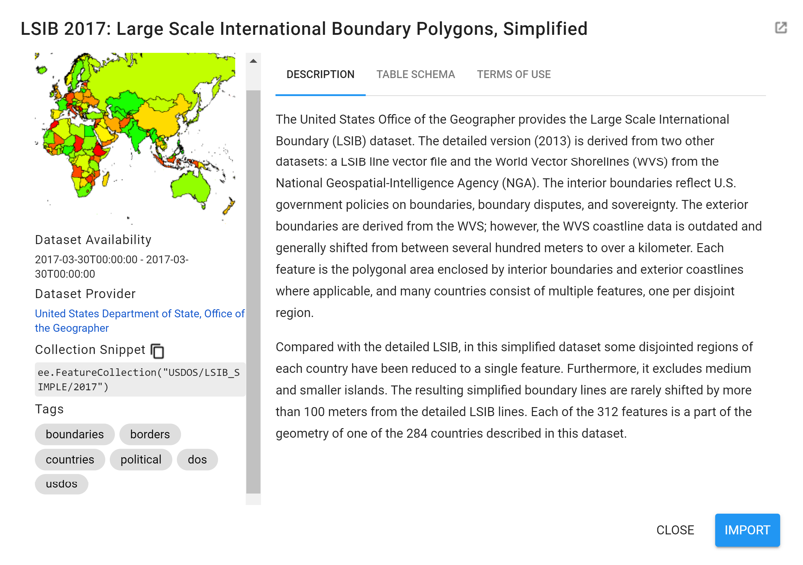
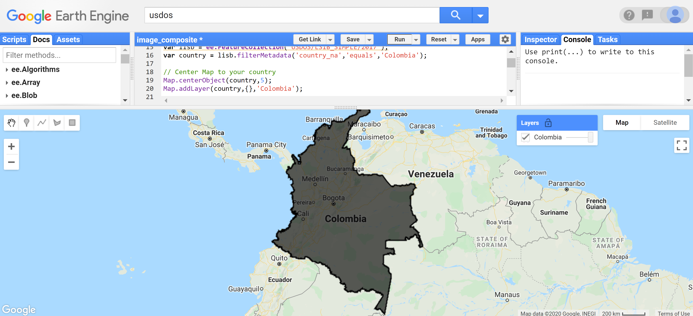
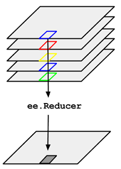
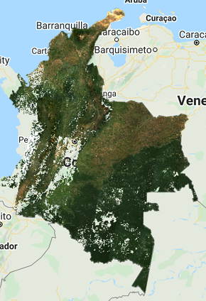
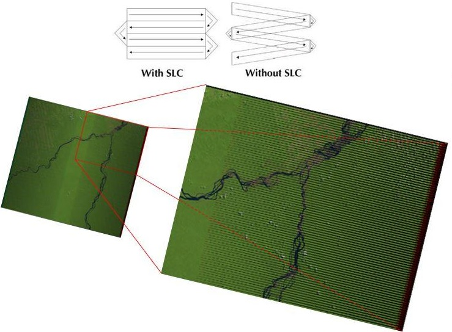
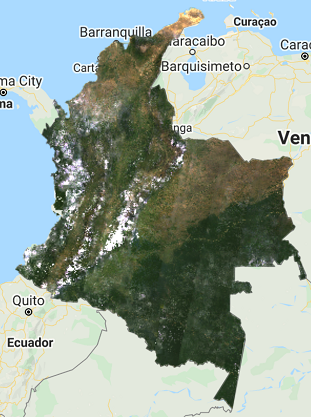
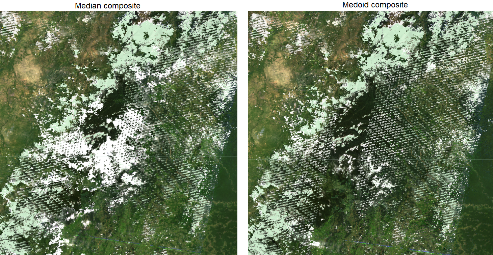
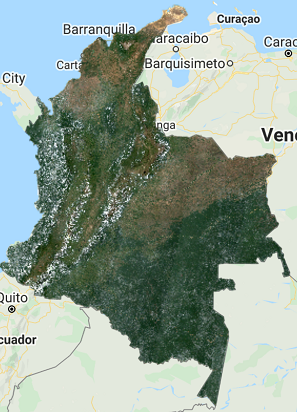
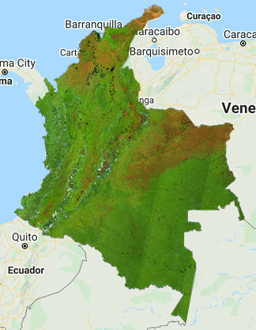
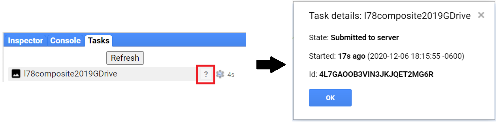

# Création de mosaïques/composites d'images pour Landsat et Sentinel-2 dans Google Earth Engine

##   1 Contexte

Ce tutoriel vous explique comment créer un composite en utilisant l'imagerie Landsat et/ou Sentinel-2 au niveau national dans Google Earth Engine (GEE). Ici, le processus est démontré pour le pays de la Colombie. Le tutoriel est accompagné d'un répertoire GEE qui contient trois scripts, et d'une série de vidéos qui vous guideront à travers certaines des sections. Les scripts vous permettent de créer un composite qui peut être utilisé dans les autres tutoriels sur openMRV. 

## 1.1 Google Earth Engine

L'intérêt de l'utilisation de Google Earth Engine (GEE) est que GEE contient plusieurs pétaoctets d'images satellites et de données géospatiales permettant aux utilisateurs de calculer des analyses à grande échelle dans la plateforme basée sur le cloud. GEE contient un API JavaScript (utilisé dans ce cas) et une API Python, où les utilisateurs peuvent télécharger leurs propres ensembles de données et utiliser les fonctions intégrées pour accomplir une myriade de tâches de télédétection et de géospatial à des vitesses et des échelles sans précédent. Pour plus d'informations sur GEE, veuillez consulter [la page principale sur le moteur Google Earth(https://earthengine.google.com/). Vous y trouverez des tutoriels et de la documentation utiles. Certains liens pertinents sont mis en évidence ci-dessous :

* [Ensembles de données disponibles](https://developers.google.com/earth-engine/datasets/) 
* [FAQ](https://earthengine.google.com/faq/)
* [Démarrer avec GEE](https://developers.google.com/earth-engine/guides/getstarted)
* [Introduction à l'API JavaScript](https://developers.google.com/earth-engine/tutorials/tutorial_api_01)
* [Documentation](https://developers.google.com/earth-engine)
* [référence API](https://developers.google.com/earth-engine/apidocs)
* [Guide de l'éditeur de code](https://developers.google.com/earth-engine/guides/playground)
* [tutoriels communautaires](https://developers.google.com/earth-engine/tutorials)
* [Guide de débogage](https://developers.google.com/earth-engine/guides/debugging)
* [Comment obtenir de l'aide](https://developers.google.com/earth-engine/help)
* [Google Earth Outreach : Introduction à Google Earth Engine](https://www.google.com/earth/outreach/learn/introduction-to-google-earth-engine/)
* Les présentations de Google [2019 Geo for Good Summit](https://sites.google.com/earthoutreach.org/geoforgood19/home) :
  * [Earth Engine for non-coders](https://docs.google.com/presentation/d/10DTcBGPl0JeTEOJlSRNdj9dtGLwqq7HPLzegENygI-U/edit?usp=sharing)
  * [Codage dans le moteur terrestre](https://docs.google.com/presentation/d/1KCOcW1PtFUzC4R2g3pbovtO19C4VPtjRXJxCwkG1b5Q/edit?usp=sharing)
  * [Visite des ensembles de données EE et téléchargement des données](https://docs.google.com/presentation/d/1ODCtpBYLTNCFkFhTMBHmyVBU41XfYzv8WUN7c0dwizc/edit?usp=sharing)
  * [Earth Engine Big Data Structures](https://docs.google.com/presentation/d/1Ksax77YPEvmseush73-6GueGA765KHBNcxuJDE9154k/edit?usp=sharing)


### 1.2 Répertoire

[Ce Répertoire](https://code.earthengine.google.com/?accept_repo=users/openmrv/MRV) contient un sous-dossier appelé "Composite" avec des scripts qui effectuent toutes les opérations que vous apprendrez dans ce tutoriel. Les principaux scripts sont les suivants :

1. L'option `Landsat_Sentinel2_Median` contient toutes les étapes dans l'ordre que vous allez suivre (sauf pour la section 4.2.6 Medoid composite) pour créer des composites médians en utilisant les collections Landsat et Sentinel-2.
2. `Landsat_Sentinel2_Median2` est une version optimisée du script ci-dessus. Il contient toutes les variables utilisateur en haut et les fonctions/codes qui n'ont pas besoin d'être modifiés en bas.
3. `Landsat_Medoid` contient la méthode de composition utilisant le Medoid au lieu du Median pour les collections Landsat.

En outre, vous trouverez deux scripts qui sont une copie du script 2 `Landsat_Sentinel2_Median2` mais qui s'appliquent à deux autres pays : le Mozambique et le Cambodge. Dans le dépôt, ils sont appelés `Mozambique" et "Cambodia`. Ils sont expliqués dans la section 6. Exemples supplémentaires.

Enfin, le script appelé `Video` est le script généré à partir de l'enregistrement des vidéos. Ce script contient toutes les étapes de ce tutoriel, mais avec peu ou pas de documentation écrite.

Nous vous encourageons à suivre les étapes ci-dessous en écrivant vous-même les scripts afin d'avoir une meilleure expérience d'apprentissage, et à n'utiliser les scripts ci-dessus que pour les consulter pendant le tutoriel, ou après avoir compris tous les processus expliqués ici.

### 1.3 Vidéos

Le [canal MRV YouTube](https://www.youtube.com/channel/UCdPooUCxF3HRIWdEh4pwrqQ) contient des vidéos qui vous guident à travers de ce tutoriel et d'autres sur openMRV. Pour ce tutoriel, une vidéo a été créée pour chaque sous-section de la section 3: Création d'une vidéo composite. Veuillez noter que le développement du script dans les vidéos peut ne pas être exactement le même que celui démontré à chaque étape du tutoriel (c'est-à-dire que l'ordre des lignes de code et des noms de variables peut différer, etc. ) et que chaque vidéo est construite sur les précédentes. Dans tous les cas, les mêmes résultats sont produits. Vous trouverez dans chaque section ci-dessous un hyperlien vers la vidéo correspondante. Il est recommandé de parcourir chaque section avant de visionner les vidéos. 


## 2 Objectif du cours

* Apprenez à créer une mosaïque/composite d'images

* Se familiariser avec diverses options, notamment : la sélection des dates, les capteurs et les méthodes de mosaïquage

* Apprendre à exporter la mosaïque / le composite

### 2.1 Pré-requis

* Compréhension de base à intermédiaire des concepts de la télédétection
  * Vous pouvez vous référer à la formation [NASA ARSET's Fundamentals of Remote Sensing](https://appliedsciences.nasa.gov/join-mission/training/english/fundamentals-remote-sensing). Cette formation comprend les bases de la télédétection par satellite, notamment les orbites, les types, les résolutions, les capteurs et les niveaux de traitement des satellites. Il est disponible sur demande et tout le monde peut le suivre (disponible uniquement en anglais)
* Compte Google Earth Engine 
  * Tout le monde peut s'inscrire à Google Earth Engine. GEE est gratuit pour une utilisation non commerciale. Pour vous inscrire, veuillez remplir [ce formulaire](https://earthengine.google.com/signup/). Une fois que vous aurez été accepté, vous recevrez un courriel contenant des informations supplémentaires
* Connaissances de base et intermédiaires en programmation
  * Voir les tutoriels et informations utiles sur la programmation JavaScript GEE dans la section 3 de Google Earth Engine
* Le GEE fonctionne mieux avec [le navigateur Google Chrome](https://www.google.com/chrome/)


## 3 Création d'un composite

Le déroulement général du processus de ce tutoriel est présenté ci-dessous : 


Passons maintenant à chacune de ces étapes. Ouvrez l'éditeur de code en tapant [https://code.earthengine.google.com](https://code.earthengine.google.com) dans votre navigateur web. 

Sur le côté gauche de l'éditeur de code se trouve l'onglet **Docs**, qui contient la documentation complète de l'API JavaScript. La documentation peut être recherchée et parcourue à partir de l'onglet Docs. Toutes les fonctions GEE utilisées dans ce tutoriel se trouvent dans l'onglet Docs.

Veuillez noter que dans ce tutoriel spécifique, nous allons créer un composite de la médiane de 2019 pour le pays de la Colombie à des fins de démonstration. Ce tutoriel ne garantit pas que les méthodes présentées s'adapteront parfaitement à chaque cas d'utilisateur (c'est-à-dire qu'elles produiront le meilleur composite). On peut, et on doit, tester différentes périodes de temps, différents domaines d'étude et différentes méthodes.

### 3.1 Zone d'intérêt

> Les étapes suivantes sont démontrées dans le script `1_Landsat_Sentinel2_Median`.  
> [Instructions vidéo](https://youtu.be/KoEJW1i-v_w)

Pour commencer, nous devons définir notre domaine d'intérêt. Nous utiliserons le [jeu de données simplifié sur la frontière internationale à grande échelle (2017)](https://developers.google.com/earth-engine/datasets/catalog/USDOS_LSIB_SIMPLE_2017) du Département d'État américain (USDOS) qui contient des polygones pour tous les pays du monde. Dans GEE, cet ensemble de données est une "FeatureCollection", c'est-à-dire un groupe de caractéristiques. Vous pouvez considérer les caractéristiques comme vos données vectorielles. Vous pouvez trouver des informations sur la `FeatureCollection` [ici](https://developers.google.com/earth-engine/guides/feature_collections).

Cherchez "USDOS" dans la case *Recherche* de l'éditeur de code et cliquez sur "LSIB 2017" : Large Scale International Boundary Polygons, Simplified".


Une fenêtre popup affichera la description, le schéma du tableau (propriétés) et les conditions d'utilisation de cet ensemble de données.



Copiez et collez le code ci-dessous pour créer une variable pour cet ensemble de données.

```javascript
var lsib = ee.FeatureCollection("USDOS/LSIB_SIMPLE/2017");
```

> REMARQUE : Vous pouvez également ajouter **tout** ensemble de données GEE à votre script en cliquant sur le bouton *IMPORT* à côté de l'ensemble de données. L'ensemble de données importé apparaîtra en haut de l'éditeur de code sous *Imports* comme une variable avec un nom par défaut "image" pour les images, "imageCollection" pour les collections d'images, "géométry" pour les géométries, "table" pour les collections d'éléments, etc. Vous pouvez changer ce nom en cliquant sur le nom par défaut (dans ce cas "table") et en écrivant le nouveau nom.

Maintenant, filtrons cette "FeatureCollection" pour ne retenir que le polygone de la Colombie. Pour ce faire, nous utiliserons la fonction "FilterMetadata" de GEE. Une des propriétés du jeu de données de la LSIB est appelée `country_na` et représente le nom du pays (reconnu par les Etats-Unis) pour chaque polygone. Par conséquent, nous filtrerons notre variable `lsib` par `country_na` qui est égale à "Colombie". Copiez et collez le code ci-dessous pour créer une variable `country` pour les frontières de la Colombie.

```javascript
var country = lsib.filterMetadata('country_na','equals','Colombia');
```

Pour visualiser cette limite, vous pouvez utiliser la fonction "Map.addLayer". Mais auparavant, vous devez centrer la carte sur cette zone d'intérêt en utilisant la fonction `Map.centerObject`. Copiez et collez le code ci-dessous pour définir le centre de la carte au-dessus de la Colombie et ajoutez le polygone "pays" de la Colombie à la carte. Cliquez sur *Run* pour voir les résultats. Vous verrez que sous le panneau *Layers* vous aurez une couche nommée "Colombia".

```javascript
Map.centerObject(country,5);
Map.addLayer(country,{},'Colombia');
```




> NOTE : Ajustez le niveau de zoom selon vos préférences en changeant le chiffre "5" par un chiffre compris entre 1 et 24. Plus le chiffre est élevé, plus la carte est zoomée. Vous pouvez utiliser le curseur sous le panneau *Layers* de la carte pour modifier l'opacité de la couche.
>
> NOTE 2 : La fonction `Map.addLayer` peut prendre 5 arguments différents :
>
> * 'eeObject' : L'objet à ajouter à la carte (dans ce cas, la variable "pays").
> * `visParams` : Les paramètres de visualisation. Ceux-ci sont expliqués plus loin. Dans l'exemple ci-dessus, nous avons laissé ces paramètres vides.
> * `name` : Le nom de la couche (une chaîne de caractères, dans notre cas : "Colombia").
> * "montré" : Un drapeau indiquant si la couche doit être activée par défaut (Cela peut être très utile pour tester différentes approches et avoir plusieurs couches). Il s'agit d'un argument booléen et sa valeur par défaut est "True".
> * "opacity" : L'opacité de la couche est représentée par un nombre entre 0 et 1, la valeur par défaut étant 1.


### 3.2 Collection Landsat 

#### 3.2.1 A commencer par Landsat 8

> [Video Instructions](https://youtu.be/J6o6NLqsobw)

Nous allons commencer à créer un composite à partir de la collection Landsat 8. Tout d'abord, définissons deux variables temporelles que nous appellerons "startDate" et "endDate". Ici, nous allons créer un composite pour l'année 2019, donc utilisez le code bock ci-dessous pour définir les variables temporelles. Les objets de date sont par défaut au format "AAAA-MM-JJ".

```javascript
var startDate = '2019-01-01';
var endDate = '2019-12-31';
```

Maintenant, définissons notre variable de collection Landsat 8. Nous utiliserons le produit [USGS Landsat 8 Surface Reflectance Tier 1](https://developers.google.com/earth-engine/datasets/catalog/LANDSAT_LC08_C01_T1_SR) dans GEE. Ce jeu de données est la réflectance de la surface corrigée par rapport à l'atmosphère des capteurs OLI/TIRS de Landsat 8. Ces images contiennent 5 bandes dans le visible et le proche infrarouge (VNIR) et 2 bandes dans l'infrarouge à ondes courtes (SWIR) traitées pour obtenir une réflectance de surface orthorectifiée, et deux bandes dans l'infrarouge thermique (TIR) traitées pour obtenir une température de luminosité orthorectifiée.

```javascript
var l8 = ee.ImageCollection('LANDSAT/LC08/C01/T1_SR');
```

> NOTE : Si vous essayez d' 'imprimer' cette collection, un message d'erreur sera renvoyé dans la console. Cette collection contient l'ensemble des archives Landsat 8 de 2013 à nos jours pour l'ensemble du globe. Toute requête d'impression de la collection sera abandonnée après avoir accumulé les métadonnées de plus de 5 000 éléments.

Ensuite, nous allons filtrer cette collection en fonction de notre zone d'intérêt (Colombie, "var country") et de la période (débutDate, finDate). Nous utiliserons les fonctions `filterBounds` et `filterDate`.

```javascript
var l8Filt = l8.filterBounds(country)
			   .filterDate(startDate,endDate);
```

Print `l8Filt` pour voir votre collection filtrée. Cliquez sur *Run* après avoir ajouté la ligne ci-dessous. La *Console* indiquera que la collection compte 956 images.

```javascript
print('L8 SR collection filtered',l8Filt);
```


Avec votre collection filtrée, créez un composite en utilisant un réducteur de médiane. Nous utiliserons la fonction `median()` pour `ee.ImageCollection` et la fonction `clip()` pour découper le composite dans la zone d'intérêt. 

La fonction `median()` pour `ee.ImageCollection` est ce qu'on appelle dans GEE un `ee.Reducer`, et nous utilisons spécifiquement le réducteur `ee.Reducer.median()`. Les réducteurs sont le moyen utilisé par GEE pour agréger des données dans le temps, l'espace, les bandes, les tableaux et autres structures de données. La figure ci-dessous montre une collection d'images "reduced" à une image individuelle par un "ee.Reducer" :



Dans notre cas, nous prenons la médiane sur la série chronologique (notre collection).  La sortie est calculée pixel par pixel, de sorte que chaque pixel de la sortie est composé de la valeur médiane de toutes les images de la collection à cet endroit. Vous pouvez également tester en utilisant la moyenne `mean()`, le minimum `min()`, etc, comme réducteurs au lieu de la médiane.

> Pour plus d'informations et d'exemples sur les Réducteurs, et plus particulièrement sur la réduction d'une collection d'images, veuillez consulter ces pages :
>
> * [Aperçu des réductions](https://developers.google.com/earth-engine/guides/reducers_intro)
> * [Réduction de la collection d'images](https://developers.google.com/earth-engine/guides/reducers_image_collection)
> * [Réduction d'une collection d'images](https://developers.google.com/earth-engine/guides/ic_reducing)
> * [Compositing, Masking, and Mosaicking](https://developers.google.com/earth-engine/tutorials/tutorial_api_05)

Copiez et collez le code ci-dessous et cliquez sur *Run*. Le résultat sera une "ee.Image".

```javascript
var composite = l8Filt.median().clip(country);

Map.addLayer(composite,{bands:['B4','B3','B2'],min:300,max:3000},
             'L8 Composite 2019');

print('L8 composite 2019',composite);
```

> NOTE : Il existe un certain nombre d'options disponibles pour ajuster la façon dont les images sont affichées en utilisant la fonction "Map.addLayer". Celles-ci vont dans l'argument `visParams` de la fonction `Map.addLayer`. Les entrées qui sont le plus souvent utilisées pour modifier les paramètres d'affichage sont les suivantes :
>
> * Bands : permet à l'utilisateur de spécifier les bandes à rendre en rouge, vert et bleu. Dans le cas ci-dessus, nous utilisons les bandes B4, B3 et B2 de Landsat 8 qui correspondent respectivement aux bandes rouge, verte et bleue.
> * Min et max : définit la gamme d'étirement des couleurs. L'étendue dépend du type de données. Par exemple, les images 16 bits non signées ont une plage totale de 0 à 65 536. Cette option vous permet de régler l'affichage sur un sous-ensemble de cette plage. Dans ce cas, nous définissons un minimum de 300 et un maximum de 3000 et ceux-ci correspondent aux valeurs de réflectance de la surface.
> * Palette : spécifie la palette de couleurs utilisée pour afficher les informations. Non utilisée dans ce cas.
>
> Vous pouvez tester les paramètres de visualisation en cliquant sur l'icône de l'engrenage à côté de la couche "Composite 2019" et en jouant avec les options d'étirement.
>
> 

>
> 
>
> 

Vous devriez voir une image très nuageuse dans la carte comme celle ci-dessus. Essayons d'ajouter un pré-filtre pour les nuages lors du filtrage de notre collection. La collection Landsat est fournie avec une propriété nommée `CLOUD_COVER`, et nous pouvons définir un pourcentage de couverture nuageuse comme seuil pour filtrer les scènes. Nous utiliserons la fonction `filterMetadata` pour filtrer les images dont la couverture nuageuse est inférieure à 50%. Copiez et collez le code ci-dessous et cliquez sur *Run*.

```javascript
var l8Filt2 = l8.filterBounds(country)
               .filterDate(startDate,endDate)
               .filterMetadata('CLOUD_COVER','less_than',50);

print('Landsat 8 SR collection filtered for clouds',l8Filt2);

var composite2 = l8Filt2.median().clip(country);

Map.addLayer(composite2,{bands:['B4','B3','B2'],min:300,max:3000},
             'L8 composite 2019 pre cloud filter');

print('L8 composite 2019 pre cloud filter',composite2);
```

Vous verrez que ce nouveau composite est légèrement meilleur que le précédent mais reste très nuageux. Dans la Console, notez également que la nouvelle collection compte 454 images contre 956 dans la précédente non filtrée par le nuage.


Essayez d'ajuster le seuil de `CLOUD_COVER` à différents pourcentages et vérifiez les résultats. Exemple : avec 20% comme seuil, vous pouvez voir que de nombreuses régions du pays ont des lacunes en matière d'image. De plus, certaines tuiles, même avec un filtre de nuages, présentent encore une couverture nuageuse de grande surface.


Cela est dû à la persistance d'une couverture nuageuse dans certaines régions de Colombie. Nous pouvons appliquer un masque de nuage pour améliorer les résultats. Les collections Landsat 8 contiennent une bande ["Quality Assessment (QA)"](https://www.usgs.gov/core-science-systems/nli/landsat/landsat-collection-1-level-1-quality-assessment-band?qt-science_support_page_related_con=0#qt-science_support_page_related_con) appelée `pixel_qa` qui fournit des informations utiles sur certaines conditions des données, et permet aux utilisateurs d'appliquer des filtres par pixel. Chaque pixel de la bande AQ contient des entiers non signés qui représentent des combinaisons binaires de conditions de surface, atmosphériques et de capteurs. Les bits 3 et 5, qui représentent respectivement l'ombre des nuages et les nuages, sont particulièrement intéressants. 

Nous allons créer une "function" pour appliquer un masque de nuage à chaque image de la collection d'images en utilisant la fonction de collection d'images "map". Copiez et collez le code ci-dessous et cliquez sur *Run*.

```javascript
function maskL8srClouds(image) {
  // Les bits 3 et 5 sont respectivement l'ombre et le nuage.
  var cloudShadowBitMask = (1 << 3);
  var cloudsBitMask = (1 << 5);
  // Obtenez la bande d'assurance qualité des pixels.
  var qa = image.select('pixel_qa');
  // Les deux drapeaux doivent être mis à zéro, ce qui indique des conditions claires.
  var mask = qa.bitwiseAnd(cloudShadowBitMask).eq(0)
                .and(qa.bitwiseAnd(cloudsBitMask).eq(0));
  return image.updateMask(mask);
}

var l8FiltMasked = l8.filterBounds(country)
                .filterDate(startDate,endDate)
                .filterMetadata('CLOUD_COVER','less_than',50)
                .map(maskL8srClouds);

print('L8 SR collection filtered and masked', l8FiltMasked);

var l8compositeMasked = l8FiltMasked.median().clip(country);

print('L8 composite 2019 masked', l8compositeMasked);

Map.addLayer(l8compositeMasked,
             {bands:['B4','B3','B2'],min:0,max:2000},
             'L8 composite 2019 masked');
```

> NOTE : Comme nous traitons de Bits, dans la fonction `maskL8srClouds(image)` nous avons utilisé l'opérateur de décalage à gauche `<<` pour décaler le premier opérande du nombre spécifié de bits vers la gauche, et la fonction `bitwiseAnd` pour calculer le bitwise AND des valeurs d'entrée. Pour plus de détails, consultez :
>
> * Bits: [Observatoire de la Terre - Pixels et bits de télédétection](https://earthobservatory.nasa.gov/features/RemoteSensing/remote_06.php), [NASA Earthdata - What is Remote Sensing ?](https://earthdata.nasa.gov/learn/backgrounders/remote-sensing), [National University of Singapore - Digital Image](https://crisp.nus.edu.sg/~research/tutorial/image.htm)
> * [Opérateur du quart de gauche en JavaScript](https://developer.mozilla.org/en-US/docs/Web/JavaScript/Reference/Operators/Left_shift)
> * [fonction GEE `bitwiseAnd`](https://developers.google.com/earth-engine/apidocs/ee-image-bitwiseand)




Le composite qui en résulte montre des nuages masqués et constitue une grande amélioration par rapport aux composites précédents. Cependant, les lacunes dans les données restent un problème en raison de la couverture nuageuse. Si vous n'avez pas spécifiquement besoin d'un composite annuel, vous pouvez créer un composite sur deux ans pour essayer d'atténuer le problème des données manquantes. Nous allons essayer de le faire.

> NOTE : A ce stade, vous avez probablement remarqué que les couches prennent un certain temps à charger, c'est-à-dire que le script est globalement "plus lent". Pour éviter d'attendre trop longtemps pour vérifier les résultats, et de tomber sur une erreur du genre la "Capacité mémoire dépassée de Google Earth Engine", vous pouvez commenter certaines des instructions "print" et "Map.addLayer", et/ou des variables non utilisées en ajoutant des doubles barres obliques en début de ligne **ou** en cliquant sur la ligne souhaitée et en appuyant sur *Ctrl + /*. Utilisez cette stratégie tout au long du reste de ce tutoriel et n'imprimez et n'ajoutez des couches à la carte des composites souhaités, ou pour vérifier les erreurs intermédiaires si vous en rencontrez une.
>
> Exemple visuel d'extrait de code non commenté :
>
> ```javascript
> var composite = l8Filt.median().clip(country);
> 
> Map.addLayer(composite,{bands:['B4','B3','B2'],min:300,max:3000},'Composite 2019');
> 
> print('L8 composite 2019',composite);
> ```
>
> Exemple visuel d'extrait de code commenté :
>
> ```javascript
> // var composite = l8Filt.median().clip(country);
> // Map.addLayer(composite,{bands:['B4','B3','B2'],min:300,max:3000},'Composite 2019');
> 
> // print('L8 composite 2019',composite);
> ```
> 
>NOTE 2 : Vous pouvez également régler l'argument "shown" dans les fonctions "Map.addLayer" sur "False" afin que les couches ne soient pas activées automatiquement lorsqu'elles sont ajoutées à la carte.

#### 3.2.2 Ajout d'une année supplémentaire de données

> [Video Instructions](https://youtu.be/Q5cjLW_yf7k)

Nous allons créer une nouvelle variable "l8TwoYearComposite" qui sera notre composite Landsat 8 sur deux ans. Nous allons filtrer la collection Landsat 8 avec une date de début différente cette fois-ci (`2018-01-01`) pour inclure des images de 2018 et 2019, appliquer la fonction de masque de nuage, puis appliquer le réducteur médian pour obtenir le composite, et enfin découper le pays de la Colombie. Copiez et collez le code ci-dessous et cliquez sur *Run* :

```javascript
// Incorporation des données de 2018
// Créer un composite sur deux ans en filtrant les données Landsat 8 en 2018 et 2019,
// appliquer le masque de nuage, le réducteur de médiane, et découper par pays
var l8TwoYearComposite = l8.filterBounds(country)
                .filterDate('2018-01-01',endDate) // la date initial est 2018-01-01
                .filterMetadata('CLOUD_COVER','less_than',60)
                .map(maskL8srClouds)
                .median()
                .clip(country);

Map.addLayer(l8TwoYearComposite,{bands:['B4','B3','B2'],min:0,max:2000},'Landsat 8 Two-Year composite');
```

s

L'image qui en résulte présente beaucoup moins de lacunes. Encore une fois, si la période de temps n'est pas une contrainte pour la création de votre composite, vous pouvez incorporer plus d'images à partir d'une troisième année, et ainsi de suite.

Une autre option pour améliorer les lacunes dans les données consiste à faire appel à des images provenant d'autres capteurs pour la période qui vous intéresse. Heureusement, la [collection Landsat couvre différentes missions] (https://www.usgs.gov/core-science-systems/nli/landsat/landsat-satellite-missions?qt-science_support_page_related_con=2#qt-science_support_page_related_con), qui ont acquis en continu des données ininterrompues depuis 1972 à différentes dates d'acquisition. Ensuite, nous allons essayer d'intégrer des images Landsat 7 de 2019 pour combler les lacunes du composite Landsat 8 de 2019, à des fins de démonstration.

#### 3.2.3 Ajout de la collection Landsat 7

> [Video Instructions](https://youtu.be/vu61q6vsno8)

Comme Landsat 8, nous utiliserons le produit [USGS Landsat 7 Surface Reflectance Tier 1](https://developers.google.com/earth-engine/datasets/catalog/LANDSAT_LE07_C01_T1_SR) dans GEE. Ce jeu de données est la réflectance de surface corrigée de l'atmosphère du capteur ETM+ de Landsat 7. Ces images contiennent 4 bandes dans le visible et le proche infrarouge (VNIR) et 2 bandes dans l'infrarouge à ondes courtes (SWIR) traitées pour obtenir une réflectance de surface orthorectifiée, et une bande dans l'infrarouge thermique (TIR) traitée pour obtenir une température de luminosité orthorectifiée. 

Voyons d'abord à quoi ressemblerait un composite Landsat 7, dans un souci de compréhension et d'exhaustivité.

Les étapes suivantes sont très similaires à celles que nous avons réalisées pour Landsat 8. Tout d'abord, définissez votre variable de collection Landsat 7.

```javascript
var l7 = ee.ImageCollection('LANDSAT/LE07/C01/T1_SR');
```

Nous allons immédiatement appliquer un masque de nuage à cette collection puisque nous avons vu que la Colombie a une couverture nuageuse constante. Définissons la fonction de masque de nuage pour Landsat 7.

```javascript
function maskL7srClouds(image) {
  var qa = image.select('pixel_qa');
 // Si le bit du nuage (5) est réglé et que la confiance dans le nuage (7) est élevée
  // ou le bit d'ombre du nuage est activé (3), alors c'est un mauvais pixel.
  var cloud = qa.bitwiseAnd(1 << 5)
                  .and(qa.bitwiseAnd(1 << 7))
                  .or(qa.bitwiseAnd(1 << 3));
  // Supprimer les pixels de bordure qui n'apparaissent pas dans toutes les bandes
  var maskL7 = image.mask().reduce(ee.Reducer.min());
  return image.updateMask(cloud.not()).updateMask(maskL7);
}
```

Filtrons la collection Landsat 7 avec les mêmes filtres que ceux utilisés pour Landsat 8, appliquons le masque de nuage et créons le composite Landsat 7.

```javascript
var l7FiltMasked = l7.filterBounds(country)
                .filterDate(startDate,endDate)
                .filterMetadata('CLOUD_COVER','less_than',50)
                .map(maskL7srClouds);

print('L7 SR collection masked',l7FiltMasked);

var l7compositeMasked = l7FiltMasked.median().clip(country);

Map.addLayer(l7compositeMasked,{bands:['B3','B2','B1'],min:0,
                                max:2000},'L7 composite 2019 masked');
```

> NOTE : Nous avons utilisé des "bandes : [B3], [B2], [B1]" cette fois-ci parce que Landsat 7 a des désignations de bandes différentes. Les capteurs à bord de chacun des satellites Landsat ont été conçus pour acquérir des données dans différentes gammes de fréquences le long du spectre électromagnétique. Alors que pour Landsat 8, les bandes rouge, verte et bleue sont respectivement B4, B3 et B2, pour Landsat 7, ces mêmes bandes sont respectivement B3, B2 et B1. Pour plus d'informations, veuillez consulter [cette page](https://www.usgs.gov/faqs/what-are-band-designations-landsat-satellites?qt-news_science_products=0#qt-news_science_products)


Vous devriez voir une image avec de nombreuses lacunes comme celle ci-dessus. Landsat 7 a été lancé en 1999, mais depuis 2003, le capteur a acquis et livré des données avec des lacunes causées par la défaillance du correcteur de ligne de balayage (SLC). Sans SLC opérationnel, la ligne de visée du capteur trace un motif en zigzag le long de la trace au sol du satellite, et, par conséquent, la zone imagée est dupliquée. Lorsque les données de niveau 1 sont traitées, les zones dupliquées sont supprimées, ce qui laisse des lacunes dans les données. Pour plus d'informations sur Landsat 7 et l'erreur SLC, veuillez vous référer à [cette page] (https://www.usgs.gov/core-science-systems/nli/landsat/landsat-7?qt-science_support_page_related_con=0#qt-science_support_page_related_con).




Cependant, même avec l'erreur SLC, nous pouvons toujours utiliser les données Landsat 7 dans notre composite. Maintenant, combinons les collections Landsat 7 et 8.

#### 3.2.4 Combinaison des deux capteurs en un seul

> [Video Instructions](https://youtu.be/COobcYDThxo)

Comme mentionné précédemment, Landsat 7 et 8 ont des désignations de bandes différentes. Commençons donc par créer une fonction permettant de renommer les bandes de Landsat 7 pour qu'elles correspondent à celles de Landsat 8 et associons cette fonction à notre collection L7. 

```javascript
// Puisque Landsat 7 et 8 ont des désignations de bandes différentes,
// créons une fonction permettant de renommer les bandes L7 pour qu'elles correspondent à L8.
function rename(image){
  return image.select(
    ['B1', 'B2', 'B3', 'B4', 'B5', 'B7'],
    ['B2', 'B3', 'B4', 'B5', 'B6', 'B7']);
}

// Appliquer la fonction de renommage
var l7FiltMaskedRenamed = l7FiltMasked.map(rename);

print('L7 SR collection renamed',l7FiltMaskedRenamed);
```

> NOTE : Si vous vérifiez les bandes des premières images des collections `l7FiltMasked` et `l7FiltMaskedRenamed`, vous verrez que les noms des bandes ont été renommés, et que toutes les bandes n'ont pas été copiées (`sr_atmos_opacity`, `sr_cloud_qa`, `pixel_qa`, `radsat_qa`, et `B6`). Pour copier ces bandes supplémentaires, il suffit de les ajouter à la fonction de renommage (pour `B6`, vous devrez le renommer afin qu'il n'ait pas le même nom que la nouvelle bande 5). L'image ci-dessous montre les bandes de la première image de la collection Landsat 7 sur la gauche, et les bandes de la première image de la collection Landsat 7 renommée sur la droite.
>
> 
>
> 

Maintenant, nous fusionnons les deux collections. Nous utiliserons la fonction "merge" pour "imageCollection". Copiez et collez le code ci-dessous et cliquez sur *Run*. Vous verrez dans la console que vous avez maintenant une collection de 999 images (563 de Landsat 8 et 436 de Landsat 7).

```javascript
// Fusionner les collections Landsat
var l78 = l7FiltMaskedRenamed.merge(l8FiltMasked);
print('Merged collections',l78);
```


Maintenant, pour créer le composite, nous faisons la même chose qu'auparavant. Notez que si vous exécutez le code ci-dessous, vous rencontrerez une erreur :

```javascript
// Créer une image composite Landsat 7 et 8 et l'ajouter à la carte
var l78composite = l78.median().clip(country); // vous pouvez tester le                                                             //.min() ou le .max() ou la .mean()
Map.addLayer(l78composite,{bands:['B4','B3','B2'],min:0,max:2000},
             'Landsat 7 and 8 composite');
```


En effet, la collection Landsat 7 compte 6 bandes et la collection Landsat 8 en compte 12. Pour être mosaïquées et ajoutées à la carte, elles doivent avoir le même nombre de bandes. Nous allons modifier le bloc de code que nous fusionnons les deux collections pour ajouter une fonction "select" à la collection Landsat 8. La fonction "select" sélectionnera des bandes spécifiques dans les images. Nous ne sélectionnerons que les bandes disponibles dans la collection Landsat 7. Par conséquent, changez la procédure de fusion en :

```javascript
// Fusionner les collections Landsat
var l78 = l7FiltMaskedRenamed.merge(l8FiltMasked
          .select('B2','B3','B4','B5','B6','B7'));
print('Merged collections',l78);

// Créer une image composite Landsat 7 et 8 et l'ajouter à la carte
var l78composite = l78.median().clip(country); // vous pouvez tester le                                                              //.min() ou le .max() ou la .mean()
Map.addLayer(l78composite,{bands:['B4','B3','B2'],min:0,max:2000},
             'Landsat 7 and 8 2019 composite');
```

Vous devriez voir une image composite qui ressemble à ceci :


Par rapport au précédent composite Landsat 8 uniquement, vous pouvez constater que certaines lacunes ont été comblées. Cependant, en raison de la nature générale de la mosaïque et du composite, et de l'erreur SLC de Landsat 7, vous pouvez également voir quelques artefacts dans certaines régions. Exemple au centroïde Latitude : 1,46, Longitude : -69,99. Composite Landsat 8 uniquement (à gauche) et composite Landsat 7 et 8 (à droite) pour 2019 :


#### 3.2.5 Tenter de combler les lacunes par des fonctions de moyenne (ou de médiane) focale

> [Video Instructions](https://youtu.be/hYtoWeVwoKs)

Nous pouvons essayer de combler les lacunes en utilisant une fonction de moyenne focale ou de médiane focale pour les images de la collection. Celles-ci appliquent un filtre morphologique à chaque bande d'une image en introduisant les pixels dans un noyau personnalisé, puis en appliquant un mélange. Pour plus d'informations sur les fonctions focales de GEE, consultez [cette page] (https://developers.google.com/earth-engine/guides/image_morph). Sur le même script, ajoutons le bloc de code ci-dessous. Tout d'abord, nous créons une fonction pour appliquer la fonction `focal_mean` (ou `focal_median`) à chaque image de la collection Landsat 7, puis nous fusionnons les collections comme précédemment, et nous créons le composite. 

> NOTE : La fonction `focal_mean` contient 5 arguments d'entrée : 'Rayon', 'Type de noyau', 'Unités', 'Itérations' et 'Noyau'. Vous pouvez trouver des informations sur chacun d'eux en recherchant la moyenne focale dans l'onglet *Docs* (et sur toute fonction GEE). Pour cet exemple, nous avons défini un rayon de 1,5, un type de noyau carré, un noyau de pixels, et 2 itérations. Vous pouvez tester avec différentes variables. Plus ces valeurs sont grandes, plus les données sont floues.
>


```javascript
// Fonction permettant de combler les lacunes de l'erreur SLC en utilisant la moyenne focale  
function fillGap(image){
  return image.focal_mean(1.5, 'square', 'pixels', 2).blend(image);
}

// Appliquer la fonction fillGap à la collection Landsat 7 et fusionner avec la collection Landsat 8
var l78Fill = l7FiltMaskedRenamed.map(fillGap).merge(l8FiltMasked
              .select('B2','B3','B4','B5','B6','B7'));

// Créer un composite
var l78compositeFill = l78Fill.median().clip(country); // vous pouvez tester le                                                         //.min() ou le .max() ou la .mean()

Map.addLayer(l78compositeFill,{bands:['B4','B3','B2'],min:0,
                               max:2000},'Landsat 7 and 8 2019 composite focal fill');
```

Vous devriez voir un composite comme celui ci-dessous. Dans ce cas particulier, il peut être utile de ne pas appliquer cette méthode car elle "crée" de nouveaux pixels qui ressemblent à des nuages et la méthode précédente fait un meilleur travail. Cependant, pour d'autres régions, où la couverture nuageuse est moins importante, cette étape supplémentaire pourrait être utile.



#### 3.2.6 Composite Médoïde

>  Les étapes suivantes sont démontrées dans le script `3_Landsat_Medoid`.
>
>  [Instructions vidéo](https://youtu.be/0cVKrY0IAYY)

Un médoïde est un objet représentatif d'un ensemble de données dont la dissimilitude moyenne avec tous les objets d'un groupe est minimale. L'approche du médaillon dans le contexte de la télédétection a été introduite par [Flood (2013)](https://www.mdpi.com/2072-4292/5/12/6481). Pour un pixel d'image donné, le medoïde est la valeur pour une bande donnée qui est numériquement la plus proche de la médiane de tous les pixels correspondants parmi les images considérées (toutes les images de la collection). Nous utilisons l'approche medoid pour trouver les meilleurs pixels disponibles pour le compositing, et comme alternative aux composites médians. Le processus nécessite peu de logique, est robuste et rapide. Vous pouvez considérer le médaillon comme une médiane multidimensionnelle. Veuillez consulter [Flood (2013)](https://www.mdpi.com/2072-4292/5/12/6481), et/ou [Roberts et al. (2017)](https://ieeexplore.ieee.org/stamp/stamp.jsp?arnumber=8004469) pour une explication plus approfondie de l'approche par la médiane.

Nous calculons d'abord la différence entre la médiane et l'observation par image et par bande, puis nous obtenons la médiane en sélectionnant le pixel de l'image présentant la plus petite différence entre la médiane et l'observation par bande. Nous allons créer un composite de la médiane pour la collection fusionnée de Landsat de 2019 (`var l78`). Copiez et collez le code ci-dessous et vérifiez les résultats sur la carte.

```javascript
// Calculer la médiane des images de la collection par bande
var l78median = l78.median(); 

// on calcule la médiane de la collection annuelle d'images - on obtient 
// une seule image à 6 bandes - la médiane de la collection par bande.

var l78medoidComposite = l78.map(function(image) {
  var diff = ee.Image(image).subtract(l78median).pow(ee.Image.constant(2)); 
    // obtenir la différence entre chaque bande de l'image et la médiane de la 
    // bande correspondante et eléverle tout à la puissance 2 pour rendre les valeurs
    // positives et donner plus de poids aux différences plus importantes
   
  return diff.reduce('sum').addBands(image); 
    // pour chaque image de la collection, additionnez la différence de 
    // puissance entre les bandes  a la collection- définissez ceci comme la 
    // première bande et ajoutez-y les bandes SR - vous avez maintenant une 
    // collection d'images à 7 bandes. 
}).reduce(ee.Reducer.min(7)).select([1,2,3,4,5,6], ['B2','B3','B4','B5','B6','B7']) 

// trouver la différence de puissance qui est la plus faible - quel objet de l'image // est le plus proche de la médiane de la collection - puis subdiviser les bandes SR // et les nommer - laisser de côté la bande de différence de puissance ;

  .clip(country); 
  
Map.addLayer(l78medoidComposite,{bands:['B4','B3','B2'],min:0,max:2000},'L7&8 Medoid composite 2019');
```


Vous devriez voir une image comme celle ci-dessus. À première vue, vous pourriez penser qu'il n'y a pas beaucoup de différence par rapport à la médiane composite. Cependant, le composite médian peut montrer des améliorations significatives pour certains pixels. Voir l'exemple ci-dessous pour le point (2,86, -74,73) où les zones nuageuses de la médiane sont mieux représentées dans le composite de la médiane.




Maintenant, créons un composite médian de 2019 avec le jeu de données Copernicus Sentinel-2 de l'Agence spatiale européenne (ESA). Sentinel-2 est une mission d'imagerie multispectrale à large bande et à haute résolution qui soutient les études de surveillance des terres de Copernicus, y compris la surveillance de la végétation, du sol et de la couverture de l'eau, ainsi que l'observation des voies navigables intérieures et des zones côtières. 

### 3.3 Collection Sentinel-2

> Les étapes suivantes sont démontrées dans le script `1_Landsat_Sentinel2_Median`.
>
> [Instructions vidéo](https://youtu.be/13plGNvnmkI)

Commençons par définir notre variable de collection d'images Sentinel-2. Nous utiliserons le produit [Sentinel-2 MSI : MultiSpectral Instrument, Level-2A](https://developers.google.com/earth-engine/datasets/catalog/COPERNICUS_S2_SR) en GEE de l'Agence spatiale européenne, qui est le produit du fond de l'atmosphère (c'est-à-dire la réflectance de la surface). 

```javascript
// Nous utiliserons le produit Sentinel-2 Surface Reflection.
// Cet ensemble de données a déjà été corrigé sur le plan atmosphérique
var s2 = ee.ImageCollection("COPERNICUS/S2_SR");
```

> NOTE : Les données de Sentinel-2 L2 dans GEE sont téléchargées à partir du site [scihub](https://scihub.copernicus.eu/) de l'ESA. Elles ont été calculées en exécutant [sen2cor](https://step.esa.int/main/third-party-plugins-2/sen2cor/). Les ressources contiennent 12 bandes spectrales UINT16 représentant la RS à l'échelle de 10000 (contrairement aux données L1, il n'y a pas de B10). Il existe également plusieurs autres bandes spécifiques à la L2 (voir la liste des bandes pour plus de détails). Voir le [Manuel de l'utilisateur Sentinel-2] (https://sentinel.esa.int/documents/247904/685211/Sentinel-2_User_Handbook) pour plus de détails. En outre, trois bandes d'assurance qualité sont présentes, dont une (QA60) est une bande de masque de bits avec des informations de masque de nuages. Pour plus de détails, [voir l'explication complète sur le calcul des masques de nuages] (https://sentinel.esa.int/web/sentinel/technical-guides/sentinel-2-msi/level-1c/cloud-masks)
>

Nous définissons une fonction pour appliquer un masque de nuage aux images Sentinel-2 en utilisant la bande "QA60" qui contient des informations sur les masques de nuage. Ensuite, comme pour les collections Landsat, nous filtrerons notre collection Sentinel-2 selon les paramètres que nous aurons définis (`startDate`, `endDate`, `country`, etc). Copiez et collez le code ci-dessous et cliquez sur *Run*. 

```javascript
// Fonction permettant de masquer les nuages S2
function maskS2srClouds(image) {
  var qa = image.select('QA60');

  // Les bits 10 et 11 sont respectivement des nuages et des cirrus.
  var cloudBitMask = 1 << 10;
  var cirrusBitMask = 1 << 11;

  // Les deux drapeaux doivent être mis à zéro, ce qui indique des conditions claires.
  var mask = qa.bitwiseAnd(cloudBitMask).eq(0)
      .and(qa.bitwiseAnd(cirrusBitMask).eq(0));

  return image.updateMask(mask).divide(10000);
}

// Filtrer la collection Sentinel-2 en specifiant le pourcentage de couverture 
//  nuages des pixels inferieur a 50%

var s2Filt = s2.filterBounds(country)
                .filterDate(startDate,endDate)
                .filterMetadata('CLOUDY_PIXEL_PERCENTAGE',
                                'less_than',50)
                .map(maskS2srClouds);

// print('Sentinel-2 Filtered collection',s2Filt);
```

> NOTE : Pour Sentinel-2, nous utilisons la propriété appelée `CLOUDY_PIXEL_PERCENTAGE` pour filtrer les scènes nuageuses.
>
> NOTE 2 : La déclaration "print" est commentée car si vous essayez d'imprimer la collection, elle renvoie une erreur. Il est peu probable que les images Landsat aient une résolution spatiale de 30 mètres, les images Sentinel-2 ont une résolution spatiale de 10 mètres (pour les bandes visibles et NIR), le cycle de répétition est plus court (12 jours contre 16 jours pour Landsat), et il y a une différence dans la largeur de la fauchée. Ces facteurs rendent la collection beaucoup plus importante et, par conséquent, dans ce cas, la collection Sentinel-2 filtrée contient plus de 5 000 éléments, ce qui est la limite à imprimer en GEE.

Maintenant, composons notre collection 2019 et ajoutons-la à la carte. 

```javascript
//  Images composites
var s2composite = s2Filt.median().clip(country); // vous pouvez tester la reduction de de la collection en utilisant le minimum (.min()), le maximum (.max()) etc...

// Ajouter un composite à la carte
Map.addLayer(s2composite,{bands:['B4','B3','B2'],min:0.02,max:0.3,
                          gamma:1.5},'Sentinel-2 2019 composite');
```




> Supplémentaire : Vous pouvez essayer une autre combinaison de bandes pour montrer le composite Sentinel-2. Essayez la combinaison de fausses couleurs ci-dessous en utilisant les bandes SWIR 1, NIR et bleue. Cette combinaison de bandes est surtout utilisée pour surveiller la santé des cultures, car elle utilise les ondes courtes et le proche infrarouge. Ces deux bandes sont particulièrement efficaces pour mettre en évidence la végétation dense qui apparaît en vert foncé. [Cette page](https://gisgeography.com/sentinel-2-bands-combinations/) explique les différentes combinaisons de bandes Sentinel-2.
>
> ```javascript
> // Tester une autre combinaison de bandes (SWIR 1, NIR, Bleu)
> Map.addLayer(s2composite,{bands:['B11','B8','B2'],min:0,max:0.6},
>           'Sentinel-2 2019 composite SWIR/NIR/Blue');
> ```
>
> 
>
> 

#### Avertissement : Réflexion de la surface par rapport aux produits de la couche supérieure de l'atmosphère

L'Agence spatiale européenne n'a pas produit de données Sentinel-2 de niveau 2 (réflectance du fond de l'atmosphère ; BOA) pour tous les actifs de niveau 1 (radiance du haut de l'atmosphère ; TOA), et la couverture antérieure de niveau 2 n'est pas mondiale. Il est possible que vous ne trouviez pas ces données de réflectance de surface pour les images antérieures à 2017. Si vous souhaitez travailler avec des images avant 2017, veuillez utiliser le [Sentinel-2 MSI : MultiSpectral Instrument, Level-1C product] (https://developers.google.com/earth-engine/datasets/catalog/COPERNICUS_S2) qui correspond à l'ensemble de données de la haute atmosphère. L'identifiant de l'actif GEE pour cette collection est "COPERNICUS/S2".

Les produits Top-of-Atmosphere n'ont pas été corrigés pour tenir compte de l'atmosphère. Par conséquent, un composite TOA présentera des différences par rapport à un BOA puisqu'il représentera les influences de l'atmosphère. Une image du composite médian de 2019 du produit L1 de Sentinel-2 est présentée ci-dessous, ainsi que le composite médian de 2019 du produit L2 pour comparaison.


Vous pouvez remarquer l'effet bleuâtre sur le composite TOA. Pour plus d'informations sur les niveaux de traitement Sentinel-2, veuillez consulter [cette page](https://sentinel.esa.int/web/sentinel/user-guides/sentinel-2-msi/processing-levels) (et les sous-pages [Niveau 0](https://sentinel.esa.int/web/sentinel/user-guides/sentinel-2-msi/processing-levels/level-0), [Niveau 1](https://sentinel.esa.int/web/sentinel/user-guides/sentinel-2-msi/processing-levels/level-1), et [Niveau 2](https://sentinel.esa.int/web/sentinel/user-guides/sentinel-2-msi/processing-levels/level-2)). D'autres ressources sur les différences entre la radiance, la réflectance et la couche supérieure de l'atmosphère sont disponibles :

* Formation mentionnée précédemment [NASA ARSET's Fundamentals of Remote Sensing](https://appliedsciences.nasa.gov/join-mission/training/english/fundamentals-remote-sensing) (vérifier les niveaux de traitement)
* [L3Harris Geospatial Solutions YouTube video](https://www.youtube.com/watch?v=sOk5fFPSDBA)
* [page UN-SPIDER](https://un-spider.org/node/10958)
* [présentation de l'USGS](http://www.pancroma.com/downloads/General%20Landsat.pdf)
* Supplémentaire : [Algorithmes Landsat GEE](https://developers.google.com/earth-engine/guides/landsat) pour différents niveaux de traitement

### 3.4 Exporter votre composite

L'exportation des données de l'éditeur de code est possible grâce aux fonctions d'exportation, qui comprennent des options d'exportation pour les images, les tableaux et les vidéos. Les méthodes d'exportation prennent plusieurs arguments optionnels afin que vous puissiez contrôler les caractéristiques importantes de vos données de sortie, telles que la résolution et la région. Vous disposez de trois options pour exporter une image : 'Export.image.toDrive` pour l'exporter sur votre Google Drive, `Export.image.toAsset` pour l'exporter en tant que GEE Asset, et `Export.image.toCloudStorage` pour l'exporter sur votre Google Cloud Storage. 

#### 3.4.1 Exporter vers votre Google Drive

Ajoutez la déclaration ci-dessous au bas de votre script.  Cela créera une tâche dans l'onglet *Task* que vous pourrez utiliser pour exporter votre image en cliquant sur *Run*. Le processus est démontré pour le composite médian Landsat combiné créé. Pour exporter d'autres composites, il suffit de copier et de coller le même code et de changer le nom du composite de l'image pour les fonctions d'exportation supplémentaires.

```javascript
// Pour exporter vers votre Google Drive
Export.image.toDrive({
  image: l78composite,
  description: 'l78composite2019GDrive', // le nom afficher sur l'ongle task
  fileNamePrefix: 'l78composite', // le nom du raster dans le google drive
  scale: 30, // la resolution spatial de l'image 30 metre
  region: country,
  maxPixels: 1e13
});
```


> NOTE : Dans cet exemple, vous avez spécifié quelques uns des arguments optionnels reconnus par `Export.image`. Bien que cette fonction prenne plusieurs paramètres optionnels, il est utile de vous familiariser avec ceux-ci :

> * `maxPixels` - Cela limite le nombre de pixels dans l'image exportée. Par défaut, cette valeur est fixée à 10 000 000 de pixels. Vous pouvez régler cet argument pour augmenter ou diminuer la limite. "1e8" est de 10 à la puissance 8<sup>th</sup> (10<sup>8</sup>).
> * `region` - Par défaut, le viewport de l'éditeur de code est exporté mais vous pouvez également spécifier une géométrie pour modifier l'étendue de l'exportation.
> * `scale` - La résolution en mètres par pixel. La résolution native pour le jeu de données Landsat est de 30 mètres.
> * `crs` - Le système de référence de coordonnées pour l'image de sortie. Il est spécifié à l'aide du code EPSG. Vous pouvez consulter le code EPSG pour les projections spatiales que vous souhaitez sur http://spatialreference.org.
>
> NOTE 2 : Si vous essayez d'exporter une image qui contient des bandes avec différents types de données, vous verrez une erreur. Toutes les bandes d'une image Sentinel-2 sont "non signées int16", par conséquent, vous ne rencontrerez pas d'erreur. Cependant, pour les images Landsat, vous devrez sélectionner des bandes spécifiques en utilisant la fonction "select" ou bien couler les bandes dans le même type de données puisque les types de données varient pour les différentes bandes (voir ci-dessous). Nous ne rencontrerons pas ce problème puisque notre composite Landsat combiné ne contient que les bandes B2-7 qui ont été sélectionnées précédemment, mais pour les collections Landsat séparées, vous devez appliquer la fonction "select".
>
> 
>
> 

Comme nous exportons un composite pour l'ensemble du pays, votre exportation prendra plusieurs minutes, voire des heures. Une fois l'exportation terminée, vous remarquerez que dans le dossier que vous avez spécifié, le composite est décomposé en fichiers GeoTiff séparés. Par exemple : l78composite2019-0000000000-0000000000.tif, l78composite2019-0000000000-000000xxxx.tif (avec xxxx étant des numéros différents), etc.

> NOTE : pour vérifier le statut d'une tâche, passez la souris sur l'exportation et cliquez sur l'icône 
>
> . Une fenêtre s'affiche alors avec les détails :
>
> 
>
> 
>
> NOTE 2 : Pour Sentinel-2, la résolution des pixels est de 10 mètres et lors de l'exportation de grandes images (comme un composite pour l'ensemble du pays de la Colombie), vous pourriez rencontrer un problème d'exportation. Si vous rencontrez un problème de taille, augmentez l'"échelle", ou essayez de modifier les "maxPixels", ou changez la "région" en une géométrie plus petite. Ceci est valable pour tous les types de fonctions d'"exportation".

#### 3.4.2 L'exportation comme atout

Comme pour la fonction ci-dessus, copiez et collez le code ci-dessous pour exporter l'image composite en tant qu'actif GEE. La différence est que `fileNamePrefix` devient `assetId`. Changez "YourPath" à côté de "assetId" pour le chemin réel de l'actif.

```javascript
// Pour exporter en tant qu'actif du GEE
Export.image.toAsset({
  image: l78composite,
  description: 'l78composite2019Asset',
  assetId: 'YourPath/l78composite',
  scale: 30,
  region: country,
  maxPixels: 1e13
});
```

Pour des informations sur la gestion de vos actifs, veuillez vous référer à [cette page] (https://developers.google.com/earth-engine/guides/asset_manager).

#### 3.4.3 Exportation vers un Google Cloud Storage bucket

Si vous utilisez le stockage dans le nuage de Google, vous pouvez utiliser le bloc de code ci-dessous. Changez "YourBucket" pour le Bucket actuel dans lequel vous voulez exporter l'image composite.

```javascript
// Pour exporter vers Google Cloud Storage
Export.image.toCloudStorage({
  image: l78composite,
  description: 'l78composite2019CloudStorage',
  fileNamePrefix: 'l78composite',
  bucket: 'YourBucket',
  scale: 30,
  region: country,
  maxPixels: 1e13
});
```

## 4 Autres exemples : Mozambique et Cambodge
Dans ce tutoriel, nous avons créé et exporté différents composites pour le pays de la Colombie. Maintenant, vous pouvez tester la création de composites pour le pays de votre choix. Les scripts sont conçus de manière à ce que vous n'ayez qu'à modifier quelques lignes de code. Nous verrons des exemples pour le Mozambique et le Cambodge. Dans tous les cas, le processus général est le même que celui qui a été démontré en Colombie. Toutefois, pour d'autres pays, il peut être nécessaire de prendre en compte certaines considérations lors de la réalisation d'une classification de l'occupation des sols ou de la détection de changements dans le paysage. Voici quelques considérations que vous pourrez retrouver dans d'autres tutoriels d'OpenMRV : 

* Prise en compte de la saisonnalité - La variabilité saisonnière peut représenter un défi lors de la classification de l'occupation des sols. Dans une image de la saison sèche au Mozambique, une forêt de feuillus pourrait être confondue avec des classes de couverture terrestre herbacée ou non forestière en raison de la faible verdeur végétative pendant la période de feuillaison. Par conséquent, vous pourriez avoir besoin de créer des composites séparés pour les saisons sèches et humides. Vous pouvez y parvenir en modifiant les variables "startDate" et "endDate" des scripts.
* Prise en compte de la topographie - La plupart des forêts restantes au Cambodge sont situées sur des terrains vallonnés ou montagneux. Parce que les caractéristiques topographiques projettent une ombre, la réflectance du paysage dans l'ombre peut être plus faible qu'un paysage similaire non ombragé. Par conséquent, la topographie peut également présenter un défi pour la classification de la couverture terrestre ou la détection des changements dans le paysage.

### 4.1 Mozambique

Dans les scripts `1_Landsat_Sentinel2_Median` ou `3_Landsat_Medoid`, il suffit de changer ``Colombie`` à la ligne 15 (ou à la ligne appropriée au cas où il s'agit de votre propre script) en ``Mozambique`` et de cliquer sur *Run*.

```javascript
var country = lsib.filterMetadata('country_na','equals','Mozambique');
```

Dans le script `2_Landsat_Sentinel2_Median2`, changez simplement ``Colombie`` à la ligne 12 (ou à la ligne appropriée au cas où il s'agirait de votre propre script) en ``Mozambique`` et cliquez sur *Run*. Le script appelé `Mozambique` mentionné dans la section 1.2. Repository est une copie exacte de ce script mais avec le changement déjà effectué.

```javascript
var countryName = 'Mozambique';
```

De plus, en utilisant le script `2_Landsat_Sentinel2_Median` ou le script `Mozambique` comme références, vous pouvez ajuster toute autre variable utilisateur souhaitée. Par exemple, le niveau de zoom, les dates de début et de fin, les paramètres de visualisation et les paramètres de la moyenne focale. 

```javascript
////////// variables définies par les utilisateurs et pouvant être modifiées///////

// Nom du pays
var countryName = 'Mozambique';

// Date de début et de fin pour le filtrage des collections
var startDate = '2019-01-01'; //YYY-MM-DD
var endDate = '2019-12-31'; // YYY-MM-DD

// Pourcentage maximal de couverture nuageuse
var cloudCoverPerc = 50;

// Niveau de zoom de la carte
var zoom = 5;

// Bandes pour la visualisation
var visParamL8 = {
  bands: ['B4','B3','B2'], // R, G, B
  min: 0, // définir un minimum egale a zero pour chaque bande
  max: 2000 // définir le maximim de chaque  bande
  };

var visParamS2 = {
  bands: ['B11','B8','B2'], // SWIR 1, NIR, Blue
  min: 0, // définir un minimum egale a zero pour chaque bande
  max: 0.6 // définir le maximim de chaque  bande ici 0.6
};

// Paramètres de la moyenne focale
var radius = 1.5;
var kernelType = 'square';
var units = 'pixels';
var iterations = 2;
```

### 4.2 Cambodge

Dans les scripts `1_Landsat_Sentinel2_Median` ou `3_Landsat_Medoid`, il suffit de changer ``Colombie`` à la ligne 15 (ou à la ligne appropriée au cas où il s'agit de votre propre script) en ``Cambodge`` et de cliquer sur *Run*.

```javascript
var country = lsib.filterMetadata('country_na','equals','Cambodia');
```

Dans le script `2_Landsat_Sentinel2_Median2`, changez simplement ``Colombie`` à la ligne 12 (ou à la ligne appropriée au cas où il s'agirait de votre propre script) en ``Cambodge`` et cliquez sur *Run*. Le script appelé `Cambodge` mentionné dans la section 1.2. Repository est une copie exacte de ce script mais avec le changement déjà effectué.

```javascript
var countryName = 'Cambodia';
```

Comme mentionné ci-dessus dans l'exemple du Mozambique, vous pouvez ajuster toute autre variable de l'utilisateur souhaitée. Par exemple, le niveau de zoom, les dates de début et de fin, les paramètres de visualisation et les paramètres de la moyenne focale.

Bravo, vous avez atteint la fin de ce tutoriel. Dans les prochains modules, vous apprendrez comment collecter des données de formation en utilisant le QGIS et le GEE.

## 5 FAQs

**Pourquoi utilisons-nous [LSIB Simplifiée](https://developers.google.com/earth-engine/datasets/catalog/USDOS_LSIB_SIMPLE_2017) et non [LSIB Détaillée](https://developers.google.com/earth-engine/datasets/catalog/USDOS_LSIB_2017) ?**

Plus un multi-polygone est détaillé, plus il a besoin de ressources de calcul. Comme nous effectuons des calculs à l'échelle nationale, nous utilisons la version simplifiée pour éviter les erreurs et/ou les retards d'exécution. L'utilisation de la version détaillée peut provoquer une erreur connue sous le nom de "capacité mémoire de Google Earth Engine dépassée" et/ou entraîner un ralentissement général du script.

**J'ai tapé "colombia" pour filtrer les données de la LSIB et cela n'a pas fonctionné. Pourquoi ?**

Les propriétés d'un ensemble de données sont sensibles à la casse. La propriété `country_na` pour le pays de la Colombie est une chaîne qui commence par un "C" majuscule, donc, vous devez filtrer les métadonnées en utilisant `'Colombia'' et non `'colombia''.

**Pourquoi utiliser le produit Landsat Surface Reflectance Tier 1 et non Tier 2? ** 

Les scènes de niveau 2 adhèrent à la même norme radiométrique que les scènes de niveau 1, mais ne répondent pas aux spécifications géométriques de niveau 1 en raison d'informations orbitales moins précises (spécifiques aux anciens capteurs Landsat), d'une couverture nuageuse importante, d'un contrôle au sol insuffisant ou d'autres facteurs. Vous pouvez trouver des informations sur les différents niveaux [ici](https://www.usgs.gov/media/videos/landsat-collections-what-are-tiers) et [ici](https://www.usgs.gov/core-science-systems/nli/landsat/landsat-collection-1?qt-science_support_page_related_con=1#qt-science_support_page_related_con).

**Y a-t-il des problèmes de lenteur de traitement et de visualisation dus à la capacité de traitement et à la mémoire de mon ordinateur? **

Non. Google Earth Engine est une plateforme basée sur le cloud, par conséquent, tout le traitement est effectué dans le cloud de Google, et non dans votre machine locale. Tout ce dont vous avez besoin, c'est d'une connexion Internet.

**J'ai eu une "Erreur de script" sur la console mais je ne suis pas sûr de ce que cela signifie ou comment cela affecte le script.**

En général, cette "erreur de script" n'affecte pas votre code. Si les sorties sont chargées correctement sur la console et que les couches sont ajoutées à la carte, vous ne devriez pas vous inquiéter de cette erreur. Une erreur réelle qui empêche l'utilisateur d'accomplir un résultat affichera un message indiquant *quelle* est l'erreur. Pour obtenir de l'aide afin de débugguer votre code, veuillez consulter le [Guide de débuggage] (https://developers.google.com/earth-engine/guides/debugging) et les liens internet [Comment obtenir de l'aide] (https://developers.google.com/earth-engine/help) disponibles dans la section 3. Google Earth Engine.

-----

  

Ce travail est sous licence [Creative Commons Attribution 3.0 IGO](https://creativecommons.org/licenses/by/3.0/igo/).

Copyright 2020, World Bank

Ce travail a été développé par Andrea Puzzi Nicolau dans le cadre d'un contrat de la Banque mondiale avec GRH Consulting, LLC pour le développement de nouvelles ressources - et la collecte de ressources existantes - liées à la mesure, la notification et la vérification afin de soutenir la mise en œuvre du MRV par les pays.


Matériel examiné par:   
Ana Mirian Villalobos, El Salvador, ministère de l'environnement et des ressources naturelles  
Carole Andrianirina, Madagascar, Bureau de coordination nationale REDD+ (BNCCREDD)  
Foster Mensah, Ghana, Centre pour la télédétection et les services d'information géographique (CERGIS)  
Jennifer Juliana Escamilla Valdez, El Salvador, ministère de l'environnement et des ressources naturelles 
Kenset Rosales, Guatemala, ministère de l'environnement et des ressources naturelles  
Konan Yao Eric Landry, Côte d'Ivoire, Secrétariat exécutif permanent de REDD   
Paula Andrea Paz, Colombie, Centre international d'agriculture tropicale (CIAT)  
Phoebe Oduor, Kenya, Centre régional pour la cartographie des ressources pour le développement (RCMRD) 
Raja Ram Aryal, Népal, Centre de recherche et de formation forestière  
Rajesh Bahadur Thapa, Népal, Centre international pour le développement intégré des montagnes (ICIMOD)  
Sofia Garcia, Guatemala, ministère de l'environnement et des ressources naturelles  
Tatiana Nana, Cameroun, Secrétariat technique REDD  

Attribution  
Nicolau, Andrea P. 2020. Création de mosaïques/composites d'images pour Landsat et Sentinel-2 dans Google Earth Engine. © Banque mondiale. Licence : [Creative Commons Attribution license (CC BY 3.0 IGO)](http://creativecommons.org/licenses/by/3.0/igo/)


