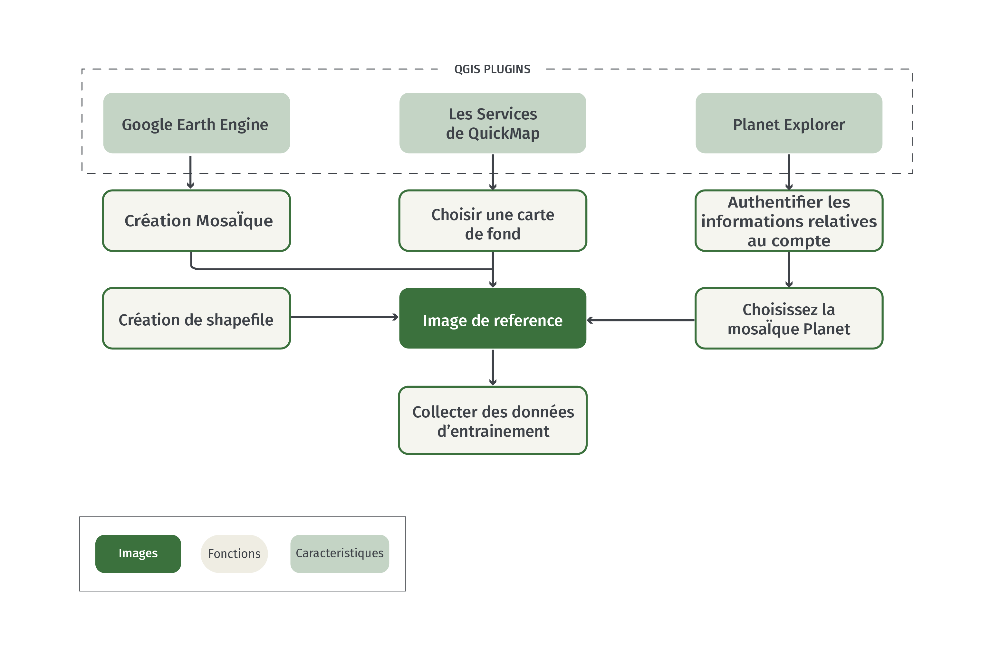
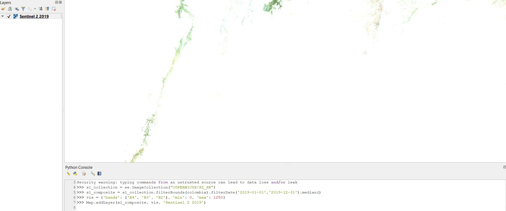
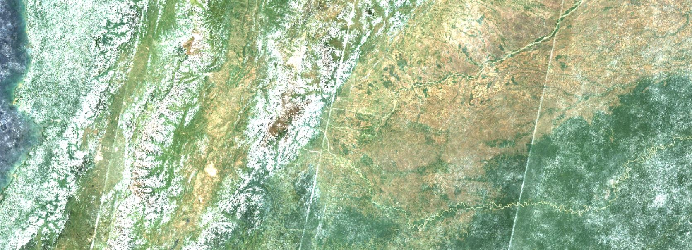
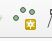
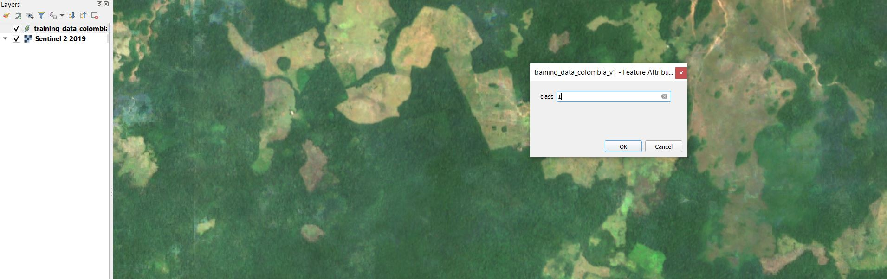
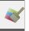

#  Collecte de données d'entraînement à l'aide de QGIS 

## 1 Contexte 

Les données d'entraînement sont essentielles à la classification supervisée d’images. L'ensemble des données d'entraînement est un ensemble de données étiquetées ou labélisées, utilisées pour informer ou «former» un classificateur. Le classificateur entraîné peut ensuite être appliqué à de nouvelles données pour créer une classification. Par exemple, les données d'apprentissage de la occupation du sol contiendront des exemples de chaque classe dans la légende de l'étude, et sur la base de ces étiquettes, le classificateur peut être utilisé pour prédire la classe de occupation du sol la plus probable pour chaque pixel d'une image. Ceci est un exemple de classification catégorielle et les labels de formation sont donc catégoriques. En revanche, une variable continue (par exemple le pourcentage de couverture forestière) peut être prédite à l'aide d'étiquettes de formation continue. 

Ce tutoriel montrera comment collecter des données d'apprentissage catégorielles pour la classification de l’occupation du sol à l'aide de QGIS. Les utilisateurs doivent ajuster les différentes composantes en fonction des objectifs de leur projet. Ici, le processus est démontré pour les pays de la Colombie, du Mozambique et du Cambodge, et pour une simple légende de quatre classes de couverture terrestre: forêt, eau, herbacée et développée. 

### 1.1 QGIS

Quantum GIS (QGIS) est un logiciel SIG open source qui fonctionne sous Windows, Linux et Mac OS X. Les utilisateurs doivent consulter le  [site-web de QGIS](https:/qgis.org/en/site/forusers/alldownloads.html) pour des informations générales et des instructions d'installation. Comme il existe de nombreuses manières différentes d'installer le QGIS, dépendant de votre système d'exploitation, les instructions d'installation ne seront pas détaillées ici. Si les utilisateurs ne sont pas en mesure d'installer QGIS, Nous vous conseillons de passer à ce même tutoriel sur OpenMRV pour la collecte de données d'entraînement à l'aide de Google Earth Engine, sous la section "Collecte de Données d'Entraînement" et l'outil "GEE".

Ce tutoriel est basé sur la version à long terme [Version 3.10.10](https:/docs.qgis.org/3.10/en/docs/user_manual/). Pour les fonctionnalités principales de ce tutoriel, les utilisateurs n'auront besoin que de QGIS installé et d'une connexion Internet.  Pour utiliser tous les plugins décrits dans ce tutoriel, les utilisateurs auront besoin de comptes sur  [Google Earth Engine](https:/signup.earthengine.google.com/#!/) et sur [Planet](https:/www.planet.com/login/?mode=signup). 

## 2 Objectifs du cours 

A la fin de cet exercice, vous serez en mesure de : 

- Créer une nouvelle couche de shapefile (couche vectorielle) dans QGIS. 
- Chargez plusieurs sources d'images haute résolution à utiliser comme référence. 
- Collecter des données d'entraînement pour une classification catégorielle. 

### 2.1 Pré-requis 

* Concepts QGIS 
  * Installation
  * Création, sauvegarde et chargement d'un projet
  * Installation et utilisation de plugins
* Concepts de télédétection 
  * Compréhension de base des théories impliquées dans la classification d'images.
  * Définition d'une légende thématique

## 3 Tutoriel : Collecte de données d'entraînement dans QGIS

### 3.1 Vue d'ensemble

Le processus de collecte des données d'entraînement dans QGIS est détaillé dans les étapes ci-dessous. Le processus peut être généralement décrit en trois étapes principales: 

1. Création d'une nouvelle couche de shapefile pour le stockage des données d'entrainement. 
2. Chargement d'un fond de carte à l'aide d'un plugin QGIS. 
3. Rassembler les données d'entraînement en définissant manuellement les points d'entraînement.  



### 3.2 Création d'une nouvelle couche

Ce tutoriel montre comment créer des données d’entrainement qui sont des points géométriques. Un processus similaire peut être utilisé avec des données polygonales, mais gardez à l'esprit qu'il est généralement recommandé d'avoir des régions d'entraînement plus diverses pour minimiser l'effet de l'autocorrélation spatiale. 

Pour commencer, nous devrons définir une nouvelle couche de shapefile.
1. Sélectionnez *Layer* **->** *Create Layer* **->** *New Shapefile Layer...*. 
2. Choisissez un nom de fichier pour enregistrer vos données de formation (dans l'exemple ci-dessous, j'utilise le nom "training_data_colombia_v1.shp". Choisissez un dossier dans lequel vous pouvez facilement accéder aux données et les mémoriser. 
3. Pour *Geometry type*, choisissez *Point*.  
4. Choisissez EPSG:4326 - WGS 84 pour la projection.  
5. Supprimer le champ "id" en le sélectionnant dans la *Fields List* et en sélectionnant *Remove Field*. 
6. Ajoutez un nouveau champ de type *Whole number* nommé "class" en sélectionnant *Add to fields list*. La *Longueur* du champ correspond au nombre de caractères que vous pouvez saisir, et la *Précision* est le nombre de chiffres. Choisissez au moins 2 pour la longueur du champ. Comme le type est *Nombre total*, nous n'avons pas à nous soucier de la précision. 

Votre panel devrait ressembler à ceci : 


Cliquez sur *Ok* et vous devriez voir qu'une nouvelle couche est ajoutée dans le panneau "Couches" à gauche de l'écran. Nous ajouterons à cette couche lors de la création des données d'entraînement. 

### 3.3 Charger les Fonds de cartes

Les données de référence sont essentielles à la collecte de données d'entraînement et, dans la plupart des cas, il suffit d'utiliser des images haute résolution. Deux facteurs critiques dans la sélection des données de référence sont :  

- Les classes cibles peuvent être distinguées par une interprétation visible. 
- L'heure de l'imagerie de référence chevauche les données d'entrée utilisées pour la classification. 

Heureusement, il existe de nombreuses sources d'images de référence haute résolution disponibles directement dans le QGIS. L'imagerie spécifique à utiliser dépendra de votre période et région d'étude, mais il est généralement recommandé d'utiliser autant de données que possible. 

Les plugins suivants permettent d'accéder à des images de référence. Chaque plugin fonctionne avec la version 3.1.10 de QGIS. Cependant, les utilisateurs de ce tutoriel doivent suivre les instructions des créateurs de plugins pour assurer une installation correcte. 

Les utilisateurs doivent considérer les options ci-dessous et décider d'une source de données de référence qui correspond à la période et à l'étendue géographique de votre région d'étude. Ici, le processus est démontré pour la Colombie et pour l'année 2018.   

**Remarque importante:** Nous suggérons aux utilisateurs de commencer par les services QuickMap, car ils ne nécessitent pas de compte externe et l'installation est la plus simple. L'utilisation de Planet et de Google Earth Engine fournit des données de référence plus souples, mais les plugins sont expérimentaux et nécessitent des comptes avec Earth Engine et Planet. Si les utilisateurs ne peuvent installer aucun plugin, Nous leur suggérons de passer à ce même tutoriel sur OpenMRV pour la collecte de données d'entraînement à l'aide de Google Earth Engine, situé dans la section "Collecte de Données d'Entraînement " et l'outil "GEE".

#### 3.3.1 Services QuickMap 

**Qui**: [NextGIS](https:/nextgis.com/) 

**Quoi**: Cartes de base de haute qualité (Google, ESRI, Mapbox, etc) 

**Quand**: Variès 

[Instructions vidéo](https://www.youtube.com/watch?v=p8G6zMWfi8o) 

QuickMap Services est un service d'accès et de partage de données géospatiales. Ce plugin permet d'accéder à l'ensemble des données, y compris les cartes de base haute résolution de Google, ESRI et Mapbox. La plupart de ces données sont compilées à partir de diverses sources, ce qui signifie que la date d'acquisition pour un lieu spécifique peut ne pas être connue. Cependant, il s'agit d'ensembles de données de haute qualité et il est recommandé de les utiliser à titre de référence pour compléter les images décrites ci-dessous.   

**Utilisation:**

1. Ajouter le plugin QuickMap Services en allant dans *Plugins* et *Manage and Install Plugins...* et en cherchant *QuickMapServices* et en cliquant sur le bouton *Install Plugin*. 
2. Ouvrez le panneau de recherche QMS en allant dans la barre d'outils *Web* -> *QuickMapServices* -> *Search QGMS Panel*. 
3. Dans le panneau qui apparaît sur la droite de l'écran, recherchez "Satellite" et choisissez un ensemble de données en sélectionnant *Add*. La carte de base sera ajoutée à la carte. Dans cet exemple, la couche "ESRI Satellite" a été sélectionnée. Vous pouvez naviguer sur la carte à l'aide de votre souris, et faire un zoom avant ou arrière avec la barre de défilement de la souris.   


#### 3.3.2 Explorateur Planet 

**Qui**: [Planète](https:/www.planet.com/) 

**Quoi**:  Imagerie quotidienne, mosaïques mensuelles, mosaïques semestrielles 

**Quand**:  Après 2016 

[Video Instructions](https://www.youtube.com/watch?v=wfhyk7f9kvo) 

La constellation de satellites Planète offre des images quotidiennes à haute résolution dans 3-4 bandes spectrales. Bien que l'accès aux archives de données ne soit pas entièrement libre, un nom d'utilisateur et un mot de passe vous permettent de parcourir les images quotidiennes et de visualiser des images de prévisualisation de qualité réduite. En outre, le ministère norvégien du climat et de l'environnement [a conclu un accord](https:/www.planet.com/pulse/planet-ksat-and-airbus-awarded-first-ever-global-contract-to-combat-deforestation/) avec Planet, Airbus et Konsberg Satellite Services pour donner accès à des images haute résolution dans les tropiques. Au moment de la rédaction du présent document, les outils permettant d'accéder à ces données en sont aux premiers stades de leur développement. Cependant, Planet prend en charge l'accès à ces données via le plugin QGIS * Planet Explorer *. 

**Utilisation**:

1. Des instructions détaillées pour l'installation du plugin se trouvent [sur la page web de la planète](https:/developers.planet.com/docs/integrations/qgis/quickstart/). 
2. Si vous ne l'avez pas encore fait, inscrivez-vous à [Accès utilisateur de niveau 1 ici](https://www.planet.com/nicfi/). 
3. Ajoutez le panneau de plugins en allant sur *Web* -> *Planet Explorer* -> *Planet Explorer*. 
4. Sélectionnez *Mosaic Series* dans le panneau des plugins à côté de l'icône Planet.  
5. Double-cliquez sur l'une des mosaïques semestrielles ou mensuelles pour l'ajouter à la carte. 


#### 3.3.3 Google Earth Engine (utilisation avancée)  

**Qui**: [Google Earth Engine](https:/earthengine.google.com/) et Gennadii Donchyts.  

**Quoi**: La plupart des données d'observation de la terre en libre accès (par exemple Landsat, Sentinel et MODIS).  

**Quand**: Dès 1972 pour Landsat. 

[Video Instructions](https://www.youtube.com/watch?v=-6mEL2VQtYw) 

Google Earth Engine (GEE) est une plateforme en ligne d'analyse de données géospatiales. L'accès à GEE est fourni par une API Javascript et Python. Bien que Google ne fournisse pas actuellement de plugin QGIS, Gennadii Donchyts a récemment publié un plugin bêta basé sur l'API Python. Ce plugin permet une incroyable puissance de traitement et de stockage de données de GEE avec l'interface utilisateur de QGIS. Cependant, il est expérimental et les utilisateurs doivent consulter le [dépôt Github] (https:/github.com/gee-community/qgis-earthengine-plugin) avant de l'utiliser. 

**Prérequis** 

- [compte Google Earth Engine](https://signup.earthengine.google.com) 
- [Python 3](https://www.python.org) 
- [API Python de Google Earth Engine installée et authentifiée](https://developers.google.com/earth-engine/guides/python_install) 

**Utilisation**:

1. Installez le plugin en utilisant le [Guide de l'utilisateur](https:/gee-community.github.io/qgis-earthengine-plugin/).  
2. Ajoutez la console Python en allant dans *Plugins* (en haut de l'application) -> *Console Python* 
3. Parcourez les exemples de code dans [le dépôt de plugins](https:/github.com/gee-community/qgis-earthengine-plugin/tree/master/examples). Il est également utile de se familiariser avec [Google Earth Engine](https:/developers.google.com/earth-engine/guides) si vous êtes un nouvel utilisateur. Ce tutoriel ne couvre pas les bases du GEE et les utilisateurs devraient consulter la [documentation GEE](https:/developers.google.com/earth-engine/guides) pour une utilisation avancée.  

4. Dans la console Python, commencez par charger l'API Python GEE : 

    ```python 
    import ee 
    ```

    Votre console devrait ressembler à ceci : 

    

5. Chargez la fonction *Map* du module ee_plugin et testez si elle fonctionne correctement : 

    ```python
    from ee_plugin import Map 
    print(ee.String('The plugin is working!').getInfo()) 
    ```

6. Définir la vue de la carte à la frontière de la Colombie. 

    ```python
    countries = ee.FeatureCollection("USDOS/LSIB_SIMPLE/2017") 
    colombia = countries.filter(ee.Filter.eq('country_na', 'Colombia')) 
    Map.centerObject(colombia, 8)
    ```

7. Créez un composite Sentinel-2 pour 2019 et ajoutez-le à la carte. 

    ```python
    s1_collection = ee.ImageCollection("COPERNICUS/S2_SR") 
    
    s1_composite = s1_collection.filterBounds(colombia) \ 
        .filterDate('2019-01-01','2019-12-31') \ 
        .median() 
    
    vis = {'bands': ['B4', 'B3', 'B2'], 'min': 0, 'max': 1250} 
    
    Map.addLayer(s1_composite, vis, 'Sentinel 2 2019')
    ```

    Vous devriez voir sur la carte,  une image très nuageuse

    

8. Maintenant, essayons à nouveau d'appliquer le masque de nuage avant de réaliser la mosaïque: 

    ```python
    def maskS2clouds(image):
        return image.updateMask(image.select('QA60').eq(0))

    s1_composite_masked = s1_collection.filterBounds(colombia) \
        .filterDate('2019-01-01','2019-12-31') \
        .map(maskS2clouds) \
        .median()

    Map.addLayer(s1_composite_masked, vis, 'Sentinel 2 2019 Masked')
    ```

    

### 3.4 Collecter les données d'entraînement

Une fois que vous avez choisi les images de référence, il est temps de commencer à collecter des données d'entraînement. En allant classe par classe, parcourez votre région d'étude en collectant des données ponctuelles. Voici quelques considérations: 

- Les données d'entrainement doivent être représentatives de l'ensemble de votre région d'étude. Cela signifie qu'il est préférable de collecter davantage de données dans toute la région d'étude au lieu de quelques grandes zones d’entrainement. 
- Assurez-vous d'inclure des exemples en bordure des limites de classe (par exemple, la forêt immédiatement adjacente à une couverture terrestre non forestière), car ces zones seront plus difficiles à distinguer au stade de la classification. 
- Il n'y a pas de chiffre magique pour un nombre adéquat de points d'entraînement. Soyez prêt à ce qu'il s'agisse d'un processus interactif dans lequel vous collectez des données d'entraînement, effectuez votre analyse, puis collectez plus de données d'entraînement pour corriger les erreurs de classification. 
- Prenez votre temps - cet ensemble de données sera inestimable pour votre recherche et peut l'être également pour d'autres. 

1. Sélectionnez la couche de données de formation dans le panneau *Layers*. 
2. Activez l'édition des couches en sélectionnant le bouton qui ressemble à un crayon, *Toggle Editing* . 
3. Sélectionnez l'icône *Add Point Feature* 
4. Définissez un code de classe numérique. Ici, nous utiliserons 1 pour Forêt, 2 pour Eau, 3 pour Herbacé, et 4 pour Développé.   
    
5. En commençant par la classe Forêt, cliquez sur la carte pour ajouter un point d'entraînement. Dans le panneau qui s'affiche sur la carte, vous aurez la possibilité de remplir le champ *classe* pour le point que vous venez d'ajouter. Puisque nous commençons avec la classe Forest, utilisez le code de classe 1. En vous basant sur les codes de classe ci-dessus, vous devez utiliser 2 pour Eau, 3 pour Herbacé et 4 pour développé.
    
6. Sélectionnez *OK* pour enregistrer le point d’entrainement. 
7. Répétez l'opération pour de nombreux échantillons de forêt dans votre région d'étude. Il est conseillé de sauvegarder la couche pendant le processus en sélectionnant le bouton *Save Layer Edits*.  
    
8. Les unités d'échantillons peuvent être supprimées en les sélectionnant d'abord avec le bouton *Select Feature(s)*  et en cliquant sur une caractéristique ou en faisant glisser une case pour en sélectionner plusieurs, puis en cliquant sur le bouton *Delete*  
9. Continuez ce processus pour chaque classe de carte cible.  
10. Sélectionnez le bouton *Toggle Editing* pour arrêter l'édition de la couche. 


### 3.5 Visualisation des données d’entrainement

Une fois que vous avez recueilli les données de formation pour chaque classe, il est utile de les styliser pour voir la répartition dans la zone d'étude. Idéalement, vous voulez avoir des points de formation qui sont représentatifs de la variabilité des classes. Ici, cela signifie que nous voulons avoir suffisamment de points de forêt, d'eau, d'herbacées et de points développés pour nous assurer qu'ils représentent bien ces classes dans toute la Colombie. 

1. Faites un clique droit sur la couche dans le panneau *Layer* et selectionnez *Properties* 
2. Dans la partie gauche du panneau *Properties*, sélectionnez *Symbology*  
    
3. Sélectinnez *Categorized* pour le type de symbole.  
4. Sous *Value* sélectionnez l'attribut contenant l'étiquette de classe, dans ce cas il s'agit de *class* 
5. Sélectionnez *Classify* pour remplir le tableau de symbologie. Vous pouvez également modifier les couleurs à votre convenance. 
6. Cochez les valeurs de la *Legend* pour qu'elles correspondent à notre légende. Votre tableau devrait ressembler à ceci: 
    
7. Sélectionnez *OK* pour appliquer le style. 
8. Prenez le temps d'examiner votre échantillon et assurez-vous qu'il n'y a pas de "lacunes" majeures dans les données d’entrainement. 
    

### 3.6 Ajout d'une identification unique 
Il est utile d'avoir un identifiant unique pour chaque point d'entrainement. Celui-ci peut être ajouté à la table des attributs de la couche. 

1. Faites un clic droit sur le nom de la couche dans le panneau *Layer* et sélectionnez *Open Attribute Table*.  
2. Ajoutez une nouvelle colonne en sélectionnant *Open field calculator*. 
3. Sous *Output field name*, écrivez "ID".  
4. Double-cliquez sur le sélecteur "row_number". Votre panneau devrait ressembler à ceci : 
    
5. Cliquez sur "Ok" et terminez l'édition en utilisant le bouton "Toggle editing mode"   

## 4. Exemples : Mozambique et Cambodge 

**Utilisation avancée** 

Les méthodes décrites ci-dessus sont démontrées pour les pays du Mozambique et du Cambodge. Le processus général est le même que celui qui a été démontré en Colombie. Toutefois, quelques considérations relatives à l'adoption de l'approche des conditions de chaque pays sont décrites ci-dessous. Notez que ces étapes supplémentaires sont facultatives et qu'il est recommandé de procéder d'abord à la collecte de données suivant les étapes ci-dessus. .Ces exemples montreront comment collecter des données d'entraînement d'une manière robuste aux différents types de forêts et à la topographie. L'objectif est d'améliorer la robustesse des données d’entrainement, ce qui peut en fin de compte améliorer la qualité de votre classification de l'occupation des sols. Les utilisateurs doivent tenir compte des conditions climatiques et topographiques de leur région d'étude pour déterminer si ces étapes supplémentaires sont nécessaires. 

### 4.1  Mozambique : Prise en compte de la saisonnalité 

Le Mozambique est un pays écologiquement diversifié qui se compose d'un mélange de zones climatiques tropicales et tempérées. De ce fait, il existe de grandes étendues d'écosystèmes forestiers à feuilles persistantes et à feuilles caduques. En Colombie, nous n'avons pas directement pris en compte les effets saisonniers des forêts, car celles-ci couvrent une proportion relativement faible du pays. La superficie des forêts de feuillus est beaucoup plus importante au Mozambique, ce qui peut présenter un défi pour la classification de la couverture terrestre en raison de la variabilité intra-annuelle de la réflectance entre les stades phénologiques. 

Pour illustrer ce point, observez la variabilité temporelle de l'indice de végétation par différence normalisée (NDVI) au cours d'une année pour un pixel Landsat de 30 mètres dans une forêt saisonnière au Mozambique. Le NDVI est une transformation spectrale qui est couramment utilisée pour analyser la végétation photosynthétiquement active. La saison des pluies au Mozambique s'étend de novembre à mai environ. La figure de gauche montre le Mozambique avec un pixel surligné en rouge, et l'image du milieu dans le même sens mais avec un zoom. La droite montre toutes les valeurs NDVI Landsat disponibles pour le pixel. Notez dans le graphique ci-dessous comment le NDVI est considérablement plus élevé pendant la saison des pluies que pendant la saison sèche en raison de la variabilité saisonnière de la forêt.  


La variabilité saisonnière peut représenter un défi lors de la classification de la couverture terrestre. Par exemple, si nous devions classifier une image de saison sèche au Mozambique, une forêt de feuillus pourrait potentiellement être confondue avec des classes de couverture terrestre herbacée ou non forestière en raison de la faible intensité du vert de la végétation pendant une période de feuillaison. Pour éviter toute confusion dans le processus de classification, il est essentiel que les données d'entrainement soient représentatives de la variabilité au sein de la classe (c'est-à-dire la variabilité saisonnière des forêts ou d'autres classes végétatives). En d'autres termes, s'il existe des zones importantes de forêts à feuilles caduques et à feuilles persistantes, les données d'entraînement pour une classe "Forêt" plus large doivent contenir des exemples des deux.  

Ici, notre objectif est de nous assurer que notre classe "Forêt" contient des exemples de différents types de forêts, comme indiqué par leurs trajectoires saisonnières. Il existe de nombreuses façons de le faire, et nous allons ici utiliser Google Earth Engine pour examiner la variabilité intra-annuelle de l'NDVI.   

1. Tout d'abord, créez une nouvelle couche Shapefile en suivant les instructions de [3.2 Création d'une nouvelle couche] (#creating-a-new-layer). 
2. Charger le plugin [Google Earth Engine](#gee). 
3. Ouvrez la *Console Python* en naviguant sur "Plugins" -> "Python Console".  
4. Utilisez les instructions du [3.3.3](#gee) pour charger les modules requis et naviguer sur  Mozambique. Si vous avez besoin d'une mise à jour, le code pour le faire se trouve ci-dessous. 

    ```python
    import ee
    from ee_plugin import Map
    countries = ee.FeatureCollection("USDOS/LSIB_SIMPLE/2017")
    mozambique = countries.filter(ee.Filter.eq('country_na','Mozambique'))
    Map.centerObject(mozambique, 8)
    ```

5. Créer une fonction pour calculer le NDVI en utilisant les bandes Rouge (B4) et NIR (B8) de l'imagerie Sentinel-2. Nous aurons également besoin de la fonction de masquage des nuages introduite au point 3.3.3. 

    ```python
    def doNDVI(image):
        return image.normalizedDifference(['B4','B8']).rename('NDVI')

    def maskS2clouds(image):
        return image.updateMask(image.select('QA60').eq(0))
    ```

6. Maintenant, nous pouvons filtrer la collection Sentinel-2 en deux groupes : les images pendant le pic de la saison sèche, et les images pendant le pic de la saison des pluies. Nous pouvons ensuite [map](https:/developers.google.com/earth-engine/guides/ic_mapping) sur les collections  appliquer les masques de nuages et calculer le NDVI. 

    ```python
    s1_collection = ee.ImageCollection("COPERNICUS/S2_SR").map(maskS2clouds)

    dry_season = s1_collection.filterBounds(mozambique).filterDate('2019-09-01','2019-11-01').map(doNDVI)

    rainy_season = s1_collection.filterBounds(mozambique).filterDate('2019-01-01','2019-04-01').map(doNDVI)
    ```

7. Pour calculer la variabilité saisonnière, nous pouvons alors combiner ces deux collections et calculer la variance NDVI par pixel en utilisant un [reducer](https:/developers.google.com/earth-engine/guides/reducers_intro).  

    ```python
    combined = rainy_season.merge(dry_season)
    variance = combined.reduce(ee.Reducer.variance())

    viz = {'min': 0, 'max': .1, 'palette': ['red','yellow','green']}
    Map.addLayer(variance, viz)
    ```

    

8. La carte qui est chargée est la variance saisonnière de l'NDVI, dans laquelle le rouge indique une variabilité moindre et le vert une variabilité plus importante.   
9. Une autre mesure que nous pouvons prendre pour aider à l'identification des forêts est d'utiliser un ensemble de données sur le couvert forestier auxiliaire pour masquer les pixels non forestiers. L'ensemble de données UMD-Hansen sur la couverture forestière, la perte et le gain des arbres est parfait à cet effet. Bien qu'il ne soit pas recommandé d'utiliser cet ensemble de données directement comme données d'entrainement, il s'agit d'un bon outil pour identifier les forêts ou les lieux de changement de forêt possibles. Ici, nous utiliserons la couche "Couverture des arbres 2000" pour masquer notre couche de variance NDVI en pixels qui étaient inférieurs à 30% de couverture de la canopée des arbres en 2000. 

   
    ```python
    umd_hansen = ee.Image("UMD/hansen/global_forest_change_2019_v1_7").select('treecover2000')
    mask = umd_hansen.gt(30)
    variance_masked = variance.updateMask(mask)
    Map.addLayer(variance_masked, viz)
    ```

    

10. Maintenant que nous collectons des données de formation pour la classe "Forêt", il est important de référencer cette couche pour s'assurer que les données de formation tiennent compte des différences de variabilité spectrale saisonnière dans les forêts. Tout d'abord, voyons pourquoi il pourrait être avantageux d'effectuer les étapes énumérées ci-dessus :   
    - Certaines forêts ont des modèles saisonniers de productivité.   
    - Nous voulons nous assurer que nos données de formation "Forêt" comprennent des exemples de tous les types de forêts dans un domaine d'étude.   
    - Une façon simple et préliminaire de tenir compte de la saisonnalité dans une classification consiste à fournir des données de formation représentatives.  
    - GEE nous permet d'identifier facilement les forêts saisonnières en fonction de la variance des valeurs NDVI sur une année.  
    - L'ensemble de données UMD-Hansen aide à la collecte de données d'entrainement en masquant les pixels non forestiers. 
11. Il est nécessaire d'ajouter une carte de base standard en plus de la couche NDVI. Tous les exemples ci-dessus peuvent être utilisés, le plus simple étant le QuickMap Services. Assurez-vous que vous pouvez identifier vos classes dans l'imagerie que vous utilisez. Si vous ne le pouvez pas, essayez d'autres sources d'imagerie de référence ou envisagez de simplifier vos classes. Vous trouverez ci-dessous des exemples de classes utilisées ici dans l'imagerie ESRI disponible dans les services QuickMap. 

    

12. En suivant les instructions décrites [ci-dessus] (#collection), allez classe par classe pour collecter des points d'entraînement. Pour la classe Forest, superposez occasionnellement les points d'entraînement sur la carte de variance de l'NDVI. Il n'est pas nécessaire de faire une évaluation détaillée, mais il vaut la peine de s'assurer visuellement que les échantillons d'entraînement représentent les forêts saisonnières et non saisonnières. Pour ce faire, il suffit d'alterner les zones rouges, vertes et jaunes sur la couche de variabilité de l'NDVI et de basculer entre cette couche et l'image de référence pour s'assurer que les endroits sont bien des forêts. Notez dans l'exemple suivant comment il y a des points d'entraînement (bleu) dans les forêts ayant une variabilité saisonnière différente (ou variance NDVI). 

    

13. N'oubliez pas de sauvegarder la fréquence en sélectionnant le bouton *Save Layer Edits*.   
14. Lorsque vous avez terminé, terminez l'édition en sélectionnant le bouton *Toggle Editing*.  
15. En option, vous pouvez alors visualiser les données d'entrainement : 

    

## 4.2 Le Cambodge : Prise en compte de la topographie 

Le dernier exemple de collecte de données d'entrainement dans Qgis est celui du Cambodge. Le Cambodge a un climat de mousson tropicale avec une saison des pluies allant de mai à octobre environ. Ces dernières années, le Cambodge a connu un taux relativement élevé de changement d'occupation de sol, souvent sous la forme de déforestation.  

La plupart des forêts restantes au Cambodge sont situées sur des terrains vallonnés ou montagneux. La topographie, cependant, peut introduire un défi à la classification de la couverture des terres. Comme les caractéristiques topographiques projettent une ombre, la réflectance du paysage dans l'ombre peut être inférieure à celle d'un paysage similaire non ombragé. Pour réduire cet effet, il est important de collecter des données de formation qui soient représentatives des différentes conditions topographiques d'une région d'étude. Cet exemple montrera comment procéder. 

1. Tout d'abord, créez une nouvelle couche Shapefile en suivant les instructions de 3.2 Créer une nouvelle couche. 
2. Dans cet exemple, nous utiliserons une carte de terrain en plus de l'imagerie de référence lors de la collecte des données d'entraînement. En utilisant QuickMap Services, recherchez deux cartes de base et ajoutez-les à la carte : Esri Imagery et Google Terrain Hybrid.  
3. Ensuite, nous allons ajuster les paramètres de rendu des couches pour "mélanger" ces deux couches ensemble. En fin de compte, l'objectif est d'obtenir une image haute résolution présentant des caractéristiques topographiques exagérées et visuellement apparentes.   
4. Dans le panneau *Layers*, assurez-vous que la couche Esri Imagery est située au-dessus de la couche Google Terrain Hybrid. La disposition des couches peut être ajustée en sélectionnant la couche avec votre souris et en la faisant glisser vers un nouvel emplacement dans le panneau. 
5. Ouvrez le panneau *Layer Properties* pour la couche Esri Imagery en double-cliquant sur son nom dans le panneau *Layers* ou en faisant un clic droit et en sélectionnant 'Properties...'. 
6. Sélectionnez le panneau *Symbology* en le sélectionnant sur le côté gauche du panneau *Layer Properties*.   
7. Changez le *Blending mode* en "Multiply" et cliquez sur "OK". Les deux couches seront affichées comme un composite mélangé.   
    Notez la différence avant et après le mélange de la couche Esri Imagery avec la couche Google Terrain Hybrid :   

    

8. L'objectif est simplement de faciliter la visualisation des caractéristiques topographiques dans l'imagerie de référence, afin qu'elle puisse être utilisée comme information complémentaire lors de la collecte des données de référence. Veillez à recueillir des échantillons d'entraînement pour les forêts qui varient en fonction de leur disposition topographique. Par exemple, les échantillons doivent être collectés sur des terrains qui diffèrent par leur pente et leur aspect. Il n'est pas nécessaire d'être précis, et cela peut être fait facultativement pour n'importe quelle couverture terrestre. Une façon simple d'observer les différences de terrain est de se baser sur l'ombre de 

    

9. Utilisez l'image de référence composite pour collecter au moins 100 échantillons d'entraînement par classe. N'oubliez pas d'en enregistrer fréquemment. Lorsque vous avez terminé, terminez l'édition en sélectionnant le bouton *Toggle Editing*.   

    

## 5 Foire aux questions

**Pourquoi utilisons-nous des points plutôt que des polygones?** 

Les données sous forme de polygones peuvent également être utilisées comme données d'entraînement, mais gardez à l'esprit que l'autocorrélation spatiale entraînera des informations redondantes dérivées de chaque polygone. Nous recommandons donc de collecter des échantillons ponctuels représentatifs de l'ensemble des données plutôt que de quelques polygones.   

**Comment choisir les données à utiliser comme référence ?** 

Les données de référence doivent recouvrir dans le temps et dans l'espace les données utilisées dans votre analyse. S'il existe plusieurs sources de données répondant à ce critère, l'utilisateur doit choisir les données qu'il trouve les plus faciles à interpréter en se basant sur la légende de sa classification. 

**Les données relatives à la formation doivent-elles être dérivées selon un plan d'échantillonnage probabiliste** ? 

Non, il n'est pas nécessaire d'obtenir des données de formation en utilisant un plan d'échantillonnage basé sur les probabilités. Cependant, si les données de formation ont été créées de cette manière (par exemple un échantillon aléatoire simple interprété), il n'y a aucune raison pour qu'elles ne puissent pas être utilisées pour la classification. 

**Combien de points dois-je obtenir pour chaque classe?** 

 Il n'y a pas de chiffre magique pour le nombre de points d'entrainement pour chaque classe, mais un bon objectif est un minimum de 100/classe. Il est généralement recommandé d'utiliser un processus itératif, dans lequel des données d'entrainement supplémentaires sont ajoutées après avoir effectué une classification, puis la classification est créée à nouveau ; le processus se répète jusqu'à ce que les résultats soient jugés adéquats. 

**Peut-on diviser les données d'entraînement pour en utiliser une partie pour la validation?** 

 Si les donné d'entrainement ont été collectées de manière opportuniste, ou en d'autres termes *non* en utilisant un échantillon probabiliste, alors il n'est généralement pas recommandé de les utiliser pour la validation car cela introduira un biais. 

**Pourquoi je ne peux pas voir mes points sur la carte?** 

 Assurez-vous que la couche est chargée dans votre panneau "Layers". Si elle ne l'est pas, elle peut être ajoutée en naviguant sur *Layer* -> *Add Layer* -> *Add Vector Layer*. Si la couche se trouve dans le panneau "Layers" mais n'apparaît pas sur la carte, assurez-vous qu'elle se trouve au-dessus des données de référence qui sont chargées. 

**Pourquoi vaut-il la peine de collecter des données d'entrainement pour différents types de forêts si nous ne créons qu'une seule classe de forêts ?**

 Ce n'est pas nécessaire, mais cela peut aider à améliorer la classification. Nous voulons que nos données d'entraînement représentent la variabilité spectrale de nos classes. Un moyen facile d'identifier les différences entre les types de forêts est leur variabilité saisonnière.  

**Ma zone d'étude est plate, dois-je encore me préoccuper de la topographie?** 

Non, il n'est pas nécessaire de se préoccuper de la topographie dans une zone d'étude complètement plate. 

**Je n'arrive pas à charger un des plugins, que dois-je faire?** 

Si vous ne parvenez pas à charger l'un des plugins, utilisez simplement l'un des autres. Plusieurs plugins sont présentés ici pour donner aux utilisateurs de multiples options.  

 **Que dois-je faire si je ne peux pas installer QGIS ou obtenir un des plugins à charger ?**

Ne vous inquiétez pas ! Ce même tutoriel est disponible ici sur OpenMRV pour la collecte de données d'entraînement à l'aide de Google Earth Engine, sous le nom de la section "Collecte de données d'entraînement" et de l'outil "GEE", et il ne nécessite aucune installation.  

-----

  

Ce travail est sous licence [Creative Commons Attribution 3.0 IGO](https://creativecommons.org/licenses/by/3.0/igo/) 

Copyright 2021, Banque mondiale  

Ce travail a été développé par Eric Bullock dans le cadre d'un contrat de la Banque mondiale avec GRH Consulting, LLC pour le développement de nouvelles ressources - et la collecte des ressources existantes - liées à la mesure, la notification et la vérification afin de soutenir la mise en œuvre du MRV par les pays.  

Matériel examiné par:      
Kenset Rosales, Guatemala, Ministry of Environment and Natural Resources   
Tatiana Nana, Cameroon, REDD+ Technical Secretariat   
Rajesh Bahadur Thapai, Nepal, International Centre for Integrated Mountain Development   
Kenset Rosales, Guatemala, Ministry of Environment and Natural Resources   
Sofia Garcia, Guatemala, Ministry of Environment and Natural Resources   
Jennifer Juliana Escamilla Valdez, El Salvador, Ministerio de Medio Ambiente y Recursos Naturales   
Foster Mensah, Ghana, Center for Remote Sensing and Geographic Information Services   
Ana Mirian Villalobos, El Salvador, Ministerio de Medio Ambiente y Recursos Naturales   
Carole Andrianirina, Madagascar, Bureau National de Coordination REDD+   
Phoebe Oduor, Kenya, Regional Center For Mapping of Resources for Development   
KONAN Yao Eric Landry, Cote d'Ivoire, REDD+ Permanent Executive Secretariat   
Paula Andrea Paz, Colombia, International Center for Tropical Agriculture   

Attribution   
Bullock, E. 2021. Training Data Collection Using QGIS. © World Bank. License: [Creative Commons Attribution license (CC BY 3.0 IGO)](https://creativecommons.org/licenses/by/3.0/igo/)    


