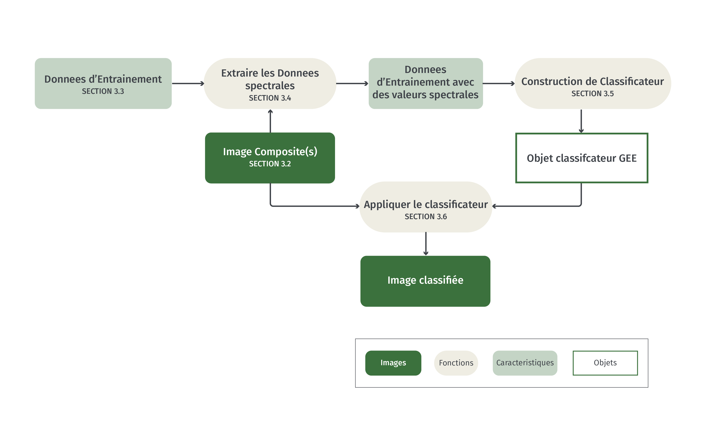
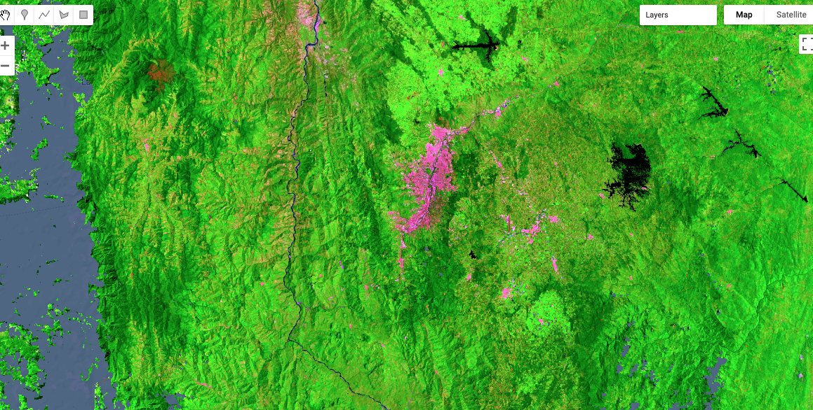
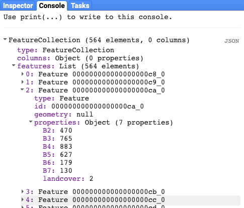
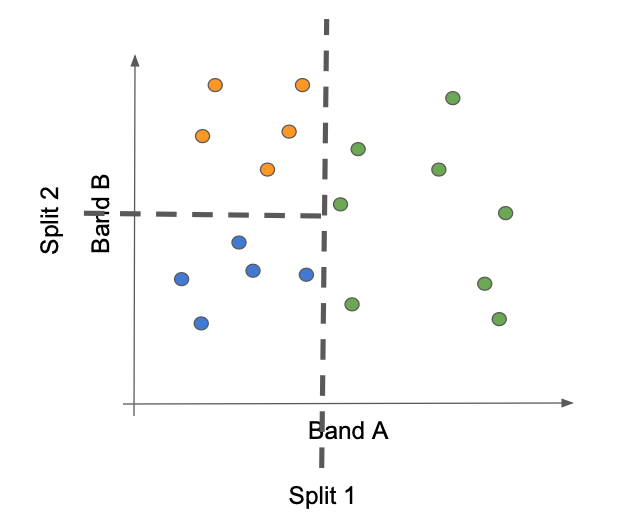
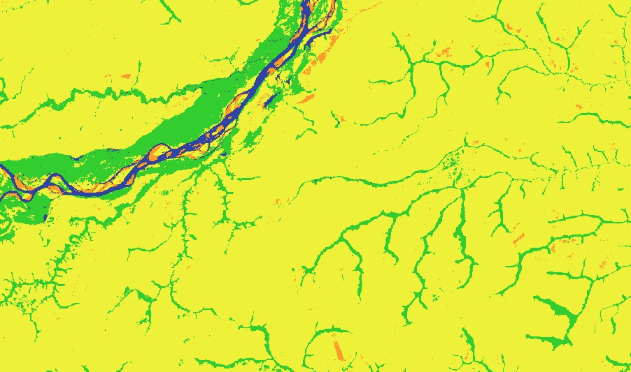
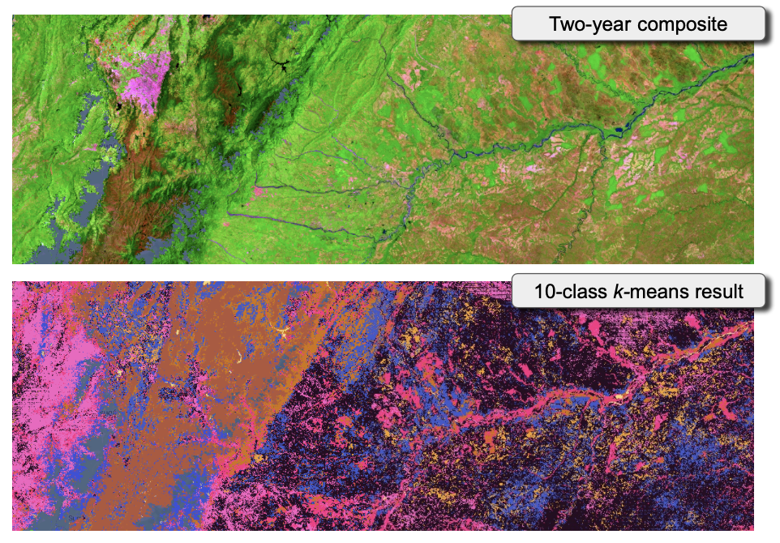
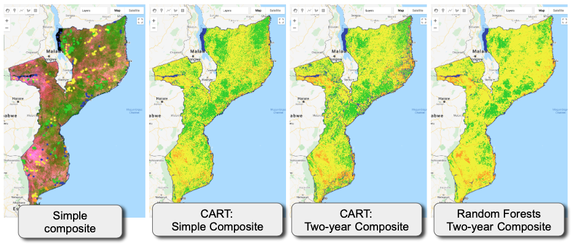

# Classification de l'occupation et de l'utilisation du sol dans Google Earth Engine

# 1 Contexte

## 1.1  Classificateurs en dimension spectrale
Avant de se lancer dans un exercice de classification d'images, il est important de comprendre ce qui doit être classifié. 

L'imagerie géospatiale en télédétection, qu'elle provienne de capteurs passifs ou actifs, réagit aux propriétés physiques et chimiques de la surface de la terre.  La réflectance et l'absorption  de l'énergie électromagnétique sont enregistrées dans différentes bandes d'un capteur, et les valeurs numériques enregistrées dans ces bandes définissent un espace spectral (ou plus largement, un espace de données à n dimensions). Tous les pixels d'une image sont placés dans cet espace de données en raison de leur réflectance mesurée dans chaque bande spectrale du capteur. 

{ width=50% }

La plupart des algorithmes de classification fonctionnent entièrement dans cet espace de données. Les classificateurs tentent de séparer l'espace en régions délimitées dans lesquelles tous les pixels appartiennent à une classe étiquetée.  Certains classificateurs considèrent que les limites entre les régions sont difficiles, tandis que d'autres sont plus floues, traitant l'appartenance à une classe comme une probabilité.  


Espace spectral classifié. Chaque pixel de la figure précédente a été étiqueté selon un schéma de classification défini par l'analyste.  Dans un cas idéal tel que celui présenté ici, tous les pixels de chaque classe peuvent être regroupés en régions délimitées]

Une fois que les limites de la classe ont été définies dans l'espace spectral, tous les autres pixels de l'image peuvent être étiquetés en fonction de la zone dans laquelle ils atterrissent. 


## 1.2 Occupation et utilisation du sol

Les propriétés physiques et chimiques de la surface sont liées à l'occupation du sol. Lors de la collecte de données d'entraînement pour construire une classification, plus les définitions de l'occupation du sol correspondent aux propriétés physiques de la surface qui contrôlent l'espace des données spectrales, plus l'exercice de classification est réussi.  

"Utilisation des sols" se réfère à une définition humaine (observationnelle)  de l'occupation du sol sous-jacente.  La même couverture végétale herbacée peut avoir différentes désignations d'utilisation du sol: l'herbe dans une zone urbaine peut être définie comme "espace ouvert" ou "parc", tandis que la même herbe dans une zone agricole peut être considérée comme "pâturage".  Lors de la définition des étiquettes de classification, il faut être conscient des ambiguïtés potentielles dans les propriétés spectrales des classes. 

## 1.3 Autres ressources

|          **Concept**           |          **Source**          |                                                     **Site** |
| :----------------------------: | :--------------------------: | -----------------------------------------------------------: |
|    Basics of remote sensing    |   Natural Resources Canada   | https://www.nrcan.gc.ca/maps-tools-publications/satellite-imagery-air-photos/tutorial-fundamentals-remote-sensing/9309 |
| Fundamentals of Remote Sensing | ARSET (NASA Applied Science) | https://appliedsciences.nasa.gov/join-mission/training/english/fundamentals-remote-sensing |

# 2 Objectifs d'apprentissage

À la fin de ce tutoriel, vous serez en mesure de 

- Décrire comment l'espace spectral ou l'espace de données sont utilisés dans la classification multivariée
- Appliquer et comparer trois algorithmes de classification couramment utilisés
- Évaluer les sources d'erreur possibles dans le processus de classification, découlant du prétraitement, du choix des capteurs et de la conception de l'échantillon de formation


## 2.1 Pré-requis 

* Concepts de Google Earth Engine (GEE)
	* Obtenir un compte d'utilisateur
	* Traitement de l'image dans le GEE
	* Syntaxe de base des fonctions
	* Traitement de base des images, y compris le choix du type d'image, le filtrage des nuages, la mosaïque et la création d'image composite

> NOTE : Ces sujets sont traités dans le module 1.1 : Création de mosaïques/composites d'images pour Landsat et Sentinel-2 dans Google Earth Engine


* Concepts de base de la télédétection
	* Le spectre électromagnétique
	* Réflexion spectrale
	* Sauvegarde de la réflectance 


# 3 Classification supervisée dans Google Earth Engine

## 3.1 Aperçu du flux de travail

La classification supervisée fait référence au processus d'utilisation d'un ensemble de données d'entrainement avec des étiquettes (labels) connues pour guider un classificateur mathématique dans la tâche d'étiquetage de l'espace spectral (correspondre a chaque pixel une classe). La caractéristique principale est que l'ensemble de données d'apprentissage guide (ou "supervise") la labélisation des pixels. 

Bien que les spécificités des étapes varient selon le classificateur,  [les étapes  de la classification supervisé dans GEE](https://developers.google.com/earth-engine/guides/classification) sont similaires.

- Obtenir une image
- Obtenir des données d'entrainement
- Entrainer un classificateur 
- Appliquer ce classificateur à l'image

Graphiquement, les étapes sont les suivantes. 



Cela permet de créer une carte.  Vous devrez ensuite évaluer la précision de cette carte. Il est abordé ici sur OpenMRV sous le nom de "Estimation de la superficie / Évaluation de la précision".

Nous travaillerons sur un exemple simple avec les éléments indiqués ci-dessous, puis nous illustrerons les variantes. Ces instructions supposent que vous avez un compte sur GEE, et que vous êtes familier avec la configuration, les formats de données et les fonctions de GEE.  Si vous avez besoin d'aide avec ces étapes, veuillez consulter le document "Pré-traitement" et l'outil "GEE" ici sur OpenMRV.


**Classification component**|**Item used here**|**Process on OpenMRV**|**Tool on OpenMRV**
:-----:|:-----:|:-----:|:-----:|
Image|Landsat 8 composite from a single year|Pre-processing|GEE
Training data|Point data|Training data collection|GEE
Classifier|CART|Classification (current tutorial)|GEE (current tutorial)

### 3.1.1 Préparez-vous :  Charger le script

GEE fonctionne par le biais de scripts.  Comme indiqué ci-dessus, nous supposons que vous êtes familier avec l'interface GEE et que vous travaillez avec des scripts.   L'intégralité du code de ce tutoriel est capturée dans un script.  Selon votre niveau d'intérêt, vous pouvez simplement exécuter le code vous-même, ou vous pouvez en extraire des morceaux dans un script séparé.  Un bref tutoriel sur cette étape est disponible sur ce lien : https://youtu.be/jaz-tcwmNLQ

1. Connectez-vous à l'éditeur de code Javascript du GEE à l'adresse suivante : code.earthengine.google.com
2. *Facultatif* Mettre en place un nouveau répertoire pour votre travail  


3. Si vous êtes un lecteur sur le groupe openMRV, vous verrez le script dans "users/openmrv/MRV/OpenMRV_français/Part1/1.3 LCLU Classification/cls_landsat_v2_colombia_fr".  Vous pouvez également y accéder directement en utilisant le lien [GEE script](https://code.earthengine.google.com/2455cc293e19606c2070603c7270d413)
   1. Nous appellerons ce script le "script maître", car il exécute toutes les étapes du tutoriel.  
4. Enregistrez-le dans votre dossier préféré.  Vous pouvez utiliser la vidéo mentionnée ci-dessus pour vous guider. 

> Conseil : vous devrez apporter une modification au fichier pour pouvoir l'enregistrer sous un nom local.  Ajoutez un espace quelque part dans le script, puis utilisez la fonction "Enregistrer sous". 


## 3.2 Construire une image composite

Nous construisons une collection d'images Landsat 8 à réflectance de surface à partir de 2019, filtrée par la couverture nuageuse, appliquée à une valeur médiane et découpée aux limites du pays.  

> Note : Les détails de la composition d'images peuvent être trouvés ici sur OpenMRV sous le nom de "Pré-traitement" et l'outil "GEE".

Si vous copiez et collez des morceaux de code du Master Script dans un nouveau script, cette section est intitulée "Section 3.2" dans le Master Script.  

Plutôt que de reproduire ici le script entier, nous mettons en évidence le morceau de code principal. 

```javascript 
var l8compositeMasked = l8.filterBounds(country)
                .filterDate(startDate,endDate)
                .filterMetadata('CLOUD_COVER','less_than',50)
                .map(maskL8srClouds)
                .median()
                .clip(country);
```

Lorsque vous exécutez ce code, GEE va lentement construire une image. 

Vous trouverez ci-dessous une image d'une petite zone de la Colombie dans la région de Medellin.  La combinaison de couleurs ici utilise l'infrarouge à ondes courtes, l'infrarouge proche et les bandes rouges dans les canons de couleur rouge, vert et bleu de l'écran.  La forêt apparaît en vert, tandis que les zones bâties sont en magenta.  

Notez qu'il y a des zones en gris pour lesquelles aucun pixel valide n'a été trouvé -- ce sont des zones de nébulosité persistante. 




## 3.3 Charger les données d'entraînement
Les données d'entraînement sont les observations que nous utiliserons pour construire la classification. Comme indiqué ci-dessus, les définitions des étiquettes de classe de ces données d'entraînement doivent être définies en tenant compte des propriétés spectrales de la surface.  

Si vous faites un copier-coller du code, ajoutez "Section 3.3" dans le Master Script au code de votre script de formation existant.  Pour ce premier exemple d'ajout à un script existant, consultez [cette courte vidéo.]( https://youtu.be/r2jJrSYgtA8 )  

nous utiliserons des données d'entraînement collectées selon les méthodes décrites ici sur OpenMRV dans le document "Collecte de Données d'Entraînement" et l'outil "QGIS" .

```javascript
var training = ee.FeatureCollection('users/openmrv/MRV/colombia_training');
```

>Terminologie :  Dans GEE, les ensembles de données tels que ces points de formation sont définis comme une "FeatureCollection".  Pour les utilisateurs familiers avec les concepts de shapefiles ou de représentations vectorielles similaires de données géospatiales, les deux sont essentiellement les mêmes. Dans GEE, les données vectorielles ont une "géométrie", qui contient la position géographique des points, des lignes et des polygones d'un objet vectoriel, ainsi que les attributs qui enregistrent les informations sur ces géométries. Pris ensemble, ces éléments constituent une seule "caractéristique", comme un point ou un polygone unique.  La plupart de ces éléments sont considérés comme une "FeatureCollection".  


Pour référence, nous avons défini les codes de classe et les labels pour cet ensemble de données d'entraînement comme suit : 

| **Class code** | **Class label** |
| :------------: | :-------------: |
|       1        |      forêt      |
|       2        |       eau       |
|       3        |     herbacé     |
|       4        |    Développé    |

Un autre élément de code important introduit ici définit les couleurs des classes, car celles-ci seront utilisées plus tard lors de la cartographie :  

```javascript 
var palette_landcover = ee.List([
  '25CF1C', // forêt
  '2E3FAC', // eau
  'EFF215',  // herbacé
  'FE9D02' // Développé
]);
```

Les couleurs sont en code hexadécimal, l'approche standard pour le codage des couleurs sur les écrans.  Consultez tout site web lié au codage HTML ou autre (par exemple, https://htmlcolorcodes.com) pour choisir les couleurs de votre choix. 


> * **Utilisation avancée**:  Pour une interprétation ultérieure, il est utile de coder en couleur ces classes.  Voir le code pour une approche de la coloration de chaque point interprété selon un schéma de couleurs défini à l'aide de codes hexadécimaux. 
>   Les points de formation du module 1.2.1 affichés dans l'éditeur de code de GEE.


## 3.4 Associer les points d'entrainement aux valeurs spectrales

Ensuite, les valeurs spectrales de l'image sont extraites aux endroits associés aux points d'entraînement.  Il faut d'abord spécifier les bandes spectrales de l'image, puis l'opération ".sampleRegions" est appliquée à l'image.  

Si vous ajoutez à votre propre script, faites un copier-coller dans la section 3.4 du script principal. 

Encore une fois, nous nous concentrerons sur les étapes clés du code.  Nous interpréterons chaque morceau ci-dessous dans la section "Analyser le code". 
```javascript
// Pour la classification, nous utiliserons les bandes visible, proche infrarouge et infrarouge à ondes courtes

var bands_to_use = ['B2', 'B3', 'B4', 'B5', 'B6', 'B7']


// Maintenant, faites une superposition spatiale des points sur l'image, et extrayez 

var landcover_labels = 'landcover'

var training_extract = l8compositeMasked.select(bands_to_use).sampleRegions({
  collection: training_points, 
  properties: [landcover_labels],
  scale: 30
});
```

***code:***  

```javascript
var bands_to_use = ['B2', 'B3', 'B4', 'B5', 'B6', 'B7']
```
Les noms des bandes peuvent être trouvés dans la description de la source d'image originale, ici Landsat 8. Notez que les noms sont spécifiés comme une liste de valeurs de chaîne. 

```javascript
var landcover_labels = 'landcover'
```
Cela permet de spécifier quel attribut de la FeatureCollection contient les valeurs des classes. Ces lables  doivent être un code au format numérique. 


```javascript
var training_extract = l8compositeMasked.select(bands_to_use).sampleRegions({
  collection: training_points, 
  properties: [landcover_labels],
  scale: 30
});
```

La méthode `.sampleRegions` nécessite des informations sur la couche vectorielle à utiliser, l'attribut (propriété) à extraire et l'échelle de pixels (en mètres).  

A la fin de cette étape, la fonction `training_extract` (un tableau ) contient les valeurs spectrales des `bands_to_use` et les classes des points d'entraînement.  

Pour confirmer que l'objet possède ces propriétés, vous pouvez utiliser la commande `print(training_extract)` pour voir dans la console les propriétés de l'objet. Un exemple est présenté ci-dessous : 



La FeatureCollection a autant de caractéristiques que les données d'entraînement originales, mais notez que chaque caractéristique a maintenant des attributs pour les bandes spectrales que vous avez spécifiées avec la variable `bands_to_use`.  

Notez que cette FeatureCollection de base peut maintenant être utilisée dans n'importe lequel des classificateurs GEE. 


## 3.5 Construire un classificateur CART

Ensuite, nous utilisons un classificateur CART pour trouver la meilleure méthode d'utilisation des valeurs spectrales pour séparer les classes.  Les classificateurs connus sous le nom d'arbres de classification et de régression (CART) divisent l'espace de données spectrales en fractionnements binaires successifs disposés sous forme d'arbre. 

Graphiquement, les arbres de classification identifient les lignes qui divisent successivement l'espace de données pour séparer les points d'entraînement dans leurs classes. 

Un exemple d'une approche arborescente de la classification. Le classificateur identifie une valeur sur l'un des deux axes qui sépare le mieux les classes, avec des divisions successives qui isolent encore plus les points d'entraînement en classes.



Si vous ajoutez des éléments à votre propre script, faites un copier-coller dans la section 3.5 du script principal. 

La partie centrale du code pour un classificateur CART dans GEE est ce simple appel en une étape : 

```javascript
var trained_CART = ee.Classifier.smileCart()
  .train(training_extract, landcover_labels, bands_to_use);
```

La variable `trained_CART` est un classificateur qui peut ensuite être appliqué à l'image à partir de laquelle la fonction `.sampleRegion` a été appliquée (voir la section suivante). Essentiellement, le classificateur est une encapsulation des règles mathématiques qui lient les bandes spectrales aux étiquettes. 

En visualisant l'objet à l'aide de la fonction `print()` dans GEE, les caractéristiques de base de l'objet peuvent être confirmées : 


## 3.6 Appliquer le classificateur à l'image

Une fois qu'un classificateur a été construit, l'application des règles mathématiques à l'image originale donne une carte étiquetée.  Chaque pixel de l'image spectrale est évalué en fonction des règles mathématiques du classificateur, et l'étiquette est attribuée à l'aide de ces règles. 

L'application du classificateur dans GEE consiste en une seule ligne de code pour créer l'image classifiée, et une autre pour l'ajouter à la carte : 


```javascript
var classified_CART = l8compositeMasked.select(bands_to_use).classify(trained_CART);

Map.addLayer(classified_CART, {min:1, max:4, 
  palette:['25CF1C', // forêt
  '2E3FAC', // eau
  'EFF215',  // herbacé
  'FE9D02']}, // Développé
 
  'CART Classification'
)
```

***Analyse du code***

```javascript
var classified_CART = l8compositeMasked.select(bands_to_use).classify(trained_CART);
```
Cette étape applique l'objet classificateur à l'image -- en notant que l'image doit être la même que celle utilisée pour construire l'objet `trained_CART`.  

La sortie de ce processus est une image.  Ci-dessous, nous ajoutons l'image à la carte, et spécifions le rendu des couleurs pour les classes.  


```javascript
Map.addLayer(classified_CART, {min:1, max:4, 
  palette:['25CF1C', // forêt
  '2E3FAC', // eau
  'EFF215',  // herbacé
  'FE9D02']}, // Développé
 
  'CART Classification'
)
```

Conseil : notez que nous devons garder la trace des numéros de code de classe pour savoir dans quel ordre appliquer les couleurs.  

Appliquée au pays de la Colombie, la carte apparaît comme suit :


Il est utile de rappeler que les points d'entraînement utilisés pour construire cette carte n'étaient pas destinés à être utilisés pour la création de cartes de haute qualité. Ainsi, la carte créée ici est simplement un exercice, et ne se veut pas une véritable carte d'occupation du sol en Colombie.  Cependant, nous l'utiliserons pour montrer les étapes de son évaluation et de son amélioration. 

## 3.7 Évaluer et améliorer les cartes

En fin de compte, la précision de la carte sera évaluée à l'aide d'un échantillon basé sur le plan d'échantillonnage avec un processus décrit ici sur OpenMRV sous le processus "Sampling design" (plan d'échantillonnage).Cependant, il est souvent utile d'évaluer visuellement une carte pour trouver des erreurs flagrantes et l'améliorer de manière itérative avant de prendre le temps de construire un échantillon de précision robuste. [Nous fournissons une courte vidéo pour vous aider à démarrer]( https://youtu.be/A7TEZMi_0cc ) sur l'évaluation des résultats de la classification. 

Plusieurs problèmes sont évidents dans la carte CART présentée ici. 


1. Pixels manquants causés par la présence des nuages
Comme indiqué ci-dessus, l'image composite de cette région en 2019 comportait une zone importante où le masquage des pixels pour les nuages n'a pas permis d'obtenir des pixels valables pour l'image composite. Ces zones ne peuvent pas être classées, car elles n'ont pas de valeurs spectrales sur lesquelles appliquer le classificateur. 
2. Grandes zones géographiques classées comme "developed" 
Dans le nord du pays, sur la péninsule de Guajira, toute la zone est classée comme développée, alors qu'en fait la zone est sèche et peu végétalisée, avec peu de développement urbain. 
3. D'importantes zones développées entrecoupées de prairies
Dans les plaines du nord-est du pays, la classification herbacée est entrecoupée de classes développées. 


### 3.7.1 Options pour les questions de masquage des nuages

Lorsque l'on travaille avec des données optiques passives, la présence de nuage est un problème courant dans de nombreuses régions du monde.  Il existe plusieurs options pour améliorer la disponibilité des images, que nous examinons ci-dessous. 

#### 3.7.1.1 Ajuster les seuils pour masquer les images nuageuses
Dans nos exemples jusqu'à présent, nous avons filtré les images Landsat individuelles dont plus de 50 % de la zone est nuageuse, selon les métadonnées de l'image.  Ce filtrage a eu lieu lors de notre étape de composition d'images : `.filterMetadata('CLOUD_COVERT', 'less_than', 50)`.  Cela permet de filtrer des acquisitions d'images Landsat entières, même si certains des pixels de ces images peuvent être utiles. 

Bien qu'il soit souvent conseillé d'être prudent lors du filtrage des nuages, si cela conduit à de grandes lacunes dans l'imagerie comme on l'observe ici, il vaut la peine d'omettre le filtre à l'échelle d'images entières, et de se fier plutôt au filtrage par pixel capturé dans la fonction appelée `.map(maskL8srClouds)`. 

Pour les besoins de l'exemple, l'ensemble des étapes est recréé dans le script `cls_landsat_v1` dans la section intitulée 3.7.  

Si vous faites un copier-coller de code, vous voudrez peut-être lancer un nouveau script ici avec la section 3.7, car ces étapes peuvent être exécutées en mode autonome.  

Dans la première partie de la section 3.7 (jusqu'à 3.7.1.1 dans le script principal), nous exécutons simplement la même classification mais nous changeons le masque de nuage.  

- En omettant le filtre de métadonnées de 50% de couverture nuageuse, on obtient la carte suivante : 


Cela améliore considérablement la situation, mais ne la résout pas entièrement. 

#### 3.7.1.2 Élargir la mosaïque pour inclure plus d'années de données  

Les cartes de l'occupation du sol sont associées à l'année d'acquisition des images. Dans les exemples donnés jusqu'à présent, nous nous sommes concentrés sur les images de l'année 2019. Des points de données d'entraînement ont également été acquis en 2019 pour cet exercice. 

Bien qu'il soit justifié de limiter la collection d'image et les données d'apprentissage à une seule année, les cartes dont les valeurs sont manquantes posent problème.  En fonction de l'utilisation prévue de la carte, une option pour améliorer la qualité des données de la carte peut être élargir  le nombre d'années disponibles pour la  formation de la composition de l'image. 

Dans notre exemple de script GEE `cls_landsat_v2_colombia_fr`, nous avons fourni un exemple de la façon dont des années supplémentaires d'une collection peuvent être fusionnées à une autre collection d'images avant la mosaïque d'images.  L'approche par force brute consiste à construire simplement deux collections d'images et à utiliser ensuite la méthode `.merge()` de GEE  pour les combiner.  

Si vous copiez du code dans votre propre script, ajoutez maintenant la section 3.7.1.2 à votre script. 

Les pièces clés sont ici : 


```javascript
// Construire un composite à partir de 2019.  
// Notez que nous utilisons la collection "l8" déjà identifiée 
// tout en haut de ce scénario.

var startDate = '2019-01-01';
var endDate = '2019-12-31';

var l8compositeMasked2019 = l8.filterBounds(country)
                .filterDate(startDate,endDate)
                .map(maskL8srClouds);

// Ajouter maintenant pour 2018

var startDate = '2018-01-01';
var endDate = '2018-12-31';

var l8compositeMasked2018 = l8.filterBounds(country)
                .filterDate(startDate,endDate)
                .map(maskL8srClouds);
          
// Maintenant, combinez et obtenez la valeur de la médiane()

var two_year_composite = l8compositeMasked2019
                .merge(l8compositeMasked2018)
                .median()
                .clip(country);
```

***code***

Dans ce code, nous construisons d'abord le composite pour 2019 en utilisant le même code qu'auparavant. 

```javascript
var l8compositeMasked2019 = l8.filterBounds(country)
                .filterDate(startDate,endDate)
                .map(maskL8srClouds);

```

Nous répétons ce processus pour 2018. 

La nouvelle étape clé consiste à combiner les deux composites :

```javascript
var two_year_composite = l8compositeMasked2019
                .merge(l8compositeMasked2018)
                .median()
                .clip(country);
```

La fusion d'ensembles de données commence avec un ensemble de données (ici `l8compositeMasked2019`) et utilise ensuite la fonction `.merge` pour ajouter le second ensemble de données. 

L'image résultante présente beaucoup moins de gaps. 


Il y a encore des gaps près de la côte et à haute altitude. Il est peut-être nécessaire de passer à une troisième année, ou d'envisager une approche pour faire venir d'autres sources d'images. 

#### 3.7.1.3 Exécuter CART en utilisant un composite sur deux ans

Pour faire fonctionner le CART avec ces nouvelles données, nous devons réextraire les valeurs spectrales aux points, et reconstruire le classificateur.  

Si vous faites un copier-coller du code, utilisez la section 3.7.1.3 du script principal. 

Les morceaux de code sont identiques, mais nous utilisons de nouveaux noms de variables pour nous assurer que nous n'écrasons pas accidentellement ou ne manquons pas de données. Ainsi, dans l'extraction des données, nous utilisons le `two_year_composite` comme entrée, et nous attribuons à une nouvelle variable de formation `training_extract_v3`.  

```javascript
var training_extract_v3 = two_year_composite.select(bands_to_use).sampleRegions({
  collection: training_points, 
  properties: [landcover_labels],
  scale: 30
});
```

Des mises à jour similaires se produisent lors de la construction du classificateur et de son application - par souci de concision, nous ne reproduisons pas le code ici, mais renvoyons le lecteur au script principal de cette section. 

En utilisant le composite de deux ans et en relançant le classificateur CART, le schéma spatial des classes montre moins d'artefacts d'image. 


### 3.7.2 Gérer les erreurs de classification

Comme indiqué ci-dessus, l'évaluation visuelle de la classification originale du CART a révélé des zones où la classe "urbaine" était étiquetée de manière inappropriée.  Après avoir ajouté notre deuxième année à l'image composite, le problème existe toujours : l'inspection visuelle confirme que la classe "développée" est attribuée à des pixels qui sont soit herbacés, soit même stériles.  Bien que nos échantillons de formation ne soient pas destinés à être une source réelle de cartographie robuste, nous pouvons utiliser cet exemple de classification erronée pour illustrer la manière dont elle peut être traitée. 

L'image en fausses couleurs (bande SWIR en rouge, bande NIR en vert, bande rouge en bleu) sur la gauche montre des zones de végétation herbacée clairsemée avec une quantité importante de sol ou de sable visible également. Ces zones claires occupent une portion de l'espace spectral similaire à celle de la classe développée, ce qui donne une classification avec une abondance d'étiquettes de développé


De même façon, une évaluation minutieuse des plaines de l'est et du nord-est du pays, près de la rivière Meta, montre une sur-classification des zones développées, apparemment causée par des zones à la végétation clairsemée. 


#### 3.7.2.1. Options pour traiter les erreurs de classification

Pour comprendre comment corriger les erreurs de classification, il faut avoir une appréciation de la cause : Une erreur de classification se produit lorsqu'un pixel d'une classe atterrit dans l'espace de données spectrales que le classificateur a attribué à une autre classe. 

En utilisant le dessin animé simple présenté plus haut pour le classificateur CART, nous pouvons envisager au moins deux cas où cela peut se produire.  

**Cas** 1 : Un nouveau pixel est rencontré qui atterrit dans la partie de l'espace spectral déjà occupée par des membres d'une classe différente.  Cette situation peut se produire lorsque les deux classes n'ont pas suffisamment de différences spectrales pour être séparées, ou lorsque la densité des points d'entraînement est suffisamment faible pour que ces lobes apparemment différents de l'espace spectral ne soient pas suffisamment délimités.  

**Cas** 2 : Un nouveau pixel est rencontré dans une région de l'espace spectral qui ne possède pas d'échantillons d'apprentissage, mais qui doit être étiqueté en raison des divisions identifiées par les échantillons d'apprentissage qui existaient.  

Deux cas de mauvaise classification. Dans le cas 1, un nouveau pixel (noté avec un symbole carré) qui devrait être étiqueté avec la classe orange atterrit au milieu des représentants de la classe verte. Dans le cas 2, un nouveau pixel de la classe Orange atterrit en dehors du domaine des classes déjà définies, mais parce qu'il se trouve du "côté vert" de la première division, il est étiqueté comme vert.


Il existe au moins trois recours pour le cas 1 : 
- Donner plus de dimensionnalité à l'espace des données spectrales.  Les points qui ne peuvent pas être séparés dans un plan bidimensionnel peuvent être séparés le long d'un troisième axe, par exemple.  Cela nécessite l'ajout d'informations spectrales au début du processus de classification.  Les chances de succès s'améliorent si cette nouvelle dimension des données est censée saisir une caractéristique qu'un expert pourrait identifier comme séparant les types confondus.  Par exemple, l'ajout d'une composante qui saisit la saisonnalité peut séparer deux types de forêts qui diffèrent par le moment ou la durée de l'état des feuilles. 

- Obtenir plus de points d'entraînement dans les conditions qui sont à l'origine de la confusion.  En ajoutant plus de points dans les parties de l'espace spectral où la confusion se produit, le classificateur a plus de chances de séparer ce groupe dans la classe appropriée. 

- Appliquer un classificateur plus flexible au même ensemble de données.  Un CART est un classificateur assez simple. Il est possible qu'un classificateur plus avancé puisse obtenir de meilleurs résultats avec les mêmes données d'entraînement.  Voir la section 3.8 pour un exemple. 

Le cas 2 est un exemple classique d'extension d'un modèle statistique en dehors des limites pour lesquelles il a été construit.  Le meilleur remède à ce cas est d'obtenir plus de points d'échantillonnage dans la région où la confusion se produit, dans le but d'étendre le domaine de la formation. 


## 3.8 Appliquer un autre classificateur supervisé : Random Forests

L'algorithme de Random Forests (Breiman 2001 : "Random Forests". Apprentissage automatique. 45 (1) : 5-32) s'appuie sur les concepts des arbres de décision, mais ajoute des stratégies pour les rendre plus puissants. Bien qu'un traitement approfondi des Random Forests (RF) dépasse la portée de cette formation, un bref aperçu est présenté ici. 

L'algorithme RF génère de nombreux arbres de décision (de nombreux "arbres" forment une "forêt"), chacun avec des randomisations légèrement différentes des données d'entraînement et des données prédictives (ici, spectrales). Chaque division dans un arbre de décision donné est faite avec un sous-ensemble des données d'entraînement et des valeurs spectrales.  Cela améliore la robustesse des points d'apprentissage aberrants ou des variables prédicteurs.  Lorsque ces nombreux arbres de décision sont construits puis appliqués à l'imagerie, chaque pixel reçoit une étiquette de chacun des arbres ; l'étiquette finale est souvent considérée comme celle qui se trouve dans la majorité des arbres pour ce pixel. 

Comme l'extraction des données d'entraînement est la même pour tous les classificateurs dans GEE, il suffit de construire le nouveau classificateur à partir des données d'entraînement précédentes, puis de l'appliquer à l'image.  Nous utiliserons l'image composite de deux ans de la section 3.7. 

Si vous copiez le code du script principal, ajoutez la section 3.8 à votre script.  Comme nous utilisons l'image composite de deux ans de la section 3.7, assurez-vous que vous l'ajoutez à un script qui comprend les images composites de cette section. 

Tout d'abord, nous construisons le classificateur.  (Notez que `training_extract_v3` est défini plus tôt dans le script comme une extraction de l'image composite de deux ans) : 

```javascript
var trained_RF = ee.Classifier.smileRandomForest(250)
  .train(training_extract_v3, landcover_labels, bands_to_use);
```

L'algorithme "SmileRandomForest" accepte comme argument le nombre d'arbres à construire -- ici nous avons choisi 250.  Bien que le nombre optimal d'arbres varie dans chaque situation, l'expérience suggère qu'au moins 250 arbres est un bon objectif. 

Ensuite, nous appliquons le classificateur à l'image composite de deux ans :

```javascript
var classified_RF = two_year_composite.select(bands_to_use).classify(trained_RF);

Map.addLayer(classified_RF, {min:1, max:4, 
  palette:['25CF1C', // forêt
  '2E3FAC', // eau
  'EFF215',  // herbacé
  'FE9D02']}, // Développé
 
  'RF Classification'
)
```

Une inspection de certains des domaines mentionnés ci-dessus suggère que l'algorithme RF est peut-être plus robuste face aux problèmes de classification erronée, mais qu'ils existent toujours. 

Le résultat du classificateur Random Forest appliqué au composite de deux ans pour la même zone indiqué ci-dessus.  Notez la réduction substantielle des zones classées comme développées



La zone de la péninsule de Guajira reste encore largement mal classée.  Cela suggère que les données d'entraînement ne permettent pas d'échantillonner correctement l'espace spectral de cette classe, et qu'il serait bénéfique de recueillir davantage de données d'entraînement dans cette région. 

La classification Random Forests de la péninsule de Guajira, montrant que la classe développée reste surestimée.


# 4.0 Classification non supervisée

L'un des principaux défis de la classification supervisée est de définir des classes qui peuvent être séparées de manière adéquate dans l'espace spectral de l'imagerie.  Si les définitions des classes ne doivent pas être strictement définies à l'avance, il est possible de laisser l'imagerie trouver des groupements (clusters) dans l'espace spectral, puis de tenter d'attacher des étiquettes descriptives à ces clusters.  Comme les données d'entraînement avec des classes prédéfinies ne sont pas utilisées pour superviser (guider) ce processus, on parle de classification "non supervisée".

## 4.1 L'algorithme *k*-means

Les algorithmes de clustering sont nombreux.  Le lecteur intéressé peut consulter https://en.wikipedia.org/wiki/Cluster_analysis ou d'autres introductions génériques. En télédétection, une approche couramment utilisée est le clusterer *k*-means, implémenté sur GEE sous la fonction `ee.Clusterer.wekaKMeans`.  

L'approche *k*-means utilise une stratégie de regroupement itératif pour identifier des groupes de pixels proches les uns des autres dans l'espace spectral. L'utilisateur fournit un nombre souhaité (*k*) de groupes, et l'algorithme distribue ensuite ce nombre de points de départ dans l'espace spectral. Ces points d'amorçage sont considérés comme les points de départ des classes éventuelles. L'emplacement de ces points d'amorçage est par défaut un placement aléatoire dans l'implémentation GEE de l'algorithme. Un grand échantillon de pixels dans l'image est alors attribué à son point d'origine le plus proche, et la valeur spectrale moyenne de ces pixels est calculée.  Cette valeur moyenne s'apparente au centre de masse des points, et est connue sous le nom de centroïde.  À moins que les points les plus proches d'un point d'origine ne soient disposés symétriquement autour de celui-ci, ce centroïde calculé sera légèrement déplacé par rapport à son point de départ.  Tous les pixels de l'image sont maintenant rattachés à des centroïdes - souvent, certains pixels changent de centroïde à cause du mouvement des centroïdes. Lorsque le nouveau groupe de pixels est utilisé pour le calcul des centroïdes, le nouveau centroïde va se déplacer à nouveau.  Le processus est répété jusqu'à ce que les centroïdes restent relativement stables et que peu de pixels changent de classe lors des itérations suivantes. 

## 4.2 Application des *k*-moyens dans le GEE

L'application dans GEE suit le même processus que celui utilisé pour la classification supervisée, sauf que les échantillons d'entrainement sont générés de manière aléatoire plutôt que d'être tirés d'un ensemble de données d'apprentissage comme dans le cas de la classification supervisée.  Il ne s'agit pas de données strictement "d'apprentissage", puisqu'elles n'ont pas d'étiquettes.  Il s'agit plutôt d'un simple sous-échantillon aléatoire de l'espace de données spectral. 

Le code de mise en œuvre se trouve dans la section 4.0 du script principal.  Notez que ce code repose sur l'image `deux_année_composite` de la section 3.7, donc assurez-vous que votre script inclut cela si vous faites un copier-coller pour exécuter ce code. 

Tout d'abord, les emplacements de l'échantillon sont choisis au hasard.

```javascript
var randomtraining = two_year_composite.sample({
    region: country,
    scale: 30,
    numPixels: 500,
    tileScale: 10
  });
```

Ensuite, l'algorithme *k*-means est appliqué aux points d'échantillonnage choisis. 

```javascript
var numberOfClasses =10
var clusterer = ee.Clusterer.wekaKMeans(numberOfClasses).train(randomtraining);
```


Enfin, le cluster est appliqué à l'image. 
```javascript
var unsup = two_year_composite.cluster(clusterer);
Map.addLayer(unsup.randomVisualizer(), {}, '10 Clusters')
```
Notez que les couleurs des classes ne sont liées à aucune quantité significative, donc une visualisation aléatoire est utilisée. Les couleurs des classes ne sont pas significatives, mais sont simplement utilisées pour distinguer les classes. 
Une sortie classifiée de l'algorithme de classification non supervisé *k*-mean. Notez que les couleurs sont attribuées de manière aléatoire, et n'ont donc aucune signification inhérente.




## 4.3 Evaluation

Une fois l'image groupée créée, expert peut évaluer si les choix utilisés sont efficaces et peut commencer à attribuer des étiquettes d'occupation de sol aux groupes. Il s'agit nécessairement d'une stratégie plus subjective qui nécessite de comprendre à la fois le paysage et l'espace de données spectrales. 

Le premier critère d'évaluation est simplement de savoir si le modèle spatial des clusters (groupes) suit les schémas spatiaux d'intérêt dans l'image.  S'il y a trop peu de clusters, alors les limites entre les zones distinctes du paysage seront chevauchées par un seul cluster. Inversement, s'il y a trop de clusters, les zones visuellement homogènes seront divisées. 

Le second critère (et connexe) est de savoir si les groupes peuvent recevoir des classes  qui sont conformes à la connaissance du paysage par un expert.  

La solution à un nombre trop élevé ou trop faible de classes consistent simplement à relancer la classification, ou à prendre des mesures plus avancées consistant à subdiviser l'image en classes de composants et à relancer le classificateur sur le sous-ensemble.  

## 4.4 Avantages et inconvénients

La classification supervisée présume des classes qui sont intéressantes ou pertinentes, mais il est rare que ces étiquettes de classe soient construites en fonction de la façon dont elles seront saisies dans l'espace de données spectrales.  Ainsi, l'approche supervisée peut essayer de faire en sorte qu'un espace de données spectrales sépare des classes qui ne sont pas séparables. 

La classification non supervisée dépend entièrement de l'imagerie, et de la séparabilité des classes.  Ainsi, elle peut mieux représenter les modèles du paysage.  Mais l'étiquetage de ces classes peut ne pas être utile pour un utilisateur final.  De plus, la méthode dépend entièrement de l'espace de données, et donc une répétition des mêmes étapes de base sur un ensemble différent d'images pour le même endroit pourrait très bien conduire à une carte différente.  

# 5.0 Application à d'autres pays tests

Bien que le travail avec des scripts dans GEE exige plus d'un utilisateur qu'une simple interface graphique, c'est dans l'application à de nouvelles situations que la puissance de la plate-forme de script devient évidente. 

En supposant que vous disposiez de données de formation pour votre nouvelle situation, passer à une nouvelle situation peut être aussi simple que de modifier quelques variables dans le script et de le relancer.  Bien entendu, nous voulons interpréter les résultats et adapter certains choix clés à chaque situation. 

## 5.1 Mozambique

Par souci d'exhaustivité, nous avons fourni une version complète du scripte principale adaptée au Mozambique.  Elle peut être trouvée dans le répertoire OpenMRV sous `cls_landsat_v2_mozambique_fr`, ou directement à partir de [ce lien](https://code.earthengine.google.com/ffbc576d3666b8efe808dd42c14785f5). 

### 5.1.1 Ajustements du code

Seuls quelques éléments clés ont dû être modifiés pour fournir une classification initiale.

Tout d'abord, nous devons préciser les limites spatiales appropriées.  Comme le jeu de données définissant les frontières des pays est mondial, nous pouvons simplement identifier la nouvelle région en changeant son nom de manière appropriée :  

```javascript
var country = countries.filter(ee.Filter.eq('country_na', 'Mozambique'));
```
Ensuite, nous identifions les données de formation appropriées, ici la version développée sur OpenMRV sous le processus "Collecte de données d'entraînement" et l'outil "QGIS".

```javascript
var training_points = ee.FeatureCollection('users/openmrv/MRV/mozambique_training');
```

Pour que le Script principal fonctionne dans son intégralité, ces deux modifications doivent être apportées à la fois à la section 3.2 et à la section 3.7.  Un échantillon des cartes et des images de l'ensemble du pays illustre le fait que l'application des mêmes approches de classification peut être réalisée (figure M1).



Figure M1.  Exemples de cartes générées par un simple transfert du script de classification de la Colombie au Mozambique.

### 5.1.2 Conclusions

En exécutant l'ensemble du script principal et en évaluant les cartes, les résultats suivants sont remarquables : 

***La compensation pour la couverture nuageuse n'est pas aussi critique***

Il n'est pas surprenant que les nuages soient moins problématiques au Mozambique qu'en Colombie.  En fait, dans l'image composite simple, il n'y a pas de lacunes dans la couverture en une seule année.  Cela plaiderait peut-être pour éviter l'utilisation des composites de deux ans, surtout si les données sur la formation ont été collectées à partir d'une année.  

***La transition de la forêt à la prairie est un défi***

Dans un environnement plus sec, les espèces ligneuses du Mozambique introduisent différents défis à la classification.  Chacune des approches de classification diffère des autres par la quantité et la distribution de la classe "forêt" : les composites simples diffèrent des composites à deux ans utilisant le même classificateur, et les différents classificateurs diffèrent également.  Le défi est particulièrement évident lorsque les cartes sont comparées à une échelle fine (figure M2). Bien que les données de formation ne soient pas ici destinées à être utilisées pour la cartographie sanctionnée, cette variabilité indique un problème important.  Les améliorations pourraient inclure une résolution plus fine des définitions des classes de forêts ou une plus grande densité d'échantillons d'entraînement. 


Figure M2.  Comparaison de trois variantes de classification dans le système de classification supervisé.  Notez que la variabilité du schéma spatial des labels forestiers parmi les trois est plus prononcée aux niveaux intermédiaires du couvert forestier. 

## 5.2 Cambodge

Comme pour le Mozambique, nous avons fourni une version complète du script principal adaptée au Cambodge.  Elle peut être trouvée dans le répertoire **OpenMRV** sous `cls_landsat_v2_cambodia_fr`, ou directement à partir de [ce lien](https://code.earthengine.google.com/d485ddd4d17c54bcdef1d5d62b559ef4). 

### 5.2.1 Ajustements du code

Au Cambodge comme au Mozambique, seuls quelques changements sont nécessaires pour appliquer la même structure de classification, toujours en supposant que les données de d'apprentissage existent : changement du chemin vers les données de formation, et du nom du pays utilisé pour l'analyse de délimitation. 

### 5.2.2  Conclusions

Bien que le Cambodge n'ait pas les régions semi-arides du Mozambique, il est moins affecté par les nuages que la Colombie :  Le composite d'une année utilisant le criblage des nuages au niveau du pixel ne montre aucune zone importante de données manquantes.  Comme auparavant, l'application du modèle des forêts aléatoires diminue la sur-classification des zones urbaines dans des zones autrement herbacées ou à faible végétation, mais ne supprime pas complètement le problème (figure C1).


# 6.0 FAQs

**Et si certaines zones sont presque toujours nuageuses, quel que soit le nombre d'années d'imagerie dont je dispose?**

Il y a plusieurs options :

- Si les zones occupent un petit pourcentage de la carte globale, et si l'objectif de la carte est d'estimer la surface totale dans différentes classes de couverture terrestre, alors il peut être possible de considérer ces pixels comme la classe "inconnue" et d'en tenir compte explicitement lors de l'élaboration des tableaux de précision et des estimations de surface par la suite.  Cela ne fera qu'ajouter une plus grande incertitude aux estimations de la superficie. 
- Envisagez d'utiliser une autre source d'imagerie optique passive à la place ou en plus de votre image originale. Par exemple, il pourrait être possible de combiner l'imagerie Sentinel-2 avec l'imagerie Landsat pour inclure les chances de trouver des observations de pixels sans nuages. 
- Envisagez d'utiliser des images provenant de capteurs Radar qui peuvent cartographier la surface terrestre même en présence de nuages.  Cependant, tous les types de capteurs ont leurs propres problèmes à prendre en compte lors de la construction de cartes, et l'imagerie radar ne fait pas exception.  Veuillez consulter le manuel SAR [citer] pour un traitement approfondi de l'imagerie SAR. 

**Une fois que j'ai construit un classificateur en une année, puis-je l'appliquer à l'imagerie des autres années pour faire des cartes annuelles?**

La réponse courte est que ce n'est pas recommandé.  L'espace de données spectrales de votre imagerie d'entraînement est particulier aux conditions dans lesquelles elle a été enregistrée : les valeurs spectrales par pixel varient en fonction des aléas des dates de visualisation des pixels, du degré d'exactitude de la correction atmosphérique, de la saisonnalité de la végétation d'une année par rapport à une autre, etc.  En première approximation, nous espérons que le lien global entre les données spectrales et les conditions du sol est solide, mais en marge des classes, ou dans les classes qui ont un degré élevé de variabilité d'une année à l'autre, les différences peuvent être assez spectaculaires.  Il y a deux façons fondamentales d'aborder cette question :  1) créer de nouvelles classifications chaque année ou 2) utiliser un outil pour stabiliser les données spectrales dans le temps.  

**Si je travaille à la correction d'erreurs de classification dans une région, que dois-je faire si la correction cause de nouveaux problèmes dans une autre région ?**

La meilleure solution consiste à collecter davantage de données d'entraînement dans les deux régions, et à utiliser un classificateur qui peut utiliser différentes parties de l'espace de données spectrales de manière non paramétrique.  Cela donne la plus grande flexibilité locale dans la classification.  En outre, vous pouvez inclure d'autres couches co-variables dans votre algorithme de classification :  Soit d'autres sources d'images, ou même d'autres types de données telles que des données d'altitude, de sol ou de climat.  Ces données pourraient alors aider un algorithme de classification à différencier vos zones d'intérêt.  

En dernier recours, vous pourriez simplement délimiter des strates dans votre pays en fonction de certains critères défendables, effectuer des exercices de classification distincts dans chaque région, puis traiter ces différentes strates lorsque vous ferez votre évaluation ultérieure de la précision. 

**Comment pouvons-nous gérer au mieux les impacts des ombres topographiques ?**

Les impacts de la topographie montagneuse sur les caractéristiques de l'image peuvent souvent être graves.  L'ombrage topographique provoque à la fois des effets évidents (réduction globale de la réflectance) et des effets moins évidents (réduction différentielle de la luminosité sur différentes bandes spectrales en raison d'un éclairage direct-vs-indirect différentiel).  Bien qu'il existe des méthodes pour compenser les impacts visuels des effets topographiques, le fait est malheureusement que le signal sur les aspects ombragés des montagnes est simplement différent.  En pratique, une approche raisonnable pour traiter ces effets consiste à : 1) s'assurer que les données de formation sont réparties sur tous les aspects, 2) inclure les variables topographiques dans la pile de classification et 3) s'assurer que le classificateur utilisé a la capacité d'attribuer la même étiquette de classe aux parties disjointes de l'espace de données.   

* Cet exemple ne comporte que quatre classes, mais il nous en faut beaucoup plus.  En quoi cela nous aide-t-il ?

En effet, les exemples utilisés dans ce tutoriel se limitent à un ensemble très simple et restreint de labels de classification.  Toutefois, les méthodes utilisées ici pourraient s'appliquer également à un système de classification comportant autant de classes que souhaité. 

Toutefois, lors de l'élaboration de systèmes d'étiquetage de classes plus complexes, il est important de se rappeler que 1) pour qu'un classificateur basé sur des données spectrales puisse distinguer les pixels de différentes classes, ces classes doivent être séparables dans une certaine partie de leur domaine de signal, et 2) plus l'espace de données est divisé en plusieurs classes, moins une classe donnée est censée être précise.  

------


Ce travail est sous licence [Creative Commons Attribution 3.0 IGO](https://creativecommons.org/licenses/by/3.0/igo/) 

Copyright 2020, Banque mondiale 

Ce travail a été développé par Robert E Kennedy dans le cadre d'un contrat de la Banque mondiale avec GRH Consulting, LLC pour le développement de nouvelles ressources - et la collecte des ressources existantes - liées à la mesure, la notification et la vérification afin de soutenir la mise en œuvre du MRV par les pays. 

Matériel examiné par :
Carole Andrianirina, Madagascar, National Coordination Bureau REDD+ (BNCCREDD)  
Jennifer Juliana Escamilla Valdez, El Salvador, Ministry of Environment and Natural Resources   
Kenset Rosales, Guatemala, Ministry of Environment and Natural Resources  
Konan Yao Eric Landry, Côte d'Ivoire, REDD+ Permanent Executive Secretariat    
Phoebe Oduor, Kenya, Regional Centre For Mapping Of Resources For Development (RCMRD)   
Raja Ram Aryal, Nepal, Forest Research and Training Centre  
Sofia Garcia, Guatemala, Ministry of Environment and Natural Resources  

Attribution

Kennedy, R. E . 2021. Land Cover and Land Use Classification in Google Earth Engine. © World Bank. License: [Creative Commons Attribution license (CC BY 3.0 IGO)](http://creativecommons.org/licenses/by/3.0/igo/)


