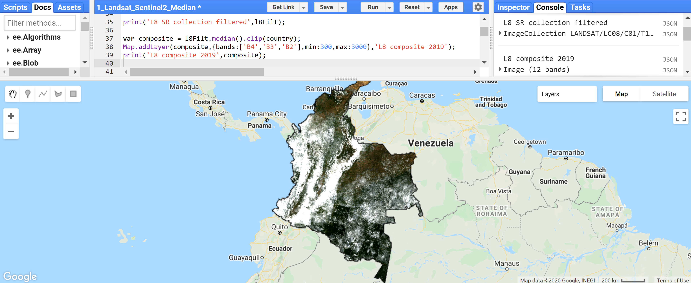
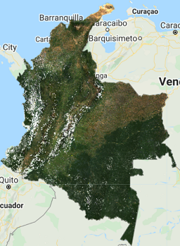
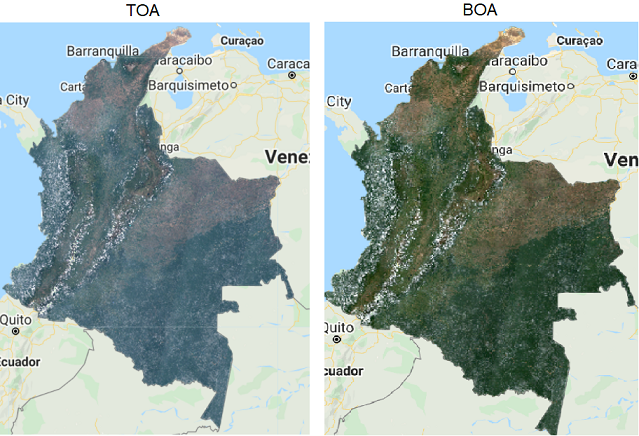
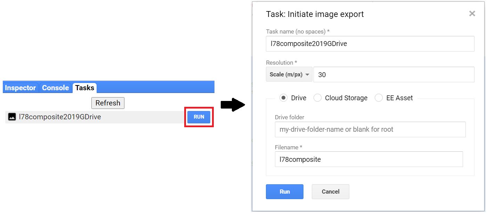

# 1.1 Creación de Imagen Compuesta/Mosaico para Landsat y Sentinel-2 en Google Earth Engine

## 1 Contexto

Este tutorial le explicará como crear una imagen compuesta usando imágenes de Landsat y/o Sentinel-2 a un nivel nacional en Google Earth Engine (GEE). Aquí, el proceso es demostrado para el país de Colombia. El tutorial viene acompañado por un repositorio de GEE que contiene 3 scripts y una serie de videos que explican algunas de las secciones. Los scripts le dan la habilidad de crear una imagen compuesta que puede ser utilizada en las siguientes secciones de este entrenamiento. 

### 1.1 Prerrequisitos para este módulo

- Conocimiento básico a intermedio de conceptos de teledetección
  - Puede referirse al entrenamiento de [NASA ARSET, Fundamentales de Teledetección](https://appliedsciences.nasa.gov/join-mission/training/english/fundamentals-remote-sensing). Incluye conceptos básicos de teledetección satelital, incluyendo orbitas de satélites, tipos, resoluciones, sensores, y niveles de procesamiento. Está bajo demanda y cualquier persona lo puede tomar (solo está disponible en ingles)
- Cuenta de GEE
  - Cualquier persona puede inscribirse a GEE. GEE es gratis para el uso no comercial. Para inscribirse, por favor complete [este formulario](https://earthengine.google.com/signup/). Una vez que haya sido aceptado/a, recibirá un correo electrónico con información adicional. 
- Conocimiento básico a intermedio de la programación
  - Ver entrenamientos útiles e información acerca de la programación JavaScript para GEE en la Sección 3 de GEE
- GEE funciona mejor con el navegador [Google Chrome](https://www.google.com/chrome/) 

### 1.2 Repositorio

[Este repositorio](https://code.earthengine.google.com/?accept_repo=users/openmrv/MRV) contiene una subcarpeta llamada "Composite" con los scripts que ejecutan todas las operaciones que aprenderá en este entrenamiento.  Los scripts principales son: 

1. `Landsat_Sentinel2_Median` contiene todos los pasos en la orden que seguirá en este módulo (con excepción de la Sección 4.2.6 Imagen Compuesta Medoide) para crear imágenes compuestas medianas usando las colecciones de Landsat y Sentinel-2.
2. `Landsat_Sentinel2_Median2` es una versión optimizada del script anterior. Contiene todas las variables de usuario arriba y las funciones/código que no necesitan ser modificados abajo.
3. `Landsat_Medoid` contiene el método de composición usando el medoide en lugar del mediano para las colecciones de Landsat. 

Adicionalmente, encontrará dos scripts que son copia del segundo script `Landsat_Sentienl2_Median2` pero aplicadas a dos países diferentes: Mozambique y Camboya. En el repositorio se llaman `Mozambique` y `Camboya`. Estos se explican en la Sección 6. Ejemplos Adicionales.

Finalmente, el script llamado `Video` es el script generado de las grabaciones de los videos. Este script contiene todos los pasos en este tutorial pero con poca o ninguna documentación. 

Se le aconseja que siga los pasos siguientes escribiendo los scripts usted mismo para tener una mejor experiencia de aprendizaje, y solo usar los scripts proveídos como referencia durante el tutorial, o después de que entienda todos los procesos explicados aquí.

### 1.3 Videos

El canal de YouTube titulado [Open MRV](https://www.youtube.com/channel/UCdPooUCxF3HRIWdEh4pwrqQ) contiene videos que explican algunas secciones de este y otros módulos. Para este modulo, un video fue creado para cada subsección de la Sección 4. Creando una imagen compuesta. Por favor note que el desarrollo del script en los videos pueda que no sea idéntico al del tutorial (por ejemplo, el orden de las líneas de código y los nombres de las variables pueden ser diferentes, etc.), y que cada video le da seguimiento a los videos previos. De cualquier modo, los resultados son los mismos. Puede encontrar un enlace en cada sección siguiente al video correspondiente. Se le recomienda que complete cada sección antes de mirar los videos.

## 2 Objetivos de Aprendizaje

- Aprender como crear una imagen compuesta 
- Familiarizarse con una variedad de opciones que incluyen: seleccionar fechas, sensores, y métodos de mosaico
- Aprender como exportar el mosaico/imagen compuesta

## 3 Google Earth Engine (GEE)

El atractivo de usar GEE es que GEE contiene multi-petabytes de imágenes satelitales y datos geoespaciales, permitiendo que sus usuarios computen análisis a escala masiva en una plataforma basada en la nube.  GEE contiene JavaScript (usado en este caso) y una Interfaz de programación de aplicaciones (API por sus siglas en ingles) de Python, donde usuarios pueden subir sus propios conjuntos de datos y usar funciones integradas para completar **una enorme variedad de tareas geoespaciales a velocidades y escalas sin precedente.** Para mas información acerca de GEE por favor refiérase [a la página principal de GEE](https://earthengine.google.com/). Ahí puede encontrar tutoriales y documentación útil. Algunos enlaces relevantes se destacan a continuación:

- [Conjuntos de datos disponibles](https://developers.google.com/earth-engine/datasets/) 
- [Preguntas frecuentes](https://earthengine.google.com/faq/)
- [Empezando con GEE](https://developers.google.com/earth-engine/guides/getstarted)
- [Introducción al API de Javascript](https://developers.google.com/earth-engine/tutorials/tutorial_api_01)
- [Documentación](https://developers.google.com/earth-engine)
- [Referencia API](https://developers.google.com/earth-engine/apidocs)
- [Guía para el editor del código](https://developers.google.com/earth-engine/guides/playground)
- [Tutoriales comunitarios](https://developers.google.com/earth-engine/tutorials)
- [Guía para depurar](https://developers.google.com/earth-engine/guides/debugging)
- [Como conseguir ayuda](https://developers.google.com/earth-engine/help)
- [Alcance de Google Earth: Introducción a GEE](https://www.google.com/earth/outreach/learn/introduction-to-google-earth-engine/)
- Presentaciones de la conferencia [2019 Geo for Good Summit de Google](https://www.google.com/earth/outreach/learn/introduction-to-google-earth-engine/):
  - [Earth Engine para los que no programan](https://docs.google.com/presentation/d/10DTcBGPl0JeTEOJlSRNdj9dtGLwqq7HPLzegENygI-U/edit?usp=sharing)
  - [Codificar en GEE](https://docs.google.com/presentation/d/1KCOcW1PtFUzC4R2g3pbovtO19C4VPtjRXJxCwkG1b5Q/edit?usp=sharing)
  - [Recorrido de los conjuntos de datos de GEE y carga de datos](https://docs.google.com/presentation/d/1ODCtpBYLTNCFkFhTMBHmyVBU41XfYzv8WUN7c0dwizc/edit?usp=sharing)
  - [Estructuras de datos grandes de Earth Engine](https://docs.google.com/presentation/d/1Ksax77YPEvmseush73-6GueGA765KHBNcxuJDE9154k/edit?usp=sharing)


## 4 Creando una Imagen Compuesta

El flujo de trabajo general del proceso para este tutorial se demuestra a continuación:


Ahora completemos cada uno de estos pasos. Abra el Editor de Código escribiendo [https://code.earthengine.google.com](https://code.earthengine.google.com) en su barra de búsqueda. 

En el lado izquierdo del Editor de Código esta la pestaña Docs, la cual contiene la documentación de JavaScript API completa. La documentación se puede buscar y navegar desde la pestaña Docs. 

Por favor note que en este tutorial especifico, crearemos una imagen compuesta mediana del país de Colombia en el 2019 para propósitos de presentación. Este tutorial no garantiza que los métodos demostrados serán perfectos para cada caso individual del usuario (por ejemplo, que produzca la mejor imagen compuesta). Uno puede, y debería de, experimentar con diferentes periodos de tiempo, áreas de estudios, y métodos. 

### 4.1 Área de Interés

>  Los siguientes pasos están demostrados en el script `1_Landsat_Sentinel2_Median`.
>
> [Instrucciones de video](https://youtu.be/KoEJW1i-v_w)

Para empezar, necesitamos definir nuestra área de interés. Usaremos el conjunto de datos [Large Scale International Boundary (2017) simplified dataset](https://developers.google.com/earth-engine/datasets/catalog/USDOS_LSIB_SIMPLE_2017) creado por el Departamento de Estado de los Estados Unidos (USDOS por sus siglas en ingles) el cual contiene polígonos para todos los países del mundo. En GEE, este conjunto de datos es un `FeatureCollection`, o sea una colección de objetos. Puede pensar en sus "features" como sus datos de vector. Puede encontrar mas información acerca de `FeatureCollection` [aqui](https://developers.google.com/earth-engine/guides/feature_collections). 

Busque "USDOS" en la barra de búsqueda en el Editor de Código y haga clic en "LSIB 2017: Large Scale International Boundary Polygons, Simplified".


Una ventana pop-up demostrará la descripción, las propiedades, y los términos de uso de este conjunto de datos.


Copie y pegue el código abajo para crear una variable para este conjunto de datos.

```javascript
var lsib = ee.FeatureCollection("USDOS/LSIB_SIMPLE/2017");
```

> NOTA: Alternativamente, cualquier conjunto de datos de GEE puede ser agregado a su script haciendo clic al botón *IMPORT* a un lado de los datos. El conjunto de datos importado será visible en la parte superior del Editor de Código bajo *IMPORTS* como una variable con el nombre automática de `image` para imágenes, `imageCollection` para colecciones de imágenes, `geometry` para geometrías, `table` para un FeatureCollection, y así sucesivamente. Puede cambiar este nombre haciéndole clic y escribiendo un nombre nuevo. 

Ahora, vamos a filtrar este `FeatureCollection` para adquirir solo el polígono de Colombia. Haremos esto usando la función `filterMetadata` de GEE. Una de las propiedades del conjunto de datos LSIB se llama `country_na` y representa el nombre del país para cada polígono. De esta manera, filtraremos nuestra variable `lsib` usando `country_na` de manera que iguale "Colombia". Copie y pegue el código siguiente para crear la variable `country` para conseguir los límites del país. 

```javascript
var country = lsib.filterMetadata('country_na','equals','Colombia');
```

Para visualizar estas fronteras, puede usar la función `Map.addLayer`. Antes de hacer esto, debería centrar el mapa sobre el área de interés usando `Map.centerObject`. Copie y pegue el código siguiente para definir el centro del mapa sobre Colombia y agregar el polígono de Colombia al mapa. Haga clic en *Run* para ver los resultados. Verá que debajo del panel llamado *Layers* (capas) tendrá una capa llamada "Colombia".

```javascript
Map.centerObject(country,5);
Map.addLayer(country,{},'Colombia');
```


> NOTA: Ajuste el nivel de zoom a su preferencia cambiando el numero `5` a cualquier numero entre 1 y 24. Entre mas alto este el numero, mas se acercará el mapa. Puede usar el control deslizante bajo el panel de *Layers* (Capas) en el mapa para cambiar la opacidad de la capa.
>
> NOTA 2: La función `Map.addLayer` puede usar 5 argumentos diferentes:
>
> - `eeObject`: El objeto para agregar al mapa (en este caso, la variable `country`).
> - `visParams`: Los parámetros de visualización. Estos se explican en detalle mas tarde en el tutorial. En el ejemplo de arriba hemos dejado estos vacíos `{}`.
> - `name`: El nombre de la capa (un string, en nuestro caso: '`Colombia`').
> - `shown`: Una etiqueta que indica si la capa debe de estar activada de forma predeterminada (esto puede ser muy útil cuando este experimentando con diferentes parámetros y tiene varias capas). Este es un argumento Booleano y usa `True` automáticamente.
> - `opacity`: La opacidad de la capa representada por un numero entre 0 y 1. Se le da valor de 1 automáticamente. 

### 4.2 Colección de Landsat
#### 4.2.1 Empezando con Landsat 8

>[Instrucciones de video](https://youtu.be/J6o6NLqsobw)

Comenzaremos a crear la imagen compuesta de la colección de Landsat 8. Primero, vamos a definir variables de tiempo que llamaremos '`startDate`' (fecha inicial) y '`endDate`' (fecha final). Aquí, crearemos una imagen compuesta para el año 2019, así que use el código siguiente para definir los variables de tiempo. Objetos de fecha usan el formato de `YYYY-MM-DD` (año, mes, fecha). 

```javascript
var startDate = '2019-01-01';
var endDate = '2019-12-31';
```

Ahora vamos a definir nuestra variable de la colección de Landsat 8. Usaremos el producto [USGS Landsat 8 Surface Reflectance Tier 1](https://developers.google.com/earth-engine/datasets/catalog/LANDSAT_LC08_C01_T1_SR) en GEE. Este conjunto de datos es la reflectancia de superficie con correcciones atmosféricas de los sensores de Landsat 8 OLI/TIRS. Las imágenes contienen 5 bandas visibles y de infrarrojo cercano (NIR por sus siglas en ingles), y 2 bandas de infrarrojo de onda corta (SWIR por sus siglas en ingles) procesadas a una reflectancia de superficie orto-rectificada, y 2 bandas de infrarrojo térmico (TIR por sus siglas en ingles) procesadas a temperatura de brillo orto-rectificada.

```javascript
var l8 = ee.ImageCollection('LANDSAT/LC08/C01/T1_SR');
```

> NOTA: Si intenta hacerle `print` a esta colección, un mensaje de error aparecerá en la consola. Esta colección contiene el archivo entero de Landsat 8 desde el 2013 hasta el presente para todo el planeta. Cualquier función de `print` abortará después de acumular los metadatos de mas de 5,000 elementos. 

Ahora, vamos a filtrar esta colección a nuestra área de interés (Colombia, `var country`) y periodo de tiempo (`startDate`, `endDate`). Usaremos las funciones `filterBounds`y `filterDate`. 

```javascript
var l8Filt = l8.filterBounds(country)
			   .filterDate(startDate,endDate);
```

Imprima `l8Filt` con la función `print` para ver su colección filtrada. Haga clic en *Run* después de agregar la línea siguiente. La *consola* demostrará que la colección tiene 956 imágenes. 

```javascript
print('L8 SR collection filtered',l8Filt);
```


Con la colección filtrada, vamos a crear una imagen compuesta usando un reductor mediano. Usaremos la función `median()` para `ee.ImageCollection` y la función `clip()` para reducir la imagen compuesta a nuestra área de interés. 

La función `median()`para `ee.ImageCollection` es lo que se conoce en GEE como un `ee.Reducer` (reductor), y estamos usando `ee.Reducer.median()` específicamente. Los reductores son la forma GEE de agregar datos a lo largo del tiempo, el espacio, las bandas, las matrices y otras estructuras de datos. La figura siguiente demuestra una colección de imágenes siendo "reducida" a una imagen individual con un `ee.Reducer`: 


En nuestro caso, estamos tomando el valor mediano sobre una serie temporal (nuestra colección). El resultado es computado pixel por pixel, de manera que cada pixel en el resultado esta compuesto del valor mediano de todas las imágenes en la colección sobre esa ubicación. Alternativamente, puede experimentar usando `mean()`, `min()`, etc., como reductores en lugar del valor mediano.

> Para mas información y ejemplos de Reductores, y específicamente para reducir una colección de imágenes, por favor revise estos paquetes:  
>
> - [Visión General de Reductores](https://developers.google.com/earth-engine/guides/reducers_intro)
> - [Reducciones de `ImageCollection`](https://developers.google.com/earth-engine/guides/reducers_image_collection)
> - [Reduciendo un `ImageCollection`](https://developers.google.com/earth-engine/guides/ic_reducing)
> - [Componer Imágenes, Aplicar Máscaras, y Crear Mosaicos](https://developers.google.com/earth-engine/tutorials/tutorial_api_05)

Copie y pegue el código siguiente y hacer clic en *Run*. El resultado será un `ee.Image`.

```javascript
var composite = l8Filt.median().clip(country);

Map.addLayer(composite,{bands:['B4','B3','B2'],min:300,max:3000},
             'L8 Composite 2019');

print('L8 composite 2019',composite);
```

> NOTA:  Hay una variedad de opciones disponibles para ajustar como las imágenes son visualizadas usando la función `Map.addLayer`. Estos parámetros van dentro del argumento `visParams` en la función `Map.addLayer`. Las entradas más comunes para modificar los ajustes de visualización incluyen las siguientes:
>
> - Bands (Bandas): permite que el usuario especifique cuales bandas demostrar como rojos, verde, y azul. In el caso presente estamos usando las bandas B4, B3, y B2 de Landsat 8, las cuales corresponden con rojo, verde, y azul respetivamente. 
> - Min y max: define el rango estirado de los colores. El rango depende del tipo de datos. Por ejemplo, imágenes de 16-bit sin signo tiene un rango total de 0 a 65,536. Esta opción permite que define la visualización a un subconjunto de ese rango total. En este caso, definimos nuestro mínimo = 300 y nuestro máximo = 3000 y estos corresponden con los valores de reflectancia de superficie. 
> - Palette (Paleta): especifica la paleta de color usada para visualizar la información. No usada en este caso.

Puede probar parámetros de visualización haciéndole clic al ícono de los ajustes  a un lado de la capa "Composite 2019" y experimentar con las opciones de estiramiento. 




En el mapa, debería de ser visible una imagen muy nublada como la de arriba. Vamos a intentar agregar un pre-filtro para las nubes cuando filtremos nuestra colección. La colección de Landsat viene con una propiedad llamada `CLOUD_COVER`, y podemos definir un porcentaje de cobertura de nube como un umbral para filtrar las escenas. Usaremos la función `filterMetadata` para filtrar imágenes con cobertura de nube de menos de 50%. Copie y pegue el código siguiente y haga clic en *Run*. 

```javascript
var l8Filt2 = l8.filterBounds(country)
               .filterDate(startDate,endDate)
               .filterMetadata('CLOUD_COVER','less_than',50);

print('Landsat 8 SR collection filtered for clouds',l8Filt2);

var composite2 = l8Filt2.median().clip(country);

Map.addLayer(composite2,{bands:['B4','B3','B2'],min:300,max:3000},
             'L8 composite 2019 pre cloud filter');

print('L8 composite 2019 pre cloud filter',composite2);
```

Podrá apreciar que esta imagen compuesta se mira un poco mejor que la anterior, pero aun tiene muchas nubes. En la consola, también note que la nueva colección tiene 454 imágenes comparado con las 956 en la colección previo. 


Intente ajustar el umbral de CLOUD_COVER a diferentes porcentajes y revisar los resultados. Ejemplo: con un 20% definido como el umbral, puede ver que muchas partes del país tienen vacíos. Adicionalmente, algunas losas presentan un alto porcentaje de cobertura de nubes aun con el filtro de nubes. 


Esto es debido a la persistencia de cobertura de nubes sobre ciertas regiones de Colombia. Podemos aplicar una Máscara de Nubes para mejorar los resultados. Las colecciones de Landsat 8 contienen una banda de Quality Assessment (Evaluación de Calidad) llamada `pixel_qa` que provee información útil acerca de ciertas condiciones dentro de los datos, y permite que los usuarios apliquen filtros por pixel. Cada pixel en la banda QA contiene íntegros no firmados que representan combinaciones de combinaciones de bit de las condiciones de la superficie, la atmosfera, y el sensor. De interés particular son los Bits 3 y 5 que representan sombra de nube, y nube, respectivamente. 

Crearemos una función para aplicar una mascara de nubes a cada imagen en la colección de imágenes usando la función de colección de imagen `map`. Copie y pegue el código siguiente y hacer clic en *Run*. 

```javascript
function maskL8srClouds(image) {
  // Los Bits 3 y 5 son sombra de nube y nube, respectivamente
  var cloudShadowBitMask = (1 << 3);
  var cloudsBitMask = (1 << 5);
  // Conseguir la banda de pixel QA
  var qa = image.select('pixel_qa');
  // Ambas banderas deben de estar puestas en cero, lo cual indica condiciones claras
  var mask = qa.bitwiseAnd(cloudShadowBitMask).eq(0)
                .and(qa.bitwiseAnd(cloudsBitMask).eq(0));
  return image.updateMask(mask);
}

var l8FiltMasked = l8.filterBounds(country)
                .filterDate(startDate,endDate)
                .filterMetadata('CLOUD_COVER','less_than',50)
                .map(maskL8srClouds);

print('L8 SR collection filtered and masked', l8FiltMasked);

var l8compositeMasked = l8FiltMasked.median().clip(country);

print('L8 composite 2019 masked', l8compositeMasked);

Map.addLayer(l8compositeMasked,
             {bands:['B4','B3','B2'],min:0,max:2000},
             'L8 composite 2019 masked');
```

> NOTA: Dado que estamos trabajando con Bits, en la función `maskL8srClouds(image)` utilizamos el operador de shift a la izquierda `<<` para cambiar el primer operando hacia la izquierda el numero de Bits especificado, y la función `bitwiseAnd` para calcular el bitwise *y* los valores de entrada. Para mas detalles, revisar: 
>
> - Bits: [Earth Observatory - Remote Sensing Pixels and Bits](https://earthobservatory.nasa.gov/features/RemoteSensing/remote_06.php), [NASA Earthdata - What is Remote Sensing?](https://earthdata.nasa.gov/learn/backgrounders/remote-sensing), [National University of Singapore - Digital Image](https://crisp.nus.edu.sg/~research/tutorial/image.htm)
> - [Left shift operator in JavaScript](https://developer.mozilla.org/en-US/docs/Web/JavaScript/Reference/Operators/Left_shift)
> - [GEE `bitwiseAnd` function](https://developers.google.com/earth-engine/apidocs/ee-image-bitwiseand)


La imagen compuesta que resulta demuestra nubes enmascaradas y es un gran mejoramiento comparado a las imágenes compuestas anteriores. Sin embargo, los vacíos de datos siguen siendo un problema dado la cobertura de nubes. Si no es necesario una imagen compuesta anual, puede crear una imagen compuesta de dos años para amortiguar el problema de falta de datos. Próximamente, intentaremos eso: 

> NOTA: En este punto, probablemente a notado que las capas duran mucho para visualizarse (o sea, el código en general es mas lento). Para evitar esperas largas para ver los resultados y correr el riesgo de causar un error de exceder la capacidad de memoria de GEE, puede convertir algunas de las funciones `print` y `Map.addLayer` en comentarios. También puede convertir variables que no está utilizando en comentarios. Esto se hace agregando barras diagonales dobles `//` al principio de las líneas de código o haciéndole clic a la línea de código deseada y presionando *Ctrl + /*. Use esta estrategia el resto de este tutorial y solo haga `print` o `Map.addLayer` a las imágenes compuestas deseadas, o para revisar errores intermedios si le ocurre uno.
>
> Ejemplo visual de un código sin comentario:
>
> ```javascript
> var composite = l8Filt.median().clip(country);
> 
> Map.addLayer(composite,{bands:['B4','B3','B2'],min:300,max:3000},'Composite 2019');
> 
> print('L8 composite 2019',composite);
> ```
>
> Ejemplo visual de código con comentarios:
>
> ```javascript
> // var composite = l8Filt.median().clip(country);
> 
> // Map.addLayer(composite,{bands:['B4','B3','B2'],min:300,max:3000},'Composite 2019');
> 
> // print('L8 composite 2019',composite);
> ```
>
> NOTA 2: También puede poner el argumento `shown` en las funciones de `Map.addLayer` como falso (`False`) para que esas capas no sean visualizadas automáticamente al mapa.

#### 4.2.2 Agregando un año más de datos 

> [Instrucciones de Video](https://youtu.be/Q5cjLW_yf7k)

Crearemos una variable nueva `l8TwoYearComposite`, la cual será nuestra imagen compuesta de Landsat 8 de dos años. Filtraremos la colección de Landsat 8 con una fecha inicial diferente esta vez (`2018-01-01`) para incluir imágenes del 2018 y el 2019, aplicar la función de máscara de nubes, aplicar el reductor mediano para conseguir la imagen compuesta, y finalmente reducir el mapa al país de Colombia. Copie y pegue el código siguiente y haga clic en *Run*: 

```javascript
// Incorporando datos del 2018
// Crear una imagen compuesta de dos años filtrando los datos de Landsat 8 del 2018 y 2019,
// aplicar la máscara de nube, el reductor mediano, y reducir al país
var l8TwoYearComposite = l8.filterBounds(country)
                .filterDate('2018-01-01',endDate) // Note que cambiamos la fecha inicial
                .filterMetadata('CLOUD_COVER','less_than',60)
                .map(maskL8srClouds)
                .median()
                .clip(country);

Map.addLayer(l8TwoYearComposite,{bands:['B4','B3','B2'],min:0,max:2000},'Landsat 8 Two-Year composite');
```


La imagen resultante tiene menos vacíos de datos. Si el periodo de tiempo no es una restricción para la creación de su imagen compuesta, puede incorporar mas imágenes de un tercer año, y así sucesivamente. 

Otra opción para mejorar los vacíos de datos es usar imágenes de otros sensores para el periodo de tiempo de interés. Afortunadamente, la colección de Landsat abarca varias misiones, las cuales han adquirido datos continuamente desde 1972 con diferentes fechas de adquisición. Próximamente, incorporaremos imágenes de Landsat 7 del 2019 para llenar los vacíos en la imagen compuesta de Landsat 8 del 2019. 

#### 4.2.3 Agregando la Colección de Landsat 7 

> [Instrucciones de Video](https://youtu.be/vu61q6vsno8)

Como Landsat 8, usaremos el producto  [USGS Landsat 7 Surface Reflectance Tier 1](https://developers.google.com/earth-engine/datasets/catalog/LANDSAT_LE07_C01_T1_SR) en GEE. Este conjunto de datos es la reflectancia de superficie con correcciones atmosféricas del sensor de Landsat 7 ETM+. Estas imágenes contienen 4 bandas visibles y de infrarrojo cercano (VNIR), además de 2 bandas de infrarrojo de onda corta (SWIR) procesadas a una reflectancia de superficie ortorectificada, y otra banda de infrarrojo térmica (TIR) procesada a la temperatura de brillo ortorectificada. 

Primero vamos a ver como se vería una imagen compuesta de Landsat 7 para obtener una comprensión completa.

Los próximos pasos son muy similares a los que hicimos para crear la imagen compuesta de Landsat 8. Primero, vamos a definir la variable de la colección de Landsat 7. 

```javascript
var l7 = ee.ImageCollection('LANDSAT/LE07/C01/T1_SR');
```

Inmediatamente aplicaremos una máscara de nube a esta colección ya que vimos que Colombia tiene cobertura de nube consistente. Vamos a definir la función de máscara de nube para Landsat 7.

```javascript
function maskL7srClouds(image) {
  var qa = image.select('pixel_qa');
  // Si el bit de nube (5) esta definido y la confianza de nube (7) es alta
  // o el bit de la sombra de nube esta definido (3), entonces es un pixel malo.
  var cloud = qa.bitwiseAnd(1 << 5)
                  .and(qa.bitwiseAnd(1 << 7))
                  .or(qa.bitwiseAnd(1 << 3));
  // Eliminar pixels de la orilla que no ocurren en todas las bandas
  var maskL7 = image.mask().reduce(ee.Reducer.min());
  return image.updateMask(cloud.not()).updateMask(maskL7);
}
```

Vamos a filtrar la colección de Landsat 7 con los mismos filtros que usamos para Landsat 8, aplicar la máscara de nubes, y crear la imagen compuesta de Landsat 7.

```javascript
var l7FiltMasked = l7.filterBounds(country)
                .filterDate(startDate,endDate)
                .filterMetadata('CLOUD_COVER','less_than',50)
                .map(maskL7srClouds);

print('L7 SR collection masked',l7FiltMasked);

var l7compositeMasked = l7FiltMasked.median().clip(country);

Map.addLayer(l7compositeMasked,{bands:['B3','B2','B1'],min:0,
                                max:2000},'L7 composite 2019 masked');
```

> NOTA: Usamos `bands:['B3','B2','B1']` esta vez porque Landsat 7 tiene diferentes designaciones de bandas. Los sensores a bordo de cada uno de los satélites de Landsat fueron diseñados para adquirir datos en diferentes rangos de frecuencias a lo largo del espectro electromagnético. Las bandas rojas, verdes, y azules corresponden a B4, B3, y B2 respetivamente. Para Landsat 7, estas mismas bandas son B3, B2, y B1 respetivamente. Para mas información, referirse a [esta página](https://www.usgs.gov/faqs/what-are-band-designations-landsat-satellites?qt-news_science_products=0#qt-news_science_products).


Debería de ver una imagen con muchos vacíos como la imagen de arriba. Landsat 7 fue lanzado en 1999 pero desde el 2003, el sensor adquirió y entrego datos con vacíos de datos causados por una falla del Corrector de Línea de Escaneo (SLC, por sus siglas en ingles). Sin un SLC operativo, la línea de vista del sensor sigue un patrón zig-zag a lo largo de la trayectoria terrestre de satélite. Como resultado, el área capturada es duplicada. Cuando los datos de Nivel-1 son procesados, se eliminan las áreas duplicadas, dejando vacíos de datos. Para mas información acerca de Landsat 7 y el error de SLC, por favor referirse a esta página. 


Podemos usar los datos de Landsat 7 en nuestra imagen compuesta a pesar del error de SLC. Ahora, vamos a combinar las colecciones de Landsat 7 y 8. 

#### 4.2.4 Combinando dos sensores en una imagen compuesta

> [Instrucciones de Video](https://youtu.be/COobcYDThxo)

Como se mencionó previamente, Landsat 7 y 8 tienen diferentes designaciones de bandas. Dado esto, vamos a crear una función donde les damos nombres nuevos a las bandas de Landsat 7 para que coincidan con las de Landsat 8 y mapear esa función a nuestra colección L7. 

```javascript
// Ya que Landsat 7 y 8 tienen diferentes designaciones de bandas
// vamos a crear una función para renombrar las bandas de L7 para que coincidan con L8.
function rename(image){
  return image.select(
    ['B1', 'B2', 'B3', 'B4', 'B5', 'B7'],
    ['B2', 'B3', 'B4', 'B5', 'B6', 'B7']);
}

// Aplicar la función 'rename' para renombrar
var l7FiltMaskedRenamed = l7FiltMasked.map(rename);

print('L7 SR collection renamed',l7FiltMaskedRenamed);
```

> NOTA: Si revisa las bandas de las primeras imágenes de las colecciones `l7FiltMasked` y `l7FiltMaskedRenamed` verá que los nombres de las bandas fueron cambiados, y no todas las bandas fueron copiadas (`sr_atmos_opacity`, `sr_cloud_qa`, `pixel_qa`,  `radsat_qa`, y`B6`). Para copiar estas bandas adicionales, simplemente agréguelas a la función para renombrar (para `B6` necesitará renombrarla para que no tenga el mismo nombre que la nueva `banda 5`). La imagen siguiente demuestra las bandas de la primera imagen de la colección de Landsat 7 a la izquierda, y las bandas de la primera imagen de la colección Landsat 7 renombrada a la derecha. 
>
> 

Ahora combinaremos ambas colecciones. Usaremos la función `merge` para `imageCollection`. Copie y pegue el código siguiente y haga clic en *Run*. Vera en la consola que ahora tiene una colección de 999 imágenes (563 de Landsat 8 y 436 de Landsat 7). 

```javascript
// Combinar colecciones Landsat 
var l78 = l7FiltMaskedRenamed.merge(l8FiltMasked);
print('Merged collections',l78);
```


Ahora, para crear la imagen compuesta, haremos lo mismo que antes. Note que si ejecuta el código siguiente, dará con un error:

```javascript
// Crear imagen compuesta de Landsat 7 y 8 y agregar al Mapa
var l78composite = l78.median().clip(country); // puede ser cambiada a medio, minimo, etc
Map.addLayer(l78composite,{bands:['B4','B3','B2'],min:0,max:2000},
             'Landsat 7 and 8 composite');
```


Esto es porque la colección de Landsat 7 tiene 6 bandas y Landsat 8 tiene 12 bandas. Para crear los mosaicos y agregarlos al mapa, deben tener el mismo número de bandas. Modificaremos el bloque de código donde estamos combinando las colecciones para agregar una función de `select` a la colección de Landsat 8. La función `select` seleccionará bandas especificas de las imágenes. Seleccionaremos solo las bandas disponibles en la colección de Landsat 7. Para lograr esto, cambie el procedimiento de combinación:

```javascript
// Combinar colecciones de Landsat 
var l78 = l7FiltMaskedRenamed.merge(l8FiltMasked
          .select('B2','B3','B4','B5','B6','B7'));
print('Merged collections',l78);

// Crear imagen compuesta de Landsat 7 y 8 y agregar al Mapa
var l78composite = l78.median().clip(country);// puede ser cambiada a medio, minimo, etc
Map.addLayer(l78composite,{bands:['B4','B3','B2'],min:0,max:2000},
             'Landsat 7 and 8 2019 composite');
```

Debería de ver una imagen compuesta parecida a esta:


Comparado a las imágenes compuestas solo de Landsat 8, puede ver que algunos de los vacíos han sido llenados. Sin embargo, dado a la naturaleza de composición/combinación en general, y el error de SLC de Landsat 7, puede ver artefactos en algunas regiones (ejemplo en la centroide Latitud: 1.46, Longitud: -69.99). Compuesta de Landsat 8 exclusivamente (a la izquierda) e imagen compuesta de Landsat 7 y 8 (a la derecha)

j

#### 4.2.5 Tratando de llenar los vacíos de datos con funciones de Media Focal (o Mediana Focal)

> [Instrucciones de Video](https://youtu.be/hYtoWeVwoKs)

Podemos tratar de llenar vacíos de datos usando una función de media focal o mediana focal a las imágenes de la colección. Estos aplican un filtro morfológico a cada banda de una imagen ingresando los píxeles en un kernel personalizado y luego aplicando una mezcla. Para mas información acerca de las funciones focales referirse [esta página](https://developers.google.com/earth-engine/guides/image_morph). En el mismo código, vamos a agregar un bloque de código abajo. Primero, crearemos una función para aplicar la media focal (focal_mean) o mediana focal (focal_median) a cada imagen en la colección de Landsat 7, y luego combinaremos las colecciones como antes, y crearemos una imagen compuesta nueva. 

> NOTA: La función focal_mean contiene 5 argumentos de entrada: `radius`, `kernelType`, `units`, `iterations`, y `kernel`. Puede encontrar más información acerca de cada uno de ellos buscando la media focal en la pestaña *Docs* (y cualquier otra función de GEE). Para este ejemplo, definimos un radio de 1.5, un núcleo de tipo cuadrado, un núcleo pixel, y 2 iteraciones. Usted puede experimentar con variables diferentes. Entre mas grande los valores, mas borrosos se verán los datos.
>
> 

```javascript
// Función para llenar vacíos debido al error SLC usando media focal
function fillGap(image){
  return image.focal_mean(1.5, 'square', 'pixels', 2).blend(image);
}

// Aplicar función fillGap a colección de Landsat 7 y combinar con colección Landsat 8
var l78Fill = l7FiltMaskedRenamed.map(fillGap).merge(l8FiltMasked
              .select('B2','B3','B4','B5','B6','B7'));

// Crear imagen compuesta
var l78compositeFill = l78Fill.median().clip(country); // puede ser cambiado a medio, mínimo, etc

Map.addLayer(l78compositeFill,{bands:['B4','B3','B2'],min:0,
                               max:2000},'Landsat 7 and 8 2019 composite focal fill');
```

Debería de ver una imagen compuesta como la siguiente. En este caso particular, puede que valga la pena no aplicar este método ya que "creó" nuevos pixeles que parecen nubes y el método anterior da mejor resultado. Sin embargo, para otras regiones con menos cobertura de nube, este paso adicional puede ser útil. 


#### 4.2.6 Imagen Compuesta Medoide

> Los siguientes pasos están demostrados en el código `3_Landsat_Medoid`.
>
> [Instrucciones de Video](https://youtu.be/0cVKrY0IAYY)

Un medoide es un objeto representativo de un conjunto de datos cuyas disimilitudes promedias a todos los objetos en un grupo son mínimas. El método medoide en el contexto de teledetección fue introducido por Flood (2013). Para el pixel dado de una imagen, el medoide es el valor de una banda que es numéricamente el más cercano la mediano de todos los pixeles correspondientes entre las imágenes consideradas (todas las imágenes en la colección). Usamos el método medoide para encontrar los mejores pixeles disponibles para componer, y como una alternativa para las imágenes compuestas medianas. El proceso requiere poca lógica, es robusto, y es rápido. Puede pensar en el medoide como un mediano multi-dimensional. Por favor consulte Flood (2013), y/o Roberts et al. (2017) para una explicación mas a fondo de este método. 

Primero calculamos la diferencia entre el mediano y la observación por imagen por banda, y luego seleccionamos el pixel de la imagen con la diferencia mas pequeña entre el mediano y la observación para conseguir el medoide. Crearemos una compuesta de medoide para la colección combinada de Landsat 2019 (`var l78`). Copie y pegue el código siguiente y revisar los resultados en el Mapa. 

```javascript
// Calcular mediano a traves de todas las imágenes en la colección por banda
var l78median = l78.median(); // calcular el mediano de la coleccion anual de imágenes - resulta en imagen singular de 6 bandas - el mediano de la colección por banda
  
// Calcular la diferencia entre el mediano y la observación por imagen por banda 
// luego seleccionar el pixel de imagen con la diferencia mas pequeña  
// entre el medio y la observación por banda para encontrar el medoide
var l78medoidComposite = l78.map(function(image) {
  var diff = ee.Image(image).subtract(l78median).pow(ee.Image.constant(2)); // obtener la diferencia entre cada imagen/banda y el medio de la banda correspondiente y sube la potencia al doble para hacer que negativos sean positivos y hacer que diferencias mas grandes lleven mas peso 
  return diff.reduce('sum').addBands(image);  // por imagen en colección, sumar la diferencia (a la potencia de 2) a traves de las bandas - poner esto como la primera banda y agregar las bandas SR a esta - ahora es una colección de imagenes de 7 bandas 
}).reduce(ee.Reducer.min(7)).select([1,2,3,4,5,6], ['B2','B3','B4','B5','B6','B7']) // encontrar la diferencia (a la potencia de 2) que sea la menor - cual objeto de imagen es el mas cercano al medio de la coleccion - y luego reducir las bandas SR al area de interes y renombrarlas - dejar atras la banda de diferencia (a la potencia de 2);
  .clip(country); 
  
Map.addLayer(l78medoidComposite,{bands:['B4','B3','B2'],min:0,max:2000},'L7&8 Medoid composite 2019');
```



Debería de ver una imagen como la de arriba. A primera vista, se puede pensar que no hay mucha diferencia comparado con la imagen compuesta mediana. Sin embargo, la imagen compuesta medoide puede demostrar mejoramientos importantes para ciertos pixeles. Ver el ejemplo siguiente para el punto (2.86, -74.73) donde áreas con nubes en el mediano están representadas de mejor manera en la imagen compuesta medoide. 


Ahora, vamos a crear una imagen compuesta mediana con los datos de Copernicus Sentinel-2 de la Agencia Espacial Europea (ESA por sus siglas en ingles). Sentinel-2 es una misión de adquisición de imágenes multi-espectral, de alta-resolución, y de andana ancha  que apoya estudios de Monitoreo Terrestre de Copernicus, incluyendo el monitoreo de vegetación, tierra, y agua, al igual que la observación de vías navegables interiores y de áreas costeras. 

### 4.3 Colección de Sentinel-2

> Los siguientes pasos están demostrados en el código `1_Landsat_Sentinel2_Median`.
>
> [Instrucciones de Video](https://youtu.be/13plGNvnmkI)

Vamos a comenzar por definir nuestra variable de la colección de Sentinel-2. Usaremos el producto de  [Sentinel-2 MSI: MultiSpectral Instrument, Level-2A](https://developers.google.com/earth-engine/datasets/catalog/COPERNICUS_S2_SR) de la ESA, el cual es el producto de fondo de atmósfera (o sea la Reflectancia de Superficie). 

```javascript
// Usaremos el producto de reflectancia de superficie de Sentinel-2.
// Este conjunto de datos ya ha sido procesado con correcciones atmosféricas
var s2 = ee.ImageCollection("COPERNICUS/S2_SR");
```

> NOTA: Los datos Nivel-2 (L2) de Sentinel-2 en GEE son bajados del [scihub](https://scihub.copernicus.eu/) de la ESA. Fueron computados ejecutando  [sen2cor](https://step.esa.int/main/third-party-plugins-2/sen2cor/). Estos "assets" (recursos) contienen 12 bandas espectrales UINT16 representando reflectancia de superficie (SR) escalado por 10000 (a diferencia de datos a Nivel 1 (L1), no hay Banda 10). También hay mas bandas que son específicamente de productos L-2 (ver lista de bandas para detalles). Ver el [Sentinel-2 User Handbook](https://sentinel.esa.int/documents/247904/685211/Sentinel-2_User_Handbook) para más detalles. Adicionalmente, 3 bandas QA están presentes donde 1 (QA60) es la banda bitmask con información de máscara de nube. Para más detalles, mirar [la explicación completa de como se computan las máscaras de nube.](https://sentinel.esa.int/web/sentinel/technical-guides/sentinel-2-msi/level-1c/cloud-masks)

Definimos una función para aplicar una máscara de nubes a las imágenes de Sentinel-2 usando la banda QA60, la cual contiene información acerca de máscaras de nube. Luego, de manera similar a las colecciones de Landsat, filtraremos la colección de Sentinel-2 con nuestros parámetros definidos (fecha inicial 'startDate', fecha final 'endDate', país 'country', etc). Copie y pegue el código siguiente y hacer clic en *Run*. 

```javascript
// Función para enmascarar nubes S2 
function maskS2srClouds(image) {
  var qa = image.select('QA60');

  // Bits 10 y 11 son nubes y cirro, respectivamente
  var cloudBitMask = 1 << 10;
  var cirrusBitMask = 1 << 11;

  // Ambas flags(etiquetas) deben de estar puestas en cero, indicando condiciones claras
  var mask = qa.bitwiseAnd(cloudBitMask).eq(0)
      .and(qa.bitwiseAnd(cirrusBitMask).eq(0));

  return image.updateMask(mask).divide(10000);
}

// Filtrar colección Sentinel-2 
var s2Filt = s2.filterBounds(country)
                .filterDate(startDate,endDate)
                .filterMetadata('CLOUDY_PIXEL_PERCENTAGE',
                                'less_than',50)
                .map(maskS2srClouds);

// print('Sentinel-2 Filtered collection',s2Filt);
```

> NOTA: Para Sentinel-2 usamos la propiedad llamada `CLOUDY_PIXEL_PERCENTAGE` para filtrar imágenes con alta cobertura de nubes.
>
> NOTA 2: La función `print` se convierte en comentario porque si intenta hacerle `print` a una colección, obtendrá un error. A diferencia de imágenes de Landsat las cuales tienen una resolución espacial de 30 metros, imágenes de Sentinel-2 tienen una resolución espacial de 10 metros (para bandas visibles y de infrarrojo cercano), el ciclo de repetición es mas corto (12 días comparado con los 16 días de Landsat) y hay una diferencia en el ancho de la andana. Estas características hacen que la colección sea mas grande, y en este caso, la colección filtrado de Sentinel-2 contiene mas de 5,000 elementos, lo cual es el limite para la función de `print`. 

Ahora, vamos a componer nuestra colección del 2019 y agregarla al mapa. 

```javascript
// Componer imágenes
var s2composite = s2Filt.median().clip(country); // puede ser cambiado a medio, minimo, etc 

// Agregar imagen compuesta al mapa
Map.addLayer(s2composite,{bands:['B4','B3','B2'],min:0.02,max:0.3,
                          gamma:1.5},'Sentinel-2 2019 composite');
```


> Adicionalmente: Puede intentar una combinación de banda diferente para visualizar la imagen compuesta de Sentinel-2. Intente la combinación de colores falsos siguiente usando las bandas SWIR 1, NIR, y Azul. Esta combinación de bandas es frecuentemente usada para monitorear la salud del los cultivos por la manera en la que usa infrarrojo cercano y de onda corta. Ambas bandas son particularmente eficientes en destacar vegetación densa, la cual aparece como verde oscuro. [Esta pagina](https://gisgeography.com/sentinel-2-bands-combinations/)(https://gisgeography.com/sentinel-2-bands-combinations/)  explica las diferentes combinaciones de bandas de Sentinel-2. 
>
> ```javascript
> // Intente otra combinación de bandas (SWIR 1, NIR, Azul)
> Map.addLayer(s2composite,{bands:['B11','B8','B2'],min:0,max:0.6},
>           'Sentinel-2 2019 composite SWIR/NIR/Blue');
> ```
>
> 

#### Advertencia: Reflectancia de Superficie vs. Productos de la Cima de la Atmósfera

La Agencia Espacial Europea no produjo datos de Sentinel-2 a Nivel-2 (reflectancia de fondo de atmosfera, o BOA por sus siglas en ingles) para todos los assets (recursos) de Nivel-2 (cima de la atmosfera, TOA por sus siglas en ingles), y la cobertura de productos de Nivel-2 anteriores no es global. Pueda que no encuentre los datos de Reflectancia de Superficie para imágenes antes del 2017. Si quiere trabajar con imágenes antes del 2017, por favor use el producto [Sentinel-2 MSI: MultiSpectral Instrument, Level-1C](https://developers.google.com/earth-engine/datasets/catalog/COPERNICUS_S2), el cual corresponde con conjunto de datos de cima de la atmosfera. La identificación de Asset de GEE para esta colección es `"COPERNICUS/S2"`.

Los productos de la cima de la atmosfera (TOA) no han sido procesados con correcciones atmosféricas, a si que una imagen compuesta TOA presentará diferencias comparada a BOA ya que representa influencias atmosféricas. Próximamente, la imagen compuesta mediana del 2019 del producto Sentinel-1 L-1 es mostrada junto con la imagen compuesta del 2019 del producto L2 para una comparación.

 

Puede notar el efecto azul en la imagen compuesta TOA. Para mas información acerca de los niveles de procesamiento de Sentinel-2, por favor referirse a [esta página](https://sentinel.esa.int/web/sentinel/user-guides/sentinel-2-msi/processing-levels) (y subpáginas [Nivel-0](https://sentinel.esa.int/web/sentinel/user-guides/sentinel-2-msi/processing-levels/level-0), [Nivel-1](https://sentinel.esa.int/web/sentinel/user-guides/sentinel-2-msi/processing-levels/level-1), y [Nivel-2](https://sentinel.esa.int/web/sentinel/user-guides/sentinel-2-msi/processing-levels/level-2)). Otros recursos acerca de las diferencias entre radiancia, reflectancia, y la cima de la atmósfera son: 

- El entrenamiento previamente mencionado: [NASA ARSET's Fundamentals of Remote Sensing](https://appliedsciences.nasa.gov/join-mission/training/english/fundamentals-remote-sensing)  
- [Video de Youtube de L3Harris Soluciones Geoespaciales](https://www.youtube.com/watch?v=sOk5fFPSDBA)
- [Pagina de UN-SPIDER](https://un-spider.org/node/10958)
- [Presentación de USGS](http://www.pancroma.com/downloads/General%20Landsat.pdf)
- Adicionalmente: [Algoritmos Landsat de GEE](https://developers.google.com/earth-engine/guides/landsat) para diferentes niveles de procesamiento

## 5 Exportando la Imagen Compuesta

Exportar datos del Editor de Código es posible a través de las funciones de exportación, las cuales incluyen opciones de exportación para imágenes, mesas, y videos. Métodos de exportación usan varios argumentos opcionales para que pueda controlar características importantes de sus datos resultantes, como la resolución y la región. Tiene tres opciones para exportar una imagen: 

`Export.image.toDrive` para exportar a su Google Drive,

`Export.image.toAsset` para exportar como RECURSO de GEE,

`Export.image.toCloudStorage` para exportar a su Almacenamiento de Google Cloud.

### 5.1 Exportar a Google Drive

Agregue la declaración siguiente al final de su script. Esto creará una tarea en la pestaña *Task* que puede usar para exportar la imagen y hacerle clic a *Run*. El proceso es demostrado para la imagen compuesta de Landsat combinada. Para exportar mas imágenes compuestas, simplemente copie el mismo código y cambie el nombre de la imagen compuesta para las funciones adicionales de Exportación. 

```javascript
// Para exportar a Google Drive
Export.image.toDrive({
  image: l78composite,
  description: 'l78composite2019GDrive', // nombre de tarea que aparecerá en la pestaña 
  fileNamePrefix: 'l78composite', // nombre de archivo que se guardará en Google Drive
  scale: 30, // la resolución espacial de la imagen
  region: country,
  maxPixels: 1e13
});
```



> NOTA: En este ejemplo ha especificado algunos de los argumentos opcionales reconocidos por `Export.image`. A pesar de que esta función usa varios parámetros opcionales, es valioso familiarizarse con estos:
>
> - `maxPixels` - Esto restringe el numero de pixeles en una imagen exportada. De forma predeterminada, este valor esta puesto en 10,000,000 pixeles. Puede subir o bajar el limite de este argumento. "1e8" es 10 al 8<sup>vo</sup> poder (10<sup>8</sup>). 
> - `region` - De forma predeterminada, la ventana gráfica del Editor del Código es exportada pero también se puede especificar una geometría para cambiar el alcance de la exportación
> - `scale` (escala) - La resolución en metros por pixel. La resolución nativa para datos Landsat es 30 metros.
> - `crs` - El sistema de referencia de coordenadas para la imagen resultante. Esto es especificado usando el código EPSG. Puede buscar el código EPSG para su proyección espacial deseada en http://spatialreference.org.

> NOTA 2: Si trata de exportar una imagen que contiene bandas de diferentes tipos de datos, verá un error. Todas las bandas de una imagen Sentinel-2 son 16-bit entero no firmado `unsigned int16`, así que no tendrá un error. Sin embargo, para imágenes de Landsat, necesitara seleccionar bandas especificas usando la función `select` o hacer que las bandas tengan el mismo tipo de datos. No tendremos problema ya que nuestra imagen compuesta combinada de Landsat solo contiene B2-7 que fueron seleccionadas previamente, pero para colecciones de Landsat separadas, debería de aplicar la función `select`.
>
> 

Dado que estamos exportando una imagen compuesta para el país entero de Colombia, la exportación llevará varios minutos, talvez horas. Una vez completado, notará que en la carpeta destino que especificó, la imagen compuesta está separada en varios archivos GeoTIFF (ejemplo: l78composite2019-0000000000-0000000000.tif, l78composite2019-0000000000-000000xxxx.tif ) donde xxxx representan números diferentes, y así sucesivamente.

> NOTE: Para revisar el estado de una tarea, pase el mouse sobre la exportación y haga clic en el icono . Una ventana aparecerá demostrando los detalles: 
>
> 
>
> NOTA 2: Para Sentinel-2, la resolución de pixel son 10 metros y cuando se exportan imágenes grandes (como una imagen compuesta del país entero de Colombia) puede que aparezca un error de exportación. Si le aparece un error acerca del tamaño, incremente la escala `scale`, o intente modificar el parámetro de `maxPixels`, o cambie la región a una geometría/área mas pequeña. Esto es valido para todo tipo de funciones de `Export`. 

### 5. 2 Exportar como un Asset

Similarmente a la función de arriba, copie y pegue el código siguiente para exportar la imagen compuesta como un Asset (Recurso) de GEE. La diferencia es que el `fileNamePrefix` se convierte en `assetId`. Cambie su `YourPath` a un lado del `assetId` al camino correcto donde quiere que se ubique su imagen. 

```javascript
// Para exportar como un Asset de GEE
Export.image.toAsset({
  image: l78composite,
  description: 'l78composite2019Asset',
  assetId: 'YourPath/l78composite',
  scale: 30,
  region: country,
  maxPixels: 1e13
});
```

Para mas información acerca de como manejar sus assets, por favor referirse a [esta pagina](https://developers.google.com/earth-engine/guides/asset_manager). 

### 5.3 Exportar a una cubeta de almacenamiento de Google Cloud

Si utiliza almacenamiento de Google Cloud Storage, puede usar el código siguiente. Cambie su `YourBucket` a la cubeta donde quiere 

```javascript
// Para exportar a Google Cloud Storage
Export.image.toCloudStorage({
  image: l78composite,
  description: 'l78composite2019CloudStorage',
  fileNamePrefix: 'l78composite',
  bucket: 'YourBucket',
  scale: 30,
  region: country,
  maxPixels: 1e13
});
```

## 6 Ejemplos Adicionales

En este tutorial, hemos creado y exportado diferentes imágenes compuestas para el país de Colombia. Ahora, puede intentar crear imágenes compuestas para el país que sea de su interés. Los scripts están diseñados de tal manera que lo único que necesita hacer es cambiar alguna líneas de código. Veremos ejemplos para Mozambique y Camboya. En todos los casos, el proceso general es igual al que fue demostrado para Colombia. Sin embargo, para otros países, se deben de tomar en cuenta algunas consideraciones en cuanto a clasificaciones de diferentes coberturas terrestres o la detección de cambios en el paisaje. Algunas consideraciones que vera en los próximos módulos incluirán: 

- Considerando Estacionalidad - Variación estacional puede presentar un desafío cuando se lleva acabo una clasificación de coberturas terrestres. En una imagen de la temporada seca sobre Mozambique, un bosque caducifolio puede ser confundido con clases de cobertura no forestadas o herbáceas dada la poca vegetación durante el periodo sin hojas. Dado esto, pueda que necesite crear imágenes compuestas separadas para las temporadas húmedas y secas. Puede hacer esto cambiando las variables de fecha inicial `startDate`y fecha final `endDate` en los scripts. 
- Considerando Topografía - Muchos de los bosques restantes en Camboya están ubicados en terreno montañosos. Dado a que estas características pueden crear sombras, la reflectancia del paisaje dentro de la sombra puede ser menos que paisajes similares que no están en sombra. De esta manera, la topografía también puede introducir desafíos para la clasificación de coberturas terrestres o la detección de cambio en el paisaje. 

### 6.1 Mozambique

En los scripts `1_Landsat_Sentinel2_Median`o `3_Landsat_Medoid`, simplemente cambie '`Colombia`' en la línea 15 a '`Mozambique`' (o en la línea apropiada si esta usando su propio script) y haga clic en *Run*. 

```javascript
var country = lsib.filterMetadata('country_na','equals','Mozambique');
```

En el script `2_Landsat_Sentinel2_Median2`, simplemente cambie '`Colombia` en línea 12 a '`Mozambique`' (o la línea apropiada en caso que sea su propio script) y haga clic en *Run*. El script llamado `Mozambique` mencionado en Sección 1.2. Repositorio es una copia exacta del script pero con el cambio ya hecho. 

```javascript
var countryName = 'Mozambique';
```

Adicionalmente, usando el script `2_Landsat_Sentinel2_Median` o el script `Mozambique` como referencias, puede ajustar cualquier otra variable de usuario que guste. Ejemplo: nivel de zoom, fechas iniciales y finales, parámetros de visualización, y parámetros de la media focal.

```javascript
/////////////////// Variables definidas por el usuario ////////////////////////////

// Nombre de pais
var countryName = 'Mozambique';

// Fechas iniciales y finales para filtrar colecciones
var startDate = '2019-01-01'; // YYYY-MM-DD (año-mes-dia)
var endDate = '2019-12-31'; // YYYY-MM-DD (año-mes-dia)

// Porcentaje máximo de cobertura de nubes
var cloudCoverPerc = 50;

// Nivel de zoom del mapa
var zoom = 5;

// Bandas para visualizacion
var visParamL8 = {
  bands: ['B4','B3','B2'], // R, G, B
  min: 0, // minimum spectral value
  max: 2000 // maximum spectral value
  };

var visParamS2 = {
  bands: ['B11','B8','B2'], // SWIR 1, NIR, Blue
  min: 0, // valor espectral minimo
  max: 0.6 // valor espectral maximo, escalado
};

// Parámetros de la media focal
var radius = 1.5;
var kernelType = 'square';
var units = 'pixels';
var iterations = 2;
```

### 6.2 Camboya

En las scripts `1_Landsat_Sentinel2_Median` o `3_Landsat_Medoid`, simplemente cambie 'Colombia' en línea 15 a 'Camboya' (o en la línea apropiada en caso que sea su propio script) y haga clic en *Run*. El script llamado Camboya mencionado en Sección 1.2. Repositorio es una copia exacta de este script pero con el cambio ya hecho. 

```javascript
var countryName = 'Camboya';
```

Como se mencionó arriba en el ejemplo de Mozambique, puede ajustar cualquier otro variable de usuario que desee. Ejemplo: nivel de zoom, fechas iniciales y finales, parámetros de visualización, y parámetros de la media focal.

Felicidades! Ha llegado al final de este módulo. En los próximos  módulos, aprenderá como coleccionar datos de entrenamiento usando QGIS y GEE.

## 7 Preguntas Frecuentes

**¿Por que estamos usando [LSIB Simplificado](https://developers.google.com/earth-engine/datasets/catalog/USDOS_LSIB_SIMPLE_2017) y no [LSIB Detallado](https://developers.google.com/earth-engine/datasets/catalog/USDOS_LSIB_2017)?**

Entre más detallado sea el multi-polígono, más recursos de computación son requeridos. Ya que estamos haciendo computaciones a una escala nacional, usamos la versión simplificada para evitar errores de "runtime" (exceso de tiempo) o retrasos. El uso de la versión detallada puede causar un error conocido como `Earth Engine memory capacity exceeded ` (la capacidad de memoria de GEE ha sido excedida) y/o causar que el script corra un poco mas lento.

**Escribí 'colombia' para filtrar el conjunto de datos LSIB y no funciono. ¿Porque? **

Las propiedades del conjunto de datos son sensibles a mayúsculas y minúsculas. La propiedad `country_na` para el país de Colombia es un string que comienza con la C capital, así que debe de filtrar sus metadatos usando `'Colombia'` y no `'colombia'`. 

**¿Porque usar el producto de Reflectancia de Superficie de Landsat de Nivel-1 y no Nivel-2?**

Escenas de Nivel-2 adhieren a el mismo estándar radiométrico que las escenas de Nivel-1, pero no llenan la especificación de geometría Nivel-1 dada la información orbital menos precisa (especifico a sensores de Landsat), cobertura de nube considerable, <u>control terrestre insuficiente</u>, y otros factores. Puede encontrar información acerca de los diferentes niveles [aqui](https://www.usgs.gov/media/videos/landsat-collections-what-are-tiers) y [aqui](https://www.usgs.gov/core-science-systems/nli/landsat/landsat-collection-1?qt-science_support_page_related_con=1#qt-science_support_page_related_con). 

**¿Hay problemas con el procesamiento y visualización lenta dado a la capacidad de procesamiento computacional y memoria? **

No. GEE es una plataforma basada en la nube, así que todo el procesamiento ocurre en la nube de Google, no en su máquina local. Lo único que necesita es una conexión de internet. 

**Obtuve un "Script Error" en la Consola pero no estoy seguro/a a que se refiere o como afecta al script.** 

Usualmente este "Script Error" no afectará su código. Si los resultados se cargan correctamente en la consola y las capas son agregadas al Mapa, no necesita preocuparse por este error. Un error real que prohíbe que el usuario obtenga un resultado enseñara un mensaje explicando *cual* es el error. Para asistencia en resolver estos problemas en su código, por favor consulte el [Debugging Guide](https://developers.google.com/earth-engine/guides/debugging) y los enlaces de [How to get help](https://developers.google.com/earth-engine/help) disponibles en la Sección 3. Google Earth Engine.

 

Este trabajo tiene licencia bajo un [Creative Commons Attribution 3.0 IGO](https://creativecommons.org/licenses/by/3.0/igo/).

Copyright 2020, World Bank

Este trabajo fue desarrollado por Andrea Puzzi Nicolau bajo contrato con GRH Consulting, LLC para el desarrollo de recursos nuevos o existentes relacionados a la Medida, Reportaje, y Verificación para el apoyo de la implementación MRV en varios países.

Material revisado por: 

Ana Mirian Villalobos, El Salvador, Ministry of Environment and Natural Resources  
Carole Andrianirina, Madagascar, National Coordination Bureau REDD+ (BNCCREDD)  
Foster Mensah, Ghana, Center for Remote Sensing and Geographic Information Services (CERGIS)  
Jennifer Juliana Escamilla Valdez, El Salvador, Ministry of Environment and Natural Resources 
Kenset Rosales, Guatemala, Ministry of Environment and Natural Resources  
Konan Yao Eric Landry, Côte d'Ivoire, REDD+ Permanent Executive Secretariat   
Paula Andrea Paz, Colombia, International Center for Tropical Agriculture (CIAT)  
Phoebe Oduor, Kenya, Regional Centre For Mapping Of Resources For Development (RCMRD) 
Raja Ram Aryal, Nepal, Forest Research and Training Centre  

Rajesh Bahadur Thapa, Nepal, International Centre for Integrated Mountain Development (ICIMOD)  
Sofia Garcia, Guatemala, Ministry of Environment and Natural Resources  
Tatiana Nana, Cameroon, REDD+ Technical Secretariat  


Atribución 

Nicolau, Andrea P. 2020. Image mosaic/composite creation for Landsat and Sentinel-2 in Google Earth Engine. © World Bank. License: [Creative Commons Attribution license (CC BY 3.0 IGO)](http://creativecommons.org/licenses/by/3.0/igo/)


