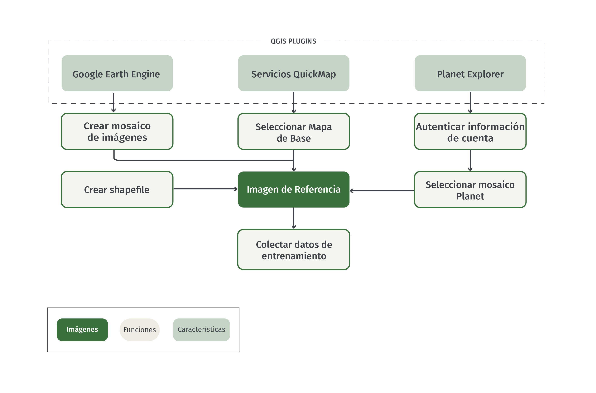
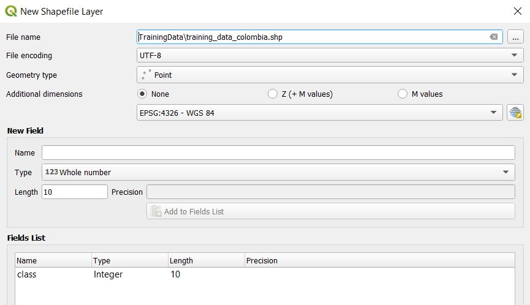
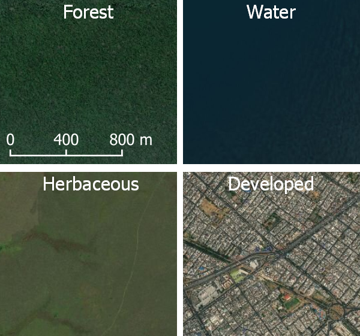
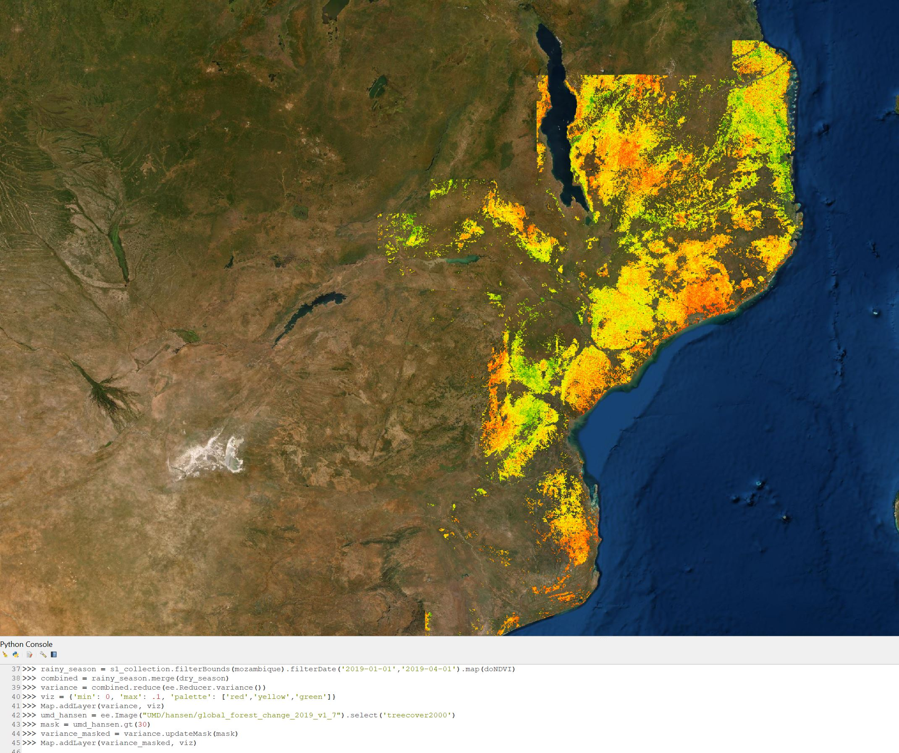
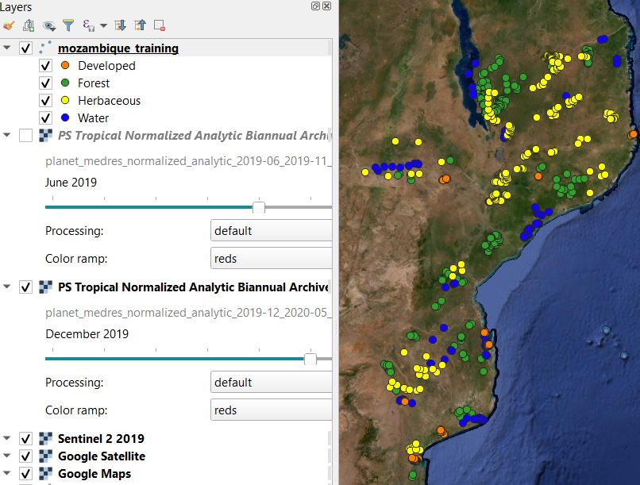
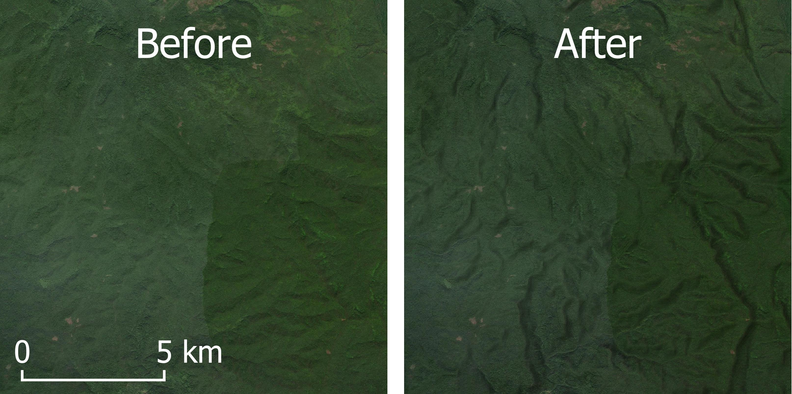
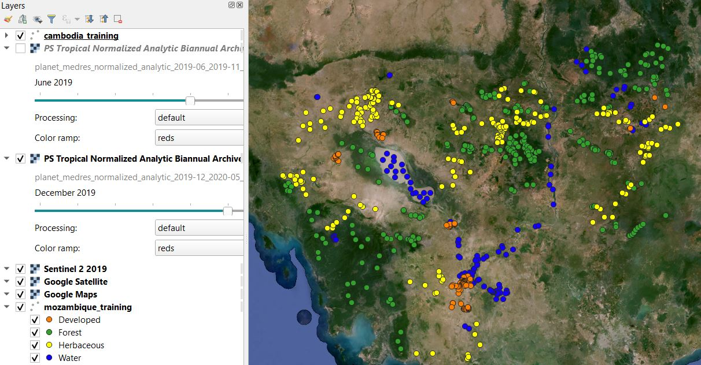

# Recolección de Datos de Entrenamiento Usando QGIS

## 1 Contexto

Datos de entrenamiento son vitales para la clasificación supervisada de imágenes. El conjunto de datos de entrenamiento consiste de datos etiquetados que se usan para informar o "entrenar" el clasificador.  El clasificador entrenado puede ser aplicado a datos nuevos para crear una clasificación. Por ejemplo, datos de entrenamiento de cobertura terrestre contienen ejemplos de cada clase en la leyenda del estudio. Basado en estas etiquetas, el clasificador puede predecir la clase de cobertura terrestre mas probable para cada pixel en la imagen.  Este es un ejemplo de una clasificación categórica y dado esto, las etiquetas de entrenamiento son categóricas. En contraste, una variable continua (como porcentaje de cobertura de árboles) se puede predecir usando etiquetas de entrenamiento continuas. 

Este tutorial demostrará como recopilar datos de entrenamiento categóricos para clasificación de cobertura terrestre usando QGIS. Usuarios deben de ajustar varios componentes para coincidir con los objetivos de su proyecto. Aquí, el proceso es demostrado para los países de Colombia, Mozambique, y Camboya, y para la leyenda simple de 4 tipos de cobertura terrestre: Bosque, Agua, Herbáceo, y Desarrollado. 


### 1.1 QGIS

Quantum GIS (QGIS) es un software GIS de código abierto que se puede correr en Windows, Linux, y Mac OS X. Usuarios deberían de consultar la [página de web QGIS](https:/qgis.org/en/site/forusers/alldownloads.html) para ver más información de contexto e instrucciones de instalación. Ya que hay varias maneras diferentes de instalar QGIS dependiendo de su sistema de operación, instrucciones de instalación no serán detalladas aquí. Si usuarios no pueden instalar QGIS, recomendamos cambiar a este mismo tutorial en OpenMRV para la recopilación de datos de entrenamiento usando Google Earth Engine, ubicado bajo el proceso "Recopilación de datos de entrenamiento" y la herramienta "GEE".

Este tutorial esta basado en el lanzamiento a largo plazo de QGIS [Version 3.10.10](https:/docs.qgis.org/3.10/en/docs/user_manual/). Para las características principales de este tutorial, usuarios solo necesitan instalar QGIS y tener acceso a una conexión de internet. Para acceso a todos los plugins descritos en este tutorial, usuarios necesitarán cuentas de [Google Earth Engine](https:/signup.earthengine.google.com/#!/) y [Planet](https:/www.planet.com/login/?mode=signup).

## 2 Objetivos de Aprendizaje 

Al final de este ejercicio, podrá: 

- Crear nueva capa shapefile en QGIS
- Cargar múltiples fuentes de imágenes de alta resolución para usar como referencia
- Recopilar datos de entrenamiento para clasificación categórica

### 2.1 Prerrequisitos para este módulo

* Conceptos QGIS
  * Instalación
  * Crear, guardar, y cargar un proyecto
  * Instalando y usando los plugins
* Conceptos de Teledetección
  * Conocimientos básicos de las teorías involucradas en clasificación de imágenes
  * Entender como definir una leyenda temática

## 3 Tutorial: Recopilación de Datos en QGIS

### 3.1 Resumen

El proceso para recopilar datos de entrenamiento en QGIS está detallado en los pasos siguientes. El proceso se puede describir generalmente como 3 pasos principales: 

1. Crear una capa nueva de shapefile para almacenar los datos de entrenamiento
2. Cargar un mapa de base usando un plugin de QGIS
3. Recopilar los datos de entrenamiento a través de la definición manual de los puntos de entrenamiento 



### 3.2 Creando una nueva capa

Este tutorial demostrará como crear datos de entrenamiento que son geometrías de punto. Un proceso similar se puede usar con datos de polígono, pero tenga en mente que es generalmente recomendado tener regiones de entrenamiento más diversas para minimizar el efecto de autocorrelación espacial.  

Para comenzar, necesitaremos definir una nueva capa de shapefile. 

1. Seleccionar *Layer* -> *Create Layer* -> *New Shapefile Layer*
2. Escoger un nombre de archivo para guardar sus datos de entrenamiento (en el próximo ejemplo, usamos el nombre 'training_data_colombia_v1.shp'. Seleccione una carpeta fácil de acceder y de recordar para guardar los datos
3. Para *Geometry type* (tipo de geometría) seleccione *Point* (punto)
4. Seleccione EPSG:4326 - WGS 84 para la proyección
5. Para borrar el campo 'id', selecciónelo en *Fields List* (lista de campos) y haga clic en *Remove Field* (Eliminar Campo)
6. Agregar un campo nuevo del tipo *Whole number* (números enteros) llamado 'clase' seleccionando *Add to fields list*. El *Length* (largo) del campo corresponde al numero de dígitos. Escoger al menos 2 para el largo del campo. Ya que el tipo es *Whole Number*, no necesitamos preocuparnos por la precisión. 

Su panel se debería de ver así:



Haga clic en *Ok* y debería ver que una nueva capa fue agregada al panel izquierdo de '*Layers*'. Agregaremos a esta capa al crear los datos de entrenamiento.

### 3.3 Cargar capas de base 

Los datos de referencia son críticos para la recolección de datos de entrenamiento, y para la mayoría de propósitos es suficiente usar imágenes de alta resolución. Dos factores críticos en la selección de datos de referencia incluyen:

1. Las clases de destino se pueden distinguir a través de interpretación visible.
2. El tiempo de las imágenes de referencia coincide con los datos de entrada usados para la clasificación.

Afortunadamente, hay varias fuentes de imágenes de referencia de alta resolución disponibles directamente dentro de QGIS. Las imágenes especificas para usar dependerán de su periodo temporal de estudio y la región, pero en general es recomendado usar la mayor cantidad de datos posibles. 

Los siguientes plugins (extensiones) ofrecen acceso a imágenes de referencia. Cada plugin funciona con QGIS Versión 3.1.10. Sin embargo, usuarios de este tutorial deberían de seguir las instrucciones de los creadores del plugin para asegurar una instalación apropiada. 

Usuarios deberían de considerar las opciones siguientes y seleccionar una fuente de datos de referencia que coincida con el periodo de tiempo y extensión geográfica de su región de estudio. Aquí, el proceso demostrado es para Colombia en el año 2018.

**Nota Importante:** Sugerimos que usuarios comiencen primero con QuickMap Services, ya que no requiere una cuenta externa y es el programa mas simple para instalar. El uso de Planet y Google Earth Engine provee datos de referencia mas flexible, sin embargo los plugins son experimentales y requieren cuentas con Earth Engine *y* Planet. Si usuarios no pueden instalar plugins, sugerimos que cambien a este mismo tutorial en OpenMRV para la recopilación de datos de entrenamiento usando Google Earth Engine ubicado bajo el proceso "Recopilación de datos de entrenamiento" y la herramienta "GEE".

#### 3.3.1 Servicios QuickMap 

**Quien**: [NextGIS](https:/nextgis.com/)

**Que**: Mapa de base de alta calidad (Google, ESRI, Mapbox, etc)

**Cuando**: Varía

[Instrucciones de Video](https://www.youtube.com/watch?v=p8G6zMWfi8o)

QuickMap Services (QMS) es un servicio para acceder y compartir datos espaciales. Este plugin permite que el usuario acceda a la colección completa de datos incluyendo mapas de base de alta resolución de Google, ESRI, y Mapbox. La mayoría de estos datos se compilan de varias fuentes, lo cual indica que la fecha de adquisición para una ubicación especifica pueda ser desconocida. Sin embargo, estos son conjuntos de datos de alta calidad y recomendamos usarlos como referencia para complementar las imágenes siguientes.

**Para usar:** 

1. Agregar el plugin de QuickMap Services yendo a *Plugins* -> *Manage and Install Plugins*...buscar *QuickMapServices* y hacer clic en el botón de *Install Plugins* (Instalar Plugins).
2. Ir a la barra de *Web*-> *QuickMapServices* -> *Search QGMS Panel* para abrir el panel de búsqueda de QMS.
3. En el panel que aparece en la parte derecha de la pantalla, buscar "Satellite" y hacer clic en *Add* para escoger su conjunto de datos. El mapa de fondo será agregado al mapa. En este ejemplo, seleccionamos la capa de 'ESRI Satellite'. Puede navegar al mapa usando su mouse, y acercarse/alejarse del mapa con zoom usando la barra de desplazamiento del mouse. 


#### 3.3.2. Planet Explorer  

**Quien**: [Planet](https:/www.planet.com/)

**Que**: Imágenes diarias, mosaicos mensuales, mosaicos bianuales 

**Cuando**: Después del 2016

[Instrucciones de Video](https://www.youtube.com/watch?v=wfhyk7f9kvo)

La constelación de satélites de Planet ofrece imágenes diarias de alta resolución con 3-4 bandas espectrales. El archivo de datos no es de acceso completo, pero con un nombre de usuario y una contraseña, el usuario puede navegar por el archivo de imágenes diarias y ver imágenes de prevista (de calidad reducida). El Ministerio de Clima y Medioambiente de Noruega [llego a un acuerdo](https:/www.planet.com/pulse/planet-ksat-and-airbus-awarded-first-ever-global-contract-to-combat-deforestation/) con Planet, Airbus, y Konsberg Satellite Services para proporcionar acceso a imágenes de alta resolución en los trópicos. En el tiempo que este módulo se escribió, las herramientas para acceder a estos datos están en las etapas tempranas de desarrollo. Sin embargo, una manera en la que Planet esta apoyando el acceso de estos datos es a través del plugin *Planet Explorer* para QGIS. 

**Para Usar**:

1. Instrucciones detalladas para instalar el plugin se pueden encontrar en el [sitio web de Planet](https:/developers.planet.com/docs/integrations/qgis/quickstart/).
2. Si aun no lo ha hecho, inscríbase para el [Level 1 User Access here](https://www.planet.com/nicfi/) (Acceso de Usuario Nivel 1) aquí. 
3. Agregar el panel de plugins a través de *Web* -> *Planet Explorer* -> *Planet Explorer*
4. Seleccionar *Mosaic Series* (Serie de Mosaico) en el panel de plugin junto al ícono de Planet. 
5. Hacer clic doble en uno de los mosaicos bianuales o mensuales para agregarlo al mapa.


#### 3.3.3 Google Earth Engine (Uso Avanzado)  

**Quien**: [Google Earth Engine](https:/earthengine.google.com/) y Gennadii Donchyts. 

**Que**: La mayoría de datos de observación terrestre de acceso abierto (como Landsat, Sentinel y MODIS). 

**Cuando**: Tan temprano como 1972 para Landsat

[Instrucciones de Video](https://www.youtube.com/watch?v=-6mEL2VQtYw)

Google Earth Engine (GEE) es una plataforma en la nube para analizar datos geoespaciales. Acceso a GEE se provee a través del API de Javascript y Python. Google no provee un plugin de QGIS, pero recientemente Gennadii Donchyts lanzó un plug-in beta basado en el API de Python. Este plugin permite acceso al increíble poder de procesamiento y almacenamiento de datos de GEE dentro de la interfaz de QGIS. Sin embargo, es experimental y usuarios deberían de consultar el repositorio GitHub antes de usarlo. 

**Prerrequisitos**:

- [Cuenta de Google Earth Engine](https://signup.earthengine.google.com)
- [Python 3](https://www.python.org)
- [Google Earth Engine Python API instalado y autentificado](https://developers.google.com/earth-engine/guides/python_install)

**Para usar**:

1. Instalar el plugin usando el [Guia de Usuario](https:/gee-community.github.io/qgis-earthengine-plugin/). 

2. Navegar a *Plug-ins* -> *Python Console* en la parte superior de la aplicación para agregar la consola de Python 

3. Ver código de ejemplo en el [repositorio del plug-in](https:/github.com/gee-community/qgis-earthengine-plugin/tree/master/examples). También vale la pena familiarizarse con [Google Earth Engine](https:/developers.google.com/earth-engine/guides) si es un usuario nuevo. Este tutorial no cubre los temas básicos de GEE, y usuarios nuevos deberían consultar la [Documentacion de GEE](https:/developers.google.com/earth-engine/guides) para su uso avanzado.

4. En la consola de Python, primero cargue el API de GEE Python:

    ```python
    import ee
    ```

    Su consola debería de verse así: 

     

5. Cargar la función *Map* del módulo del ee_plugin y  probar si funciona apropiadamente: 

    ```python
    from ee_plugin import Map
    print(ee.String('The plugin is working!').getInfo())
    ```

6. Centrar la vista del mapa sobre los límites de Colombia:

    ```python
    countries = ee.FeatureCollection("USDOS/LSIB_SIMPLE/2017")
    colombia = countries.filter(ee.Filter.eq('country_na', 'Colombia'))
    Map.centerObject(colombia, 8)
    ```

7. Crear una imagen compuesta de Sentinel-2 para el 2019 y agregarla al mapa:

    ```python
    s1_collection = ee.ImageCollection("COPERNICUS/S2_SR")
   
    s1_composite = s1_collection.filterBounds(colombia) \
        .filterDate('2019-01-01','2019-12-31') \
        .median()
   
    vis = {'bands': ['B4', 'B3', 'B2'], 'min': 0, 'max': 1250}
   
    Map.addLayer(s1_composite, vis, 'Sentinel 2 2019')
    ```

    Debería de ver una imagen muy nublada agregada al mapa.

     

8. Ahora intentémoslo de nuevo cuando aplicamos la máscara de nubes antes de crear el mosaico: 

    ```python
    def maskS2clouds(image):
        return image.updateMask(image.select('QA60').eq(0))
   
    s1_composite_masked = s1_collection.filterBounds(colombia) \
        .filterDate('2019-01-01','2019-12-31') \
        .map(maskS2clouds) \
        .median()
   
    Map.addLayer(s1_composite_masked, vis, 'Sentinel 2 2019 Masked')
    ```

    

### 3.4 Recopilar datos de entrenamiento 

Una vez que haya seleccionado imágenes de referencia, es hora de recopilar datos de entrenamiento. Navegue por su área de estudio colectando datos de entrenamiento, yendo clase por clase. Aquí hay algunas consideraciones:

- Datos de entrenamiento deben de ser representativos de su región de estudio entera. Esto significa que recopilar mas datos en toda la región es mejor que recopilarlos en pocas áreas grandes. 
- Asegúrese de incluir ejemplos en las orillas de los límites de cada clase (por ejemplo, el bosque inmediatamente junto a terreno no vegetado, ya que estas áreas serán las más difíciles de distinguir en la fase de clasificación. 
- No hay numero mágico para el numero adecuado de puntos de entrenamiento. Es importante estar consiente de que este es un proceso iterativo donde recopilan datos de entrenamiento, ejecuta un análisis, y luego se recopilan más datos de entrenamiento para corregir los errores de clasificación. 
- Tómese su tiempo, ya que este conjunto de datos será invaluable para su investigación y posiblemente la de otros.

1. Seleccionar la capa de datos de entrenamiento en el panel de *Layers* (Capas). 
2.  Seleccionar el botón con figura de lápiz (*Toggle Editing*) para habilitar la función de editar capas .
3. Seleccionar el ícono de *Add Point* (Agregar Punto) .
4. Definir un código numérico de clase. Aquí, usaremos 1 para Bosque, 2 para Agua, 3 para Herbáceo, y 4 para Desarrollado. 
    
5. Comenzando con la clase de Bosque, haga clic en el mapa para agregar un punto de entrenamiento. En el panel que enseña el mapa, tendrá la opción de llenar el campo de *clase* para el punto que acaba de agregar.  Ya que estamos comenzando con Bosque, use el código de clase 1. Basado en los códigos de clase arriba, escriba 2 para Agua, 3 para Herbáceo, y 4 para Desarrollado.
    
6. Seleccione *OK* para guardar el punto de entrenamiento.    
7. Repetir para varias muestras de Bosque a través de su región de estudio. Se le aconseja guardar la capa durante el proceso usando el botón *Save Layer Edits*. 
      
8. Unidades de muestra se pueden borrar si selecciona el botón  *Select Feature(s)*   y hace clic en un objeto, o si arrastra una caja para seleccionar múltiples objetos, y luego hace clic al botón *Delete* . 
9. Continúe este proceso para cada clase en el mapa. 
10. Seleccione el botón *Toggle Editing* para parar de editar la capa.

### 3.5 Visualizando los datos de entrenamiento 

Una vez que haya recolectado los datos de entrenamiento para cada clase, ayuda estilizarlos para ver la distribución a través del área de estudio. Idealmente, quiere tener puntos de entrenamiento que sean representativos de la variabilidad en las clases. Aquí, esto significa que queremos tener suficientes puntos para cada clase para asegurar de que representen las clases completamente a través de Colombia.

1. Haga clic derecho en el icono del panel *Layer* y seleccione *Properties*.
2. En el lado izquierdo del panel de *Propiedades*, seleccione *Symbology* (Simbología)
     
3. Seleccione *Categorized* (Categorizado) para el tipo de símbolo.
4. Debajo de *Value* (Valor) seleccione el atributo que contenga la etiqueta de clase, es este caso es *clase*. 
5. Seleccione *Classify* (Clasificar) para popular la tabla de simbología. Opcionalmente puede cambiar los colores a su preferencia. 
6. Revise los valores del *Legend* (Leyenda) para coincidir con nuestra leyenda. Su panel debería de verse así:  
    
7. Seleccionar *OK* para aplicar el estilo. 
8. Tome tiempo para mirar su muestra y asegurarse de que no haya "vacíos" grandes en los datos de entrenamiento. 
    

### 3.6 Agregando un ID único 

Es útil tener un identificador único para cada punto de entrenamiento. Esto se puede agregar a la capa "Attribute Table" (Tabla de Atributos).

1. Haga clic derecho en el nombre de la capa en el panel *Layer* y seleccione *Open Attribute Table* (Abrir Tabla de Atributos).
2. Para agregar una columna nueva, seleccione *Open field calculator* (Abrir calculadora de campo).
    
3. Debajo de *Output field name* (Nombre de campo de resultado) escriba 'ID'. 
4. Haga clic doble en el selector 'row_number'. Su panel se debería de ver así:
    
5. Haga clic en 'Ok' y termine de editar usando el botón 'Toggle editing mode' . 

## 4 Ejemplos Adicionales: Mozambique y Camboya

**Uso Avanzado**

Los métodos descritos arriba están demostrados para los países de Mozambique y Camboya. El proceso general es igual a ese demostrado para Colombia. Sin embargo, hay algunas consideraciones para adoptar el método a las condiciones de cada país, las cuales se encuentran próximamente. Note que estos pasos adicionales son opcionales, y primero se recomienda hacer la recopilación de datos de entrenamiento usando los pasos previos. Estos ejemplos demostrarán como recolectar datos de entrenamiento de una manera robusta para los diferentes tipos de bosque y de topografías. El propósito es mejorar la robustez de los datos de entrenamiento, lo cual ultimadamente puede mejorar la calidad de la clasificación de coberturas terrestres.  Usuarios deberían de considerar las condiciones climáticas y topográficas de su regio de estudio para determinar si estos pasos adicionales son necesarios.  

### 4.1 Mozambique

Mozambique es un país de mucha diversidad ecológica, la cual consiste de una mezcla de zonas climáticas tropicales y templadas. Como resultado, hay grandes franjas de ecosistemas forestales, tanto de bosque perenne como bosque caducifolio. En Colombia, no contabilizamos los efectos estacionales en bosques porque cubren una proporción del país relativamente pequeña. El área cubierta por bosque caducifolio es mucho más alto en Mozambique, lo cual puede presentar un desafío para la clasificación de cobertura terrestre dada la variabilidad intra-anual en reflectancia entre etapas fenológicas. 

Para ilustrar este punto, observe la variabilidad temporal del Índice de Vegetación de Diferencia Normalizada (NDVI por sus siglas en ingles) sobre el transcurso de un año para un pixel de Landsat de 30 metros en un bosque estacional en Mozambique. NDVI es una transformación espectral que se usa comúnmente para analizar vegetación fotosintéticamente activa. La temporada de lluvia en Mozambique se extiende de Noviembre a Mayo. En la figura a la izquierda, un pixel de color rojo muestra a Mozambique, y la imagen central muestra lo mismo pero con acercamiento. A la derecha están todos los valores de NDVI de Landsat para el pixel. Note en el gráfico abajo como el NDVI es considerablemente más alto durante la temporada de lluvia que en la temporada seca, debido a la variabilidad estacional en el bosque. 

  

La variabilidad estacional puede presentar un reto cuando se ejecuta una clasificación de cobertura terrestre. Por ejemplo, si estamos clasificando una imagen de la temporada seca en Mozambique, un bosque caducifolio podría ser confundido con la clase herbácea u otras clases no forestales dada la baja verdura durante el periodo sin hojas. Para corregir posible confusión en el proceso de clasificación, es crítico que los datos de entrenamiento sean representativos de la variabilidad dentro de cada clase (por ejemplo, variabilidad estacional en bosques u otras clases de vegetación). Simplemente, si existen áreas considerables de bosques caducifolios y bosques perennes, entonces los datos de entrenamiento para la clase general 'Bosque' debe contener ejemplos de ambos tipos. 

Aquí, nuestra meta es asegurar que nuestra clase "Bosque" contenga ejemplos de diferentes tipos de bosque, indicado por sus diferentes trayectorias estacionales. Hay muchas maneras de hacer esto, y aquí vamos a usar Google Earth Engine para mirar la variabilidad intra-anual en NDVI. 

1. Primero, crear una capa nueva de shapefile usando las instrucciones en 3.2 Creating a new layer.
2. Cargar el plugin de Google Earth Engine.
3. Navegar a 'Plugins' -> 'Python Console' para abrir la consola de Python. 
4. Usar las instrucciones en 3.3.3 para cargar los módulos requeridos y navegar a Mozambique. Si necesita refrescar su memoria, el código para hacer esto se encuentra aquí: 

    ```python
    import ee
    from ee_plugin import Map
    countries = ee.FeatureCollection("USDOS/LSIB_SIMPLE/2017")
    mozambique = countries.filter(ee.Filter.eq('country_na', 'Mozambique'))
    Map.centerObject(mozambique, 8)
    ```

5. Crear una función para calcular NDVI usando las bandas Rojas (B4) e Infrarrojo Cercano (B8) de imágenes de Sentinel-2. También necesitaremos la función de máscara de nube en 3.3.3.  

    ```python
    def doNDVI(image):
        return image.normalizedDifference(['B4','B8']).rename('NDVI')
   
    def maskS2clouds(image):
        return image.updateMask(image.select('QA60').eq(0))
    ```

6. Ahora, podemos filtrar la colección de Sentinel-2 en dos grupos: imágenes adquiridas durante el pico de la estación seca, e imágenes durante el pico de la estación de lluvia. Luego podemos [mapear](https:/developers.google.com/earth-engine/guides/ic_mapping) sobre las colecciones para aplicar las máscaras de nube y calcular NDVI. 

   ```python
   s1_collection = ee.ImageCollection("COPERNICUS/S2_SR").map(maskS2clouds)
   
   dry_season = s1_collection.filterBounds(mozambique).filterDate('2019-09-01','2019-11-01').map(doNDVI)
   rainy_season = s1_collection.filterBounds(mozambique).filterDate('2019-01-01','2019-04-01').map(doNDVI)
   ```

7. Para calcular variabilidad estacional, podemos combinar estas dos Recolecciones y calcular variancia de NDVI por pixel usando un [reducer](https:/developers.google.com/earth-engine/guides/reducers_intro) (reductor). 

    ```python
    combined = rainy_season.merge(dry_season)
    variance = combined.reduce(ee.Reducer.variance())
   
    viz = {'min': 0, 'max': .1, 'palette': ['red','yellow','green']}
    Map.addLayer(variance, viz)
    ```

    

8. El mapa que está cargado es el de variancia estacional de NDVI, en donde rojo indica menos variabilidad y verde indica más. 
9. Un paso adicional que podemos tomar para asistir en la identificación de bosques es usar un conjunto de datos auxiliares de cobertura de árboles para "enmascarar" a o excluir a los pixeles no forestales. El conjunto de datos de la perdida, la ganancia, y la cobertura de árboles de UMD-Hansen es perfecto para este propósito. No se recomienda usar este conjunto de datos para entrenar el clasificador, pero es una buena herramienta para identificar ubicaciones de bosque o cambios en bosques. Aquí usaremos la capa 'Tree Cover 2000' como máscara para nuestra capa de variancia NDVI, para excluir pixeles que tenían menos de 30% cobertura de árboles en el 2000.  

    ```python
    umd_hansen = ee.Image("UMD/hansen/global_forest_change_2019_v1_7").select('treecover2000')
    mask = umd_hansen.gt(30)
    variance_masked = variance.updateMask(mask)
    Map.addLayer(variance_masked, viz)
    ```

    

10. Ahora, mientras estamos recopilando datos de entrenamiento para la clase 'Bosque', es importante referir esta capa para asegurar que estos datos de entrenamiento contabilicen las diferencias es la variabilidad estacional espectral en bosques. Primero, vamos a repasar porque pueda ser de gran beneficio hacer los pasos descritos arriba: 

    - Algunos bosques tienen patrones estacionales en productividad. 
    - Queremos asegurar que nuestros datos de entrenamiento para 'Bosque' incluyan ejemplos de todos los tipos de bosque en nuestra área de estudio. 
    - Una manera fácil y preliminar de acomodar la estacionalidad en una clasificación es proveyendo datos de entrenamiento representativos.  
    - GEE nos permite identificar bosques estacionales fácilmente a base de la variancia de NDVI en el transcurso de un año.
    - El conjunto de datos de UMD-Hansen crea una máscara para excluir pixeles no forestales, y así nos ayuda con la colección de datos de entrenamiento 

11. Es necesario agregar un mapa de fondo además de la capa de NDVI. Cualquiera de los ejemplos previos se puede usar, y el más simple es QuickMap Services. Asegúrese que pueda identificar sus clases en las imágenes que utiliza. Si no puede, pruebe otra fuentes de imágenes de referencia o considere simplificar sus clases. Abajo hay ejemplos de las clases usadas aquí en las Imágenes ESRI, disponibles en QuickMap Services.
    

12. Usando las direcciones descritas arriba, recolecte puntos de entrenamiento clase por clase. Para la clase de Bosque, se le sugiere ocasionalmente sobreponer los puntos de entrenamiento en el mapa de variancia NDVI. No es necesario hacer un análisis detallado, pero vale la pena hacer una breve evaluación visual para asegurar que las muestras de entrenamiento representan bosques estacionales y no estacionales. Esto se puede llevar acabo si alterna entre áreas rojas, amarillas, y verdes en la capa de variabilidad NDVI, y también entre esa capa y la imagen de referencia para asegurar que esas ubicaciones en realidad sean bosques. Note en el ejemplo siguiente como hay puntos de entrenamiento (azules) en bosques con variabilidad estacional (o variancia NDVI) diferentes.
    

13. Recuerde que debe de guardar su trabajo frecuentemente, seleccionando el botón *Save Layer Edits*. 
14. Cuando complete estos pasos, seleccione el botón *Toggle Editing* para terminar de editar.
15. Opcionalmente, puede visualizar los datos de entrenamiento: 
      

### 4.2 Camboya

El ejemplo final de colección de datos de entrenamiento en QGIS es para el país de Camboya. Camboya tiene un clima tropical de monzones con una temporada de lluvia desde Mayo a Octubre. En años recientes, Camboya ha experimentado una cantidad considerable de cambio terrestre, frecuentemente en la forma de deforestación.

Muchos de los bosques restantes en Camboya están ubicados en terreno montañoso. La topografía puede presentar un reto para la clasificación de cobertura terrestre. Ya que las características topográficas pueden crear sombras, la reflectancia del paisaje dentro de la sombra puede ser más baja que un paisaje similar fuera de los límites de la sombra. Para reducir este efecto, es importante recolectar datos que sean representativos de las diferentes condiciones topográficas de una región de estudio. Este ejemplo demostrará como hacer eso. 

1. Primero, crear una capa nueva de Shapefile usando las instrucciones en 3.2 Creating a new layer.
2. Usaremos un mapa de terreno además de las imágenes de referencia cuando estemos recopilando datos de entrenamiento en este ejemplo. Usando la búsqueda en QuickMap Services, busque dos mapas de fondo y agréguelos al mapa: Esri Imagery y Google Terrain Hybrid. 
3. Después, ajustaremos los parámetros, de renderizado de capas para "mezclar" ambas capas. El objetivo es tener una imagen de alta resolución que tenga características topográficas exageradas y visualmente obvias. 
4. En el panel de *Layers*, asegúrese de que la capa de Esri Imagery este puesta encima de la capa de Google Terrain Hybrid. Se puede ajustar el arreglo de las capas si selecciona la capa con su mouse y la arrastra a la ubicación deseada dentro del panel. 
5. Para abrir el panel de *Layer Properties* para la capa de Esri Imagery, haga clic doble en su nombre en el panel de *Layers* o haga clic derecho y seleccione "Properties" (Propiedades). 
6. Seleccione el panel de *Symbology* (Simbología). Para hacer esto, selecciónelo en el lado izquierdo del panel de *Layer Properties*.
7. Cambie el *Blending mode* (Modo de mezcla) a 'Multiply' y haga clic en 'OK'. Ambas capas serán visualizadas como una imagen compuesta mezclada. Note la diferencia antes y después de mezclar la capa de Esri Imagery con la de Google Terrain Hybrid: 

    

8. El propósito de esto es facilitar la visualización de las características topográficas en las imágenes de referencia, para que se puedan usar como información suplementaria cuando se colecten datos de referencia. Asegúrese de recolectar muestras de entrenamiento para bosque que varíen en sus características topográficas. Por ejemplo, muestras deberían de recolectarse en terrenos de diversos pendientes y aspectos. Esto no necesita ser preciso, y se puede hacer opcionalmente para cualquier tipo de cobertura terrestre. Una manera simple de observar diferencias en el terreno es basada en las sombras en la imagen de referencia: 

     

9. Use la imagen compuesta de referencia para recolectar al menos 100 muestras de entrenamiento por clase. Recuerde que debe guardar su trabajo frecuentemente. Cuando haya completado esto, seleccione el botón *Toggle Editing* para terminar de editar. 

     

## 5 Preguntas Frecuentes 

**¿Porque estamos usando geometrías de punto en lugar de polígonos?**

Datos de polígono también se pueden usar como datos de entrenamiento, pero tenga en mente que la autocorrelación espacial resultara en información repetitiva derivada de cada polígono. Por eso recomendamos recolectar muestras de puntos que sean representativas de todos los datos en lugar de solo recolectar algunos polígonos. 

**¿Como decido que datos usar como referencia?**

Los datos de referencia deberían de coincidir en tiempo y espacio con los datos usados en su análisis. Si hay múltiples fuentes de datos que encajan con esta criterio, el usuario debe escoger los datos que sean mas fáciles de interpretar en basa a la leyenda de clasificación.

**¿Es necesario derivar los datos de entrenamiento usando un diseño de muestreo basado en probabilidad?**

No, no es necesario. Sin embargo, si los datos de entrenamiento fueron creados de esta manera (por ejemplo, una muestra aleatoria simple interpretada), no hay razón por la cual no se pueda usar para la clasificación. 

**¿Cuantos puntos necesito para cada clase?**

No hay un número mágico para el número de puntos de entrenamiento necesario para cada clase, pero una buena meta es un mínimo de 100 por clase. Generalmente se recomienda usar un proceso iterativo, donde datos adicionales son recolectados después de ejecutar la clasificación, y luego la clasificación se crea de nuevo con los puntos adicionales hasta que los resultados de la clasificación sean adecuados. 

**¿Se puede reservar una parte de los datos de entrenamiento para hacer una validación?**

Si los datos de entrenamiento fueron colectados oportunistamente, o en otras palabras *sin* usar una muestra de probabilidad, no se recomienda usar estos datos para la validación ya que introducirían sesgo.

**¿Porque no puedo ver mis puntos en el mapa?**

Asegúrese de que la capa este cargada en el panel de 'Layers'. Si no lo está, se puede agregar si navega a *Layer* -> *Add Layer* -> *Add Vector Layer*. Si la capa esta en el panel de 'Layers' pero no aparece en el mapa, asegúrese de que esté ubicada por encima de cualquier capa de datos de referencia. 

**¿Por que vale la pena recolectar datos de entrenamiento para los diferentes tipos de bosques si solo estamos creando una clase general de 'Bosque'?**

No es necesario, pero puede ayudar a mejorar la clasificación. Queremos que nuestros datos de entrenamiento representen la variabilidad espectral en nuestras clases. Una manera fácil de identificar diferencias en los tipos de bosques es a través de la variabilidad estacional. 

**Si mi área de estudio es plana, ¿aun me debo de preocupar por la topografía?**

No, no hay necesidad de preocuparse por la topografía en un área completamente plana.

**No puedo hacer que se cargue uno de los plugins, ¿que puedo hacer?**

Si no consigue que uno de los plugins se cargue, simplemente use otro. Hay múltiples plugins presentados aquí para darles varios opciones a los usuarios. 

**¿Que hago si no puede instalar QGIS o conseguir que ningún plugin se cargue?**

No se preocupe! Este mismo tutorial está disponible aquí en OpenMRV para la recopilación de datos de entrenamiento Utilizando Google Earth Engine ubicado bajo el proceso "Recopilación de datos de entrenamiento" y la herramienta "GEE", y no requiere ninguna instalación. 

-----

   

Este trabajo tiene licencia bajo un [Creative Commons Attribution 3.0 IGO](https://creativecommons.org/licenses/by/3.0/igo/)

Copyright 2021, World Bank 

Este trabajo fue desarrollado por Eric Bullock bajo contrato del World Bank con GRH Consulting, LLC para el desarrollo de recursos nuevos o existentes relacionadas a la Medida, Reportaje, y Verificación para el apoyo de implementación MRV en varios países. 

Material revisado por:  
Kenset Rosales, Guatemala, Ministry of Environment and Natural Resources    
Tatiana Nana, Cameroon, REDD+ Technical Secretariat    
Rajesh Bahadur Thapai, Nepal, International Centre for Integrated Mountain Development    
Kenset Rosales, Guatemala, Ministry of Environment and Natural Resources    
Sofia Garcia, Guatemala, Ministry of Environment and Natural Resources    
Jennifer Juliana Escamilla Valdez, El Salvador, Ministerio de Medio Ambiente y Recursos Naturales    
Foster Mensah, Ghana, Center for Remote Sensing and Geographic Information Services    
Ana Mirian Villalobos, El Salvador, Ministerio de Medio Ambiente y Recursos Naturales    
Carole Andrianirina, Madagascar, Bureau National de Coordination REDD+    
Phoebe Oduor, Kenya, Regional Center For Mapping of Resources for Development    
KONAN Yao Eric Landry, Cote d'Ivoire, REDD+ Permanent Executive Secretariat    
Paula Andrea Paz, Colombia, International Center for Tropical Agriculture    

Atribución  
Bullock, E. 2021. Training Data Collection Using QGIS. © World Bank. License: Creative Commons Attribution license (CC BY 3.0 IGO)  

