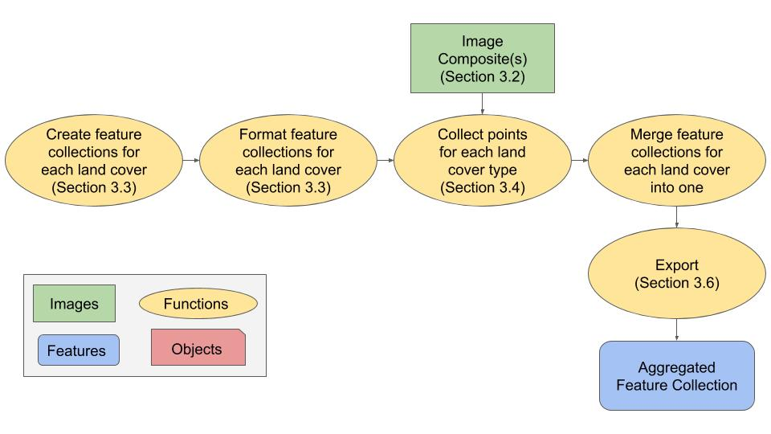

# Recolección de Datos de Entrenamiento Usando Google Earth Engine 

## 1 Contexto

Datos de entrenamiento son instrumentales para la clasificación de imágenes supervisadas. El conjunto de datos de entrenamiento consiste de datos etiquetados que se usan para informar o "entrenar" el clasificador. El clasificador entrenado puede ser aplicado a datos nuevos para crear una clasificación. Por ejemplo, datos de entrenamiento de cobertura terrestre contienen ejemplos de cada clase en la leyenda del estudio. Basado en estas etiquetas, el clasificador puede predecir la clase de cobertura terrestre mas probable para cada pixel en la imagen. Este es un ejemplo de una clasificación categórica y dado esto, las etiquetas de entrenamiento son categóricas. En contraste, una variable continua (como porcentaje de cobertura de árboles) se puede predecir usando etiquetas de entrenamiento continuas.

Este tutorial demostrará como recolectar datos de entrenamiento categórico para cobertura terrestre usando Google Earth Engine (GEE). Usuarios deben de ajustar varios componentes para coincidir con los objetivos de su proyecto. Aquí, el proceso es demostrado para el país de Colombia y para una leyenda simple de 4 tipos de coberturas terrestres: Bosque, Agua, Herbáceo, y Desarrollado.


### 1.1 Google Earth Engine

Digitalizaremos datos de entrenamiento en Google Earth Engine. Refiérase al Módulo 1.1 Creación de Imagen Compuesta/Mosaico para Landsat y Sentinel-2 en Google Earth Engine para más información y recursos para trabajar en este entorno. 

## 2 Objetivos de Aprendizaje

Al final de este ejercicio, podrá:

- Crear nuevas colecciones de objetos en GEE que representan los diferentes tipos de cobertura terrestre de interés. 
- Cargar su imagen compuesta de Landsat o Sentinel para usar como imagen de fondo y como referencia.
- Recolectar y exportar datos de entrenamiento para hacer una clasificación categórica.

### 2.1 Prerrequisitos para este módulo

* Google Earth Engine
  * Tener una cuenta de GEE

* Conceptos de Teledetección
  * Comprensión básica de teorías involucradas en la clasificación de imágenes
  * Entender como definir una leyenda temática

## 3 Tutorial: Training Data Collection in GEE

### 3.1 Resumen

El proceso para recolectar datos de entrenamiento en GEE esta detallado en los pasos siguientes. El proceso se puede describir generalmente como 3 pasos principales:

1. Crear una clase de objetos nueva para cada tipo de cobertura terrestre para almacenar los datos de entrenamiento.
2. Cargar un mapa de fondo usando lo que aprendió en el Módulo 1.1 Creación de Imagen Compuesta/Mosaico de Landsat y Sentinel-2.
3. Recolectar los datos de entrenamiento a través de la definición manual de puntos de entrenamiento. 
4. Exportar los datos de entrenamiento.



### 3.2 Creando Nuevas Colecciones de Objetos 

Como se puede ver en Módulo 1.2.1 Colección de Datos de Entrenamiento Usando QGIS, los datos de entrenamiento se pueden crear en una variedad de plataformas. En este tutorial, crearemos datos de entrenamiento con Feature Collections (Colecciones de Objetos) de puntos con etiquetas únicas de cobertura terrestres identificadas con el atributo de "label" (etiqueta). Por ejemplo, bosques pueden llevar el atributo "label" de 1, agricultura de 2, y así sucesivamente. Un método simple para desarrollar datos de entrenamiento es simplemente crear un Feature Collection para cada tipo de cobertura terrestre usando los datos y las imágenes disponibles en Google Earth Engine. Este tutorial demostrará como crear datos de entrenamiento que son geometrías de punto. Un proceso similar se puede usar con datos de polígonos.

Para comenzar, abra un browser de web y navegue a [Google Earth Engine](https://code.earthengine.google.com/). 

Luego será necesario definir un Feature Class (Clase de Objetos) nuevo para cada cobertura terrestre de interés.

1. En Earth Engine, navegue a las herramientas de dibujo en la esquina izquierda superior en la ventana del mapa.  Hacerle clic al ícono y agregar marcadores de puntos. 


2. Esto agregará un panel nuevo de *Geometry Imports* en la ventana del mapa, con una etiqueta para las propiedades nuevas que ya puede dibujar en la ventana del mapa. El nombre predeterminado de esta capa nueva es 'geometry'.

    

3. Sostenga su cursor sobre el nombre 'geometry' en este panel hasta que aparezca un ícono de engranaje en la maño derecha de la etiqueta. Haga clic en el ícono para abrir el panel y editar la configuración de la capa. 


4. Ahora dele un nombre a la capa relacionado a la cobertura terrestre de interés, por ejemplo 'Bosque'. 

Para este tutorial, recomendamos el uso de una leyenda de clasificación de cobertura terrestre y códigos de clase numéricos:

- 1 Bosque
- 2 Agua
- 3 Herbáceo
- 4 Desarrollado

5. Luego establezca el tipo (función 'import as') al FeatureCollection.
6. Haga clic en *+ Property*  (Propiedad) en la caja para agregar una propiedad. 
7. Dele una propiedad 'label' con un identificador único de tipo entero. En este caso, 1 representa bosque. 
8. Finalmente, cambie el color si gusta. Por ejemplo, puede seleccionar marcadores verdes para representar la clase de bosque.
9. Haga clic *OK* para guardar los cambios.

Su panel debería de aparecer así:

   

10. En la ventana del mapa, sostenga su cursor sobre las importaciones de geometrías y hacer clic en la opción + *new layer* (capa nueva). 

    

11. Repetir pasos 3 a 10 hasta que tenga un Feature Collection establecido para cada tipo de cobertura terrestre.

### 3.3 Cargar capas de base

Los datos de referencia son críticos para la colección de datos de entrenamiento, y para la mayoría de propósitos el uso de imágenes de alta resolución es suficiente. Dos factores críticos en la selección de datos de referencia son: 

- Las clases de interés se pueden distinguir con interpretación visible. 
- El tiempo de las imágenes de referencia coincide con el de los datos de entrada usados para la clasificación. 

Hay un mapa de base de imágenes de referencia de alta resolución disponible directamente dentro de GEE. La desventaja es que este producto es un mosaico de varias imágenes de alta resolución, y no hay información disponible acerca de la fecha de adquisición.

Para aumentar la información disponible en estos mosaicos de imágenes de alta resolución, se sugiere que también cargue el mosaico de imágenes que usará para ejecutar la clasificación supervisada. Esta es la imagen que creó en el Módulo 1.1 Creación de Imagen Compuesta/Mosaico para Landsat y Sentinel-2. Después puede hacer clic entre las imágenes de alta resolución disponibles y la imagen compuesta para la fecha de interés para asegurarse que no hayan ocurrido cambios de cobertura terrestre entre las dos fechas de adquisición. 

Recuerde, quiere que los datos de referencia coincidan con el periodo de tiempo y el alcance geográfico de su región de estudio. Aquí, el proceso es demostrado para Colombia en el año 2019. 

1. Puede crear una imagen compuesta de Sentinel-2  para el 2019 rápidamente y agregarla al mapa. Pegue el código siguiente en la ventana del editor de código y haga clic en *Run* para cargar la imagen compuesta en la ventana del mapa. 

```javascript
var countries = ee.FeatureCollection("USDOS/LSIB_SIMPLE/2017");
var colombia = countries.filter(ee.Filter.eq('country_na', 'Colombia'));
Map.centerObject(colombia, 8);

function maskS2clouds(image){
    return image.updateMask(image.select('QA60').eq(0))}

var s1_collection = ee.ImageCollection("COPERNICUS/S2_SR");

var s1_composite_masked = s1_collection.filterBounds(colombia) 
    .filterDate('2019-01-01','2019-12-31') 
    .map(maskS2clouds) 
    .median();

var vis = {'bands': ['B4', 'B3', 'B2'], 'min': 0, 'max': 1250};
Map.addLayer(s1_composite_masked, vis, 'Sentinel 2 2019 Masked');

```


2. También hay otra manera de cargar las imágenes a GEE, puede cargar la imagen desde la pestaña Assets (Recursos). Si exportó una imagen compuesta de su carpeta de GEE Assets, también puede importar esa misma imagen. Navegue a su carpeta de Assets y sostenga su mouse sobre el nombre de la imagen compuesta y seleccione la flecha para importarla al editor de código. Asegúrese que la imagen que cargue de su carpeta Asset este definida como una imagen ("image") para que funcione el código de GEE. 


3. Copiar y pegar el texto siguiente en el editor de código para cargarlo en la ventana de mapa y hacer clic en *Run*.


```javascript
Map.centerObject(image, 8);

var vis = {'bands': ['B4', 'B3', 'B2'], 'min': 0, 'max': 1250};
Map.addLayer(image, vis, 'image');

```

También puede visitar la pagina oficial de [recursos de Earth Engine](https://developers.google.com/earth-engine/tutorials/tutorial_api_04) para mas información acerca de encontrar y visualizar Image Collections (Colecciones de Imágenes).

### 3.4 Recolectar datos de entrenamiento

Una vez que haya seleccionado las imágenes de referencia, es tiempo de recolectar los datos de entrenamiento. Navegue a su región de estudio recopilando puntos de datos clase por clase. Aquí hay algunas consideraciones: 

- Datos de entrenamiento deben de ser representativos de su región de estudio entera. Esto significa que recolectar mas datos en toda la región es mejor que recolectarlos en pocas áreas grandes. 
- Asegúrese de incluir ejemplos en las orillas de los límites de cada clase (por ejemplo, el bosque inmediatamente junto a terreno no vegetado, ya que estas áreas serán las más difíciles de distinguir en la fase de clasificación. 
- No hay número mágico para el número adecuado de puntos de entrenamiento. Es importante estar consiente de que este es un proceso iterativo donde recopila los datos de entrenamiento, ejecuta un análisis, y luego recopila más datos de entrenamiento para corregir los errores de clasificación.  
- Tómese su tiempo, ya que este conjunto de datos será invaluable para su investigación y posiblemente la de otros.

1. Seleccionar la capa de coberturas terrestres en el panel de  *Geometry imports* en la ventana de mapa.
2. Seleccionar el marcador de puntos y hacer clic en el mapa para agregar puntos de esa cobertura terrestre (aquí hay un [video](https://youtu.be/tJx7plJLqW4) breve para ilustrar como hacerlo). Puede prender y apagar la imagen compuesta en el panel de Layers (Capas). También puede alternar entre el mapa y la imagen compuesta satelital en la esquina superior a la derecha de la ventana del mapa. 


    

3. Si crea un punto accidentalmente, puede moverlo o eliminarlo usando la herramienta de la mano. Seleccione el punto y arrástrelo o elimínelo (aquí hay un [video]((https://youtu.be/Q6QElHXYOT0) ) breve para ilustrar como hacerlo). 

4. Repetir el proceso hasta que tenga muchas muestras de cada una de las cuatro clases de cobertura terrestre a través de su región de estudio. Se le aconseja guardar el script durante el proceso. Seleccione el botón *Save* en la parte superior de la ventana del editor de código. 

### 3.5 Visualizando datos de entrenamiento

Una vez que haya colectado datos de entrenamiento para cada clase, ayuda estilizarlos para ver la distribución a través del área de estudio. Idealmente, quiere tener puntos de entrenamiento que sean representativos de la variabilidad dentro de cada clase. Aquí, eso significa que queremos tener suficientes puntos de bosque, agua, herbáceo, y desarrollado para asegurar que representen enteramente a estas coberturas terrestres en Colombia. 

1. Haga "zoom out" para tener vista mas general del área de estudio, en este caso es Colombia. 
2. Tome tiempo para examinar sus muestras y asegurarse de que no hayan vacíos mayores en los datos de entrenamiento. 

### 3.6 Fusionar y exportar datos 

El paso final es fusionar cada clase de cobertura terrestre en una sola clase de objetos con todas las coberturas terrestres agregadas. Después exportaremos los datos. Aquí hay un [video](https://youtu.be/r8UBDKztBpY) breve que ilustra el proceso.  

1. Los objetos de entrenamiento se pueden combinar con el método de "merge" (fusionar). Por ejemplo, para 'Bosque', 'Agua', 'Herbáceo', y 'Desarrollado' todos representan Feature Collections que se pueden fusionar con el código siguiente. Recuerde, JavaScript distingue entre mayúsculas y minúsculas, así que revise la capitalización entre las funciones de `merge` y los nombres de sus clases. 


```javascript
var training = Forest.merge(Water)
                     .merge(Herbaceous)
                     .merge(Developed);

```

2. Los resultados deben guardarse como assets de Earth Engine para ejecutar la clasificación en GEE, o exportarlos a su Google Drive para ejecutar la clasificación en otro programa de GIS. 

   2a. Puede exportar a 'Asset' con el código siguiente: 

```javascript
Export.table.toAsset({
  collection: training,
  description: 'LCsample2019',
  assetId: 'LCsample2019'
});

```

2b. Puede exportar a Google Drive con el código siguiente. 

```javascript
Export.table.toDrive({
  collection: training,
  description: 'LCsample2019',
  fileFormat: 'SHP'
});

```

3. Luego haga clic en Run para ejecutar. Esto le permitirá navegar a la pestaña de tarea 'Task' y completar la exportación. Si no recuerda como completar el proceso de exportación, por favor vuelva a repasar el Módulo 1.1 Creación de Imagen Compuesta/mosaico con Landsat y Sentinel-2 en Google Earth Engine. 

## 4 Ejemplos: Mozambique y Camboya 

Ahora intentemos replicar este mismo proceso con nuevas regiones de estudio: Mozambique y Camboya. Esta sección es opcional y le permitirá practicar el proceso de colección de datos en diferentes regiones de estudio. El proceso general es igual al que se demostró para Colombia. 

Estos ejemplos demostrará como recolectar datos de entrenamiento de una manera robusta para los diferentes tipos de bosque y de topografías. El propósito es mejorar la robustez de los datos de entrenamiento, lo cual ultimadamente puede mejorar la calidad de la clasificación de coberturas terrestres.  Usuarios deberían de considerar las condiciones climáticas y topográficas de su regio de estudio para determinar si estos pasos adicionales son necesarios.  

Para borrar su código previo, navegue al botón *Reset* junto al botón *Run*. Luego haga clic en la flecha que apunta hacia abajo, y haga clic en *Clear Script*. 

### 4.1 Mozambique: Contabilizando la Estacionalidad

Mozambique es un país de mucho diversidad ecológica, la cual consiste de una mezcla de zonas climáticas tropicales y templadas. Como resultado, hay grandes franjas de ecosistemas forestales, tanto de bosque perenne como bosque caducifolio. En Colombia, no contabilizamos los efectos estacionales en bosques porque cubren una proporción del país relativamente pequeña. El área cubierta por bosque caducifolio es mucho más alto en Mozambique, lo cual puede presentar un desafío para la clasificación de cobertura terrestre dado la variabilidad intra-anual en reflectancia entre etapas fenológicos.  

Para ilustrar este punto, observe la variabilidad temporal del Índice de Vegetación de Diferencia Normalizada (NDVI por sus siglas en ingles) sobre el transcurso de un año para un pixel de Landsat de 30 metros en un bosque estacional en Mozambique. NDVI es una transformación espectral que se usa comúnmente para analizar vegetación fotosintéticamente activa. La temporada de lluvia en Mozambique dura de Noviembre a Mayo. 

La variabilidad estacional puede presentar un reto cuando se ejecuta una clasificación de cobertura terrestre. Por ejemplo, si estamos clasificando una imagen de la temporada seca en Mozambique, un bosque caducifolio podría ser confundido con la clase herbácea u otras clases no forestales dada la baja verdura durante el periodo sin hojas. Para corregir posible confusión en el proceso de clasificación, es crítico que los datos de entrenamiento sean representativos de la variabilidad dentro de cada clase (por ejemplo, variabilidad estacional en bosques u otras clases de vegetación). Simplemente, si existen áreas considerables de bosques caducifolios y bosques perennes, entonces los datos de entrenamiento para la clase general 'Bosque' debe contener ejemplos de ambos tipos. 

Aquí, nuestra meta es asegurar que nuestra clase "Bosque" contenga ejemplos de diferentes tipos de bosque, indicado por sus diferentes trayectorias estacionales. Hay muchas maneras de hacer esto, y aquí vamos a usar Google Earth Engine para mirar la variabilidad intra-anual en NDVI. 

1. Primero, vamos a hacer que Mozambique sea nuestra nueva región de estudio para el año 2019. Para hacer esto, pegue el código siguiente en su ventana de editor de código y haga clic en *Run* para cargar la imagen compuesta en su ventana de mapa. Esto incluye una función de máscara de nubes, la cual se introdujo en la sección 3.3 de este material de entrenamiento.  

```javascript
var countries = ee.FeatureCollection("USDOS/LSIB_SIMPLE/2017");
var mozambique = countries.filter(ee.Filter.eq('country_na', 'Mozambique'));
Map.centerObject(mozambique, 8);
```

Ahora continúe con el entrenamiento comenzando con la sección 3.4 para recolectar nuevos datos de entrenamiento para Mozambique. 

2. Calcular NDVI usando las bandas Rojas (B4) e Infrarroja Cercana (B8) de las imágenes Sentinel-2. También necesitaremos la función de máscara de nube en 3.3.3.  

```javascript
function doNDVI(image){
  return image.normalizedDifference(['B4','B8']).rename('NDVI')
}

function maskS2clouds(image){
    return image.updateMask(image.select('QA60').eq(0))}
```

3. Ahora, podemos filtrar la colección de Sentinel-2 en dos grupos: imágenes adquiridas durante el pico de la estación seca, e imágenes durante el pico de la estación de lluvia. Luego podemos [mapear](https:/developers.google.com/earth-engine/guides/ic_mapping) sobre las colecciones para aplicar las máscaras de nube y calcular NDVI.  

``` javascript
var s1_collection = ee.ImageCollection("COPERNICUS/S2_SR").map(maskS2clouds);

var dry_season = s1_collection.filterBounds(mozambique).filterDate('2019-09-01','2019-11-01').map(doNDVI);

var rainy_season = s1_collection.filterBounds(mozambique).filterDate('2019-01-01','2019-04-01').map(doNDVI);
```

4. Para calcular variabilidad estacional, podemos combinar estas dos colecciones y calcular variancia de NDVI por pixel usando un [reducer](https:/developers.google.com/earth-engine/guides/reducers_intro) (reductor). 

```javascript
var combined = rainy_season.merge(dry_season);
var variance = combined.reduce(ee.Reducer.variance()); 

var viz = {'min': 0, 'max': 0.1, 'palette': ['red','yellow','green']};
Map.addLayer(variance, viz);
```


El mapa que esta cargado es el de variancia estacional de NDVI, en donde rojo indica menos variabilidad y verde indica más.  

5. Un paso adicional que podemos tomar para asistir en la identificación de bosques es usar un conjunto de datos auxiliares de cobertura de árboles para "enmascarar" a o excluir a los pixeles no forestales. El conjunto de datos de la perdida, ganancia, y cobertura de árboles de UMD-Hansen es perfecto para este propósito. No se recomienda usar este conjunto de datos para entrenar el clasificador, pero es una buena herramienta para identificar ubicaciones de bosque o cambios en bosques. Aquí usaremos la capa 'Tree Cover 2000' como máscara para nuestra capa de variancia NDVI, para excluir pixeles que tenían menos de 30% cobertura de árboles en el 2000.  

```javascript
var umd_hansen = ee.Image("UMD/hansen/global_forest_change_2019_v1_7").select('treecover2000');
var mask = umd_hansen.gt(30);
var variance_masked = variance.updateMask(mask);
Map.addLayer(variance_masked, viz);
```


6. Ahora, mientras estamos recopilando datos de entrenamiento para la clase 'Bosque', es importante referir esta capa para asegurar que estos datos de entrenamiento contabilicen las diferencias es la variabilidad estacional espectral en bosques. Primero, vamos a repasar porque esto pueda ser de gran beneficio hacer los pasos descritos arriba: 

   - Algunos bosques tienen patrones estacionales en productividad. 
   - Queremos asegurar que nuestros datos de entrenamiento 'Bosque' incluyan ejemplos de todos los tipos de bosque en nuestra área de estudio. 
   - Una manera fácil y preliminar de acomodar la estacionalidad en una clasificación es proveyendo datos de entrenamiento representativos.  
   - GEE nos permite identificar bosques estacionales fácilmente a base de la variancia de NDVI en el transcurso de un año.
   - El conjunto de datos de UMD-Hansen crea una máscara para excluir pixeles no forestales, y así nos ayuda con la recolección de datos de entrenamiento

7. Usando las direcciones descritas [arriba](#collection), recopile puntos de entrenamiento clase por clase. Para la clase de Bosque, se le sugiere ocasionalmente sobreponer los puntos de entrenamiento en el mapa de variancia NDVI. No es necesario hacer un análisis detallado, pero vale la pena hacer una breve evaluación visual para asegurar que las muestras de entrenamiento representan bosques estacionales y no estacionales. Esto se puede llevar acabo si alterna entre áreas rojas, amarillas, y verdes en la capa de variabilidad NDVI, y también entre esa capa y la imagen de referencia para asegurar que esas ubicaciones en realidad sean bosques. 

8. Recuerde que debe de guardar su trabajo frecuentemente, seleccionando el botón *Save Layer Edits*. 

### 4.2 Camboya: Contabilizando la Topografía

El ejemplo final de colección de datos de entrenamiento en QGIS es para el país de Camboya. Camboya tiene un clima tropical de monzones con una temporada de lluvia desde Mayo a Octubre. En años recientes, Camboya ha experimentado una cantidad considerable de cambio terrestre, frecuentemente en la forma de deforestación.

Muchos de los bosques restantes en Camboya están ubicados en terreno montañoso. La topografía puede presentar un desafío para la clasificación de cobertura terrestre. Ya que las características topográficas pueden crear sombras, la reflectancia del paisaje dentro de la sombra puede ser mas baja que un paisaje similar fuera de los límites de la sombra. Para reducir este efecto, es importante recolectar datos que sean representativos de las diferentes condiciones topográficas de una región de estudio. Este ejemplo demostrará como hacer eso. 

1. Si quisiera practicar la colección de datos de entrenamiento para Camboya, pegue el código siguiente en su editor de código y proceda a la sección 3.4 para continuar.

```javascript
var countries = ee.FeatureCollection("USDOS/LSIB_SIMPLE/2017");
var Camboya = countries.filter(ee.Filter.eq('country_na', 'Camboya'));
Map.centerObject(Camboya, 8);

function maskS2clouds(image){
    return image.updateMask(image.select('QA60').eq(0))}

var s1_collection = ee.ImageCollection("COPERNICUS/S2_SR");

var s1_composite_masked = s1_collection.filterBounds(Camboya) 
    .filterDate('2019-01-01','2019-12-31') 
    .map(maskS2clouds) 
    .median();

var vis = {'bands': ['B4', 'B3', 'B2'], 'min': 0, 'max': 1250};
Map.addLayer(s1_composite_masked, vis, 'Sentinel 2 2019 Masked');

```

2. Navegue a la palanca 'Map / Satellite' en la parte derecha de la pantalla y haga clic en 'Satellite'. Esto visualizará el mapa de terreno, lo cual facilitará la distinción de las características topográficas en las imágenes de referencia, para que se puede utilizar como información suplemental para la colección de datos de entrenamiento. Asegúrese de recolectar muestras de entrenamiento para bosque que varíen en sus características topográficas. Por ejemplo, muestras deberían de recolectarse en terrenos de diversos pendientes y aspectos. Esto no necesita ser preciso, y se puede hacer opcionalmente para cualquier tipo de cobertura terrestre. 


3. También puede cambiar las transparencia de las capas que creó si navega a 'Layers' en la parte derecha de la pantalla y ajusta la capa, como se ilustra en la imagen siguiente. 


4. Acuérdese de guardar su trabajo frecuentemente.


## 5. Preguntas Frecuentes

**¿Porque estamos usando geometrías de punto en lugar de polígonos?**

Datos de polígono también se pueden usar como datos de entrenamiento, pero tenga en mente que la autocorrelación espacial resultara en información repetitiva derivada de cada polígono. Por eso recomendamos recolectar muestras de puntos que sean representativas de todos los datos en lugar de solo recolectar algunos polígonos. 

**¿Como decido que datos usar como referencia?**

Los datos de referencia deberían de coincidir en tiempo y espacio con los datos usados en su análisis. Si hay múltiples fuentes de datos que encajan con esta criterio, el usuario debe escoger los fatos que sean mas fáciles de interpretar en basa a la leyenda de clasificación.

**¿Es necesario derivar los datos de entrenamiento usando un diseño de muestreo basado en probabilidad?**

No, no es necesario. Sin embargo, si los datos de entrenamiento fueron creados de esta manera (por ejemplo, una muestra aleatoria simple interpretada), no hay razón por la cual no se pueda usar para la clasificación. 

**¿Cuantos puntos necesito para cada clase?**

No hay un numero mágico para el numero de puntos de entrenamiento necesario para cada clase, pero una buena meta es un mínimo de 100 por clase. Generalmente se recomienda usar un proceso iterativo, donde datos adicionales son colectados después de ejecutar la clasificación, y luego la clasificación se crea de nuevo con los puntos adicionales hasta que los resultados de la clasificación sean adecuados. 

**¿Se pueden reservar una parte de los datos de entrenamiento para hacer una validación?**

Si los datos de entrenamiento fueron colectados oportunistamente, o en otras palabras *sin* usar una muestra de probabilidad, no se recomienda usar estos datos para la validación ya que introducirían sesgo.

-----


Este trabajo tiene licencia bajo un [Creative Commons Attribution 3.0 IGO](https://creativecommons.org/licenses/by/3.0/igo/) 

Copyright 2020, World Bank 

Este trabajo fue desarrollado por Karis Tenneson bajo contrato del World Bank con GRH Consulting, LLC para el desarrollo de recursos nuevos o existentes relacionadas a la Medida, Reportaje, y Verificación para el apoyo de implementación MRV en varios países. 

Material revisado por:
Carole Andrianirina, Madagascar, National Coordination Bureau REDD+ (BNCCREDD)  
Foster Mensah, Ghana, Center for Remote Sensing and Geographic Information Services (CERGIS)  
Jennifer Juliana Escamilla Valdez, El Salvador, Ministry of Environment and Natural Resources   
Kenset Rosales, Guatemala, Ministry of Environment and Natural Resources  
Konan Yao Eric Landry, Côte d'Ivoire, REDD+ Permanent Executive Secretariat     
Paula Andrea Paz, Colombia, International Center for Tropical Agriculture (CIAT)  
Phoebe Oduor, Kenya, Regional Centre For Mapping Of Resources For Development (RCMRD)   
Raja Ram Aryal, Nepal, Forest Research and Training Centre  

Kenset Rosales, Guatemalan Ministry of Environment 
Tatiana Nana, Cameroon, REDD+ Technical Secretariat
Justine Bui, Spatial Informatics Group LLC
Kelsey Herndon, University of Alabama in Huntsville

Atribución
Tenneson, Karis. 2020. Training Data Collecting Using Google Earth Engine. � World Bank. License: Creative Commons Attribution license (CC BY 3.0 IGO)


