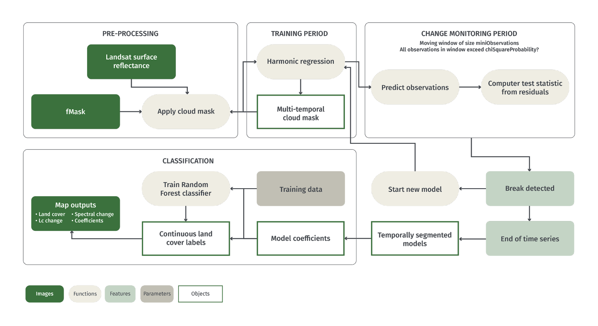
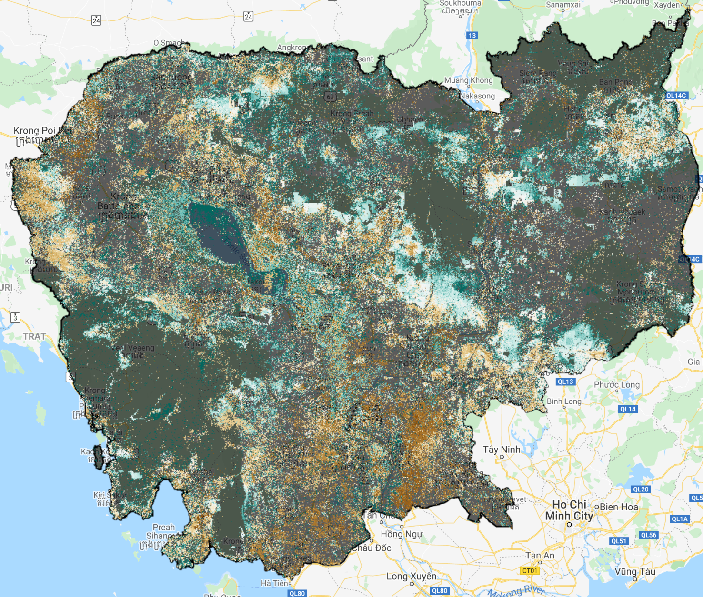
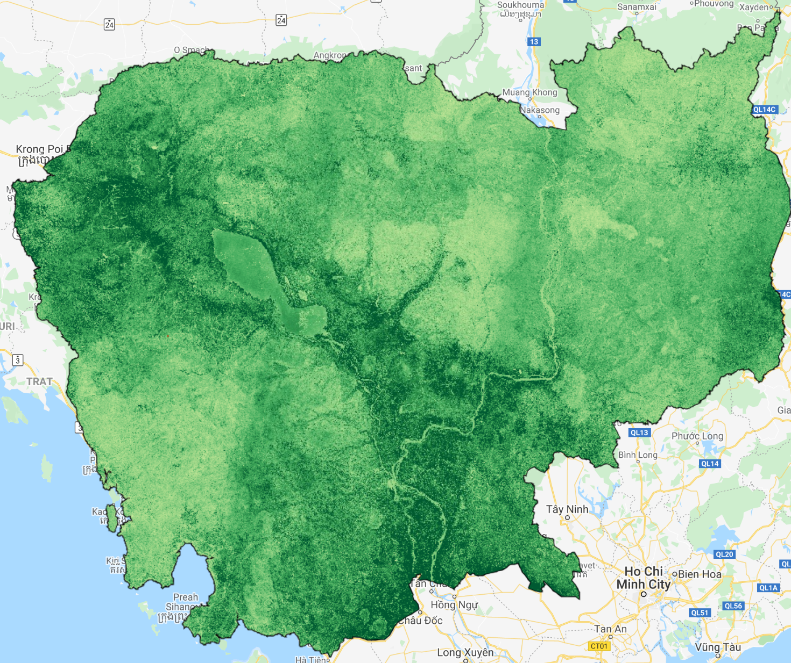
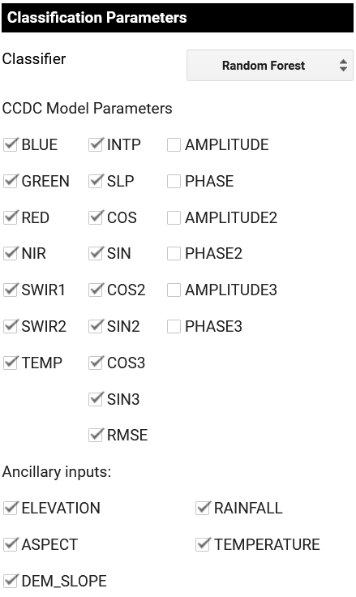
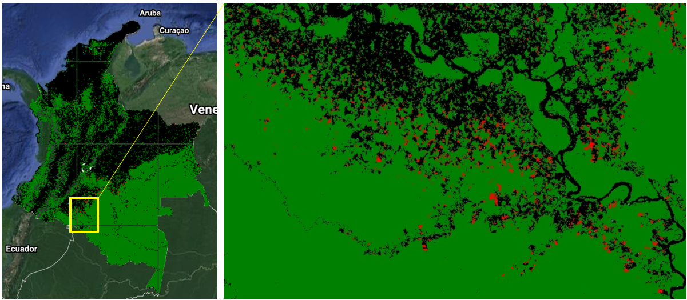

# 2.3 Continuous Change Detection and Classification (CCDC)

## 1 Background


### 1.1 Land change monitoring

Land cover changes affect natural and anthropogenic environments and is regarded as an Essential Climate Variable by the Global Climate Observing System. For example, desertification is causing a land cover transition from vegetative ecosystems to desert, deforestation results in the conversion of forest to human-modified land uses, and urban development can transition a natural environment to one covered in buildings and roads. In order to understand the impact of these transitions it is essential to quantify them at the national-to-regional scale, which is achievable through remote sensing analysis. 

Land change monitoring using remote sensing data requires methodologies for transforming imagery into useful information about changes on the landscape. One such approach that has been widely applied is Continuous Change Detection and Classification (CCDC; Zhu and Woodcock 2014). This tutorial will demonstrate how CCDC can be applied on Google Earth Engine for the purpose of land change monitoring. 


## 2 Learning Objectives

By the end of this tutorial, users should be able to:

*   Describe the key components of CCDC including the different algorithm parameters. 
*   Run CCDC using both a “point and click” interface and through scripting with the Javascript programming language. 
*   Create maps of spectral and land cover change.

## 3 Tutorial: Continuous Change Detection and Classification (CCDC)

CCDC can be run using Google Earth Engine. Other implementations of CCDC can be accessed [here](https://github.com/GERSL/CCDC) and includes implementations in C, Python, and MATLAB. To facilitate analysis in GEE, Arevalo et al (2020) released an API and collection of applications that will be demonstrated [here](https://gee-ccdc-tools.readthedocs.io/en/latest/). 

This tutorial will use CCDC implementation in GEE, hence a GEE account is needed. Please refer to Module 1 for additional information on GEE. In the first example, the process is demonstrated using the CCDC API in Cambodia. In the second example the process is demonstrated in Mozambique using the graphic user interfaces. Finally, the process is performed in Colombia to create a stratification of forest loss and gain. 

### 3.1 Algorithm description


CCDC uses all available cloud-masked Landsat surface reflectance data for a study area. Details on the original implementation are described in Zhu and Woodcock (2014). CCDC is a generalized algorithm for monitoring different types of land change. Therefore, it does not rely on a single spectral band or index, nor does it filter changes based on the specific spectral directional changes. A schematic diagram of CCDC can be found below. 



As the name describes, CCDC consists of a change detection component and a classification component. Change detection is performed using all available Landsat imagery and a user-defined set of spectral bands or indices. Typically, at least the Green, Red, NIR, SWIR1, and SWIR2 bands are used for change detection. All data is filtered at the pixel-level for clouds according to the ‘pixel_qa’, or fMask, band. 

<table>
  <tr>
   <td><strong>Model Parameter</strong>
   </td>
   <td><strong>Comparable Metric or Phrase</strong>
   </td>
  </tr>
  <tr>
   <td>Intercept
   </td>
   <td>Average reflectance
   </td>
  </tr>
  <tr>
   <td>Slope
   </td>
   <td>Long term trend
   </td>
  </tr>
  <tr>
   <td>Amplitude
   </td>
   <td>Variability due to seasonality
   </td>
  </tr>
  <tr>
   <td>Phase
   </td>
   <td>Phenological timing
   </td>
  </tr>
  <tr>
   <td>RMSE
   </td>
   <td>Non-seasonal variability
   </td>
  </tr>
</table>

The first step in identifying model breaks (or “spectral changes”) is to fit a LASSO regression model to a subset of data at the beginning of the time series. Below is an example of a seasonal regression fit (red line) to NIR observations (black dots) for an example pixel in Colombia. While this is shown here for the NIR band, it is fit to all spectral bands and can optionally be applied to spectral indices. The regression model captures the “general pattern” of reflectance over the course of a year, and is therefore predictive of what “future” observations should look like in the absence of a change in the landscape. 


The regression models are fit with coefficients representing model intercept, slope, and three sets of sine/cosine pairs. Since the regressions are fit using LASSO regression, these parameters can be reduced to 0. The sine/cosine pairs are ultimately converted to amplitude and phase to be easier to interpret. These models are used to predict subsequent observations during a “monitoring period”, defined as a moving window with the number of observations equal to the _minObservations_ parameter. Below you can see a regression model fit during a training period (blue), with the monitoring period shown in between the red dotted lines. The figure originals from Zhu and Woodcock (2014) and Bullock et al., (2020). 


The residuals of the observations in the study region are used to calculate a test statistic that follows a chi-squared distribution. If every observation in the monitoring window exceeds the _chiSquaredProbability_ parameter in the test statistic then a change is detected. If there are enough observations remaining in the time series then a new training model is fit and the process repeats until the end of the time series. 

The parameters used to control the change detection can be found below:

<table>
  <tr>
   <td><strong>Parameter Name</strong>
   </td>
   <td><strong>Description</strong>
   </td>
   <td><strong>Recommended Value</strong>
   </td>
   <td><strong>Effect of Increasing</strong>
   </td>
  </tr>
  <tr>
   <td>breakPointBands
   </td>
   <td>Bands to use to calculate test statistic and test for spectral change
   </td>
   <td>Green, Red, NIR, SWIR1, SWIR2
   </td>
   <td>N/A
   </td>
  </tr>
  <tr>
   <td>tmaskBands
   </td>
   <td>Bands to use for multi-temporal cloud and cloud-shadow masking
   </td>
   <td>Green, SWIR2
   </td>
   <td>N/A
   </td>
  </tr>
  <tr>
   <td>minObservations
   </td>
   <td>Number of consecutive observations exceeding threshold to flag a change
   </td>
   <td>4
   </td>
   <td>Less breaks detected
   </td>
  </tr>
  <tr>
   <td>chiSquare Probability
   </td>
   <td>Threshold on test statistic, which is calculated from the model residuals and follows a chiSquare distribution
   </td>
   <td>0.995
   </td>
   <td>Less breaks detected
   </td>
  </tr>
  <tr>
   <td>minNumOfYears Scaler
   </td>
   <td>Number of years after which a new model fit is calculated during training period
   </td>
   <td>1.33
   </td>
   <td>Decrease regression model refitting
   </td>
  </tr>
  <tr>
   <td>dateFormat 
   </td>
   <td>Format to store date information. 0: julian years, 1: fractional years, 2: unix time. 
   </td>
   <td>1
   </td>
   <td>N/A
   </td>
  </tr>
  <tr>
   <td>lambda 
   </td>
   <td>Lambda value for LASSO regression fitting
   </td>
   <td>.002
   </td>
   <td>More parameters shrinking to 0
   </td>
  </tr>
  <tr>
   <td>maxIterations
   </td>
   <td>Maximum iterations to perform LASSO regression fitting
   </td>
   <td>20,000
   </td>
   <td>Attempt more LASSO fits to reach convergence
   </td>
  </tr>
</table>

At the end of the time series, each pixel trajectory will be segmented into temporally-congruent model parameters (e.g. slope and intercept). These segments are separated by _spectral changes_, which may or may not reflect land cover or condition changes. Without classifying the segments or model breaks it is not possible to know whether these _spectral changes_ are meaningful. It should be noted that “meaningful” change varies by context. For example, a drought can cause spectral change due to dry vegetation. While this is a real change occurring on the landscape, it may not always be relevant under differing project objectives. Therefore, the _spectral changes_ and or _model segments_ must be classified according to the objectives of the study at hand. 

**Try it yourself**

We have created a Google Earth Engine application for visualizing the time series and performing pixel-level change detection using CCDC: https://parevalo-bu.users.earthengine.app/view/quick-tstools

Try navigating to a location of interest and clicking on the map to see the SWIR1 time series. The spectral band visualized can be selected on the dropdown menu on the left of the map. Below is an example time series for an area of forest converted to pastureland in the Colombian Amazon.


Here, CCDC is being demonstrated for the purpose of land cover change monitoring. Therefore, the regression models should be classified into land cover labels, and afterwards the _spectral changes_ can be assigned to different land change categories (e.g. forest to developed). To do so, CCDC uses categorical training data with a Random Forest classifier to assign land cover labels to each segmented model period. The input data for the classification are the model coefficients (e.g. slope and intercept) in addition to model root-mean-squared error for each spectral band or index (typically the Landsat spectral bands). 

Land covers can be classified using regression coefficients due to differences in reflectance, seasonal patterns, and day-to-day variability. The following figures shows mean coefficient values for training data of eight land cover classes that are part of the Global Landcover Mapping and Estimation (GLANCE) project, which is using CCDC to map land cover change globally. Note that for each spectral band there are corresponding coefficients for intercept (INTP), amplitude, phase, and RMSE. Since the intercept is generally analogous to average reflectance, the graph appears like a typical spectral profile plot. Amplitude is indicative of seasonality, and it can be seen that the NIR band is highly seasonal for the forest class due to phenology. Phase is harder to interpret as it relates to the timing of seasonal patterns, while RMSE is reflective of the general variability in the data. It is logical that RMSE is highest for the Herbaceous and Bare classes as they are generally considered “noisy” land cover classes. 

<table>
  <tr>
   <td>


   </td>
   <td>


   </td>
  </tr>
  <tr>
   <td>


   </td>
   <td>


   </td>
  </tr>
</table>


### 3.2 Cambodia: CCDC API

The test case in Cambodia will be demonstrated here using the CCDC API. This same process can be performed in the GUIs using the instructions described below in the example in Mozambique. 

In the [Javascript console of Google Earth Engine](https://code.earthengine.google.com/), you should first load the CCDC API and define parameters for the change detection and study region. For this example, we will use the entire country of Cambodia as the study region.  

Copy and paste the following script in GEE, or load the script in the [Open MRV GEE repository](https://code.earthengine.google.com/?accept_repo=users/openmrv/MRV) called ‘CCDC/Cambodia_1’: 


```javascript
// Load CCDC API
var utils = require('projects/GLANCE:ccdcUtilities/api')

// Define parameters in an object
var changeDetectionParameters = {
  breakpointBands: ['GREEN','RED','NIR','SWIR1','SWIR2'],
  tmaskBands: ['GREEN','SWIR2'],
  minObservations: 4,
  chiSquareProbability: .99,
  minNumOfYearsScaler: 1.33,
  dateFormat: 2,
  lambda: .002,
  maxIterations: 25000
}

// Define study region
var studyRegion = ee.FeatureCollection('USDOS/LSIB_SIMPLE/2017')
  .filterMetadata('country_na','equals','Cambodia').union()

Map.addLayer(studyRegion)
Map.centerObject(studyRegion)

```

The [getLandsat](https://gee-ccdc-tools.readthedocs.io/en/latest/api/api.html#getLandsat) function of the CCDC API can then be used to obtain all  Landsat data for Cambodia, mask using the ‘pixel_qa’ band, and convert to units of reflectance. 

```javascript
// Define inputs for Landsat imagery
var inputParams = {
  start: '2000-01-01',
  end: '2020-01-01',
}

// Filter by date and a location in Cambodia
var filteredLandsat = utils.Inputs.getLandsat()
  .filterBounds(studyRegion)
  .filterDate(inputParams.start, inputParams.end)

print(filteredLandsat.size())
```

On the console, you should see that there are 7889 Landsat images between 2000 and 2020 for Cambodia. To perform the change detection component of CCDC we just need to define the input collection in the ‘changeDetectionParameters’ object and pass it to the GEE ‘Ccdc’ function.

```javascript
 // Put the Landsat collection in the change detection parameters
changeDetectionParameters['collection'] = filteredLandsat

// Run CCDC
var results = ee.Algorithms.TemporalSegmentation.Ccdc(changeDetectionParameters)

print(results)
```

The results contain varying numbers of segments for each pixel. Therefore, the output is not well suited for typical fixed-band raster image formats. Instead, the change detection results can be saved as an Asset as an Array image, which requires a ‘pyramidPolicy’ mode of ‘sample’. 

Note that exporting an entire country will take at least a few hours of processing time.

```javascript
// Combine parameters to save as metadata
var paramsCombined = ee.Dictionary(changeDetectionParameters).combine(inputParams).remove(['collection'])
print(paramsCombined)

Export.image.toAsset({
  image: results.setMulti(paramsCombined),
  scale: 30,
  description: 'ccdc_change_results',
  maxPixels: 1e13,
  region: studyRegion,
  assetId: '/path/to/asset',
  pyramidingPolicy: {
	'.default': 'sample'
  }
})
```

**Tip** If your study area is large, the previous step may not ever complete. One way to address this is to split up the export into smaller tasks and rejoin them later. The following code uses the [makeAutoGrid](https://gee-ccdc-tools.readthedocs.io/en/latest/api/api.html##makeAutoGrid) function to create a grid overlapping the study area. A browser-side Javascript loop is then used to submit a different task for each.

```javascript
var grid = utils.Inputs.makeAutoGrid(studyRegion.geometry().bounds().buffer(150000), 2)
  .filterBounds(studyRegion.geometry())
  .toList(100)


grid.size().evaluate(function(s) {
  print('## of grids: ', s)
  for (var i = 0; i < s; i++) {
    var outGeo = ee.Feature(grid.get(i)).geometry()
      .intersection(studyRegion.geometry()) // Subset to study region
  Map.addLayer(outGeo, {}, 'Grid ' + i)
  Export.image.toAsset({
    image: results.setMulti(paramsCombined),
    scale: 30,
    description: 'ccdc_change_results',
    maxPixels: 1e13,
    region: outGeo,
    assetId: 'Cambodia_Change_Results_Grid_' + i,
    pyramidingPolicy: {
      '.default': 'sample'
    }
  })

  }
})
```


**Important Note:** If you cannot export CCDC coefficients, you can also use the global CCDC coefficients created by Gorelick et al., (Unpublished research). These data were created to overcome the bottleneck in using CCDC that comes from creating the initial coefficients. As of January of 2021, these results can be loaded using the following code:

```javascript
var globalResults = ee.ImageCollection('projects/CCDC/v3').mosaic()
```

This file contains CCDC model coefficients and model break information. Specifically, the bands of the ‘results’ asset are: 

*   tStart: The start date of each model segment.
*   tEnd: The end date of each model segment.
*   tBreak: The model break date if a change is detected.
*   numObs: The number of observations used in each model segment.
*   changeProb: A numeric value representing the multi-band change probability.
*   *_coefs: The regression coefficients for each of the bands in the image collection.
*   *_rmse: The model root-mean-square error for each segment and input band.
*   *_magnitude: For segments with changes detected, this represents the normalized residuals during the change period.

The next step in performing land cover analysis using CCDC is collecting training data. There are a few requirements for the training data for it to work with the rest of the process. This tutorial demonstrates how to ensure your data meets these requirements.

**Training data requirements:**

*   The data must be an Earth Engine FeatureCollection of point geometries.
*   An attribute in each point must contain a numeric value indicating the associated land cover.
*   An attribute in each point must contain a year that corresponds to the land cover label.

**Optional additional steps**

*   The predictor data as attributes for each point and for the year that corresponds to the land cover label.
*   Unique sample IDs as attributes

Training data for Cambodia was collected as part of Module 1.2.2 in this series of tutorials and can be loaded here. Note the code related to loading and formatting the training data can be found in the script ‘CCDC/Cambodia_2’ in the Open MRV repository. 

```javascript
var trainingData = ee.FeatureCollection('users/openmrv/MRV/cambodia_training')
print(trainingData.first())
```

 In the console, you should see information on the first training point. Select the feature and then select ‘geometry’. Make sure that the ‘type’ is ‘Point’, like in the figure below. If it is anything else (such as Rectangle or Polygon) then you must convert your data to points before continuing.

**Creating a numeric land cover attribute**

The land cover label must be numeric, so it cannot be a string (such as “forest”) or a numeric string (or a number that is written in string format). To check the type of your attribute select the ‘JSON’ button on the right side of the console to expand the json representation of the feature. 


You should see the JSON of the feature appear:


Note that my feature has two attributes: lc_string and landcover. The lc_string attribute will not work because the classifiers require numeric class property. Note that the JSON representation of the “landcover” property is a numeric 2, not a string representation like “2”. Since it is numeric, it will work for classification. 

If you do not have a numeric attribute indicating land cover you can convert a string attribute to numeric using the ‘remap’ Earth Engine (EE) function. We can convert our ‘lc_string’ property to a numeric property ‘lc_numeric’ with the following code (note this is just an example and is not necessary because ‘landcover’ is numeric):

```javascript
trainingData  = trainingData.map(function(feat) {
  return feat.set('lc_numeric',feat.get('lc_string'))})
  .remap(['forest','herbaceous','water','settlement'],[1,2,3,4],'lc_numeric')
```

In order to determine the CCDC coefficients to use as predictors for training the classifier, each point needs to have a year attribute to query the CCDC results by. For example, if you know a training point corresponds to forest in 2014, then the CCDC coefficients for 2014 will be used for training. If all of your training data correspond to a certain year, you can add the attribute with a simple bit of code. In this example the training data corresponds to 2018 and it is assigned to an attribute named ‘year’.

```javascript
trainingData  = trainingData.map(function(feat) {
  return feat.set('year',2018)})
```

**Build image and extract predictor data for training**

We need to extract predictor data for each training point before we can apply a classifier. We can do this either manually right before submitting the classification, or we can extract the predictors in advance and store them as properties of each of the training points. For this tutorial we will use the second way, because it enables a faster classification that will load “on the fly”. This is useful for testing classification parameters. The function to do this is called [getTrainingCoefsAtDate](https://gee-ccdc-tools.readthedocs.io/en/latest/api/api.html##getTrainingCoefsAtDate). First, however, we need to construct the CCDC coefficient image to sample from. Basically, this step converts the array image into a multi-band image in which each pixel has the same number of bands. 

The [buildCcdImage](https://gee-ccdc-tools.readthedocs.io/en/latest/api/api.html#buildCcdImage) function takes three parameters: the change result array image, a list of bands, the number of segments to convert into bands, and the name of the spectral bands or indices. The variable ‘changeResults’ can be defined based on the output of the change detection, or can also be a global set of CCDC coefficients clipped to your study region, as demonstrated here. If the user was not able to export a coefficient image they should use Option A below.  If the user exported the coefficient images in the previous step as a single image, they should use Option B below, if they exported with multiple images they should use Option C. 

```javascript
// Define bands to use in classification
var bands = ['BLUE','GREEN','RED','NIR','SWIR1','SWIR2']

// Define coefficients to use in classification
var coefs = ["INTP", "SLP","COS", "SIN","RMSE","COS2","SIN2","COS3","SIN3"]

// Segment ids
var segs = ["S1", "S2", "S3", "S4", "S5", "S6"]

// Option A: Obtain change results using  global coefficients
var globalResults = ee.ImageCollection('projects/CCDC/v3').mosaic()
var changeResults = globalResults.clip(studyRegion)

// Option B: Obtain change results from results made with this tutorial. Note that the path must be changed to the path of the exported coefficient image. 
var changeResults = ee.Image('/path/to/change/detection/results')

// Option C: Obtain change results from multiple result images. Note that the path must be changed to the path of the exported coefficient images. 
var changeResults1 = ee.Image('/path/to/change/detection/results_1')
var changeResults2 = ee.Image('/path/to/change/detection/results_2')
var changeResults = ee.ImageCollection([changeResults1, changeResults2]).mosaic()


// Load ccd image stack with coefficients and change information
var ccdImage = utils.CCDC.buildCcdImage(changeResults, segs.length, bands)
print(ccdImage)

// Add the study area to the map for a dark background
Map.addLayer(studyRegion, {color: 'black'},'Cambodia')


// Add the first segment break date to the map.
Map.addLayer(ccdImage.select('S1_tBreak').selfMask(), {min: 2000, max: 2020, palette: ['##8c510a','##d8b365','##f6e8c3','##f5f5f5','##c7eae5','##5ab4ac','##01665e']}, 'Segment 1 Break Dates')

// Add the first segment NIR RMSE
Map.addLayer(ccdImage.select('S1_NIR_RMSE'), {min: 0, max: .05, palette: ['##ffffcc','##d9f0a3','##addd8e','##78c679','##41ab5d','##238443','##005a32']}, 'Segment 1 NIR RMSE')
```

<table>
  <tr>
   <td>





<p>
Segment 1 Break Date (Brown -> Blue)
   </td>
   <td>





<p>
Segment 1 NIR RMSE (Light Green -> Dark Green)
   </td>
  </tr>
</table>


Next we want to load ancillary topographic and climate data with the [getAncillary](https://gee-ccdc-tools.readthedocs.io/en/latest/api/api.html##getAncillary) function and the obtain CCDC coefficients at each of the training points using the [getTrainingCoefsAtDate](https://gee-ccdc-tools.readthedocs.io/en/latest/api/api.html##getTrainingCoefsAtDateefsAtDate) function. 

```javascript
// Property corresponding to year of training data
var yearProperty = 'year'

// Finally, get ancillary topographic and climate data
var ancillary = utils.Inputs.getAncillary()

var trainingData = utils.Classification.getTrainingCoefsAtDate(
  trainingData, coefs, bands, yearProperty, ancillary, ccdImage, segs)

// Filter points with no data
var testBand = bands[0] + '_' + coefs[0]
trainingData = trainingData.filter(ee.Filter.notNull([testBand]))

print('First training point with predictors:', trainingData.first())
```

You should now see in the feature attributes all of the predictor data that can be used for classification.

**Add unique IDs as attributes**

Another optional, but recommended, step is assigning each sample with a unique ID as an attribute. EE gives each point an ID, but they can be long and seemingly random. The [assignIDs](https://gee-ccdc-tools.readthedocs.io/en/latest/api/api.html##assignIds) function in our API will shuffle the sample and assign a unique ID to a given attribute name. 

```javascript
trainingData = utils.Classification.assignIds(trainingData, 'ID')
```
Finally, the training data can be exported as an asset:

```javascript
Export.table.toAsset({
  collection: trainingData,
  description: 'trainingDataProcessed',
  assetId: 'trainingDataWithPredictors'})
```

**Plot coefficients of training data**

Optionally, after the export is completed we can visualize different coefficients for our training classes. In the following code, the saved training features are loaded and a scatterplot is created showing the NIR and SWIR1 intercepts for the training points and organized by land cover. Note that this code can be found in the Open MRV repo in the script ‘CCDC/Cambodia_3’

```javascript
var trainingData = ee.FeatureCollection('users/openmrv/MRV/Cambodia_TrainingData_CCDC')

var doChart = function(sample, x, y, xMin, xMax, yMin, yMax) {
  var chart =
	ui.Chart.feature.groups({
  	features: sample,
  	xProperty: x,
  	yProperty: y,
  	seriesProperty: 'lc_string'
	})
	.setChartType('ScatterChart')
	.setOptions({
  	title: 'Training features',
  	hAxis:
      	{title: x,
      	titleTextStyle: {italic: false, bold: true},
      	viewWindow: {min: xMin, max: xMax}},
  	vAxis: {
    	title: y,
    	titleTextStyle: {italic: false, bold: true},
    	viewWindow: {min: yMin, max: yMax}
  	},
	});
	return chart

}

// Change 'SWIR1' or 'NIR' to any input band and 'INTP' to any coefficient. 
print(doChart(trainingData, 'SWIR1_INTP','NIR_INTP'))

```


Note the differences in intercepts between bands. Water samples have low intercepts in both NIR and SWIR1 bands due to generally low reflectance in water. Forest, by contrast, has low SWIR1 but high NIR, due to high reflectance in NIR wavelengths for green vegetation. Herbaceous and Settlement are highly variable, which reflects the wide range of reflectance in these classes. In this manner, it can be seen how the intercept generally corresponds to the “average” reflectance. 

**Classify segments**

The model segments can now be classified with the [classifySegments](https://gee-ccdc-tools.readthedocs.io/en/latest/api/api.html##classifySegments) function from the API. The following code first defines the parameters of a Random Forest classifier, and then passes the classifier, training data, and model segments to the [classifySegments](https://gee-ccdc-tools.readthedocs.io/en/latest/api/api.html##classifySegments) function. The first segment’s classification is added to the map in which green is forest, brown is herbaceous, blue is water, and black is settlements. Note that this code can be found in the Open MRV repo in the script ‘CCDC/Cambodia_4’. 

```javascript
// Classifier
var classifier = ee.Classifier.smileRandomForest({
  numberOfTrees: 150,
  variablesPerSplit: null,
  minLeafPopulation: 1,
  bagFraction: 0.5,
  maxNodes: null
})

var results = utils.Classification.classifySegments(
  ccdImage, segs.length, bands, null, [], trainingData, classifier, studyRegion, 'landcover', coefs)
  .clip(studyRegion)


Map.addLayer(results.select(0), {min: 1, max: 4, palette: ['##a6d854','##386cb0','##e5c494','black']}, 'Seg1 Classification')
```


Finally, classifications at specific dates can be obtained using the [getLcAtDate](https://gee-ccdc-tools.readthedocs.io/en/latest/api/api.html#getLcAtDate) function. The following code snippet first creates a classification for the arbitrary date of March 27, 2014, and then calculates deforestation between 2000 and 2018. In the training data, the value 1 represents forest, 2 is herbaceous, 3 is water, and 4 is settlement. Therefore, substituting the different class values would create maps of change for the other respective classes. 

```javascript
// Create classification for March 27, 2014 and add it to the map
var dateOfClassification = '2014-03-27'
var matchingDate = utils.Classification.getLcAtDate(results, dateOfClassification)
Map.addLayer(matchingDate, {min: 1, max: 4, palette: ['##a6d854','##386cb0','##e5c494','black']}, 'Classification ' + dateOfClassification)

// Create classification for Jan 1 2000 and 2018
var class2000 = utils.Classification.getLcAtDate(results,'2000-01-01')
var class2018 = utils.Classification.getLcAtDate(results,'2018-01-01')

// Deforestation is where it's forest (1) in 2000 and not forest in 2018. 
var deforestation = class2000.eq(1).and(class2018.neq(1))

// A map of settlement gain can be calculated in a similar manner:
var settlementGain = class2000.neq(4).and(class2018.eq(4))


Map.addLayer(deforestation.selfMask(), {palette: 'red'}, 'Deforestation')

// Mask the 2018 classification to only contain the 2018 land cover label for pixels undergoing deforestation
var postDefClass = class2018.updateMask(deforestation)

Map.addLayer(postDefClass, {min: 1, max: 4, palette: ['##a6d854','##386cb0','##e5c494','black']}, 'Post-Deforestation Class')
```


<table>
  <tr>
   <td>


<p>
Deforestation
   </td>
   <td>


<p>
Post-Deforestation Land Cover
   </td>
  </tr>
</table>

Finally, we can simplify the above steps to perform land cover classification using the global coefficients into one section of code (found in the Open MRV repo in script ‘CCDC/Cambodia_5’). Note that these steps are described in more detail above. 

```javascript
// Load CCDC API
var utils = require('projects/GLANCE:ccdcUtilities/api')

// Parameters, assets, and study region
var studyRegion = ee.FeatureCollection('USDOS/LSIB_SIMPLE/2017')
  .filterMetadata('country_na','equals','Cambodia').union()

// Parameters
var bands = ['BLUE','GREEN','RED','NIR','SWIR1','SWIR2']
var coefs = ["INTP", "SLP","COS", "SIN","RMSE","COS2","SIN2","COS3","SIN3"]
var segs = ["S1", "S2", "S3", "S4", "S5", "S6"]
var yearProperty = 'year'
var lcClasses = ['forest','herbaceous','water','settlement']
var numericClasses = [1, 2, 3, 4]
var classifier = ee.Classifier.smileRandomForest({
  numberOfTrees: 150,
  variablesPerSplit: null,
  minLeafPopulation: 1,
  bagFraction: 0.5,
  maxNodes: null
})

// Year property
var trainingData = ee.FeatureCollection('users/openmrv/MRV/cambodia_training')
  .map(function(feat) {
  return feat.set(yearProperty,2018,'lc_numeric',feat.get('lc_string'))})
  .remap(lcClasses, numericClasses,'lc_numeric')
 
// Get inputs from global coefficients and ancillary topographic and climate data
var globalResults = ee.ImageCollection('projects/CCDC/v3').mosaic()
var changeResults = globalResults.clip(studyRegion)
var ccdImage = utils.CCDC.buildCcdImage(changeResults, segs.length, bands)
var ancillary = utils.Inputs.getAncillary()

// Get training coefficients at sample points
var trainingData = utils.Classification.getTrainingCoefsAtDate(
  trainingData, coefs, bands, yearProperty, ancillary, ccdImage, segs)
var testBand = bands[0] + '_' + coefs[0]
trainingData = trainingData.filter(ee.Filter.notNull([testBand]))

// Land cover classification
var results = utils.Classification.classifySegments(
  ccdImage, segs.length, bands, null, [], trainingData, classifier, studyRegion, 'landcover', coefs)
  .clip(studyRegion)

// Create land cover map for the date March 27, 2014
var dateOfClassification = '2014-03-27'
var matchingDate = utils.Classification.getLcAtDate(results, dateOfClassification)

// Calculate land cover change and create maps of deforestation and post-deforestation land cover
var class2000 = utils.Classification.getLcAtDate(results,'2000-01-01')
var class2018 = utils.Classification.getLcAtDate(results,'2018-01-01')
var deforestation = class2000.eq(1).and(class2018.neq(1))
var postDefClass = class2018.updateMask(deforestation)

// Add results to map
Map.addLayer(deforestation.selfMask(), {palette: 'red'}, 'Deforestation')
Map.addLayer(postDefClass, {min: 1, max: 4, palette: ['##a6d854','##386cb0','##e5c494','black']}, 'Post-Deforestation Class')
Map.addLayer(matchingDate, {min: 1, max: 4, palette: ['##a6d854','##386cb0','##e5c494','black']}, 'Classification ' + dateOfClassification)
```

### 3.3 Mozambique: CCDC GUIs

To facilitate easy access to our API we have created a series of graphical user interfaces (GUIs) that require no coding by the user. Detailed descriptions of these tools can be found in [Arevalo et al., 2020](https://doi.org/10.3389/fclim.2020.576740). 

<table>
  <tr>
   <td><strong>Name and Link</strong>
   </td>
   <td><strong>Description</strong>
   </td>
   <td><strong>Video Demonstration</strong>
   </td>
  </tr>
  <tr>
   <td><a href="https://code.earthengine.google.com/?scriptPath=users%2Fparevalo_bu%2Fgee-ccdc-tools%3AAPPS%2Ftstools_basic">Simple Time Series Viewer</a>
   </td>
   <td>Visualize pixel time series and CCDC model fits
   </td>
   <td><a href="https://youtu.be/3qHTAa7ptaA">Link</a>
   </td>
  </tr>
  <tr>
   <td><a href="https://code.earthengine.google.com/?scriptPath=users%2Fparevalo_bu%2Fgee-ccdc-tools%3AAPPS%2Ftstools_advanced">Advanced Time Series Viewer</a>
   </td>
   <td>Visualize pixel time series and CCDC model fits and experiment with model parameters
   </td>
   <td><a href="https://youtu.be/1moyd9qWwcw">Link</a>
   </td>
  </tr>
  <tr>
   <td><a href="https://code.earthengine.google.com/?scriptPath=users%2Fparevalo_bu%2Fgee-ccdc-tools%3AAPPS%2Fsubmit_ccdc">Submit CCDC</a>
   </td>
   <td>Calculate CCDC coefficients and spectral change information
   </td>
   <td><a href="https://youtu.be/AInNpBc4OnY">Link</a>
   </td>
  </tr>
  <tr>
   <td><a href="https://code.earthengine.google.com/?scriptPath=users%2Fparevalo_bu%2Fgee-ccdc-tools%3AAPPS%2Fvisualize_ccdc">Visualize CCDC</a>
   </td>
   <td>Visualize CCDC coefficients and spectral change information
   </td>
   <td><a href="https://youtu.be/xAkrE8b6sZ0">Link</a>
   </td>
  </tr>
  <tr>
   <td><a href="https://code.earthengine.google.com/?scriptPath=users%2Fparevalo_bu%2Fgee-ccdc-tools%3AAPPS%2Fclassify_app">Classify CCDC</a>
   </td>
   <td>Perform land cover classification of CCDC coefficients
   </td>
   <td><a href="https://youtu.be/y1h7SMDP8zc">Link</a>
   </td>
  </tr>
  <tr>
   <td><a href="https://code.earthengine.google.com/?scriptPath=users%2Fparevalo_bu%2Fgee-ccdc-tools%3AAPPS%2Flandcover_app">Land Cover and Change</a>
   </td>
   <td>Create maps of land cover and land cover change
   </td>
   <td><a href="https://www.youtube.com/watch?v=CnLqENvBnvE">Link</a>
   </td>
  </tr>
</table>


These GUIs can be used for calculating CCDC model parameters (i.e. regression coefficients), displaying and interacting with CCDC coefficients and corresponding pixel time series, and classification of the model parameters. This tutorial will demonstrate the GUIs for land cover classification and for creating land cover and land cover change maps. 

Since CCDC coefficients are very computationally intensive to calculate over large areas, we will use the global CCDC results introduced in the example in Cambodia. The tools will, by default, load the most recent global coefficients. If users wish to create their own coefficients using their own parameters they should consult the instructions in the Cambodia example using the CCDC API. 

In this tutorial you will:
*   Classify CCDC segments based on their model parameters and ancillary data
*   Extract a land cover map for a specific date
*   Calculate land cover change between two or more dates

#### Classify time series segments

This result of this part of the tutorial will be an image with bands corresponding to the pixel’s _n_ th land cover label for _n_-bands. In other words, band 1 is the first segment’s classification, band 2 is the second, and so on. Theoretically, a pixel can have dozens of segments. That is very rare, however, since the changes correspond to land change occurring within that pixel. Thus, to reduce computational intensity we limit the number of segments that are classified in this application to 6 per pixel.

The first step is to load the [app](https://code.earthengine.google.com/?scriptPath=users%2Fparevalo_bu%2Fgee-ccdc-tools%3AAPPS%2Fclassify_app), you should see a panel like this appear:


Next, the user must load the CCDC coefficients. If coefficients were created using the previous step ‘Submit change detection’ then that asset should be used in this step. If not the global coefficients can be used. 

These first few parameters describe the format of the CCDC results. First, are they saved as a single image or a collection? Next is the path to the CCDC results. If using results from the previous section, select ‘Image’ for the result type and add the path to the asset in the textbox. Alternatively the global results can be loaded using the result type ‘Image Collection’ and path ‘projects/CCDC/v3’. Finally, you must specify the date format that the results were run with. For the global dataset and default value from the change detection application the format is fractional years (1). Click Load.

You should see the _Predictor Variables_ panel populate like in the following figure. Uncheck any bands, coefficients, or ancillary data that you do not wish to be used as inputs to classification. The terrain inputs are from the[ 30m SRTM global DEM](https://doi.org/10.1029/2005RG000183), while the climate inputs are from the[ WorldClim BIO Variables V1](https://doi.org/10.1002/joc.1276). Above the predictor variables is an option to choose a machine learning classifier for performing the classification. Generally, Random Forest performs well in the CCDC context.



The next option lets you decide how to define the region to classify and export. As you’ll see, there are many options. Most of them revolve around a global grid that we have created for the Global Land Cover Mapping and Estimation (GLanCE) project. More information on the GLanCE grid grid can be found on the[ project website](http://sites.bu.edu/measures/).


There are four ways you can specify a tile to run in addition to manually defining the study region or selecting a country. The simplest option is to choose “Tile Intersecting Point”, and then click somewhere on the map. You will see the grid overlapping the location you selected loaded as the study region.


Alternatively, you can manually define the study region by clicking on five points on the map that define the borders.


The other options are to manually define output grids based on their tile IDs, or drawing on the map to specify multiple grids, or selecting a country. If multiple grids are selected then each grid will be submitted as a separate task. If a country is selected then the entire country boundary will be the study region.


Use the _Country Boundary_ method for defining an output region, and select _Mozambique_ for the _Country_. 

The final set of parameters relate to the training data. The training data requires that each point has an attribute identifying the land cover label, and must also correspond to a specific year for training. You have the option to use the entire FeatureCollection or only the points that fall within the study region. 

*   An example training dataset, as developed in Module 1.2.2, can be found in the asset ‘users/openmrv/MRV/mozambique_training’. 
*   Assuming the training data comes from within your study region, you can use the default option of _Within Output Extent_. 
*   The _Training Year_ corresponds to the year of the training labels (e.g. what year is a sample labeled as ‘Forest’ actually forest?). For this dataset, the year is 2018. 
*   The _Training Attribute_ corresponds to the attribute name in each feature that contains the land cover label. For this dataset it is _landcover_. 


Note, the classification runs quicker if the predictor data for each training point is saved in the feature’s properties (as opposed to being calculated on the fly). We recommend doing this process in a separate task, and then using the data with the predictors attached to quickly try classification parameters. You should see in the Console a note about whether or not the predictor data must be sampled as the training points. If so, you can also submit a task that will save this calculation for future use.

Finally, when you click ‘Run Classification’, the classification corresponding to the first segment period gets displayed on the map. In this case, the models correspond to ~1999. The full classification stack can be exported as a task that should appear with the description “classification_segments”.

#### Create Land Cover and Land Cover Change Maps

Once the task has completed processing, we can use it to make landcover maps at any date in time for the study region. This asset can be used directly in the[ Landcover Application](https://code.earthengine.google.com/?scriptPath=users%2Fparevalo_bu%2Fgee-ccdc-tools%3AAPPS%2Flandcover_app). This application is relatively simple - all you need to do is specify the path to the segment image created above and a list of dates and voilà! An example output created using the steps above can be found in: ‘users/openmrv/MRV/Mozambique_CCDC_Segments’. 

The dates should be entered in the format ‘YYYY-MM-DD’ and separated by commas, for example “2001-01-15, 2001-07-21, 2014-12-10”. Each band in the output image will correspond to a different date’s classification.


This app also has the function to add a change between that represents conversion from one or multiple classes at a specified date to a specified class or group of classes. You must first specify the starting and ending dates and the land cover class values for the corresponding dates. For example, the following examples show the pixels (red) that are class 1 (forest) in 2001-01-01, and are either class 2, 3, or 4 in 2018-01-01. In other words, deforestation from January 2001 to January 2018. Switching the “From” and “To” classes for the Change band will calculate the inverse of deforestation, or forest growth.


You can also specify a single value for the Class (To) box, for example just using 3 would map conversion from 1 to 3, or forest to cropland. If these boxes are left empty then just the land cover maps will be created.

Finally, the tool allows you to specify some visualization parameters. This step is very straightforward, just list the land cover names and corresponding numeric value, and optionally provide a palette. Once the map is loaded, you can click on the map to visualize the SWIR1 time series trajectory for that pixel. The example below shows a regrowth trajectory, which is characterized by a decrease in SWIR1 reflectance over the time series.


#### 3.4 Colombia: CCDC API for Forest Change Stratification

The final tutorial will demonstrate the use of the API to create a forest change stratification in Colombia. The code is modified from that in the Mozambique tutorial and uses the global CCDC coefficient dataset. The script can be found in the Open MRV repository in the script 'CCDC/Colombia_1'. 

For the output stratification, we want classes that represent:

1. Stable Forest
2. Stable Non-Forest
3. Forest Gain
4. Forest Loss

For the sake of this exercise, we are also going to assume we do not care about conversion from Forest to Water. While this assumption might not be valid for all purposes, for national greenhouse gas inventories it is often true that natural conversions are less important than conversion to human-modified classes such as Settlements or Herbaceous. Furthermore, we are going to create it for a two year time period (2016-2018). The dates can be modified by changing the 'startDate' and 'endDate' parameters. 

Like in the Cambodia tutorial, we need to first load the CCDC API, define a study region, and define a few simple parameters. Note that for most applications these parameters do not need to be adjusted. However, users should ensure the _yearProperty_, _lcClasses_, and _numericClasses_ match their training data. 

```javascript
// Load CCDC API
var utils = require('projects/GLANCE:ccdcUtilities/api')

// Parameters, assets, and study region 
var studyRegion = ee.FeatureCollection('USDOS/LSIB_SIMPLE/2017')
  .filterMetadata('country_na','equals','Colombia').union()

// Parameters
var bands = ['BLUE','GREEN','RED','NIR','SWIR1','SWIR2']
var coefs = ["INTP", "SLP","COS", "SIN","RMSE","COS2","SIN2","COS3","SIN3"]
var segs = ["S1", "S2", "S3", "S4", "S5", "S6"]
var yearProperty = 'year'
var lcClasses = ['forest','water','herbaceous','settlement']
var numericClasses = [1, 2, 3, 4]
var classifier = ee.Classifier.smileRandomForest({
  numberOfTrees: 150,
  variablesPerSplit: null,
  minLeafPopulation: 1,
  bagFraction: 0.5,
  maxNodes: null
})
```

Unlike in the Cambodia tutorial, we should specify a start and an end date for the stratification. Note that the global coefficient dataset goes from 1999 to 2020. 

```javascript
var startDate = '2016-01-01'
var endDate = '2018-01-01'
```

Next we will want to load the training data, turn the string landcover attribute to numeric, and provide a year for the training data. The path to the training data can be found in '/users/openmrv/MRV/colombia_training', and the year of the training labels is 2018. 

```javascript
var trainingData = ee.FeatureCollection('users/openmrv/MRV/colombia_training')
  .map(function(feat) {
  return feat.set(yearProperty,2018,'lc_numeric',feat.get('lc_string'))})
  .remap(lcClasses, numericClasses,'lc_numeric')
  
```

To perform the classification, we will need to load the global CCDC coefficients, and optionally provide ancillary datasets to use in the classification. The optional ancillary layers that are loaded with the [getAncillary](https://gee-ccdc-tools.readthedocs.io/en/latest/api/api.html#getAncillary) function can be seen in the table below.

| Layer Name       | GEE Collection                            |
|------------------|-------------------------------------------|
| ELEVATION        | USGS/SRTMGL1_003                          |
| DEM_SLOPE        | USGS/SRTMGL1_003                          |
| ASPECT           | USGS/SRTMGL1_003                          |
| TEMPERATURE      | WORLDCLIM/V1/BIO                          |
| RAINFALL         | WORLDCLIM/V1/BIO                          |
| POPULATION       | WorldPop/GP/100m/pop                      |
| WATER_OCCURRENCE | JRC/GSW1_1/GlobalSurfaceWater             |
| TREE_COVER       | UMD/hansen/global_forest_change_2018_v1_6 |
| NIGHT_LIGHTS     | NOAA/VIIRS/DNB/MONTHLY_V1/VCMCFG          |

For this example, we will select only the topographic layers ('ELEVATION','DEM_SLOPE', and 'ASPECT'). 

```javascript

// Get inputs from global coefficients and ancillary topographic and climate data 
var globalResults = ee.ImageCollection('projects/CCDC/v3').mosaic()
var changeResults = globalResults.clip(studyRegion)
var ccdImage = utils.CCDC.buildCcdImage(changeResults, segs.length, bands)
var ancillary = utils.Inputs.getAncillary().select(['ELEVATION','DEM_SLOPE','ASPECT'])

// Get training coefficients at sample points
var trainingData = utils.Classification.getTrainingCoefsAtDate(
  trainingData, coefs, bands, yearProperty, ancillary, ccdImage, segs)
var testBand = bands[0] + '_' + coefs[0]
trainingData = trainingData.filter(ee.Filter.notNull([testBand]))
```

Extract the predictor data for the training data and perform the classification.

```javascript
// Get training coefficients at sample points
var trainingData = utils.Classification.getTrainingCoefsAtDate(
  trainingData, coefs, bands, yearProperty, ancillary, ccdImage, segs)
var testBand = bands[0] + '_' + coefs[0]
trainingData = trainingData.filter(ee.Filter.notNull([testBand]))


// Land cover classification
var results = utils.Classification.classifySegments(
  ccdImage, segs.length, bands, null, [], trainingData, classifier, studyRegion, 'landcover', coefs)
  .clip(studyRegion)
```

Next, we can use the CCDC API functionality to extract land cover maps at the start and end dates of our analysis (or the startDate and endDate parameters). Note that the 'Image.eq()' function creates a binary image where the image given to the function (classStart or classEnd) equals the pixel value parameter (1). Similarly, the 'Image.neq()' function creates the opposite (e.g. Image.neq(1) is 1 where classStart or classEnd does not equal 1). 

```javascript
// Calculate maps at the beginning and end of the study period
var classStart = utils.Classification.getLcAtDate(results,startDate)
var classEnd = utils.Classification.getLcAtDate(results,endDate)

// Create forest loss and gain maps. 
var forestLoss = classStart.eq(1).and(classEnd.neq(1))
var forestGain = classStart.neq(1).and(classEnd.eq(1))
```

Next, we can use raster manipulation to create our stratification. Note that the 'remap' function is used to create a 'Non-Forest' class from the 3 Non-Forest classes in our training data (Herbaceous, Settlement, and Water), and the 'where' function is then used to change the value of the layer to 3 in pixels of Deforestation and 4 in Forest Gain.  

```javascript
// Initiate stratification image. The EE function Image.remap is used to turn all non-forest classes to 2. 
var stratification = classStart.remap([1,2,3,4],[1,2,2,2])

// Use the EE function Image.where to turn deforestation to 3 and forest gain to 4. 
stratification = stratification.where(forestLoss, 3).where(forestGain, 4)
```

Finally, we can use the 'where' function again to change all pixels labeled as Water to a non-change class and add the results to the map. 

```javascript
// Turn conversion to water to a non-change class to omit it from the 'Forest Loss' stratum. Note in this dataset the value of 2 indicates water.  
stratification = stratification.where(classEnd.eq(2), 2)

Map.addLayer(stratification, {min: 1, max: 4, palette: ['green','black','red','cyan']}, 'Stratification')
```

In the following example, the legend palette is:
- Green: Stable Forest
- Black: Non-Forest
- Red: Forest Loss
- Cyan: Forest Gain



**Note:** The area of Forest Loss is small, and the area of Forest Gain is even smaller. That is to be expected! Our study period is only two years, and there is relatively little forest change that has occurred in Colombia in recent years. Using the previous code as reference, how do the results change when using a longer study period (for example, 2000 to 2018)?  

## 4 Frequently Asked Questions (FAQs)

**Can CCDC be performed using other data sources?**
Technically, yes. Although CCDC was designed for Landsat data, it is technically data agnostic and could therefore be performed using any data source with a dense time series record. 

**Where can I find the most recent versions of the CCDC applications?**
The most recent versions of the GUIs and API can be found here: https://gee-ccdc-tools.readthedocs.io

**Can CCDC be analyzed without the API or GUIs?**
Yes, CCDC can be performed using only the Javascript API. However, the complexity of the inputs and calculated outputs has proven to be a challenge to new (and even advanced) users. Therefore, we created the API and applications to make the analysis easier. 

**Who should be credited for creating CCDC?**
CCDC was originally introduced in Zhu and Woodcock (2014). The GEE implementation was written by Noel Gorelick and Yang Zhiqiang. There have been many other contributors to the CCDC algorithm and the applications used here, notably the [USGS LCMAP Program](https://github.com/repository-preservation/lcmap-pyccd), the [Global Environmental Remote Sensing Laboratory](https://gerslab.uconn.edu/), and the [Global Land Cover mapping and Estimation project](http://sites.bu.edu/measures/). The GUIs and API are primary written and managed by Paulo Arévalo and Eric Bullock.  

**The change coefficients are failing to export, what should I do?**
The calculation of the change coefficients is the most computationally intensive part of CCDC. That is why the kind folks at Google have created a global coefficient dataset. Although it uses one default set of change parameters for the globe, the parameters have been proven to perform relatively well across different environments. Therefore, it should be considered as a useful alternative to user-created coefficients. 


## 5 References

Zhu, Z., Woodcock, C.E., 2014. Continuous change detection and classification of land cover using all available Landsat data. Remote Sens. Environ. 144, 152–171. https://doi.org/10.1016/j.rse.2014.01.011

-----

  

This work is licensed under a [Creative Commons Attribution 3.0 IGO](https://creativecommons.org/licenses/by/3.0/igo/)

Copyright 2021, World Bank 

This work was developed by Eric Bullock under World Bank contract with GRH Consulting, LLC for the development of new -and collection of existing- Measurement, Reporting, and Verification related resources to support countries’ MRV implementation. 

Material reviewed by:  
Foster Mensah, Ghana, Center for Remote Sensing and Geographic Information Services  
Tatiana Nana, Cameroon, REDD+ Technical Secretariat    
Jennifer Juliana Escamilla Valdez, El Salvador, Ministerio de Medio Ambiente y Recursos Naturales  
KONAN Yao Eric Landry, Cote d'Ivoire, REDD+ Executive Permanent Secretariat  
Adrianirina Carole, Madagascar, BNCCREDD+  

Attribution
Bullock, E. 2021. Continuous Change Detection and Classification (CCDC). © World Bank. License:  [Creative Commons Attribution license (CC BY 3.0 IGO)](http://creativecommons.org/licenses/by/3.0/igo/)  

