# 2.2 LandTrendr

## 1 Background

### 1.1  LandTrendr Conceptual Foundation

As biophysical, ecological, and anthropogenic processes act on the land surface, the spectral reflectance of the surface changes over time. Over time, the temporal trajectory of spectral reflectance evolves into a shape that is indicative of the processes that are acting: vegetative growth and decline, disturbance, and landcover transition all affect the temporal progression of spectral values in distinctive ways. The strategy of the LandTrendr algorithm is to distill a multi-year spectral trajectory into sequential straight-line segments that adequately capture the character of those progressive changes, and then to leverage that simplified rendition of the time-series to extract useful information. 

When viewed graphically, observed spectral changes show both the effects of the desired change processes and of non-target change.With time on the X-axis and measured spectral reflectance on the Y-axis, the underlying shape of a change process becomes evident, but with variability from observation-to-observation. That variability is caused by the vagaries of image acquisition date, residual cloud and atmospheric effects, sun angle effects, phenology and potentially other processing or system noise. Restated graphically, the LandTrendr algorithm attempts to isolate the underlying shape of the trajectory while removing the noise. We refer to this process as "temporal segmentation."


Two components of spectral trajectories must be considered when inferring process from temporal segmentation: the <u>magnitude</u> and the <u>duration</u> of the spectral change. <u>Magnitude</u> of change refers to the change in the numeric quantity of the spectral properties.  The more the surface is changed, the more likely there is a change in the spectral properties and hence in magnitude of change over time. However, two constraints control this process. First, the spectral property being tracked must actually be sensitive to the change-process of interest.  Second, the magnitude of spectral change must be measurable and distinguishable from non-target changes in spectral value that occur because of variability in phenology, sun angle, residual atmospheric effects, etc. <u>Duration</u> of the process refers to the temporal period over which the change process causes a consistent change in spectral property. Some processes, such as vegetative growth, occur continuously for many years at a time, and thus cause continuous change in spectral reflectance. After temporal segmentation, this process will be noted by segments whose endpoints are several years apart. Other processes, such as land-clearing, are abrupt and cause a large change between only two observation periods, with vertices immediately in succession of one another. 


Once the time-series is segmented into distinct parts, the start-and-end points can be queried to identify segments corresponding to the desired type of change process. If the goal is to identify human-caused land-clearing, then the segmented trajectory can be queried to find segments with vertices in direct succession and whose directional change in spectral value is consistent with loss of vegetation. If the goal is to find areas of long-term regrowth after a disturbance, on the other hand, segments should be sought that show spectral changes consistent with vegetation growth over many years.  

Once a segment of interest has been identified for each pixel, key characteristics can then be rendered spatially to produce maps of interest. To map the year at which disturbance occurs, for example, all pixels with segments that precipitously lose vegetation can be identified and the tagged with year of the segment's drop. To map magnitude of recovery, the change in the spectral value from start vertex to end vertex can mapped.  

#### 1.1.1 A note on sensors

The LandTrendr algorithm was built to use imagery from the Landsat family of sensors, and all of the examples in this training use these sensors: Landsat 5, 7, and 8. With imagery from those three sensors, the Landsat series provides a potentially unbroken record back to 1984.  

While the algorithm was built with Landsat data in mind, it can be presented time-series of any numeric sequence, whether from Landsat sensors, other satellite sensors, or an entirely different source. However, when using other data types, several considerations are important to consider. The algorithm assumes that there is one entry per year;  if you use a different time step, you will need to "trick" the algorithm into thinking it is looking at yearly data. The algorithm assumes that durable change in the values over time corresponds to a change of interest, and that there are enough data to parse actual change from noise.  If there are not enough observations over time from a given sensor, it will not be appropriate for LandTrendr. As a rule of thumb, there should be roughly three to four  times as many observations as the maximum number of periods you wish the algorithm to discriminate. Since capturing a single disturbance requires three segments:  a pre-disturbance segment, the change segment, and a post-disturbance segment, then it is advisable to never attempt LandTrendr with fewer than 10-12 reliably good observations per pixel. 

#### 1.1.2 The LandTrendr-GEE GitHub resource

We have developed a manual for general implementation of the LT-GEE (LandTrendr Google Earth Engine) algorithms: https://github.com/eMapR/LT-GEE. Interested readers may find additional and complementary descriptions of the logic of the fitting, as well some other features of the LT-GEE implementation that may be of interest. 

### 1.2 LandTrendr Fitting Logic

The underlying logic of the LandTrendr temporal-segmentation algorithms is to impose linear trend-segments onto a time-series of observations to minimize residual error. This achieved in two broad steps: a breakpoint identification step, and a model-fitting step. The details of these steps are not necessary for most users to know, and are described in detailed in the first publication on the algorithm (Kennedy et al. 2010: Remote Sensing of Environment 114(12): 2897-2910). However, a brief overview of the highlights of the process is useful when choosing parameters for fitting (Table 1).

| Parameter                 | Typical values |
| ------------------------- | -------------- |
| Max Segments              | 6 to 10        |
| Spike Threshold           | 0.75 to 1.0    |
| Vertex Count Overshoot    | 3              |
| Prevent One Year Recovery | True           |
| Recovery Threshold        | 0.25 to 1.0    |
| p-value Threshold         | 0.05 to 0.15   |
| Best Model Proportion     | 0.75 to 0.90   |
| Min Observations Needed   | 6-10           |

The overall fitting process includes steps to reduce noise and best identify the underlying signal. The data are arranged as X and Y values in a Cartesian plane with years on the X-axis and spectral values on the Y-axis. 

First, the *minimum observations needed* criterion is used to evaluate whether a given trajectory has enough unfiltered (i.e. clear observation) years to run the fitting.  

The breakpoint identification step begins with a noise-dampening step to remove spikes that could be caused by un-filtered clouds or shadows. The *spike threshold* parameter controls the degree of filtering, with a value of 1.0 corresponding to no filtering, and lower values corresponding to more severe filtering.  

Once the series of spectral values has been despiked, the vertex algorithm commences. It begins with the start and end year as vertex years, and progressively adds candidate vertex years based on deviation from linear-fits.  An overabundance of vertex years initially found using this method. Then a second criterion of deflection angle is used to cull back this overabundance to a target number of maximum candidate vertex years. That candidate number is set by the *max_segments* parameter, and as a rule of thumb should be approximately 1/3 the total number of likely yearly observations.  The vertex years (X-values) are then passed to the model-building step. 

In the model-building step, straightline segments are built by fitting Y-values (spectral values) for the periods defined by the vertex years (X-values), starting from early vertex years and going to the last. Regressions of each subsequent segment are constrained to connect to the end of the prior segment.  Regressions are also constrained to prevent unrealistic recovery after disturbance, as controlled by the *recovery threshold* parameter. The smaller the parameter, the more aggressive the constraint. A value of 1.0 means the constraint is turned off, while a value of 0.25 would mean that segments that fully recover fast than four years (4 = 1/0.25) are disallowed. This parameter has strong control on the fitting, and is one of the first to explore when testing parameters. 

Once a model of the maximum number of segments is found, successively simpler models are made by iteratively removing the least informative vertex.  Each model is scored using a pseudo-*f*-statistic, which penalizes models with more segments, to create a pseudo-*p*-value for each model. Because of temporal autocorrelation, these cannot be interpreted as true *f*- and *p*-values, but rather as relative scalars to distinguish goodness of fit among models.  

If no good models can be found using these criteria based on the *p*-value parameter set by the user, a second approach is used to solve for the Y-value of all vertex years simultaneously. If no good model is found, then a straight-line mean value model is used.  

The best model is initially considered to be the one with the best *p*-value. However, because the pesudo-*f*-statistic penalizes more complicated models (i.e. models with more segments), it can often choose a non-disturbance model over a model that accurately captures disturbance but has a slightly poorer score. Thus, an adjustment can be made that will allow a model with more segments to be chosen as long as it is within a defined proportion of the best-scoring model. That proportion is set by the the *best model proportion* parameter.  As an example, a *best model proportion* value of 0.75 would allow a more complicated model to be chosen if its score were greater than 75% that of the best model.  

### 1.3 LandTrendr Outputs

#### 1.3.1 Standard outputs

The output from a run of the LandTrendr algorithm on GEE is an "array image" with at least two bands. Array images are somewhat abstract representations of data:  think of each pixel being a container of objects which happen to be called "bands".  Each "band" can be data of a variety of types, and different bands in the need not have the same size or type. The array images themselves cannot be represented as geospatial images, but the bands (within them) can be unpacked, reshaped, and represented.  

The first band is called 'LandTrendr' and is of most interest. It is an array of size [4 by NumberOfYears], where NumberOfYears is the number of years in the source trajectory provided to the algorithm.  The first row stores the year of observation, the second the spectral values that were passed to the algorithm - known as the "source" spectral values, the third the yearly values represented by the temporal fitting, and the fourth a binary array indicating whether the year is a vertex (value 1) or not (value 0).

The second band is a scalar that corresponds to the overall root-mean-square-error of the fitting -- the residual between the original source spectral values and the fitted values. 

#### 1.3.2 Optional outputs

Optionally, a user may pass more than one band to the LandTrendr segmentation algorithm. The first band is always used for the segmentation process:  finding vertices and fitting the best segmentation model.  For all additional bands passed to the algorithm, only the second half of the segmentation process is undertaken: Vertex years from the fitting of the first index are used to constrain a linear-segmentation process of the additional bands.  

In this manner, an index that is sensitive to change may be used to best characterize the time-periods of interest for a pixel, but then the full spectral domain of the sensor can be matched to those time-periods to more richly describe them. 

This process is referred to as fitting-to-vertices, or FTV. Although the FTV process is beyond the scope of this tutorial, advanced users can take advantage of the resultant images to build time-series landcover classification algorithms, as described in Kennedy et al. (2018). 

### 1.4 LandTrendr Application 

Applying the LandTrendr algorithms in GEE involves several steps. Users specify parameters that control  the construction of image stacks, the temporal segmentation process in LandTrendr, and the post-processing of segmented outputs into disturbance and recovery maps.  

 

To adequately determine the appropriate user parameters, any time LandTrendr is to be applied in a new region, the following sequence of steps is advised: 

- Determine spectral indices and date ranges of imagery that best track known change
- Determine LT parameters that capture the observed change in spectral index
- Develop rules to translate the captured spectral change into maps of disturbance and recovery

Below, we describe how these steps can be approached using a graphical user interface (Section 3), and how change detection can then be tailored by adapting existing GEE scripts (Section 4). 

## 2 Learning Objectives

At the end of this module, you will be able to: 

- Interpret yearly time-series spectral values to discriminate between real change in land cover condition and spectral artifacts caused by other factors
- Identify spectral indices and seasonality windows that best capture desired disturbance regimes
- Choose LandTrendr fitting parameters that best capture trends in yearly spectral values
- Interpret three-band temporal composites in terms of land cover change and robustness of LandTrendr fitting parameters
- Implement LandTrendr disturbance mapping scripts through a graphical user interface

Additionally, advanced users will be able to: 

- Adapt LandTrendr GEE scripts to create custom disturbance and recovery maps for areas of interest

### 2.1 Pre-requisites for this module

* Google Earth Engine (GEE) concepts (please refer to Section 1.1 of Module 1.1 Image mosaic/composite creation for Landsat and Sentinel-2 in Google Earth Engine for useful GEE resources)
	* Getting a user account
	* Image handling in GEE
	* Basic syntax of functions
	* Basic image processing, including choice of imagery, cloud-screening, mosaicking and compositing
* It is highly recommended that you finish the previous tutorials:
  * Module 1
    * 1.1 Image mosaic/composite creation for Landsat and Sentinel-2 in Google Earth Engine
    * 1.2 Training Data Collection
      * 1.2.1 Training Data Collection Using QGIS, or
      * 1.2.2 Training Data Collection Using Google Earth Engine
    * 1.3 Land Cover and Land Use Classification in Google Earth Engine
  * Module 2
    * 2.1 Basics of Change Detection methods

## 3 Tutorial: Quickstart LandTrendr via GUI on GEE

### 3.1 Overview

To assess LandTrendr image and parameter choices, the LandTrendr GUI is an excellent place to work.  The interface allows quick feedback on image date window choices, on parameter choices, and on making maps. 


### 3.2 Getting set up with libraries and GUI
The graphical user interface (GUI) is provided by the developers of LandTrendr in the eMapR lab (emapr.ceoas.oregonstate.edu).  This tutorial utilizes a snapshot (December 2020) of the current version. 

#### 3.2.1 Open the GUI

In the [OpenMRV common repository](https://code.earthengine.google.com/?accept_repo=users/openmrv/MRV), find and open the script named: **LT-GEE-Vis-DownLoad-app_WB_v1.0**.  When loaded and run, this script creates a LandTrendr-GEE GUI. 

Note that this GUI requires access to two libraries of utility functions: One that handles the image processing, and one that handles the GUI interface. Users need not change anything in the script to access these, but it is useful to recognize that these external libraries are being called. Although originally developed by the eMapR lab, for convenience, as noted above,  these libraries have been copied in late 2020 into the common repository of this training module. 


> Note: The original versions of these libraries and scripts (including likely updates over time) are available in GEE through the /users/emaprlab/public folder.  

#### 3.2.2 Basic orientation to the GUI

The LT GUI consists of three panels:  A control panel on the left, a reporting panel on the right, and a map panel in the center.

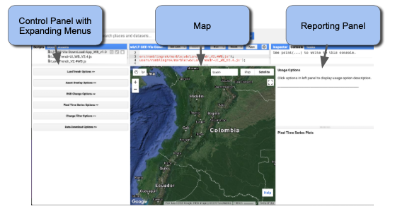

A video showing basic orientation to the GUI is here:  https://youtu.be/tdpuxV7Ad8g

Using the expanding menus in the Control Panel, the user sets parameters for the LandTrendr runs, displays images and maps in the center panel, or generates charts in the reporting panel.  Expanding windows are controlled by clicking on the double-arrows next to each heading: 

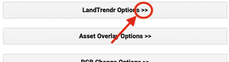


### 3.3 Explore the point-mode LandTrendr fitting

The simplest starting way to understand LandTrendr is to apply the algorithms in point mode.  This allows you to visualize how fitting works, and how changing your settings can change the fit. 

To access the point-mode, select the "Pixel Time Series Options" menu. You should see a window something like this: 


You can either click on a point on the map and wait patiently, or type coordinates and then click on the "Submit Pixel" button. 

A video showing basic point mode operation is here: https://youtu.be/RdQvxTbi37E

#### 3.3.1 Examine a forest disturbance pixel

To start, leave all settings as they are, and simply type these numbers into the Longitude and Latitude boxes, respectively, and click on the Submit Pixel button. 

Longitude: -74.43198, Latitude: 2.73876

You should see something like this: 


The time-series chart on the right is the key thing to learn to interpret.  It shows exactly what the algorithm is doing, and builds on theories noted in the introductory sections earlier. 

Orient yourself to the layout and meaning of the components of the chart below: 


The core interpretation is the difference between the grey line and the red line. 

The grey line represents the trajectory of the <u>*observed (measured) spectral values*</u> for the pixel. The values are extracted from image collections with properties that define the date window and years of the collection.  **We refer to these as the "source" spectral values**. They bounce around from year to year because of subtle changes in the atmosphere, the timing of image acquisition, etc. 

The <u>*red line shows what the algorithms decided was the best temporal segmentation*</u> through those observed values. This is a function of the fitting parameters of the segmentation model. **We refer to these as the "fitted" spectral values.** 

The goal with these plots is to determine if:

1.  The trajectory of the source values captures the processes you believe are occuring at the surface
2. The fitted values adequately capture the overall "shape" of the trajectory of the source values. 

 To interpret these plots, you need to at least know which direction of change in the index corresponds to a loss of vegetation, since loss of vegetation is one of the most common means of identifying when a disturbance has occurred.  This is particularly the case for forests.  

In this case, the default index used is the "NBR" or normalized burn ratio. Like the more familiar normalized difference vegetation index (NDVI), the NBR increases when there is more vegetation in a pixel and decreases when there is more soil visible in the pixel.  

Thus, interpreting the graph above, we can see that this pixel's source spectral values dropped precipitously just before the year 2010, and then rose again for several years before falling more slowly again at the end of the time series.    Looking at the backgound image in the map viewer, we can see that this makes sense -- it appears that the area being shown under the red dot on the map has the shape and context of a forest harvest.  

Let's explore some more change processes. 

#### 3.3.2 Guided forest dynamics tour

Forest dynamics are fun to learn about through the lens of a time-machine like the Landsat sensors.  With some basic interpretation skills, you can begin to recognize many types of forest dynamics. 

Below, we'll give some Longitude and Latitude values.  Type these into the same box you did for the first example, and we'll discuss what you see at each point. 

##### 3.3.2.1 Stable forest

When forest is relatively mature (i.e. not a vigorously growing young fores, nor one subject to disturbance or degradation), its spectral signal from year to year is relative stable.  Here's a good example: 

Longitude:  74.40033, 2.6399 


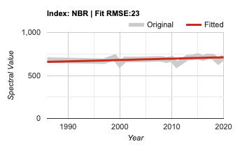

Notable features:   The source signal does not deviate much from year to year, and is flat or nearly flat. 

Here's what airphoto from this area looks like: 


##### 3.3.2.2 Possible degradation

Although forest disturbance such as that shown in our initial example is common, there are other ways that forest can be affected without wholesale removal of the forest.  In this case, the spectral signal often shows a longer-duration reduction in the spectral values associated with vegetation. 

Longitude: -74.45873, 2.65730

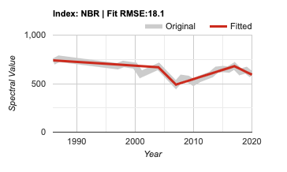

Notable features:  The dip in the source values in the mid-2000s occurs over two+ years, and was preceded by an even longer slow decline from the beginning of the record, suggesting some persistent loss of low amounts of vegetation.  The segment showing multi-year increase beginning in roughly 2007 is consistent over time (i.e. not noisy) and peristent (shows a steady pattern over multiple years).  When these are observed after a decline like that seen in the 2004-2006 period, it is supporting evidence that the decline was indeed real, and not an artifact. 

Viewing the aerial photo of the region, we see evidence of human activity all around and including the point itself.  The forest in the area of the pixel appears to be cleared in small patches, and the pattern of removal suggests that humans were active in the removal process. The specific reason for this degradation would require better knowledge of the very local drivers and incentives for forest removal. 


##### 3.3.2.3 Riparian disturbance and recovery

Human are not the only agents of change in forests.  Natural processes can remove vegetation, only to have the forest grow back.  Rivers are notable agents of such change.  

Point your detector to this location: 

Longitude:  -74.06598, Latitude:  2.692711

And you should see this trajectory: 

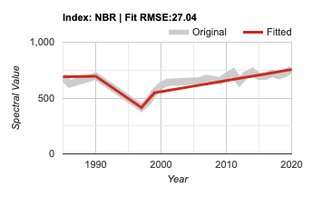

Notable features: In the source signal, we see a multi-year decline in the NBR signal from roughly 1990 to 1997 or 1998, following a short quick recovery and a longer, slower recovery from roughly 1999 to the present. The end of the time series, we might expect to see a well-recovery canopy.  

The fitting follows these contours of time well, but may underestimate the initial rate of recovery.  

Note that the fitted-segment showing loss of vegetation begins in 1990 and continues for multiple years.  

The high resolution image from the recent era shows very little evidence of disturbance any more.  Although the spectral trajectory is unambiguous in its depiction of change, it would require interpretation of the spatial patterns of historical imagery itself to confirm the type of change. 

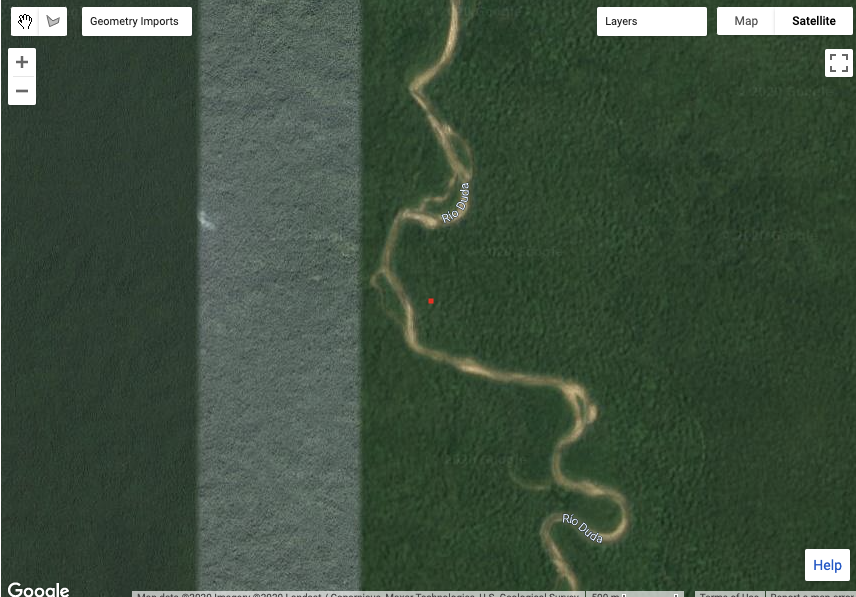

#### 3.3.3 Other spectral indices

In the GUI, you can run LandTrendr using many indices. Let's take a look at what this latest river disturbance and recovery looks like in two other spectral indices.  

> Note: If you want more indices, advanced users can add these when moving to using scripts, or even by adapting the libraries used by the GUI here. You can use any index you can dream up!  

Without changing the Longitude or Latitude, simply click on the check boxes next to "NDVI" and "B5", and click on the "Submit Pixel" box, as shown here: 


You should now see two more charts on the reporting panel on the right, looking like these: 


Remember, these are charts of the same pixel as the first one, but viewed with different spectral indices.  The differences are notable! 

The NDVI source data show roughly the same timing of disturbance and recovery, but the algorithm does not fit the trajectory the same way!  

The B5 trajectory requires some explanation.  Band 5 refers to the Band number of the Landsat 5 and 7 satellites, where Band 5 was the short-wave infared band (centered at around 1.65 micrometers).  Band 5 goes UP when there is more soil, and down when there is more vegetation. 

In fact, some indices are better for detecting change in certain environments than others.  For forested regions, our experience suggests that NBR, NDVI, and Band 5 are somewhat complementary. 

#### 3.3.4 Hints of problems

So far, we have only seen areas where the source signal was fairly clear and the fitting by the algorithm appeared to make sense.  This is not always the case!  Indeed, thus far we have only used the "default" parameters for the LandTrendr algorithms, and we might not expect them to be optimal for any new environment or situation.  Before we start changing  the controls, let's take a look at some areas where things don't work as well. 

##### 3.3.4.1 Noisy source signal

Sometimes the source signal is noisy, making it difficult for either a human or an algorithm to interpret. 

Consider this area: Longitude: -74.41916, Latitude:  2.70914

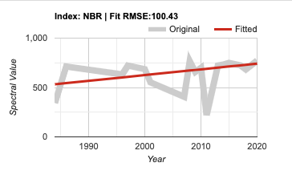

Notable features:  Although there are some periods with relative consistency (from the late 1990s to the mid-2000s, and the last five+ years of the record), there are several periods where the source data are quite variable.  

The first year in the time series seems low, and jumps up quickly in the second year. Notably, the algorithm believes this jump and alters the entire fit to accommodate this first observation. 

This raises one of the more important guidelines when working with and interpreting algorithms operating on time-series data of any sort:  **beware the first and last observations!**  While every other observation has another outside observation flanking it to help determine if it is unusual, the first and last observations have no such outside anchor. Thus, the algorithms have no choice but to believe those observations, and the fit can be rudely affected. 

In the period from roughly 2007 to 2010, the source data jump and down quite dynamically.  But it is not clear whether it is the high years that are anomalous, or the low years.   Such dynamics can be caused by variabiilty in seasonal signals of vegetation, particularly in agricultural or other highly dynamic land cover classes.  

But as the photo of this points suggests, this area is not likely a dynamic type.  In fact, it appears to be a fairly stable forest! 


What could be going on?  Given that we are working in a cloudy part of the world, the most likely answer is that there are clouds or cloud-shadows that made it through the image filtering stage and are polluting the spectral signal in those intermediate years of the time series. The odd low value in the first year of the time-series is also suggestive of an ephemeral issue, likely also clouds.  

How can we fix this?  Within the GUI, the best way to ameliorate this problem is to change the date windows of the image collection.  We will discuss how we might address these issues in a later section. 

##### 3.3.4.2 Poor fitting

Sometimes the source signal has a fairly obvious shape to the human eye, but the algorithm does not capture it.  

Consider this area:  

Longitude: 74.43843, Latitude:  2.67350


Notable features:   The source signal appears to be relatively stable or even increasing until about the year 2000, then shows a decline for two decades.  From this signal alone, it appears the vegetation is losing vigor very slowly over time, but the cause is unclear.  The area appears to be in a pasture (not shown here), and it may be that the change in vegetation vigor reflects some change in management, grazing, or harvest practice. 

The larger problem is that whatever the cause of the change in the source signal, the fitting algorithm misses the inflection point at the year 2000. To address this type of problem we would need to change fitting parameters. 

Another example of poor fitting can be found here: 

Longitude: -74.4236, Latitude:  2.6939


Notable features:  The source data are more variable than some of the examples above, but nevertheless the shape of the trajectory is likely interpretable. Although it drops and recovers quickly, the abrupt drop from 2007 to 2009 is likely a disturbance.  The pre-disturbance period (up to roughly 2006) is relative stable, and at a plateau of spectral values distinct from the start of the post-disturbance climb in 2010 forward. 

While the algorithm believed that there was a decline, it did not allow the quick recovery, and instead forced a long-duration disturbance segment on the first half of the time series.  

This raises an important topic in setting parameters for fitting. One of the key steps in processing trajectories is removing noise spikes, which are defined by the algorithm as deviations that return the starting level immediately after the change.  By that definition alone, the algorithms are rightly suspicious of the dip in the late 2000s.   

Several key parameters can be tweaked in situations like this to encourage the algorithm to capture such change (describe below). 

#### 3.3.5 Explore on your own! 

The best way to learn interpretation of time series with the processes at play is to explore on your own.  In fact, you can point the GUI interface anywhere in the world to explore locations where you feel you can understand the dynamics of change, and experiment with spectral indices to see how well they capture the underlying change process, and then evaluate how the algorithm does in capturing the shape of the index. 

### 3.4 Exploring dynamics with three-color composite images

While the point mode is the only way to fully understand and evaluate the source and fitted values, it is an inefficient way to explore the spatial patterns. We can happen upon pixels where the source values indicate a problem with the imagery, or where the fitting parameters are likely not chosen appropriately, but such findings happen by chance.  It would be handy to have a quick visual tool to scan the landscape and evaluate trends and potential problems.   

The RGB visualization tool in the LandTrendr GUI is designed to quickly evaluate spatial patterns of spectral fitting by the algorithm.  In this tool, we run LT across many pixels, and then show images of the LT-fitted values across pixels, with different years of fitted imagery in the red, green, and blue colors on the screen.   With awareness of the years being displayed and the properties of the spectral values being rendered, it is possible to interpret spatial patterns in the RGB images in terms of their landcover change processes, or problems with the imagery or fitting.  

Let's explore the RGB Visualization tool. 

#### 3.4.1 Load a study area bound in Colombia

The LandTrendr algorithms are computationally intensive and take some time to run.   For training purposes, it is useful to constrain our analysis to a relatively small geographic domain.  

Thus, the first step is to load a GEE-asset to define the area of interest.  In the Control Panel, select the "Asset Overlay Options" menu (Figure P1), and enter these values:

1. In the first box, enter the path to the asset:   **users/openmrv/MRV/ColombiaRectangle**
2. In the first box of the "Define Layer Name" section, enter a name that you will recognize when it appears in the layers of the map.  "ColombiaRectangle" is a good choice. 
3. Near the bottom, **click the check-box** that makes the first layer one to use to constrain later analyses. 
4. Click on the 'Add asset to map'.


Figure P1.  The "Asset Overlay Options" menu, used to add a constraining box to the map for later analysis and visualization. 

When you have done these steps, the bound of the area of interest should appear in the center of the map as a white box.  Zoom in a bit so the white box fills most of the map area (Figure P2).  The area below is useful because it includes substantial forest, because it has abundant natural river-caused change and anthropogenic forest clearing, and because it is small enough to be tractable for analysis as you are learning. 

> NOTE:  You can use this same asset management tool to load a different bounding area of your choice.  The only constraint is that it must be a GEE asset that you have rights to view.  

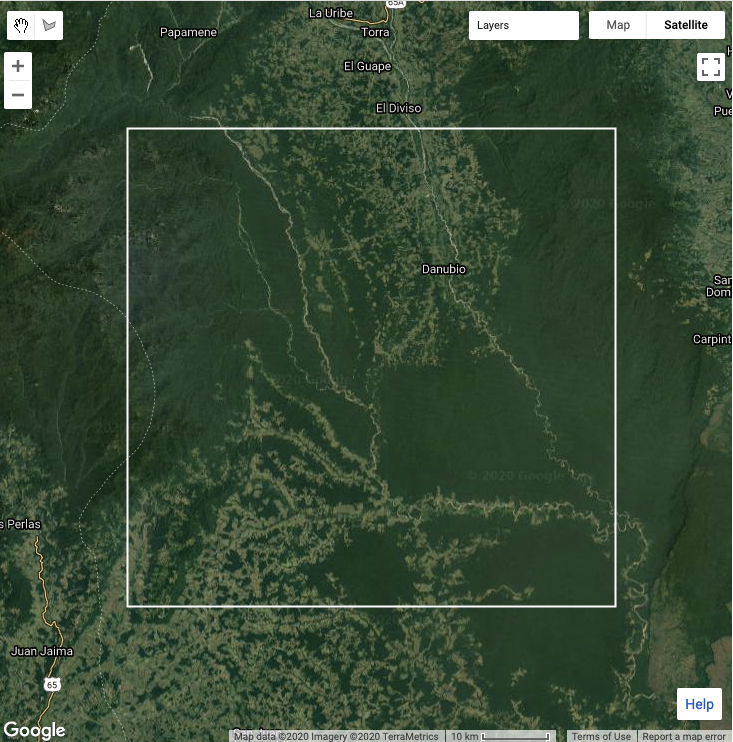

#### 3.4.2 Display and interpret fitted images in RGB mode

What are fitted images?   As you have learned in the pixel mode, the LandTrendr algorithm creates fitted trajectories of spectral values at a pixel scale.  Every year in the time series is assigned a fitted value from the temporal segmentation model.  If we were to run LT for many pixels, we could take a snapshot of fitted values from any one year to and produce an image of that spectral index for that year.  We could do the same thing for any other two years, and if we assign one year each to one of the monitor's color guns, we would see a combined RGB image.  Interpreting the colors in this image tells us about the trajectory of fitting. 

> Note:  For a good graphical description of this process, consult Section 8.3 in the LT-GEE User Guide produced by the eMapR lab on Github:  https://emapr.github.io/LT-GEE/ui-applications.html#ui-landtrendr-fitted-index-delta-rgb-mapper

##### 3.4.2.1 Load an RGB image combo

Let's try it for the study area of interest.  Open the RGB change mapper menu in the GUI. Because we've loaded an asset and, on the Asset menu above, clicked on the check box that said "Use the first file path to process imagery" (You checked that box above, right?), we can ignore many of the options here.  

If in the future you want to run the RGB mapper in different ways, however, note that you can set the center point and a box around it, or you can delineate your own arbitrary geography. 

A basic video showing the RGB tool is here: https://youtu.be/VSeia3NRa3c


Click on "Add RGB Imagery", and wait patiently.  It may take a minute to fully load the area we have chosen.  When it is done, you should see something like this: 

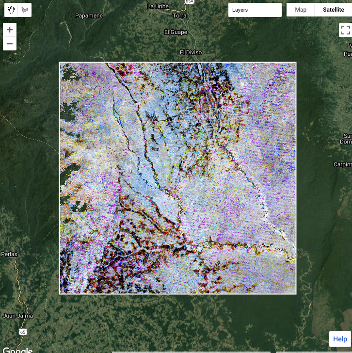

> Note:  There are some areas on the left edge of this study area that have missing data (indicated by being able to see the underlying image instead of the fitted values).  These areas do not have enough unmasked observations to run the temporal fitting, as determined by the "minimum observations needed" parameter set by the user (Section 1.2 above). If there really are fewer than six observations (the default for the parameter), then running the algorithm is likely to result in overfitting or poor fits, as there are simply too few observations. Thus, rather than reducing that parameter value to allow more areas to be run with the algorithm, it is advisable instead to investigate why so few valid observations exist.  If there truly are few valid observations, then other approaches may need to be undertaken in these regions, or they may need to be explicitly withheld from reporting.

##### 3.4.2.2 Interpret change as colors

How do we interpret the colors?  Let's assume we are working with an index such as NBR or NDVI where high values indicate more vegetation and low values indicate less vegetation. 

First, let's consider what an area with *no colors* -- an area that is black, white or some grey tone in between.  If an area is some shade of black to white, it mens that the trajectory of spectral values is the stable across the years.  In the schematic below, the black horizontal lines are three different pixel trajectories, all perfectly flat (i.e. stable across time): 


If we have a disturbance between the Green and Blue years, that means the index will be high in both Red and Green colors, but low in blue.  Following additive color theory (see https://en.wikipedia.org/wiki/Additive_color), this would result in a yellow color. 


If, on the other hand, the disturbance occurred before the green year and did not see much recovery by the blue year, we would have high values mostly in red. 

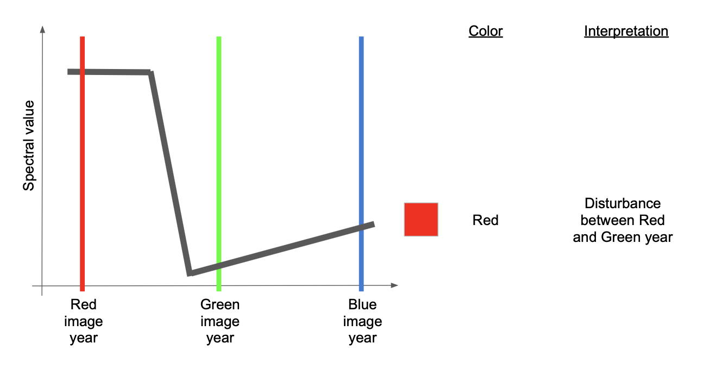

If there *were* recovery by the time of the blue year, then there would be high red and blue, making some shade of purple or magenta. 

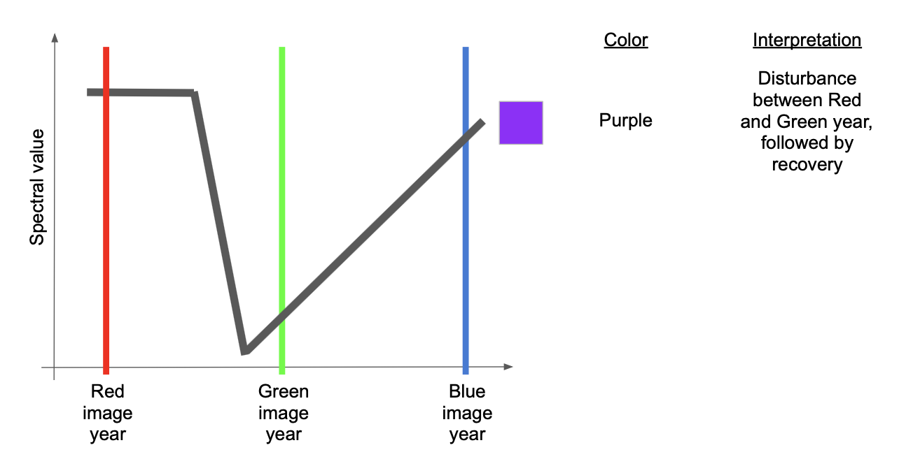

A couple of other variants are commonly seen and worth learning.  

If an area sees consistent growth in vegetation across all years, it will have relatively low red, slightly higher green, and highest blue, making some form of cyan to blue. 


Finally, if there is persistent decline over the fully time period, red will be highest, followed by green and then blue -- making some version of brown or orange. 


##### 3.4.2.3 Use pixel-level plotter with RGB images to interpret colors

Those color rules can be somewhat abstract until you see them in action.  The LandTrendr GUI gives us the chance to do that:  use the RGB color map to select pixels and plot them in the pixel-level mode! 

Let's do it. 

First, double check that your RGB image has loaded into the Colombia rectangle. 

Then, on the Control menu on the left, re-select the "Pixel Time Series Options" menu, as you did in Section 3.3.

Now, you can click around in the RGB image to see what pixels look like in different areas of the image. 

First, look at some pixels in the large swath of blue:


Here's the time series for one in that region: 


As our color interpretation guide above suggests, the fitted line (in red) is increasing through the entire time series.   But we can see that this, like one example in Section 3.3., is the result of the algorithm being tripped up by apparent problems in the first year of the time series.  

The spatial pattern of the blue in the image is a clue that this might be an artifact of clouds -- the blue tone extends through a large swath of the image and appears unrelated to patterns in the underlying landscape.  This is suggestive of a cloud or clouds. 

Another area where the spatial patterns of colors in the RGB image do not match apparent patterns on the landscape is on the right (east) of the study area, where there is a fair amount of purple "striping".   

Zoom to one of the purple stripes and click on it.  

> Note:  when you change the image extent, GEE will recalculate the fitted imagery, so be patient! 

Here's one example: 

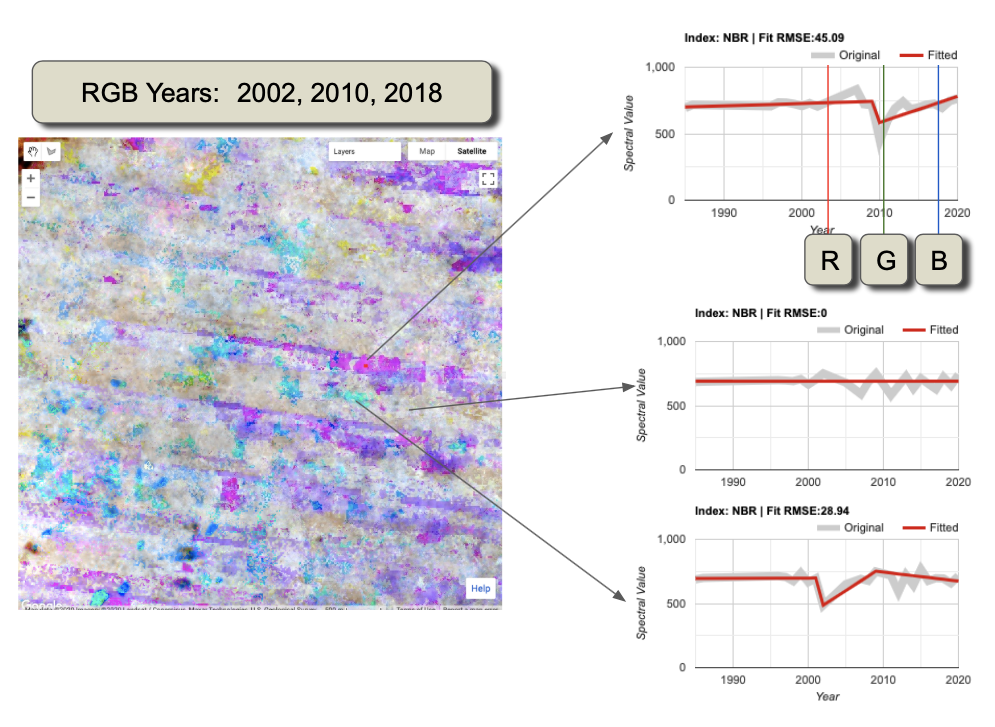

Interpretation: We use the RGB viewer combined with the pixel-plotter to assess both spatial and temporal patterns. Examining only the top and bottom spectral trajectories, the source imagery appears to show drops in spectral value that are persistent over more than one year and may appear to be real.  However, with the RGB viewer, we can see that the spatial pattern is disjunct with the underlying landscape (not shown in the figure above, but it is forested).  Moreover, the pattern of disturbance appears to be horizontal and linear. 

The spatial pattern of these artifacts is suggestive of the Landsat 7 scan line error pattern -- a problem where roughly-horizontal slices of the Lansat 7 imagery are not recorded.  

> Note!  The problem is not, in fact, with the Landsat 7 images, but the fact that they have no data in these areas and are allowing an underlying Landsat 8 or Landsat 5 image with cloud problems to show through!  

Nevertheless, the summary interpretation here is that this region has persistent cloudiness that is not being captured by the default cloud mask algorithms.  

What is the solution?  The key thing to realize here is that the peristent cloudiness is happening within the window of the season that we are using to build the image collections!   Thus, the best option is to examine and change the window of time for the image collections.  We'll do that in the next section, but first let's look at some *actual disturbance!*

Look for areas that have red and yellow patterns -- those should be disturbance. 

Here's one example: 


The spatial patterns of the red and yellow areas are consistent with the underlying landscape pattern, lending credibility to the detection of actual change.  Moreover, the source data in the pixel trajectories, while noisy, appear to be consistent with the signal of disturbance. 

However, we also see an example of a purple disturbance with an odd spatial pattern (lower right figure).  Hovering over the chart itself and examining the grey source data, one can inspect which years of data are actually present.  In doing so, it emerges that many years of source data are missing.  This occurs when clouds are present. 

Thus, we have further evidence that the image window chosen for the default run of LandTrendr here is not optimal for Colombia!  Let's work on that. 

### 3.5 Updating Image and Fitting Parameters

Up to now, we've been relying on the "default" parameters to run the LT algorithm:  the date windows of the year to build image collections, and the fitting parameters to control the algorithm.  And we have seen evidence that these may not be good enough for our new situation in Colombia! 

To improve this, we must define the basic imagery that will be provided to the algorithm and the fitting parameters to control the algorithm.  These occur in the "LandTrendr Options" expanding menu of the  GUI.  

A basic video showing this process is here: https://youtu.be/TNQOdHIg24s

#### 3.5.1 Change values in the menu

In Section 3.5, we first describe the logic for each component and provide recommendations for new values to try.  


As noted in the workflow diagram (Section 1.4), the first step in the LandTrendr workflow is to process image archives into annual composites.  Compositing reduces noise in the time series;  in the standard LandTrendr libraries, we utilize a medoid compositing approach (Described in Section 5 below). 

Two groups of values need to be determined:  the range of years to draw from for segmentation, and the seasonal date-range within each year from which to calculate composites. 

##### Image years

As noted in Section 1.1.1, the LandTrendr algorithm is designed to work with data from the Landsat family of sensors reaching back to 1984.  In practice, many tropical areas of the world do not have enough image availability in early years of the Landsat archive to provide reasonable image composites. 

If there are no images early in the time series, the algorithm will simply start the temporal segmentation process at whatever year first has unmasked data.  Thus, it is reasonable to begin a segmentation process with the early year set to 1984 and the last year set to the most current year. 

In practice there are two reasons to set the early year later than 1984.  First, with fewer images collected in the first years of the Landsat Thematic Mapper program, there are fewer images to draw from. If clouds are  common in the area of interest, the image compositing step will draw from fewer images and may be forced to include images further from the desired phenological (seasonal) condition. Second, in some areas of the world, it appears that the spectral properties of the images from the first years of the record are less consistent than the rest of the archive.  Thus, in practice we recommend setting the initial year to 1986 or later. 

Additionally, if later steps show that few pixels have values in the early years, then consistency across the image domain would argue for starting the entire segmentation process at a later year.  

Thus, **we recommend setting the Start Year to 1990**, and leave the End Year at 2020. 

##### Date range

LT assumes that each pixel has one observation per year.  As described in earlier modules, minimizing the impact of clouds requires that we build these observations by compositing  multiple images within a date window per year.  If the window is too narrow, there may not be enough images from which a clear composite can be made.  If the window is too wide, the effects of seasonality of vegetation could introduce undesirable spectral change that is not related to actual change on the ground. 

The date range choice is one of the more important choices in the LandTrendr implementation process.  The user must balance the goal of using images in times of year when clear observations are most likely against the goal of finding the change of interest.  

The default range is from June to September, which is not implausible for one of the drier periods in Colombia. However, we have seen in our examples that we have problems with cloudiness.  

We thus **recommend setting the Start Date to 01-01 and the end date to 04-30**.  This provides four months of potential imagery to draw from during one of the dry seasons. 

##### Source and fitted index

For this exercise, we will stick with NBR. You are welcome to experiment with different indices later. 

##### Segmentation parameters

<u>Max Segments</u>:  Change this 8.  With 30 possible years of data (1990 to 2020), eight segments is still appopriate, as it is well under the 3:1 ratio rule of thumb.  By moving this up from six, some slightly more complicated fits over 30 years can be uncovered. 

<u>Spike Threshold:</u>  Keep at 0.9.  This parameter can have some effect when there are noisy trajectories, but it  may not need to be changed until after we view the impacts of changing the date range. 

<u>Vertex Count Overshoot:</u>  Keep at 3.  This parameter rarely needs to change. 

<u>Prevent One Year Recovery</u>:  Switch to "false" (note lower case).  This is an aggressive parameter that does what it suggests -- it prevents one-year recovery segments.  However it is more generally useful to tune the recovery using the next parameter -- the Recovery threshold. 

<u>Recovery Threshold:</u>  Switch to 0.75.  When set to the default of 0.25, segments that recover more quickly than four years are disallowed, but in tropical regions quick vegetative recovery after disturbance is the norm.  Thus, if this is set to 0.75, quick recovery is allowed, but not faster than 1 / 0.75 years -- this dampens the impacts of noise. 

<u>p-value Threshold:</u>  Keep at 0.05.  However, if we note that the fits are not tracking somewhat noisy source data, this value should be relaxed to 0.15. 

<u>Best model Proportion:</u>  Keep at 0.75

<u>Min Observations needed:</u>  Keep at 6. 

#### 3.5.2 Evaluate new parameters

Let's look at what happens to both the fitted RGB composites and individual pixels once you have changed the LT parameters. 

First, re-open the "RGB Change Options" menu, and click the "Add RGB Imagery" button again.  When the image re-loads, it should look something like this: 

 

Interpretation:  This looks much better than the prior version!  Why?   There are far fewer obvious artifacts associated with clouds and the Landsat 7 scan line error.  In fact, much of the forested area now appears as shades of grey, which suggests stability in the fitted spectral signal. Also, the areas of likely disturbance remain (and in fact are more prominent) as reds and yellows.  

Zooming in to the region on the eastern half of the image, it appears that the problems with clouds have largely been fixed: 


#### 3.5.3 Exploring impacts of the fitting parameters

The impact of changing LandTrendr fitting parameters varies in different countries because of different image archive densities, cloud and phenology conditions, and forest type and forest change-process.  Therefore, the best approach to see how the image fitting parameters operate is to simply experiment with changing the parameters and evaluating the impact using the Pixel Time Series Options panel.  

As an example, we can consider the pixel at Longitude:  -74.284722, Latitude:  2.783660. 

With the parameter settings we had above, the disturbance is captured, and a period of post-disturbance stability is captured before regrowth.  Without substantial ground-truth, it is not possible to easily determine if the features articulated in the post-disturbance regrowth are indications of actual gain and loss, or if the somewhat-noisy features of the source signal are artifacts. 


##### De-spike

To turn off the de-spike, set it to 1.  The source trajectory is used exactly as it is received.  In this pixel, turning off the de-spike check by setting it **despike=1.0** changes the behavior of the post-disturbance segments. 

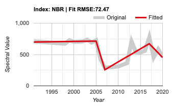

The de-spike check removed features from the time-series, which is desired when the features are noise, but it can begin to remove actual information if made too aggressive.  Setting **de-spike=0.5** removes some of the features of the disturbance, and while the shape is reminiscent of the original settings, it loses some detail. 

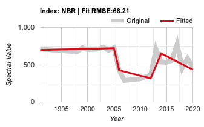

##### Recovery threshold

The recovery threshold parameter exerts strong impact on fitting.  Recall that the parameter sets the limit on speed of post-disturbance return of spectral value.  

Returning to our basic settings, and then setting **recovery_threshold=0.25** forces the recovery to be simplified considerably: 


Although considerable post-disturbance information is smoothed out, the timing of the original disturbance is retained, and this might be sufficient in areas with considerable noise in the source signal. 

Turning the threshold off by setting it to **recovery_threshold=1.0** , however, allows detail to emerge in the post-disturbance trajectory.  In some cases, these may be realistic details, but in others it may result in overfitting of noise.  For the trajectory shown here, it is unclear whether the jump in the spectral NBR value 2012 is in fact real, or an artifact.  

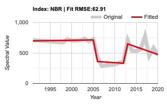

##### P-value threshold

Increasing the p-value threshold allows fits to be captured that retain more residual noise after fitting. 

In the case of our test pixel, setting the **p-value threshold=0.15**  appears to lead to lack of fit of the depth of the disturbance, as well as over-fitting at the end of the time period. 


##### Best-model proportion

When set to a value less than 1.0, this parameter allows more complicated fits to be chosen even if they do not have the best p-value.  Our default was 0.75, and setting **best-model proportion=1.0** does not change the fit of this particular pixel relative to our starting point: 


In practice, this parameter rarely has large impacts.  

However, it can work with other parameters to cause slight change in fitting. For example, setting the p-value threshold to 0.15 and the best-model proportion to 1.0 results in this slightly-different fit: 


### 3.6 Disturbance mapping

In the temporal-segmentation approach, forest disturbance mapping is essentially just a pixel-level query of the segmented trajectory. Thus, once you have identified a set of image date windows and fitting parameters, much of the hard work is done. 

However, there is still one set of parameters to consider: those that identify and map disturbance from the segmented trajectories. 

Let's dig into how forest disturbance can be mapped.  

Consider a segmented trajectory of the NBR index that is relatively stable through the year 2006, then drops precipitously to a low value in 2007 because the forest has been cleared (disturbance), and eventually returns to a moderate value some years later (see figure below).  

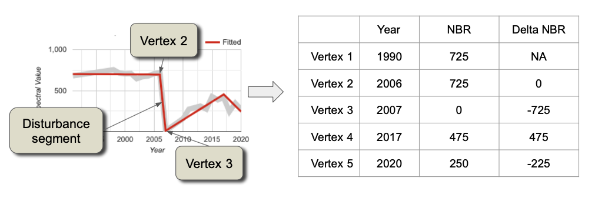

The vertex years on the x-axis and NBR values on the y-axis are stored in the image array that is returned by the LT algorithm. The fitted trajectory (red line) is represented by vertices corresponding to the endpoints of the straightline segments, and the change in spectral index can be calculated for each segment (here shown in the "Delta NBR" column).   

A simple query on the change in spectral index can identify disturbance segments based on direction of change. Direction of disturbance (increase or decrease) is defined for all candidate spectral indices in LandTrendr.  Selecting the largest change identifies the greatest magnitude of disturbance.  Once the appropriate disturbance segment is found, the  year, magnitude, duration, and pre-disturbance spectral value can all be painted at the pixel level to create various maps of disturbance.

Of course, not all disturbance-like changes in spectral value are true disturbance.  As you may have already discovered as you query individual pixels, disturbance-like segments can also occur if the algorithm gets confused by a small change spectral index.   Thus, it is often desireable to remove from consideration those disturbance segments whose change is smaller than some threshold value of magnitude. 

Also, a user may only be interested in disturbances that are abrupt, to allow focusing on forest clearing activity. 

Finally, there are likely some individual pixels that are still subject to noise in the source data and appear to be disturbance in the fitted data.  If we enforce rules stating that disturbance patches must contain a minimum number of adjacent pixels, we can remove these small errors. 

These are items that can be set in the "Change Filter" menu: 

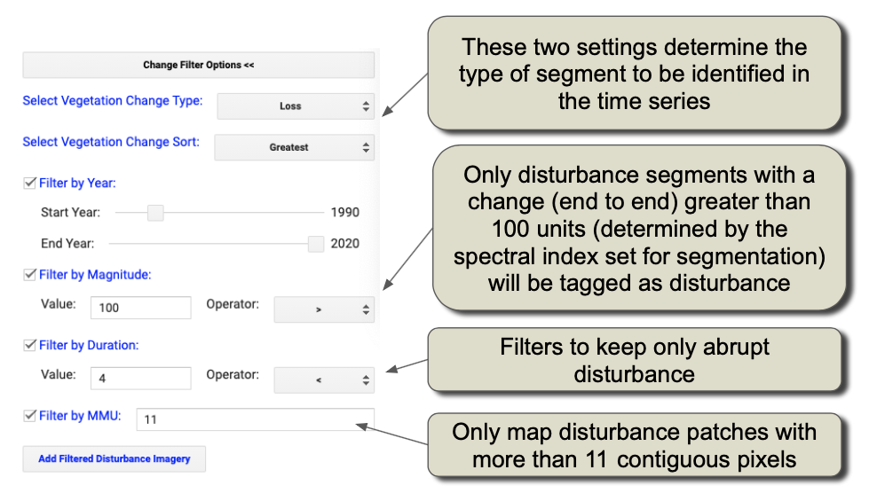

Assuming you still have the ColombiaRectangle set as the first asset in the Asset Manager tool,  when you click on "Add Filtered Disturbance Imagery", the algorithm will run LT on each pixel, use your fitting imagery and parameter guides, and then add these to the map.  As with the RGB imagery, it will take a bit to calculate and load (This is why we limited ourselves to a relatively small region for training!). 

A basic video showing this set up is here:  https://youtu.be/f8xPDzEknQg

The disturbance mapper adds three layers to the map:  Year of Detection, Magnitude, and Duration.  Below is an overview of the Year and Magnitude layers for our focal area:


Zooming in close enough to see actual patterns of disturbance, the results here are promising: 

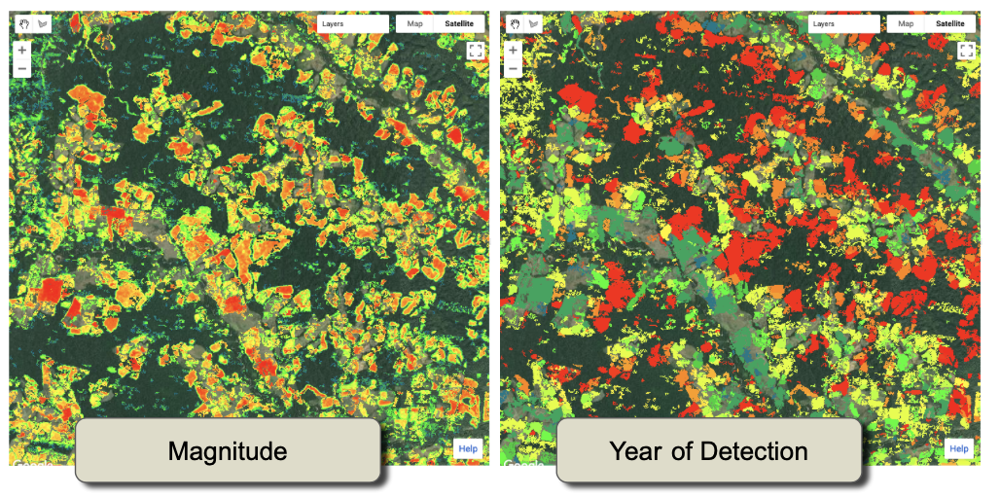

Referencing both the year and the magnitude of disturbance, one can identify suspect areas of low magnitude with spatial patterns that may not be realistic, and use the pixel-level tool to query them to see whether the threshold values could be improved. 

For example, examining the pixel-level trajectories of some of these low-magnitude disturbances suggests they are indeed caused by noise in the source signal: 


The threshold of change can be made more stringent to avoide these false positive mappings.  However, if the threshold is too conservative, actual change will be missed (false negatives).  The process of mapping, adjusting parameters, and evaluating patterns can be iterative until such visual inspections suggest the map balances both false positives and false negatives. 

However, the final step of evaluation occurs when independent data are used to assess the accuracy of the final map.  This is covered a later module. 

## 4 Tutorial: In-depth LandTrendr implementation using Javascript

### 4.1 Overview
While many users may find their needs met through use of the GUI, intermediate or advanced users may want to implement LT directly through scripts.  This section introduces the core functionality of LT as handled by scripts.  

### 4.2  The Greatest Disturbance Script

In this section, we  profile the master script that creates disturbance maps. However, as with the GUI in Section 3 of this module, the Greatest Disturbance script we share in this demonstration utilizes a LandTrendr Javascript library to do much of the behind-the-scenes work.  Within the Javascript library are functions that are imported and used within other scripts.  Although the libraries include more functions than those used here, many components can be considered core functionality that an intermediate or advanced user may want to take advantage of or even adapt to their own purposes. These are detailed in Section 5.  

#### 4.2.1. Load script and note settings

The Greatest Disturbance mapper script can be found at

 `users/openmrv/MRV/ChangeDetection/LandTrendr Greatest Disturbance Mapping`

The first section of the script allows you to manually enter the parameters that you selected when you were using the GUI LandTrendr parameter menu: 

```javascript
// define collection parameters
var startYear = 1990;
var endYear = 2020;
var startDay = '01-01';
var endDay = '04-30';
var index = 'NBR';
var maskThese = ['cloud', 'shadow', 'snow', 'water'];

// define landtrendr parameters
var runParams = { 
  maxSegments:            8,
  spikeThreshold:         0.9,
  vertexCountOvershoot:   3,
  preventOneYearRecovery: true,
  recoveryThreshold:      0.75,
  pvalThreshold:          0.05,
  bestModelProportion:    0.75,
  minObservationsNeeded:  6
};

```

These are identical to those used in the last section of part 3 above. 

Additionally, we set the disturbance change parameters: 

```javascript
var changeParams = {
  delta:  'loss',
  sort:   'greatest',
  year:   {checked:true, start:1990, end:2020},
  mag:    {checked:true, value:100,  operator:'>'},
  dur:    {checked:true, value:4,    operator:'<'},
  preval: {checked:true, value:300,  operator:'>'},
  mmu:    {checked:true, value:11},
  
};
```

The only additional parameter here is called "preval", which is the spectral index value that a pixel must exceed in the pre-disturbance state to count as disturbance.  Setting this parameter reduces false-positives mapped in regions that are already non-vegetated. 

An important step in this script and the GUI script is the loading of the LandTrendr libraries.  It is achieved through this statement: 

```javascript
var ltgee = require('users/openmrv/MRV:ChangeDetection/LandTrendr_V2.4WB.js'); 
```

The core call to the LandTrendr algorithm is achieved here: 

```javascript
var lt = ltgee.runLT(startYear, endYear, startDay, endDay, aoi, index, [], runParams, maskThese);
```

Note that the `ltgee` library is the one just imported.  Advanced users can scrutinize that library to track the steps in the call to the LandTrendr algorithm (See Section 5 below). 

The LT-GEE algorithm returns an object called an image, but which is not an image in the sense we typically consider:  It cannot be mapped easily.  Rather, it is of the form described above in Section 1.3.1 above.  To map disturbance, we need to repackage that output.  Thus, a second function takes care of that process: 

```javascript
var changeImg = ltgee.getChangeMap(lt, changeParams);
```

The output changeImg has the following layers accessible by their Band Name:

| Band Name | Description                                                  |
| --------- | ------------------------------------------------------------ |
| yod       | First year *after* the year of the vertex at the beginning of the segment* |
| mag       | The change in spectral value from beginning to end           |
| dur       | The length (in years) of the segment                         |
| preval    | Index value of vertex at the beginning of the segment        |
| rate      | The magnitude divided by duration                            |
| dsnr      | Magnitude scaled by the RMSE of overall fit.                 |

The magnitude and year of detection of the changeImg can be visualized in the viewer with: 

```javascript
Map.addLayer(changeImg.select(['mag']), magVizParms, 'Magnitude of Change');
Map.addLayer(changeImg.select(['yod']), yodVizParms, 'Year of Detection');
```

Finally, the image is exported to either a user's Google Drive account, or to another GEE Asset. The export is achieved with this code: 

```javascript
Export.image.toDrive({
  image: exportImg, 
  description: 'colombia_distmap_rectangle', 
  folder: 'openMRV', 
  fileNamePrefix: 'colombia_distmap_rectangle', 
  region: aoi, 
  scale: 30, 
  crs: 'EPSG:4326', //NOTE:  the CRS information should be changed to match the best projection for your study area
  maxPixels: 1e13
});
```

You will likely want to change the names of folder, fileNamePrefix, and description.  Moreover, you may also want to change the CRS to a projected coordinate system. 

#### 4.2.2 Run the script

Clicking the "Run" button engages the script, but because of the export step at the end of the script, the process is scheduled as a Task that the user must start.  Click on the "Tasks" tab on the right of the GEE interface, and click "Run". 

For the small rectangle provided in the examples thus far, the disturbance map generation takes about 10 minutes.  For a large area, such as the country of Colombia, it can take 10s of hours.   

#### 4.2.3 Review disturbance maps

Once the disturbance map has been exported, you can download it to a local machine and review it.  Oftentimes it is easier to quickly review different layers on a local machine than on GEE because GEE will re-render all of the layers when you move around or scale the image.   Here, we illustrate how reviewing the maps in a local install of QGIS can provide insight into the disturbance mapping that can lead to improvements in choice of mapping parameters. 

##### Download and open in QGIS

In the folder you specified in the `Export` statement in Section 4.2.1, you should find the file name you indicated.  If the folder did not already exist, it will be created. In the example above, the file "colombia_distmap_rectangle.tif" was found in the Drive folder "openMRV". 


Start QGIS (or any similar GIS-like software that can view GeoTIFF format images) and load the file.   

We recommend viewing the file one layer at a time.  Below is an example of viewing the first layer -- the "Year of detection", or "yod".  We used a color ramp to show disturbance from 1999 to 2020: 


##### Examine year and magnitude of disturbance 

Because we can zoom,  pan and compare layers easily in QGIS without the wait of GEE rendering, it is possible to examine patterns and potentially improve our mapping.  

Loading the disturbance map again as a separate layer, we can use the "Symbology" option in QGIS to select the magnitude of disturbance. Navigating through the image, note the continued presence of striping near the bottom center of the study area.  Zooming in to that area and toggle between Year and Magnitude, one sees that much of the disturbance that appears to be noise is in fact low-magnitude (see figure below).  

> Note that the magnitude is expressed in the units of the index used for the temporal segmentation.  We used the scaled NBR index, which ranges from -1000 to +1000.  


Based on this simple evaluation of the year of detection, the threshold for mapping change could be altered to be 200 instead of 100, as was used in the `changeParams.mag` parameter of the original export. 

## 5 Tutorial: The LandTrendr Javascript Library 

Both the LandTrendr graphical user interface (Section 3) and the Javascript script (Section 4) rely on functions in the LandTrendr Javascript library to carry out all important steps in the change detection process.  While detailed knowledge of the functions is not needed to run either tool, we recommend that most users develop a basic understanding of the assumptions encapsulated in these functions, as it aids in understanding where mapping may be going wrong.  Moreover, advanced users will want to access these functions to adjust or tailor them.  Thus, the following sections detail the core pieces of the LandTrendr libraries on GEE. 

### 5.1 Importing the LT Javascript library

The LT Javascript library improves regularly, but for consistency we have provided a copy of the current working version to World Bank users.  As noted above, importing the library is done with this code:

```javascript
var ltgee = require('users/openmrv/MRV:ChangeDetection/LandTrendr_V2.4WB.js'); 
```

Thereafter, all functions in that library are referenced with the name of the library followed by the function name, with a "period" as a separator (for example, calling the "runLT" function with <arguments> would be handled:`var lt=ltgee.runLT(<arguments>)`). 

Interested users may check the development versions of the library that is housed in the eMapR lab GEE site: `/users/emaprlab/public:Modules/LandTrendr.js`

### 5.2 LandTrendr temporal segmentation 

At the core of all LandTrendr (LT) runs is temporal segmentation, in which each pixel's temporal trajectory is broken into straightline segment separated by vertices.  This function is a part of the GEE algorithm library: `ee.Algorithms.TemporalSegmentation.LandTrendr`.  

Although the call to that algorithm is straightforward, one key step typically involves a substantial amount of effort:  creating the image collection on which the algorithm is applied.  It is typical to wrap the core temporal segmentation algorithm inside a function that constructs the image collection based on characteristics of interest:   the sensors involved, the windows of time used, etc.  

In the implementation provided here, the wrapper function is called "**runLT**".  It is called as follows: 

```javascript
var lt = ltgee.runLT(startYear, endYear, startDay, endDay, aoi, index, [], runParams, maskThese);
```

#### 5.2.1 Arguments passed to runLT

A brief treatment of each argument follows. 

##### **Temporal windows**

`startYear` and `endYear` are numeric variables that define the period for which an image collection will be constructed.  Simply setting these years does not guarantee that imagery from all of the years is available; indeed, in many parts of the world, there are gaps in the Landsat archive.  If, for example, your region does not have imagery before 1999, setting the start year to 1984 will not cause the algorithm to crash, but it will start its time series in 1999.  

`startDay` and `endDay` are string date variables that define the periods within each year from which to build image composites. These are set using the GEE format with two digits for month and day separated by a hyphen, e.g. `"04-01"`corresponds to April 1st.  

Image compositing is conducted using the medoid strategy (discussed in more detail below) and results in one image per year from the period indicated by these dates. 

##### **Area of interest**

The `aoi` argument is a variable corresponding to an `ee.FeatureCollection` that defines the geographic region of interest for processing.  

Setting such a feature collection variable from a GEE asset is accomplished with a statement such as the following: 

```javascript
var aoi = ee.FeatureCollection('users/openmrv/MRV/ColombiaRectangle');
```

##### **Spectral arguments**

The `index` variable is a string that corresponds to one of the spectral indices defined in the `calcIndex` routine within the LandTrendr Javascript library.  

Currently, the following indices are included: 

| Index name             | Description                                                  |
| ---------------------- | ------------------------------------------------------------ |
| B1, B2, B3, B4, B5, B7 | Landsat Thematic Mapper reflectance values with band numbers corresponding to the band labels of the Landsat 5 and 7 instruments.  Thus, B4 is the Near-infrared band and B5 is the short-wave infrared band centered at approximately 1.65 micrometers.  Images from Landsat 8 (OLI) are renamed to be consistent with the Landsat 5 and 7 naming conventions. |
| NBR                    | Normalized Burn Ratio, defined as (NIR-SWIR2)/(NIR+SWIR2), where NIR is the near-infrared and SWIR2 the second shortwave infrared band (centered near 2.2 micrometers) of Landsats 5, 7 and 8. |
| NDMI                   | Normalized Difference Moisture Index, defined as (NIR-SWIR1)/(NIR+SWIR1) |
| NDVI                   | Normalized Difference Vegetation Index, defined as (NIR-Red)/(NIR+Red), where "Red" is the red reflectance band of Landsats 5 and 7. |
| NDSI                   | Normalized Difference Snow Index, defined as (Green-SWIR1)/(Green+SWIR1) |
| TCB, TCG, TCW          | Tasseled-cap brightness, greenness, and wetness calculated using the reflectance coefficients of Landsat 5 as originally documented by Crist (1985).  See the `tcTransform` variable within the LandTrendr Javascript library. |
| TCA                    | Tasseled-cap "angle", defined as the angle between TCB and TCG.  Originally defined by Powell et al. (2010);  a higher value indicates more vegetation. |

Following the `index` variable is a list variable that includes a list of spectral indices for which the "fit to vertex" strategy (FTV) would be employed.  The FTV approach is not needed for basic change detection, but can be used in land cover mapping.  More details can be found in Kennedy et al. (2018).  To leave the variable blank, use the empty list as follows: `[]`.

##### **Fitting parameters**

The LT algorithm is controlled by fitting parameters described in Section 3.5.1 above.  The variable `runParams` is a dictionary object that is set in the calling script.  An example in the LandTrendr Greatest Disturbance script is as follows: 

```javascript
var runParams = { 
  maxSegments:            8,
  spikeThreshold:         0.9,
  vertexCountOvershoot:   3,
  preventOneYearRecovery: false,
  recoveryThreshold:      0.75,
  pvalThreshold:          0.05,
  bestModelProportion:    0.75,
  minObservationsNeeded:  6
};
```

##### **Masking**

When building the image collections that are passed to the algorithm, different types of conditions can be flagged and masked out.  The `maskThese` variable is a list with strings to indicate the types of condition to be flagged.  

In the LandTrendr Javascript library, these are handled in the `getSRcollection` function.  The following are valid options. 

| Mask code                          | Description                                                  |
| ---------------------------------- | ------------------------------------------------------------ |
| 'water', 'shadow', 'snow', 'cloud' | From the QA band of Landsat imagery.                         |
| 'waterplus'                        | Uses the "recurrence" layer from the  "JRC/GSW1_1/GlobalSurfaceWater" asset in GEE;  recurrence greater than 99% will be masked. See "https://storage.googleapis.com/global-surface-water/downloads_ancillary/DataUsersGuidev2.pdf" for more information on this resource. |
| 'nonforest'                        | Uses the Copernicus Global Land Service (CGLS) 100m resolution product to mask out areas of non-forest.  If you use this mask, you will limit LandTrendr to areas defined as forest by this product. |

##### **Implicit settings**

By handling the construction of image collections, the `runLT` function simplifies calling the LT function.  

However, with simplification comes assumption.  The following assumptions are implicit in the call to the function: 

- Landsat sensors 5-8 will be used
- Landsat 8 reflectance will be transformed to reflectance domains of Landsats 5 and 7
- Cloud and shadow masking will be handled by referencing the QA layer of Landsat imagery, which itself is based on the CFMask algorithm
- Image compositing will be handled by a medoid compositing strategy (described below)

Users may wish to change these assumptions.  

Minor changes can be achieved by making a local copy of the LT Javascript library and adapting the code to enact changes.  For example, users may wish to avoid using Landsat 7 imagery (though this is not typically recommended), and could simply comment out one line of code that builds the original Landsat 7 collection (see Section 5.3 below).  Or, a user may want to add spectral indices on which temporal segmentation can be built:  again, this could be achieved with a relatively minor update adding code for the index of interest.  

> Remember if you create your own local LandTrendr Javascript library that you will need to call that local library in any subsequent scripts! 

Major changes may be achieved by swapping in entire modules to create image collections.  For example, it is conceivable that a user may want to apply the LandTrendr algorithm to Sentinel 2 radar imagery.  In this case, nearly every aspect of the image collection construction would need to be changed.  In this case, a user may want to simply use the library as a structural guide for creation of a different library.  

#### 5.2.2 Constructing image collections

The `runLT` function takes the parameters passed by the user to construct image collections that are passed to the LT algorithm. 

Two sequential steps are needed. First, the `buildSRcollection` function starts a cascade of functions to build a composited, masked,  multivariate, annual surface-reflectance collection. Second the `buildLTcollection` translates that collection into the form needed to call the  LT segmentation algorithm.  Each function calls other subfunctions.  A detailed treatment of every aspect of these libraries is beyond the scope of this training material, but overviews of the core logic provides users insight into the key decisions being handled by the algorithms. 

##### Functions to build composite image collection

The `buildSRcollection`  parses user input and then loops through all years in the collection, calling the `buildMosaic` function each year to create an image collection with a single image per year. 

The `buildMosaic` function's key purpose is to call the `getCombinedSRcollection`to construct a multi-sensor collection of Landsat surface reflectance images for a single year, and then use the `medoidMosaic` function to create a singe image composite for that year.  

To create the collection of surface reflectance images, the `getCombinedSRcollection`  function calls the `getSRcollection` function separately for the Landsat 5 Thematic Mapper, the Landsat 7 Enhanced Thematic Mapper+, and the Landsat 8 Operational Land Imager (OLI), and then merges the collections. 

Thus, to understand where image values come from, **one must understand the core function**:  `getSRcollection`.  This function of approximately 80 lines of GEE code filters the entire Landsat collection to the appropriate time period, applies correction coefficients to Landsat 8 imagery to harmonize reflectance with prior sensors, and applies masks set by the user (noted above). 

Some key decisions encapsulated in this code:

- Date windows can span January 1, with the year of record for the composite being registered to the year of the endpoint of the window.  Thus, if the date window is given as '11-01' to '03-31' and the year range from 1990 to 2020, the year of the first composite  image would be 1990.  Importantly, this means that imagery from November and December of 1989 would be used to create the composite.  
- Harmonization uses the coefficients published in Table 2 of Roy et al. (2016) to convert Landsat 8 reflectance bands to the same spectral domain as Landsat 7.  Note, however, that Landsat 8 band windows are not identical to Landsat 5 and 7's -- particularly in the near-infrared window -- and that some residual difference of measurement is inevitable.  Moreover, some users may prefer to conduct the harmonization in the opposite direction -- bringing Landsat 5 and 7 into the domain of Landsat 8.  Such a change could occur at this stage in the code. 
- Masking is a critical decision in the image processing flow.  Here, we have chosen to use the QA band of the Landsat imagery for most masking. However, for certain situations the JRC water recurrence product or the Copernicus global landcover product may be useful, and these serve as a template for how an advanced user could add an addition type of masking code. 
- Compositing is achieved through the medoid approach, which is not the same as a median composite.  The medoid approach looks at all unmasked values for each pixel, calculates the median value mathematically, but then identifies the actual pixel observation (i.e the specific image from the collection that year) that is closest to the median in *n-*dimensional spectral space.   Thus, the method tends toward the representative spectral value, but uses the observations from an actual image (rather a contrived value calculated as the median of each band).  Other compositing approaches exist, and advanced users can insert or swap their favorite method for the medoid composite at this point in the code. 

##### Functions to convert image collections to LT-ready inputs

Once the image collection has been built, the `runLT`  function must then convert it into a univariate time series for segmentation. For most uses, this is a simple matter of calculating the desired spectral index, and is handled in the `buildLTcollection` function.  For advanced uses that require temporal stabilization using the fit-to-vertex (FTV) approach, those bands can be passed to the same function as well. 

#### 5.2.3 Calling the core LT-GEE algorithm

The core LandTrendr temporal segmentation algorithm is accessed in GEE using this format:  

```javascript
ee.Algorithms.TemporalSegmentation.LandTrendr(runParams);
```

`runParams`  is a dictionary object with the LT fitting parameters, as well as the time series of image values in an entry set with this command: 

`runParams.timeSeries = annualLTcollection;`

where the `annualLTcollection` is the collection of univariate values calculated as described in Section 5.2.2.  

As noted in Section 1.3 above, the output from the call to the core LandTrendr algorithm in GEE is an image array.  The next section describes the `ltgee` function that can be used to convert that image array into a disturbance (or recovery) map. 

### 5.3 Disturbance mapping

As described in Section 3.5 above, disturbance mapping is achieved through queries of the vertices that result from the LT fitting.  In the GUI or the script-based mapping, the mapping is handled by a call to the `ltgee.getChangeMap` function: 

```javascript
var changeImg = ltgee.getChangeMap(lt, changeParams);
```

The variable `lt` is the array image that emerges from the `ltgee.runLT` call, and the `changeParams` object is a dictionary noted in Section 4.2.1 above and repeated here for convenience: 

```javascript
var changeParams = {
  delta:  'loss',
  sort:   'greatest',
  year:   {checked:true, start:1990, end:2020},
  mag:    {checked:true, value:100,  operator:'>'},
  dur:    {checked:true, value:4,    operator:'<'},
  preval: {checked:true, value:300,  operator:'>'},
  mmu:    {checked:true, value:11},
  
};
```

Below, we unpack how the `getChangeMap` function translates an LT-object into disturbance maps. The overall sequence is: 

- Extract segment information from vertex information
- Identify the target segment according to desired characteristics
- Build an image with layers corresponding to year of change, magnitude of change, etc. 
- Filter by the target year, magnitude, duration, and pre-change values
- Filter by minimum map unit of adjacent pixels

#### 5.3.1 Extracting segment information

The first step in the `getChangeMap` function is translating vertex information into segment information. This is handled in the `getSegmentData`  function:

```javascript
var segInfo = getSegmentData(lt, changeParams.index, changeParams.delta);
  changeParams.segInfo = segInfo;

```

> Note that the `changeParams.index` is typically not required to be manually entered by the user, since it can be set programmatically to match with the index used in the earlier call to LT. 

To understand how vertex information is translated to segment information, consider that each segment is bounded by two vertices. The character of the segment itself is described by starting vertex year and spectral value (the "pre-change" condition), the ending vertex year and spectral value (the "post-change" condition), as well as by the difference in time between the bounding vertices (the "duration") and the difference in the spectral value of the bounding vertices (the "magnitude").  Thus, to build information on the segments, we must consider characteristics of both of the individual vertices on either end of the segment, as well as the relationships between them.  This achieved through a series of array manipulations of the vertex information returned by the LT algorithm in the LT object. 

As noted in Section 1.3.1, the LT object returned by the LT function is at least a two-band image per pixel. The first band is called the "LandTrendr" band, and is itself an array of size 4 x *n*, where *n* is the number of years in the time series. The second band is a scalar representing the total root-mean-square-error (RMSE) of the fitting. An optional third band arises if the user has passed data for the FTV process;  we do not treat this third band here.  

The translation of vertex information into segment operation focuses on the 4 x *n* LandTrendr band of the LT Object. The full code is replicated here, with comments describing each piece.  Briefly, the vertices are extracted from the vertex row, and then converted into two lists of vertices (`leftList` and `rightList`), one shifted relative to the other. These are then manipulated to derive our desired outputs.  

```javascript
var ltlt = lt.select('LandTrendr');            // select the LandTrendr band
  var rmse = lt.select('rmse');                  // select the rmse band
  
	// slice out the 'Is Vertex' row - yes(1)/no(0)
	var vertexMask = ltlt.arraySlice(0, 3, 4);     
		
	// use the 'Is Vertex' row as a mask for all rows
  var vertices = ltlt.arrayMask(vertexMask);     
		
	// slice out the vertices as the start of segments
  var leftList = vertices.arraySlice(1, 0, -1);    
	
	// slice out the vertices as the end of segments
  var rightList = vertices.arraySlice(1, 1, null);

  // get year dimension of LT data from the segment start vertices
	var startYear = leftList.arraySlice(0, 0, 1);    

  // get spectral index dimension of LT data from the segment start vertices
	var startVal = leftList.arraySlice(0, 2, 3);     

  // get year dimension of LT data from the segment end vertices 
	var endYear = rightList.arraySlice(0, 0, 1);     

  // get spectral index dimension of LT data from the segment end vertices
	var endVal = rightList.arraySlice(0, 2, 3);      

  // subtract the segment start year from the segment end year to calculate the duration of segments 
	var dur = endYear.subtract(startYear);       

	// substract the segment start index value from the segment end index value to calculate the delta of segments
  var mag = endVal.subtract(startVal);         

	// calculate the rate of spectral change  
  var rate = mag.divide(dur);   

	// make mag relative to fit rmse
  var dsnr = mag.divide(rmse);              
```

The advanced user is referred to a detailed treatment of how to interpret and manipulate vertex data given in [Section 5 of the LT-GEE GitHub guide.](https://emapr.github.io/LT-GEE/lt-gee-outputs.html)  

##### Filtering by loss or gain

Once each segment's characteristics have been calculated, the `getSegmentData` routine then filters those segments based on whether the user requests "loss" or "gain" in vegetation (via the `changeParams.delta` string variable). The direction of change associated with these depends on the spectral index.  For indices such as the NDVI, NBR, or Tasseled-cap greenness, a reduction in the index value is associated with a loss of vegetation.  For indices such as the SWIR1 band or the Tasseled-cap Brightness index, an *increase* in the index value associated with loss of vegetation.  

The direction of change is defined in the `indexFlipper` function. Because the LandTrendr algorithm was originally defined using the SWIR1 band, the indexFlipper assigns positive 1 to SWIR1 and similar bands, and assigns negative one (-1) to indices such as NDVI.  The relevant parts of the function are replicated here for reference: 

```javascript
var indexFlipper = function(index){
  var indexObj = {'NBR':-1,'NDVI':-1,'NDSI':-1,'NDMI':-1,  
                  'TCB':1,'TCG':-1,'TCW':-1,'TCA':-1,
                  'B1':1,'B2':1,'B3':1,'B4':-1,'B5':1,'B7':1};
  return indexObj[index];
};
```

Note that for some bands, the direction of vegetation change is not readily reduced to a single direction of change:  for the NDSI, experience suggests that this index behaves ambiguously for vegetation change.  

##### Outputs

The result of the call to `getSegmentData` is an `ee.Array` with the following rows: 

| Row  | Name      | Description                                                  |
| ---- | --------- | ------------------------------------------------------------ |
| 0    | startYear | First year *after* the year of the vertex at the beginning of the segment* |
| 1    | endYear   | Year of vertex at the end of the segment                     |
| 2    | startVal  | Index value of vertex at the beginning of the segment        |
| 3    | endVal    | Index value of vertex at the end of the segment              |
| 4    | mag       | The change in spectral value from beginning to end           |
| 5    | dur       | The length (in years) of the segment                         |
| 6    | rate      | The magnitude divided by duration                            |
| 7    | dsnr      | Magnitude scaled by the RMSE of overall fit.                 |

Each row contains as many columns as there are segments that meet the loss or gain criterion.  These pieces of information are then used to identify the target segment for mapping. 

> *NOTE:  The vertex at the beginning of a segment has not yet experienced change. Thus, as a convention, we consider the first year *after* the vertex to be the first time that change is evident for the segment.  For mapping of abrupt disturbances, this means that the year of detection will be appropriately tagged as the year at which the decline a spectral index is noted.  

#### 5.3.2 Identify target segment

As noted in Section 3.5, mapping requires that a single segment be identified. Because there is often more than one segment of either loss or gain, we must  identify which segment to target for mapping. Moreover, we often wish to ignore segments that do not pass specific thresholds, for example of timing, duration, or magnitude of change.  The various characteristics of each segment can be used to determine if it is the most appropriate for mapping.  

Within the `getChangeMap`  function, identification of the target segment is handled in two broad steps. First, the `ee.Array` returned from the call to `getSegmentData` is  sorted according to magnitude, timing, or duration of the segment, and the highest-ranked result identified as the target segment.  Second, this target segment is further filtered according to numeric thresholds. 

##### Sorting

The sorting step can evaluate segments based on several characteristics. A common use case would be to look for the disturbance segment (with "loss") that had the largest magnitude of spectral change, as this may indicate the most severe disturbance experienced by the pixel.  Alternatively, we may be interested in the segment that experienced vegetative growth ("gain") for the longest period.  Or we may be interested in only the most recent disturbance.  Each of these can be expressed as a ranking of either magntidue or timing of the segment, and these are stored in the `changeParams.sort` variable.  Descriptions of the sorting criteria captured in that variable are provided below. 

| Name             | Description                                                  |
| ---------------- | ------------------------------------------------------------ |
| greatest, least  | Targets the segment with the greatest (or least) magnitude of change |
| newest, oldest   | Targets the segment that happened most recently (or longest ago). |
| fastest, slowest | Targest the segment with shortest (longest) duration         |

At the end of sorting, a single image with multiple bands is produced with the following command: 

```javascript
var distImg = ee.Image.cat(distArray.arraySlice(0,0,1).arrayProject([1]).arrayFlatten([['yod']]).toShort(),                           distArray.arraySlice(0,4,5).arrayProject([1]).arrayFlatten([['mag']]).toShort(),
                           distArray.arraySlice(0,5,6).arrayProject([1]).arrayFlatten([['dur']]),
                           distArray.arraySlice(0,2,3).arrayProject([1]).arrayFlatten([['preval']]),
                           distArray.arraySlice(0,6,7).arrayProject([1]).arrayFlatten([['rate']]),
                             distArray.arraySlice(0,7,null).arrayProject([1]).arrayFlatten([['dsnr']]));

```

These bands are derived from a subset of the values in the `ee.Array` .    Descriptions follow those noted in Section 5.3.1 above,  with 'yod' swapped in for 'startYear' and 'preval' for 'startVal'.  As a reminder, the 'yod' variable is not the year of the vertex at the beginning of the segment, but rather that year *plus one*, to reflect the fact that the segment's change direction is only evident after a year has passed from the early vertex. 

##### Filtering and Thresholding

The image after sorting is suitable for mapping if desired, with each band displayed separately.  However, typically we wish to further filter the map based on criteria of the change process.  Once the target segment has been identified and a tentative image produced,  steps within the `getChangeMap` can be used to filter and threshold the map. 

The steps involved include filtering by  `yod`, by `mag` and  by `dur`.  For example, forest harvests could be targeted by choosing only changes that pass a threshold of magnitude of change,  that are of short duration, and that have a pre-disturbance value above a certain value. 

Additionally, the  `mmu`  filter allows for removal of groups of pixels smaller than the value indicated by the `mmu` value (in pixels).   Groups of pixels are those that share the same `yod`.   

##### Outputs

The result of the `getChangeMap` function is the disturbance image with the layers noted in Section 4 above. 

## 6 Additional Examples: Mozambique and Cambodia

When implementing LandTrendr forest change detection in a new area, the same issues described in Section 3 above must be considered.  These include:

- Historical depth of Landsat imagery
- Within-year date ranges used to build image composites
- Appropriateness of a given spectral index for the forest types of interest
- Change-processes of interest

### 6.1 Mozambique

In the initial exploration phase of working in a new domain, we recommend utilizing the LandTrendr GUI described in section 3 above.  

#### 6.1.1 Load a Mozambique study area in the LandTrendr GUI

Let's explore what LandTrendr does in Mozambique. As a reminder, find and open the script named **LT-GEE-Vis-DownLoad-app_WB_v1.0**  from within the openMRV/ChangeDetection library on GEE.

When loaded and run, the script defaults to showing the map of Colombia. You can use the map browser to manually navigate to a different portions of the globe. Or, if you plan to regularly go to a different location, *make a local copy of the script* and change line 1341 of the script from: 

```javascript
map.setCenter(-75, 3, 6);  //set default center of map to Colombia
```

to a different center point.  Note that the format of the arguments passed `map.setCenter` are `(<longitude, latitude, zoom level>)`.   See the GEE documentation to understand Zoom levels. 

For purposes of this document, we have delineated a simple study area in Mozambique within which initial exploration can take place. In the "Asset Overlay" section of the GUI, make the first asset `users/openmrv/MRV/MozambiqueArea`


#### 6.1.2. Determine date windows

As always, we seek seasonal date windows that are broad enough and timed will enough to maximize the change of finding clear pixels in most years, but are narrow enough to avoid too much phenological variability within the date window.  A good place to start is understanding the seasonality of precipitation. 

According to this presentation using satellite data summarized for the World Food Programme (https://docs.wfp.org/api/documents/WFP-0000108186/download/), the rainy season in Mozambique is roughly October to May.  Thus, a reasonable starting point for a date window is May 1 to October 15th.  Also, absent a *priori* knowledge of the depth of the Landsat image archive in any one location, it is reasonable to begin an investigation with a starting year in the 1980s or early 1990s.  For consistency with the other parts of this training, we suggest beginning with 1990.  

To evaluate, change the LandTrendr date window options to begin 05-01 and end 10-15 and the Year range to span 1990 to 2020.  

> You can also set the fitting parameters to those used in Colombia, or others as you prefer.  The examples below were run using:  Max Segments=8, Spike Threshold=0.9, Vertex Count Overshoot=3, Prevent One Year Recovery=true, Recovery Threshold=0.75, p-value Threshold=0.05, Best Model Proportion=0.75, Min Observations Needed=6

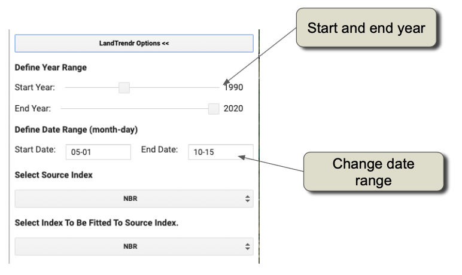

Then, use the RGB Change Viewer to get a quick sense of LandTrendr fitting and anomalies.  If you've clicked the processing box in the "Path to Assets" tab, then go to the **RGB Change Options** tab, select years for the Red, Green, and Blue layers, and click the "Add RGB Imagery".  As a reminder, see Section 3.4 for help on interpreting colors. 

Artifacts from non-masked clouds are apparent as green stripes with no connection to the underlying landscape patterns.  When such a pattern emerges, it is likely that the date window is capturing too much cloudiness, and other windows should be explored.  Recall also that we seek date windows that do not include extreme variability in vegetation phenology.  

Shifting the dates forward in the year slightly results in a fitted RGB stack with spatial patterns of color that more closely track actual landscape features. By front-loading after the rainy season, it is also more likely that the images captured each year represent the leaf-on period as opposed to a leaf-off phase of drought-deciduous trees.


#### 6.1.3 Explore image archive and change processes

With the RGB image as a background, consider the temporal dimensions of change in Mozambique.  We seek to understand spatial patterns of change evident in the RGB image, and check that the image archive is sufficient for the initial set of years of imagery.  The "Pixel Time Series Options" interface is an excellent tool to explore these questions. 

Zooming in on the central zone of the study area shown above, we see a rich variety of change processes occurring in this landscape.  Recall that any location that is not on the black-grey-white scale is an area that appears to have experienced change. Again, consult the color-interpretation guidelines given in Section 3.4 above.  In the RGB image below, we see areas of growth (blue tones) and various types of disturbance (reds, oranges, yellows) and disturbance with possible regrowth (magentas and purples). 


For users interested in looking at the details of the above locations, their information is here: 

| Name                          | Longitude | Latitude   |
| ----------------------------- | --------- | ---------- |
| Growth                        | 35.441772 | -16.980938 |
| Abrupt disturbance and growth | 35.370195 | -17.233946 |
| Abrupt disturbance growth     | 35.360358 | -17.093841 |
| Persistent removal            | 35.460270 | -17.763119 |

The availability of imagery back to 1990 appears robust, although close inspection of some pixel time-series source data (the grey lines) suggests periods of intermittent image non-availability in the early 1990s. However, the initial years of imagery do not appear to be introducing artifacts in either the RGB or the time series. 

Compared to the disturbance domain in our first example Colombia, change processes in this study area of Mozambique are quite diverse.  In addition to the diagnostic **abrupt disturbance and regrowth**, we many areas of **growth**, likely from disturbance that pre-dates the time period of observation.  

Also, we see many examples of **multi-year, slow loss of vegetation**.  The bottom trajectory in the figure above is one example, where it appears that removals began in roughly 2016 and continued at a measured pace through the end of the record. The processes behind these long-duration removal patterns are often more enigmatic than those that cause abrupt change.  Spatial patterns can provide clues, however. In the image above, it appears that the yellow and orange tones appear to be near roads  (linear features of black, which indicates persistent low vegetation) and settlements. This suggests a human cause, as opposed to a strictly natural -- for example drought-related -- cause.  

Let's zoom in to the Chimuara region near the bottom of the inset above. And, in addition to using the RGB viewer for interpretation, we will add the disturbance change, but alter the parameters to look for disturbances that are NOT abrupt -- that have a duration > 2 years!  This is achieve in the GUI by simply changing the duration operator to ">" and the value to "2".  However, before that we need to make sure to point the disturbance mapping function to the right location -- go to the RGB change mapping options and set the Longitude and Latitude to the area of interest, then go to the "Change Filter Options" and adjust the Duration filtering. 


Considering all of these layers, we see that slow degradation is widespread. When the year of detection is early and the duration is long, it suggests a long, persistent loss of vegetation.  In other areas, we see multi-year (but not 20+ year) duration change.  


Interpretation of the processes driving these patterns would best be achieved through consultation with local experts, but it appears to be long-term, human-related pressure on the forest, perhaps related to low-intensity but ongoing wood removal. 

The evidence for human-mediated deforestation appears higher in the region around the settlement of Nicuadala, where removal processes move outward in a nearly concentric ring away from a central zone of settlement. The trajectories of removal early in the time series appear to remain low and quite variable from year to year, suggesting a sustained transition away from a wooded condition. 

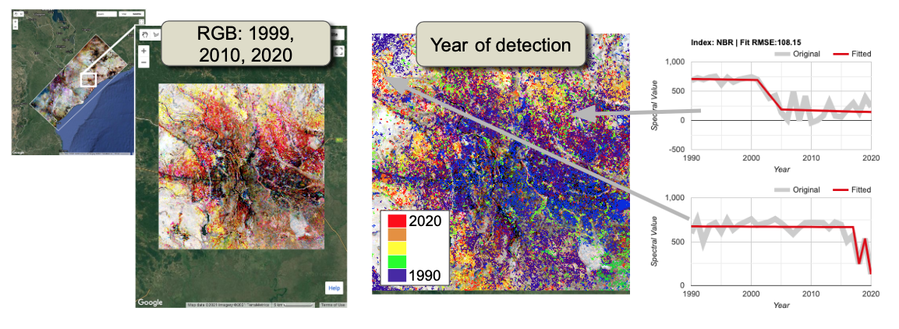

### 6.2 Cambodia

In Section 6.1, we covered the key topics in moving from our initial exploration in Colombia to a new location.  Here, we highlight just the issues that differ during an initial exploration of disturbance mapping in Cambodia.  

#### 6.2.1. Study Area and Image settings

As with Colombia and Mozambique, we have provided a small study area in which to experiment with image and parameter settings. The path to the GEE Asset is: `users/openmrv/MRV/CambodiaArea`

Because of a different rainy season, we used a date window from 01-01 to 04-01.  Image availability to 1990 appears robust. 

A first review of the RGB fitted imagery shows areas of both forest stability (greyscale tones) and substantial removal (yellows, reds, magentas). 


#### 6.2.2 Landscape-change processes

The landscape change processes at work in Cambodia differ again from those in Colombia and Mozambique. 

Focusing first on the southeast region of the study area, we see evidence for a variety of forest management regimes.  Forest concessions to companies outside of Cambodia have led to plantations of trees for fiber or oil.  These are distinctive in both the temporal domain, where the magenta color indicates removal of original forest is followed by quick growth in regular blocks (magenta), and the spatial domain, where the patterns of these temporal signals are regular and bounded linearly.  In the cyan areas, we also see evidence for planting of forest in areas with little forest at the beginning of the observation record.  Finally, we see areas in yellow where forest removal has occurred with little subsequent forest growth;  in many cases these are too near the current day to know whether they are true deforestation or will be reforested. 

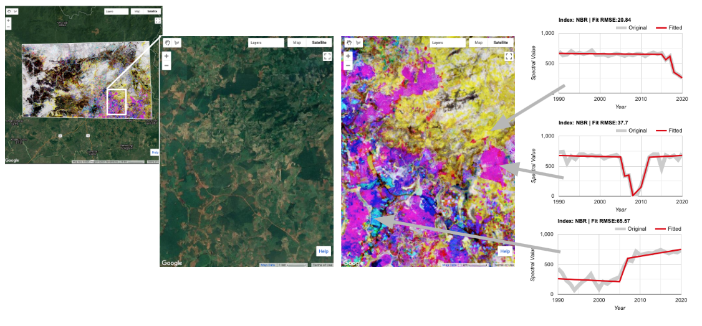

In the more remote area near Kaoh Piek on the Tonle San River, we see areas of smaller-scale forest management. There is evidence for both multiple-harvests and for some deforestation visible within this relatively small area. Again, local experts would provide insight the driving processes, but spatial pattern of harvest and the existence of multiple harvests suggests that the forest management is ongoing and relatively stable across the area. 


Across the border into the Steung Treng province west-northwest of the prior area, we find another area with active, small-scale forest management. There is evidence for extensive but small incursions into forest. 


As with Colombia and Mozambique, the temporal segmentation could be turned into maps of year of disturbance, magnitude of disturbance, and duration of disturbance.  

## 7 Frequently Asked Questions (FAQs)

**How do I pick the fitting parameters? Is there an automated approach?**

The choice of fitting parameters is one of the most common concerns of new users. Our examples throughout this tutorial should provide guidance, but as we note, the specific combination of parameters to use for a given region are likely dependent on idiosyncracies of the image archive, forests, and change processes. 

It is possible to develop a robust selection mechanism by referencing the segmentation to a reference dataset. In the original LandTrendr publication (Kennedy et al 2010), we tested impact of parameter values using a sensitivity analysis referenced to an independently derived training sample collected using TimeSync, which is a tool for interpreters to manually create temporal segmentation (Cohen et al. 2010). 

In practice, however, no single set of fitting parameters and spectral indices may work equally well across all conditions in a country. It may be desirable to run the algorithm with different spectral indices and different fitting parameters.  Cohen et al (2018) describe an approach to run the algorithm many times with different indices, and to use a reference dataset to train a Random Forests model to combine the outputs into an ensemble disturbance map. They find that the ensemble is more robust than any single index in detecting change.  

There is at present no automated way to pick parameters. However, we continue to work towards development of such tools, and the interested user is encouraged to keep track of developments on the LT-GEE GitHub site. 

**I'm noticing more problems with clouds and image noise near the beginning (or end) of the time series. Why is this?** 

The power of any time-series method is its ability to harness multiple observations to examine actual from false pattern. In the middle of the time series, residual noise causes blips in the source signal, but because they return to "normal" after the blip, the algorithm understands them as noise. But for blips that happen either at the beginning or the end of the time series, there is no data on beyond the blip to help determine if the noise is real or not. Thus, the algorithm can more often create false-positives at the beginning and the end of the time series.  

**There are some places with persistent cloudiness and no data. What can I do?**

The first option is to change the date window considered for building image collections. It is possible that you have chosen a date window that is either 1) focused more on the cloud season or 2) too narrow to find cloud-free pixels.  

It is also possible that the built-in cloud masking algorithm has been too aggressive, masking out areas that are not clouds. This can sometimes occur over consistently bright targets such as snow and granite rock, but neither is likely to be too common in the areas of interest for this tutorial. However, if a user believes that the cloud masking algorithm is being too aggressive, they can take advantage of the modular nature of the code to swap in a different image collection building step:  build your own equivalent to `getSRcollection` function in the LandTrendr Javascript library.  

Finally, it is possible that some areas will have cloudiness so persistent that a yearly time-step is not enough to find a reasonable image. Although LandTrendr works best with a yearly time-step, it is possible to construct image collections that use biennial imagery (or even more years) to construct composites for the algorithm. At present, our standard library does not include this functionality, but stay tuned on the LT-GEE GitHub site (https://github.com/eMapR/LT-GEE) for updates.  Advanced users can build their own by adapting `buildSRcollection`, `buildMosaic`, `getCombinedSRcollection`, and `getSRcollection` modules. 

**Can I use a different sensor from Landsat?**

Perhaps.  In principle, the LandTrendr algorithm does not care what the signal is that you give it. However, the algorithms requires that the signal be consistent and stable when no-change is occurring; thus, the preprocessing steps must result in a smooth signal.  Additionally, it requires that there be enough observations to assign segments -- roughly 3-4 observations per desired maximum segment. For many sensors, such as Sentinel 1 and 2, there is not a long-enough record to conduct yearly change analysis. It is possible to consider giving the algorithm data at sub-yearly scale, but you would need to trick the algorithm into thinking the intervals are a year. This can lead to challenges in intepreting outputs, but is not insurmountable. 

Mixing sensor types can be very challenging. It requires pre-processing that places all measurements on exactly the same scale. Even the transition from Landsat 8 to Landsats 7 and 5 is tricky because the band passes of the sensors are slightly different.  Thus, while it is not theoretically impossible to bring together Sentinel-2 and Landsat imagery, in practice the pre-processing steps are likely quite challenging.  

## 8 References

Crist, E.P., 1985. A TM tasseled cap equivalent transformation for reflectance factor data. *Remote Sensing of Environment*, *17*(3), pp.301-306. https://doi.org/10.1016/0034-4257(85)90102-6

Kennedy, R.E., Yang, Z. and Cohen, W.B., 2010. Detecting trends in forest disturbance and recovery using yearly Landsat time series: 1. LandTrendr—Temporal segmentation algorithms. *Remote Sensing of Environment*, *114*(12), pp.2897-2910. https://doi.org/10.1016/j.rse.2010.07.008

Cohen, W.B., Yang, Z. and Kennedy, R., 2010. Detecting trends in forest disturbance and recovery using yearly Landsat time series: 2. TimeSync—Tools for calibration and validation. *Remote Sensing of Environment*, *114*(12), pp.2911-2924. https://doi.org/10.1016/j.rse.2010.07.010

Cohen, W.B., Yang, Z., Healey, S.P., Kennedy, R.E. and Gorelick, N., 2018. A LandTrendr multispectral ensemble for forest disturbance detection. *Remote Sensing of environment*, *205*, pp.131-140. https://doi.org/10.1016/j.rse.2017.11.015

Kennedy, R.E., Ohmann, J., Gregory, M., Roberts, H., Yang, Z., Bell, D.M., Kane, V., Hughes, M.J., Cohen, W.B., Powell, S. and Neeti, N., 2018. An empirical, integrated forest biomass monitoring system. *Environmental Research Letters*, *13*(2), p.025004. https://doi.org/10.1088/1748-9326/aa9d9e

Powell, S.L., Cohen, W.B., Healey, S.P., Kennedy, R.E., Moisen, G.G., Pierce, K.B. and Ohmann, J.L., 2010. Quantification of live aboveground forest biomass dynamics with Landsat time-series and field inventory data: A comparison of empirical modeling approaches. *Remote Sensing of Environment*, *114*(5), pp.1053-1068. https://doi.org/10.1016/j.rse.2009.12.018

Roy, D.P., Kovalskyy, V., Zhang, H.K., Vermote, E.F., Yan, L., Kumar, S.S. and Egorov, A., 2016. Characterization of Landsat-7 to Landsat-8 reflective wavelength and normalized difference vegetation index continuity. *Remote Sensing of Environment*, *185*, pp.57-70. http://dx.doi.org/10.1016/j.rse.2015.12.024

-----

  

This work is licensed under a [Creative Commons Attribution 3.0 IGO](https://creativecommons.org/licenses/by/3.0/igo/).

Copyright 2021, World Bank 

This work was developed by Robert E Kennedy under World Bank contract with GRH Consulting, LLC for the development of new -and collection of existing- Measurement, Reporting, and Verification related resources to support countries’ MRV implementation. 

Material reviewed by:   
Foster Mensah  / Center for Remote Sensing and Geographic Information Services, Ghana   
Jennifer Juliana Escamilla Valdez / Minsiterio de Medio Ambiente y Recursos Naturales, El Salvador   
Raja Ram Aryal /  Ministry of Forests and Environment, Nepal   
KONAN Yao Eric Landry / REDD+ Permanent Executive Secretariat, Cote d'Ivoire   
Carole Andrianirina / BNCCREDD+, Madagascar   
Tatiana Nana / REDD+ National Coordination MINEPDED Ministry of Environment, Cameroon   

Attribution  
Kennedy, Robert E. 2021. LandTrendr. © World Bank. License: [Creative Commons Attribution license (CC BY 3.0 IGO)](http://creativecommons.org/licenses/by/3.0/igo/)


