# LandTrendr

## 1 Contexte

### 1.1 Fondement théorique de LandTrendr

Comme les processus biophysiques, écologiques et anthropiques agissent sur la surface terrestre, la réflectance spectrale de la surface change au fil du temps.  Au fil du temps, la courbe temporelle de la réflectance spectrale prend une forme qui indique les processus qui agissent : la croissance et le déclin végétatif, les perturbations et la transition de l'occupation du sol affectent tous la courbe temporelle des valeurs spectrales de manière distincte. La stratégie de l'algorithme LandTrendr consiste à distiller une trajectoire spectrale pluriannuelle en segments linéaires séquentiels qui saisissent de manière adéquate le caractère de ces changements progressifs, puis à exploiter cette restitution simplifiée des séries chronologiques pour en extraire des informations utiles. 

Lorsqu'ils sont visualisés graphiquement, les changements spectraux observés montrent à la fois les effets des processus de changement souhaités et ceux des changements non ciblés. Avec le temps sur l'axe X et la réflectance spectrale mesurée sur l'axe Y, la forme sous-jacente d'un processus de changement devient évidente, mais avec une variabilité d'une observation à l'autre.  Cette variabilité est causée par les aléas de la date d'acquisition des images, les effets résiduels des nuages et de l'atmosphère, les effets de l'angle du soleil, la phénologie et éventuellement d'autres bruits de traitement ou de système.  Reproduit graphiquement, l'algorithme LandTrendr tente d'isoler la forme sous-jacente de la trajectoire tout en supprimant le bruit.  Nous appelons ce processus "segmentation temporelle".


Deux composantes des courbes spectrales doivent être prises en compte pour déduire le processus à partir de la segmentation temporelle : la <u>magnitude</u> et la <u>durée</u> du changement spectral.  La <u>magnitude</u> du changement fait référence au changement de la quantité numérique des propriétés spectrales.  Plus la surface est modifiée, plus il est probable que les propriétés spectrales changent et donc que l'ampleur de la modification change avec le temps. Cependant, deux contraintes contrôlent ce processus. Premièrement, la propriété spectrale suivie doit en fait être sensible au processus de changement qui nous intéresse.  Deuxièmement, l'ampleur du changement spectral doit être mesurable et se distinguer des changements de valeur spectrale non ciblés qui se produisent en raison de la variabilité de la phénologie, de l'angle du soleil, des effets atmosphériques résiduels, etc. <u>La durée</u> du processus fait référence à la période temporelle pendant laquelle le processus de changement entraîne un changement cohérent de la propriété spectrale. Certains processus, tels que la croissance végétative, se produisent continuellement pendant de nombreuses années à la fois, et provoquent donc un changement continu de la réflectance spectrale. Après la segmentation temporelle, ce processus sera noté par des segments dont les extrémités sont distantes de plusieurs années. D'autres processus, tels que le défrichement, sont brusques et provoquent un changement important entre deux périodes d'observation seulement, avec des sommets qui se succèdent immédiatement. 


Une fois que la série chronologique est segmentée en parties distinctes, les points de début et de fin peuvent être interrogés pour identifier les segments correspondant au type de processus de changement souhaité. Si l'objectif est d'identifier les défrichements causés par l'homme, alors la trajectoire segmentée peut être interrogée pour trouver des segments dont les sommets se succèdent directement et dont le changement de direction de la valeur spectrale est cohérent avec la perte de végétation.  Si l'objectif est de trouver des zones de repousse à long terme après une perturbation, il faut en revanche rechercher des segments qui présentent des changements spectraux cohérents avec la croissance de la végétation sur de nombreuses années.  

Une fois qu'un segment d'intérêt a été identifié pour chaque pixel, les caractéristiques clés peuvent alors être rendues spatialement pour produire des cartes d'intérêt. Pour cartographier l'année à laquelle la perturbation se produit, par exemple, tous les pixels dont les segments perdent précipitamment de la végétation peuvent être identifiés et l'année de la chute du segment peut être indiquée.  Pour mesurer l'ampleur de la régénération, il est possible de cartographier le changement de la valeur spectrale du sommet de départ au sommet d'arrivée.

#### 1.1.1 Une note sur les capteurs

L'algorithme LandTrendr a été construit pour utiliser les images de la famille de capteurs Landsat, et tous les exemples de cette formation utilisent ces capteurs :   Landsat 5, 7 et 8.  Grâce à ces trois capteurs, la série Landsat fournit un enregistrement potentiellement ininterrompu depuis 1984.  

Bien que l'algorithme ait été construit avec des données Landsat , il peut être présenté sous forme de séries chronologiques de n'importe quelle séquence numérique, qu'elle provienne de capteurs Landsat, d'autres capteurs satellites ou d'une source complètement différente.  Cependant, lors de l'utilisation d'autres types de données, plusieurs considérations sont importantes à prendre en compte.  L'algorithme suppose qu'il y a une entrée par an ; si vous utilisez un pas de temps différent, vous devrez " faire des astuces " l'algorithme pour qu'il pense qu'il s'agit de données annuelles.  L'algorithme suppose qu'un changement durable des valeurs dans le temps correspond à un changement d'intérêt, et qu'il y a suffisamment de données pour analyser les changements réels par rapport au bruit.  S'il n'y a pas assez d'observations dans le temps provenant d'un capteur donné, il ne sera pas approprié pour LandTrendr.    En règle générale, il devrait y avoir environ trois à quatre fois plus d'observations que le nombre maximum de périodes que vous souhaitez que l'algorithme discrimine.  Puisque la capture d'une seule perturbation nécessite trois segments : un segment pré-perturbation, le segment changement et un segment post-perturbation, il est conseillé de ne jamais essayer LandTrendr avec moins de 10-12 bonnes observations fiables par pixel. 

#### 1.1.2 La ressource GitHub de LandTrendr-GEE

Nous avons élaboré un manuel pour la mise en œuvre générale des algorithmes LT-GEE (LandTrendr Google Earth Engine) :  https://github.com/eMapR/LT-GEE.   Les lecteurs intéressés peuvent trouver des descriptions supplémentaires et complémentaires de la logique de l'ajustement, ainsi que d'autres caractéristiques de l'implémentation LT-GEE qui peuvent être intéressantes. 

### 1.2 Logique d'adaptation de LandTrendr

La logique sous-jacente des algorithmes de segmentation temporelle LandTrendr est d'imposer des segments de tendance linéaires sur une série d'observations afin de minimiser l'erreur résiduelle. Cela se fait en deux grandes étapes : une étape d'identification des points de rupture, et une étape d'ajustement du modèle.  La plupart des utilisateurs n'ont pas besoin de connaître les détails de ces étapes, qui sont décrits en détail dans la première publication sur l'algorithme.(Kennedy et al. 2010:  Remote Sensing of Environment 114(12): 2897-2910). Toutefois, un petit aperçu des principales étapes du processus est utile pour choisir les paramètres d'ajustement (tableau 1).

| Paramètre                 | Valeurs typiques |
| ------------------------- | ---------------- |
| Max Segments              | 6 to 10          |
| Spike Threshold           | 0.75 to 1.0      |
| Vertex Count Overshoot    | 3                |
| Prevent One Year Recovery | True             |
| Recovery Threshold        | 0.25 to 1.0      |
| p-value Threshold         | 0.05 to 0.15     |
| Best Model Proportion     | 0.75 to 0.90     |
| Min Observations Needed   | 6-10             |

Le processus global d'ajustement comprend des étapes visant à réduire le bruit et à identifier au mieux le signal sous-jacent.  Les données sont disposées sous forme de valeurs X et Y dans un plan cartésien avec les années sur l'axe X et les valeurs spectrales sur l'axe Y. 

Tout d'abord, le critère des *observations minimales nécessaires* est utilisé pour évaluer si une trajectoire donnée compte suffisamment d'années non filtrées (c'est-à-dire d'observations sans équivoque) pour exécuter l'ajustement. 

L'étape d'identification des points de rupture commence par une étape d'atténuation du bruit pour éliminer les pics qui pourraient être causés par des nuages ou des ombres non filtrés. Le paramètre *spike threshold* contrôle le degré de filtrage, avec une valeur de 1,0 correspondant à l'absence de filtrage, et des valeurs plus faibles correspondant à un filtrage plus sévère.  

Une fois que la série de valeurs spectrales a été épiée, l'algorithme des vertex  **point dinflexion** commence. Il commence avec l'année de début et l'année de fin comme années de vertex, et ajoute progressivement les années de vertex candidates en fonction de l'écart par rapport aux ajustements linéaires.  Une surabondance de vertices a été constatée au départ grâce à cette méthode. Ensuite, un second critère d'angle de déviation est utilisé pour ramener cette surabondance à un nombre cible de vertices candidats maximum. Ce nombre est fixé par le paramètre *max_segments*, et en règle générale, il devrait être d'environ 1/3 du nombre total d'observations annuelles probables.  Les années de crête (valeurs X) sont ensuite transmises à l'étape de construction du modèle

Dans l'étape de construction du modèle, les segments de droite sont construits en ajustant les valeurs Y (valeurs spectrales) pour les périodes définies par les années de sommet (valeurs X), en commençant par les premières années de sommet et en allant jusqu'à la dernière. Les régressions de chaque segment suivant sont contraintes de se connecter à la fin du segment précédent.  Les régressions sont également contraintes pour éviter une récupération irréaliste après une perturbation, comme le contrôle le paramètre *seuil de récupération* (*recovery threshold* ).  Plus le paramètre est petit, plus la contrainte est agressive. Une valeur de 1,0 signifie que la contrainte est désactivée, tandis qu'une valeur de 0,25 signifierait que les segments qui se rétablissent complètement en moins de quatre ans (4 = 1/0,25) sont refusés.   Ce paramètre contrôle fortement l'ajustement, et est l'un des premiers à explorer lors des tests de paramètres.

Une fois qu'un modèle du nombre maximum de segments est trouvé, des modèles successivement plus simples sont réalisés en supprimant itérativement le vertex le moins informatif.  Chaque modèle est noté en utilisant une pseudo--*f*-statistic, qui pénalise les modèles comportant plus de segments, de façon à créer une pseudo-*p*-value pour chaque modèle.  En raison de l'autocorrélation temporelle, ces valeurs ne peuvent pas être interprétées comme de véritables  *f*- et  *p*-values, mais plutôt comme des scalaires relatifs permettant de distinguer la qualité de l'ajustement entre les modèles. 

Si aucun bon modèle ne peut être trouvé en utilisant ces critères basés sur le paramètre*p*-value défini par l'utilisateur, une deuxième approche est utilisée pour résoudre la valeur Y de toutes les années vertex simultanément.  Si aucun bon modèle n'est trouvé, un modèle de valeur moyenne linéaire est alors utilisé.  

Le meilleur modèle est d'abord considéré comme celui qui a la meilleure *p*-value. Cependant, comme la statistique pesudo -*f*-statistic pénalise les modèles plus complexes (c'est-à-dire les modèles comportant plus de segments), elle peut souvent choisir un modèle sans perturbation plutôt qu'un modèle qui saisit précisément la perturbation mais qui a un score légèrement inférieur.  Ainsi, un ajustement peut être effectué qui permettra de choisir un modèle avec plus de segments tant qu'il se situe dans une proportion définie du modèle le mieux noté.  Cette proportion est fixée par le paramètre *proportion du meilleur modèle*.  Par exemple, une valeur de 0,75 pour la *meilleure proportion de modèle* permettrait de choisir un modèle plus compliqué si son score était supérieur à 75 % de celui du meilleur modèle.  

### 1.3 Résultats de LandTrendr

#### 1.3.1 Sorties courantes

La sortie d'une exécution de l'algorithme LandTrendr sur GEE est une "image en tableau" avec au moins deux bandes.  Les images en tableau sont des représentations quelque peu abstraites des données : imaginez que chaque pixel soit un conteneur d'objets que l'on appelle des "bandes".  Chaque "bande" peut contenir des données de différents types, et les différentes bandes n'ont pas nécessairement la même taille ou le même type.  Les images de tableau elles-mêmes ne peuvent pas être représentées comme des images géospatiales, mais les bandes (à l'intérieur de celles-ci) peuvent être déballées, remodelées et représentées.  

La première bande s'appelle "LandTrendr" et présente un grand intérêt.  Il s'agit d'un tableau de taille [4 par Nombre d'années], où Nombre d'années est le nombre d'années dans la trajectoire source fournie à l'algorithme.  La première ligne enregistre l'année d'observation, la deuxième les valeurs spectrales qui ont été transmises à l'algorithme - connues sous le nom de valeurs spectrales "source", la troisième les valeurs annuelles représentées par l'ajustement temporel, et la quatrième un tableau binaire indiquant si l'année est un vertex (valeur 1) ou non (valeur 0).

La deuxième bande est un scalaire qui correspond à la racine carrée moyenne globale de l'ajustement -- le résidu entre les valeurs spectrales source d'origine et les valeurs ajustées. 

#### 1.3.2 Sorties optionnelles

En option, un utilisateur peut passer plus d'une bande à l'algorithme de segmentation LandTrendr.  La première bande est toujours utilisée pour le processus de segmentation : trouver les vertex et ajuster le meilleur modèle de segmentation.  Pour toutes les bandes supplémentaires passées à l'algorithme, seule la deuxième moitié du processus de segmentation est entreprise :   Les années de vertex à partir de l'ajustement du premier indice sont utilisées pour contraindre un processus de segmentation linéaire des bandes supplémentaires. 

De cette manière, un indice sensible au changement peut être utilisé pour caractériser au mieux les périodes d'intérêt pour un pixel, mais ensuite le domaine spectral complet du capteur peut être adapté à ces périodes pour les décrire plus richement. 

Ce processus est appelé "fitting-to-vertices" ou FTV. Bien que le processus FTV dépasse la portée de ce tutoriel, les utilisateurs avancés peuvent tirer parti des images résultantes pour construire des algorithmes de classification de l'occupation du sol en séries chronologiques, comme décrit dans Kennedy et al. (2018). 

### 1.4  Application de LandTrendr

L'application des algorithmes LandTrendr dans GEE comporte plusieurs étapes. Les utilisateurs spécifient les paramètres qui contrôlent la construction des piles d'images, le processus de segmentation temporelle dans LandTrendr, et le post-traitement des sorties segmentées en cartes de perturbation et de récupération. 


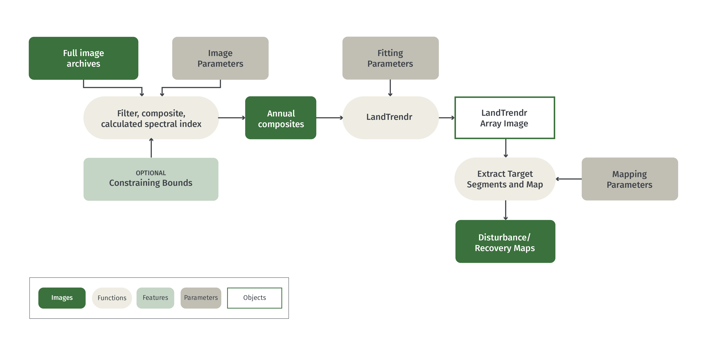

Pour déterminer correctement les paramètres d'utilisation appropriés, chaque fois que LandTrendr doit être appliqué dans une nouvelle région, il est conseillé de suivre la séquence d'étapes suivante : 

- Déterminer les indices spectraux et les plages de dates des images qui permettent le mieux de suivre les changements connus
- Déterminer les paramètres LT qui capturent le changement observé de l'indice spectral
- Développer des règles pour traduire le changement spectral capturé en cartes de perturbation et de récupération

Nous décrivons ci-dessous comment ces étapes peuvent être abordées à l'aide d'une interface utilisateur graphique (section 3), et comment la détection des changements peut ensuite être adaptée en adaptant les scripts GEE existants (section 4). 

## 2 Objectifs pédagogiques

Au terme de ce tutoriel, vous serez en mesure de:   

- Interpréter les valeurs spectrales des séries chronologiques annuelles pour faire la distinction entre le changement réel de l'état de la d'occpuation des sols et des artefacts spectraux causés par d'autres facteurs
- Identifier les indices spectraux et les fenêtres de saisonnalité qui capturent le mieux les régimes de perturbation souhaités
- Choisissez les paramètres d'ajustement LandTrendr qui permettent de saisir au mieux les tendances des valeurs spectrales annuelles
- Interpréter les composites chronologiques à trois bandes en termes de changement de l'occupation du sol et de robustesse des paramètres d'ajustement de LandTrendr
- Mettre en œuvre les scripts de cartographie des perturbations de LandTrendr grâce à une interface utilisateur graphique

De plus, les utilisateurs avancés pourront

- Adapter les scripts LandTrendr GEE pour créer des cartes de perturbation et de régénération sur mesure pour les zones d'intérêt

### 2.1 Pré-requis

* Concepts de Google Earth Engine (GEE
	* Obtenir un compte utilisateur
	* Manipulation des images dans GEE
	* Syntaxe de base des fonctions
	* Traitement de base des images, y compris le choix des images, le filtrage des nuages, la mosaïque et la composition.

> NOTE : Reportez-vous au processus "Pré-traitement" et à l'outil "GEE" ici sur OpenMRV pour plus d'informations et de ressources pour travailler dans Google Earth Engine et les images composites.

## 3 Tutoriel : Démarrage rapide de LandTrendr via une interface graphique sur GEE 

### 3.1 Aperçu

Pour évaluer les choix d'images et de paramètres de LandTrendr, l'interface graphique de LandTrendr est un excellent endroit pour travailler.  L'interface permet un retour d'information rapide sur les choix de fenêtres de date des images, sur les choix de paramètres et sur la réalisation de cartes. 

### 3.2 Mise en place des bibliothèques et de l'interface utilisateur graphique
L'interface utilisateur graphique (GUI) est fournie par les développeurs de LandTrendr dans le laboratoire eMapR (emapr.ceoas.oregonstate.edu).  Ce tutoriel utilise un snapshot (décembre 2020) de la version actuelle. 

#### 3.2.1 L'interface graphique

Dans le [répertoire commun  de ce tutorial sur OpenMRV](https://code.earthengine.google.com/?accept_repo=users/openmrv/MRV), trouvez et ouvrez le script nommé : **OpenMRV_français/Part2/ LandTrendr_fr/LT-GEE-Vis-DownLoad-app_WB_v1.0_fr**.  Une fois chargé et exécuté, ce script crée une interface graphique LandTrendr-GEE. 

Notez que cette interface graphique nécessite l'accès à deux bibliothèques de fonctions utilitaires : Une qui gère le traitement des images, et une autre qui gère l'interface graphique. Les utilisateurs n'ont pas besoin de modifier quoi que ce soit dans le script pour y accéder, mais il est utile de reconnaître que ces bibliothèques externes sont appelées. Bien que développées à l'origine par le laboratoire eMapR, ces bibliothèques ont été copiées fin 2020 dans le référentiel commun de ce module de formation, pour des raisons de commodité, comme indiqué ci-dessus. 


> Note : Les versions originales de ces bibliothèques et scripts (y compris les mises à jour probables au fil du temps) sont disponibles dans GEE via le dossier /users/emaprlab/public.  

#### 3.2.2 Orientation de base de l'interface graphique

Le LT GUI se compose de trois panneaux :  Un panneau de contrôle à gauche, un panneau de rapport à droite et un panneau de carte au centre.


Une vidéo expliquant les principes de base de l'interface utilisateur graphique est disponible ici : https://youtu.be/tdpuxV7Ad8g

En utilisant les menus déroulants du panneau de contrôle, l'utilisateur définit les paramètres des parcours LandTrendr, affiche des images et des cartes dans le panneau central ou génère des graphiques dans le panneau de rapport.  L'expansion des fenêtres est contrôlée en cliquant sur les doubles flèches situées à côté de chaque rubrique : 


### 3.3 Explorez la configuration du système LandTrendr en mode point

La façon la plus simple de commencer à comprendre LandTrendr est d'appliquer les algorithmes en mode point.  Cela vous permet de visualiser le fonctionnement de l'ajustement et la façon dont la modification de vos paramètres peut modifier l'ajustement. 

Pour accéder au mode point, sélectionnez le menu "Pixel Time Series Options". Vous devriez voir une fenêtre comme celle-ci : 


Vous pouvez soit cliquer sur un point de la carte et attendre patiemment, soit saisir des coordonnées et cliquer ensuite sur le bouton "Soumettre le pixel". 

Une vidéo montrant le fonctionnement de base en mode point se trouve ici: https://youtu.be/RdQvxTbi37E

#### 3.3.1 Analyse d'un pixel de perturbation de la forêt

Pour commencer, laissez tous les paramètres tels quels et tapez simplement ces chiffres dans les cases Longitude et Latitude, respectivement, et cliquez sur le bouton Soumettre le pixel.

Longitude: -74.43198, Latitude: 2.73876

Vous devriez voir quelque chose comme ça :  

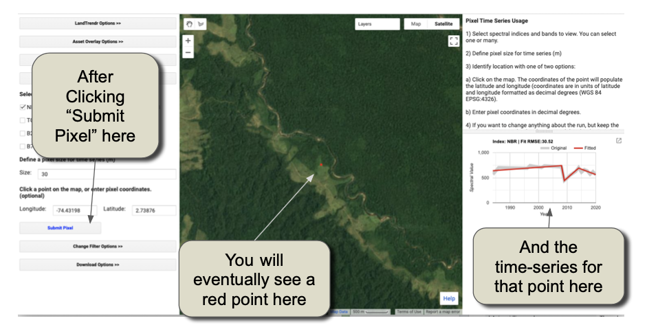

Le tableau des séries chronologiques sur la droite est l'élément clé pour apprendre à interpréter.  Il montre exactement ce que fait l'algorithme, et s'appuie sur les théories mentionnées dans les sections d'introduction précédentes. 

Orientez-vous sur la disposition et la signification des éléments du tableau ci-dessous : 


L'interprétation principale est la différence entre la ligne grise et la ligne rouge. 

La ligne grise représente la trajectoire des valeurs spectrales (mesurées) <u>* observées*</u> pour le pixel. Les valeurs sont extraites de collections d'images avec des propriétés qui définissent la fenêtre de date et les années de la collection.  **Nous les appelons les valeurs spectrales "sources "**. Elles rebondissent d'année en année en raison des changements subtils de l'atmosphère, du moment de l'acquisition des images, etc. 

La ligne <u>*rouge montre ce que les algorithmes ont décidé être la meilleure segmentation temporelle*</u> à travers ces valeurs observées. La ligne <u>*rouge montre ce que les algorithmes ont décidé être la meilleure segmentation temporelle*</u> à travers ces valeurs observées. **Nous les appelons les valeurs spectrales "ajustées".** 

L'objectif de ces graphiques est de déterminer si :

1.  La trajectoire des valeurs sources saisit les processus qui, selon vous, se produisent à la surface
2.  Les valeurs ajustées rendent bien compte de la "forme" globale de la trajectoire des valeurs sources. 

 Pour interpréter ces tracés, il faut au moins savoir quelle direction de changement dans l'indice correspond à une perte de végétation, car la perte de végétation est l'un des moyens les plus courants d'identifier quand une perturbation s'est produite.  C'est particulièrement le cas pour les forêts.  

Dans ce cas, l'indice par défaut utilisé est le "NBR" ou taux de feux normalisés (**normalized burn ratio**). Comme l'indice de différence de végétation normalisée (NDVI) **normalized difference vegetation index**, plus connu, le NBR augmente lorsqu'il y a plus de végétation dans un pixel et diminue lorsqu'il y a plus de sol visible dans le pixel.  

Ainsi, en interprétant le graphique ci-dessus, on peut voir que les valeurs spectrales de ce pixel à la source ont chuté précipitamment juste avant l'année 2010, puis ont augmenté à nouveau pendant plusieurs années avant de retomber plus lentement à la fin de la série chronologique.    En regardant l'image en arrière-plan dans l'afficheur de carte, nous pouvons voir que cela a du sens -- il semble que la zone indiquée sous le point rouge sur la carte a la forme et le contexte d'une récolte forestière.  

Examinons d'autres processus de changement. 

#### 3.3.2 Visite guidée de la dynamique des forêts

La dynamique des forêts est amusante à apprendre à travers la lentille d'une machine à remonter le temps comme les capteurs Landsat.  Avec quelques compétences de base en interprétation, vous pouvez commencer à reconnaître de nombreux types de dynamiques forestières. 

Ci-dessous, nous vous donnons quelques valeurs de longitude et de latitude.  Tapez-les dans la même case que pour le premier exemple, et nous discuterons de ce que vous voyez à chaque point. 

##### 3.3.2.1 Forêt stable

Lorsque la forêt est relativement mature (c'est-à-dire qu'il ne s'agit pas d'une jeune forêt à croissance vigoureuse, ni d'une forêt sujette à des perturbations ou à une dégradation), son signal spectral d'année en année est relativement stable.  Voici un bon exemple : 

Longitude:  74.40033, 2.6399 


Particularités remarquables :   Le signal de la source ne dévie pas beaucoup d'une année à l'autre, et est plat ou presque plat. 

Voici à quoi ressemble une photo aérienne de cette région :

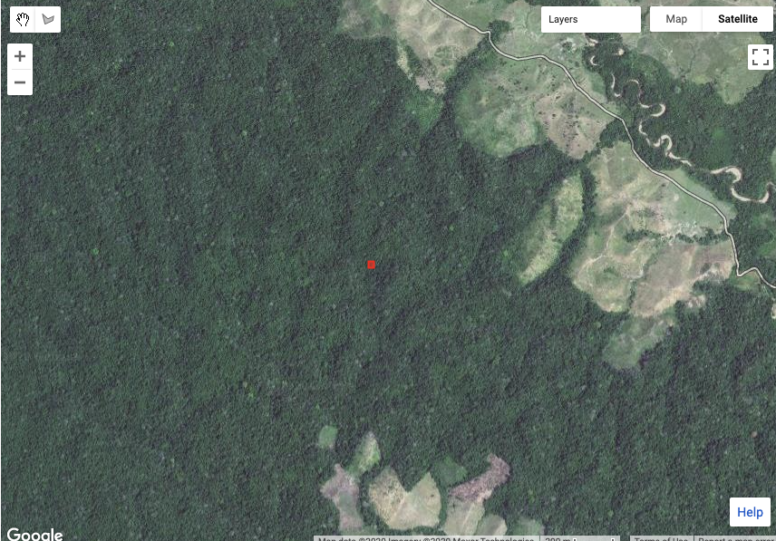


##### 3.3.2.2 Dégradation possible

Bien que les perturbations des forêts telles que celles que nous avons montrées dans notre premier exemple soient courantes, il existe d'autres façons d'affecter la forêt sans la supprimer complètement.  Dans ce cas, le signal spectral montre souvent une réduction de plus longue durée des valeurs spectrales associées à la végétation. 

Longitude: -74.45873, 2.65730


Caractéristiques importantes :  La chute des valeurs de la source au milieu des années 2000 se produit sur plus de deux ans, et a été précédée d'un déclin encore plus lent depuis le début de l'enregistrement, ce qui suggère une certaine perte persistante de faibles quantités de végétation.  Le segment montrant une augmentation sur plusieurs années à partir de 2007 environ est constant dans le temps (c'est-à-dire non bruyant) et pérenne (montre une tendance constante sur plusieurs années).  Lorsqu'on les observe après un déclin comme celui observé au cours de la période 2004-2006, cela prouve que le déclin était bien réel, et non un artefact. 

En regardant la photo aérienne de la région, nous voyons des preuves de l'activité humaine tout autour et y compris le point lui-même.  La forêt dans la zone du pixel semble avoir été défrichée par petites parcelles, et le schéma d'enlèvement suggère que les humains ont participé activement au processus d'enlèvement. La raison spécifique de cette dégradation nécessiterait une meilleure connaissance des facteurs locaux et des incitations à l'abattage des forêts. 


##### 3.3.2.3 Perturbation et restauration des rives

Les humains ne sont pas les seuls agents de changement dans les forêts.  Les processus naturels peuvent éliminer la végétation, pour ensuite faire repousser la forêt.  Les rivières sont des agents notables de ce changement.  

Placez votre détecteur à cet endroit : 

Longitude:  -74.06598, Latitude:  2.692711

Et vous devriez voir cette trajectoire :


Caractéristiques importantes : Dans le signal source, nous constatons une baisse pluriannuelle du signal NBR d'environ 1990 à 1997 ou 1998, après une courte reprise rapide et une reprise plus longue et plus lente d'environ 1999 à aujourd'hui. À la fin de la série chronologique, on peut s'attendre à une bonne récupération du couvert.  

L'ajustement suit bien ces contours temporels, mais peut sous-estimer le taux initial de récupération.  

Notez que le segment ajusté indiquant la perte de végétation commence en 1990 et se poursuit pendant de nombreuses années.  

L'image haute résolution de la période récente ne montre plus que très peu de signes de perturbation.  Bien que la trajectoire spectrale soit sans ambiguïté dans sa représentation du changement, il faudrait interpréter les modèles spatiaux de l'imagerie historique elle-même pour confirmer le type de changement. 


#### 3.3.3 Les autres indices spectraux

Dans l'interface graphique, vous pouvez faire tourner LandTrendr en utilisant de nombreux indices. Voyons à quoi ressemble cette dernière perturbation de la rivière et son rétablissement dans deux autres indices spectraux.

> Remarque : si vous souhaitez davantage d'indices, les utilisateurs avancés peuvent les ajouter lorsqu'ils passent à l'utilisation de scripts, ou même en adaptant les bibliothèques utilisées par l'interface graphique ici. Vous pouvez utiliser n'importe quel index que vous pouvez imaginer ! 

Sans changer la longitude ou la latitude, il suffit de cliquer sur les cases à cocher à côté de "NDVI" et "B5", et de cliquer sur la case "Soumettre le pixel", comme indiqué ici : 


Vous devriez maintenant voir deux autres graphiques sur le volet de droite, qui ressemblent à ceux-ci : 

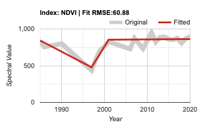


N'oubliez pas qu'il s'agit de cartes du même pixel que la première, mais vues avec des indices spectraux différents.  Les différences sont considérables ! 

Les données de la source NDVI montrent à peu près le même chronogramme de perturbation et de récupération, mais l'algorithme ne s'adapte pas de la même façon à la trajectoire !  

La trajectoire du B5 nécessite quelques explications.  La bande 5 fait référence au numéro de bande des satellites Landsat 5 et 7, où la bande 5 était la bande infrarouge à ondes courtes (centrée à environ 1,65 micromètres).  La bande 5 monte lorsqu'il y a plus de sol, et descend lorsqu'il y a plus de végétation. 

En fait, certains indices permettent de mieux détecter les changements dans certains environnements que d'autres.  Pour les régions forestières, notre expérience suggère que le NBR, le NDVI et la bande 5 sont quelque peu complémentaires. 

#### 3.3.4  Conseils pour les problèmes

Jusqu'à présent, nous n'avons vu que des régions où le signal source était assez clair et où l'ajustement par l'algorithme semblait avoir un sens.  Ce n'est pas toujours le cas !  En effet, jusqu'à présent, nous n'avons utilisé que les paramètres "par défaut" pour les algorithmes LandTrendr, et nous ne pouvons pas nous attendre à ce qu'ils soient optimaux pour un nouvel environnement ou une nouvelle situation.  Avant de commencer à modifier les contrôles, examinons certains domaines dans lesquels les choses ne fonctionnent pas aussi bien. 

##### 3.3.4.1 Signal source bruyant

Quelquefois, le signal source est bruyant, ce qui le rend difficile à interpréter, que ce soit pour un humain ou un algorithme. 

Considérez ce point :Longitude: -74.41916, Latitude:  2.70914


Caractéristiques remarquables :  Bien que certaines périodes présentent une relative cohérence (de la fin des années 1990 au milieu des années 2000, et les cinq dernières années et plus du relevé), il existe plusieurs périodes où les données sources sont assez variables.  

La première année de la série chronologique semble basse, et monte rapidement la deuxième année. L'algorithme croit notamment que ce saut est dû à la modification de l'ajustement complet pour tenir compte de cette première observation. 

Ceci soulève l'une des plus importantes directives pour le travail et l'interprétation des algorithmes fonctionnant sur des données de séries temporelles de toutes sortes :  **Alors que chaque autre observation est accompagnée d'une autre observation extérieure pour aider à déterminer si elle est inhabituelle, la première et la dernière observation n'ont pas de point d'ancrage extérieur. Ainsi, les algorithmes n'ont pas d'autre choix que de croire ces observations, et l'ajustement peut être grossièrement affecté. 

Entre 2007 et 2010 environ, les données sources ont connu des variations très dynamiques.  Mais il n'est pas clair si ce sont les années hautes qui sont anormales, ou les années basses.   Une telle dynamique peut être causée par la variabilité des signaux saisonniers de la végétation, en particulier dans les classes agricoles ou autres classes de couverture terrestre très dynamiques.  

Mais comme le suggère la photo de ce point, il est peu probable que cette zone soit de type dynamique.  En fait, il semble que ce soit une forêt assez stable ! 


Que pourrait-il se passer ?  Étant donné que nous travaillons dans une région nuageuse du monde, la réponse la plus probable est qu'il y a des nuages ou des ombres nuageuses qui ont passé l'étape du filtrage des images et qui polluent le signal spectral dans ces années intermédiaires de la série temporelle. La valeur faible de la première année de la série chronologique suggère également un problème éphémère, probablement aussi des nuages.  

Comment pouvons-nous y remédier ?  Dans l'interface graphique, la meilleure façon de résoudre ce problème est de modifier les fenêtres de date de la collection d'images.  Nous verrons dans une section ultérieure comment nous pourrions résoudre ces problèmes. 

##### 3.3.4.2 Mauvais ajustement

Il arrive que le signal source ait une forme assez évidente pour l'œil humain, mais l'algorithme ne le capte pas.  

Considérez ce point : 

Longitude: 74.43843, Latitude:  2.67350


Caractéristiques importantes :   Le signal de la source semble relativement stable, voire en augmentation jusqu'à l'an 2000 environ, puis en déclin pendant deux décennies.  Rien qu'à partir de ce signal, il semble que la végétation perde très lentement de sa vigueur au fil du temps, mais la cause n'est pas claire.  La zone semble se trouver dans un pâturage (non représenté ici), et il se peut que le changement de la vigueur de la végétation reflète un changement dans la gestion, le pâturage ou les pratiques de récolte. 

Le problème majeur est que, quelle que soit la cause du changement du signal source, l'algorithme d'ajustement ne tient pas compte du point d'inflexion en l'an 2000. Pour résoudre ce type de problème, il faudrait modifier les paramètres d'ajustement. 


Un autre exemple de mauvais ajustement peut être trouvé ici :

Longitude: -74.4236, Latitude:  2.6939

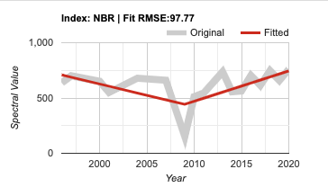

Caractéristiques importantes :  Les données sources sont plus variables que certains des exemples ci-dessus, mais néanmoins la forme de la trajectoire est probablement interprétable. Bien qu'elle diminue et se rétablisse rapidement, la chute brutale de 2007 à 2009 est probablement une perturbation.  La période précédant la perturbation (jusqu'à 2006 environ) est relativement stable, et se situe à un plateau de valeurs spectrales distinct du début de la montée post-perturbation en 2010. 

Bien que l'algorithme ait estimé qu'il y avait un déclin, il n'a pas permis une récupération rapide, et a plutôt forcé un segment de perturbation de longue durée sur la première moitié de la série chronologique.  

Cela soulève un sujet important dans la définition des paramètres d'ajustement. L'une des étapes clés du traitement des trajectoires est la suppression des pics de bruit, qui sont définis par l'algorithme comme des écarts qui renvoient le niveau de départ immédiatement après le changement.  Rien que par cette définition, les algorithmes se méfient à juste titre de la baisse de la fin des années 2000.   

Plusieurs paramètres clés peuvent être ajustés dans des situations comme celle-ci pour encourager l'algorithme à saisir ce changement (voir ci-dessous). 

#### 3.3.5 Découvrez par vous-même ! 

La meilleure façon d'apprendre à interpréter les séries chronologiques avec les processus en jeu est d'explorer par soi-même.  En fait, vous pouvez pointer l'interface graphique n'importe où dans le monde pour explorer des endroits où vous pensez pouvoir comprendre la dynamique du changement, et expérimenter avec des indices spectraux pour voir dans quelle mesure ils capturent le processus de changement sous-jacent, puis évaluer comment l'algorithme parvient à capturer la forme de l'indice. 

### 3.4 Exploration de la dynamique avec des images composites à trois couleurs

Si le mode point est le seul moyen de comprendre et d'évaluer pleinement la source et les valeurs ajustées, c'est un moyen inefficace d'explorer les modèles spatiaux. Nous pouvons nous trouver sur des pixels dont les valeurs sources indiquent un problème avec l'imagerie, ou dont les paramètres d'ajustement ne sont probablement pas choisis de manière appropriée, mais de telles découvertes sont le fruit du hasard.  Il serait utile de disposer d'un outil visuel rapide pour scanner le paysage et évaluer les tendances et les problèmes potentiels.   

L'outil de visualisation RGB de l'interface graphique de LandTrendr est conçu pour évaluer rapidement les modèles spatiaux d'ajustement spectral par l'algorithme.  Dans cet outil, nous exécutons LT sur de nombreux pixels, puis nous montrons les images des valeurs ajustées LT sur les pixels, avec différentes années d'imagerie ajustée dans les couleurs rouge, verte et bleue à l'écran.   En connaissant les années affichées et les propriétés des valeurs spectrales rendues, il est possible d'interpréter les modèles spatiaux des images RGB en termes de processus de changement de la couverture terrestre ou de problèmes d'imagerie ou d'ajustement.  

Examinons l'outil de visualisation RGB. 

#### 3.4.1 Charger une zone d'étude à partir de la Colombie

Les algorithmes de LandTrendr sont gourmands en calculs et prennent un certain temps pour fonctionner.   Pour des raisons de formation, il est utile de limiter notre analyse à un domaine géographique relativement restreint.  

Ainsi, la première étape consiste à charger un actif GEE pour définir la zone d'intérêt.  Dans le panneau de contrôle, sélectionnez le menu "Options de superposition des actifs" (Figure P1), et entrez ces valeurs :

1. Dans la première case, entrez le chemin d'accès à l'actif :   **utilisateurs/openmrv/MRV/ColombiaRectangle**
2. Dans la première case de la section "Définir le nom de la couche", entrez un nom que vous reconnaîtrez lorsqu'il apparaîtra dans les couches de la carte.  "ColombiaRectangle" est un bon choix.    
3. Près du bas, **cliquez sur la case à cocher** qui fait de la première couche celle à utiliser pour contraindre les analyses ultérieures. 
4. Cliquez sur "Ajouter un actif à la carte". **Add asset to map'**


Figure P1.  Le menu "Asset Overlay Options", utilisé pour ajouter une boîte contraignante à la carte pour une analyse et une visualisation ultérieures. 

Lorsque vous avez effectué ces étapes, la limite de la zone d'intérêt doit apparaître au centre de la carte sous la forme d'un cadre blanc.  Zoomez un peu pour que la boîte blanche remplisse la majeure partie de la zone de la carte (figure P2).  La zone ci-dessous est utile parce qu'elle comprend une forêt importante, parce qu'elle présente d'abondants changements naturels causés par les rivières et le déboisement anthropique, et parce qu'elle est suffisamment petite pour être traçable pour l'analyse au fur et à mesure que vous apprenez.

> NOTE : Vous pouvez utiliser ce même outil de gestion des actifs pour charger une zone de délimitation différente de votre choix.  La seule contrainte est qu'il doit s'agir d'un actif GEE que vous avez le droit de visualiser.  


#### 3.4.2 Visualisation et interprétation des images ajustées en mode RGB

Que sont les images ajustées ?   Comme vous l'avez appris en mode pixel, l'algorithme LandTrendr crée des trajectoires ajustées de valeurs spectrales à l'échelle du pixel.  Chaque année de la série temporelle se voit attribuer une valeur ajustée à partir du modèle de segmentation temporelle.  Si nous devions exécuter LT pour de nombreux pixels, nous pourrions prendre un instantané des valeurs ajustées d'une année quelconque et produire une image de cet indice spectral pour cette année.  Nous pourrions faire la même chose pour deux autres années, et si nous assignons une année à chacun des canons couleur du moniteur, nous obtiendrions une image RGB combinée.  L'interprétation des couleurs de cette image nous renseigne sur la trajectoire de l'ajustement. 

> Note : Pour une bonne description graphique de ce processus, consultez la section 8.3 du guide de l'utilisateur LT-GEE produit par le laboratoire eMapR sur Github : https://emapr.github.io/LT-GEE/ui-applications.html#ui-landtrendr-fitted-index-delta-rgb-mapper

##### 3.4.2.1 Choisir une combinaison d'images RGB

Essayons pour le domaine d'étude qui nous intéresse.  Ouvrez le menu RGB change mapper dans l'interface graphique. Comme nous avons chargé un actif et, dans le menu actif ci-dessus, cliqué sur la case à cocher "Utiliser le premier chemin de fichier pour traiter l'imagerie" (Vous avez coché cette case ci-dessus, n'est-ce pas ?), nous pouvons ignorer de nombreuses options ici.  

Si, à l'avenir, vous souhaitez utiliser le mappeur RGB de différentes manières, notez toutefois que vous pouvez définir le point central et une case autour de celui-ci, ou que vous pouvez délimiter votre propre géographie arbitraire. 

Une vidéo de base montrant l'outil RGB se trouve ici : https://youtu.be/VSeia3NRa3c


Cliquez sur "Add RGB Imagery", et attendez patiemment.  Le chargement complet de la zone que nous avons choisie peut prendre une minute.  Quand ce sera fait, vous devriez voir quelque chose comme ceci : 


> Remarque : certaines zones du bord gauche de cette zone d'étude présentent des données manquantes (indiquées par la possibilité de voir l'image sous-jacente au lieu des valeurs ajustées).  Ces zones n'ont pas suffisamment d'observations non masquées pour effectuer l'ajustement temporel (le paramètre "observations minimales nécessaires" est une quantité définie par l'utilisateur (section 1.2 ci-dessus).  S'il y a réellement moins de six observations (la valeur par défaut du paramètre), l'exécution de l'algorithme risque d'entraîner un overfitting ou un mauvais ajustement, car il y a tout simplement trop peu d'observations. Ainsi, plutôt que de réduire la valeur de ce paramètre pour permettre l'exécution de l'algorithme sur un plus grand nombre de zones, il est conseillé de rechercher pourquoi il existe si peu d'observations valides.  S'il y a vraiment peu d'observations valides, alors d'autres approches devront être entreprises dans ces régions, ou elles devront être explicitement exclues du rapport.

##### 3.4.2.2 Interprétation des changements comme des couleurs

Comment interpréter les couleurs ?  Supposons que nous travaillons avec un indice tel que le NBR ou le NDVI où des valeurs élevées indiquent plus de végétation et des valeurs faibles indiquent moins de végétation. 

Tout d'abord, considérons ce qu'est une zone sans couleur, c'est-à-dire une zone qui est noire, blanche ou grise entre les deux.  Si une zone est noire ou blanche, la trajectoire des valeurs spectrales est stable au fil des ans.  Dans le schéma ci-dessous, les lignes noires horizontales représentent trois trajectoires de pixels différentes, toutes parfaitement planes (c'est-à-dire stables dans le temps) :


Si nous avons une perturbation entre les années verte et bleue, cela signifie que l'indice sera élevé dans les couleurs rouge et verte, mais faible dans le bleu.  Selon la théorie de la couleur additive (voir https://en.wikipedia.org/wiki/Additive_color), cela se traduirait par une couleur jaune. 


Si, en revanche, la perturbation s'est produite avant l'année verte et qu'il n'y a pas eu beaucoup de reprise avant l'année bleue, nous aurions des valeurs élevées, principalement en rouge. 


S'il y avait une régénération au moment de l'année bleue, alors il y aurait beaucoup de rouge et de bleu, ce qui donnerait une certaine nuance de violet ou de magenta


Quelques autres variantes sont couramment observées et méritent d'être examinées.  

Si une zone voit une croissance constante de la végétation au fil des ans, elle aura un rouge relativement faible, un vert légèrement plus élevé et un bleu plus élevé, ce qui donne une forme de cyan à bleu.

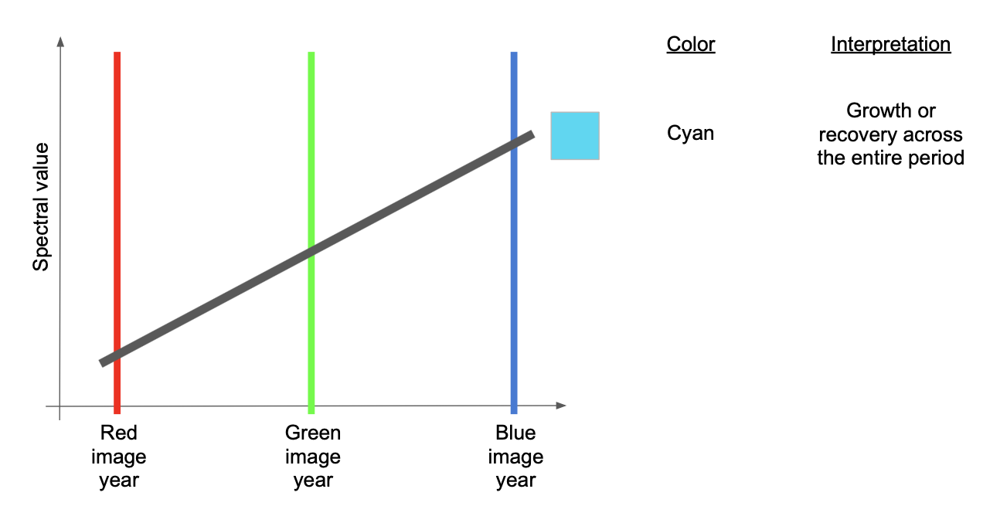

Enfin, s'il y a un déclin persistant sur toute la période, le rouge sera le plus élevé, suivi du vert puis du bleu - ce qui fait une certaine version du brun ou de l'orange. 


##### 3.4.2.3 Utiliser un graphe au niveau du pixel avec des images RVB pour interpréter les couleurs

Ces règles de couleur peuvent être quelque peu abstraites jusqu'à ce que vous les voyiez en action.  L'interface graphique de LandTrendr nous donne l'occasion de le faire : utilisez la carte de couleurs RGB pour sélectionner les pixels et les tracer en mode pixel-level ! 

C'est parti. 

Tout d'abord, vérifiez que votre image RGB s'est bien chargée dans le rectangle de la Colombie. 

Ensuite, dans le menu de contrôle de gauche, sélectionnez à nouveau le menu "Pixel Time Series Options", comme vous l'avez fait au point 3.3.

Maintenant, vous pouvez cliquer dans l'image RGB pour voir à quoi ressemblent les pixels dans différentes zones de l'image. 

Tout d'abord, regardez quelques pixels dans la large bande de bleu :

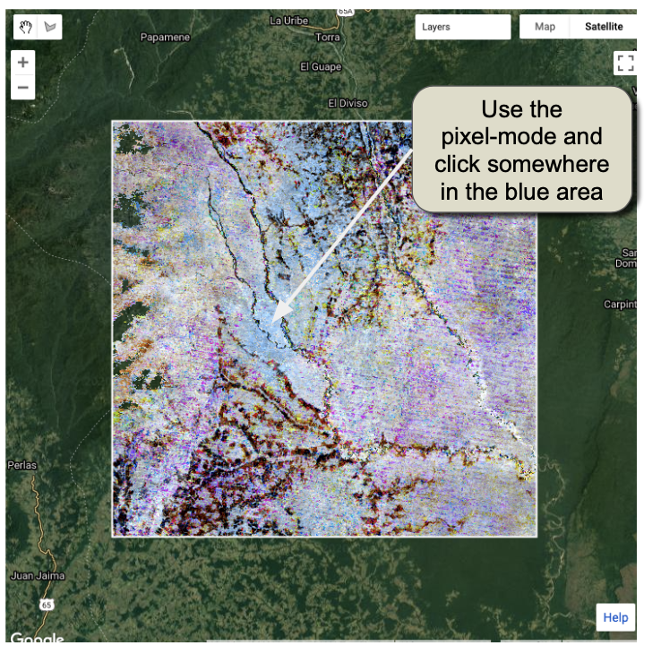

Voici la série chronologique d'un de ces événements dans cette région : 

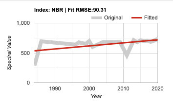

Comme le suggère notre guide d'interprétation des couleurs ci-dessus, la ligne ajustée (en rouge) augmente tout au long de la série chronologique.   Mais nous pouvons voir que cela, comme un exemple dans la section 3.3, est le résultat de l'algorithme qui a été déclenché par des problèmes apparents dans la première année de la série temporelle.  

Le motif spatial du bleu dans l'image est un indice qu'il pourrait s'agir d'un artefact de nuages - le ton bleu s'étend sur une grande partie de l'image et semble sans rapport avec les motifs du paysage sous-jacent.  Cela suggère la présence d'un ou plusieurs nuages. 

Une autre zone où les motifs spatiaux des couleurs de l'image RGB ne correspondent pas aux motifs apparents du paysage se trouve à droite (à l'est) de la zone d'étude, où l'on trouve une bonne quantité de "rayures" violettes.   

Zoomez sur l'une des bandes violettes et cliquez dessus.  

> Note : lorsque vous modifiez l'étendue de l'image, GEE recalculera l'image ajustée, alors soyez patient ! 

En voici un exemple :


Interprétation : Nous utilisons la visualisation RGB combinée avec le traceur de pixels pour évaluer les modèles spatiaux et temporels. En examinant uniquement les trajectoires spectrales supérieure et inférieure, l'imagerie source semble montrer des baisses de valeur spectrale qui persistent sur plus d'un an et qui peuvent sembler réelles.  Cependant, avec le visualiseur RGB, nous pouvons voir que le modèle spatial est disjoint du paysage sous-jacent (non représenté sur la figure ci-dessus, mais il est boisé).  De plus, le schéma de perturbation semble être horizontal et linéaire. 

La configuration spatiale de ces artefacts suggère le schéma d'erreur de ligne de balayage de Landsat 7 -- un problème où des tranches grossièrement horizontales de l'imagerie de Landsat 7 ne sont pas enregistrées. 

> Note !  Le problème n'est pas, en fait, avec les images Landsat 7, mais le fait qu'elles n'ont pas de données dans ces zones et qu'elles laissent passer une image Landsat 8 ou Landsat 5 sous-jacente avec des problèmes de nuages ! 

Néanmoins, l'interprétation récapitulative ici est que cette région présente une nébulosité persistante qui n'est pas prise en compte par les algorithmes de masquage des nuages par défaut.  

Quelle est la solution ?  La chose essentielle à réaliser ici est que la nébulosité persistante se produit pendant la fenêtre de la saison que nous utilisons pour construire les collections d'images !   La meilleure solution consiste donc à examiner et à modifier la fenêtre de temps des collections d'images.  Nous le ferons dans la prochaine section, mais d'abord, examinons quelques *perturbations réelles*.

Recherchez les zones qui présentent des motifs rouges et jaunes - il doit s'agir de perturbations. 

Voici un exemple :

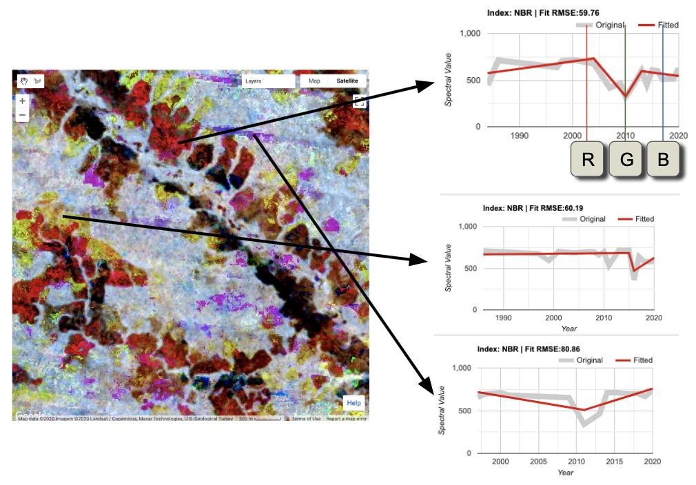

Les motifs spatiaux des zones rouge et jaune sont cohérents avec le motif du paysage sous-jacent, ce qui donne de la crédibilité à la détection de changements réels.  De plus, les données sources dans les trajectoires des pixels, bien que bruyantes, semblent être cohérentes avec le signal de perturbation. 

Cependant, nous voyons également un exemple de perturbation violette avec un motif spatial bizarre (figure en bas à droite).  En survolant le graphique lui-même et en examinant les données sources grises, on peut vérifier quelles années de données sont réellement présentes.  Ce faisant, il apparaît que de nombreuses années de données sources sont manquantes.  Cela se produit lorsque des nuages sont présents. 

Ainsi, nous avons d'autres preuves que la fenêtre d'image choisie pour l'exécution par défaut de LandTrendr ici n'est pas optimale pour la Colombie !  Travaillons sur ce point. 

### 3.5 Mise à jour du paramétrage de l'image et de l'appareillage

Jusqu'à présent, nous nous sommes appuyés sur les paramètres "par défaut" pour exécuter l'algorithme LT : les fenêtres de dates de l'année pour construire les collections d'images, et les paramètres d'ajustement pour contrôler l'algorithme.  Et nous avons vu que ces paramètres ne sont peut-être pas suffisants pour notre nouvelle situation en Colombie ! 

Pour améliorer cela, nous devons définir l'imagerie de base qui sera fournie à l'algorithme et les paramètres d'ajustement pour contrôler l'algorithme.  Ceux-ci se trouvent dans le menu d'expansion "LandTrendr Options" de l'interface graphique.  

Une vidéo de base montrant ce processus se trouve ici : https://youtu.be/TNQOdHIg24s

#### 3.5.1 Modifier les valeurs dans le menu (Plage de dates)

Dans la section 3.5, nous décrivons d'abord la logique de chaque composante et proposons des recommandations pour de nouvelles valeurs à expérimenter. 


Comme indiqué dans le diagramme de déroulement des opérations (section 1.4), la première étape du déroulement des opérations de LandTrendr consiste à transformer les archives d'images en composites annuels.  La composition réduit le bruit dans les séries chronologiques ; dans les bibliothèques LandTrendr standard, nous utilisons une approche de composition de médoïdes (décrite dans la section 5 ci-dessous). 

Deux groupes de valeurs doivent être déterminés : la plage d'années à partir de laquelle on peut procéder à la segmentation et la plage de dates saisonnières au sein de chaque année à partir de laquelle on peut calculer les composites. 

#### Années des images

Comme indiqué dans la section 1.1.1, l'algorithme LandTrendr est conçu pour fonctionner avec des données provenant de la famille de capteurs Landsat et remontant jusqu'à 1984.  En pratique, de nombreuses régions tropicales du monde ne disposent pas d'assez d'images disponibles dans les premières années des archives Landsat pour fournir des images composites raisonnables. 

S'il n'y a pas d'images au début de la série temporelle, l'algorithme démarrera simplement le processus de segmentation temporelle à l'année où les données ont été démasquées pour la première fois.  Ainsi, il est raisonnable de commencer un processus de segmentation avec la première année fixée à 1984 et la dernière année fixée à l'année la plus récente. 

En pratique, il y a deux raisons de fixer la première année plus tard que 1984.  Premièrement, avec moins d'images collectées au cours des premières années du programme Landsat Thematic Mapper, il y a moins d'images à exploiter. Si les nuages sont fréquents dans la zone d'intérêt, l'étape de composition d'images s'appuiera sur moins d'images et pourra être contrainte d'inclure des images plus éloignées de la condition phénologique (saisonnière) souhaitée. Deuxièmement, dans certaines régions du monde, il semble que les propriétés spectrales des images des premières années de l'enregistrement soient moins cohérentes que celles du reste de l'archive.  Ainsi, en pratique, nous recommandons de fixer l'année initiale à 1986 ou plus tard. 

En outre, si les étapes ultérieures montrent que peu de pixels ont des valeurs dans les premières années, la cohérence dans le domaine de l'image plaiderait en faveur du démarrage de l'ensemble du processus de segmentation à une année ultérieure.  

Ainsi, **nous recommandons de fixer l'année de début à 1990**, et de laisser l'année de fin à 2020. 

#### Plage de dates

LT suppose que chaque pixel a une observation par an.  Comme décrit dans les modules précédents, la minimisation de l'impact des nuages nécessite que nous construisions ces observations en composant plusieurs images dans une fenêtre de date par an.  Si la fenêtre est trop étroite, il se peut qu'il n'y ait pas assez d'images à partir desquelles on peut faire un composite clair.  Si la fenêtre est trop large, les effets de la saisonnalité de la végétation pourraient introduire un changement spectral indésirable qui n'est pas lié au changement réel sur le terrain. 

Le choix de la plage de dates est l'un des choix les plus importants dans le processus de mise en œuvre de LandTrendr.  L'utilisateur doit trouver un équilibre entre l'objectif d'utiliser les images à des périodes de l'année où des observations claires sont les plus probables et l'objectif de trouver le changement qui l'intéresse.  

La plage par défaut est de juin à septembre, ce qui n'est pas invraisemblable pour l'une des périodes les plus sèches de la Colombie. Cependant, nous avons vu dans nos exemples que nous avons des problèmes avec la nébulosité.  

Nous **recommandons donc de fixer la date de début au 01-01 et la date de fin au 30-04**.  Cela permet de disposer de quatre mois d'images potentielles à exploiter pendant l'une des saisons sèches. 

#### Source et indice ajusté

Pour cet exercice, nous nous en tiendrons au NBR. Vous êtes invités à expérimenter avec différents indices plus tard.

#### Paramètres de segmentation

<u>Max Segments</u>:  Avec 30 années de données possibles (1990 à 2020), huit segments sont encore appropriés, car ils sont bien en dessous de la règle du ratio 3:1.  En passant de six, on peut découvrir des ajustements légèrement plus compliqués sur 30 ans. 

<u>Spike Threshold:</u> Maintenir à 0,9.  Ce paramètre peut avoir un certain effet lorsqu'il y a des trajectoires bruyantes, mais il peut ne pas avoir besoin d'être modifié avant que nous ayons vu les impacts du changement de la plage de dates. 

<u>Vertex Count Overshoot:</u>  Ce paramètre doit rarement être modifié. 

<u>Prevent One Year Recovery</u>:  Passez à "false" (notez les minuscules).  Il s'agit d'un paramètre agressif qui fait ce qu'il suggère : il empêche les segments de récupération d'un an.  Cependant, il est plus généralement utile de régler la récupération à l'aide du paramètre suivant : le seuil de récupération. 

<u>Recovery Threshold:</u>  Passez à 0,75.  Lorsqu'il est réglé sur la valeur par défaut de 0,25, les segments qui se rétablissent plus rapidement que quatre ans sont refusés, mais dans les régions tropicales, un rétablissement végétatif rapide après une perturbation est la norme.  Ainsi, si ce paramètre est fixé à 0,75, une reprise rapide est autorisée, mais pas plus de 1 / 0,75 ans - ce qui atténue les impacts du bruit.

<u>p-value Threshold:</u>  Maintenir à 0,05.  Cependant, si nous constatons que les ajustements ne suivent pas des données de source quelque peu bruyantes, cette valeur devrait être ramenée à 0,15. 

<u>Best model Proportion:</u>  Maintenir à 0,75

<u>Min Observations needed:</u>  Maintenir à  6. 

#### 3.5.2 Évaluer de nouveaux paramètres

Voyons ce qu'il advient des composites RGB ajustés et des pixels individuels une fois que vous avez modifié les paramètres LT. 

Tout d'abord, ouvrez à nouveau le menu "Options de modification RGB", puis cliquez à nouveau sur le bouton "Ajouter une image RGB".  Lorsque l'image se recharge, elle devrait ressembler à ceci : 

 

Interprétation :  Cette version est bien meilleure que la précédente !  Pourquoi ?   Il y a beaucoup moins d'artefacts évidents associés aux nuages et à l'erreur de ligne de balayage de Landsat 7.  En fait, une grande partie de la zone boisée apparaît maintenant en tons de gris, ce qui suggère une stabilité du signal spectral ajusté. En outre, les zones de perturbation probable restent (et sont en fait plus importantes) en rouge et en jaune.  

En zoomant sur la région de la moitié est de l'image, il apparaît que les problèmes liés aux nuages ont été en grande partie résolus : 

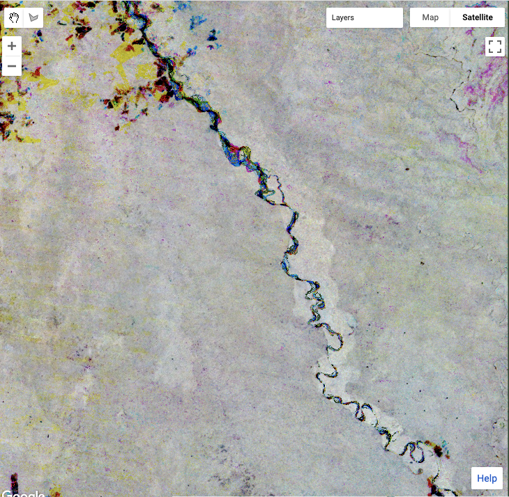

#### 3.5.3 Explorer les impacts des paramètres d'ajustement

L'impact de la modification des paramètres d'ajustement de LandTrendr varie selon les pays en raison des différences de densité des archives d'images, des conditions de nuages et de phénologie, et du type de forêt et du processus de changement de la forêt.  Par conséquent, la meilleure approche pour voir comment les paramètres d'ajustement des images fonctionnent est de simplement expérimenter la modification des paramètres et d'évaluer l'impact en utilisant le panneau d'options de séries chronologiques de pixels.  

À titre d'exemple, nous pouvons considérer le pixel à la longitude : -74.284722, à la latitude : 2.783660. 

Avec les paramètres que nous avons définis ci-dessus, la perturbation est capturée, et une période de stabilité post-perturbation est capturée avant la repousse.  En l'absence d'une vérité de terrain substantielle, il n'est pas possible de déterminer facilement si les caractéristiques articulées dans la repousse post-perturbation sont des indications de gain et de perte réels, ou si les caractéristiques quelque peu bruyantes du signal source sont des artefacts. 


##### De-spike

La trajectoire de la source est utilisée exactement comme elle est reçue.  Dans ce pixel, la désactivation de la vérification du de-spike en la réglant sur **despike=1.0** modifie le comportement des segments post-dérèglement.


La vérification de l'absence de parasites a supprimé des caractéristiques de la série chronologique, ce qui est souhaitable lorsque les caractéristiques sont du bruit, mais elle peut commencer à supprimer des informations réelles si elle est rendue trop agressive.  Le réglage **de-spike=0,5** supprime certaines des caractéristiques de la perturbation, et bien que la forme rappelle les réglages d'origine, elle perd certains détails. 


##### Recovery threshold (seuil_de_régénération)

Le paramètre de seuil de régénération exerce un fort impact sur l'appareillage.  Rappelons que le paramètre fixe la limite de la vitesse de retour de la valeur spectrale après perturbation.  

Revenir à nos paramètres de base, puis fixer le **seuil_de_régénération=0,25** oblige à simplifier considérablement la récupération : 


Bien qu'une grande partie des informations post-perturbation soit lissée, la synchronisation de la perturbation initiale est conservée, ce qui peut être suffisant dans les zones où le signal source est très bruyant. 

Le fait de désactiver le seuil en le réglant sur **recovery_threshold=1,0** permet toutefois de faire apparaître des détails dans la trajectoire post-perturbation.  Dans certains cas, il peut s'agir de détails réalistes, mais dans d'autres, cela peut entraîner un sur-ajustement du bruit.  Pour la trajectoire présentée ici, il n'est pas clair si le saut de la valeur spectrale du NBR 2012 est en fait réel ou s'il s'agit d'un artefact.


##### P-value seuil

L'augmentation du seuil de la valeur p permet de saisir les ajustements qui conservent plus de bruit résiduel après l'ajustement. 

Dans le cas de notre pixel test, le réglage du seuil **p-value=0,15** semble entraîner un manque d'ajustement de la profondeur de la perturbation, ainsi qu'un sur-ajustement à la fin de la période. 

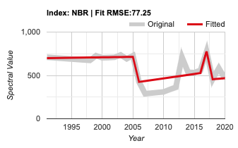

##### Best-model proportion (meilleure proportion du modèle)

Lorsqu'il est fixé à une valeur inférieure à 1,0, ce paramètre permet de choisir des ajustements plus complexes même s'ils n'ont pas la meilleure valeur p.  Notre valeur par défaut était de 0,75, et le fait de définir la **meilleure proportion du modèle=1,0** ne modifie pas l'ajustement de ce pixel particulier par rapport à notre point de départ :

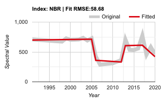

Dans la pratique, ce paramètre a rarement des impacts importants.  

Cependant, il peut fonctionner avec d'autres paramètres pour provoquer une légère modification de l'ajustement. Par exemple, le fait de fixer le seuil de la valeur p à 0,15 et la proportion du meilleur modèle à 1,0 entraîne un ajustement légèrement différent : 


### 3.6 Cartographie des perturbations

Dans l'approche de segmentation temporelle, la cartographie des perturbations forestières n'est essentiellement qu'une interrogation au niveau du pixel de la trajectoire segmentée. Ainsi, une fois que vous avez identifié un ensemble de fenêtres de date d'image et de paramètres d'ajustement, une grande partie du travail est effectuée. 

Cependant, il reste un ensemble de paramètres à prendre en compte : ceux qui identifient et cartographient les perturbations à partir des trajectoires segmentées. 

Voyons comment les perturbations des forêts peuvent être cartographiées.  

Considérons une trajectoire segmentée de l'indice NBR qui est relativement stable tout au long de l'année 2006, puis qui chute précipitamment à une faible valeur en 2007 parce que la forêt a été défrichée (perturbation), pour finalement revenir à une valeur modérée quelques années plus tard (voir figure ci-dessous). 


Les années de vertex sur l'axe des x et les valeurs NBR sur l'axe des y sont stockées dans le tableau d'images qui est renvoyé par l'algorithme LT. La trajectoire ajustée (ligne rouge) est représentée par les sommets correspondant aux extrémités des segments de la ligne droite, et la variation de l'indice spectral peut être calculée pour chaque segment (ici indiqué dans la colonne "Delta NBR").   

Une simple requête sur la variation de l'indice spectral permet d'identifier les segments de perturbation en fonction de la direction de la variation. La direction de la perturbation (augmentation ou diminution) est définie pour tous les indices spectraux candidats dans LandTrendr.  La sélection du changement le plus important permet d'identifier la plus grande magnitude de la perturbation.  Une fois que le segment de perturbation approprié est trouvé, l'année, l'amplitude, la durée et la valeur spectrale avant perturbation peuvent toutes être peintes au niveau du pixel pour créer diverses cartes de perturbation.

Bien entendu, tous les changements de la valeur spectrale semblables à une perturbation ne sont pas de véritables perturbations.  Comme vous l'avez peut-être déjà découvert en interrogeant des pixels individuels, des segments de type perturbation peuvent également se produire si l'algorithme est perturbé par un indice spectral de faible changement.   Ainsi, il est souvent souhaitable de ne pas tenir compte des segments de perturbation dont la variation est inférieure à une valeur seuil de magnitude. 

De plus, un utilisateur peut n'être intéressé que par les perturbations qui sont abruptes, afin de pouvoir se concentrer sur l'activité de défrichement des forêts. 

Enfin, il est probable que certains pixels individuels sont encore soumis à du bruit dans les données sources et semblent être des perturbations dans les données ajustées.  Si nous appliquons des règles stipulant que les parcelles de perturbation doivent contenir un nombre minimum de pixels adjacents, nous pouvons supprimer ces faibles erreurs. 

Ce sont des éléments qui peuvent être définis dans le menu **Change Filter** "Modifier le filtre" : 


En supposant que vous avez toujours le ColombiaRectangle comme premier actif dans l'outil Asset Manager, lorsque vous cliquez sur "Add Filtered Disturbance Imagery", l'algorithme exécutera LT sur chaque pixel, utilisera votre imagerie d'ajustement et vos guides de paramètres, puis les ajoutera à la carte.  Comme pour l'imagerie RGB, il faudra un peu de temps pour calculer et charger (c'est pourquoi nous nous sommes limités à une région relativement petite pour la formation !) 

Une vidéo de base illustrant cette installation est disponible ici :  https://youtu.be/f8xPDzEknQg

Le cartographe des perturbations ajoute trois couches à la carte :  Année de détection, Ampleur et Durée.  Vous trouverez ci-dessous un aperçu des couches Année et Magnitude pour notre zone d'intérêt :


En zoomant suffisamment près pour voir les modèles réels de perturbation, les résultats sont prometteurs : 


En se référant à la fois à l'année et à la magnitude de la perturbation, on peut identifier des zones suspectes de faible magnitude avec des modèles spatiaux qui peuvent ne pas être réalistes, et utiliser l'outil au niveau du pixel pour les interroger afin de voir si les valeurs seuils pourraient être améliorées. 

Par exemple, l'examen des trajectoires au niveau du pixel de certaines de ces perturbations de faible amplitude suggère qu'elles sont effectivement causées par du bruit dans le signal source :


Le seuil de changement peut être rendu plus strict afin d'éviter ces cartographies faux positifs.  Cependant, si le seuil est trop conservateur, le changement réel sera manqué (faux négatifs).  Le processus de cartographie, d'ajustement des paramètres et d'évaluation des modèles peut être itératif jusqu'à ce que ces inspections visuelles suggèrent que la carte équilibre à la fois les faux positifs et les faux négatifs. 

Cependant, l'étape finale de l'évaluation a lieu lorsque des données indépendantes sont utilisées pour évaluer la précision de la carte finale.  Explorer les impacts des paramètres d'ajustement,ceci est abordé ici sur OpenMRV dans le processus "Estimation de la superficie / Évaluation de la précision".

## 4 Tutoriel: Mise en œuvre avancée de LandTrendr en utilisant Javascript

### 4.1 Vue d'ensemble
Bien que de nombreux utilisateurs puissent trouver leurs besoins satisfaits grâce à l'interface graphique, les utilisateurs intermédiaires ou avancés peuvent souhaiter mettre en œuvre LT directement par le biais de scripts.  Cette section présente les principales fonctionnalités de LT telles qu'elles sont gérées par les scripts.    

### 4.2  Le scénario de la plus grande perturbation

Dans cette section, nous décrivons le scénario principal qui crée les cartes de perturbations. Cependant, comme pour l'interface graphique de la section 3 de ce module, le script Greatest Disturbance que nous partageons dans cette démonstration utilise une bibliothèque Javascript LandTrendr pour effectuer une grande partie du travail en coulisses.  La bibliothèque Javascript contient des fonctions qui sont importées et utilisées dans d'autres scripts.  Bien que les bibliothèques comprennent plus de fonctions que celles utilisées ici, de nombreux composants peuvent être considérés comme des fonctionnalités de base qu'un utilisateur intermédiaire ou avancé peut vouloir exploiter ou même adapter à ses propres fins. Ces éléments sont détaillés dans la section 5.  

#### 4.2.1. Load script and note settings

Le script du Greatest Disturbance Mapper peut être trouvé à l'adresse

 `users/openmrv/MRV/OpenMRV_français/Part2/LandTrendr_fr/LandTrendr Greatest Disturbance Mapping_fr`

La première section du script vous permet de saisir manuellement les paramètres que vous avez sélectionnés lorsque vous utilisiez le menu de paramètres de l'interface graphique LandTrendr : 

```javascript
// define collection parameters
var startYear = 1990;
var endYear = 2020;
var startDay = '01-01';
var endDay = '04-30';
var index = 'NBR';
var maskThese = ['cloud', 'shadow', 'snow', 'water'];

// define landtrendr parameters
var runParams = { 
  maxSegments:            8,
  spikeThreshold:         0.9,
  vertexCountOvershoot:   3,
  preventOneYearRecovery: true,
  recoveryThreshold:      0.75,
  pvalThreshold:          0.05,
  bestModelProportion:    0.75,
  minObservationsNeeded:  6
};

```

Elles sont identiques à celles utilisées dans la dernière section de la partie 3 ci-dessus. 

En outre, nous définissons les paramètres de modification des perturbations : 

```javascript
var changeParams = {
  delta:  'loss',
  sort:   'greatest',
  year:   {checked:true, start:1990, end:2020},
  mag:    {checked:true, value:100,  operator:'>'},
  dur:    {checked:true, value:4,    operator:'<'},
  preval: {checked:true, value:300,  operator:'>'},
  mmu:    {checked:true, value:11},
  
};
```

Le seul paramètre supplémentaire ici est appelé "preval", qui est la valeur de l'indice spectral qu'un pixel doit dépasser dans l'état précédant la perturbation pour être considéré comme une perturbation.  Le réglage de ce paramètre permet de réduire les faux positifs cartographiés dans les régions qui sont déjà non végétalisées. 

Une étape importante de ce script et du script GUI est le chargement des bibliothèques LandTrendr.  Elle est réalisée par le biais de cette déclaration : 

```javascript
var ltgee = require('users/openmrv/MRV:ChangeDetection/LandTrendr_V2.4WB.js'); 
```

Le noyau de l'appel à l'algorithme LandTrendr est réalisé ici : 

```javascript
var lt = ltgee.runLT(startYear, endYear, startDay, endDay, aoi, index, [], runParams, maskThese);
```

A noter que la bibliothèque "ltgee" est celle qui vient d'être importée.  Les utilisateurs avancés peuvent examiner cette bibliothèque pour suivre les étapes de l'appel à l'algorithme LandTrendr (voir la section 5 ci-dessous). 

L'algorithme LT-GEE renvoie un objet appelé image, mais qui n'est pas une image au sens où nous l'entendons habituellement :  Il n'est pas facile à cartographier.  Il est plutôt de la forme décrite au point 1.3.1 ci-dessus.  Pour cartographier une perturbation, nous devons reconditionner cette sortie.  Une deuxième fonction s'occupe donc de ce processus : 

```javascript
var changeImg = ltgee.getChangeMap(lt, changeParams);
```

La sortie changeImg a les couches suivantes accessibles par leur nom de bande :

| Nom de la bande | Description                                                  |
| --------------- | ------------------------------------------------------------ |
| yod             | Première année *après* l'année du vertex au début du segment* |
| mag             | La variation de la valeur spectrale du début à la fin        |
| dur             | La durée (en années) du segment                              |
| preval          | Valeur de l'indice du sommet au début du segment             |
| rate            | La magnitude divisée par la durée                            |
| dsnr            | Magnitude ajustée par la RMSE de l'ajustement global.        |

La magnitude et l'année de détection du changementImg peuvent être visualisées dans la fenêtre de visualisation avec :

```javascript
Map.addLayer(changeImg.select(['mag']), magVizParms, 'Magnitude of Change');
Map.addLayer(changeImg.select(['yod']), yodVizParms, 'Year of Detection');
```

Enfin, l'image est exportée soit vers le compte Google Drive d'un utilisateur, soit vers un autre GEE Asset. L'exportation est réalisée avec ce code : 

```javascript
Export.image.toDrive({
  image: exportImg, 
  description: 'colombia_distmap_rectangle', 
  folder: 'openMRV', 
  fileNamePrefix: 'colombia_distmap_rectangle', 
  region: aoi, 
  scale: 30, 
  crs: 'EPSG:4326', //NOTE:  the CRS information should be changed to match the best projection for your study area
  maxPixels: 1e13
});
```

Vous souhaiterez probablement modifier les noms de dossier (**fileNamePrefix**), de nom de fichier et de préfixe, ainsi que la description.  De plus, vous voudrez peut-être aussi changer le CRS en un système de coordonnées projeté. 

#### 4.2.2 Exécuter le script

Cliquer sur le bouton "Exécuter" engage le script, mais en raison de l'étape d'exportation à la fin du script, le processus est programmé comme une tâche que l'utilisateur doit lancer.  Cliquez sur l'onglet " Tasks " à droite de l'interface GEE, et cliquez sur " Run ". 

Pour le petit rectangle fourni dans les exemples jusqu'à présent, la génération de la carte de perturbation prend environ 10 minutes.  Pour une grande zone, comme le pays de la Colombie, cela peut prendre 10 heures.   

#### 4.2.3 Evaluer les cartes de perturbation

Une fois la carte des perturbations exportée, vous pouvez la télécharger sur une machine locale et la consulter.  Souvent, il est plus facile de revoir rapidement différentes couches sur une machine locale que sur GEE, car GEE va redonner toutes les couches lorsque vous vous déplacez ou mettez l'image à l'échelle.   Ici, nous illustrons comment la révision des cartes dans une installation locale de QGIS peut donner un aperçu de la cartographie des perturbations qui peut conduire à des améliorations dans le choix des paramètres de cartographie. 

##### Télécharger et ouvrir dans QGIS

Dans le dossier que vous avez spécifié dans la déclaration "Export" de la section 4.2.1, vous devriez trouver le nom de fichier que vous avez indiqué.  Si le dossier n'existait pas déjà, il sera créé. Dans l'exemple ci-dessus, le fichier "colombia_distmap_rectangle.tif" a été trouvé dans le dossier "openMRV" du lecteur. 

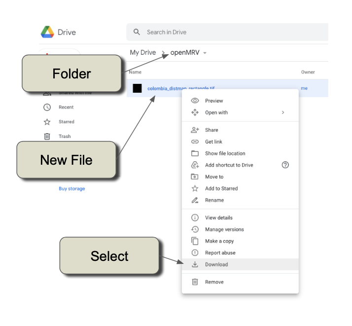

Démarrez QGIS (ou tout autre logiciel similaire de type SIG pouvant visualiser des images au format GeoTIFF) et chargez le fichier. 

Nous recommandons de visualiser le fichier une couche à la fois.  Vous trouverez ci-dessous un exemple de visualisation de la première couche - '"Year of detection, ou "yod".  Nous avons utilisé une palette de couleurs pour montrer la perturbation de 1999 à 2020 :  


##### Examiner l'année et le degré de perturbation 

Comme nous pouvons zoomer, faire un panoramique et comparer les couches facilement dans les QGIS sans avoir à attendre le rendu GEE, il est possible d'examiner les motifs et d'améliorer potentiellement notre cartographie.
En chargeant à nouveau la carte des perturbations comme une couche séparée, nous pouvons utiliser l'option "Symbologie" dans QGIS pour sélectionner l'ampleur de la perturbation. En naviguant dans l'image, notez la présence continue de rayures près du centre inférieur de la zone d'étude.  En zoomant sur cette zone et en basculant entre Année et Ampleur, on voit qu'une grande partie de la perturbation qui semble être du bruit est en fait de faible amplitude (voir la figure ci-dessous).  

> Notez que la grandeur est exprimée dans les unités de l'indice utilisé pour la segmentation temporelle.  Nous avons utilisé l'indice NBR pondéré, qui va de -1000 à +1000. 


Sur la base de cette simple évaluation de l'année de détection, le seuil de modification de la carte a pu être modifié pour être fixé à 200 au lieu de 100, comme c'était le cas dans le paramètre "changeParams.mag" de l'exportation originale. 

## 5 La bibliothèque Javascript de LandTrendr 

L'interface utilisateur graphique LandTrendr (section 3) et le script JavaScript (section 4) s'appuient tous deux sur les fonctions de la bibliothèque JavaScript LandTrendr pour réaliser toutes les étapes importantes du processus de détection des changements.  Bien qu'une connaissance détaillée des fonctions ne soit pas nécessaire pour utiliser ces deux outils, nous recommandons à la plupart des utilisateurs de développer une compréhension de base des hypothèses encapsulées dans ces fonctions, car cela aide à comprendre où la cartographie peut se tromper.  De plus, les utilisateurs avancés voudront accéder à ces fonctions pour les ajuster ou les personnaliser.  Ainsi, les sections suivantes détaillent les éléments de base des bibliothèques LandTrendr sur GEE. 

### 5.1 Importation de la bibliothèque LT Javascript

La bibliothèque LT Javascript s'améliore régulièrement, mais par souci de cohérence, nous avons fourni une copie de la version de travail actuelle aux utilisateurs de la Banque mondiale.  Comme indiqué ci-dessus, l'importation de la bibliothèque se fait avec ce code :

```javascript
var ltgee = require('users/openmrv/MRV/ChangeDetection/LandTrendr_V2.4WB.js'); 
```

Par la suite, toutes les fonctions de cette bibliothèque sont référencées avec le nom de la bibliothèque suivi du nom de la fonction, avec un "point" comme séparateur (par exemple, appeler la fonction "runLT" avec <arguments> serait traité:`var lt=ltgee.runLT(<arguments>)`). 

Les utilisateurs qui le souhaitent peuvent consulter les versions de développement de la bibliothèque qui se trouve sur le site GEE du laboratoire eMapR: `/users/emaprlab/public:Modules/LandTrendr.js`

### 5.2  Segmentation temporelle LandTrendr

La segmentation temporelle est au cœur de toutes les exécutions de LandTrendr (LT), dans laquelle la trajectoire temporelle de chaque pixel est divisée en segments de ligne droite séparés par des sommets.  Cette fonction fait partie de la bibliothèque d'algorithmes GEE: `ee.Algorithms.TemporalSegmentation.LandTrendr`.  

Bien que l'appel à cet algorithme soit simple, une étape clé implique généralement un effort considérable : la création de la collection d'images sur laquelle l'algorithme est appliqué.  Il est typique d'envelopper l'algorithme de segmentation temporelle de base dans une fonction qui construit la collection d'images en fonction des caractéristiques d'intérêt : les capteurs impliqués, les fenêtres de temps utilisées, etc.    

Dans la mise en œuvre prévue ici, la fonction d'emballage est appelée**runLT**".  Il s'appelle comme suit : : 

```javascript
var lt = ltgee.runLT(startYear, endYear, startDay, endDay, aoi, index, [], runParams, maskThese);
```

#### 5.2.1 Les arguments de la fonction runLT

Un bref traitement de chaque argument suit. 

##### **Fenêtres temporelles** (**Temporal windows**)

Les variables `startYear` et `endYear` sont des variables numériques qui définissent la période pour laquelle une collection d'images sera construite.  Le simple fait de définir ces années ne garantit pas que les images de toutes les années soient disponibles ; en effet, dans de nombreuses régions du monde, il y a des lacunes dans les archives Landsat.  Si, par exemple, votre région ne dispose pas d'images avant 1999, le fait de fixer l'année de départ à 1984 ne fera pas planter l'algorithme, mais il commencera sa série chronologique en 1999.  

Les variables `startDay` et `endDay` sont des chaînes de dates qui définissent les périodes de chaque année à partir desquelles on peut construire des images composites. Elles sont définies en utilisant le format GEE avec deux chiffres pour le mois et le jour séparés par un trait d'union, par exemple `04-01` correspond au 1er avril.  

La composition d'images est effectuée en utilisant la stratégie médoïde (discutée plus en détail ci-dessous) et donne une image par an à partir de la période indiquée par ces dates. 

##### **Zone d'intérêt** (**Area of interest**)

L'argument `aoi` est une variable correspondant à une `ee.FeatureCollection` qui définit la région géographique d'intérêt pour le traitement.  

La définition d'une telle variable de collection de caractéristiques à partir d'un actif GEE est réalisée avec une déclaration telle que la suivante : 

```javascript
var aoi = ee.FeatureCollection('users/openmrv/MRV/ColombiaRectangle');
```

##### **Arguments relatifs au spectre**

La variable `index` est une chaîne de caractères qui correspond à l'un des indices spectraux définis dans la routine `calcIndex` de la bibliothèque Javascript LandTrendr.  

Actuellement, les indices suivants sont inclus : 

| Nom de l'index         | Description                                                  |
| ---------------------- | ------------------------------------------------------------ |
| B1, B2, B3, B4, B5, B7 | Valeurs de réflectance de la carte thématique Landsat avec des numéros de bande correspondant aux labels de bande des instruments Landsat 5 et 7.  Ainsi, B4 est la bande du proche infrarouge et B5 est la bande infrarouge à ondes courtes centrée à environ 1,65 micromètre.  Les images de Landsat 8 (OLI) sont renommées pour être cohérentes avec les conventions d'appellation de Landsat 5 et 7. |
| NBR                    | Rapport de feux normalisé NBR, défini comme (NIR-SWIR2)/(NIR+SWIR2), où NIR est le proche infrarouge et SWIR2 la deuxième bande infrarouge à ondes courtes (centrée à près de 2,2 micromètres) de Landsats 5, 7 et 8. |
| NDMI                   | Indice d'humidité de différence normalisée, défini comme (NIR-SWIR1)/(NIR+SWIR1) |
| NDVI                   | NDVI défini comme (NIR-Rouge)/(NIR+Rouge), où "Rouge" est la bande de réflectance rouge de Landsats 5 et 7. |
| NDSI                   | Indice normalisé de différence de neige, défini comme (Green-SWIR1)/(Green+SWIR1) |
| TCB, TCG, TCW          | Tasseled-cap La brillance, la verdeur et l'humidité du bouchon sont calculées à l'aide de la réflectance                                                                                                                                les coefficients de Landsat 5 tels que documentés à l'origine par Crist (1985).  Voir la variable `tcTransform` dans la bibliothèque Javascript de LandTrendr. |
| TCA                    | L'"angle" de Tasseled-cap, défini comme l'angle entre TCB et TCG.  Défini à l'origine par Powell et al. (2010) ; une valeur plus élevée indique plus de végétation. |

La variable `index` est suivie d'une variable de liste qui comprend une liste d'indices spectraux pour lesquels la stratégie "fit to vertex" (FTV) serait employée.  L'approche FTV n'est pas nécessaire pour la détection de base des changements, mais peut être utilisée pour la cartographie de la couverture terrestre.  Pour plus de détails, voir Kennedy et al. (2018).  Pour laisser la variable en blanc, utilisez la liste vide comme suit : `[]`.

##### **Paramètres d'ajustement**

L'algorithme LT est contrôlé par l'ajustement des paramètres décrits à la section 3.5.1 ci-dessus.  La variable `runParams` est un objet du dictionnaire qui est défini dans le script appelant.  Un exemple dans le script LandTrendr Greatest Disturbance est le suivant : 

```javascript
var runParams = { 
  maxSegments:            8,
  spikeThreshold:         0.9,
  vertexCountOvershoot:   3,
  preventOneYearRecovery: false,
  recoveryThreshold:      0.75,
  pvalThreshold:          0.05,
  bestModelProportion:    0.75,
  minObservationsNeeded:  6
};
```


##### **Masking**

Lors de la constitution des collections d'images qui sont transmises à l'algorithme, différents types de conditions peuvent être signalés et masqués.  La variable `maskThese` est une liste avec des chaînes de caractères pour indiquer les types de conditions à signaler.  

Dans la bibliothèque Javascript LandTrendr, ces conditions sont gérées dans la fonction `getSRcollection`.  Les options suivantes sont valables.

| Code du masque                     | Description                                                  |
| ---------------------------------- | ------------------------------------------------------------ |
| 'water', 'shadow', 'snow', 'cloud' | De la bande QA de l'imagerie Landsat.                        |
| 'waterplus'                        | Utilise la couche "récurrence" de l'actif "JRC/GSW1_1/GlobalSurfaceWater" dans GEE ; les récurrences supérieures à 99 % seront masquées. Voir "https://storage.googleapis.com/global-surface-water/downloads_ancillary/DataUsersGuidev2.pdf" pour plus d'informations sur cette ressource. |
| 'nonforest'                        | Utilise le produit à résolution de 100 m du Copernicus Global Land Service (CGLS) pour masquer les zones non forestières.  Si vous utilisez ce masque, vous limiterez LandTrendr aux zones définies comme forestières par ce produit. |

##### **Réglages implicites**

En gérant la construction des collections d'images, la fonction `runLT` simplifie l'appel de la fonction LT.  

Cependant, avec la simplification vient l'hypothèse.  Les hypothèses suivantes sont implicites dans l'appel à la fonction : 

- Les capteurs Landsat 5-8 seront utilisés
- La réflectance de Landsat 8 sera transformée en domaines de réflectance de Landsats 5 et 7
- Le masquage des nuages et des ombres sera traité en se référant à la couche d'assurance qualité de l'imagerie Landsat, qui est elle-même basée sur l'algorithme CFMask
- La composition d'images sera traitée par une stratégie de composition de médicaments (décrite ci-dessous)

Les utilisateurs peuvent souhaiter modifier ces hypothèses.  

Des changements mineurs peuvent être réalisés en faisant une copie locale de la bibliothèque Javascript LT et en adaptant le code pour mettre en œuvre les changements.  Par exemple, les utilisateurs peuvent souhaiter éviter d'utiliser l'imagerie Landsat 7 (bien que cela ne soit généralement pas recommandé), et pourraient simplement commenter une ligne de code qui construit la collection Landsat 7 originale (voir la section 5.3 ci-dessous).  Ou encore, un utilisateur peut vouloir ajouter des indices spectraux sur lesquels une segmentation temporelle peut être construite : là encore, cela pourrait être réalisé avec une mise à jour relativement mineure en ajoutant du code pour l'indice qui l'intéresse. 

> N'oubliez pas que si vous créez votre propre bibliothèque locale LandTrendr Javascript, vous devrez appeler cette bibliothèque locale dans tous les scripts ultérieurs ! 

Des changements majeurs peuvent être réalisés en échangeant des modules entiers pour créer des collections d'images.  Par exemple, il est concevable qu'un utilisateur veuille appliquer l'algorithme LandTrendr à l'imagerie radar de Sentinel 2.  Dans ce cas, presque tous les aspects de la construction de la collection d'images devraient être modifiés.  Dans ce cas, un utilisateur peut vouloir simplement utiliser la bibliothèque comme guide structurel pour la création d'une bibliothèque différente.  

### 5.2.2 Constructing image collections

La fonction `runLT` prend les paramètres passés par l'utilisateur pour construire des collections d'images qui sont passées à l'algorithme LT. 

Deux étapes séquentielles sont nécessaires. Tout d'abord, la fonction `buildSRcollection` déclenche une cascade de fonctions pour construire une collection de réflectance de surface annuelle, composée, masquée et multivariée. Ensuite, la fonction `buildLTcollection` traduit cette collection sous la forme nécessaire pour appeler l'algorithme de segmentation LT.  Chaque fonction appelle d'autres sous-fonctions.  Un traitement détaillé de chaque aspect de ces bibliothèques dépasse le cadre de ce matériel de formation, mais des aperçus de la logique de base donnent aux utilisateurs un aperçu des décisions clés traitées par les algorithmes. 

##### Fonctions pour construire une collection d'images composites

La fonction `buildSRcollection` analyse les données saisies par l'utilisateur, puis passe en boucle toutes les années de la collection, en appelant la fonction `buildMosaic` chaque année pour créer une collection d'images avec une seule image par an. 

L'objectif principal de la fonction `buildMosaic` est d'appeler la fonction `getCombinedSRcollection` pour construire une collection multi-capteurs d'images Landsat de réflectance de surface pour une seule année, puis d'utiliser la fonction `medoidMosaic` pour créer une image composite pour cette année.  

Pour créer la collection d'images de réflectance de surface, la fonction `getCombinedSRcollection` appelle la fonction `getSRcollection` séparément pour le cartographe thématique Landsat 5, le cartographe thématique amélioré Landsat 7+ et l'imageur opérationnel Landsat 8, puis fusionne les collections. 

Ainsi, pour comprendre d'où viennent les valeurs des images, **il faut comprendre la fonction de base** :  la `getSRcollection`.  Cette fonction d'environ 80 lignes de code GEE filtre l'ensemble de la collection Landsat à la période appropriée, applique des coefficients de correction à l'imagerie Landsat 8 pour harmoniser la réflectance avec les capteurs précédents, et applique les masques définis par l'utilisateur (voir ci-dessus). 

Certaines décisions clés sont encapsulées dans ce code :

- Les fenêtres de date peuvent s'étendre du 1er janvier, l'année d'enregistrement du composite étant enregistrée à l'année du point final de la fenêtre.  Ainsi, si la fenêtre de date est donnée de "11-01" à "03-31" et que l'année s'étend de 1990 à 2020, l'année de la première image composite sera 1990.  Il est important de noter que cela signifie que les images de novembre et décembre 1989 seront utilisées pour créer l'image composite.  
- L'harmonisation utilise les coefficients publiés dans le tableau 2 de Roy et al. (2016) pour convertir les bandes de réflectance de Landsat 8 dans le même domaine spectral que Landsat 7. Notez cependant que les fenêtres des bandes de Landsat 8 ne sont pas identiques à celles de Landsat 5 et 7 -- en particulier dans la fenêtre du proche infrarouge -- et qu'une certaine différence résiduelle de mesure est inévitable.  En outre, certains utilisateurs peuvent préférer procéder à l'harmonisation dans le sens inverse, en faisant entrer les Landsat 5 et 7 dans le domaine de Landsat 8. Un tel changement pourrait se produire à ce stade du code. 
- Le masquage est une décision cruciale dans le flux de traitement des images.  Ici, nous avons choisi d'utiliser la bande d'assurance qualité de l'imagerie Landsat pour la plupart des masquages. Toutefois, dans certaines situations, le produit de récurrence de l'eau du CCR ou le produit de couverture terrestre globale de Copernicus peuvent être utiles, et servent de modèle pour la façon dont un utilisateur avancé pourrait ajouter un type de code de masquage supplémentaire. 
- La composition est réalisée par l'approche médiane, qui n'est pas la même qu'une composition médiane.  L'approche medoid examine toutes les valeurs non masquées pour chaque pixel, calcule la valeur médiane mathématiquement, mais identifie ensuite l'observation réelle du pixel (c'est-à-dire l'image spécifique de la collection de l'année) qui est la plus proche de la médiane dans l'espace spectral *n-* dimensionnel.   Ainsi, la méthode tend vers la valeur spectrale représentative, mais utilise les observations d'une image réelle (plutôt une valeur artificielle calculée comme la médiane de chaque bande).  D'autres approches de composition existent, et les utilisateurs avancés peuvent insérer ou échanger leur méthode favorite pour la composition de la médiane à ce stade du code. 

#### Fonctions permettant de convertir les collections d'images en entrées LT-ready

Une fois la collection d'images construite, la fonction "runLT" doit ensuite la convertir en une série chronologique univariée pour la segmentation. Pour la plupart des utilisations, il s'agit simplement de calculer l'indice spectral souhaité, et cela est géré par la fonction "buildLTcollection".  Pour les utilisations avancées qui nécessitent une stabilisation temporelle en utilisant l'approche de l'ajustement au sommet (FTV), ces bandes peuvent également être passées à la même fonction. 5.2.3 Calling the core LT-GEE algorithm

#### 5.2.3 Calling the core LT-GEE algorithm

L'algorithme de base de la segmentation temporelle LandTrendr est accessible dans GEE en utilisant ce format :

```javascript
ee.Algorithms.TemporalSegmentation.LandTrendr(runParams);
```

`runParams` est un objet de dictionnaire avec les paramètres d'ajustement LT, ainsi que la série temporelle des valeurs d'image dans un ensemble d'entrées avec cette commande :

`runParams.timeSeries = annualLTcollection;`

où la `annualLTcollection` est la collection de valeurs univariées calculées comme décrit à la section 5.2.2.

Comme indiqué dans la section 1.3 ci-dessus, la sortie de l'appel à l'algorithme LandTrendr de base dans GEE est un tableau d'images.  La section suivante décrit la fonction `ltgee` qui peut être utilisée pour convertir ce tableau d'images en une carte de perturbation (ou de récupération).

## 5.3 Cartographie des perturbations

Comme décrit dans la section 3.5 ci-dessus, la cartographie des perturbations est réalisée par des requêtes sur les vertices qui résultent de l'ajustement LT.  Dans l'interface graphique ou la cartographie par script, la cartographie est traitée par un appel à la fonction`ltgee.getChangeMap` : 

```javascript
var changeImg = ltgee.getChangeMap(lt, changeParams);
```

La variable `lt` est l'image du tableau qui émerge de l'appel `ltgee.runLT`, et l'objet `changeParams` est un dictionnaire noté dans la section 4.2.1 ci-dessus et répété ici pour plus de commodité : 

```javascript
var changeParams = {
  delta:  'loss',
  sort:   'greatest',
  year:   {checked:true, start:1990, end:2020},
  mag:    {checked:true, value:100,  operator:'>'},
  dur:    {checked:true, value:4,    operator:'<'},
  preval: {checked:true, value:300,  operator:'>'},
  mmu:    {checked:true, value:11},
  
};
```

Ci-dessous, nous décortiquons comment la fonction `getChangeMap` traduit un objet LT en cartes de perturbations. La séquence générale est la suivante : 

- Extraire les informations sur les segments à partir des informations sur les sommets
- Identifier le segment cible en fonction des caractéristiques souhaitées
- Construire une image avec des couches correspondant à l'année du changement, à l'ampleur du changement, etc. 
- Filtrer par l'année cible, la magnitude, la durée et les valeurs de pré-changement
- Filtrer par unité cartographique minimale de pixels adjacents

### 5.3.1 Extraction de l'information par segment

La première étape de la fonction `getChangeMap` consiste à traduire les informations de vertex en informations de segment. Ceci est géré par la fonction `getSegmentData` :

```javascript
var segInfo = getSegmentData(lt, changeParams.index, changeParams.delta);
  changeParams.segInfo = segInfo;

```

> Notez que le fichier `changeParams.index` n'a généralement pas besoin d'être saisi manuellement par l'utilisateur, puisqu'il peut être configuré par programme pour correspondre à l'index utilisé lors de l'appel précédent à LT. 

Pour comprendre comment l'information de vertex est traduite en information de segment, considérez que chaque segment est délimité par deux sommets. Le caractère du segment lui-même est décrit par l'année et la valeur spectrale du sommet de départ (la condition "avant changement"), l'année et la valeur spectrale du sommet de fin (la condition "après changement"), ainsi que par la différence de temps entre les sommets limitrophes (la "durée") et la différence de valeur spectrale des sommets limitrophes (la "magnitude").  Ainsi, pour construire des informations sur les segments, nous devons considérer les caractéristiques des deux sommets individuels à chaque extrémité du segment, ainsi que les relations entre eux.  Ceci est réalisé par une série de manipulations de tableaux des informations sur les sommets renvoyées par l'algorithme LT dans l'objet LT. 

Comme indiqué dans la section 1.3.1, l'objet LT renvoyé par la fonction LT est au moins une image à deux bandes par pixel. La première bande est appelée la bande "LandTrendr", et est elle-même un tableau de taille 4 x *n*, où *n* est le nombre d'années dans la série temporelle. La deuxième bande est un scalaire représentant la moyenne quadratique totale (RMSE) de l'ajustement. Une troisième bande facultative apparaît si l'utilisateur a transmis des données pour le processus de TVF ; nous ne traitons pas cette troisième bande ici.  

La traduction des informations sur les sommets en opérations de segments se concentre sur la bande 4 x *n* LandTrendr de l'objet LT. Le code complet est reproduit ici, avec des commentaires décrivant chaque morceau.  En bref, les sommets sont extraits de la ligne de sommets, puis convertis en deux listes de sommets (`leftList` et `rightList`), l'une décalée par rapport à l'autre. Ces listes sont ensuite manipulées pour obtenir les résultats souhaités.  

```javascript
var ltlt = lt.select('LandTrendr');          // sélectionnez la bande LandTrendr
  var rmse = lt.select('rmse');               // Sélectionnez la bande rmse
  
	// slice out the 'Is Vertex' row - yes(1)/no(0)
	var vertexMask = ltlt.arraySlice(0, 3, 4);     
		
	// use the 'Is Vertex' row as a mask for all rows
  var vertices = ltlt.arrayMask(vertexMask);     
		
	// slice out the vertices as the start of segments
  var leftList = vertices.arraySlice(1, 0, -1);    
	
	// slice out the vertices as the end of segments
  var rightList = vertices.arraySlice(1, 1, null);

  // get year dimension of LT data from the segment start vertices
	var startYear = leftList.arraySlice(0, 0, 1);    

  // get spectral index dimension of LT data from the segment start vertices
	var startVal = leftList.arraySlice(0, 2, 3);     

  // get year dimension of LT data from the segment end vertices 
	var endYear = rightList.arraySlice(0, 0, 1);     

  // get spectral index dimension of LT data from the segment end vertices
	var endVal = rightList.arraySlice(0, 2, 3);      

  // subtract the segment start year from the segment end year to calculate the duration of segments 
	var dur = endYear.subtract(startYear);       

	// substract the segment start index value from the segment end index value to calculate the delta of segments
  var mag = endVal.subtract(startVal);         

	// calculate the rate of spectral change  
  var rate = mag.divide(dur);   

	// make mag relative to fit rmse
  var dsnr = mag.divide(rmse);              
```

L'utilisateur avancé est renvoyé à un traitement détaillé de la manière d'interpréter et de manipuler les données relatives aux sommets, qui figure dans la [section 5 du guide LT-GEE GitHub](https://emapr.github.io/LT-GEE/lt-gee-outputs.html)

##### Filtrage par perte ou gain

Une fois que les caractéristiques de chaque segment ont été calculées, la routine `getSegmentData` filtre ensuite ces segments selon que l'utilisateur demande une "perte" ou un "gain" de végétation (via la variable de chaîne `changeParams.delta`). La direction du changement associée à ces segments dépend de l'indice spectral.  Pour les indices tels que le NDVI, le NBR ou la verdeur de la calotte de Tasseled, une réduction de la valeur de l'indice est associée à une perte de végétation.  Pour les indices tels que la bande SWIR1 ou l'indice de luminosité Tasseled-cap, une *augmentation* de la valeur de l'indice est associée à une perte de végétation.  

La direction du changement est définie dans la fonction `indexFlipper`. Comme l'algorithme LandTrendr a été défini à l'origine en utilisant la bande SWIR1, la fonction indexFlipper attribue un 1 positif à la bande SWIR1 et aux bandes similaires, et un 1 négatif (-1) aux indices tels que le NDVI.  Les parties pertinentes de la fonction sont reproduites ici à titre de référence : 

```javascript
var indexFlipper = function(index){
  var indexObj = {'NBR':-1,'NDVI':-1,'NDSI':-1,'NDMI':-1,  
                  'TCB':1,'TCG':-1,'TCW':-1,'TCA':-1,
                  'B1':1,'B2':1,'B3':1,'B4':-1,'B5':1,'B7':1};
  return indexObj[index];
};
```

Notez que pour certaines bandes, la direction du changement de la végétation n'est pas facilement réduite à une seule direction de changement : pour le NDSI, l'expérience suggère que cet indice se comporte de manière ambiguë pour le changement de la végétation.  

##### Résultats

Le résultat de l'appel à `getSegmentData` est un `ee.Array` avec les lignes suivantes : 

| Rang | Nom       | Description                                                  |
| ---- | --------- | ------------------------------------------------------------ |
| 0    | startYear | Première année *après* l'année du vertex au début du segment* |
| 1    | endYear   | Année du vertex à la fin du segment                          |
| 2    | startVal  | Valeur de l'indice du vertex au début du segment             |
| 3    | endVal    | Valeur de l'indice du vertex à la fin du segment             |
| 4    | mag       | La variation de la valeur spectrale du début à la fin        |
| 5    | dur       | La durée (en années) du segment                              |
| 6    | rate      | La magnitude divisée par la durée                            |
| 7    | dsnr      | Magnitude mesurée par la RMSE de l'ajustement global.        |

Chaque ligne contient autant de colonnes qu'il y a de segments qui répondent au critère de perte ou de gain.  Ces informations sont ensuite utilisées pour identifier le segment cible pour la cartographie

> *NOTE : Le vertex au début d'un segment n'a pas encore subi de changement. Ainsi, par convention, nous considérons que la première année *après* le vertex est la première fois que le changement est évident pour le segment.  Pour la cartographie des perturbations brusques, cela signifie que l'année de détection sera correctement marquée comme l'année à laquelle le déclin d'un indice spectral est noté.

#### 5.3.2 Identifier le segment ciblé

Comme indiqué à la section 3.5, la cartographie exige qu'un seul segment soit identifié. Comme il y a souvent plus d'un segment de perte ou de gain, nous devons identifier le segment à cibler pour la cartographie. En outre, nous souhaitons souvent ignorer les segments qui ne dépassent pas des seuils spécifiques, par exemple en ce qui concerne le moment, la durée ou l'ampleur du changement.  Les différentes caractéristiques de chaque segment peuvent être utilisées pour déterminer s'il est le plus approprié pour la cartographie.  

Dans la fonction `getChangeMap`, l'identification du segment cible est traitée en deux grandes étapes. Tout d'abord, le `ee.Array` renvoyé par l'appel à `getSegmentData` est trié en fonction de l'ampleur, du moment ou de la durée du segment, et le résultat le mieux classé est identifié comme étant le segment cible.  Ensuite, ce segment cible est filtré en fonction de seuils numériques.  

##### Triage

L'étape de tri permet d'évaluer les segments en fonction de plusieurs caractéristiques. Un cas d'utilisation courant serait de rechercher le segment de perturbation (avec "perte") qui a eu la plus grande magnitude de changement spectral, car cela peut indiquer la perturbation la plus grave subie par le pixel.  On peut aussi s'intéresser au segment qui a connu une croissance végétative ("gain") pendant la plus longue période.  Ou encore, nous pouvons nous intéresser uniquement à la perturbation la plus récente.  Chacun de ces éléments peut être exprimé sous la forme d'un classement de magnitude ou de temps du segment, et ils sont stockés dans la variable `changeParams.sort`.  Les descriptions des critères de tri saisis dans cette variable sont fournies ci-dessous. 

| Name             | Description                                                  |
| ---------------- | ------------------------------------------------------------ |
| greatest, least  | Cible le segment présentant le changement le plus significatif (ou le moins significatif) |
| newest, oldest   | Cible le segment qui s'est produit le plus récemment (ou le plus longtemps). |
| fastest, slowest | Le segment le plus important avec la durée la plus courte (la plus longue) |

A la fin du tri, une seule image avec plusieurs bandes est produite avec la commande suivante : 

```javascript
var distImg = ee.Image.cat(distArray.arraySlice(0,0,1).arrayProject([1]).arrayFlatten([['yod']]).toShort(),                           distArray.arraySlice(0,4,5).arrayProject([1]).arrayFlatten([['mag']]).toShort(),
                           distArray.arraySlice(0,5,6).arrayProject([1]).arrayFlatten([['dur']]),
                           distArray.arraySlice(0,2,3).arrayProject([1]).arrayFlatten([['preval']]),
                           distArray.arraySlice(0,6,7).arrayProject([1]).arrayFlatten([['rate']]),
                             distArray.arraySlice(0,7,null).arrayProject([1]).arrayFlatten([['dsnr']]));

```


Ces bandes sont dérivées d'un sous-ensemble des valeurs du `ee.Array`.    Les descriptions suivent celles qui sont indiquées au point 5.3.1 ci-dessus, avec "yod" remplacé par "startYear" et "preval" par "startVal".  Pour rappel, la variable "yod" n'est pas l'année du sommet au début du segment, mais plutôt cette année *plus un*, pour refléter le fait que le changement de direction du segment n'est évident qu'après qu'une année se soit écoulée depuis le sommet initial. 

##### Filtrage et seuil

L'image après tri est adaptée à la cartographie si vous le souhaitez, chaque bande étant affichée séparément.  Cependant, nous souhaitons généralement filtrer davantage la carte en fonction de critères du processus de changement.  Une fois que le segment cible a été identifié et qu'une image provisoire a été produite, les étapes du `getChangeMap` peuvent être utilisées pour filtrer la carte et en définir le seuil. 

Ces étapes comprennent le filtrage par `yod`, par `mag` et par `dur`.  Par exemple, les récoltes forestières pourraient être ciblées en choisissant uniquement les changements qui dépassent un seuil de magnitude de changement, qui sont de courte durée, et qui ont une valeur de pré-perturbation supérieure à une certaine valeur. 

En outre, le filtre `mmu` permet de supprimer les groupes de pixels plus petits que la valeur indiquée par la valeur `mmu` (en pixels).   Les groupes de pixels sont ceux qui partagent le même `yod`.   

##### Sorties

Le résultat de la fonction `getChangeMap` est l'image de la perturbation avec les couches notées dans la section 4 ci-dessus. 

## 6 Autres exemples : Mozambique et Cambodge

Lors de la mise en œuvre de la détection des changements des forêts LandTrendr dans une nouvelle zone, les mêmes questions décrites dans la section 3 ci-dessus doivent être prises en compte.  Il s'agit notamment des points suivants

- La profondeur historique de l'imagerie Landsat
- Plages de dates intra-annuelles utilisées pour construire des images composites
- Pertinence d'un indice spectral donné pour les types de forêts concernés
- Processus de changement d'intérêt

### 6.1 Mozambique

Dans la phase initiale de prospection pour travailler dans un nouveau domaine, nous recommandons d'utiliser l'interface graphique LandTrendr décrite dans la section 3 ci-dessus. 

#### 6.1.1 Charger une zone d'étude du Mozambique dans le GUI LandTrendr

Voyons ce que fait LandTrendr au Mozambique. Pour rappel, trouvez et ouvrez le script nommé **OpenMRV_français/Part2/ LandTrendr_fr/LT-GEE-Vis-DownLoad-app_WB_v1.0_fr** depuis la bibliothèque openMRV sur GEE.

Une fois chargé et exécuté, le script affiche par défaut la carte de la Colombie. Vous pouvez utiliser le navigateur de carte pour naviguer manuellement vers différentes parties du globe. Ou, si vous prévoyez de vous rendre régulièrement à un autre endroit, *faites une copie locale du script* et changez la ligne 1341 du script de :

```javascript
map.setCenter(-75, 3, 6);  //set default center of map to Colombia
```

à un autre point central.  Notez que le format des arguments passés à `map.setCenter` sont `(<longitude, latitude, zoom level>)`.  Voir la documentation GEE pour comprendre les niveaux de zoom.  

Pour les besoins de ce document, nous avons délimité une simple zone d'étude au Mozambique dans laquelle une première exploration peut avoir lieu. Dans la section "Superposition des actifs" de l'interface graphique, faites en sorte que le premier actif `users/openmrv/MRV/MozambiqueArea`

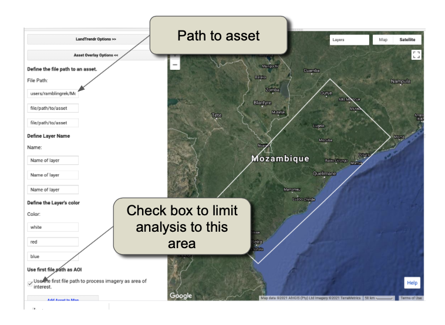

#### 6.1.2 Délimitation des fenêtres de dates

Comme toujours, nous recherchons des fenêtres de date saisonnières qui soient suffisamment larges et chronométrées pour maximiser le changement de la recherche de pixels clairs la plupart des années, mais qui soient suffisamment étroites pour éviter une trop grande variabilité phénologique dans la fenêtre de date.  Un bon point de départ est de comprendre la saisonnalité des précipitations. 

Selon cette présentation utilisant des données satellites résumées pour le Programme alimentaire mondial (https://docs.wfp.org/api/documents/WFP-0000108186/download/), la saison des pluies au Mozambique est d'environ octobre à mai.  Ainsi, un point de départ raisonnable pour une fenêtre de dates est le 1er mai au 15 octobre.  De plus, en l'absence de connaissance *priori* de la profondeur des archives d'images Landsat en un endroit donné, il est raisonnable de commencer une enquête avec une année de départ dans les années 1980 ou au début des années 1990.  Par souci de cohérence avec les autres parties de cette formation, nous suggérons de commencer par 1990.  

Pour évaluer, modifiez les options de la fenêtre de date LandTrendr pour qu'elle commence le 05-01 et se termine le 10-15 et la plage de l'année pour qu'elle s'étende de 1990 à 2020.  

> Vous pouvez également définir les paramètres d'ajustement à ceux utilisés en Colombie, ou d'autres selon votre préférence.  Les exemples ci-dessous ont été utilisé  Max Segments=8, Spike Threshold=0.9, Vertex Count Overshoot=3, Prevent One Year Recovery=true, Recovery Threshold=0.75, p-value Threshold=0.05, Best Model Proportion=0.75, Min Observations Needed=6


Ensuite, utilisez la visualisation des changements RGB pour avoir une idée rapide de l'ajustement et des anomalies de LandTrendr.  Si vous avez cliqué sur la case de traitement dans l'onglet "Chemin vers les actifs", allez ensuite dans l'onglet **Options de modification RGB**, sélectionnez les années pour les couches Rouge, Verte et Bleue, et cliquez sur "Ajouter une image RGB".  Pour rappel, voir la section 3.4 pour obtenir de l'aide sur l'interprétation des couleurs.

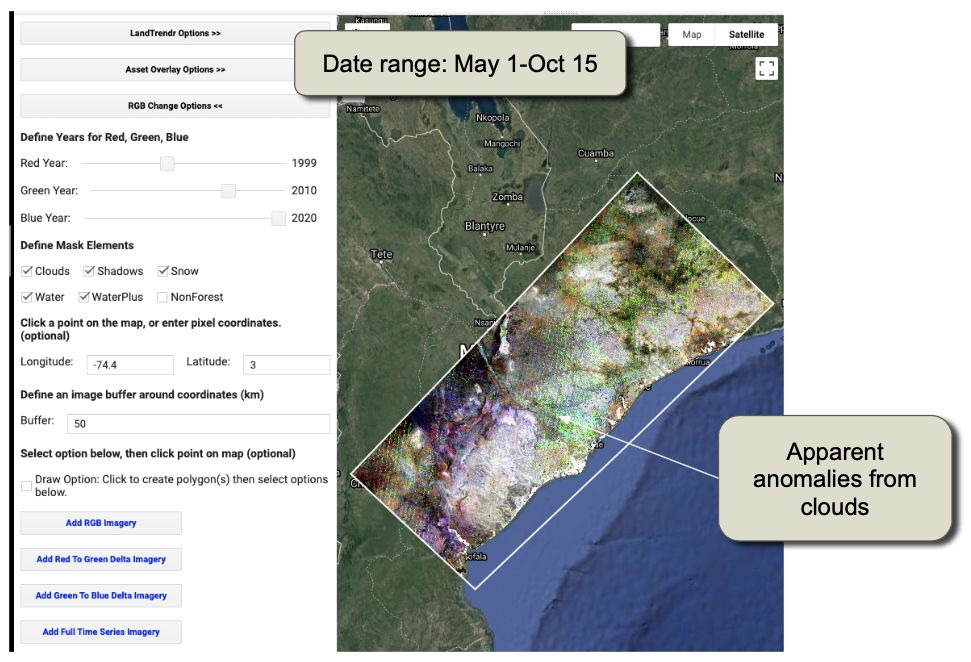

Les artefacts des nuages non masqués sont apparents sous forme de bandes vertes sans lien avec les motifs du paysage sous-jacent.  Lorsqu'un tel motif apparaît, il est probable que la fenêtre de date capture trop de nuages, et d'autres fenêtres doivent être explorées.  Rappelez-vous également que nous recherchons des fenêtres de date qui n'incluent pas une variabilité extrême de la phénologie de la végétation.  

En avançant légèrement les dates dans l'année, on obtient une pile RGB ajustée avec des modèles spatiaux de couleur qui suivent plus étroitement les caractéristiques réelles du paysage. En chargeant les images après la saison des pluies, il est également plus probable que les images capturées chaque année représentent la période d'apparition des feuilles par opposition à la phase de disparition des feuilles des arbres à feuilles caduques en période de sécheresse.


#### 6.1.3 Explorer les archives d'images et les mécanismes de changement

Avec l'image RGB en arrière-plan, considérez les dimensions temporelles du changement au Mozambique.  Nous cherchons à comprendre les modèles spatiaux de changement évidents dans l'image RGB, et vérifions que les archives d'images sont suffisantes pour la série initiale d'années d'imagerie.  L'interface "Pixel Time Series Options" est un excellent outil pour explorer ces questions. 

En zoomant sur la zone centrale de la zone d'étude montrée ci-dessus, nous voyons une riche variété de processus de changement se produire dans ce paysage.  Rappelez-vous que tout endroit qui ne se trouve pas sur l'échelle noir-gris-blanc est une zone qui semble avoir subi des changements. Là encore, consultez les directives d'interprétation des couleurs données à la section 3.4 ci-dessus.  Dans l'image RGB ci-dessous, nous voyons des zones de croissance (tons bleus) et divers types de perturbations (rouges, oranges, jaunes) et de perturbations avec une éventuelle repousse (magentas et violets). 

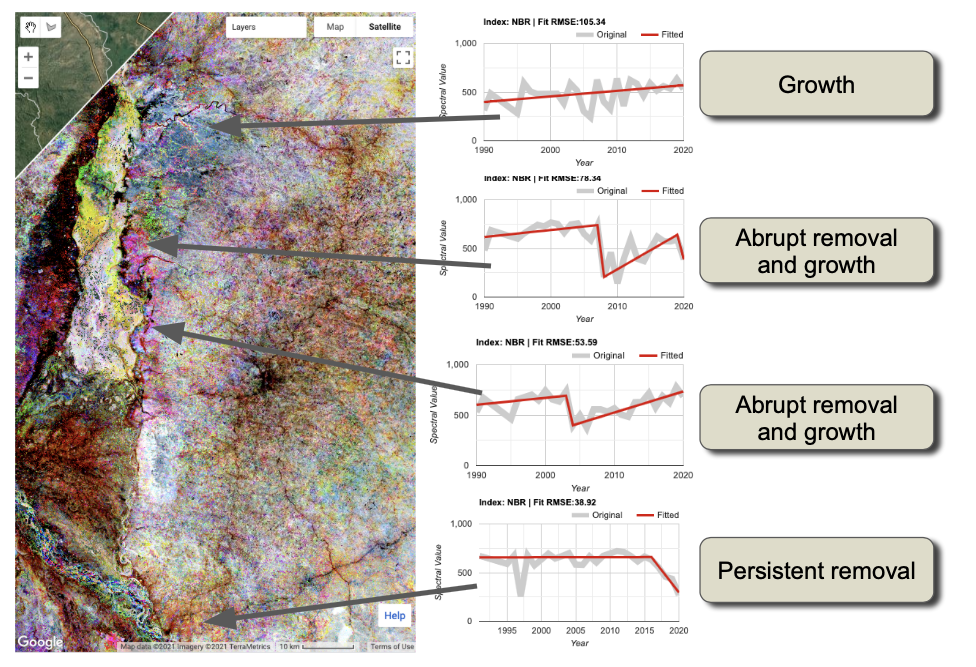

Pour les utilisateurs souhaitant consulter les détails des lieux ci-dessus, leurs informations sont ici : 

| Name                                | Longitude | Latitude   |
| ----------------------------------- | --------- | ---------- |
| La croissance                       | 35.441772 | -16.980938 |
| Perturbation et croissance abruptes | 35.370195 | -17.233946 |
| Croissance rapide des perturbations | 35.360358 | -17.093841 |
| La persistance de la suppression    | 35.460270 | -17.763119 |

La disponibilité d'images remontant à 1990 semble robuste, bien qu'un examen attentif de certaines données sources de séries chronologiques de pixels (les lignes grises) suggère des périodes de non-disponibilité intermittente des images au début des années 1990. Cependant, les premières années d'imagerie ne semblent pas introduire d'artefacts dans le RGB ou les séries temporelles. 

Par rapport au domaine de perturbation de notre premier exemple, la Colombie, les processus de changement dans cette zone d'étude du Mozambique sont très divers.  En plus du diagnostic **de perturbation et de régénération**, nous avons de nombreuses zones de **croissance**, probablement à cause de perturbations antérieures à la période d'observation.  

Nous voyons également de nombreux exemples de **perte lente de la végétation** sur plusieurs années.  La trajectoire inférieure de la figure ci-dessus en est un exemple, où il semble que les prélèvements ont commencé en 2016 environ et se sont poursuivis à un rythme mesuré jusqu'à la fin de l'enregistrement. Les processus à l'origine de ces modèles d'élimination de longue durée sont souvent plus énigmatiques que ceux qui provoquent des changements brusques.  Les modèles spatiaux peuvent cependant fournir des indices. Sur l'image ci-dessus, il semble que les tons jaunes et oranges se trouvent à proximité des routes (traits linéaires de noir, qui indiquent une végétation basse persistante) et des habitations. Cela suggère une cause humaine, par opposition à une cause strictement naturelle, par exemple liée à la sécheresse.  

Zoomons sur la région de Chimuara, près du bas de l'encart ci-dessus. Et, en plus d'utiliser le visualiseur RGB pour l'interprétation, nous ajouterons le changement de perturbation, mais modifierons les paramètres pour rechercher des perturbations qui ne sont PAS brusques -- qui ont une durée > 2 ans !  Ceci est réalisé dans l'interface graphique en changeant simplement l'opérateur de durée à ">" et la valeur à "2".  Cependant, avant cela, nous devons nous assurer que la fonction de cartographie des perturbations pointe vers le bon endroit -- allez dans les options de cartographie de changement RGB et réglez la Longitude et la Latitude sur la zone d'intérêt, puis allez dans les options de filtrage de changement et ajustez le filtrage de durée. 

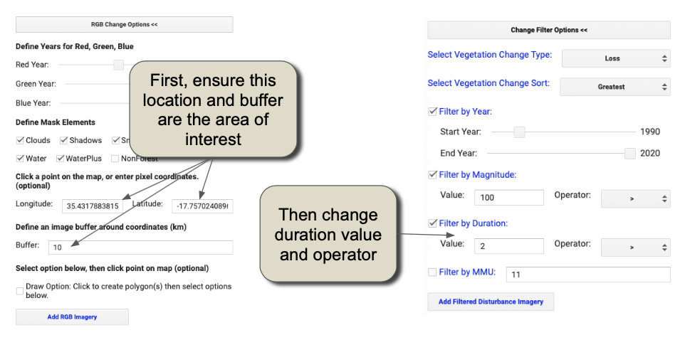

En considérant toutes ces couches, on constate que la lente dégradation est généralisée. Lorsque l'année de détection est précoce et que la durée est longue, cela suggère une perte de végétation longue et persistante.  Dans d'autres régions, nous constatons un changement de durée sur plusieurs années (mais pas sur plus de 20 ans). 

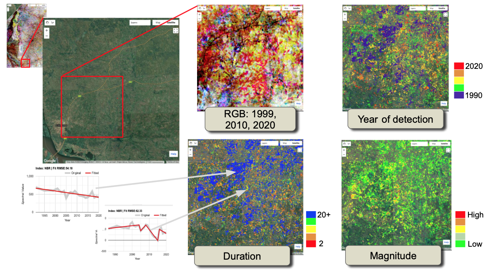

L'interprétation des processus à l'origine de ces modèles serait plus facile à réaliser en consultant des experts locaux, mais il semble qu'il s'agisse d'une pression à long terme, liée à l'homme, sur la forêt, peut-être liée à une extraction de bois de faible intensité mais continue. 

Les preuves de la déforestation provoquée anthropique semblent être plus nombreuses dans la région autour de la colonie de Nicuadala, où les processus d'abattage se déplacent vers l'extérieur en un anneau presque concentrique, loin de la zone centrale de la colonie. Les trajectoires d'enlèvement au début de la série chronologique semblent rester faibles et assez variables d'une année à l'autre, ce qui suggère une transition soutenue vers l'abandon de l'état boisé. 


### 6.2 Cambodge

Dans la section 6.1, nous avons abordé les sujets clés du passage de notre exploration initiale en Colombie à un nouveau lieu.  Ici, nous ne mettons en évidence que les questions qui diffèrent lors d'une exploration initiale de la cartographie des perturbations au Cambodge.  

#### 6.2.1. Zone d'étude et paramètres de l'image

Comme pour la Colombie et le Mozambique, nous avons mis à disposition une petite zone d'étude pour expérimenter les réglages d'images et de paramètres.  Le chemin vers l'actif GEE est : `users/openmrv/MRV/CambodgeArea`

En raison d'une saison des pluies différente, nous avons utilisé une fenêtre de dates allant du 01-01 au 04-01.  La disponibilité des images jusqu'en 1990 semble robuste. 

Un premier examen de l'imagerie RGB ajustée montre des zones de stabilité de la forêt (tons de gris) et de suppression substantielle (jaunes, rouges, magentas). 


#### 6.2.2 Processus de changement du paysage

Les processus de changement de paysage à l'œuvre au Cambodge diffèrent à nouveau de ceux de la Colombie et du Mozambique. 

En se concentrant d'abord sur la région sud-est de la zone d'étude, on constate l'existence de divers régimes de gestion forestière.  Les concessions forestières accordées à des entreprises en dehors du Cambodge ont conduit à des plantations d'arbres pour la fibre ou l'huile.  Ces régimes se distinguent à la fois dans le domaine temporel, où la couleur magenta indique que la disparition de la forêt d'origine est suivie d'une croissance rapide en blocs réguliers (magenta), et dans le domaine spatial, où les modèles de ces signaux temporels sont réguliers et délimités de façon linéaire.  Dans les domaines cyan, nous voyons également des preuves de la plantation de forêts dans des zones peu boisées au début de l'enregistrement d'observation.  Enfin, nous voyons en jaune les zones où la déforestation s'est produite avec peu de croissance forestière ultérieure ; dans de nombreux cas, ces zones sont trop proches de la journée en cours pour savoir s'il s'agit d'une véritable déforestation ou si elles seront reboisées. 


Dans la région plus éloignée près de Kaoh Piek sur la rivière Tonle San, nous voyons des zones de gestion forestière à plus petite échelle. Des preuves de récoltes multiples et d'une certaine déforestation sont visibles dans cette zone relativement petite. Là encore, les experts locaux pourraient fournir des informations sur les processus de conduite, mais la structure spatiale de la récolte et l'existence de récoltes multiples suggèrent que la gestion forestière est en cours et relativement stable dans toute la zone. 


De l'autre côté de la frontière, dans la province de Steung Treng, à l'ouest-nord-ouest de la zone précédente, nous trouvons une autre zone où la gestion forestière est active et à petite échelle. On y trouve des preuves d'incursions étendues mais de faible ampleur dans la forêt. 

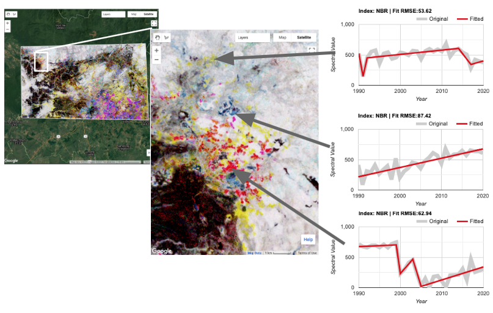

Comme pour la Colombie et le Mozambique, la segmentation temporelle pourrait être transformée en cartes de l'année de perturbation, de l'ampleur de la perturbation et de la durée de la perturbation. 

# 7 Foire aux questions

**Comment choisir les paramètres d'ajustement ?  Y a-t-il une approche automatisée ?**

Le choix des paramètres d'ajustement est l'une des préoccupations les plus courantes des nouveaux utilisateurs.  Nos exemples tout au long de ce tutoriel devraient fournir des indications, mais comme nous le notons, la combinaison spécifique de paramètres à utiliser pour une région donnée dépend probablement des particularités de l'archive d'images, des forêts et des processus de changement. 

Il est possible de développer un mécanisme de sélection robuste en référençant la segmentation à un ensemble de données de référence.  Dans la publication originale de LandTrendr (Kennedy et al 2010), nous avons testé l'impact des valeurs des paramètres en utilisant une analyse de sensibilité référencée à un échantillon d'entraînement dérivé indépendamment et collecté à l'aide de TimeSync, qui est un outil permettant aux interprètes de créer manuellement une segmentation temporelle (Cohen et al. 2010). 

Dans la pratique, cependant, aucun ensemble de paramètres d'ajustement et d'indices spectraux ne peut fonctionner aussi bien dans toutes les conditions d'un pays.  Il peut être souhaitable d'exécuter l'algorithme avec différents indices spectraux et différents paramètres d'ajustement.  Cohen et al (2018) décrivent une approche permettant d'exécuter l'algorithme plusieurs fois avec différents indices, et d'utiliser un ensemble de données de référence pour entraîner un modèle de forêts aléatoires à combiner les sorties dans une carte de perturbations d'ensemble. Ils constatent que l'ensemble est plus robuste que n'importe quel indice unique pour détecter les changements.  

Il n'existe actuellement aucun moyen automatisé de choisir les paramètres.  Cependant, nous continuons à travailler au développement de tels outils, et l'utilisateur intéressé est encouragé à suivre les développements sur le site GitHub de LT-GEE. 

**Je remarque davantage de problèmes avec les nuages et le bruit des images vers le début (ou la fin) de la série temporelle.   Pourquoi ?**

La puissance de toute méthode de séries temporelles réside dans sa capacité à exploiter de multiples observations pour examiner les modèles réels et faux.  Au milieu de la série temporelle, le bruit résiduel provoque des blips dans le signal source, mais comme ils reviennent à la "normale" après le blip, l'algorithme les comprend comme du bruit.  Cependant, pour les blips qui se produisent au début ou à la fin de la série temporelle, il n'y a pas de données au-delà du blip pour aider à déterminer si le bruit est réel ou non.  Ainsi, l'algorithme peut le plus souvent créer des faux positifs au début et à la fin de la série temporelle.  

**Il y a certains endroits où le bruit est persistant et où il n'y a pas de données.  Que puis-je faire ?**

La première option consiste à modifier la fenêtre de date envisagée pour la constitution des collections d'images.  Il est possible que vous ayez choisi une fenêtre de date qui est soit 1) plus centrée sur la saison des nuages, soit 2) trop étroite pour trouver des pixels sans nuages.  

Il est également possible que l'algorithme de masquage des nuages intégré ait été trop agressif, masquant les zones qui ne sont pas des nuages.  Cela peut parfois se produire sur des cibles constamment lumineuses comme la neige et la roche granitique, mais aucun des deux n'est probablement trop fréquent dans les zones d'intérêt de ce tutoriel.  Cependant, si un utilisateur pense que l'algorithme de masquage des nuages est trop agressif, il peut profiter de la nature modulaire du code pour passer à une autre étape de la construction de la collection d'images : construisez votre propre équivalent de la fonction "getSRcollection" dans la bibliothèque Javascript LandTrendr.  

Enfin, il est possible que certaines zones présentent une nébulosité si persistante qu'une étape annuelle ne suffit pas pour trouver une image raisonnable.  Bien que LandTrendr fonctionne mieux avec un pas de temps annuel, il est possible de construire des collections d'images qui utilisent des images bisannuelles (ou même plus d'années) pour construire des composites pour l'algorithme.  Actuellement, notre bibliothèque standard n'inclut pas cette fonctionnalité, mais restez à l'écoute sur le site GitHub de LT-GEE (https://github.com/eMapR/LT-GEE) pour les mises à jour.  Les utilisateurs avancés peuvent construire leurs propres composites en adaptant les modules `buildSRcollection`, `buildMosaic`, `getCombinedSRcollection` et `getSRcollection`. 

**Puis-je utiliser un capteur différent de celui de Landsat?**

Peut-être.  En principe, l'algorithme LandTrendr ne se soucie pas du signal que vous lui donnez.  Cependant, l'algorithme exige que le signal soit cohérent et stable quand aucun changement ne se produit ; ainsi, les étapes de prétraitement doivent aboutir à un signal lisse.  De plus, il faut qu'il y ait suffisamment d'observations pour assigner des segments - environ 3-4 observations par segment maximum souhaité.   Pour de nombreux capteurs, tels que les Sentinelles 1 et 2, il n'y a pas d'enregistrement assez long pour effectuer une analyse annuelle des changements.  Il est possible d'envisager de donner à l'algorithme des données à une échelle infra-annuelle, mais il faudrait tromper l'algorithme en lui faisant croire que les intervalles sont d'un an.  Cela peut entraîner des difficultés dans l'interprétation des résultats, mais ce n'est pas insurmontable. 

Le mixage des types de capteurs peut être très difficile.  Il faut un prétraitement qui place toutes les mesures exactement à la même échelle.  Même la transition de Landsat 8 à Landsats 7 et 5 est délicate car les passages de bande des capteurs sont légèrement différents.  Ainsi, bien qu'il ne soit pas théoriquement impossible de réunir les images de Sentinel-2 et de Landsat, en pratique, les étapes de prétraitement sont probablement assez difficiles.  

## 8 References

Crist, E.P., 1985. A TM tasseled cap equivalent transformation for reflectance factor data. *Remote Sensing of Environment*, *17*(3), pp.301-306. https://doi.org/10.1016/0034-4257(85)90102-6

Kennedy, R.E., Yang, Z. and Cohen, W.B., 2010. Detecting trends in forest disturbance and recovery using yearly Landsat time series: 1. LandTrendr—Temporal segmentation algorithms. *Remote Sensing of Environment*, *114*(12), pp.2897-2910. https://doi.org/10.1016/j.rse.2010.07.008

Cohen, W.B., Yang, Z. and Kennedy, R., 2010. Detecting trends in forest disturbance and recovery using yearly Landsat time series: 2. TimeSync—Tools for calibration and validation. *Remote Sensing of Environment*, *114*(12), pp.2911-2924. https://doi.org/10.1016/j.rse.2010.07.010

Cohen, W.B., Yang, Z., Healey, S.P., Kennedy, R.E. and Gorelick, N., 2018. A LandTrendr multispectral ensemble for forest disturbance detection. *Remote Sensing of environment*, *205*, pp.131-140. https://doi.org/10.1016/j.rse.2017.11.015

Kennedy, R.E., Ohmann, J., Gregory, M., Roberts, H., Yang, Z., Bell, D.M., Kane, V., Hughes, M.J., Cohen, W.B., Powell, S. and Neeti, N., 2018. An empirical, integrated forest biomass monitoring system. *Environmental Research Letters*, *13*(2), p.025004. https://doi.org/10.1088/1748-9326/aa9d9e

Powell, S.L., Cohen, W.B., Healey, S.P., Kennedy, R.E., Moisen, G.G., Pierce, K.B. and Ohmann, J.L., 2010. Quantification of live aboveground forest biomass dynamics with Landsat time-series and field inventory data: A comparison of empirical modeling approaches. *Remote Sensing of Environment*, *114*(5), pp.1053-1068. https://doi.org/10.1016/j.rse.2009.12.018

Roy, D.P., Kovalskyy, V., Zhang, H.K., Vermote, E.F., Yan, L., Kumar, S.S. and Egorov, A., 2016. Characterization of Landsat-7 to Landsat-8 reflective wavelength and normalized difference vegetation index continuity. *Remote Sensing of Environment*, *185*, pp.57-70. http://dx.doi.org/10.1016/j.rse.2015.12.024

-----

  

This work is licensed under a [Creative Commons Attribution 3.0 IGO](https://creativecommons.org/licenses/by/3.0/igo/) 

Copyright 2021, World Bank 

Ce travail a été développé par Robert E Kennedy dans le cadre d'un contrat de la Banque mondiale avec GRH Consulting, LLC pour le développement de nouvelles ressources - et la collecte des ressources existantes - liées à la mesure, la notification et la vérification afin de soutenir la mise en œuvre du MRV par les pays. 

Matériel révisé par :  
Carole Andrianirina, Madagascar, National Coordination Bureau REDD+ (BNCCREDD)  
Foster Mensah, Ghana, Center for Remote Sensing and Geographic Information Services (CERGIS)  
Jennifer Juliana Escamilla Valdez, El Salvador, Ministry of Environment and Natural Resources   
Konan Yao Eric Landry, Côte d'Ivoire, REDD+ Permanent Executive Secretariat   
Raja Ram Aryal, Nepal, Forest Research and Training Centre  
Tatiana Nana, Cameroon, REDD+ Technical Secretariat 

Attribution  
Kennedy, R. E. 2021. Change detection with LandTrendr in Google Earth Engine. © World Bank. License: [Creative Commons Attribution license (CC BY 3.0 IGO)](http://creativecommons.org/licenses/by/3.0/igo/)


