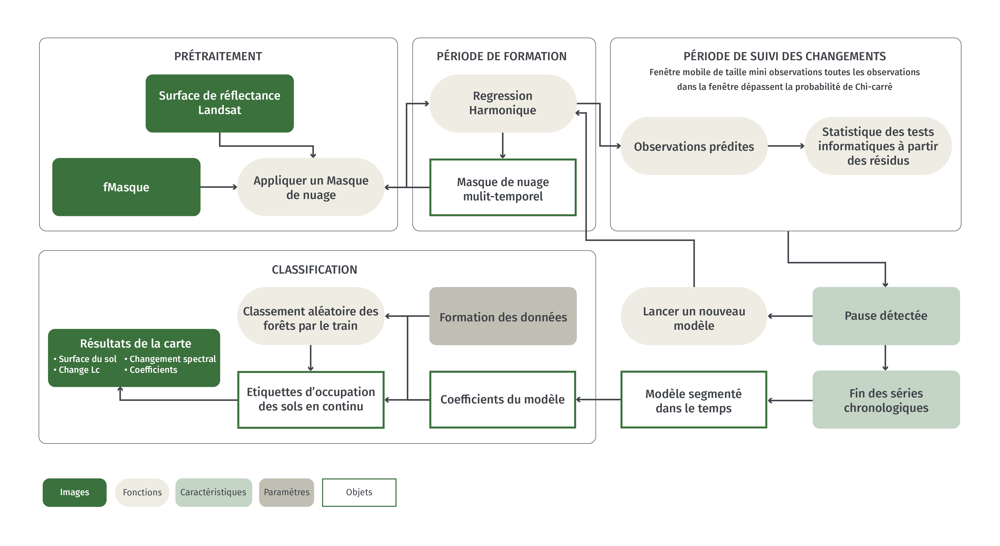
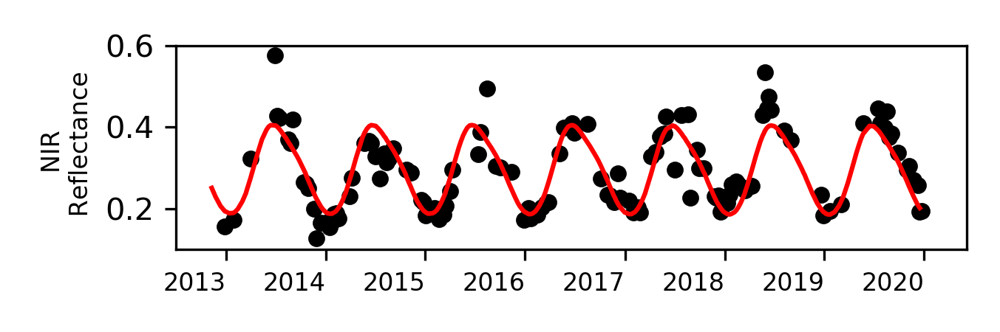
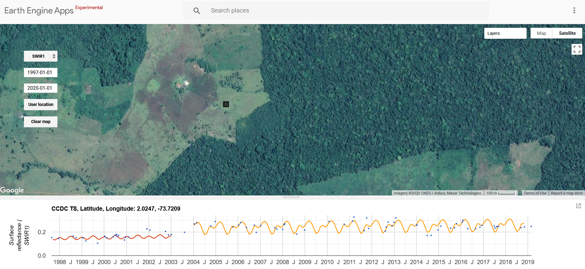
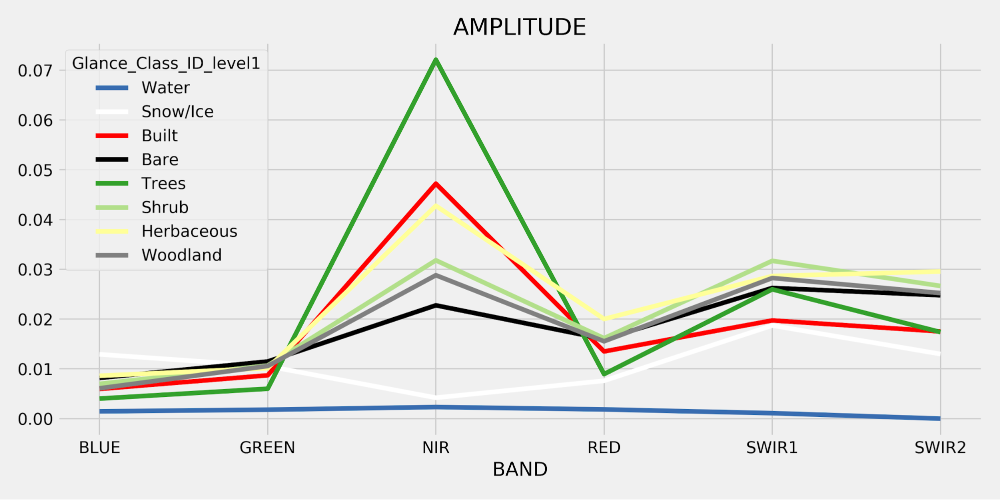
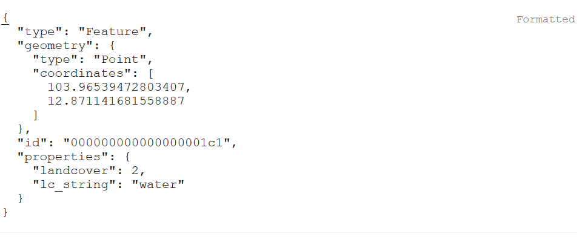
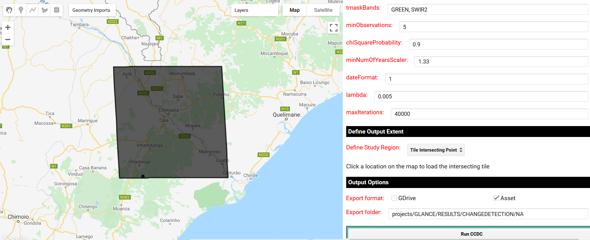

# Détection et classification continue des changements  (CCDC)

## 1 Contexte


### 1.1 Le suivi des changements 

Les changements de l'occupation des sols affectent les environnements naturels et anthropiques et sont considérés comme une variable climatique essentielle par le Système mondial d'observation du climat. Par exemple, la désertification entraîne une transition de la couverture terrestre des écosystèmes végétatifs vers le désert, la déforestation entraîne la conversion des forêts à des utilisations des terres modifiées par l'homme, et le développement urbain peut faire passer un environnement naturel à un environnement couvert de bâtiments et de routes. Afin de comprendre l'impact de ces transitions, il est essentiel de les quantifier à l'échelle nationale et régionale, ce qui est possible grâce à l'analyse par télédétection.
La surveillance des changements de sol à l'aide de données de télédétection nécessite des méthodologies permettant de transformer les images en informations utiles sur les changements du paysage. L'une de ces méthodes, qui a été largement appliquée, est la détection et la classification continues des changements (CCDC ; Zhu et Woodcock 2014). Ce tutoriel démontrera comment la CCDC peut être appliquée sur Google Earth Engine pour la surveillance des changements.


## 2 Les objectifs d'apprentissage

À la fin de ce tutoriel, les utilisateurs devraient être en mesure de

* Décrivez les principales composantes du CCDC, y compris les différents paramètres de l'algorithme. 
* Exécuter CCDC en utilisant une interface "pointer et cliquer" et par le biais de scripts avec le langage de programmation Javascript. 
* Créer des cartes des changements spectraux et de la couverture du sol.

### 2.1 Prérequis

* Concepts de Google Earth Engine (GEE)
  * Obtention d'un compte utilisateur
  * Traitement des images dans GEE
  * Syntaxe de base des fonctions
  * Traitement de base des images, y compris le choix des images, le filtrage des nuages, la mosaïquage et la composition.

>NOTE : Reportez-vous au processus "Pré-traitement" et à l'outil "GEE" ici sur OpenMRV pour plus d'informations et de ressources pour travailler dans Google Earth Engine. 

## 3 Tutoriel: Détection et classification continues des changements  (CCDC)

Le CCDC peut être géré à l'aide de Google Earth Engine. D'autres implémentations de CCDC sont accessibles [ici](https://github.com/GERSL/CCDC) et comprennent des implémentations en C, Python et MATLAB. Afin de faciliter l'analyse dans le cadre du GEE, Arevalo et al (2020) ont publié une API et une collection d'applications qui seront présentées [ici](https://gee-ccdc-tools.readthedocs.io/en/latest/). 

Ce tutoriel utilisera l'implémentation du CCDC dans GEE, d'où la nécessité d'un compte GEE. Veuillez vous référer au processus "Pré-traitement" et à l'outil "GEE" ici sur OpenMRV pour des informations supplémentaires sur GEE. Dans le premier exemple, le processus est démontré en utilisant l'API du CCDC au Cambodge. Dans le second exemple, le processus est démontré au Mozambique en utilisant les interfaces graphiques. Enfin, le processus est réalisé en Colombie pour créer une stratification des pertes et des gains de forêts. 

### 3.1 Algorithm description


Le CCDC utilise toutes les données de réflectance de surface Landsat masquées par les nuages disponibles pour une zone d'étude. Les détails de la mise en œuvre initiale sont décrits dans Zhu et Woodcock (2014). Le CCDC est un algorithme généralisé pour le suivi de différents types de changement au sol. Il ne repose donc pas sur une bande spectrale ou un indice unique, et ne filtre pas les changements en fonction des changements de direction spectrale spécifiques. Un diagramme schématique de CCDC se trouve ci-dessous. 




Comme son nom l'indique, le CCDC se compose d'une composante de détection des changements et d'une composante de classification. La détection des changements est effectuée à l'aide de toutes les images Landsat disponibles et d'un ensemble de bandes spectrales ou d'indices définis par l'utilisateur. Généralement, au moins les bandes verte, rouge, NIR, SWIR1 et SWIR2 sont utilisées pour la détection des changements. Toutes les données sont filtrées au niveau du pixel pour les nuages selon la bande "pixel_qa", ou fMask. 

<table>
  <tr>
   <td><strong>Model Parameter</strong>
   </td>
   <td><strong>Comparable Metric or Phrase</strong>
   </td>
  </tr>
  <tr>
   <td>Intercept
   </td>
   <td> Réflectance moyenne
   </td>
  </tr>
  <tr>
   <td>Slope
   </td>
   <td> Tendance à long terme
   </td>
  </tr>
  <tr>
   <td>Amplitude
   </td>
   <td> Variabilité due à la saisonnalité
   </td>
  </tr>
  <tr>
   <td>Phase
   </td>
   <td>calendrier phénologique
   </td>
  </tr>
  <tr>
   <td>RMSE
   </td>
   <td>Variabilité non saisonnière
   </td>
  </tr>
</table>


La première étape pour identifier les ruptures de modèle (ou "changements spectraux") consiste à ajuster un modèle de régression LASSO à un sous-ensemble de données au début de la série chronologique. Vous trouverez ci-dessous un exemple d'ajustement de régression saisonnière (ligne rouge) aux observations NIR (points noirs) pour un pixel en Colombie. Bien que ce modèle soit présenté ici pour la bande NIR, il est adapté à toutes les bandes spectrales et peut éventuellement être appliqué aux indices spectraux. Le modèle de régression capture le "modèle général" de la réflectance au cours d'une année, et est donc prédictif de ce à quoi devraient ressembler les observations "futures" en l'absence de changement dans le paysage.



Les modèles de régression sont ajustés avec des coefficients représentant un intercepte de modèle, une pente et trois ensembles de paires sinus/cosinus. Comme les régressions sont ajustées à l'aide de la régression LASSO, ces paramètres peuvent être réduits à 0. Les paires sinus/cosinus sont finalement converties en amplitude et en phase pour être plus faciles à interpréter. Ces modèles sont utilisés pour prévoir les observations ultérieures pendant une "période de surveillance", définie comme une fenêtre mobile dont le nombre d'observations est égal au paramètre _minObservations_. Vous pouvez voir ci-dessous un modèle de régression adapté à une période d'apprentissage (en bleu), avec la période de surveillance indiquée entre les pointillés rouges. La figure est tirée de Zhu et Woodcock (2014) et Bullock et al, (2020). 


Les résidus des observations dans la région d'étude sont utilisés pour calculer un test statistique  qui suit une distribution chi-carré. Si chaque observation de la fenêtre de surveillance dépasse le paramètre _chiSquaredProbability_ du test statistique , un changement est détecté. S'il reste suffisamment d'observations dans la série temporelle, un nouveau modèle d'apprentissage est adapté et le processus se répète jusqu'à la fin de la série temporelle. 

Les paramètres utilisés pour contrôler la détection des changements se trouvent ci-dessous :

<table>
  <tr>
   <td><strong>Parameter Name</strong>
   </td>
   <td><strong>Description</strong>
   </td>
   <td><strong>Recommended Value</strong>
   </td>
   <td><strong>Effect of Increasing</strong>
   </td>
  </tr>
  <tr>
   <td>breakPointBands
   </td>
   <td>Bandes à utiliser pour le calcul des tests statistiques et des tests de changement spectral
   </td>
   <td>Green, Red, NIR, SWIR1, SWIR2
   </td>
   <td>N/A
   </td>
  </tr>
  <tr>
   <td>tmaskBands
   </td>
   <td>Bandes à utiliser pour le masquage multi-temporel des nuages et des ombres
   </td>
   <td>Green, SWIR2
   </td>
   <td>N/A
   </td>
  </tr>
  <tr>
   <td>minObservations
   </td>
   <td> Nombre d'observations consécutives dépassant le seuil pour signaler un changement
   </td>
   <td>4
   </td>
   <td>Less breaks detected
   </td>
  </tr>
  <tr>
   <td>chiSquare Probability
   </td>
   <td>  Seuil sur le test statistique, qui est calculé à partir des résidus du modèle et suit une distribution chiSquare
   </td>
   <td>0,995
   </td>
   <td>Moins de ruptures détectées
   </td>
  </tr>
  <tr>
   <td>minNumOfYears Scaler
   </td>
   <td>   Nombre d'années après lesquelles un nouvel ajustement du modèle est calculé pendant la période d'apprentissage
   </td>
   <td>1,33
   </td>
   <td>Réaménagement du modèle de régression à la décroissance
   </td>
  </tr>
  <tr>
   <td>dateFormat 
   </td>
   <td>F   Format pour stocker les informations sur les dates. 0 : années juliennes, 1 : années fractionnaires, 2 : temps unix. 
   </td>
   <td>1
   </td>
   <td>N/A
   </td>
  </tr>
  <tr>
   <td>lambda 
   </td>
   <td> Valeur lambda pour l'ajustement de régression LASSO
   </td>
   <td>0,002
   </td>
   <td>  Davantage de paramètres réduits à 0
   </td>
  </tr>
  <tr>
   <td>maxIterations
   </td>
   <td>itérations maximales pour effectuer l'ajustement de régression LASSO
   </td>
   <td>20.000
   </td>
   <td>Tenter d'augmenter le nombre d'ajustements LASSO pour atteindre la convergence
   </td>
  </tr>
</table>

À la fin de la série chronologique, la trajectoire de chaque pixel sera segmentée en paramètres de modèle temporellement congruents (par exemple, la pente et l'interception). Ces segments sont séparés par des _spectral changes_, qui peuvent ou non refléter des changements de couverture ou d'état des sols. Sans classification des segments ou des ruptures de modèle, il n'est pas possible de savoir si ces _changements spectraux_ sont significatifs. Il convient de noter que les changements "significatifs" varient selon le contexte. Par exemple, une sécheresse peut provoquer un changement spectral dû à la sécheresse de la végétation. Bien qu'il s'agisse d'un changement réel survenant dans le paysage, il n'est pas toujours pertinent en fonction des différents objectifs du projet. Par conséquent, les _spectral changes_ et/ou les _model segments_ doivent être classés en fonction des objectifs de l'étude en question. 

**Essayez-le vous-même**

Nous avons créé une application Google Earth Engine pour visualiser les séries chronologiques et effectuer une détection des changements au niveau des pixels en utilisant le CCDC : https://parevalo-bu.users.earthengine.app/view/quick-tstools

Essayez de naviguer vers un lieu d'intérêt et cliquez sur la carte pour voir la série chronologique SWIR1. La bande spectrale visualisée peut être sélectionnée dans le menu déroulant à gauche de la carte. Vous trouverez ci-dessous un exemple de série chronologique pour une zone de forêt convertie en pâturage en Amazonie colombienne.



Ici, le CCDC fait l'objet d'une démonstration dans le but de surveiller l'évolution de l'occupation du sol. Par conséquent, les modèles de régression doivent être classés dans des étiquettes de couverture des sols, et ensuite les _changements spectraux_ peuvent être attribués à différentes catégories de changement de sol (par exemple, de forêt à développé). Pour ce faire, le CCDC utilise des données de formation catégorielles avec un classificateur Random Forest pour attribuer des étiquettes de couverture terrestre à chaque période segmentée du modèle. Les données d'entrée pour la classification sont les coefficients du modèle (par exemple, la pente et l'intersection) en plus de l'erreur quadratique moyenne du modèle pour chaque bande spectrale ou indice (généralement les bandes spectrales Landsat). 

Les occupation du sol peuvent être classées à l'aide de coefficients de régression en raison des différences de réflectance, des modèles saisonniers et de la variabilité quotidienne. Les figures suivantes montrent les valeurs moyennes des coefficients pour les données de référence de huit classes de couverture terrestre qui font partie du projet Global Landcover Mapping and Estimation (GLANCE), qui utilise le CCDC pour cartographier l'évolution de la couverture du sol dans le monde. Notez que pour chaque bande spectrale, il existe des coefficients correspondants pour l'interception (INTP), l'amplitude, la phase et l'EQM. Comme l'interception est généralement analogue à la réflectance moyenne, le graphique apparaît comme un tracé de profil spectral typique. L'amplitude est indicative de la saisonnalité, et on peut voir que la bande NIR est très saisonnière pour la classe forestière en raison de la phénologie. La phase est plus difficile à interpréter car elle est liée à la chronologie des modèles saisonniers, alors que l'EMR reflète la variabilité générale des données. Il est logique que l'EQM soit la plus élevée pour les classes herbacées et dénudées car elles sont généralement considérées comme des classes de couverture des sols "bruyantes". 

<table>
  <tr>
   <td>


   </td>
   <td>




   </td>
  </tr>
  <tr>
   <td>


   </td>
   <td>


   </td>
  </tr>
</table>

### 3.2 Cambodge : API DU CCDC

Le cas test au Cambodge sera présenté ici en utilisant l'API du CCDC. Ce même processus peut être réalisé dans les interfaces graphiques en utilisant les instructions décrites ci-dessous dans l'exemple du Mozambique. 

Dans la [console Javascript de Google Earth Engine](https://code.earthengine.google.com/), vous devez d'abord charger l'API CCDC et définir les paramètres de la région de détection et d'étude des changements. Pour cet exemple, nous utiliserons l'ensemble du pays, le Cambodge, comme région d'étude.  

Copiez et collez le script suivant dans GEE, ou chargez le script dans le [dépôt GEE de Open MRV](https://code.earthengine.google.com/?accept_repo=users/openmrv/MRV) appelé 'OpenMRV_français/Part 2/CCDC_fr/Cambodia_1_fr' : 


```javascript
// Load CCDC API
var utils = require('projects/GLANCE:ccdcUtilities/api')

// Définir des paramètres dans un objet
var changeDetectionParameters = {
  breakpointBands: ['GREEN','RED','NIR','SWIR1','SWIR2'],
  tmaskBands: ['GREEN','SWIR2'],
  minObservations: 4,
  chiSquareProbability: .99,
  minNumOfYearsScaler: 1.33,
  dateFormat: 2,
  lambda: .002,
  maxIterations: 25000
}

// Définir la région de l'étude
var studyRegion = ee.FeatureCollection('USDOS/LSIB_SIMPLE/2017')
  .filterMetadata('country_na','equals','Cambodia').union()

Map.addLayer(studyRegion)
Map.centerObject(studyRegion)

```

La fonction [getLandsat](https://gee-ccdc-tools.readthedocs.io/en/latest/api/api.html#getLandsat) de l'API du CCDC peut alors être utilisée pour obtenir toutes les données Landsat pour le Cambodge, les masquer en utilisant la bande "pixel_qa" et les convertir en unités de réflectance. 

```javascript
// Définir les entrées des dates
var inputParams = {
  start: '2000-01-01',
  end: '2020-01-01',
}

// Filtrer par date et par lieu au Cambodge
var filteredLandsat = utils.Inputs.getLandsat()
  .filterBounds(studyRegion)
  .filterDate(inputParams.start, inputParams.end)

print(filteredLandsat.size())
```

Sur la console, vous devriez voir qu'il y a 7889 images Landsat entre 2000 et 2020 pour le Cambodge. Pour réaliser la composante de détection des changements du CCDC, il nous suffit de définir la collection d'entrée dans l'objet "changeDetectionParameters" et de la transmettre à la fonction "Ccdc" de GEE.

```javascript
 // Placer la collection Landsat dans les paramètres de détection des changements
changeDetectionParameters['collection'] = filteredLandsat

// Exécuter CCDC
var results = ee.Algorithms.TemporalSegmentation.Ccdc(changeDetectionParameters)

print(results)
```

Les résultats contiennent un nombre variable de segments pour chaque pixel. Par conséquent, la sortie n'est pas bien adaptée aux formats d'images raster à bande fixe typiques. Les résultats de la détection des changements peuvent être enregistrés en tant qu'image Asset sous forme de table, ce qui nécessite un mode "pyramidPolicy" d'"échantillon". 

Notez que l'exportation d'un pays entier prendra au moins quelques heures de temps de traitement.

```javascript
// Combine parameters to save as metadata
var paramsCombined = ee.Dictionary(changeDetectionParameters).combine(inputParams).remove(['collection'])
print(paramsCombined)

Export.image.toAsset({
  image: results.setMulti(paramsCombined),
  scale: 30,
  description: 'ccdc_change_results',
  maxPixels: 1e13,
  region: studyRegion,
  assetId: '/path/to/asset',
  pyramidingPolicy: {
	'.default': 'sample'
  }
})
```

**Astuce** Si votre zone d'étude est grande, l'étape précédente risque de ne jamais être terminée. Une façon de remédier à ce problème est de diviser l'exportation en petites tâches et de les reprendre plus tard. Le code suivant utilise la fonction [makeAutoGrid](https://gee-ccdc-tools.readthedocs.io/en/latest/api/api.html##makeAutoGrid) pour créer une grille chevauchant la zone d'étude. Une boucle de Javascript côté navigateur est ensuite utilisée pour soumettre une tâche différente pour chacune.

```javascript
var grid = utils.Inputs.makeAutoGrid(studyRegion.geometry().bounds().buffer(150000), 2)
  .filterBounds(studyRegion.geometry())
  .toList(100)


grid.size().evaluate(function(s) {
  print('## of grids: ', s)
  for (var i = 0; i < s; i++) {
    var outGeo = ee.Feature(grid.get(i)).geometry()
      .intersection(studyRegion.geometry()) // Subset to study region
  Map.addLayer(outGeo, {}, 'Grid ' + i)
  Export.image.toAsset({
    image: results.setMulti(paramsCombined),
    scale: 30,
    description: 'ccdc_change_results',
    maxPixels: 1e13,
    region: outGeo,
    assetId: 'Cambodia_Change_Results_Grid_' + i,
    pyramidingPolicy: {
      '.default': 'sample'
    }
  })

  }
})
```


**Note importante**: Si vous ne pouvez pas exporter les coefficients CCDC, vous pouvez également utiliser les coefficients CCDC globaux créés par Gorelick et al. (recherche non publiée). Ces données ont été créées pour surmonter le goulot d'étranglement dans l'utilisation des CCDC qui provient de la création des coefficients initiaux. A partir de janvier 2021, ces résultats peuvent être chargés en utilisant le code suivant :

```javascript
var globalResults = ee.ImageCollection('projects/CCDC/v3').mosaic()
```

Ce fichier contient les coefficients du modèle CCDC et des informations sur les ruptures de modèle. Plus précisément, les fourchettes de l'actif "résultats" sont les suivantes:

* tStart: La date de début de chaque segment de modèle.
* tEnd: La date de fin de chaque segment de modèle.
* tBreak: La date de rupture du modèle si un changement est détecté
* numObs: le nombre d'observations utilisées dans chaque segment du modèle.
* changeProb: Une valeur numérique représentant la probabilité de changement multibande.
* *_coefs: Les coefficients de régression pour chacune des bandes de la collection d'images.
* *_rmse: L'erreur quadratique moyenne du modèle pour chaque segment et chaque bande d'entrée.
* *_magnitude: Pour les segments dont les changements ont été détectés, cela représente les résidus normalisés pendant la période de changement.

La prochaine étape dans l'analyse de l'occupation des sols à l'aide du CCDC est la collecte de données sur la formation. Les données sur la formation doivent répondre à certaines exigences pour pouvoir être utilisées dans le cadre du reste du processus. Ce tutoriel montre comment s'assurer que vos données répondent à ces exigences.

**Exigences en matière de données d'entraînement:**

* Les données doivent être une caractéristique du earth engine (Earth Engine FeatureCollection of point geometries).
* Un attribut de chaque point doit contenir une valeur numérique indiquant la couverture du sol associée.
* Un attribut de chaque point doit contenir une année qui correspond à l'étiquette de couverture des sols.

**Étapes supplémentaires facultatives**

* Les données prédicteurs comme attributs pour chaque point et pour l'année qui correspond à l'étiquette de couverture des sols.
* Les ID d'échantillons uniques comme attributs

Les données d'entraînement pour le Cambodge ont été collectées dans le cadre de tutoriels ici sur OpenMRV sous le processus "Collecte de données d'entraînement " et les outils "QGIS" et "GEE" et peuvent être chargées ici. Notez que le code relatif au chargement et au formatage des données de formation se trouve dans le script "CCDC/Cambodia_2" dans le dépôt Open MRV.


```javascript
var trainingData = ee.FeatureCollection('users/openmrv/MRV/cambodia_training')
print(trainingData.first())
```

Dans la console, vous devriez voir des informations sur le premier point de formation. Sélectionnez l'élément, puis sélectionnez "géométrie". Assurez-vous que le "type" est "Point", comme dans la figure ci-dessous. Si c'est autre chose (comme Rectangle ou Polygone), vous devez convertir vos données en points avant de continuer.

**Création d'un attribut numérique de l'occupation du sol**

L'étiquette d'occupation des sols doit être numérique, elle ne peut donc pas être une chaîne de caractères (comme "forêt") ou une chaîne numérique (ou un nombre écrit sous forme de chaîne). Pour vérifier le type de votre attribut, sélectionnez le bouton "JSON" sur le côté droit de la console pour développer la représentation json de l'élément. 


Vous devriez voir apparaître le JSON :



Notez que ma fonction a deux attributs : lc_string et landcover. L'attribut lc_string ne fonctionnera pas car les classificateurs exigent une propriété de classe numérique. Notez que la représentation JSON de la propriété "landcover" est un 2 numérique, et non une représentation en chaîne comme "2". Comme il est numérique, il fonctionnera pour la classification. 

Si vous ne disposez pas d'un attribut numérique indiquant la couverture du sol, vous pouvez convertir un attribut de chaîne en numérique en utilisant la fonction "remap" Earth Engine (EE). Nous pouvons convertir notre propriété "lc_string" en une propriété numérique "lc_numeric" avec le code suivant (notez que ce n'est qu'un exemple et qu'il n'est pas nécessaire car "landcover" est numérique) :

```javascript
trainingData  = trainingData.map(function(feat) {
  return feat.set('lc_numeric',feat.get('lc_string'))})
  .remap(['forest','herbaceous','water','settlement'],[1,2,3,4],'lc_numeric')
```

Afin de déterminer les coefficients CCDC à utiliser comme prédicteurs pour former le classificateur, chaque point doit avoir un attribut d'année pour interroger les résultats CCDC par. Par exemple, si vous savez qu'un point de entraînement correspond à la forêt en 2014, alors les coefficients CCDC pour 2014 seront utilisés pour l'entraînement. Si toutes vos données d'entraînement correspondent à une certaine année, vous pouvez ajouter l'attribut avec un simple bout de code. Dans cet exemple, les données d'entraînement correspondent à 2018 et sont affectées à un attribut appelé **"year"**.

```javascript
trainingData  = trainingData.map(function(feat) {
  return feat.set('year',2018)})
```

**Construire des images et extraire des données prédictives pour l'apprentissage**

Nous devons extraire des données prédictives pour chaque point d'entraînement avant de pouvoir appliquer un classificateur. Nous pouvons le faire soit manuellement juste avant de soumettre la classification, soit nous pouvons extraire les prédicteurs à l'avance et les stocker en tant que propriétés de chacun des points d'entraînement. Pour ce tutoriel, nous utiliserons la deuxième méthode, car elle permet une classification plus rapide qui se chargera "à la volée". Cette méthode est utile pour tester les paramètres de classification. La fonction pour ce faire s'appelle [getTrainingCoefsAtDate](https://gee-ccdc-tools.readthedocs.io/en/latest/api/api.html##getTrainingCoefsAtDate). Cependant, nous devons d'abord construire l'image des coefficients du CCDC à partir de laquelle l'échantillon sera prélevé. En gros, cette étape convertit l'image du tableau en une image multibande dans laquelle chaque pixel a le même nombre de bandes.  

La fonction [buildCcdImage](https://gee-ccdc-tools.readthedocs.io/en/latest/api/api.html#buildCcdImage) prend trois paramètres : le résultat de la modification de l'image du tableau, une liste de bandes, le nombre de segments à convertir en bandes et le nom des bandes spectrales ou des indices. La variable "changeResults" peut être définie sur la base des résultats de la détection des changements, ou peut également être un ensemble global de coefficients du CCDC rattaché à votre région d'étude, comme illustré ici. Si l'utilisateur n'a pas pu exporter une image des coefficients, il doit utiliser l'option A ci-dessous.  Si l'utilisateur a exporté les images de coefficients à l'étape précédente sous la forme d'une seule image, il doit utiliser l'option B ci-dessous. S'il a exporté avec plusieurs images, il doit utiliser l'option C.


```javascript
// Définir les bandes à utiliser dans la classification
var bands = ['BLUE','GREEN','RED','NIR','SWIR1','SWIR2']

// Définir les coefficients à utiliser dans la classification
var coefs = ["INTP", "SLP","COS", "SIN","RMSE","COS2","SIN2","COS3","SIN3"]

// Segment ids
var segs = ["S1", "S2", "S3", "S4", "S5", "S6"]

// Option A : Obtenir des résultats de changement en utilisant des coefficients globaux
var globalResults = ee.ImageCollection('projects/CCDC/v3').mosaic()
var changeResults = globalResults.clip(studyRegion)

//Option B : Obtenir les résultats des changements effectués à l'aide de ce tutoriel. //Notez que le chemin doit être modifié pour correspondre au chemin de l'image de //coefficient exportée. 
var changeResults = ee.Image('/path/to/change/detection/results')

// Option C : Obtenir des résultats de changement à partir d'images à résultats multiples. //Notez que le chemin doit être modifié pour correspondre au chemin des images de //coefficients exportées. 
var changeResults1 = ee.Image('/path/to/change/detection/results_1')
var changeResults2 = ee.Image('/path/to/change/detection/results_2')
var changeResults = ee.ImageCollection([changeResults1, changeResults2]).mosaic()


//Charger la pile d'images ccd avec les coefficients et les informations de changement
var ccdImage = utils.CCDC.buildCcdImage(changeResults, segs.length, bands)
print(ccdImage)

// Ajouter la zone d'étude à la carte pour obtenir un fond foncé
Map.addLayer(studyRegion, {color: 'black'},'Cambodia')


// Ajouter la date de rupture du premier segment à la carte.
Map.addLayer(ccdImage.select('S1_tBreak').selfMask(), {min: 2000, max: 2020, palette: ['##8c510a','##d8b365','##f6e8c3','##f5f5f5','##c7eae5','##5ab4ac','##01665e']}, 'Segment 1 Break Dates')

// Ajouter le premier segment NIR RMSE
Map.addLayer(ccdImage.select('S1_NIR_RMSE'), {min: 0, max: .05, palette: ['##ffffcc','##d9f0a3','##addd8e','##78c679','##41ab5d','##238443','##005a32']}, 'Segment 1 NIR RMSE')
```

<table>
  <tr>
   <td>


<p>
Segment 1 date de rupture (Marron -> Bleu)
   </td>
   <td>


<p>
Segment 1 NIR RMSE (vert clair-> vert foncé)
   </td>
  </tr>
</table>


Par la suite, nous voulons charger les données topographiques et climatiques auxiliaires avec la fonction [getAncillary](https://gee-ccdc-tools.readthedocs.io/en/latest/api/api.html##getAncillary) et obtenir les coefficients CCDC à chacun des points de formation en utilisant la fonction [getTrainingCoefsAtDate](getTrainingCoefsAtDate).


```javascript
// Propriété correspondant a année de données d'entraînement
var yearProperty = 'year'

// Enfin, obtenez des données topographiques et climatiques secondaires
var ancillary = utils.Inputs.getAncillary()

var trainingData = utils.Classification.getTrainingCoefsAtDate(
  trainingData, coefs, bands, yearProperty, ancillary, ccdImage, segs)


// Points de filtrage sans données
var testBand = bands[0] + '_' + coefs[0]
trainingData = trainingData.filter(ee.Filter.notNull([testBand]))

print('First training point with predictors:', trainingData.first())


```

Vous devriez maintenant voir dans les attributs des caractéristiques toutes les données prédictives qui peuvent être utilisées pour la classification.

**Ajouter des ID uniques comme attributs**

Une autre étape optionnelle, mais recommandée, consiste à attribuer à chaque échantillon un identifiant unique comme attribut. EE donne à chaque point un identifiant, mais ils peuvent être longs et apparemment aléatoires. La fonction [assignIDs](https://gee-ccdc-tools.readthedocs.io/en/latest/api/api.html##assignIds) de notre API va mélanger l'échantillon et attribuer un identifiant unique à un nom d'attribut donné. 


```javascript
trainingData = utils.Classification.assignIds(trainingData, 'ID')
```

Enfin, les données relatives à l'apprentissage peuvent être exportées comme un Asset:

```javascript
Export.table.toAsset({
  collection: trainingData,
  description: 'trainingDataProcessed',
  assetId: 'trainingDataWithPredictors'})
```

**Planifier les coefficients des données d'entraînement **

En option, une fois l'exportation terminée, nous pouvons visualiser différents coefficients pour nos classes d'apprentissage. Dans le code suivant, les éléments de références enregistrées sont chargés et un nuage de points est créé, montrant les interceptions NIR et SWIR1 pour les points d'entraînement et organisé par occupation de sol. Notez que ce code peut être trouvé dans le répertoire MRV ouvert dans le script 'CCDC/Cambodia_3'.


```javascript
var trainingData = ee.FeatureCollection('users/openmrv/MRV/Cambodia_TrainingData_CCDC')

var doChart = function(sample, x, y, xMin, xMax, yMin, yMax) {
  var chart =
	ui.Chart.feature.groups({
  	features: sample,
  	xProperty: x,
  	yProperty: y,
  	seriesProperty: 'lc_string'
	})
	.setChartType('ScatterChart')
	.setOptions({
  	title: 'Training features',
  	hAxis:
      	{title: x,
      	titleTextStyle: {italic: false, bold: true},
      	viewWindow: {min: xMin, max: xMax}},
  	vAxis: {
    	title: y,
    	titleTextStyle: {italic: false, bold: true},
    	viewWindow: {min: yMin, max: yMax}
  	},
	});
	return chart

}

// Change 'SWIR1' or 'NIR' to any input band and 'INTP' to any coefficient. 
print(doChart(trainingData, 'SWIR1_INTP','NIR_INTP'))

```


Notez les différences des interceptions entre les bandes. Les échantillons d'eau ont de faibles interceptions dans les bandes NIR et SWIR1 en raison de la réflectance généralement faible dans l'eau. La forêt, par contre, a un SWIR1 faible mais un NIR élevé, en raison de la forte réflectance dans les longueurs d'onde du NIR pour la végétation verte. Les herbacées et les habitats sont très variables, ce qui reflète la large gamme de réflectance dans ces classes. De cette manière, on peut voir comment l'interception correspond généralement à la réflectance "moyenne". 

**Classez les segments**

Les segments du modèle peuvent maintenant être classés avec la fonction [classifySegments](https://gee-ccdc-tools.readthedocs.io/en/latest/api/api.html##classifySegments) de l'API. Le code suivant définit d'abord les paramètres d'un classificateur Random Forest, puis transmet le classificateur, les données de formation et les segments de modèle à la fonction [classifySegments](https://gee-ccdc-tools.readthedocs.io/en/latest/api/api.html##classifySegments). La classification du premier segment est ajoutée à la carte dans laquelle le vert représente la forêt, le brun les herbacées, le bleu l'eau et le noir les habitats. Notez que ce code peut être trouvé dans le repo MRV ouvert dans le script 'CCDC/Cambodia_4'. 

```javascript
// Classifier
var classifier = ee.Classifier.smileRandomForest({
  numberOfTrees: 150,
  variablesPerSplit: null,
  minLeafPopulation: 1,
  bagFraction: 0.5,
  maxNodes: null
})

var results = utils.Classification.classifySegments(
  ccdImage, segs.length, bands, null, [], trainingData, classifier, studyRegion, 'landcover', coefs)
  .clip(studyRegion)


Map.addLayer(results.select(0), {min: 1, max: 4, palette: ['##a6d854','##386cb0','##e5c494','black']}, 'Seg1 Classification')
```


Finalement, des classifications à des dates spécifiques peuvent être obtenues en utilisant la fonction [getLcAtDate](https://gee-ccdc-tools.readthedocs.io/en/latest/api/api.html#getLcAtDate). L'extrait de code suivant crée d'abord une classification pour la date arbitraire du 27 mars 2014, puis calcule la déforestation entre 2000 et 2018. Dans les données de formation, la valeur 1 représente la forêt, 2 est une plante herbacée, 3 est de l'eau et 4 est une colonie. Par conséquent, la substitution des différentes valeurs de classe permettrait de créer des cartes de changement pour les autres classes respectives. 

```javascript
//  Créer une classification pour le 27 mars 2014 et l'ajouter à la carte
var dateOfClassification = '2014-03-27'
var matchingDate = utils.Classification.getLcAtDate(results, dateOfClassification)
Map.addLayer(matchingDate, {min: 1, max: 4, palette: ['##a6d854','##386cb0','##e5c494','black']}, 'Classification ' + dateOfClassification)

// Créer une classification pour le 1er janvier 2000 et 2018
var class2000 = utils.Classification.getLcAtDate(results,'2000-01-01')
var class2018 = utils.Classification.getLcAtDate(results,'2018-01-01')

// La déforestation, c'est là où c'est la forêt (1) en 2000 et non la forêt en 2018.
var deforestation = class2000.eq(1).and(class2018.neq(1))

// Une carte des progrès d'habitats peut être calculée de la même manière :
var settlementGain = class2000.neq(4).and(class2018.eq(4))


Map.addLayer(deforestation.selfMask(), {palette: 'red'}, 'Deforestation')

// MMasquer la classification 2018 pour qu'elle ne contienne que l'étiquette d'occupation //des sols 2018 pour les pixels subissant la déforestation
var postDefClass = class2018.updateMask(deforestation)

Map.addLayer(postDefClass, {min: 1, max: 4, palette: ['##a6d854','##386cb0','##e5c494','black']}, 'Post-Deforestation Class')
```
<table>
  <tr>
   <td>


<p>
Deforestation
   </td>
   <td>


<p>
Post-Deforestation Land Cover
   </td>
  </tr>
</table>

Enfin, nous pouvons simplifier les étapes ci-dessus pour effectuer la classification de l'occupation des sols en utilisant les coefficients globaux dans une section de code (se trouvant dans le repo MRV ouvert dans le script 'CCDC/Cambodia_5'). Notez que ces étapes sont décrites plus en détail ci-dessus.

```javascript
// importer CCDC API
var utils = require('projects/GLANCE:ccdcUtilities/api')

// Paramètres, assets et région d'étude
var studyRegion = ee.FeatureCollection('USDOS/LSIB_SIMPLE/2017')
  .filterMetadata('country_na','equals','Cambodia').union()

// Paramètrages,
var bands = ['BLUE','GREEN','RED','NIR','SWIR1','SWIR2']
var coefs = ["INTP", "SLP","COS", "SIN","RMSE","COS2","SIN2","COS3","SIN3"]
var segs = ["S1", "S2", "S3", "S4", "S5", "S6"]
var yearProperty = 'year'
var lcClasses = ['forest','herbaceous','water','settlement']
var numericClasses = [1, 2, 3, 4]
var classifier = ee.Classifier.smileRandomForest({
  numberOfTrees: 150,
  variablesPerSplit: null,
  minLeafPopulation: 1,
  bagFraction: 0.5,
  maxNodes: null
})

// Année 
var trainingData = ee.FeatureCollection('users/openmrv/MRV/cambodia_training')
  .map(function(feat) {
  return feat.set(yearProperty,2018,'lc_numeric',feat.get('lc_string'))})
  .remap(lcClasses, numericClasses,'lc_numeric')
 
// Obtenir des informations à partir de coefficients globaux et de données topographiques //et climatiques supplémentaires
var globalResults = ee.ImageCollection('projects/CCDC/v3').mosaic()
var changeResults = globalResults.clip(studyRegion)
var ccdImage = utils.CCDC.buildCcdImage(changeResults, segs.length, bands)
var ancillary = utils.Inputs.getAncillary()

// Obtenir des coefficients aux points d'échantillonnage
var trainingData = utils.Classification.getTrainingCoefsAtDate(
  trainingData, coefs, bands, yearProperty, ancillary, ccdImage, segs)
var testBand = bands[0] + '_' + coefs[0]
trainingData = trainingData.filter(ee.Filter.notNull([testBand]))

// Classification de l'occupation des sols
var results = utils.Classification.classifySegments(
  ccdImage, segs.length, bands, null, [], trainingData, classifier, studyRegion, 'landcover', coefs)
  .clip(studyRegion)

// Créer une carte de l'occupation des sols pour la date du 27 mars 2014
var dateOfClassification = '2014-03-27'
var matchingDate = utils.Classification.getLcAtDate(results, dateOfClassification)

// Calculer l'évolution de l'occupation des sols et créer des cartes de la déforestation // et de l'occupation des sols après la déforestation
var class2000 = utils.Classification.getLcAtDate(results,'2000-01-01')
var class2018 = utils.Classification.getLcAtDate(results,'2018-01-01')
var deforestation = class2000.eq(1).and(class2018.neq(1))
var postDefClass = class2018.updateMask(deforestation)

// Ajouter les résultats à la carte
Map.addLayer(deforestation.selfMask(), {palette: 'red'}, 'Deforestation')
Map.addLayer(postDefClass, {min: 1, max: 4, palette: ['##a6d854','##386cb0','##e5c494','black']}, 'Post-Deforestation Class')
Map.addLayer(matchingDate, {min: 1, max: 4, palette: ['##a6d854','##386cb0','##e5c494','black']}, 'Classification ' + dateOfClassification)
```

### 3.3  Mozambique : GUI du CCDC

Pour faciliter l'accès à notre API, nous avons créé une série d'interfaces utilisateur graphiques (GUI) qui ne nécessitent aucun codage de la part de l'utilisateur. Des descriptions détaillées de ces outils se trouvent dans [Arevalo et al., 2020](https://doi.org/10.3389/fclim.2020.576740).

<table>
  <tr>
   <td><strong>Name and Link</strong>
   </td>
   <td><strong>Description</strong>
   </td>
  </tr>
  <tr>
   <td><a href="https://code.earthengine.google.com/?scriptPath=users%2Fparevalo_bu%2Fgee-ccdc-tools%3AAPPS%2Ftstools_advanced">Time Series Viewer</a>
   </td>
   <td>Visualiser la trajectoire des pixels des séries chronologiques du CCDC et expérimenter avec les paramètres du modèle
   </td>
  </tr>
  <tr>
   <td><a href="https://code.earthengine.google.com/?scriptPath=users%2Fparevalo_bu%2Fgee-ccdc-tools%3AAPPS%2Fsubmit_ccdc">Submit CCDC</a>
   </td>
   <td>Calculer les coefficients du CCDC et les informations sur les changements spectraux
   </td>
  </tr>
  <tr>
   <td><a href="https://code.earthengine.google.com/?scriptPath=users%2Fparevalo_bu%2Fgee-ccdc-tools%3AAPPS%2Fvisualize_ccdc">Visualize CCDC</a>
   </td>
   <td>Visualiser les coefficients du CCDC et les informations sur les changements spectraux
   </td>
  </tr>
  <tr>
   <td><a href="https://code.earthengine.google.com/?scriptPath=users%2Fparevalo_bu%2Fgee-ccdc-tools%3AAPPS%2Fclassify_app">Classify CCDC</a>
   </td>
   <td>Effectuer la classification de la couverture des sols des coefficients CCDC
   </td>
  </tr>
  <tr>
   <td><a href="https://code.earthengine.google.com/?scriptPath=users%2Fparevalo_bu%2Fgee-ccdc-tools%3AAPPS%2Flandcover_app">Land Cover and Change</a>
   </td>
   <td>Créer des cartes de l'occupation des sols et de l'évolution de la couverture des sols
   </td>
  </tr>
</table>


Ces interfaces graphiques peuvent être utilisées pour calculer les paramètres du modèle CCDC (c'est-à-dire les coefficients de régression), afficher et interagir avec les coefficients CCDC et les séries chronologiques de pixels correspondantes, et classer les paramètres du modèle. Ce tutoriel présente les interfaces graphiques pour la classification de la couverture des sols et pour la création de cartes de l'occupation  des sols et des changements d'occupation des sols. 

Comme les coefficients CCDC sont très gourmands en calculs sur de grandes surfaces, nous utiliserons les résultats globaux CCDC introduits dans l'exemple du Cambodge. Les outils chargeront par défaut les coefficients globaux les plus récents. Si les utilisateurs souhaitent créer leurs propres coefficients en utilisant leurs propres paramètres, ils doivent consulter les instructions de l'exemple du Cambodge en utilisant l'API CCDC. 

Dans ce tutoriel, vous le ferez :
* Classer les segments CCDC en fonction des paramètres de leur modèle et des données auxiliaires
* Extraire une carte de l'occupation des sols pour une date précise
* Calculer l'évolution de l'occupation des sols entre deux ou plusieurs dates

#### Classifier les segments de séries chronologiques

Le résultat de cette partie du tutoriel sera une image avec des bandes correspondant à la _n_ e étiquette de couverture terrestre du pixel pour les _n_ bandes. En d'autres termes, la bande 1 est la classification du premier segment, la bande 2 est la seconde, et ainsi de suite. Théoriquement, un pixel peut avoir des dizaines de segments. Mais c'est très rare, car les changements correspondent à des changements de terrain se produisant à l'intérieur de ce pixel. Ainsi, pour réduire l'intensité de calcul, nous limitons le nombre de segments qui sont classifiés dans cette application à 6 par pixel.

La première étape consiste à charger l'application [app](https://code.earthengine.google.com/?scriptPath=users%2Fparevalo_bu%2Fgee-ccdc-tools%3AAPPS%2Fclassify_app), vous devriez voir apparaître un panneau comme celui-ci :


Ensuite, l'utilisateur doit charger les coefficients CCDC. Si les coefficients ont été créés en utilisant l'étape précédente "Soumettre la détection de changement", alors cet actif doit être utilisé dans cette étape. Sinon, les coefficients globaux peuvent être utilisés. 

Ces quelques premiers paramètres décrivent le format des résultats du CCDC. Tout d'abord, sont-ils enregistrés sous la forme d'une image unique ou d'une collection ? Ensuite, il y a le chemin d'accès aux résultats du CCDC. Si vous utilisez les résultats de la section précédente, sélectionnez "Image" pour le type de résultat et ajoutez le chemin d'accès à l'actif dans la zone de texte. Les résultats globaux peuvent également être chargés en utilisant le type de résultat "Collection d'images" et le chemin "projets/CCDC/v3". Enfin, vous devez spécifier le format de date avec lequel les résultats ont été exécutés. Pour l'ensemble des données globales et la valeur par défaut de l'application de détection des changements, le format est celui des années fractionnaires (1). Cliquez sur Charger.

Vous devriez voir le panneau  _Predictor Variables_ remplir comme dans la figure suivante. Décochez les bandes, les coefficients ou les données auxiliaires que vous ne souhaitez pas utiliser comme entrées dans la classification.Les données d'entrée du terrain proviennent  du [ 30m SRTM global DEM](https://doi.org/10.1029/2005RG000183), tandis que les données d'entrée du climat proviennent [ WorldClim BIO Variables V1](https://doi.org/10.1002/joc.1276). Au-dessus des variables prédicteurs se trouve une option permettant de choisir un classificateur à apprentissage automatique pour effectuer la classification. En général, Random Forest obtient de bons résultats dans le contexte du CCDC. 


L'option suivante vous permet de décider comment définir la région à classer et à exporter. Comme vous le verrez, il existe de nombreuses options. La plupart d'entre elles tournent autour d'une grille globale que nous avons créée pour le projet GLanCE (Global Land Cover Mapping and Estimation). Vous trouverez de plus amples informations sur la grille GLanCE sur le site[ project website](http://sites.bu.edu/measures/).


Il existe quatre façons de spécifier une tuile à exécuter, en plus de définir manuellement la région d'étude ou de sélectionner un pays. L'option la plus simple consiste à choisir "Tile Intersecting Point", puis à cliquer quelque part sur la carte. Vous verrez la grille recouvrir l'endroit que vous avez sélectionné chargé comme région d'étude.



Vous pouvez également définir manuellement la région d'étude en cliquant sur cinq points de la carte qui définissent les frontières.


Les autres options consistent à définir manuellement les grilles de sortie en fonction de leur ID de tuile, ou à dessiner sur la carte pour spécifier plusieurs grilles, ou encore à sélectionner un pays. Si plusieurs grilles sont sélectionnées, chaque grille sera alors soumise comme une tâche distincte. Si un pays est sélectionné, la frontière du pays sera la région d'étude.


Utilisez la méthode _Country Boundary_ pour définir une région de sortie, et sélectionnez _Mozambique_ for the _Country. 

La dernière série de paramètres concerne les données d'apprentissage. Les données d'apprentissage exigent que chaque point possède un attribut identifiant l'étiquette d'occupation des sols, et doit également correspondre à une année spécifique pour l'apprentissage. Vous avez la possibilité d'utiliser l'ensemble de la FeatureCollection ou seulement les points qui se situent dans la région d'étude. 

* Un exemple d'ensemble de données d'entraînement, construit sur la base de tutoriels ici sur OpenMRV sous le processus " collecte de données d'entraînement " et les outils " QGIS " et " GEE ", peut être trouvé dans l'asset "users/openmrv/MRV/mozambique_training". 
* En supposant que les données sur l'apprentissage proviennent de votre région d'étude, vous pouvez utiliser l'option par défaut _Within Output Extent_. 
* _Training Year_ correspond à l'année des labels des données d'entraînement (par exemple, en quelle année un échantillon étiqueté comme "Forest" est-il réellement une forêt ?) ). Pour cet ensemble de données, l'année est 2018. 
* L'attribut _Training Attribute_  correspond au nom de l'attribut dans chaque élément qui contient l'étiquette d'occupation des sols. Pour cet ensemble de données, l'année est _landcover_. 


Notez que la classification est plus rapide si les données prédictives de chaque point d'entraînement sont enregistrées dans les propriétés de la caractéristique (par opposition à un calcul à la volée). Nous recommandons de faire ce processus dans une tâche séparée, puis d'utiliser les données avec les prédicteurs attachés pour essayer rapidement les paramètres de classification. Vous devriez voir dans la console une note indiquant si les données des prédicteurs doivent ou non être échantillonnées en tant que points d'entraînement. Si c'est le cas, vous pouvez également soumettre une tâche qui permettra de sauvegarder ce calcul pour une utilisation ultérieure.

Finalement, lorsque vous cliquez sur "Run Classification’", la classification correspondant à la première période de segment s'affiche sur la carte. Dans ce cas, les modèles correspondent à ~1999. La pile de classification complète peut être exportée sous forme de tâche qui doit apparaître avec la description "classification_segments".

#### Créer des cartes de l'occupation des sols et de la modification de l'occupation des sols

Une fois le traitement terminé, nous pouvons l'utiliser pour réaliser des cartes de la couverture du sol à n'importe quelle date dans le temps pour la région étudiée. Cet atout peut être utilisé directement dans [ Landcover Application](https://code.earthengine.google.com/?scriptPath=users%2Fparevalo_bu%2Fgee-ccdc-tools%3AAPPS%2Flandcover_app). Cette application est relativement simple - il suffit de spécifier le chemin vers l'image du segment créé ci-dessus et une liste de dates et voilà ! Vous trouverez un exemple de sortie créée en suivant les étapes ci-dessus dans : ‘users/openmrv/MRV/Mozambique_CCDC_Segments’. 

Les dates doivent être entrées dans le format ‘YYYY-MM-DD’ et séparées par des virgules, par exemple “2001-01-15, 2001-07-21, 2014-12-10”. Chaque bande de l'image de sortie correspondra à une classification différente de la date.


Cette application a également la fonction d'ajouter un changement entre qui représente la conversion d'une ou de plusieurs classes à une date spécifiée à une classe ou un groupe de classes spécifié. Vous devez d'abord spécifier les dates de début et de fin et les valeurs de la classe de couverture terrestre pour les dates correspondantes. Par exemple, les exemples suivants montrent les pixels (rouge) qui sont de classe 1 (forêt) en 2001-01-01, et qui sont soit de classe 2, 3 ou 4 en 2018-01-01. En d'autres termes, la déforestation de janvier 2001 à janvier 2018. En changeant les classes "De" et "À" pour la bande de changement, on calcule l'inverse de la déforestation, ou de la croissance des forêts.


Vous pouvez également spécifier une seule valeur pour la case Classe (À), par exemple, le simple fait d'utiliser 3 correspondrait à la conversion de la carte de 1 à 3, ou de la forêt en terre cultivée. Si ces cases sont laissées vides, seules les cartes de la couverture terrestre seront créées.

Enfin, l'outil vous permet de spécifier certains paramètres de visualisation. Cette étape est très simple, il suffit de lister les noms de couverture terrestre et la valeur numérique correspondante, et de fournir éventuellement une palette. Une fois la carte chargée, vous pouvez cliquer sur la carte pour visualiser la trajectoire de la série chronologique SWIR1 pour ce pixel. L'exemple ci-dessous montre une trajectoire de repousse, qui est caractérisée par une diminution de la réflectance de SWIR1 au cours de la série temporelle.


#### 3.4 Colombia: CCDC API for Forest Change Stratification

Le dernier tutoriel démontrera l'utilisation de l'API pour créer une stratification des changements forestiers en Colombie. Le code est modifié par rapport à celui du tutoriel sur le Mozambique et utilise l'ensemble des données de coefficient global du CCDC. Le script peut être trouvé dans le dépôt MRV ouvert dans le script "OpenMRV_français/Part 2/CCDC_fr/Colombia_1_fr". 

Pour la stratification de sortie, nous voulons des classes qui représentent :

1. Forêt stable
2. Stable non forestier
3. Gain de la forêt
4. Perte de forêts

Dans le cadre de cet exercice, nous allons également supposer que nous ne nous soucions pas de la conversion de la forêt en eau. Bien que cette hypothèse ne soit pas valable à toutes fins, pour les inventaires nationaux de gaz à effet de serre, il est souvent vrai que les conversions naturelles sont moins importantes que les conversions en classes modifiées par l'homme telles que les colonies ou les herbacées. En outre, nous allons la créer pour une période de deux ans (2016-2018). Les dates peuvent être modifiées en changeant les paramètres "startDate" et "endDate". 

Comme dans le tutoriel sur le Cambodge, nous devons d'abord charger l'API du CCDC, définir une région d'étude et définir quelques paramètres simples. Notez que pour la plupart des applications, ces paramètres n'ont pas besoin d'être ajustés. Cependant, les utilisateurs doivent s'assurer que les _yearProperty_, _lcClasses_, et _numericClasses_ correspondent à leurs données d'apprentissage.

```javascript
// Importer CCDC API
var utils = require('projects/GLANCE:ccdcUtilities/api')

// Paramètres,Asset et région d'étude 
var studyRegion = ee.FeatureCollection('USDOS/LSIB_SIMPLE/2017')
  .filterMetadata('country_na','equals','Colombia').union()

// Paramètres
var bands = ['BLUE','GREEN','RED','NIR','SWIR1','SWIR2']
var coefs = ["INTP", "SLP","COS", "SIN","RMSE","COS2","SIN2","COS3","SIN3"]
var segs = ["S1", "S2", "S3", "S4", "S5", "S6"]
var yearProperty = 'year'
var lcClasses = ['forest','water','herbaceous','settlement']
var numericClasses = [1, 2, 3, 4]
var classifier = ee.Classifier.smileRandomForest({
  numberOfTrees: 150,
  variablesPerSplit: null,
  minLeafPopulation: 1,
  bagFraction: 0.5,
  maxNodes: null
})
```

À la différence du tutoriel sur le Cambodge, nous devons préciser une date de début et de fin de la stratification. Notez que l'ensemble de données du coefficient global va de 1999 à 2020. 

```javascript
var startDate = '2016-01-01'
var endDate = '2018-01-01'
```

Ensuite, nous voulons charger les données d'apprentissage, transformer l'attribut "couverture du sol" de la chaîne en numérique et fournir une année pour les données d'apprentissage. Le chemin vers les données de d'apprentissage se trouve dans "/users/openmrv/MRV/colombia_training", et l'année des labels de référence est 2018.

```javascript
var trainingData = ee.FeatureCollection('users/openmrv/MRV/colombia_training')
  .map(function(feat) {
  return feat.set(yearProperty,2018,'lc_numeric',feat.get('lc_string'))})
  .remap(lcClasses, numericClasses,'lc_numeric')
  
```

Pour effectuer la classification, nous devrons charger les coefficients CCDC globaux, et éventuellement fournir des ensembles de données auxiliaires à utiliser dans la classification. Les couches auxiliaires optionnelles qui sont chargées avec la fonction[getAncillary](https://gee-ccdc-tools.readthedocs.io/en/latest/api/api.html#getAncillary) peuvent être consultées dans le tableau ci-dessous.

| Layer Name       | GEE Collection                            |
|------------------|-------------------------------------------|
| ELEVATION        | USGS/SRTMGL1_003                          |
| DEM_SLOPE        | USGS/SRTMGL1_003                          |
| ASPECT           | USGS/SRTMGL1_003                          |
| TEMPERATURE      | WORLDCLIM/V1/BIO                          |
| RAINFALL         | WORLDCLIM/V1/BIO                          |
| POPULATION       | WorldPop/GP/100m/pop                      |
| WATER_OCCURRENCE | JRC/GSW1_1/GlobalSurfaceWater             |
| TREE_COVER       | UMD/hansen/global_forest_change_2018_v1_6 |
| NIGHT_LIGHTS     | NOAA/VIIRS/DNB/MONTHLY_V1/VCMCFG          |

Pour cet exemple, nous ne sélectionnerons que les couches topographiques  ('ELEVATION','DEM_SLOPE', and 'ASPECT'). 

```javascript

// Obtenir des informations à partir de coefficients globaux et de données topographiques //et climatiques auxiliaires
var globalResults = ee.ImageCollection('projects/CCDC/v3').mosaic()
var changeResults = globalResults.clip(studyRegion)
var ccdImage = utils.CCDC.buildCcdImage(changeResults, segs.length, bands)
var ancillary = utils.Inputs.getAncillary().select(['ELEVATION','DEM_SLOPE','ASPECT'])

//  Obtenir des coefficients  aux points d'échantillonnage
var trainingData = utils.Classification.getTrainingCoefsAtDate(
  trainingData, coefs, bands, yearProperty, ancillary, ccdImage, segs)
var testBand = bands[0] + '_' + coefs[0]
trainingData = trainingData.filter(ee.Filter.notNull([testBand]))
```

Extraction des données prédictives pour les données d'apprentissage et réalisation de la classification.

```javascript
// Obtenir des coefficients de aux points d'échantillonnage
var trainingData = utils.Classification.getTrainingCoefsAtDate(
  trainingData, coefs, bands, yearProperty, ancillary, ccdImage, segs)
var testBand = bands[0] + '_' + coefs[0]
trainingData = trainingData.filter(ee.Filter.notNull([testBand]))


// Classification de l'occupation des sols
var results = utils.Classification.classifySegments(
  ccdImage, segs.length, bands, null, [], trainingData, classifier, studyRegion, 'landcover', coefs)
  .clip(studyRegion)
```

Puis, nous pouvons utiliser la fonctionnalité API du CCDC pour extraire des cartes d'occupation des sols aux dates de début et de fin de notre analyse (ou les paramètres startDate et endDate). Notez que la fonction "Image.eq()" crée une image binaire où l'image donnée à la fonction (classStart ou classEnd) est égale au paramètre de valeur du pixel (1). De même, la fonction "Image.neq()" crée l'inverse (par exemple, Image.neq(1) est égal à 1 lorsque classStart ou classEnd n'est pas égal à 1). 

```javascript
// Calculate maps at the beginning and end of the study period
var classStart = utils.Classification.getLcAtDate(results,startDate)
var classEnd = utils.Classification.getLcAtDate(results,endDate)

//  Créer des cartes de perte et de gain de forêts. 
var forestLoss = classStart.eq(1).and(classEnd.neq(1))
var forestGain = classStart.neq(1).and(classEnd.eq(1))
```

Puis, nous pouvons utiliser la manipulation des rasters pour créer notre stratification. Notez que la fonction "remap" est utilisée pour créer une classe "non forestière" à partir des 3 classes non forestières de nos données d'apprentissage (herbacées, habitat et eau), et la fonction "where" est ensuite utilisée pour changer la valeur du calque en 3 pour les pixels de déforestation et 4 pour le  gain de forêt.  

```javascript
// Initiation de l'image de stratification. La fonction EE Image.remap est utilisée pour //faire passer toutes les classes non-forêt 
var stratification = classStart.remap([1,2,3,4],[1,2,2,2])

// Utilisez la fonction EE Image.where pour faire passer la déforestation à 3 et le gain //de forêt à 4 
stratification = stratification.where(forestLoss, 3).where(forestGain, 4)
```

Enfin, nous pouvons à nouveau utiliser la fonction "where" pour changer tous les pixels désignés par "Water" en une classe non modifiable et ajouter les résultats à la carte.

```javascript
// Transformez la conversion en eau en une classe immuable pour exclure l'eau de la strate //"Perte de la forêt". Notez que dans cet ensemble de données, la valeur 2 indique l'eau. 
stratification = stratification.where(classEnd.eq(2), 2)

Map.addLayer(stratification, {min: 1, max: 4, palette: ['green','black','red','cyan']}, 'Stratification')
```

Dans l'exemple suivant, la palette de légende est :
- Vert : Forêt stable
- Noir : Non-forêt
- Rouge : Perte de la forêt
- Cyan: Forest Gain


**Note:** La zone de perte de forêt est petite, et la zone de gain de forêt est encore plus petite. Il fallait s'y attendre ! Notre période d'étude n'est que de deux ans, et il y a relativement peu de changements dans les forêts qui se sont produits en Colombie ces dernières années. En utilisant le code précédent comme référence, comment les résultats changent-ils lorsqu'on utilise une période d'étude plus longue (par exemple, de 2000 à 2018) ? 

## 4 Foire aux questions

**Peut-on utiliser d'autres sources de données pour le CCDC?**

Techniquement, oui. Bien que le CCDC ait été conçu pour les données Landsat, il est techniquement agnostique et peut donc être réalisé en utilisant n'importe quelle source de données avec un important jeu de séries chronologiques. 

**Où puis-je trouver les versions les plus récentes des applications du CCDC ?**

Les versions les plus récentes des interfaces graphiques et de l'API se trouvent ici : : https://gee-ccdc-tools.readthedocs.io

**Peut-on analyser le CCDC sans l'API ou les GUI?**

Oui, le CCDC peut être utilisé en utilisant uniquement l'API Javascript. Cependant, la complexité des entrées et des sorties calculées s'est avérée être un défi pour les nouveaux utilisateurs (et même pour les utilisateurs avancés). C'est pourquoi nous avons créé l'API et les applications pour faciliter l'analyse. 

**Qui devrait être crédité pour la création du CCDC ?**

Le CCDC a été introduit à l'origine dans Zhu et Woodcock (2014). La mise en œuvre du GEE a été écrite par Noel Gorelick et Yang Zhiqiang. De nombreux autres contributeurs ont contribué à l'algorithme CCDC et aux applications utilisées ici, notamment le [USGS LCMAP Program](https://github.com/repository-preservation/lcmap-pyccd), le [Global Environmental Remote Sensing Laboratory](https://gerslab.uconn.edu/), et le [Global Land Cover mapping and Estimation project](http://sites.bu.edu/measures/). Les interfaces graphiques et l'API sont principalement écrites et gérées par Paulo Arévalo et Eric Bullock.  

**Les coefficients de variation ne parviennent pas à exporter, que dois-je faire ?**

Le calcul des coefficients de variation est la partie la plus intensive du CCDC en matière de calcul. C'est pourquoi les gens de Google ont créé un ensemble de données de coefficients global. Bien qu'il utilise un ensemble de paramètres de changement par défaut pour le globe, il a été prouvé que ces paramètres fonctionnent relativement bien dans différents environnements. Par conséquent, il doit être considéré comme une alternative utile aux coefficients créés par les utilisateurs. 

## 5 References

Zhu, Z., Woodcock, C.E., 2014. Continuous change detection and classification of land cover using all available Landsat data. Remote Sens. Environ. 144, 152–171. https://doi.org/10.1016/j.rse.2014.01.011

-----

 

This work is licensed under a [Creative Commons Attribution 3.0 IGO](https://creativecommons.org/licenses/by/3.0/igo/)

Copyright 2021, World Bank 

Ce travail a été développé par Eric Bullock dans le cadre d'un contrat de la Banque mondiale avec GRH Consulting, LLC pour le développement de nouvelles ressources - et la collecte des ressources existantes - liées à la mesure, la notification et la vérification afin de soutenir la mise en œuvre du MRV par les pays. 

Matériel examiné par :   
Carole Andrianirina, Madagascar, National Coordination Bureau REDD+ (BNCCREDD)    
Foster Mensah, Ghana, Center for Remote Sensing and Geographic Information Services (CERGIS)    
Jennifer Juliana Escamilla Valdez, El Salvador, Ministry of Environment and Natural Resources   
Konan Yao Eric Landry, Côte d'Ivoire, REDD+ Permanent Executive Secretariat     
Tatiana Nana, Cameroon, REDD+ Technical Secretariat   

Attribution  
Bullock, E. 2021. Continuous Change Detection and Classification (CCDC). © World Bank. License:  [Creative Commons Attribution license (CC BY 3.0 IGO)](http://creativecommons.org/licenses/by/3.0/igo/)  


