# LandTrendr

# 1 Contexto

## 1.1  Fundamentos Conceptuales de LandTrendr

A medida que los procesos biofísicos, ecológicos y antropogénicos actúan sobre la superficie terrestre, la reflectancia espectral de la superficie cambia con el tiempo. La trayectoria temporal de la reflectancia espectral evoluciona a una forma que es indicativa de los procesos que están actuando: el crecimiento y el declive vegetativo, la perturbación y la transición de la cobertura terrestre afectan la progresión temporal de los valores espectrales de formas distintas. La estrategia del algoritmo LandTrendr es destilar una trayectoria espectral de varios años en segmentos secuenciales de línea recta que capturan adecuadamente el carácter de esos cambios progresivos y luego aprovechar esa interpretación simplificada de la serie temporal para extraer información útil.

Cuando se ven gráficamente, los cambios espectrales observados muestran tanto los efectos de los procesos de cambio deseados como los del cambio no objetivo. Con el tiempo en el eje X y la reflectancia espectral medida en el eje Y, la forma subyacente de un proceso de cambio se vuelve evidente, pero con variabilidad de una observación a otra. Esa variabilidad es causada por las  imprecisiones que se dan con la fecha de adquisición de la imagen, residuales de nubes, y los efectos atmosféricos, los efectos del ángulo solar, la fenología y, potencialmente, otro procesamiento o ruido del sistema. Reformulado gráficamente, el algoritmo LandTrendr intenta aislar la forma subyacente de la trayectoria mientras elimina el ruido. Nos referimos a este proceso como "segmentación temporal".

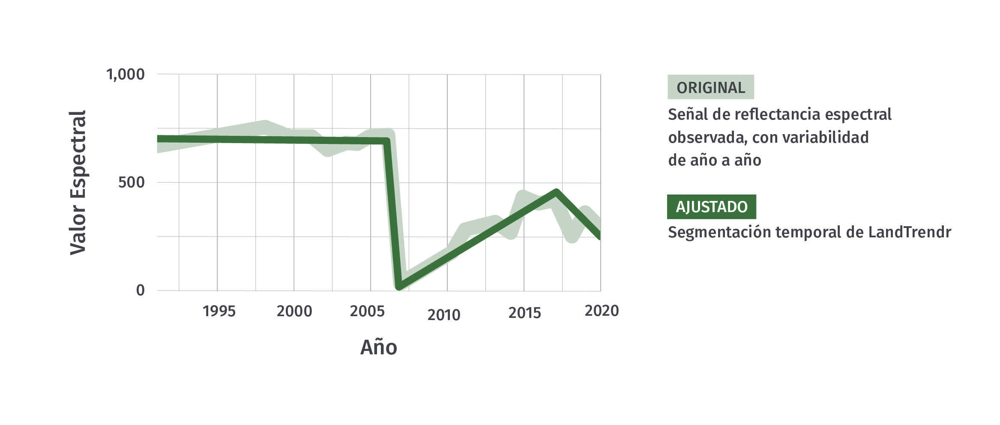

Se deben considerar dos componentes de las trayectorias espectrales al inferir el proceso de la segmentación temporal: la <u>magnitud</u> y la <u>duración</u> del cambio espectral. La <u>magnitud</u> del cambio se refiere al cambio en la cantidad numérica de las propiedades espectrales. Cuanto más cambia la superficie, más probable es que haya un cambio en las propiedades espectrales y, por lo tanto, en la magnitud del cambio a lo largo del tiempo. Sin embargo, dos limitaciones controlan este proceso. Primero, la propiedad espectral que se está rastreando debe ser realmente sensible al proceso de cambio de interés. En segundo lugar, la magnitud del cambio espectral debe ser medible y distinguible de los cambios en los valores espectrales que no son de interés que ocurren debido a la variabilidad en la fenología, el ángulo solar, los efectos atmosféricos residuales, etc.

La <u>duración</u> del proceso se refiere al período temporal durante el cual el proceso de cambio provoca un cambio constante en la propiedad espectral. Algunos procesos, como el crecimiento vegetativo, ocurren continuamente durante muchos años seguidos y, por lo tanto, provocan un cambio continuo en la reflectancia espectral. Después de la segmentación temporal, este proceso será observado por segmentos cuyos puntos finales están separados por varios años. Otros procesos, como el desmonte de tierras, son abruptos y provocan un gran cambio entre sólo dos períodos de observación, con vértices inmediatamente en sucesión.

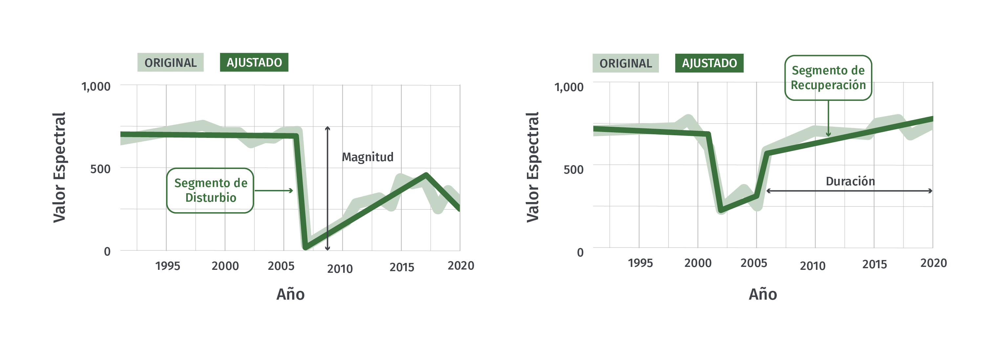

Una vez que la serie de tiempo se segmenta en partes distintas, se pueden consultar los puntos de inicio y finalización para identificar los segmentos correspondientes al tipo de proceso de cambio deseado. Si el objetivo es identificar el desmonte de tierras causado por el hombre, entonces se puede consultar la trayectoria segmentada para encontrar segmentos con vértices en sucesión directa y cuyo cambio direccional en el valor espectral sea consistente con la pérdida de vegetación. Si el objetivo es encontrar áreas de rebrote a largo plazo después de una perturbación, por otro lado, se deben buscar segmentos que muestren cambios espectrales consistentes con el crecimiento de la vegetación durante muchos años. 

Una vez que un segmento de interés ha sido identificado para cada pixel, características claves pueden ser visualizadas de forma espacial para producir mapas de interés. Para mapear el año donde ocurrió un disturbio, por ejemplo, todos los pixeles con segmentos que pierden vegetación rápidamente pueden ser identificados y etiquetados con el año de la caída del segmento. Para mapear la magnitud de la recuperación, el cambio en el valor espectral del vértice inicial al vértice final puede ser mapeado.  

#### 1.1.1 Una nota acerca de los sensores 

El algoritmo LandTrendr se creó para utilizar imágenes de la familia de sensores Landsat, y todos los ejemplos de esta capacitación utilizan estos sensores: Landsat 5, 7 y 8. Con imágenes de esos tres sensores, la serie Landsat proporciona un registro potencialmente ininterrumpido desde 1984. 

Si bien el algoritmo se construyó teniendo en cuenta los datos de Landsat, se puede presentar series de tiempo de cualquier secuencia numérica, ya sea de sensores Landsat, otros sensores satelitales o una fuente completamente diferente. Sin embargo, cuando se utilizan otros tipos de datos, es importante tener en cuenta varias consideraciones. El algoritmo asume que hay una entrada o un insumo por año; si utiliza un paso de tiempo diferente, deberá "engañar" al algoritmo para que piense que está mirando datos anuales. El algoritmo asume que hay una entrada por año; si utiliza un paso de tiempo diferente, deberá "engañar" al algoritmo para que piense que está mirando datos anuales. El algoritmo asume que el cambio duradero en los valores a lo largo del tiempo corresponde a un cambio de interés y que hay suficientes datos para analizar el cambio real del ruido. Si no hay suficientes observaciones a lo largo del tiempo de un sensor dado, no será apropiado para LandTrendr. Como regla general, debe haber aproximadamente de tres a cuatro veces más observaciones que el número máximo de períodos que desea que discrimine el algoritmo. Dado que la captura de un solo disturbio requiere tres segmentos: un segmento previo al disturbio, el segmento de cambio y un segmento posterior al disturbio, es aconsejable no intentar LandTrendr con menos de 10-12 observaciones fiables por píxel.

#### 1.1.2 El recurso de LandTrendr-GEE GitHub 

Hemos desarrollado un manual para la implementación general de los algoritmos de LT-GEE (LandTrendr Google Earth Engine):  https://github.com/eMapR/LT-GEE.  Lectores interesados pueden encontrar descripciones adicionales y complementarias de la lógica de ajustamiento, además de otras funcionalidades de la implementación de LT_GEE que puedan ser de interés. 

### 1.2 Lógica de Ajuste de LandTrendr

La lógica subyacente de los algoritmos de segmentación temporal de LandTrendr es imponer segmentos de tendencia lineal en una serie de tiempo de observaciones para minimizar el error residual. Esto se logra en dos pasos amplios: un paso de identificación del punto de interrupción y un paso de ajuste del modelo. Los detalles de estos pasos no son necesarios para la mayoría de los usuarios y se describen en detalle en la primera publicación sobre el algoritmo (Kennedy et al. 2010: Remote Sensing of Environment 114(12): 2897-2910). Sin embargo, una breve descripción general de los aspectos más destacados del proceso es útil al elegir los parámetros para el ajuste (Tabla 1).

| Parámetro                           | Valores Típicos |
| ----------------------------------- | --------------- |
| Segmentos Máximos                   | 6 a 10          |
| Umbral de Pico                      | 0.75 a 1.0      |
| Rebasamiento del Conteo de Vértices | 3               |
| Prevenir Recuperación de Un Año     | True            |
| Umbral de Recuperación              | 0.25 a 1.0      |
| Umbral de p-value                   | 0.05 a 0.15     |
| Mejor Proporción de Modelo          | 0.75 a 0.90     |
| Observaciones Mínimas Necesarias    | 6-10            |

El proceso general de ajustamiento incluye pasos para reducir ruido e identificar la señal subyacente de la mejor manera. Los datos están acomodados como valores X y valores Y en un plano Cartesiano con los años en el eje X y los valores espectrales en el eje Y. 

Primero, el criterio de *observaciones mínimas necesarias* se utiliza para evaluar si una trayectoria dada tiene suficientes años sin filtrar (es decir, observación clara) para ejecutar el ajuste. 

El paso de identificación del punto de interrupción comienza con un paso de atenuación del ruido para eliminar los picos que podrían ser causados por nubes o sombras sin filtrar. El parámetro *umbral de pico* controla el grado de filtrado, con un valor de 1.0 correspondiente a ningún filtrado y los valores más bajos correspondientes a un filtrado más severo.

Una vez que se ha eliminado la serie de valores espectrales, comienza el algoritmo de vértice. Comienza con el año de inicio y finalización como años de vértice y agrega progresivamente años de vértice candidatos según la desviación de los ajustes lineales. Con este método se encuentra inicialmente una sobreabundancia de años de vértice. Luego, se usa un segundo criterio de ángulo de deflexión para reducir esta sobreabundancia a un número objetivo de años máximos de vértice candidatos. Ese número candidato se establece mediante el parámetro *max_segments* (Segmentos máximos) y, como regla general, debe ser aproximadamente 1/3 del número total de observaciones anuales probables. Los años de vértice (valores X) se pasan luego al paso de construcción del modelo.

En el paso de construcción del modelo, los segmentos de línea recta se construyen ajustando los valores Y (valores espectrales) para los períodos definidos por los años del vértice (valores X), comenzando desde los primeros años del vértice y yendo hasta el último. Las regresiones de cada segmento subsiguiente están limitadas a conectarse al final del segmento anterior. Las regresiones también están restringidas para evitar una recuperación poco realista después de un disturbio, según el parámetro *umbral de recuperación*. Cuanto menor sea el parámetro, más agresiva será la restricción. Un valor de 1.0 significa que la restricción está desactivada, mientras que un valor de 0.25 significaría que los segmentos que se recuperan completamente más rápido que cuatro años (4 = 1 / 0.25) no están permitidos. Este parámetro tiene un fuerte control sobre el ajuste y es uno de los primeros en explorar cuando se prueban parámetros.

Una vez que se encuentra un modelo del número máximo de segmentos, se hacen modelos sucesivamente más simples eliminando iterativamente el vértice menos informativo. Cada modelo se puntúa utilizando una estadística pseudo- *f*, que penaliza a los modelos con más segmentos, para crear un pseudo- *p* -valor para cada modelo. Debido a la autocorrelación temporal, estos valores no pueden interpretarse como valores *f* y *p* verdaderos, sino más bien como escalares relativos para distinguir la bondad de ajuste entre modelos. 

Si no se pueden encontrar buenos modelos usando estos criterios basados en el parámetro de valor * p * establecido por el usuario, se usa un segundo enfoque para resolver el valor Y de todos los años de vértice simultáneamente. Si no se encuentra un buen modelo, se utiliza un modelo de valor medio de línea recta.

Inicialmente, se considera que el mejor modelo es el que tiene el mejor valor *p*. Sin embargo, debido a que la estadística pseudo- *f* penaliza a los modelos más complicados (es decir, modelos con más segmentos), a menudo se puede elegir un modelo sin perturbaciones en lugar de un modelo que captura con precisión la perturbación pero que tiene una puntuación ligeramente inferior. Así, se puede realizar un ajuste que permitirá elegir un modelo con más segmentos siempre que esté dentro de una proporción definida del modelo con mejor puntuación. Esa proporción se establece mediante el parámetro *mejor proporción del modelo*. Por ejemplo, un valor de *mejor proporción del modelo* de 0,75 permitiría elegir un modelo más complicado si su puntuación fuera superior al 75% de la del mejor modelo.

### 1.3 Resultados de LandTrendr

#### 1.3.1 Resultados estándares

El resultado de una ejecución del algoritmo LandTrendr en GEE es una "imagen de matriz" con al menos dos bandas. Las imágenes de matriz son representaciones de datos algo abstractas: piense en cada píxel como un contenedor de objetos que se denominan "bandas". Cada "banda" puede tener datos de una variedad de tipos, y las diferentes bandas no necesitan tener el mismo tamaño o tipo. Las imágenes de matriz en sí mismas no se pueden representar como imágenes geoespaciales, pero las bandas (dentro de ellas) se pueden desempaquetar, remodelar y representar.

La primera banda se llama 'LandTrendr' y es de gran interés. Es una matriz de tamaño [4 por NumberOfYears], donde NumberOfYears es el número de años en la trayectoria de la fuente proporcionada al algoritmo. La primera fila almacena el año de observación, la segunda los valores espectrales que se pasaron al algoritmo - conocidos como valores espectrales de "fuente" - la tercera los valores anuales representados por el ajuste temporal y la cuarta una matriz binaria que indica si el año es un vértice (valor 1) o no (valor 0).

La segunda banda es un escalar que corresponde al error cuadrático medio general del ajuste -- el residuo entre los valores espectrales de la fuente original y los valores ajustados.

#### 1.3.2 Resultados opcionales

Opcionalmente, un usuario puede pasar más de una banda al algoritmo de segmentación LandTrendr. La primera banda siempre se usa para el proceso de segmentación: encontrar vértices y ajustar el mejor modelo de segmentación. Para todas las bandas adicionales pasadas al algoritmo, solo se lleva a cabo la segunda mitad del proceso de segmentación: los años de vértice desde el ajuste del primer índice se utilizan para restringir un proceso de segmentación lineal de las bandas adicionales.

De esta manera, se puede usar un índice que sea sensible al cambio para caracterizar mejor los períodos de tiempo de interés para un píxel, pero luego el dominio espectral completo del sensor se puede hacer coincidir con esos períodos de tiempo para describirlos con mayor riqueza.

Este proceso se conoce como ajuste a vértices o FTV por sus siglas en ingles. Aunque el proceso de FTV está más allá del alcance de este tutorial, los usuarios avanzados pueden aprovechar las imágenes resultantes para construir algoritmos de clasificación de cobertura terrestre de series de tiempo, como se describe en Kennedy et al. (2018).

### 1.4 Aplicación de LandTrendr 

La aplicación de los algoritmos LandTrendr en GEE implica varios pasos. Los usuarios especifican parámetros que controlan la construcción de pilas de imágenes, el proceso de segmentación temporal en LandTrendr, y el posprocesamiento de salidas segmentadas en mapas de perturbación y recuperación.  

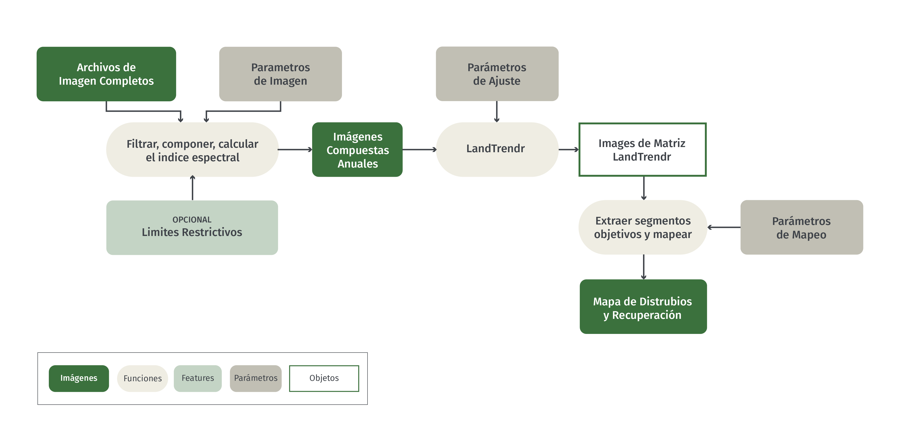 

Para determinar adecuadamente los parámetros de usuario apropiados cada vez que se vaya a aplicar LandTrendr en una nueva región, se recomienda la siguiente secuencia de pasos:

- Determinar los índices espectrales y los rangos de fechas de las imágenes que mejor rastrean los cambios conocidos
- Determinar los parámetros de LT que capturan el cambio observado en el índice espectral.
- Desarrollar reglas para traducir el cambio espectral capturado en mapas de disturbio y recuperación.

A continuación, describimos cómo se pueden abordar estos pasos utilizando una interfaz gráfica de usuario (Sección 3), y cómo la detección de cambios se puede personalizar adaptando los scripts GEE existentes (Sección 4).


## 2 Objetivos de aprendizaje

Al final de este tutorial, los usuarios podrán: 

- Interpretar valores espectrales de series temporales anuales para discriminar entre cambio real en la condición de cobertura terrestre y artefactos espectrales causados por otros factores. 
- Identificar índices espectrales y ventanas de temporalidad que mejor capturan regímenes de disturbios deseados. 
- Escoger parámetros que mejor capturan los patrones en valores espectrales anuales
- Interpretar imágenes compuestas temporales de tres bandas en términos de cambio de cobertura terrestre y la robustez de parámetros de ajuste de LandTrendr 
- Implementar scripts de mapeo de disturbio con LandTrendr a través de la interfaz grafica de usuario (GUI por sus siglas en ingles)

Adicionalmente, usuarios avanzados podrán: 

- Adaptar scripts de LandTrendr GEE para crear mapas de disturbios y recuperación en áreas de interés 

### 2.1 Prerrequisitos

* Conceptos de Google Earth Engine (GEE) (por favor refiérase a la Sección 1.1 del tutorial de Creación de mosaico/imagen compuesta para Landsat y Sentinel-2 en Google Earth Engine para encontrar recursos de GEE útiles)
  - Obtener una cuenta de usuario
  - Imágenes en GEE
  - Sintaxis básico de funciones
  - Procesamiento básico de imágenes, incluyendo elección de imágenes, filtración de nubes, creación de mosaicos y compuestas 

NOTA: Consulte el proceso "Preprocesamiento" y la herramienta "GEE" aquí en OpenMRV para obtener más información y recursos para trabajar en Google Earth Engine y para compuestos de imágenes.

## 3 Quickstart LandTrendr a través de la GUI en GEE

## 3.1 Descripción General

Para evaluar las opciones de imagen y parámetros de LandTrendr, la GUI de LandTrendr es un excelente lugar para trabajar. La interfaz permite una evaluación rápida acerca de las opciones de la ventana de fecha de la imagen, sobre la elección de parámetros y sobre la creación de mapas.

### 3.2 Configuración con bibliotecas y GUI

La GUI la proporcionan los desarrolladores de LandTrendr en el laboratorio eMapR (emapr.ceoas.oregonstate.edu). Este tutorial utiliza una instantánea (diciembre de 2020) de la versión actual.

#### 3.2.1 Open the GUI

En el repositorio común de OpenMRV, busque y abra el script llamado: **OpenMRV_español/Part 2/ LandTrendr_esp/LT-GEE-Vis-DownLoad-app_WB_v1.0_esp**. Cuando se carga y ejecuta, este script crea una GUI LandTrendr-GEE. 

Tenga en cuenta que esta GUI requiere acceso a dos bibliotecas de funciones de utilidad: una que maneja el procesamiento de imágenes y otra que maneja la interfaz GUI. Los usuarios no necesitan cambiar nada en el script para acceder a ellos, pero es útil reconocer que se están llamando a estas bibliotecas externas. Aunque originalmente desarrolladas por el laboratorio eMapR, por conveniencia, como se señaló anteriormente, estas bibliotecas se copiaron a fines de 2020 en el repositorio común de este tutorial de capacitación.

> Nota: Las versiones originales de estas bibliotecas y scripts (incluidas las posibles actualizaciones a lo largo del tiempo) están disponibles en GEE a través de la carpeta / users / emaprlab / public.

#### 3.2.2 Orientación básica a la GUI

La GUI de LT consta de tres paneles: un panel de control a la izquierda, un panel de informes a la derecha y un panel de mapa en el centro.


Un video que muestra la orientación básica de la GUI está aquí: https://youtu.be/tdpuxV7Ad8g

Usando los menús en expansión en el Panel de control, el usuario establece parámetros para las ejecuciones de LandTrendr, muestra imágenes y mapas en el panel central o genera gráficos en el panel de informes. Las ventanas desplegables se controlan haciendo clic en las flechas dobles junto a cada encabezado:


### 3.3 Explorar el accesorio LandTrendr en modo punto

La forma de inicio más sencilla para comprender LandTrendr es aplicar los algoritmos en modo de puntos. Esto le permite visualizar cómo funciona el ajuste y cómo cambiar su configuración puede cambiar el ajuste.

Para acceder al modo de puntos, seleccione el menú "Opciones de serie temporal de píxeles". Debería ver una ventana similar a esta:

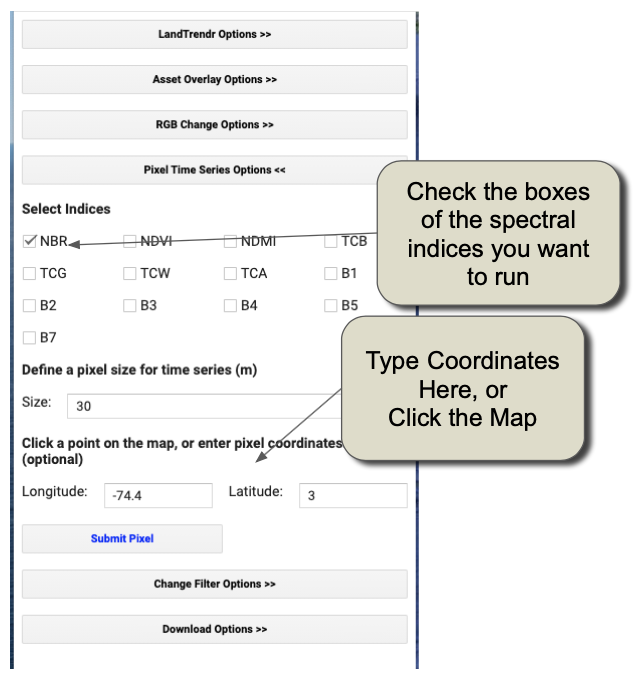

Puede hacer clic en un punto del mapa y esperar pacientemente, o escribir coordenadas y luego hacer clic en el botón "Enviar píxel".

Aquí hay un video que muestra el funcionamiento básico del modo de punto: https://youtu.be/RdQvxTbi37E

#### 3.3.1 Examinar un píxel de disturbio del bosque

Para comenzar, deje todas las configuraciones como están y simplemente escriba estos números en los cuadros Longitud y Latitud, respectivamente, y haga clic en el botón Submit Pixel.

Longitud: -74.43198, Latitud: 2.73876

Debería ver algo como esto:


El gráfico de series de tiempo a la derecha es la clave para aprender a interpretar. Muestra exactamente lo que está haciendo el algoritmo y se basa en las teorías señaladas anteriormente en las secciones introductorias.

Orientarse al diseño y significado de los componentes del cuadro a continuación:


La interpretación central es la diferencia entre la línea gris y la línea roja.

La línea gris representa la trayectoria de los <u>*valores espectrales observados (medidos)*</u> para el píxel. Los valores se extraen de colecciones de imágenes con propiedades que definen la ventana de fecha y los años de la colección. **Nos referimos a estos como valores espectrales de "fuente"**. Rebotan de un año a otro debido a cambios sutiles en la atmósfera, el momento de la adquisición de imágenes, etc.

La <u>*línea roja muestra lo que los algoritmos decidieron que era la mejor segmentación temporal*</u> a través de esos valores observados. Esta es una función de los parámetros de ajuste del modelo de segmentación. **Nos referimos a estos como los valores espectrales "ajustados".**

El objetivo de estos gráficos es determinar si:

1. La trayectoria de los valores fuente captura los procesos que cree que están ocurriendo en la superficie.
2. Los valores ajustados capturan adecuadamente la "forma" general de la trayectoria de los valores fuente.

 Para interpretar estas parcelas, es necesario saber al menos qué dirección de cambio en el índice corresponde a una pérdida de vegetación, ya que la pérdida de vegetación es uno de los medios más comunes para identificar cuándo se ha producido una perturbación. Este es particularmente el caso de los bosques.

En este caso, el índice predeterminado utilizado es el "NBR" o Normalized Burn Ratio (relación de quemado normalizada). Al igual que el índice de vegetación de diferencia normalizada (NDVI) más familiar, el NBR aumenta cuando hay más vegetación en un píxel y disminuye cuando hay más suelo visible en el píxel.

Por lo tanto, interpretando el gráfico anterior, podemos ver que los valores espectrales de la fuente de este píxel cayeron precipitadamente justo antes del año 2010, y luego aumentaron nuevamente durante varios años antes de volver a caer más lentamente al final de la serie de tiempo. Al observar la imagen de fondo en el visor de mapas, podemos ver que esto tiene sentido: parece que el área que se muestra debajo del punto rojo en el mapa tiene la forma y el contexto de una cosecha forestal.

Exploremos otros procesos de cambio. 

#### 3.3.2 Tour guiado de dinámica forestal

Es divertido aprender sobre la dinámica forestal a través de la lente de una máquina del tiempo como los sensores Landsat. Con algunas habilidades básicas de interpretación, puede comenzar a reconocer muchos tipos de dinámicas forestales.

A continuación, daremos algunos valores de longitud y latitud. Escríbalos en el mismo cuadro que hizo para el primer ejemplo, y discutiremos lo que ve en cada punto.

##### 3.3.2.1 Bosque estable

Cuando el bosque es relativamente maduro (es decir, no es un bosque joven de crecimiento vigoroso ni sujeto a perturbaciones o degradaciones), su señal espectral de un año a otro es relativamente estable. He aquí un buen ejemplo:

Longitud:  74.40033, 2.6399 


Características notable: La señal de fuente no se desvía mucho de año a año, y es plana o casi plana. 

Asi es como se ve una foto aérea de este área: 


##### 3.3.2.2 Posible degradación

Aunque la alteración del bosque como la que se muestra en nuestro ejemplo inicial es común, hay otras formas en que el bosque puede verse afectado sin la remoción total del bosque. En este caso, la señal espectral a menudo muestra una reducción de mayor duración en los valores espectrales asociados con la vegetación.

Longitud: -74.45873, 2.65730


Características notables: la caída en los valores de origen a mediados de la década de 2000 ocurre durante más de dos años y fue precedida por una disminución lenta aún más prolongada desde el comienzo del registro, lo que sugiere una pérdida persistente de pequeñas cantidades de vegetación. El segmento que muestra un aumento de varios años a partir de aproximadamente 2007 es constante en el tiempo (es decir, no es ruidoso) y persistente (muestra un patrón constante durante varios años). Cuando estos se observan después de una disminución como la observada en el período 2004-2006, es una evidencia que respalda que la disminución fue real y no un artefacto.

Al ver la foto aérea de la región, vemos evidencia de actividad humana alrededor y dentro del punto mismo. El bosque en el área del píxel parece estar despejado en pequeños parches, y el patrón de remoción sugiere que los humanos participaron activamente en el proceso de remoción. La razón específica de esta degradación requeriría un mejor conocimiento de los impulsores e incentivos locales para la remoción de bosques.

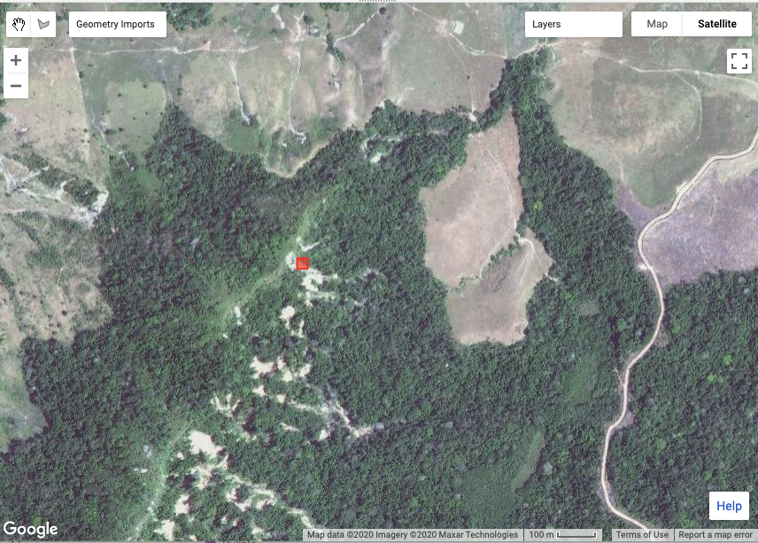


##### 3.3.2.3 Perturbación y recuperación ribereña

Los humanos no son los únicos agentes de cambio en los bosques. Los procesos naturales pueden eliminar la vegetación, solo para que el bosque vuelva a crecer. Los ríos son agentes notables de tal cambio.

Apunte su detector a esta ubicación:

Longitud: -74.06598, Latitud: 2.692711

Y deberías ver esta trayectoria:


Características notables: En la señal de origen, vemos una disminución de varios años en la señal NBR desde aproximadamente 1990 a 1997 o 1998, luego de una breve recuperación rápida y una recuperación más prolongada y lenta desde aproximadamente 1999 hasta el presente. Al final de la serie temporal, podríamos esperar ver un dosel en recuperación.

El ajuste sigue bien estos contornos del tiempo, pero puede subestimar la tasa inicial de recuperación.

Tenga en cuenta que el segmento ajustado que muestra la pérdida de vegetación comienza en 1990 y continúa durante varios años.

La imagen de alta resolución de la era reciente muestra muy poca evidencia de disturbios. Aunque la trayectoria espectral no es ambigua en su descripción del cambio, requeriría la interpretación de los patrones espaciales de las imágenes históricas en sí para confirmar el tipo de cambio.


#### 3.3.3 Otros índices espectrales

En la GUI, puede ejecutar LandTrendr usando muchos índices. Echemos un vistazo a cómo se ve esta última perturbación y recuperación del río en otros dos índices espectrales.

> Nota: Si desea más índices, los usuarios avanzados pueden agregarlos cuando pasen a usar scripts, o incluso adaptando las bibliotecas que usa la GUI aquí. ¡Puede usar cualquier índice que pueda imaginar!

Sin cambiar la Longitud o Latitud, simplemente haga clic en las casillas de verificación junto a "NDVI" y "B5", y haga clic en el cuadro "Submit Pixel", como se muestra aquí:

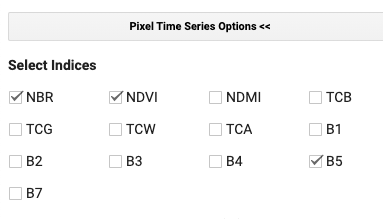

Ahora debería ver dos gráficos más en el panel de informes de la derecha, con el siguiente aspecto:


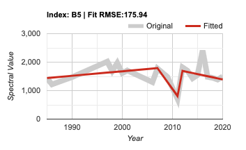

Recuerde, estos son gráficos del mismo píxel que el primero, pero visualizados con diferentes índices espectrales. ¡Las diferencias son notables!

Los datos de la fuente del NDVI muestran aproximadamente el mismo tiempo de perturbación y recuperación, ¡pero el algoritmo no se ajusta a la trayectoria de la misma manera!

La trayectoria B5 requiere una explicación. La banda 5 se refiere al número de banda de los satélites Landsat 5 y 7, donde la banda 5 era la banda infrarroja de onda corta (centrada alrededor de 1,65 micrómetros). La banda 5 sube cuando hay más tierra y baja cuando hay más vegetación.

De hecho, algunos índices son mejores para detectar cambios en determinados entornos que en otros. Para las regiones boscosas, nuestra experiencia sugiere que NBR, NDVI y Band 5 son algo complementarios.

#### 3.3.4 Sugerencias de problemas

Hasta ahora, solo hemos visto áreas donde la señal de la fuente era bastante clara y el ajuste del algoritmo parecía tener sentido. ¡Este no es siempre el caso! De hecho, hasta ahora solo hemos utilizado los parámetros "predeterminados" para los algoritmos LandTrendr, y es posible que no esperemos que sean óptimos para cualquier entorno o situación nueva. Antes de comenzar a cambiar los controles, echemos un vistazo a algunas áreas donde las cosas no funcionan tan bien.

##### 3.3.4.1 Señal de fuente ruidosa

A veces, la señal de la fuente es ruidosa, lo que dificulta la interpretación de un humano o de un algoritmo.

Considere esta área: Longitud: -74.41916, Latitud: 2.70914


Características notables: aunque hay algunos períodos relativamente coherentes (desde finales de la década de 1990 hasta mediados de la década de 2000, y los últimos cinco años o más del registro), hay varios períodos en los que los datos de origen son bastante variables. 

El primer año de la serie temporal parece bajo y aumenta rápidamente en el segundo año. En particular, el algoritmo cree este salto y altera todo el ajuste para adaptarse a esta primera observación.

Esto establece una de las pautas más importantes al trabajar e interpretar algoritmos que operan con datos de series de tiempo de cualquier tipo: **¡cuidado con la primera y la última observación!** Mientras que todas las demás observaciones tienen otra observación externa flanqueándola para ayudar a determinar si es inusual, las primeras y últimas observaciones no tienen este ancla exterior. Por lo tanto, los algoritmos no tienen más remedio que creer en esas observaciones y el ajuste puede verse afectado.

En el período desde aproximadamente 2007 al 2010, los datos de origen saltan y disminuyen de forma bastante dinámica. Pero no está claro si son los años altos los que son anómalos o los años bajos. Dicha dinámica puede ser causada por la variabilidad en las señales estacionales de la vegetación, particularmente en las clases de cobertura de la tierra agrícola u otras clases altamente dinámicas.

Pero como sugiere la foto de estos puntos, esta área probablemente no sea de tipo dinámico. De hecho, ¡parece ser un bosque bastante estable!


¿Qué podría estar pasando? Dado que estamos trabajando en una parte nublada del mundo, la respuesta más probable es que hay nubes o sombras de nubes que pasaron por la etapa de filtrado de imágenes y están contaminando la señal espectral en esos años intermedios de la serie temporal. El extraño valor bajo en el primer año de la serie temporal también sugiere un problema efímero, probablemente también nubes.

¿Como podemos arreglar esto? Dentro de la GUI, la mejor manera de mejorar este problema es cambiar las ventanas de fecha de la colección de imágenes. Discutiremos cómo podemos abordar estos problemas en una sección posterior.

#### 3.3.4.2 Mal ajuste

A veces, la señal de la fuente tiene una forma bastante obvia para el ojo humano, pero el algoritmo no la captura.

Considere esta área:

Longitud: 74.43843, Latitud: 2.67350


Características notables: La señal de la fuente parece ser relativamente estable o incluso en aumento hasta aproximadamente el año 2000, luego muestra una disminución durante dos décadas. Solo a partir de esta señal, parece que la vegetación está perdiendo vigor muy lentamente con el tiempo, pero la causa no está clara. El área parece estar en un pastizal (no se muestra aquí), y puede ser que el cambio en el vigor de la vegetación refleje algún cambio en las prácticas de manejo, pastoreo o cosecha.

El problema mayor es que cualquiera que sea la causa del cambio en la señal de la fuente, el algoritmo de ajuste pierde el punto de inflexión en el año 2000. Para abordar este tipo de problema necesitaríamos cambiar los parámetros de ajuste.


Otro ejemplo de mal ajuste se puede encontrar aqui: 

Longitud: -74.4236, Latitud:  2.6939


Características notables: los datos de origen son más variables que algunos de los ejemplos anteriores, pero no obstante, es probable que la forma de la trayectoria sea interpretable. Aunque cae y se recupera rápidamente, la caída abrupta de 2007 a 2009 probablemente sea una perturbación. El período anterior a la perturbación (hasta aproximadamente 2006) es relativamente estable, y está en una meseta de valores espectrales distintos del inicio de la subida posterior a la perturbación en 2010 en adelante.

Si bien el algoritmo creía que había una disminución, no permitió la recuperación rápida y, en cambio, forzó un segmento de perturbación de larga duración en la primera mitad de la serie de tiempo.

Esto plantea un tema importante en la configuración de parámetros para el ajuste. Uno de los pasos clave en el procesamiento de trayectorias es eliminar los picos de ruido, que el algoritmo define como desviaciones que devuelven el nivel inicial inmediatamente después del cambio. Solo por esa definición, los algoritmos sospechan con razón de la caída a fines de la década de 2000. 

Se pueden ajustar varios parámetros clave en situaciones como esta para alentar al algoritmo a capturar dicho cambio (descrito a continuación). 

#### 3.3.5 Explore independientemente! 

La mejor manera de aprender la interpretación de series de tiempo con los procesos en juego es explorar por su cuenta. De hecho, puede apuntar la GUI a cualquier parte del mundo para explorar ubicaciones en las que crea que puede comprender la dinámica del cambio y experimentar con índices espectrales para ver qué tan bien capturan el proceso de cambio subyacente, y luego evaluar cómo funciona el algoritmo al capturar la forma del índice.

### 3.4 Explorando la dinámica con imágenes compuestas de tres colores

Si bien el modo de puntos es la única forma de comprender y evaluar completamente la fuente y los valores ajustados, es una forma ineficiente de explorar los patrones espaciales. Podemos encontrarnos con píxeles donde los valores de origen indican un problema con las imágenes, o donde los parámetros de ajuste probablemente no se eligen apropiadamente, pero tales hallazgos ocurren por casualidad. Sería útil tener una herramienta visual rápida para escanear el paisaje y evaluar tendencias y problemas potenciales.  

La herramienta de visualización RGB en la GUI de LandTrendr está diseñada para evaluar rápidamente patrones espaciales de ajuste espectral por el algoritmo. En esta herramienta, ejecutamos LT en muchos píxeles y luego mostramos imágenes de los valores ajustados de LT en píxeles, con diferentes años de imágenes ajustadas en los colores rojo, verde y azul de la pantalla. Con el conocimiento de los años que se muestran y las propiedades de los valores espectrales que se representan, es posible interpretar patrones espaciales en las imágenes RGB en términos de sus procesos de cambio de cobertura terrestre o problemas con las imágenes o el ajuste.  

Vamos a explorar la herramienta de Visualización RGB. 

#### 3.4.1 Cargar un área de estudio delimitada en Colombia

Los algoritmos LandTrendr son computacionalmente intensivos y tardan algún tiempo en ejecutarse. Con fines de capacitación, es útil limitar nuestro análisis a un dominio geográfico relativamente pequeño. 

Por lo tanto, el primer paso es cargar un asset de GEE para definir el área de interés. En el Panel de control, seleccione el menú "Asset Overlay Options" (Opciones de superposición de activos) (Figura P1) e ingrese estos valores:

1. En el primer cuadro, ingrese la ruta al activo: **users / openmrv / MRV / ColombiaRectangle**
2. En el primer cuadro de la sección "Define Layer Name" (Definir nombre de capa), ingrese un nombre que reconocerá cuando aparezca en las capas del mapa. "ColombiaRectangle" es una buena opción.
3. Cerca de la parte inferior, **haga clic en la casilla de verificación** que hace que la primera capa sea la que se utilizará para restringir análisis posteriores.
4. Haga clic en 'Add asset to map' (Agregar activo al mapa).

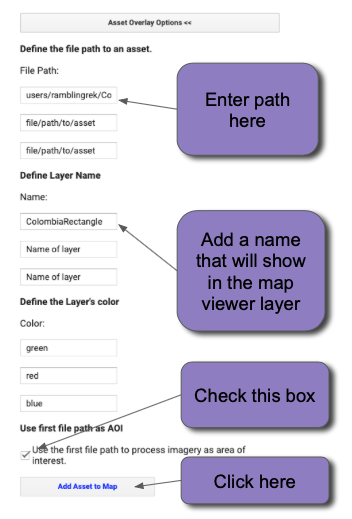

Figure P1.  El menú de "Asset Overlay Options", usado para agregar una casilla de restricción al mapa para análisis y visualización posterior. 

Cuando haya realizado estos pasos, el límite del área de interés debería aparecer en el centro del mapa como un cuadro blanco. Acérquese un poco para que el cuadro blanco llene la mayor parte del área del mapa (Figura P2). El área a continuación es útil porque incluye bosques sustanciales, porque tiene abundantes cambios naturales causados por los ríos y tala de bosques antropogénicos, y porque es lo suficientemente pequeña como para poder analizarla a medida que aprende.

> NOTA: Puede utilizar esta misma herramienta de gestión de activos para cargar un área de delimitación diferente de su elección. La única limitación es que debe ser un asset de GEE para el que tenga derechos de visualización.


#### 3.4.2 Visualizar e interpretar imágenes ajustadas en modo RGB 

¿Qué son las imágenes ajustadas? Como ha aprendido en el modo de píxeles, el algoritmo LandTrendr crea trayectorias ajustadas de valores espectrales a una escala de píxeles. A cada año de la serie temporal se le asigna un valor ajustado del modelo de segmentación temporal. Si tuviéramos que ejecutar LT para muchos píxeles, podríamos tomar una foto instantánea de los valores ajustados de cualquier año y producir una imagen de ese índice espectral para ese año. Podríamos hacer lo mismo durante otros dos años, y si asignamos un año a cada una de las pistolas de color del monitor, veríamos una imagen RGB combinada. La interpretación de los colores en esta imagen nos habla de la trayectoria de ajuste.

> Nota: Para obtener una buena descripción gráfica de este proceso, consulte la Sección 8.3 en la Guía del usuario de LT-GEE producida por el laboratorio eMapR en Github: https://emapr.github.io/LT-GEE/ui-applications.html#ui-landtrendr-fitted-index-delta-rgb-mapper

##### 3.4.2.1 Cargar una combinación de imágenes RGB

Probémoslo para el área de estudio de interés. Abra el menú del mapeador de cambios RGB en la GUI. Debido a que cargamos un activo y, en el menú Asset de arriba, hicimos clic en la casilla de verificación que decía "Usar la primera ruta de archivo para procesar imágenes" (Marcó la casilla de arriba, ¿verdad?), podemos ignorar muchas de las opciones aquí.

Sin embargo, si en el futuro desea ejecutar el mapeador RGB de diferentes formas, tenga en cuenta que puede establecer el punto central y un cuadro a su alrededor, o puede delinear su propia geografía arbitraria.

Un video básico que muestra la herramienta RGB está aquí: https://youtu.be/VSeia3NRa3c


Haga clic en "Add RGB Imagery" (Agregar imágenes RGB), y espere pacientemente.  Puede tomar un minuto para cargar enteramente el área seleccionada. Cuando termine, debería de ver algo así: 


> Nota: Hay algunas áreas en el borde izquierdo de esta área de estudio que tienen datos faltantes (indicado al poder ver la imagen subyacente en lugar de los valores ajustados). Estas áreas no tienen suficientes observaciones desenmascaradas para ejecutar el ajuste temporal (el parámetro "minimum observations needed" (observaciones mínimas necesarias) es una cantidad definida por el usuario (Sección 2 anterior).

#### 3.4.2.2 Interpretar cambio como colores

Como interpretar los colores? Asumamos que estamos trabajando con un índice como NBR o NDVI donde los valores altos indican mas vegetación y los valores bajos indican menos vegetación. 

Primero, consideremos lo que significa un área *sin colores* -- una área que es negra, blanca, o algunos tonos grises entre medio.  Si un área es alguna variación de negro a blanco, significa que la trayectoria de valores espectrales es estable a través de los años. En la esquemática siguiente, las líneas negras horizontales son tres trayectorias diferentes de pixeles, todas perfectamente planas (o sea, estable a través del tiempo)f: 

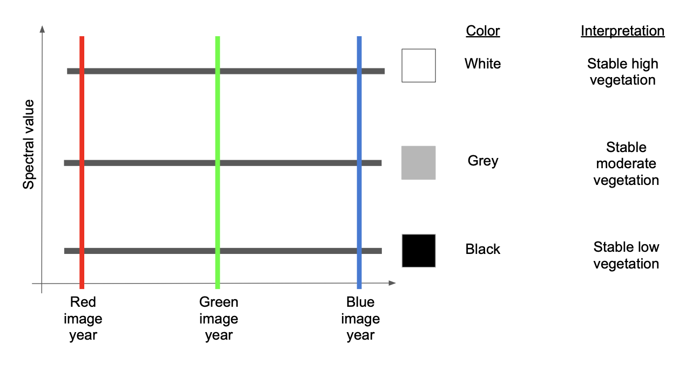

Si tenemos un disturbio entre los años Verdes y Azules, eso significa que el índice estará alto entre los colores Rojos y Verdes, pero bajo en Azul. Siguiendo la teoría de Color Aditivo (ver https://en.wikipedia.org/wiki/Additive_color), esto resultaría en un color amarillo.  


Si, a lo contrario, el disturbio ocurrió antes del año verde y no vio mucha recuperación en el año Azul, tendríamos la mayoría de valores altos en rojo. 


Si *si* estuvieran en recuperación en la época del año azul, entonces habría un alto rojo y azul, lo que haría algo de púrpura o magenta.


Un par de otras variantes se ven comúnmente y vale la pena aprender.

Si un área ve un crecimiento constante en la vegetación a lo largo de todos los años, tendrá un rojo relativamente bajo, un verde ligeramente más alto y un azul más alto, lo que hará que el color cian se convierta en azul.


Finalmente, si hay un declive persistente durante todo el período de tiempo, el rojo será el más alto, seguido del verde y luego del azul, haciendo una versión de marrón o naranja.

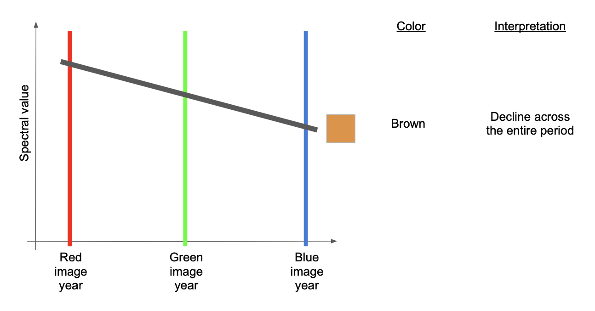

#### 3.4.2.3 Usar un trazador de píxeles con imágenes RGB para interpretar colores

Esas reglas de color pueden ser algo abstractas hasta que se vean en acción. La GUI de LandTrendr nos da la oportunidad de hacer eso: ¡use el mapa de color RGB para seleccionar píxeles y trazarlos en el modo de nivel de píxeles!

Vamos a hacerlo.

Primero, verifique que su imagen RGB se haya cargado en el rectángulo de Colombia.

Luego, en el menú Control a la izquierda, vuelva a seleccionar el menú "Opciones de serie temporal de píxeles", como lo hizo en la Sección 3.3.

Ahora, puede hacer clic en la imagen RGB para ver cómo se ven los píxeles en diferentes áreas de la imagen.

Primero, observe algunos píxeles en la gran franja de azul:


Aquí esta la serie de tiempo para uno en esa región: 


Como sugiere nuestra guía de interpretación de colores anterior, la línea ajustada (en rojo) aumenta a lo largo de toda la serie de tiempo. Pero podemos ver que esto, como un ejemplo en la Sección 3.3., es el resultado de que el algoritmo se tropezó por problemas aparentes en el primer año de la serie de tiempo.

El patrón espacial del azul en la imagen es una pista de que esto podría ser un artefacto de nubes: el tono azul se extiende a través de una gran franja de la imagen y parece no estar relacionado con los patrones en el paisaje subyacente. Esto sugiere una nube o nubes.

Otra área donde los patrones espaciales de colores en la imagen RGB no coinciden con los patrones aparentes en el paisaje es a la derecha (este) del área de estudio, donde hay una buena cantidad de "rayas" púrpuras.

Zoom a una de las franjas violetas y haga clic en ella.

> Nota:  cuando cambie la extensión de la imagen, GEE recalculara la imagen ajustada, así que por favor sea paciente! 

Aquí hay un ejemplo: 


Interpretación: Utilizamos el visor RGB combinado con el trazador de píxeles para evaluar patrones espaciales y temporales. Al examinar solo las trayectorias espectrales superiores e inferiores, las imágenes de origen parecen mostrar caídas en el valor espectral que persisten durante más de un año y pueden parecer reales. Sin embargo, con el visor RGB, podemos ver que el patrón espacial está disyunto del paisaje subyacente (no se muestra en la figura de arriba, pero está boscoso). Además, el patrón de perturbación parece ser horizontal y lineal.

El patrón espacial de estos artefactos sugiere el patrón de error de la línea de escaneo de Landsat 7, un problema en el que no se registran cortes aproximadamente horizontales de las imágenes de Landsat 7.  

> Nota!  El problema no es con las imágenes de Landsat 7, si no su falta de datos en estas áreas, las cuales permiten que se vean las imágenes subyacentes de Landsat 8 o Landsat 5 y sus problemas de nubes por los huecos! 

Sin embargo, la interpretación resumida aquí es que esta región tiene una nubosidad persistente que no está siendo capturada por los algoritmos de máscara de nube predeterminados.

¿Cuál es la solución? ¡La cosa clave aquí es que la nubosidad persistente está ocurriendo dentro de la ventana de la temporada que estamos utilizando para construir las colecciones de imágenes! Por lo tanto, la mejor opción es examinar y cambiar la ventana de tiempo para las colecciones de imágenes. Haremos eso en la siguiente sección, pero primero veamos algunos *disturbios reales*.

Busque áreas que tengan patrones rojos y amarillos; esos deberían de representar disturbios.

Aquí hay un ejemplo: 


Los patrones espaciales de las áreas roja y amarilla son consistentes con el patrón del paisaje subyacente, lo que otorga credibilidad a la detección del cambio real. Además, los datos de origen en las trayectorias de píxeles, aunque son ruidosos, parecen ser consistentes con la señal de perturbación.

Sin embargo, también vemos un ejemplo de una perturbación violeta con un patrón espacial extraño (figura inferior derecha). Pasando el cursor sobre el gráfico y examinando los datos de origen gris, se puede inspeccionar qué años de datos están realmente presentes. Al hacerlo, resulta que faltan muchos años de datos fuente. Esto ocurre cuando hay nubes.

Por lo tanto, tenemos más evidencia de que la ventana de imagen elegida para la ejecución predeterminada de LandTrendr aquí no es óptima para Colombia. Trabajemos con eso.

### 3.5 Actualizando los Parámetros de Imagen y Ajustes 

Hasta ahora, nos hemos basado en los parámetros "predeterminados" para ejecutar el algoritmo LT: las ventanas de fecha del año para construir colecciones de imágenes y los parámetros de ajuste para controlar el algoritmo. ¡Y hemos visto evidencia de que esto puede no ser lo suficientemente bueno para nuestra nueva situación en Colombia!

Para mejorar esto, debemos definir las imágenes básicas que se proporcionarán al algoritmo y los parámetros de ajuste para controlar el algoritmo. Estos ocurren en el menú de expansión "Opciones de LandTrendr" de la GUI.

Un video básico que muestra este proceso está aquí: https://youtu.be/TNQOdHIg24s

#### 3.5.1 Cambiar valores en el menú

En la Sección 3.5, primero describimos la lógica para cada componente y proveemos recomendaciones para nuevos valores para intentar.


Como se noto en el diagrama de flujo de trabajo  (Sección 2.4), el primer paso en el flujo de trabajo de LandTrendr es para procesar archivos de imágenes en compuestas anuales. Crear imágenes compuestas recude el ruido en la serie temporal; en las bibliotecas estándares de LandTrendr, utilizamos un método de composición con medoide (Descrito en Sección 5 abajo). 

Necesitamos determinar dos grupos de valores: el rango de años a partir del cual extraer para la segmentación y el rango de fechas estacionales dentro de cada año a partir del cual calcular los compuestos.

##### Años de Imágenes

Como se señaló en la Sección 2.1.1, el algoritmo LandTrendr está diseñado para trabajar con datos de la familia de sensores Landsat que se remontan a 1984. En la práctica, muchas áreas tropicales del mundo no tienen suficiente disponibilidad de imágenes en los primeros años del archivo Landsat para proporcionar composiciones de imágenes razonables.

Si no hay imágenes al principio de la serie de tiempo, el algoritmo simplemente iniciará el proceso de segmentación temporal en el primer año que tenga datos desenmascarado. Por lo tanto, es razonable comenzar un proceso de segmentación con el año inicial establecido en 1984 y el último año establecido en el año más actual.

En la práctica, hay dos razones para establecer el primer año posterior a 1984. Primero, con menos imágenes recopiladas en los primeros años del programa Landsat Thematic Mapper, hay menos imágenes para dibujar. Si las nubes son comunes en el área de interés, el paso de composición de imágenes se basará en menos imágenes y puede verse obligado a incluir imágenes más alejadas de la condición fenológica (estacional) deseada. En segundo lugar, en algunas áreas del mundo, parece que las propiedades espectrales de las imágenes de los primeros años del registro son menos consistentes que el resto del archivo. Por lo tanto, en la práctica recomendamos establecer el año inicial en 1986 o posterior.

Además, si los pasos posteriores muestran que pocos píxeles tienen valores en los primeros años, entonces la coherencia en el dominio de la imagen sería un argumento para comenzar todo el proceso de segmentación en un año posterior.

Por lo tanto, **recomendamos establecer 1990 como el año inicial**, y dejar el año final como 2020. 

##### Rango de Datos

LT asume que cada píxel tiene una observación por año. Minimizar el impacto de las nubes requiere que construyamos estas observaciones componiendo múltiples imágenes dentro de una ventana de fecha por año. Si la ventana es demasiado estrecha, es posible que no haya suficientes imágenes a partir de las cuales se pueda realizar una composición clara. Si la ventana es demasiado amplia, los efectos de la estacionalidad de la vegetación podrían introducir cambios espectrales indeseables que no están relacionados con el cambio real en el suelo.

La elección del rango de fechas es una de las opciones más importantes en el proceso de implementación de LandTrendr. El usuario debe equilibrar el objetivo de utilizar imágenes en las épocas del año en que es más probable que haya observaciones claras con el objetivo de encontrar el cambio de interés.

El rango predeterminado es de junio a septiembre, lo que no es inverosímil para uno de los períodos más secos en Colombia. Sin embargo, hemos visto en nuestros ejemplos que tenemos problemas con la nubosidad.

Por esto **recomendamos establecer la fecha inicial en 01-01 y la fecha final en 04-30**.  Esto provee cuatro meses de imágenes potenciales de cuales extraer durante una de las temporadas secas. 

##### Fuente e índice ajustado

Para este ejercicio, usaremos NBR. Usuarios son bienvenidos a experimentar con índices diferentes más tarde. 

##### Parámetros de Segmentación 

<u>Max Segments</u>:  Cambie esto a 8.  Con 30 años de datos posibles (1990 a 2020), ocho segmentos sigue siendo apropiado, ya que está bajo la regla de una tasa de 3:1. Incrementando de 6 a 8 segmentos puede ayudarnos a descubrir ajustes un poco mas complicados durante los 30 años de análisis. 

<u>Spike Threshold:</u>  Mantener en 0.9.  Este parámetro puede tener un efecto cuando hay trayectorias ruidosas, pero pueda que no se necesite cambiar hasta que veamos los impactos de cambiar el rango de fechas. 

<u>Vertex Count Overshoot:</u>  Mantener en 3.  Este parámetro raramente se necesita cambiar.

<u>Prevent One Year Recovery</u>:  Cambiar a "false" (notar las letra minúsculas).  Este es un parámetro agresivo que hace lo que sugiere -- previene segmentos de recuperación de un año.  Sin embargo, es generalmente mas útil ajustar la recuperación usando el próximo parámetro -- el umbral de Recuperación. 

<u>Recovery Threshold:</u>  Cambiar a 0.75.  Cuando este parámetro esta puesto en el valor automático de 0.25, no se permiten segmentos que se recuperan mas rápidamente que 4 años, pero en regiones tropicales es normal ver la recuperación rápida de la vegetación después de un disturbio. De esta manera, si el valor esta puesto en 0.75, la recuperación rápida se permite, pero no mas rápido que 1 / 0.75 años-- esto amortigua los impactos del ruido.

<u>p-value Threshold:</u>  Mantener en 0.05.  Sin embargo, si notamos que los ajustes so están rastreando los datos de fuente ruidosos, este valor debería de ser relajado y puesto en 0.15. 

<u>Best model Proportion:</u>  Mantener en 0.75

<u>Min Observations needed:</u>  Mantener en 6. 

#### 3.5.2 Evaluar parámetros nuevos 

Veamos qué sucede tanto con los compuestos RGB ajustados como con los píxeles individuales una vez que haya cambiado los parámetros de LT.

Primero, vuelva a abrir el menú "RGB Change Options" (Opciones de cambio de RGB) y haga clic en el botón "Add RGB Imagery" (Agregar imágenes RGB) nuevamente. Cuando la imagen se vuelva a cargar, debería verse así:

 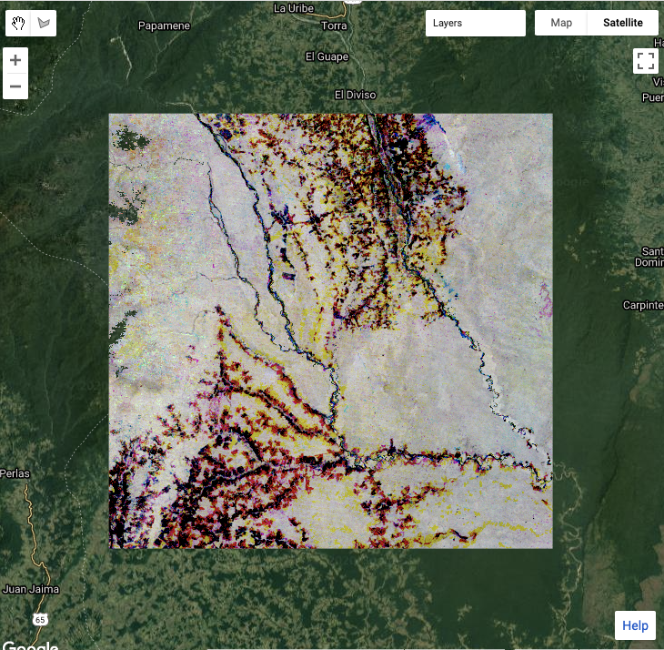

Interpretación: se ve mucho mejor que la versión anterior. ¿Por qué? Hay menos artefactos obvios asociados con las nubes y el error de la línea de exploración del Landsat 7. De hecho, gran parte del área boscosa ahora aparece como tonos de gris, lo que sugiere estabilidad en la señal espectral ajustada. Además, las áreas de posible alteración permanecen (y de hecho son más prominentes) como rojos y amarillos.

Al acercarnos a la región de la mitad oriental de la imagen, parece que los problemas con las nubes se han solucionado en gran medida:


#### 3.5.3 Explorando los impactos de los parámetros de ajuste

El impacto de cambiar los parámetros de ajuste de LandTrendr varía en diferentes países debido a las diferentes densidades de archivo de imágenes, las condiciones de nubes y fenología, y el tipo de bosque y el proceso de cambio del bosque. Por lo tanto, el mejor enfoque para ver cómo operan los parámetros de ajuste de la imagen es simplemente experimentar cambiando los parámetros y evaluando el impacto usando el panel de Pixel Time Series Options.  

Como ejemplo, podemos considerar el píxel en Longitud: -74.284722, Latitud: 2.783660. 

Con la configuración de los parámetros que teníamos arriba, se captura la perturbación y se captura un período de estabilidad posterior a la perturbación antes de que vuelva a crecer. Sin verificación de suelo substantiva, no es posible determinar fácilmente si las características articuladas en el recrecimiento posterior a la perturbación son indicaciones de ganancia y pérdida reales, o si las características algo ruidosas de la señal fuente son artefactos.


##### Eliminar los picos

Para apagar la función de eliminar picos, poner el valor en 1.  La trayectoria de fuente se usa de la manera exacta en la que es recibida. En este pixel, apagar la eliminación de picos de esta manera cambia el comportamiento de los segmentos después de los disturbios. 


La función de eliminar picos eliminó características de la serie temporal, lo cual es deseado cuando esas características son ruido, pero también puede comenzar a eliminar información real si el valor es demasiado agresivo. Poniendo **de-spike=0.5** elimina algunas de las características de disturbio, y aunque la forma recuerda a la configuración original, pierde algunos detalles.


##### Umbral de Recuperación

El parámetro de umbral de recuperación ejerce un fuerte impacto en el ajustamiento. Recuerde que el parámetro establece el límite en la velocidad de retorno del valor espectral posterior al disturbio.

Regresando a nuestros parámetros básicos, y luego poniendo **recovery_threshold=0.25** forza la simplificación de la recuperación considerablemente: 


Aunque se suaviza una cantidad considerable de información posterior a la perturbación, se conserva la sincronización de la perturbación original, y esto podría ser suficiente en áreas con ruido considerable en la señal fuente.

Sin embargo, desactivar el umbral estableciéndolo en **recovery_threshold = 1.0** permite que surjan detalles en la trayectoria posterior a la perturbación. En algunos casos, estos pueden ser detalles realistas, pero en otros puede resultar en un ajuste excesivo del ruido. Para la trayectoria que se muestra aquí, no está claro si el salto en el valor espectral de NBR 2012 es de hecho real o un artefacto.


##### P-value Threshold (Umbral P-value)

El aumento del umbral del valor p permite capturar ajustes que retienen más ruido residual después del ajuste.

En el caso de nuestro píxel de prueba, establecer el ** umbral del valor p = 0,15 ** parece conducir a una falta de ajuste de la profundidad de la perturbación, así como a un ajuste excesivo al final del período de tiempo.


##### Best-model proportion (Proporción de mejor modelo)

Cuando se establece en un valor menor que 1.0, este parámetro permite elegir ajustes más complicados incluso si no tienen el mejor valor p. Nuestro valor predeterminado era 0,75, y establecer **proporción del mejor modelo = 1,0** no cambia el ajuste de este píxel en particular en relación con nuestro punto de partida:


En la práctica, este parámetro rara vez tiene grandes impactos.

Sin embargo, puede funcionar con otros parámetros para provocar un ligero cambio en el ajuste. Por ejemplo, establecer el umbral de valor p en 0,15 y la proporción del mejor modelo en 1,0 da como resultado este ajuste ligeramente diferente:

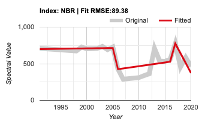


### 3.6 Mapeo de Disturbios

En el enfoque de segmentación temporal, el mapeo de perturbaciones forestales es esencialmente una consulta a nivel de píxel de la trayectoria segmentada. Por lo tanto, una vez que haya identificado un conjunto de ventanas de fecha de imagen y parámetros de ajuste, gran parte del trabajo más dificil estará hecho.

Sin embargo, todavía hay un conjunto de parámetros para considerar: aquellos que identifican y mapean los disturbios de las trayectorias segmentadas.

Analicemos cómo se pueden mapear las perturbaciones forestales.  

Considere una trayectoria segmentada del índice NBR que es relativamente estable durante el año 2006, luego cae precipitadamente a un valor bajo en 2007 porque el bosque ha sido talado (disturbio), y eventualmente regresa a un valor moderado algunos años después (ver figura a continuación).


Los años de vértice en el eje-x y los valores de NBR en el eje-y se almacenan en la matriz de imágenes que devuelve el algoritmo LT. La trayectoria ajustada (línea roja) está representada por vértices correspondientes a los puntos finales de los segmentos de línea recta, y el cambio en el índice espectral se puede calcular para cada segmento (aquí se muestra en la columna "Delta NBR").

Una simple consulta sobre el cambio en el índice espectral puede identificar segmentos de disturbio según la dirección del cambio. La dirección del disturbio (aumento o disminución) se define para todos los índices espectrales candidatos en LandTrendr. La selección del cambio más grande identifica la mayor magnitud de perturbación. Una vez que se encuentra el segmento de disturbio apropiado, el año, la magnitud, la duración, y el valor espectral previo a la perturbación se pueden pintar a nivel de píxel para crear varios mapas de disturbios. 

Por supuesto, no todos los cambios similares a perturbaciones en el valor espectral son perturbaciones verdaderas. Como ya habrá descubierto al consultar píxeles individuales, los segmentos similares a perturbaciones también pueden ocurrir si el algoritmo se confunde con un índice espectral de pequeño cambio. Por lo tanto, a menudo es deseable eliminar de la consideración aquellos segmentos de disturbio cuyo cambio es menor que algún valor umbral de magnitud.

Además, puede que un usuario solo esté interesado en perturbaciones abruptas, para concentrarse en la actividad de desmonte.

Por último, es probable que haya algunos píxeles individuales que aún estén sujetos a ruido en los datos de origen y parezcan perturbaciones en los datos ajustados. Si hacemos cumplir las reglas que establecen que los parches de perturbación deben contener un número mínimo de píxeles adyacentes, podemos eliminar estos pequeños errores.

Estos son objetos que se pueden establecer en el menú de "Change Filter": 


Suponiendo que todavía tiene ColombiaRectangle configurado como el primer activo en la herramienta Asset Manager, cuando haga clic en "Add Filtered Disturbance Imagery" (Agregar imágenes de disturbios filtradas), el algoritmo ejecutará LT en cada píxel, usará las imágenes de ajuste y las guías de parámetros y luego las agregará a el mapa. Al igual que con las imágenes RGB, llevará un poco calcular y cargar (por eso nos limitamos a una región relativamente pequeña para el entrenamiento).

Un video básico demostrando esta configuración se encuentra aquí:  https://youtu.be/f8xPDzEknQg

El mapeador de disturbios agrega tres capas al mapa: año de detección, magnitud, y duración. A continuación, se muestra una descripción general de las capas Año y Magnitud para nuestra área focal:


Si se acerca lo suficiente para ver patrones reales de perturbación, los resultados aquí son prometedores:


Haciendo referencia tanto al año como a la magnitud de la perturbación, se pueden identificar áreas sospechosas de baja magnitud con patrones espaciales que pueden no ser realistas, y usar la herramienta de nivel de píxel para consultarlos y ver si los valores de umbral podrían mejorarse.

Por ejemplo, el examen de las trayectorias a nivel de píxeles de algunas de estas perturbaciones de baja magnitud sugiere que de hecho son causadas por ruido en la señal fuente:

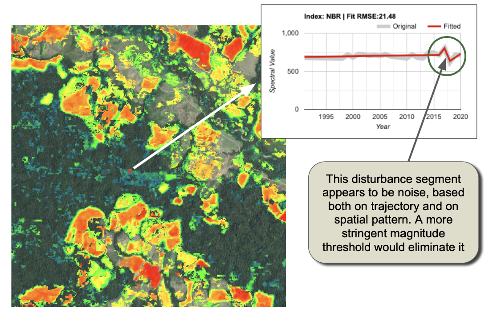

El umbral de cambio puede hacerse más estricto para evitar estas asignaciones de falsos positivos. Sin embargo, si el umbral es demasiado conservador, se perderá el cambio real (falsos negativos). El proceso de mapeo, ajuste de parámetros, y evaluación de patrones puede ser iterativo hasta que tales inspecciones visuales sugieran que el mapa equilibra tanto los falsos positivos como los falsos negativos.

Sin embargo, el paso final de la evaluación ocurre cuando se utilizan datos independientes para evaluar la precisión del mapa final. Este tema se trata aquí en OpenMRV en el proceso "Estimación de área/Evaluación de precisión".

# 4 Implementación detallada de LandTrendr usando Javascript

## 4.1 Reseña
Mientras que muchos usuarios satisfacen sus necesidades a través del uso de la GUI, usuarios intermedios o avanzados pueden implementar LT directamente usando scripts. Esta sección introduce la funcionalidad central de LT manejada por scripts. 

### 4.2  Script del Disturbio Mayor (Greatest Disturbance)

En esta sección, perfilamos el script maestro que crea mapas de perturbaciones. Sin embargo, al igual que con la GUI en la Sección 3 de este módulo, la secuencia de comandos Greatest Disturbance que compartimos en esta demostración utiliza una biblioteca LandTrendr Javascript para realizar gran parte del trabajo detrás de escena. Dentro de la biblioteca de Javascript hay funciones que se importan y utilizan dentro de otros scripts. Aunque las bibliotecas incluyen más funciones que las que se utilizan aquí, muchos componentes pueden considerarse funciones básicas que un usuario intermedio o avanzado puede querer aprovechar o incluso adaptar a sus propios fines. Estos se detallan en la Sección 5.

#### 4.2.1. Cargar script y configuraciones de nota

El script del mapeador de Disturbios Mayores se puede encontrar en: 

 `users/openmrv/MRV/OpenMRV_español/Part 2/LandTrendr_esp/LandTrendr Greatest Disturbance Mapping_esp`

La primera sección del script permitirá que manualmente ingrese los parámetros que seleccionó cuando estaba utilizando el menú de parámetros en la GUI de LandTrendr:

```javascript
// definir parámetros de colección
var startYear = 1990;
var endYear = 2020;
var startDay = '01-01';
var endDay = '04-30';
var index = 'NBR';
var maskThese = ['cloud', 'shadow', 'snow', 'water'];

// definir parámetros de landtrendr
var runParams = { 
  maxSegments:            8,
  spikeThreshold:         0.9,
  vertexCountOvershoot:   3,
  preventOneYearRecovery: true,
  recoveryThreshold:      0.75,
  pvalThreshold:          0.05,
  bestModelProportion:    0.75,
  minObservationsNeeded:  6
};

```

Estos son idénticos a los que uso en la ultima sección de parte 3 arriba:

Adicionalmente, establecimos los parámetros de cambio de disturbio: 

```javascript
var changeParams = {
  delta:  'loss',
  sort:   'greatest',
  year:   {checked:true, start:1990, end:2020},
  mag:    {checked:true, value:100,  operator:'>'},
  dur:    {checked:true, value:4,    operator:'<'},
  preval: {checked:true, value:300,  operator:'>'},
  mmu:    {checked:true, value:11},
  
};
```

El único parámetros adicional aquí es llamado "preval", el cual representa el valor de índice espectral que un pixel debe exceder en el estado pre-disturbio para contar como disturbio. Poner este parámetros reduce el mapeo de los positivos-falsos en regiones que ya existen sin vegetación. 

Un paso importante en este script y en el script de la GUI es cargar las bibliotecas de LandTrendr. Se logra usando esta declaración: 

```javascript
var ltgee = require('users/openmrv/MRV:ChangeDetection/LandTrendr_V2.4WB.js'); 
```

La declaración central al algoritmo de LandTrendr es esta: 

```javascript
var lt = ltgee.runLT(startYear, endYear, startDay, endDay, aoi, index, [], runParams, maskThese);
```

Notar que la biblioteca `ltgee` es la que se acaba de importar. Usuarios avanzados pueden examinar esa biblioteca para rastrear los pasos en la llamada al algoritmo LandTrendr (Ver Sección 5 abajo). 

El algoritmo LT-GEE  devuelve un objeto llamado imagen, pero el cual no es una imagen en el sentido que normalmente consideramos: No puede ser mapeado fácilmente. Al contrario, es de una forma descrita arriba en la Sección 2.3.1. Para mapear un disturbio, necesitamos reempaquetar ese resultado. Por lo tanto, una segunda función es necesaria para ese proceso: 

```javascript
var changeImg = ltgee.getChangeMap(lt, changeParams);
```

El resultado changeImg tiene las próximos capas accesibles por sus Band Name (Nombre de Banda):

| Nombre de Banda | Descripción                                                  |
| --------------- | ------------------------------------------------------------ |
| yod             | Primer año *después* del año del vértice al principio del segmento |
| mag             | El cambio en valor espectral de principio a fin              |
| dur             | El largo (en años) del segmento                              |
| preval          | Valor índice del vértice al principio del segmento           |
| rate            | La magnitud dividida por duración                            |
| dsnr            | Magnitud escalada por el RMSE del ajuste general.            |

La magnitud y el año de detección del changeImg pueden ser visualizados en el visor con: 

```javascript
Map.addLayer(changeImg.select(['mag']), magVizParms, 'Magnitude of Change');
Map.addLayer(changeImg.select(['yod']), yodVizParms, 'Year of Detection');
```

Finalmente, la imagen es exportada a la cuenta de Google Drive del usuario, o a otro Asset de GEE. El código para exportar sigue:   

```javascript
Export.image.toDrive({
  image: exportImg, 
  description: 'colombia_distmap_rectangle', 
  folder: 'openMRV', 
  fileNamePrefix: 'colombia_distmap_rectangle', 
  region: aoi, 
  scale: 30, 
  crs: 'EPSG:4326', //NOTA:  la información CRS debería ser cambiada para coincidir con la mejor proyección para su area de estudio
  maxPixels: 1e13
});
```

Probablemente querrá cambiar los nombres de las carpetas, fileNamePrefix, y descripción. Además, talvez quiera cambiar el CRS a un sistema de coordenadas proyectadas.

#### 4.2.2 Ejecutar el script

Hacer clic en el botón "Run" activa el script, pero por el paso de exportar al final del script, el proceso se denomina como una tarea ('Task') que el usuario debe iniciar.  Haga clic en la pestaña "Tasks" a la derecha de la interfaz de GEE interface, y haga clic en "Run". 

Para el rectángulo pequeño proveído en los ejemplos hasta ahora, la generación del mapa de disturbio toma aproximadamente 10 minutos. Para una área grande, como el país de Colombia, puede tomar hasta 10 horas.   

#### 4.2.3 Revisar mapas de perturbaciones

Una vez que se ha exportado el mapa de perturbaciones, puede descargarlo en una máquina local y revisarlo. A menudo, es más fácil revisar rápidamente diferentes capas en una máquina local que en GEE porque GEE volverá a renderizar todas las capas cuando se mueva o escale la imagen. Aquí, ilustramos cómo la revisión de los mapas en una instalación local de QGIS puede proporcionar información sobre el mapeo de perturbaciones que puede conducir a mejoras en la elección de los parámetros de mapeo.

##### Descargar y abrir en QGIS

En la carpeta que especifico en la declaración de `Export` en la Sección 4.2.1, debería de encontrar el archivo con el nombre de archivo que indicó. Si la carpeta no existía previamente, será creada. En el ejemplo de arriba, el archivo "colombia_distmap_rectangle.tif" fue encontrado en la carpeta "openMRV" en el Drive. 


Iniciar QGIS (o algún software de GIS similar donde se puedan visualizar imágenes en formato GeoTIFF) y cargar el archivo.

Recomendamos ver el archivo una capa a la vez. Abajo hay un ejemplo de la visualización de la primera capa -- el "Year of Detection" (año de detección), "yod" por sus siglas en ingles.  Usamos una rampa de color para demostrar los disturbios de 1999 al 2020: 

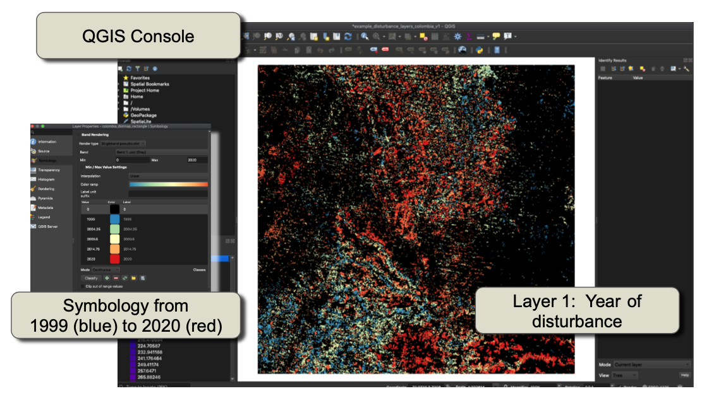


##### Examinar año y magnitud de perturbación 

Es posible examinar patrones dentro de QGIS y potencialmente mejorar nuestro mapeo por que es fácil mover, acercar, y comparar capas en estos programas sin la espera de la reproducción de imágenes en GEE.  

Después de cargar el mapa de disturbios de nuevo como una capa separada, podemos usar la opción de "Symbology" (simbología) en QGIS para seleccionar la magnitud de la perturbación. Note la presencia continua de rayas cerca de la parte central inferior del área de estudio mientras navega por la imagen. Cuando se acerca a esa área y cambia entre las capas de año y Magnitud, se puede apreciar que mucha de la perturbación que parece ruido en realidad es magnitud-baja (ver figura siguiente).  

> Notar que la magnitud se expresa en unidades del índice que se usa para la segmentación temporal. Usamos el índice de NBR escalado, el cual tiene un rango de  -1000 a +1000.  

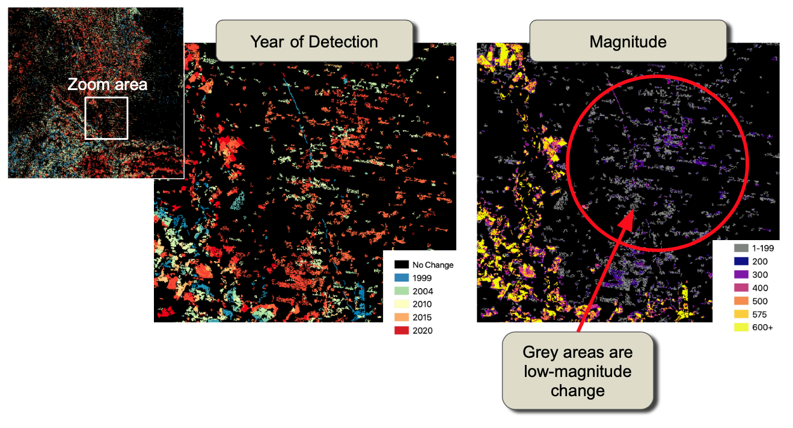

Basado en esta simple evaluación del año de detección, el umbral para mapear cambio podría ser alterado a 200 en lugar de 100, como se uso en el parámetro `changeParams.mag`de la exportación original.

## 5 La Biblioteca LandTrendr Javascript 

Tanto la interfaz gráfica de usuario de LandTrendr (Sección 3) como el script Javascript (Sección 4) se basan en funciones en la biblioteca de LandTrendr Javascript para llevar a cabo todos los pasos importantes en el proceso de detección de cambios. Si bien no se necesita un conocimiento detallado de las funciones para ejecutar ninguna de las herramientas, recomendamos que la mayoría de los usuarios desarrollen una comprensión básica de las suposiciones encapsuladas en estas funciones, ya que ayuda a comprender dónde puede estar fallando el mapeo. Además, los usuarios avanzados querrán acceder a estas funciones para ajustarlas o personalizarlas. Por lo tanto, las siguientes secciones detallan las piezas centrales de las bibliotecas LandTrendr en GEE.

### 5.1 Importando la biblioteca LT Javascript

La biblioteca LT Javascript mejora con regularidad, pero para mantener la coherencia, hemos proporcionado una copia de la versión de trabajo actual a los usuarios del Banco Mundial. Como se señaló anteriormente, la importación de la biblioteca se realiza con este código:

```javascript
var ltgee = require('users/openmrv/MRV/ChangeDetection/LandTrendr_V2.4WB.js'); 
```

A partir de entonces, se hace referencia a todas las funciones en esa biblioteca con el nombre de la biblioteca seguido del nombre de la función, con un "punto" como separador (por ejemplo, llamar a la función "runLT" con <argumentos> se manejaría:`var lt=ltgee.runLT(<arguments>)`). 

Usuarios interesados pueden revisar versiones de desarrollo de la biblioteca que se encuentra en el sitio de GEE, eMapR lab: `/users/emaprlab/public:Modules/LandTrendr.js`

### 5.2 Segmentación temporal de LandTrendr 

En el centro de todas las ejecuciones LandTrendr (LT) esta la segmentación temporal, en la cual cada trayectoria de pixel se quiebra en segmentos de línea recta separados por vértices. Esta función es una parte de la biblioteca de algoritmos de GEE: `ee.Algorithms.TemporalSegmentation.LandTrendr`.  

Aunque la llamada a ese algoritmo es sencilla, un paso clave generalmente implica una cantidad sustancial de esfuerzo: crear la colección de imágenes en la que se aplica el algoritmo. Es típico envolver el algoritmo de segmentación temporal central dentro de una función que construye la colección de imágenes en función de características de interés: los sensores involucrados, las ventanas de tiempo utilizadas, etc.

En la implementación proveída aquí, la función de envoltura se llama "**runLT**".  Se llama de la manera siguiente: 

```javascript
var lt = ltgee.runLT(startYear, endYear, startDay, endDay, aoi, index, [], runParams, maskThese);
```

#### 5.2.1 Argumentos pasados a runLT

Un tratamiento breve de cada argumento sigue.

##### **Ventanas Temporales**

`startYear` y `endYear` son variables numéricas que definen el periodo para el cual una colección de imágenes será construida. Simplemente definir estos años no garantiza que imágenes de todos esos años estará disponible; de hecho, en muchas partes del mundo, hay huecos en el archivo Landsat. Si, por ejemplo, su región no tiene imágenes antes del 1999, poner el año de inicio en 1984 no causara que falle el algoritmo, pero comenzara la serie de tiempo en 1999.  

`startDay` y`endDay` son variables de cadena de fechas que definen los periodos dentro de cada año con las cuales se construyen imágenes compuestas. Estas se establecen usando el formato GEE con dos dígitos por mes y día separados por un guion, por ejemplo, "04-01"`corresponde a abril 1ro.  

La composición de imágenes se hace usando una estrategia medoide (elaborado en mas detalle próximamente) y resulta en una imagen por año del periodo indicado por estas fechas. 

##### **Área de interés**

El argumento `aoi` es una variable correspondiendo a un `ee.FeatureCollection` que define la región geográfica de interés para el procesamiento.  

Establecer tal feature collection (colección de objetos) de un asset de GEE se puede llevar acabo con una declaración como la siguiente: 

```javascript
var aoi = ee.FeatureCollection('users/openmrv/MRV/ColombiaRectangle');
```

##### **Argumentos Espectrales**

La variable `index` es una cadena que corresponde a a uno de los índices espectrales definidos en la rutina `calcIndex` dentro de la biblioteca Javascript de LandTrendr.  

Por el momento, los índices siguientes están incluidos:

| Nombre de Índice       | Descripción                                                  |
| ---------------------- | ------------------------------------------------------------ |
| B1, B2, B3, B4, B5, B7 | Valores de reflectancia de Landsat Thematic Mapper con números de bandas correspondientes a las etiquetas de bandas de instrumentos Landsat 5 y 7. De esta manera, B4 es la banda de infrarrojo-cercano y B5 es la banda de infrarrojo de onda corta centrada en aproximadamente 1.65 micrómetros.  Imágenes de Landsat 8 (OLI) son renombradas para ser consistentes con convenciones de nombramiento de Landsat 5 y 7. |
| NBR                    | Normalized Burn Ratio (o Relación de Quemadura Normalizada), definido como (NIR-SWIR2)/(NIR+SWIR2), donde NIR es el infrarrojo-cercano y SWIR2 es la segunda banda de infrarrojo de onda corta (centrada cerca de 2.2 micrómetros) de Landsat 5, 7 y 8. |
| NDMI                   | Normalized Difference Moisture Index (Índice de Humedad de Diferencia Normalizada), definido como (NIR-SWIR1)/(NIR+SWIR1) |
| NDVI                   | Normalized Difference Vegetation Index (Índice de Vegetación de Diferencia Normalizada) , definido como (NIR-Red)/(NIR+Red), donde "Red" es la banda de reflectancia roja de Landsat 5 y 7. |
| NDSI                   | Normalized Difference Snow Index (Índice de Nieve de Diferencia Normalizada), definido como (Green-SWIR1)/(Green+SWIR1) |
| TCB, TCG, TCW          | Tasseled-cap brightness (brillo), greenness (verdor), y wetness (humedad) calculados usando coeficientes de reflectancia de Landsat 5 como fue documentado originalmente por Crist (1985).  Ver la variable `tcTransform` dentro de la biblioteca de Javascript de LandTrendr. |
| TCA                    | Tasseled-cap "angle" (ángulo), definido como el ángulo entre TCB y TCG.  Originalmente definido por Powell et al. (2010);  un valor mas alto indica mas vegetación. |

Siguiendo de la variable de `index` esta una lista que incluye índices espectrales donde la estrategia "fit to vertex" (FTV) seria utilizada. El método FTV no es necesario para detección de cambio básica, pero puede ser usada en el mapeo de cobertura terrestre. Mas detalles se pueden encontrar en Kennedy et al. (2018).  Para dejar en blanco la variable, use la lista vacía de la manera siguiente: `[]`.

##### **Parámetros de Ajuste**

El algoritmo LT es controlado por parámetros de ajuste descritos en la Sección 3.5.1 arriba.  La variable `runParams` es un objeto de diccionario que se establece en el script inicial. Un ejemplo de el script de Mayo Disturbio de LandTrendr es el siguiente: 

```javascript
var runParams = { 
  maxSegments:            8,
  spikeThreshold:         0.9,
  vertexCountOvershoot:   3,
  preventOneYearRecovery: false,
  recoveryThreshold:      0.75,
  pvalThreshold:          0.05,
  bestModelProportion:    0.75,
  minObservationsNeeded:  6
};
```


##### Enmascarar

Al crear las colecciones de imágenes que se pasan al algoritmo, se pueden marcar y enmascarar diferentes tipos de condiciones. La variable `maskThese` es una lista con cadenas para indicar los tipos de condición que se marcarán. 

En la biblioteca Javascript de LandTrendr, estos son manejados en la función `getSRcollection`.  Las siguientes son opciones validos. 

| Código de Mascara                  | Descripción                                                  |
| ---------------------------------- | ------------------------------------------------------------ |
| 'water', 'shadow', 'snow', 'cloud' | De la banda QA band de imágenes de Landsat.                  |
| 'waterplus'                        | Usa la capa de "recurrencia" del asset "JRC/GSW1_1/GlobalSurfaceWater" en GEE;  recurrencia mayor a 99% será filtrada, o 'enmascarada'. Ver "https://storage.googleapis.com/global-surface-water/downloads_ancillary/DataUsersGuidev2.pdf" para mas información acerca de este recurso. |
| 'nonforest'                        | Usa el producto de Copernicus Global Land Service (Servicio de Terreno Global de Copernicus, CGLS por sus siglas en ingles) de resolución de 100m para enmascarar las áreas que no son bosque. Si utiliza esta máscara, limitará a LandTrendr a las áreas definidas por este producto como bosque. |

##### Configuraciones Implícitas

La función `runLT` simplifica el llamado a la función LT a través del manejo de la construcción de colecciones de imágenes.

Sin embargo, con la simplificación viene la suposición. Las siguientes suposiciones son implícitas en la llamada a la función: 

- Sensores Landsat 5-8 serán utilizados
- Reflectancia de Landsat 8 será transformada a dominios de reflectancia de Landsat 5 and 7
- Mascaras para nubes y sombras se manejaran a través de hacer referencia a la capa QA de las imágenes Landsat, esta banda misma esta basada en el algoritmo CFMask 
- Composición de imágenes será manejado usando la estrategia de composición de medoide (descrita abajo) 

Puede que los usuarios deseen cambiar estas suposiciones.  

Los cambios menores se pueden lograr si se hace una copia local de la biblioteca Javascript de LT y se adapta el código por ejercer los cambios.  Por ejemplo, usuarios puedan querer evitar usar imágenes de Landsat 7 (aunque esto no es recomendado normalmente), y de esta manera simplemente tendrían que convertir la línea del código que construye la colección de imágenes de Landsat 7 en un comentario (ver Sección 5.3 abajo).  O, puede que un usuario quiera agregar índices espectrales en los cuales se puede construir segmentación temporal: de nuevo, esto se puede lograr con una actualización relativamente menor para el índice de interés. 

> Recuerde si crea su propia biblioteca local Javascript de LandTrendr, necesitara llamar o invocar esa biblioteca local en todos los scripts posteriores! 

Cambios mayores se pueden lograr si intercambia módulos enteros para crear colecciones de imágenes.  Por ejemplo, es concebible que un usuario quiera aplicar el algoritmo LandTrendr a imágenes de radar de Sentinel 2. En este caso, casi todos los aspectos de la construcción de la colección de imágenes tendrían que ser cambiados. En este caso, el usuario puede simplemente usar la biblioteca como un guía estructural para la creación de una biblioteca diferente. 

#### 5.2.2 Construyendo colecciones de imágenes 

La función `runLT` toma los parámetros pasados por el usuario para construir colecciones de imágenes que se pasan al algoritmo LT. 

Se necesitan dos pasos secuenciales. Primero, la función `buildSRcollection` inicia una cascada de funciones para construir una colección anual compuesta, enmascarada, multivariada y de reflectancia superficial. En segundo lugar, "buildLTcollection" traduce esa colección en la forma necesaria para llamar al algoritmo de segmentación LT. Cada función llama a otras subfunciones. Un tratamiento detallado de cada aspecto de estas bibliotecas está más allá del alcance de este material de capacitación, pero las descripciones generales de la lógica central brindan a los usuarios información sobre las decisiones clave que manejan los algoritmos.

###### Funciones para construir una colección de imágenes compuestas 

`buildSRcollection` analiza los insumos del usuario y luego recorre todos los años de la colección, llamando o invocando la función `buildMosaic` cada año para crear una colección de imágenes con una imagen singular por año. 

El propósito clave de la función `buildMosaic` es invocar `getCombinedSRcollection`para construir una colección multi-sensor de imágenes de reflectancia superficial de Landsat para un año singular, y luego usar la función `medoidMosaic` para construir una imagen compuesta singular para ese año. 

Para crear la colección de imágenes  de reflectancia superficial, la función `getCombinedSRcollection` invoca la función `getSRcollection` por separado para el Landsat 5 Thematic Mapper, el Landsat 7 Enhanced Thematic Mapper+, y el Landsat 8 Operational Land Imager (OLI), y luego combina las colecciones. 

De esta manera, para entender de donde vienen los valores de una imagen, **uno debe de entender la función central**:  `getSRcollection`.  Esta función de aproximadamente 80 líneas de código de GEE filtra la colección de Landsat entera al periodo de tiempo apropiado, aplica los coeficientes de corrección a imágenes de Landsat 8 para harmonizar la reflectancia con sensores previos, y aplica mascaras establecidas por el usuario (notado anteriormente). 

Algunas de las decisiones claves encapsuladas en este código:

- Ventanas de fechas pueden incluir enero 1, y el año de registro para la imagen compuesta se registra al año del punto final de la ventana. Por lo tanto, si la ventana de fechas se da como '11-01' a '03-31' y el rango de los años como 1990 a 2020, el año de la primera imagen compuesta seria 1990. Esto significa que las imágenes de Noviembre y diciembre de 1989 se usaran para crear la imagen compuesta. 
- Armonización usando los coeficientes publicados en la Tabla 2 de Roy et al. (2016) para convertir bandas de reflectancia de  Landsat 8 al mismo dominio espectral de Landsat 7.  Notar, sin embargo, que las ventanas de banda de Landsat 8 no son idénticas a las de Landsat 5 y 7 -- particularmente en la ventana de infrarrojo cercano -- y que algo de diferencia de medidas residual es inevitable. Además, algunos usuarios pueden preferir hacer su armonización en la dirección opuesta -- traer Landsat 5 y 7 al dominio espectral de Landsat 8. Un cambio como este puede ocurrir en esta etapa del código.  
- Enmascarar es una decisión critica en el flujo de procesamiento de imágenes. Aquí, hemos elegido usar la banda QA de las imágenes de Landsat para la mayoría de las máscaras. Sin embargo, para ciertas situaciones, el producto de recurrencia de agua JRC o el producto de cobertura terrestre global de Copernicus puedan ser útiles, y estos sirven como una plantilla de como un usuario avanzado podría agregar otro tipo de código para enmascarar. 
- Composición de imágenes se lleva acabo a través del método medoide, el cual no es igual a la composición con el mediano.  El método medoide mira a todos los valores para cada pixel, calcula el valor mediano matemáticamente, pero luego identifica la observación de pixel actual (o sea, la imagen  especifica de la colección de ese año) que sea mas cercana al mediano en el espacio espectral n-dimensional. Por lo tanto, el método tiende a un valor espectral representativo, pero usa observaciones de una imagen actual en lugar de un valor artificial calculado como el mediano de cada banda). Existen otros métodos de composición de imágenes, y usuarios avanzados pueden integrar o cambiar sus métodos favoritos en esta etapa del código. 

#### Funciones para convertir colecciones de imágenes en insumos listos para LT

Una vez que la colección ha sido construida, la función `runLT`  debe de convertirla en una serie temporal univariada para la segmentación.  Para la mayoría de usos, esto es un simple caso de calcular el índice espectral deseado, y se maneja en la función  `buildLTcollection`.  Para usos avanzados que requieren estabilización temporal usando el método fit-to-vertex (FTV), esas bandas se pueden pasar a la misma función también. 

#### 5.2.3 Invocando el algoritmo central LT-GEE

El algoritmo central de segmentación temporal de LandTrendr se puede acceder en GEE usando este formato:

```javascript
ee.Algorithms.TemporalSegmentation.LandTrendr(runParams);
```

`runParams`  es un objeto de diccionario con los parámetros de ajuste, además de la serie temporal de valores de imagen en una entrada establecida con este comando:

`runParams.timeSeries = annualLTcollection;`

donde el `annualLTcollection` es la colección de valores invariados calculados de la manera descrita en la Sección 5.2.2. 

Como se notó arriba en la Sección 2.3 , el resultado de la llamada al algoritmo principal de LandTrendr en GEE es una matriz de imágenes. La próxima sección describe la función `ltgee` que puede ser usada para convertir esa matriz de imágenes a un mapa de disturbios o de (recuperación).

### 5.3 Mapeo de Disturbios

Como se describió en la Sección 3.5 arriba, el mapeo de disturbios o perturbaciones se logra mediante consultas de los vértices que resultan del ajuste LT. En la GUI o en el mapeo basado en el script, el mapeo se maneja mediante una llamada a la función `ltgee.getChangeMap`:

```javascript
var changeImg = ltgee.getChangeMap(lt, changeParams);
```

La variable `lt` es la matriz de imágenes que emerge de la llamada de `ltgee.runLT` , y el objeto `changeParams` es un diccionario notado en la Sección 4.2.1 arriba y repetido aquí para su conveniencia:  

```javascript
var changeParams = {
  delta:  'loss',
  sort:   'greatest',
  year:   {checked:true, start:1990, end:2020},
  mag:    {checked:true, value:100,  operator:'>'},
  dur:    {checked:true, value:4,    operator:'<'},
  preval: {checked:true, value:300,  operator:'>'},
  mmu:    {checked:true, value:11},
  
};
```

Abajo, desempacamos como la función de `getChangeMap` traduce un objeto-LT a mapas de disturbios. La secuencia general es:  

- Extraer información de segmentos de la información de la vértice 
- Identificar el segmento objetivo de acuerdo a las características deseadas 
- Construir una imagen con capas correspondientes al año de cambio, magnitud de cambio, etc 
- Filtrar por el año objetivo, magnitud, duración, y los valores antes del cambio 
- Filtrar por la unidad de mapa mínima de píxeles adyacentes


### 5.3.1 Extrayendo información de segmento 

El primer paso en la función `getChangeMap` es traducir información de vértice a información de segmento. Esto se lleva acabo con la función `getSegmentData`:

```javascript
var segInfo = getSegmentData(lt, changeParams.index, changeParams.delta);
  changeParams.segInfo = segInfo;

```

> Note que el `changeParams.index` típicamente no requiere que el usuario lo incluya manualmente, ya que se puede establecer programáticamente para coincidir con el índice usado en la llamada anterior a LT. 

Para comprender cómo se traduce la información de los vértices en información de segmentos, considere que cada segmento está delimitado por dos vértices. El carácter del segmento en sí se describe por el año del vértice inicial y el valor espectral (la condición "anterior al cambio"), el año del vértice final y el valor espectral (la condición "posterior al cambio"), así como por la diferencia de tiempo entre los vértices delimitadores (la "duración") y la diferencia en el valor espectral de los vértices delimitadores (la "magnitud"). Por lo tanto, para generar información sobre los segmentos, debemos considerar las características de ambos vértices individuales en cada extremo del segmento, así como las relaciones entre ellos. Esto se logró mediante una serie de manipulaciones de matriz de la información de vértice devuelta por el algoritmo LT en el objeto LT.

Como se indica en la Sección 2.3.1, el objeto LT devuelto por la función LT es al menos una imagen de dos bandas por píxel. La primera banda se llama banda "LandTrendr" y es en sí misma una matriz de tamaño 4 x *n*, donde *n* es el número de años en la serie de tiempo. La segunda banda es un escalar que representa el error cuadrático medio total (RMSE por sus siglas en ingles) del ajuste. Surge una tercera banda opcional si el usuario ha pasado datos para el proceso FTV; aquí no tratamos a esta tercera banda.  

La traducción de la información de vértice en operación de segmento se centra en la banda 4 x *n* LandTrendr del Objeto LT. El código completo se reproduce aquí, con comentarios que describen cada pieza. Brevemente, los vértices se extraen de la fila de vértices y luego se convierten en dos listas de vértices (`leftList` y` rightList`), una desplazada en relación con la otra. Luego, estos se manipulan para obtener los resultados deseados.

```javascript
var ltlt = lt.select('LandTrendr');            // seleccionar la banda LandTrendr
  var rmse = lt.select('rmse');                  // seleccionar la banda rmse
  
	// cortar la fila 'Is Vertex' - si(1)/no(0)
	var vertexMask = ltlt.arraySlice(0, 3, 4);     
		
	// use la fila 'Is Vertex' como mascara para todas las filas
  var vertices = ltlt.arrayMask(vertexMask);     
		
	// cortar las vertices como los inicios de los segmentos
  var leftList = vertices.arraySlice(1, 0, -1);    
	
	// cortar las vertices como los finales de los segmentos
  var rightList = vertices.arraySlice(1, 1, null);

  // obtener dimension de año de datos LT de los vertices de inicio de segmentos
	var startYear = leftList.arraySlice(0, 0, 1);    

  // obtener dimension de indice espectral de datos LT de los vertices de inicio de segmentos
	var startVal = leftList.arraySlice(0, 2, 3);     

  // obtener dimension de año de datos LT de los vertices finales de segmentos
	var endYear = rightList.arraySlice(0, 0, 1);     

  // obtener dimension de indice espectral de datos LT de los vertices finales de segmentos
	var endVal = rightList.arraySlice(0, 2, 3);      

  // restar el año de inicio de segmento del año de final de segmento para calcular la duracion de los segmentos 
	var dur = endYear.subtract(startYear);       

	// restar el valor de indice de inicio d esegmento del valor de indice de final del segmento para calcular el delta de los segmentos
  var mag = endVal.subtract(startVal);         

	// calcular la tasa de cambio
  var rate = mag.divide(dur);   

	// hacer mag relativo al rmse del ajuste
  var dsnr = mag.divide(rmse);              
```

El usuario avanzado es referido a un tratamiento detallado de como interpretar y manipular los datos de vértice, encontrado en la [Sección 5 del guía para LT-GEE de GitHub](https://emapr.github.io/LT-GEE/lt-gee-outputs.html). 

##### Filtrando por perdida o ganancia

Una vez que se han calculado las características de cada segmento, la rutina `getSegmentData` filtra esos segmentos en función de si el usuario solicita" pérdida "o" ganancia "en la vegetación (a través de la variable de cadena` changeParams.delta`). La dirección del cambio asociado con estos depende del índice espectral. Para índices como el NDVI, NBR o Tasseled-cap greenness, una reducción en el valor del índice se asocia con una pérdida de vegetación. Para índices como la banda SWIR1 o el índice de Tasseled-cap brightness, un *aumento* en el valor del índice asociado con la pérdida de vegetación.

La dirección de cambio se define en la función `indexFlipper`. Ya que el algoritmo de LandTrendr se definió originalmente usando la banda SWIR1, el `indexFlipper` asigna un 1 positivo a SWIR1 y bandas similares, y asigna un 1 negativo (-1) a índices como NDVI.  Las partes relevantes de la función son replicadas aquí para su referencia:

```javascript
var indexFlipper = function(index){
  var indexObj = {'NBR':-1,'NDVI':-1,'NDSI':-1,'NDMI':-1,  
                  'TCB':1,'TCG':-1,'TCW':-1,'TCA':-1,
                  'B1':1,'B2':1,'B3':1,'B4':-1,'B5':1,'B7':1};
  return indexObj[index];
};
```

Note que para algunas bandas, la dirección de cambio vegetativo no se reduce fácilmente a una dirección singular de cambio: para el NDSI, la experiencia sugiere que el índice se comporta ambiguamente para el cambio vegetativo.  

##### Resultados

El resultado de la llamada a `getSegmentData` es un `ee.Array` con las filas siguientes: 

| Fila | Nombre    | Descripción                                                  |
| ---- | --------- | ------------------------------------------------------------ |
| 0    | startYear | Primer año después del año de vértice al principio del segmento |
| 1    | endYear   | año de vértice al final del segmento                         |
| 2    | startVal  | Valor de índice al principio del segmento                    |
| 3    | endVal    | Valor de índice del vértice al final del segmento            |
| 4    | mag       | El cambio en el valor espectral de principio a fin           |
| 5    | dur       | El largo (en años) del segmento                              |
| 6    | rate      | La magnitud dividida por duración                            |
| 7    | dsnr      | Magnitud escalada por el RMSE para el ajuste general.        |

Cada fila contiene la misma cantidad de columnas como segmentos que cumplen con los criterios de perdida o ganancia. Luego, estas piezas de información son utilizadas para identificar el segmento objetivo para el mapeo.  

> NOTA:  El vértice al principio de un segmento que aun no ha experimentado cambio. Por lo tanto, como una convención, consideramos que el primer año después del vértice como la primera vez que el cambio es evidente para el segmento. Para mapear disturbios abruptos, esto significa que el año de detección será etiquetado apropiadamente como el año en donde se nota el declive del índice espectral. 

#### 5.3.2 Identificar el segmento objetivo

Como se noto en la Sección 3.5, mapear requiere que un segmento singular sea identificado. Ya que frecuentemente hay  mas de un segmento de perdida o ganancia, debemos identificar cual segmento queremos **apuntar** (target) para el mapeo. Además, frecuentemente queremos ignorar los segmentos que no pasan umbrales específicos, por ejemplo umbrales de tiempo, duración, o magnitud de cambio. Las varias características de cada segmento pueden ser usadas para determinar si es el mas apropiado para mapear. 

Dentro de la función `getChangeMap` , identificación del segmento objetivo se maneja en dos pasos generales. Primero, el `ee.Array` devuelto de la llamada a `getSegmentData` es ordenado de acuerda a magnitud, tiempo, o duración del segmento, y el resultado clasificado como el mejor se identifica como el segmento objetivo.  Segundo, este segmento objetivo se filtra aun más de acuerdo a los umbrales numéricos.  

#### Ordenando/Clasificando

El paso de clasificación (o de ordenar) puede evaluar segmentos en base de varias características. Un caso de uso común sería buscar el segmento de perturbación (con "pérdida") que tuvo la mayor magnitud de cambio espectral, ya que esto puede indicar la perturbación más grave experimentada por el píxel. Alternativamente, podemos estar interesados en el segmento que experimentó crecimiento vegetativo ("ganancia") durante el período más largo. O puede que estemos interesados solo en la perturbación más reciente. Cada uno de estos se puede expresar como una clasificación de magnitud o tiempo del segmento, y estos se almacenan en la variable `changeParams.sort`. A continuación se proporcionan descripciones de los criterios de clasificación capturados en esa variable.

| Nombre           | Descripción                                                  |
| ---------------- | ------------------------------------------------------------ |
| greatest, least  | Se dirige al segmento con la mayor (o menor) magnitud de cambio |
| newest, oldest   | Se dirige al segmento que ocurrió más recientemente (o hace más tiempo) |
| fastest, slowest | Se dirige al segmento con la duración más corta (más larga)  |

Al final de la clasificación, se produce una sola imagen con múltiples bandas con el siguiente comando:

```javascript
var distImg = ee.Image.cat(distArray.arraySlice(0,0,1).arrayProject([1]).arrayFlatten([['yod']]).toShort(),                           distArray.arraySlice(0,4,5).arrayProject([1]).arrayFlatten([['mag']]).toShort(),
                           distArray.arraySlice(0,5,6).arrayProject([1]).arrayFlatten([['dur']]),
                           distArray.arraySlice(0,2,3).arrayProject([1]).arrayFlatten([['preval']]),
                           distArray.arraySlice(0,6,7).arrayProject([1]).arrayFlatten([['rate']]),
                             distArray.arraySlice(0,7,null).arrayProject([1]).arrayFlatten([['dsnr']]));

```

Estas bandas se derivan de un subconjunto de los valores del `ee.Array`. Las descripciones siguen a las indicadas en la Sección 5.3.1 anterior, con 'yod' intercambiado por `startYear` y `preval` por `startVal`. Como recordatorio, la variable 'yod' no es el año del vértice al comienzo del segmento, sino ese año * más uno *, para reflejar el hecho de que el cambio de dirección del segmento solo es evidente después de que haya pasado un año de el vértice temprano.

#### Filtrando y aplicando umbrales

La imagen después de la clasificación es adecuada para mapear si lo desea, con cada banda mostrada por separado. Sin embargo, normalmente deseamos filtrar más el mapa en base de los criterios del proceso de cambio. Una vez que se ha identificado el segmento objetivo y se ha producido una imagen tentativa, los pasos dentro de `getChangeMap` se pueden utilizar para filtrar y establecer el umbral del mapa.

Los pasos involucrados en la filtración de  `yod`, de `mag` y de `dur`. Por ejemplo, las cosechas forestales podrían enfocarse eligiendo solo cambios que superen un umbral de magnitud de cambio, que sean de corta duración y que tengan un valor previo a la perturbación por encima de cierto valor.

Adicionalmente, el filtro `mmu`  permite la eliminación de grupos de pixeles que son mas pequeños que el valor indicando por el valor  `mmu` (en pixeles). Grupos de pixeles son esos que comparten el mismo `yod`.   

#### Resultados

El resultado de la función `getChangeMap` es la imagen de disturbio con las capas notadas en Sección 4 anteriormente. 

# 6 Implementando LandTrendr en Mozambique y Camboya

Cuando se implementa una detección de cambio forestal de LandTrendr en un área nueva, los mismos problemas descritos en la Sección 3 deben de ser considerados. Estos incluyen: 

- Profundidad histórica de imágenes de Landsat 
- Rangos de fecha dentro de un año usando imágenes compuestas construidas
- Idoneidad o aptitud de un índice espectral dado para los tipos de bosques de interés 
- Procesos de cambio de interés al usuario

### 6.1 Mozambique

En la fase de exploración inicial de trabajar en un dominio nuevo, recomendamos utilizar la GUI de LandTrendr descrito en la Sección 3 anterior.

#### 6.1.1 Cargar un área de estudio de Mozambique en la GUI de LandTrendr

Exploremos lo que LandTrendr puede lograr en Mozambique. Como recordatorio, encuentre y abra un script llamado **OpenMRV_español/Part 2/ LandTrendr_esp/LT-GEE-Vis-DownLoad-app_WB_v1.0_esp**  desde la biblioteca openMRV en GEE.

Cuando se carga y ejecuta, el script automáticamente visualiza el mapa de Colombia. Puede usar el navegador de mapas para navegar manualmente a diferentes partes del mundo. O, si planea ir regularmente a una ubicación diferente, *haga una copia local del script* y cambie la línea 1341 de: 

```javascript
map.setCenter(-75, 3, 6);  //establecer centro automatico del mapa en Colombia
```

a un punto de centro diferente. Note que el formato de los argumentos para `map.setCenter` son`(<longitud, latitud, nivel de zoom>)`.   Ver la documentación de GEE para entender los niveles de Zoom. 

Para los propósitos de este documento, hemos delineado una área de estudio simple en Mozambique donde puede ocurrir la exploración inicial. En la sección de "Asset Overlay" de la GUI, haga el primer asset `users/openmrv/MRV/MozambiqueArea`.


#### 6.1.2. Determinar ventanas de fechas

Como siempre, buscamos ventanas de fechas estacionales que sean lo suficientemente amplias y cronometradas lo suficientemente bien para maximizar el cambio de búsqueda de píxeles claros en la mayoría de los años, pero que sean lo suficientemente estrechas para evitar demasiada variabilidad fenológica dentro de la ventana de fechas. Un buen lugar para comenzar es comprender la estacionalidad de las precipitaciones.

De acuerdo a esta presentación usando datos satelitales que fue resumida por el World Food Programme (https://docs.wfp.org/api/documents/WFP-0000108186/download/), la temporada de lluvia en Mozambique es de aproximadamente octubre a mayo. Por lo tanto, un punto de inicio razonable para la ventana temporal seria mayo 1 a octubre 15. Además, en ausencia de un conocimiento *a priori* de la profundidad del archivo de imágenes del Landsat en cualquier lugar, es razonable comenzar una investigación con un año de inicio en la década de 1980 o principios de la de 1990. Para mantener la coherencia con las otras partes de esta capacitación, sugerimos comenzar con 1990.

Para evaluar, cambie las opciones de ventana de fechas de LandTrendr para que comience en 05-01 y termine en 10-15, y cambie el rango de años a 1990 - 2020.  

> Tambien puede establecer los parametros de ajustes a los mismos usados en Colombia, u otros dependiendo en su preferencia. Los ejemplos siguientes fueron ejecutados usando:  Max Segments=8, Spike Threshold=0.9, Vertex Count Overshoot=3, Prevent One Year Recovery=true, Recovery Threshold=0.75, p-value Threshold=0.05, Best Model Proportion=0.75, Min Observations Needed=6


Luego, use el Visor de cambios RGB para tener una idea rápida del ajuste y las anomalías de LandTrendr. Si ha hecho clic en el cuadro de procesamiento en la pestaña "Path to Assets" (Ruta a los assets), vaya a la pestaña **Opciones de cambio de RGB**, seleccione años para las capas Roja, Verde y Azul, y haga clic en "Agregar imágenes RGB". . Como recordatorio, consulte la Sección 3.4 para obtener ayuda sobre la interpretación de los colores.

Los artefactos de las nubes no enmascarados son evidentes como franjas verdes sin conexión con los patrones del paisaje subyacente. Cuando surge un patrón de este tipo, es probable que la ventana de fecha esté capturando demasiada nubosidad y se deben explorar otras ventanas. Recuerde también que buscamos ventanas de fechas que no incluyan una variabilidad extrema en la fenología de la vegetación.

Avanzar ligeramente las fechas en el año da como resultado una pila RGB ajustada con patrones espaciales de color que siguen más de cerca las características reales del paisaje. Al distribuir mas imágenes al principio de la temporada lluviosa, también es mas probable que las imágenes capturadas cada año representan el periodo con hojas en lugar de la fase sin hojas de los árboles de hoja caduca por sequía.

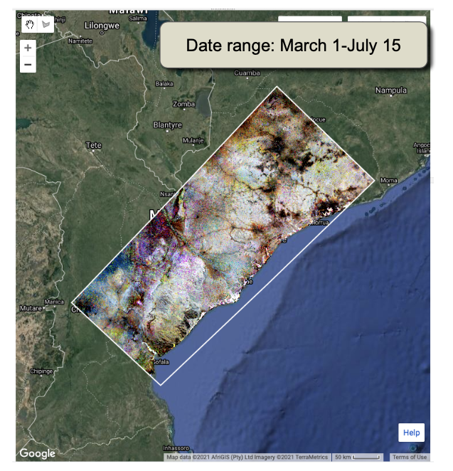

#### 6.1.3 Explorar archivo de imágenes y procesos de cambio

Con la imagen RGB como fondo, considere las dimensiones temporales del cambio en Mozambique. Buscamos comprender los patrones espaciales de cambio evidentes en la imagen RGB y comprobar que el archivo de imágenes sea suficiente para el conjunto inicial de años de imágenes. La interfaz "Pixel Time Series Options" (Opciones de Serie Temporal de Pixeles) es una excelente herramienta para explorar estas preguntas.

Al acercarnos a la zona central del área de estudio que se muestra arriba, vemos una rica variedad de procesos de cambio que ocurren en este paisaje. Recuerde que cualquier ubicación que no esté en la escala de blanco, gris y negro es un área que parece haber experimentado cambios. Nuevamente, consulte las pautas de interpretación del color que se dan en la Sección 3.4 anterior. En la imagen RGB a continuación, vemos áreas de crecimiento (tonos azules) y varios tipos de alteraciones (rojos, naranjas, amarillos) y alteraciones con posible rebrote (magentas y púrpuras).


Para los usuarios interesados en mirar los detalles de las ubicaciones mencionadas arriba, la información se encuentra aquí:

| Nombre                                                       | Longitud  | Latitud    |
| ------------------------------------------------------------ | --------- | ---------- |
| Growth (Crecimiento)                                         | 35.441772 | -16.980938 |
| Abrupt disturbance and growth (Disturbio abrupto y crecimiento) | 35.370195 | -17.233946 |
| Abrupt disturbance growth (Crecimiento de disturbio abrupto) | 35.360358 | -17.093841 |
| Persistent removal (Eliminación persistente)                 | 35.460270 | -17.763119 |

La disponibilidad de imágenes desde 1990 parece sólida, aunque una inspección minuciosa de algunos datos de fuentes de series temporales de píxeles (las líneas grises) sugiere períodos de falta de disponibilidad en los primeros años de la década de los 1990s. Sin embargo, los años iniciales de imágenes no parecen estar introduciendo artefactos ni en el RGB ni en la serie temporal.

En comparación con el dominio de perturbaciones en nuestro primer ejemplo de Colombia, los procesos de cambio en esta área de estudio de Mozambique son bastante diversos. Además del diagnóstico **perturbación abrupta y recrecimiento**, vemos muchas áreas de **crecimiento**, probablemente debido a perturbaciones anteriores al período de observación.

Además, vemos muchos ejemplos de **pérdida lenta de vegetación de varios años**. La trayectoria inferior en la figura anterior es un ejemplo, donde parece que las remociones comenzaron aproximadamente en 2016 y continuaron a un ritmo mesurado hasta el final del récord. Los procesos detrás de estos patrones de eliminación de larga duración son a menudo más enigmáticos que los que causan cambios abruptos. Sin embargo, los patrones espaciales pueden proporcionar pistas. En la imagen de arriba, parece que los tonos amarillos y naranjas parecen estar cerca de carreteras (rasgos lineales de negro, que indican vegetación baja persistente) y asentamientos. Esto sugiere una causa humana, a diferencia de una causa estrictamente natural, por ejemplo, relacionada con la sequía.

Acerquémonos a la región de Chimuara cerca de la parte inferior del recuadro de arriba. Y, además de usar el visor RGB para la interpretación, agregaremos el cambio de perturbación, pero modificaremos los parámetros para buscar perturbaciones que NO sean abruptas, ¡que tengan una duración> 2 años! Esto se logra en la GUI simplemente cambiando el operador de duración a ">" y el valor a "2". Sin embargo, antes de eso, debemos asegurarnos de apuntar la función de mapeo de perturbaciones a la ubicación correcta: vaya a las opciones de mapeo de cambio de RGB y configure la Longitud y Latitud en el área de interés, luego vaya a "Cambiar opciones de filtro" y ajustar el filtrado de Duración. 


Teniendo en cuenta todas estas capas, vemos que la degradación lenta está muy extendida. Cuando el año de detección es temprano y la duración es larga, sugiere una pérdida de vegetación prolongada y persistente. En otras áreas, vemos un cambio de duración de varios años (pero no de más de 20 años).


La interpretación de los procesos que impulsan estos patrones se lograría mejor a través de consultas con expertos locales, pero parece ser una presión antropogénica a largo plazo sobre el bosque, quizás relacionada con la extracción de madera de baja intensidad pero en curso.

La evidencia de deforestación mediada por humanos parece más alta en la región alrededor del asentamiento de Nicuadala, donde los procesos de remoción se mueven hacia afuera en un anillo casi concéntrico lejos de una zona central de asentamiento. Las trayectorias de extracción al principio de la serie temporal parecen permanecer bajas y bastante variables de un año a otro, lo que sugiere una transición sostenida desde una condición boscosa.


### 6.2 Camboya

En la Sección 6.1, cubrimos los temas clave para pasar de nuestra exploración inicial en Colombia a una nueva ubicación. Aquí, destacamos solo los problemas que difieren durante una exploración inicial del mapeo de perturbaciones en Camboya.

#### 6.2.1. Área de estudio y configuraciones de imagen

Al igual que con Colombia y Mozambique, hemos proporcionado una pequeña área de estudio en la que experimentar con ajustes de imagen y parámetros. La ruta al activo de GEE es: `users / openmrv / MRV / CambodiaArea`

Debido a una estación lluviosa diferente, usamos una ventana de fecha del 01-01 al 04-01. La disponibilidad de imágenes hasta 1990 parece sólida.

Una primera revisión de las imágenes ajustadas RGB muestra áreas de estabilidad del bosque (tonos de escala de grises) y eliminación sustancial (amarillos, rojos, magentas).

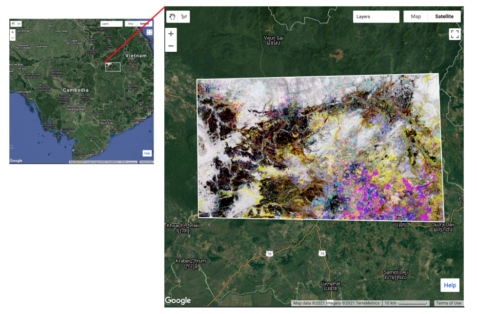

#### 6.2.2 Procesos de cambio de paisaje

Los procesos de cambio de paisaje que operan en Camboya difieren nuevamente de los de Colombia y Mozambique.

Centrándonos primero en la región sureste del área de estudio, vemos evidencia de una variedad de regímenes de manejo forestal. Las concesiones forestales a empresas afuera de Camboya han dado lugar a plantaciones de árboles para fibra o aceite. Estos son distintivos tanto en el dominio temporal, donde el color magenta indica que la eliminación del bosque original es seguido por un crecimiento rápido en bloques regulares (magenta), y el dominio espacial, donde los patrones de estas señales temporales son regulares y delimitados linealmente. En las áreas cian, también vemos evidencia de plantación de bosque en áreas con poco bosque al comienzo del registro de observación. Finalmente, vemos áreas en amarillo donde se ha producido la remoción de bosques con poco crecimiento forestal posterior; en muchos casos, estos están demasiado cerca del día actual para saber si son verdaderas deforestación o serán reforestadas. 


En el área más remota cerca de Kaoh Piek en el río Tonle San, vemos áreas de manejo forestal a menor escala. Existe evidencia de cosechas múltiples y de cierta deforestación visible dentro de esta área relativamente pequeña. Una vez más, los expertos locales proporcionarían información sobre los procesos impulsores, pero el patrón espacial de aprovechamiento y la existencia de múltiples aprovechamientos sugieren que el manejo forestal es continuo y relativamente estable en toda el área.


Al otro lado de la frontera hacia la provincia de Steung Treng, al oeste-noroeste del área anterior, encontramos otra área con manejo forestal activo a pequeña escala. Existe evidencia de incursiones extensas pero pequeñas en el bosque. 


Al igual que en Colombia y Mozambique, la segmentación temporal podría convertirse en mapas del año de la perturbación, la magnitud de la perturbación y la duración de la perturbación. 

## 7 Preguntas Frecuentes

*¿Como selecciono los parámetros de ajuste? Hay un método automatizado?*

La elección de los parámetros de ajuste es una de las preocupaciones más comunes de los nuevos usuarios. Nuestros ejemplos a lo largo de este tutorial deben proporcionar orientación, pero como observamos, la combinación específica de parámetros que se utilizará para una región determinada probablemente dependa de las idiosincrasias del archivo de imágenes, los bosques y los procesos de cambio.

Es posible desarrollar un mecanismo de selección robusto haciendo referencia a la segmentación a un conjunto de datos de referencia. En la publicación original de LandTrendr (Kennedy et al 2010), probamos el impacto de los valores de los parámetros usando un análisis de sensibilidad referenciado a una muestra de entrenamiento derivada de forma independiente recolectada usando TimeSync, que es una herramienta para que los intérpretes creen una segmentación temporal manualmente (Cohen et al. 2010). 

Sin embargo, en la práctica, ningún conjunto de parámetros de ajuste e índices espectrales puede funcionar igualmente bien en todas las condiciones de un país. Puede ser conveniente ejecutar el algoritmo con diferentes índices espectrales y diferentes parámetros de ajuste. Cohen et al (2018) describen un enfoque para ejecutar el algoritmo muchas veces con diferentes índices y para utilizar un conjunto de datos de referencia para entrenar un modelo de Random Forests para combinar los resultados en un mapa de disturbio de conjunto. Encuentran que el conjunto es más robusto que cualquier índice individual para detectar cambios.

Actualmente no existe una forma automatizada de seleccionar parámetros. Sin embargo, continuamos trabajando hacia el desarrollo de dichas herramientas, y se le anima a los usuarios interesados que sigan los desarrollos en el sitio LT-GEE GitHub.

*Noto más problemas con las nubes y el ruido de la imagen cerca del comienzo (o el final) de la serie temporal. ¿Por qué es esto?*

El poder de cualquier método de serie de tiempo es su capacidad para aprovechar múltiples observaciones para examinar patrones reales de falsos. En la mitad de la serie de tiempo, el ruido residual causa señales intermitentes en la señal de origen, pero debido a que vuelven a la "normalidad" después de la señal, el algoritmo las entiende como ruido. Pero para las señales que ocurren al principio o al final de la serie de tiempo, no hay datos más allá de la señal para ayudar a determinar si el ruido es real o no. Por lo tanto, el algoritmo puede crear con más frecuencia falsos positivos al principio y al final de la serie temporal.

*Hay algunos lugares con nubosidad persistente y sin datos. ¿Que puedo hacer?*

La primera opción es cambiar la ventana de fecha considerada para construir colecciones de imágenes. Es posible que haya elegido una ventana de fecha que sea 1) centrada más en la temporada de nubes o 2) demasiado estrecha para encontrar píxeles sin nubes.

También es posible que el algoritmo de enmascaramiento de nubes incorporado haya sido demasiado agresivo, ocultando áreas que no son nubes. Esto a veces puede ocurrir sobre objetivos consistentemente brillantes como nieve y roca de granito, pero es probable que ninguno de los dos sea demasiado común en las áreas de interés de este tutorial. Sin embargo, si un usuario cree que el algoritmo de enmascaramiento de la nube está siendo demasiado agresivo, puede aprovechar la naturaleza modular del código para intercambiar un paso diferente de construcción de colección de imágenes: cree su propio equivalente a la función `getSRcollection` en la biblioteca JavaScript de LandTrendr. 

Finalmente, es posible que algunas áreas tengan una nubosidad tan persistente que un intervalo de tiempo anual no sea suficiente para encontrar una imagen razonable. Aunque LandTrendr funciona mejor con un intervalo de tiempo anual, es posible construir colecciones de imágenes que utilicen imágenes bienales (o incluso más años) para construir compuestos para el algoritmo. En la actualidad, nuestra biblioteca estándar no incluye esta funcionalidad, pero permanezca atento al sitio de LT-GEE GitHub (https://github.com/eMapR/LT-GEE) para obtener actualizaciones. Usuarios avanzados pueden construir su propia biblioteca si adaptan los módulos de `buildSRcollection`, `buildMosaic`, `getCombinedSRcollection`, y `getSRcollection`.

*¿Puedo usar un sensor diferente a Landsat?* 

Talvez. En principio, al algoritmo LandTrendr no le importa cuál sea la señal que le des. Sin embargo, los algoritmos requieren que la señal sea consistente y estable cuando no se produzcan cambios; por tanto, los pasos de preprocesamiento deben dar como resultado una señal suave. Además, requiere que haya suficientes observaciones para asignar segmentos, aproximadamente 3-4 observaciones por segmento máximo deseado. Para muchos sensores, como Sentinel 1 y 2, no existe un registro lo suficientemente extenso para realizar análisis de cambios anuales. Es posible considerar proporcionar los datos del algoritmo a una escala sub-anual, pero necesitaría engañar al algoritmo para que piense que los intervalos son de un año. Esto puede generar desafíos en la interpretación de los productos, pero no es insuperable.

Mezclar tipos de sensores puede resultar muy complicado. Requiere un procesamiento previo que coloca todas las medidas exactamente en la misma escala. Incluso la transición de Landsat 8 a Landsat 7 y 5 es complicada porque los pasos de banda de los sensores son ligeramente diferentes. Por lo tanto, si bien no es teóricamente imposible reunir las imágenes de Sentinel-2 y Landsat, en la práctica los pasos de preprocesamiento probablemente sean bastante desafiantes.

## 8 Referencias


Crist, E.P., 1985. A TM tasseled cap equivalent transformation for reflectance factor data. *Remote Sensing of Environment*, *17*(3), pp.301-306. https://doi.org/10.1016/0034-4257(85)90102-6

Kennedy, R.E., Yang, Z. and Cohen, W.B., 2010. Detecting trends in forest disturbance and recovery using yearly Landsat time series: 1. LandTrendr—Temporal segmentation algorithms. *Remote Sensing of Environment*, *114*(12), pp.2897-2910. https://doi.org/10.1016/j.rse.2010.07.008

Cohen, W.B., Yang, Z. and Kennedy, R., 2010. Detecting trends in forest disturbance and recovery using yearly Landsat time series: 2. TimeSync—Tools for calibration and validation. *Remote Sensing of Environment*, *114*(12), pp.2911-2924. https://doi.org/10.1016/j.rse.2010.07.010

Cohen, W.B., Yang, Z., Healey, S.P., Kennedy, R.E. and Gorelick, N., 2018. A LandTrendr multispectral ensemble for forest disturbance detection. *Remote Sensing of environment*, *205*, pp.131-140. https://doi.org/10.1016/j.rse.2017.11.015

Kennedy, R.E., Ohmann, J., Gregory, M., Roberts, H., Yang, Z., Bell, D.M., Kane, V., Hughes, M.J., Cohen, W.B., Powell, S. and Neeti, N., 2018. An empirical, integrated forest biomass monitoring system. *Environmental Research Letters*, *13*(2), p.025004. https://doi.org/10.1088/1748-9326/aa9d9e

Powell, S.L., Cohen, W.B., Healey, S.P., Kennedy, R.E., Moisen, G.G., Pierce, K.B. and Ohmann, J.L., 2010. Quantification of live aboveground forest biomass dynamics with Landsat time-series and field inventory data: A comparison of empirical modeling approaches. *Remote Sensing of Environment*, *114*(5), pp.1053-1068. https://doi.org/10.1016/j.rse.2009.12.018

Roy, D.P., Kovalskyy, V., Zhang, H.K., Vermote, E.F., Yan, L., Kumar, S.S. and Egorov, A., 2016. Characterization of Landsat-7 to Landsat-8 reflective wavelength and normalized difference vegetation index continuity. *Remote Sensing of Environment*, *185*, pp.57-70. http://dx.doi.org/10.1016/j.rse.2015.12.024

-----

  

Este trabajo esta licenciado bajo un [Creative Commons Attribution 3.0 IGO](https://creativecommons.org/licenses/by/3.0/igo/) 

Copyright 2021, World Bank 

Este trabajo fue desarrollado por Robert E Kennedy bajo contrato del World Bank con GRH Consulting, LLC para el desarrollo de recursos nuevos o existentes relacionadas a la Medida, Reportaje, y Verificación para el apoyo de implementación MRV en varios países. 

Material revisado por:
Carole Andrianirina, Madagascar, National Coordination Bureau REDD+ (BNCCREDD)  
Foster Mensah, Ghana, Center for Remote Sensing and Geographic Information Services (CERGIS)  
Jennifer Juliana Escamilla Valdez, El Salvador, Ministry of Environment and Natural Resources 
Konan Yao Eric Landry, Côte d'Ivoire, REDD+ Permanent Executive Secretariat   
Raja Ram Aryal, Nepal, Forest Research and Training Centre  
Tatiana Nana, Cameroon, REDD+ Technical Secretariat  

Atribución:
Kennedy, Robert E . 2021. Change detection with LandTrendr in Google Earth Engine. © World Bank. License: [Creative Commons Attribution license (CC BY 3.0 IGO)](http://creativecommons.org/licenses/by/3.0/igo/)

 
