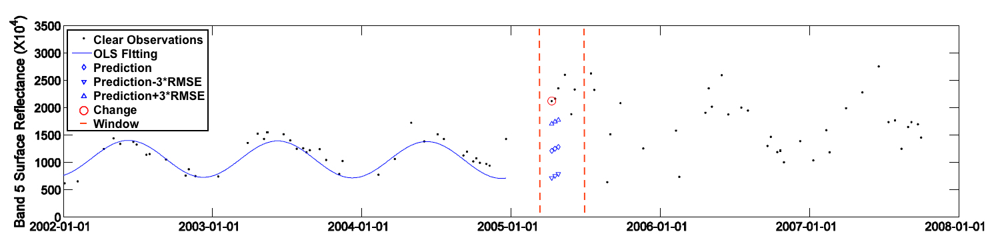
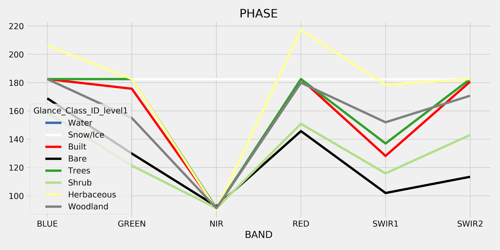
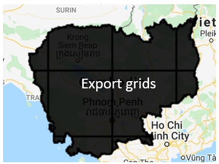
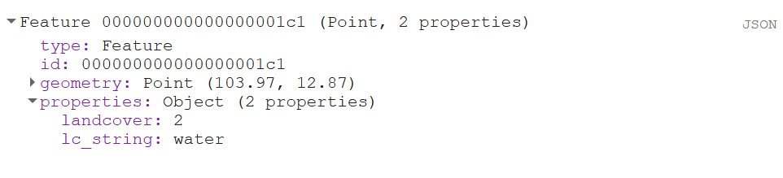
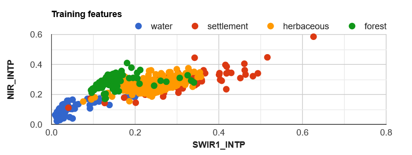
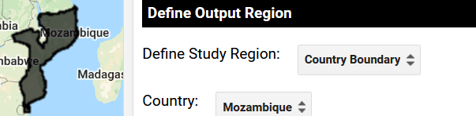
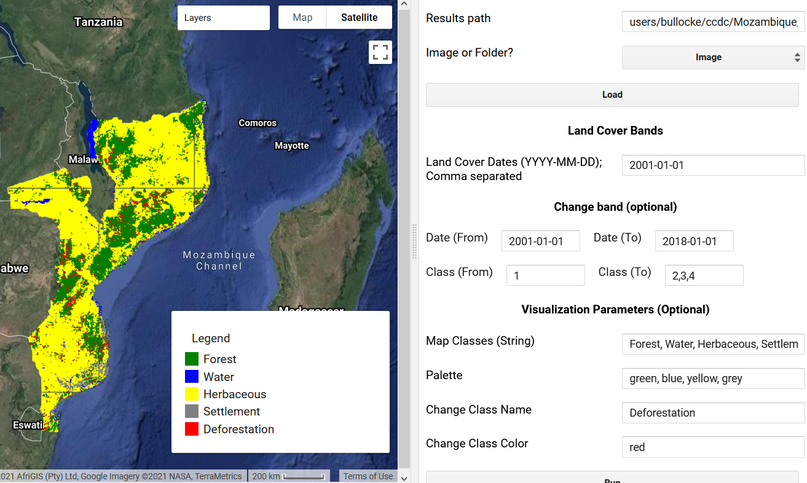
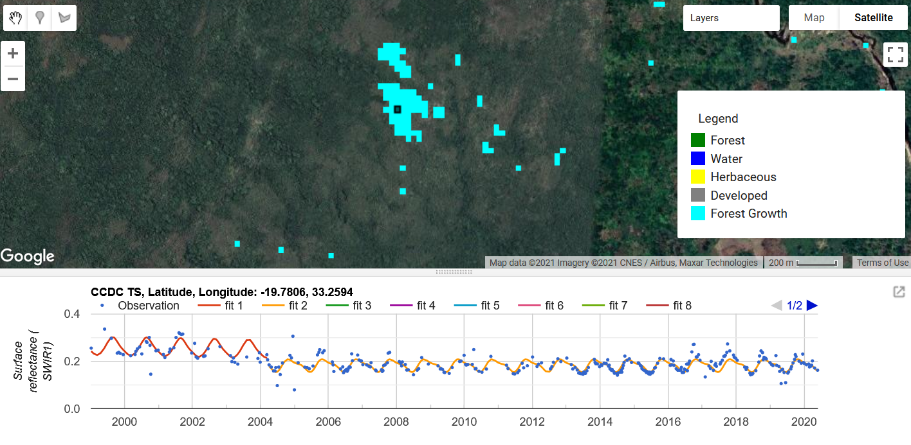

# Detección y Clasificación Continua de Cambio (CCDC)

## 1 Contexto


#### 1.1 Monitoreo de Cambio Terrestre

Los cambios en la cobertura del suelo afectan los entornos naturales y antropogénicos y el Sistema Global de Observación del Clima los considera una Variable Climática Esencial. Por ejemplo, la desertificación está provocando una transición de la cobertura terrestre de ecosistemas vegetativos a desérticos, la deforestación da como resultado la conversión de bosques a usos de la tierra modificados por el ser humano, y el desarrollo urbano puede hacer la transición de un entorno natural a uno cubierto de edificios y carreteras. Para comprender el impacto de estas transiciones es fundamental cuantificarlas a escala nacional y regional, lo que se puede lograr mediante análisis de teledetección.

El monitoreo del cambio de tierra utilizando datos de teledetección requiere metodologías para transformar las imágenes en información útil sobre los cambios en el paisaje. Uno de estos enfoques que se ha aplicado ampliamente es la detección y clasificación continua de cambios (CCDC; Zhu y Woodcock 2014). Este tutorial demostrará cómo se puede aplicar CCDC en Google Earth Engine con el propósito de monitorear el cambio de tierra.


## 2 Objetivos de aprendizaje

Al final de este tutorial, los usuarios podrán: 

*   Describir componentes claves de CCDC incluyendo los diferentes parámetros del algoritmo
*   Ejecutar CCDC usando la interfaz de “apuntar y hacer clic” y a través de usar scripts con el idioma de programación, JavaScript 
*   Crear mapas de cambio de cobertura terrestre y cambio espectral 

### 2.1 Prerrequisitos para este módulo

* Google Earth Engine (GEE) concepts
  * Getting a user account
  * Image handling in GEE
  * Basic syntax of functions
  * Basic image processing, including choice of imagery, cloud-screening, mosaicking and compositing

> NOTE: Refer to process "Pre-processing" and tool "GEE" here on OpenMRV for more information and resources for working in Google Earth Engine.


## 3 Detección de Cambio y Clasificación Continua (CCDC)
CCDC se puede ejecutar con Google Earth Engine. Se puede acceder a otras implementaciones de CCDC [aquí](https://github.com/GERSL/CCDC) e incluye implementaciones en C, Python y MATLAB. Para facilitar el análisis en GEE, Arévalo et al (2020) lanzaron una API y una colección de aplicaciones que se demostrarán [aquí](https://gee-ccdc-tools.readthedocs.io/en/latest/).

Este tutorial utilizará la implementación de CCDC en GEE, por lo tanto, se necesita una cuenta de GEE. Consulte el Módulo 1 para obtener información adicional sobre GEE. En el primer ejemplo, el proceso se demuestra utilizando la API de CCDC en Camboya. En el segundo ejemplo, el proceso se demuestra en Mozambique utilizando las interfaces gráficas de usuario. Finalmente, el proceso se realiza en Colombia para crear una estratificación de pérdida y ganancia forestal. 

### 3.1 Descripción del Algoritmo


CCDC usa todos los datos de reflectancia superficial de Landsat con mascara de nubes para un área de estudio. Los detalles acerca de la implementación original se describen en Zhu y Woodcock (2014). CCDC es un algoritmo generalizado para monitorear diferentes tipos de cambio terrestre. Por lo tanto, no depende de una banda espectral singular o un índice, y tampoco filtra los cambios en base a los cambios espectrales direccionales específicos. Un diagrama esquemático de CCDC se puede encontrar próximamente. 


Como indica el nombre, CCDC consiste de un componente de detección de cambio y uno de clasificación. La detección de cambio se ejecuta usando todas las imágenes de Landsat disponibles además de un conjunto de bandas espectrales o de índices definidos por el usuario. Típicamente, al menos las bandas Verde, Roja, Infrarrojo Cercano (NIR), Infrarrojo de onda corta (SWIR1), e Infrarrojo de Onda corta (SWIR2) se utilizan para la detección de cambios. Las nubes se filtran de todos los datos al nivel del pixel de acuerdo a la banda ‘pixel_qa’ o fMask. 

<table>
  <tr>
   <td><strong>Parámetro de Modelo</strong>
   </td>
   <td><strong>Métrica o Frase Comparable</strong>
   </td>
  </tr>
  <tr>
   <td>Intersección
   </td>
   <td>Reflectancia Media
   </td>
  </tr>
  <tr>
   <td>Pendiente
   </td>
   <td>Tendencia a Largo Plazo
   </td>
  </tr>
  <tr>
   <td>Amplitud
   </td>
   <td>Variabilidad dada la Estacionalidad
   </td>
  </tr>
  <tr>
   <td>Fase
   </td>
   <td>Tiempo Fenológico
   </td>
  </tr>
  <tr>
   <td>RMSE
   </td>
   <td>Variabilidad No-Estacional
   </td>
  </tr>
</table>

El primer paso para identificar rupturas del modelo (o "cambios espectrales") es ajustar un modelo de regresión LASSO a un subconjunto de datos al comienzo de la serie de tiempo. A continuación se muestra un ejemplo de un ajuste de regresión estacional (línea roja) a observaciones NIR (puntos negros) para un ejemplo de píxel en Colombia. Si bien esto se muestra aquí para la banda NIR, se ajusta a todas las bandas espectrales y, opcionalmente, se puede aplicar a índices espectrales. El modelo de regresión captura el “patrón general” de reflectancia en el transcurso de un año y, por lo tanto, predice cómo deberían verse las observaciones “futuras” en ausencia de un cambio en el paisaje. 


Los modelos de regresión se ajustan con coeficientes que representan la intersección del modelo, la pendiente y tres conjuntos de pares de seno / coseno. Dado que las regresiones se ajustan mediante la regresión LASSO, estos parámetros se pueden reducir a 0. Los pares de seno / coseno se convierten finalmente en amplitud y fase para que sean más fáciles de interpretar. Estos modelos se utilizan para predecir observaciones posteriores durante un "período de seguimiento", definido como una ventana móvil con el número de observaciones igual al parámetro _minObservations_. A continuación, puede ver un modelo de regresión ajustado durante un período de entrenamiento (azul), con el período de monitoreo mostrado entre las líneas de puntos rojas. La figura es original de Zhu y Woodcock (2014) y Bullock et al., (2020).



Los residuos de las observaciones en la región de estudio se utilizan para calcular una estadística de prueba que sigue una distribución de chi-cuadrado. Si cada observación en la ventana de monitoreo excede el parámetro _chiSquaredProbability_ en la estadística de prueba, se detecta un cambio. Si quedan suficientes observaciones en la serie temporal, se ajusta un nuevo modelo de entrenamiento y el proceso se repite hasta el final de la serie temporal.

Los parámetros utilizados para controlar la detección de cambios se pueden encontrar a continuación:

<table>
  <tr>
   <td><strong>Nombre de Parámetro</strong>
   </td>
   <td><strong>Descripción</strong>
   </td>
   <td><strong>Valor Recomendado</strong>
   </td>
   <td><strong>Efecto de Incremento</strong>
   </td>
  </tr>
  <tr>
   <td>breakPointBands
   </td>
   <td>Bandas para usar para calcular estadística de prueba y probar cambio espectral
   </td>
   <td>Green, Red, NIR, SWIR1, SWIR2
   </td>
   <td>N/A
   </td>
  </tr>
  <tr>
   <td>tmaskBands
   </td>
   <td>Bandas para usar para nube multi-temporal y para máscara de sombra de nube
   </td>
   <td>Green, SWIR2
   </td>
   <td>N/A
   </td>
  </tr>
  <tr>
   <td>minObservations
   </td>
   <td>Número de observaciones consecutivas excediendo el umbral para etiquetar un cambio
   </td>
   <td>4
   </td>
   <td>Menos roturas detectadas
   </td>
  </tr>
  <tr>
   <td>Probabilidad chiSquare 
   </td>
   <td>Umbral en estadística de prueba, la cual se calcula de los residuales del modelo y sigue la distribución chiSquare 
   </td>
   <td>0.995
   </td>
   <td>Menos roturas detectadas
   </td>
  </tr>
  <tr>
   <td>Escalador minNumOfYears 
   </td>
   <td>Número de años después de los cuales se calcula un nuevo ajuste de modelo durante el período de entrenamiento
   </td>
   <td>1.33
   </td>
   <td>Reducir el reacondicionamiento del modelo de regresión
   </td>
  </tr>
  <tr>
   <td>dateFormat 
   </td>
   <td>Formato para almacenar información de fechas. 0: años julian, 1: años fraccionales, 2: tiempo unix. 
   </td>
   <td>1
   </td>
   <td>N/A
   </td>
  </tr>
  <tr>
   <td>lambda 
   </td>
   <td>Valor lambda para ajustamiento de regresión LASSO
   </td>
   <td>.002
   </td>
   <td>Mas parámetros reduciendose a 0
   </td>
  </tr>
  <tr>
   <td>maxIterations
   </td>
   <td>Iteraciones máximas para ejecutar ajustamiento de regresión LASSO
   </td>
   <td>20,000
   </td>
   <td>Intentar mas ajustes LASSO para llegar a una convergencia
   </td>
  </tr>
</table>


Al final de la serie de tiempo, cada trayectoria de píxel se segmentará en parámetros de modelo que son congruentes temporalmente (por ejemplo, pendiente e intersección). Estos segmentos están separados por _cambios espectrales_, que pueden o no reflejar cambios en la cobertura del suelo o las condiciones. Sin clasificar los segmentos o las roturas del modelo, no es posible saber si estos _cambios espectrales_ son significativos. Cabe señalar que el cambio "significativo" varía según el contexto. Por ejemplo, una sequía puede provocar un cambio espectral debido a la vegetación seca. Si bien este es un cambio real que está ocurriendo en el paisaje, puede que no siempre sea relevante para los diferentes objetivos del proyecto. Por tanto, los _cambios espectrales_ yo _segmentos del modelo_ deben ser clasificados de acuerdo con los objetivos del estudio en cuestión.

**Inténtelo Usted Mismo**

Hemos creada una aplicación Google Earth Engine para visualizar la serie temporal y ejecutar detección de cambio al nivel del pixel usando CCDC: https://parevalo-bu.users.earthengine.app/view/quick-tstools

Intentar navegar a una ubicación de interés y hacer clic en el mapa para ver la serie temporal de SWIR1. La banda espectral visualizada se puede seleccionar del menú de caída a mano izquierda del mapa. Abajo hay un ejemplo de una serie de tiempo para un área de bosque convertida en pastizal en la Amazona colombiana. 


Aquí, CCDC se demuestra para el propósito del monitoreo de cambio de cobertura terrestre. Por lo tanto, modelos de regresión deben de ser clasificados en etiquetas de cobertura terrestre, y después los *cambios espectrales*  pueden ser asignados a diferentes categorías de cobertura terrestre (por ejemplo, bosque a urbano). Para hacer esto, CCDC usa datos de entrenamiento categóricos con un clasificador de Random Forest para asignar etiquetas de cobertura terrestre a cada periodo segmentado del modelo. Los datos de insumo para la clasificación con los coeficientes del modelo (por ejemplo, pendiente e intersección) además de el error 'root-mean-squared' del modelo para cada banda o índice espectral (típicamente las bandas espectrales de Landsat).  

Coberturas terrestres pueden ser clasificadas usando coeficientes de regresión dado las diferencias en reflectancia, patrones estacionales, y variabilidad de día-a-día. Los siguientes gráficos demuestran los valores medios de coeficientes para datos de entrenamiento de ocho clases de cobertura terrestre que son parte del proyecto Global Landcover Mapping and Estimation (Mapeo y estimación de cobertura terrestre global, o GLANCE por sus siglas en ingles) , el cual usa CCDC para mapear el cambio de cobertura terrestre globalmente. Note que para cada banda espectral, hay coeficientes correspondientes para la intersección (INTP), amplitud, fase, y RMSE. Dado que la intersección es generalmente análoga a la reflectancia media, el gráfico aparece como un gráfico de perfil espectral típico. La amplitud es indicativa de la estacionalidad y se puede ver que la banda NIR es altamente estacional para la clase forestal debido a la fenología. La fase es más difícil de interpretar ya que se relaciona con la sincronización de los patrones estacionales, mientras que RMSE refleja la variabilidad general de los datos. Es lógico que el RMSE sea más alto para las clases herbáceas y desnudas, ya que generalmente se consideran clases de cobertura terrestre "ruidosas".


<table>
  <tr>
   <td>


   </td>
   <td>


   </td>
  </tr>
  <tr>
   <td>




   </td>
   <td>


   </td>
  </tr>
</table>


### 3.2 Camboya: API de CCDC

El caso de prueba en Camboya se demostrará aquí utilizando la API de CCDC. Este mismo proceso se puede realizar en la GUI siguiendo las instrucciones que se describen a continuación en el ejemplo de Mozambique.

En la [consola Javascript de Google Earth Engine](https://code.earthengine.google.com/), primero debe cargar la API de CCDC y definir los parámetros para la detección de cambios y la región de estudio. Para este ejemplo, usaremos todo el país de Camboya como región de estudio.

Copie y pegue el siguiente script en GEE, o cargue el script en el repositorio Open MRV GEE llamado ‘OpenMRV_español/Part 2/CCDC_esp/Cambodia_1_esp’: 


```javascript
// Cargar API de CCDC
var utils = require('projects/GLANCE:ccdcUtilities/api')

// Definir párametros en un objeto
var changeDetectionParameters = {
  breakpointBands: ['GREEN','RED','NIR','SWIR1','SWIR2'],
  tmaskBands: ['GREEN','SWIR2'],
  minObservations: 4,
  chiSquareProbability: .99,
  minNumOfYearsScaler: 1.33,
  dateFormat: 2,
  lambda: .002,
  maxIterations: 25000
}

// Definir region de estudio 
var studyRegion = ee.FeatureCollection('USDOS/LSIB_SIMPLE/2017')
  .filterMetadata('country_na','equals','Cambodia').union()

Map.addLayer(studyRegion)
Map.centerObject(studyRegion)

```


La función [getLandsat](https://gee-ccdc-tools.readthedocs.io/en/latest/api/api.html#getLandsat) del API de CCDC se puede utilizar para obtener todos los datos Landsat para Camboya, para crear una máscara usando la banda  ‘pixel_qa’ , y para la conversión a unidades de reflectancia.  


```javascript
// Definir insumos para imágenes Landsat
var inputParams = {
  start: '2000-01-01',
  end: '2020-01-01',
}

// Filtrar por fecha y ubicación en Camboya
var filteredLandsat = utils.Inputs.getLandsat()
  .filterBounds(studyRegion)
  .filterDate(inputParams.start, inputParams.end)

print(filteredLandsat.size())
```


En la consola, debería ver que hay 7889 imágenes Landsat entre 2000 y 2020 para Camboya. Para realizar el componente de detección de cambios de CCDC, solo necesitamos definir la colección de insumo en el objeto "changeDetectionParameters" y pasarla a la función "Ccdc" de GEE.


```javascript
 // Poner la colección de Landsat en los parámetros de detección de cambios
changeDetectionParameters['collection'] = filteredLandsat

// Ejecutar CCDC
var results = ee.Algorithms.TemporalSegmentation.Ccdc(changeDetectionParameters)

print(results)
```


Los resultados contienen diferentes números de segmentos para cada píxel. Por lo tanto, el resultado no es adecuado para los formatos típicos de imágenes ráster de banda fija. En su lugar, los resultados de la detección de cambios se pueden guardar como un Asset en forma de imagen de matriz, lo que requiere un modo "pyramidPolicy" de "muestra".

Tenga en cuenta que exportar todo un país llevará al menos unas pocas horas de procesamiento.


```javascript
// Combinar parámetros para guardarlos como metadatos
var paramsCombined = ee.Dictionary(changeDetectionParameters).combine(inputParams).remove(['collection'])
print(paramsCombined)

Export.image.toAsset({
  image: results.setMulti(paramsCombined),
  scale: 30,
  description: 'ccdc_change_results',
  maxPixels: 1e13,
  region: studyRegion,
  assetId: '/path/to/asset',
  pyramidingPolicy: {
	'.default': 'sample'
  }
})
```

**Consejo** Si su área de estudio es grande, es posible que el paso anterior no se complete nunca. Una forma de solucionar este problema es dividir la exportación en tareas más pequeñas y volver a unirlas más tarde. El siguiente código usa la función [makeAutoGrid](https://gee-ccdc-tools.readthedocs.io/en/latest/api/api.html##makeAutoGrid) para crear una cuadrícula que se superpone al área de estudio. Luego, se utiliza un bucle o 'loop' de JavaScript del lado del navegador para enviar una tarea diferente para cada uno.

```javascript
var grid = utils.Inputs.makeAutoGrid(studyRegion.geometry().bounds().buffer(150000), 2)
  .filterBounds(studyRegion.geometry())
  .toList(100)


grid.size().evaluate(function(s) {
  print('## of grids: ', s)
  for (var i = 0; i < s; i++) {
    var outGeo = ee.Feature(grid.get(i)).geometry()
      .intersection(studyRegion.geometry()) // Reducirá la región de estudio
  Map.addLayer(outGeo, {}, 'Grid ' + i)
  Export.image.toAsset({
    image: results.setMulti(paramsCombined),
    scale: 30,
    description: 'ccdc_change_results',
    maxPixels: 1e13,
    region: outGeo,
    assetId: 'Cambodia_Change_Results_Grid_' + i,
    pyramidingPolicy: {
      '.default': 'sample'
    }
  })

  }
})
```




**Nota Importante:** Si no puede exportar los coeficientes CCDC, también puede utilizar los coeficientes globales CCDC creados por Gorelick et al., (Investigación no publicada). Estos datos fueron creados para superar el cuello de botella en el uso de CCDC que proviene de la creación de los coeficientes iniciales. A partir de enero de 2021, estos resultados se pueden cargar utilizando el siguiente código:


```javascript
var globalResults = ee.ImageCollection('projects/CCDC/v3').mosaic()
```


Este archivo contiene coeficientes del modelo CCDE e información de roturas del modelo. Específicamente, las bandas del Asset de 'results' (resultados) son:

*   tStart: La fecha inicial de cada segmento del modelo. 
*   tEnd: La fecha final de cada segmento del modelo. 
*   tBreak: La fecha de rotura del módulo si un cambio es detectado. 
*   numObs: El numero de observaciones usadas en cada segmento del modelo. 
*   changeProb: Un valor numérico representando una probabilidad de cambio multi-banda. 
*   *_coefs: Los coeficientes de regresión para cada una de las bandas en la colección de imágenes. 
*   *_rmse: El error root-mean-square del modelo para cada segmento y banda de insumo. 
*   *_magnitude: Para los segmentos con cambios detectados, esto representa los residuales normalizados durante el periodo de cambio. 

El siguiente paso para realizar un análisis de la cobertura terrestre utilizando CCDC es recopilar datos de capacitación. Hay algunos requisitos para que los datos de entrenamiento funcionen con el resto del proceso. Este tutorial demuestra cómo garantizar que sus datos cumplan con estos requisitos.

Requisitos de datos de entrenamiento**:**


*   Los datos deben de ser un Earth Engine FeatureCollection (colección de objetos de EarthEngine) compuesto de geometrías de punto. 
*   Un atributo en cada punto debe de contener un valor numérico indicando el tipo de cobertura terrestre con el que esta asociado. 
*   Un atributo en cada punto debe de contener un año que corresponde a la etiqueta de la cobertura terrestre. 

**Pasos opcionales adicionales**

*   Los datos predictores como atributos para cada punto y para el año que corresponde a la etiqueta de la cobertura terrestre.
*   Identificación única de muestreo como atributos 

Datos de entrenamiento para Camboya fueron colectados como parte del Módulo 1.2.2 en esta serie de tutoriales y pueden ser cargados aquí. Note que el código relacionado a las tareas de cargar y formatear los datos de entrenamiento se puede encontrar en el script ‘CCDC/Cambodia_2’ en el repositorio de Open MRV. 


```javascript
var trainingData = ee.FeatureCollection('users/openmrv/MRV/cambodia_training')
print(trainingData.first())
```

En la consola, debería ver información sobre el primer punto de entrenamiento. Seleccione la función y luego seleccione "geometría". Asegúrese de que el "tipo" sea "Punto", como en la figura siguiente. Si se trata de cualquier otra cosa (como Rectángulo o Polígono), debe convertir sus datos en puntos antes de continuar.

**Creación de un atributo numérico de cobertura terrestre**

La etiqueta de cobertura terrestre debe ser numérica, por lo que no puede ser una cadena (como “bosque”) o una cadena numérica (como un número escrito en formato de cadena). Para verificar el tipo de su atributo, seleccione el botón "JSON" en el lado derecho de la consola para expandir la representación json de la función.





Debería ver que aparece el JSON del objeto:


Tenga en cuenta que la función tiene dos atributos: lc_string y landcover. El atributo lc_string no funcionará porque los clasificadores requieren una propiedad de clase numérica. También tenga en cuenta que la representación JSON de la propiedad "landcover" es un 2 numérico, no una representación de cadena como "2". Dado que es numérico, funcionará para la clasificación.

Si no tiene un atributo numérico que indique la cobertura terrestre, puede convertir un atributo de cadena en numérico utilizando la función 'remap' (reasignar) Earth Engine (EE). Podemos convertir nuestra propiedad "lc_string" en una propiedad numérica "lc_numeric" con el siguiente código (tenga en cuenta que esto es solo un ejemplo y no es necesario porque "landcover" es numérico):


```javascript
trainingData  = trainingData.map(function(feat) {
  return feat.set('lc_numeric',feat.get('lc_string'))})
  .remap(['forest','herbaceous','water','settlement'],[1,2,3,4],'lc_numeric')
```


Para determinar los coeficientes de CCDC que se utilizarán como predictores para entrenar al clasificador, cada punto debe tener un atributo de año para consultar los resultados de CCDC. Por ejemplo, si sabe que un punto de formación corresponde al bosque en 2014, los coeficientes CCDC de 2014 se utilizarán para la formación. Si todos sus datos de entrenamiento corresponden a un año determinado, puede agregar el atributo con un simple código. En este ejemplo, los datos de entrenamiento corresponden a 2018 y están asignados a un atributo llamado "año".


```javascript
trainingData  = trainingData.map(function(feat) {
  return feat.set('year',2018)})
```

**Genere imágenes y extraiga datos de predictores para el entrenamiento**

Necesitamos extraer datos de predictores para cada punto de entrenamiento antes de poder aplicar un clasificador. Podemos hacer esto manualmente justo antes de enviar la clasificación, o podemos extraer los predictores por adelantado y almacenarlos como propiedades de cada uno de los puntos de entrenamiento. Para este tutorial usaremos la segunda forma, porque permite una clasificación más rápida que se cargará sobre la marcha. Esto es útil para probar los parámetros de clasificación. La función para hacer esto se llama [getTrainingCoefsAtDate](https://gee-ccdc-tools.readthedocs.io/en/latest/api/api.html##getTrainingCoefsAtDate). Primero, sin embargo, necesitamos construir la imagen del coeficiente CCDC para muestrear. Básicamente, este paso convierte la imagen de matriz en una imagen multibanda en la que cada píxel tiene el mismo número de bandas.

La función [buildCcdImage](https://gee-ccdc-tools.readthedocs.io/en/latest/api/api.html#buildCcdImage) toma tres parámetros: la imagen de matriz de resultado del cambio, una lista de bandas, el número de segmentos para convertir en bandas y el nombre de las bandas espectrales o índices. La variable "changeResults" se puede definir a base del resultado de la detección de cambios, o también puede ser un conjunto global de coeficientes CCDC recortados a su región de estudio, como se demuestra aquí. Si el usuario no pudo exportar una imagen de coeficiente, debe usar la Opción A a continuación. Si el usuario exportó las imágenes de coeficiente en el paso anterior como una sola imagen, debe usar la Opción B a continuación, si exportó con varias imágenes, debe usar la Opción C. 


```javascript
// Definir bandas para usar en la clasificación
var bands = ['BLUE','GREEN','RED','NIR','SWIR1','SWIR2']

// Definir coeficientes para usar en la clasificación
var coefs = ["INTP", "SLP","COS", "SIN","RMSE","COS2","SIN2","COS3","SIN3"]

// IDs de los segmentos
var segs = ["S1", "S2", "S3", "S4", "S5", "S6"]

// Opción A: Obtener resultados de cambio usando coeficientes globales
var globalResults = ee.ImageCollection('projects/CCDC/v3').mosaic()
var changeResults = globalResults.clip(studyRegion)

// Opción B: Obtener resultados de cambio de los resultados hechos con este tutorial. Note que la ruta debe ser cambiada a la ruta de la imagen de coeficiente exportada.
var changeResults = ee.Image('/path/to/change/detection/results')

// Opción C: Obtener resultados de cambio de multiples imagenes de resultado. Note que la ruta debe ser cambiada a la ruta de las imagenes de coeficiente exportadas.
var changeResults1 = ee.Image('/path/to/change/detection/results_1')
var changeResults2 = ee.Image('/path/to/change/detection/results_2')
var changeResults = ee.ImageCollection([changeResults1, changeResults2]).mosaic()


// Cargar pila de imagen ccd con coeficientes e información de cambio
var ccdImage = utils.CCDC.buildCcdImage(changeResults, segs.length, bands)
print(ccdImage)

// Agregar el area de estudio al mapa para un fondo mas oscuro
Map.addLayer(studyRegion, {color: 'black'},'Cambodia')


// Agregar la fecha de la primera rotura de segmento al mapa.
Map.addLayer(ccdImage.select('S1_tBreak').selfMask(), {min: 2000, max: 2020, palette: ['##8c510a','##d8b365','##f6e8c3','##f5f5f5','##c7eae5','##5ab4ac','##01665e']}, 'Segment 1 Break Dates')

// Agregar el primer segmento NIR RMSE
Map.addLayer(ccdImage.select('S1_NIR_RMSE'), {min: 0, max: .05, palette: ['##ffffcc','##d9f0a3','##addd8e','##78c679','##41ab5d','##238443','##005a32']}, 'Segment 1 NIR RMSE')
```

<table>
  <tr>
   <td>


<p>
Segmento 1 Fecha de Rotura (Marrón -> Azul)
   </td>
   <td>


<p>
Segmento 1 NIR RMSE (Verde Claro -> Verde Oscuro)
   </td>
  </tr>
</table>


Próximamente, queremos cargar datos topográficos y climáticos auxiliares con la función [getAncillary](https://gee-ccdc-tools.readthedocs.io/en/latest/api/api.html##getAncillary) y obtener coeficientes CCDC en cada uno de los puntos de entrenamiento usando la función [getTrainingCoefsAtDate](getTrainingCoefsAtDate). 


```javascript
// Propiedad correspondiente al año de los datos de entrenamiento
var yearProperty = 'year'

// Finalmente, conseguir datos topográficos y climáticos auxiliares
var ancillary = utils.Inputs.getAncillary()

var trainingData = utils.Classification.getTrainingCoefsAtDate(
  trainingData, coefs, bands, yearProperty, ancillary, ccdImage, segs)


// Filtrar puntos sin datos 
var testBand = bands[0] + '_' + coefs[0]
trainingData = trainingData.filter(ee.Filter.notNull([testBand]))

print('First training point with predictors:', trainingData.first())


```


Ahora debería ver todos los datos de predictor que se pueden usar para clasificación en los atributos de objetos.

**Agregar IDs únicos como atributos**

Otro paso opcional, pero recomendado, es asignar a cada muestra un ID único como atributo. EE le da a cada punto un ID, pero pueden ser largos y aparentemente aleatorios. La función [assignIDs](https://gee-ccdc-tools.readthedocs.io/en/latest/api/api.html##assignIds) en nuestra API mezclará la muestra y asignará una ID única a un nombre de atributo dado .


```javascript
trainingData = utils.Classification.assignIds(trainingData, 'ID')
```


Finalmente, los datos de entrenamiento se pueden exportar como un asset: 


```javascript
Export.table.toAsset({
  collection: trainingData,
  description: 'trainingDataProcessed',
  assetId: 'trainingDataWithPredictors'})
```

**Trazar coeficientes de datos de entrenamiento**

Opcionalmente, una vez completada la exportación, podemos visualizar diferentes coeficientes para nuestras clases de entrenamiento. En el siguiente código, se cargan las características de entrenamiento guardadas y se crea un diagrama de dispersión que muestra las intersecciones NIR y SWIR1 para los puntos de entrenamiento y se organiza por cobertura terrestre. Tenga en cuenta que este código se puede encontrar en el repositorio de Open MRV en el script "CCDC / Cambodia_3".


```javascript
var trainingData = ee.FeatureCollection('users/openmrv/MRV/Cambodia_TrainingData_CCDC')

var doChart = function(sample, x, y, xMin, xMax, yMin, yMax) {
  var chart =
	ui.Chart.feature.groups({
  	features: sample,
  	xProperty: x,
  	yProperty: y,
  	seriesProperty: 'lc_string'
	})
	.setChartType('ScatterChart')
	.setOptions({
  	title: 'Training features',
  	hAxis:
      	{title: x,
      	titleTextStyle: {italic: false, bold: true},
      	viewWindow: {min: xMin, max: xMax}},
  	vAxis: {
    	title: y,
    	titleTextStyle: {italic: false, bold: true},
    	viewWindow: {min: yMin, max: yMax}
  	},
	});
	return chart

}

// Cambiar 'SWIR1' r 'NIR' a cualquier banda de insumo y 'INTP' a cualquier coeficiente 
print(doChart(trainingData, 'SWIR1_INTP','NIR_INTP'))

```





Tenga en cuenta las diferencias en las intersecciones entre bandas. Las muestras de agua tienen intercepciones bajas en las bandas NIR y SWIR1 debido a la reflectancia generalmente baja en el agua. El bosque, por el contrario, tiene un SWIR1 bajo pero un NIR alto, debido a la alta reflectancia en las longitudes de onda de NIR para la vegetación verde. Las áreas herbáceas y los asentamientos son muy variables, lo que refleja la amplia gama de reflectancia en estas clases. De esta manera, se puede ver cómo la intersección generalmente corresponde a la reflectancia "promedio".

**Clasificar segmentos**

Los segmentos del modelo ahora se pueden clasificar con la función [classifySegments](https://gee-ccdc-tools.readthedocs.io/en/latest/api/api.html##classifySegments) de la API. El siguiente código primero define los parámetros de un clasificador de Random Forest y luego pasa el clasificador, los datos de entrenamiento y los segmentos del modelo a la función de [classifySegments](https://gee-ccdc-tools.readthedocs.io/en/latest/api /api.html##classifySegments). La clasificación del primer segmento se agrega al mapa en donde verde es bosque, marrón es herbáceo, azul es agua y negro es asentamientos. Tenga en cuenta que este código se puede encontrar en el repositorio de Open MRV en el script "CCDC / Cambodia_4". 


```javascript
// Clasificador
var classifier = ee.Classifier.smileRandomForest({
  numberOfTrees: 150,
  variablesPerSplit: null,
  minLeafPopulation: 1,
  bagFraction: 0.5,
  maxNodes: null
})

var results = utils.Classification.classifySegments(
  ccdImage, segs.length, bands, null, [], trainingData, classifier, studyRegion, 'landcover', coefs)
  .clip(studyRegion)


Map.addLayer(results.select(0), {min: 1, max: 4, palette: ['##a6d854','##386cb0','##e5c494','black']}, 'Seg1 Classification')


```


Finalmente, las clasificaciones en fechas específicas se pueden obtener usando la función [getLcAtDate](https://gee-ccdc-tools.readthedocs.io/en/latest/api/api.html#getLcAtDate). El siguiente fragmento de código primero crea una clasificación para la fecha arbitraria del 27 de marzo de 2014 y luego calcula la deforestación entre 2000 y 2018. En los datos de entrenamiento, el valor 1 representa bosque, 2 es herbáceo, 3 es agua y 4 es asentamiento. Por lo tanto, la sustitución de los diferentes valores de clase crearía mapas de cambio para las otras clases respectivas.


```javascript
// Crear clasificación para 27 de marzo de 2014 y agregarlo al mapa
var dateOfClassification = '2014-03-27'
var matchingDate = utils.Classification.getLcAtDate(results, dateOfClassification)
Map.addLayer(matchingDate, {min: 1, max: 4, palette: ['##a6d854','##386cb0','##e5c494','black']}, 'Classification ' + dateOfClassification)

// Crear clasificación para 1 de enero del 2000 y 2018 
var class2000 = utils.Classification.getLcAtDate(results,'2000-01-01')
var class2018 = utils.Classification.getLcAtDate(results,'2018-01-01')

// Deforestación es donde fue bosque (1) en 2000 y no bosque en 2018. 
var deforestation = class2000.eq(1).and(class2018.neq(1))

// Un mapa de incremento de asentamientos se puede calcular de manera similar:
var settlementGain = class2000.neq(4).and(class2018.eq(4))


Map.addLayer(deforestation.selfMask(), {palette: 'red'}, 'Deforestation')

// Enmascarar la clasificación del 2018 para que solo contenga la etiqueta de cobertura terrestre 2018 para pixeles experimentando deforestación
var postDefClass = class2018.updateMask(deforestation)

Map.addLayer(postDefClass, {min: 1, max: 4, palette: ['##a6d854','##386cb0','##e5c494','black']}, 'Post-Deforestation Class')
```


<table>
  <tr>
   <td>


<p>
Deforestación
   </td>
   <td>


<p>
Cobertura Terrestre despues de Deforestación
   </td>
  </tr>
</table>


Finalmente, podemos simplificar los pasos anteriores para ejecutar una clasificación de cobertura terrestre usando los coeficientes globales en una sola sección de código (la cual se encuentra en el repositorio Open MRV en script ‘CCDC/Cambodia_5’). Note que estos pasos se describen en más detalle arriba.


```javascript
// Cargar la API de CCDC
var utils = require('projects/GLANCE:ccdcUtilities/api')

// Parámetros, assets, y region de estudio 
var studyRegion = ee.FeatureCollection('USDOS/LSIB_SIMPLE/2017')
  .filterMetadata('country_na','equals','Cambodia').union()

// Parámetros
var bands = ['BLUE','GREEN','RED','NIR','SWIR1','SWIR2']
var coefs = ["INTP", "SLP","COS", "SIN","RMSE","COS2","SIN2","COS3","SIN3"]
var segs = ["S1", "S2", "S3", "S4", "S5", "S6"]
var yearProperty = 'year'
var lcClasses = ['forest','herbaceous','water','settlement']
var numericClasses = [1, 2, 3, 4]
var classifier = ee.Classifier.smileRandomForest({
  numberOfTrees: 150,
  variablesPerSplit: null,
  minLeafPopulation: 1,
  bagFraction: 0.5,
  maxNodes: null
})

// Propiedad de año
var trainingData = ee.FeatureCollection('users/openmrv/MRV/cambodia_training')
  .map(function(feat) {
  return feat.set(yearProperty,2018,'lc_numeric',feat.get('lc_string'))})
  .remap(lcClasses, numericClasses,'lc_numeric')
 
// Conseguir insumos de coeficientes globales y datos topográficos y climáticos auxiliares
var globalResults = ee.ImageCollection('projects/CCDC/v3').mosaic()
var changeResults = globalResults.clip(studyRegion)
var ccdImage = utils.CCDC.buildCcdImage(changeResults, segs.length, bands)
var ancillary = utils.Inputs.getAncillary()

// Conseguir coeficientes de entrenamiento en los puntos de muestreo 
var trainingData = utils.Classification.getTrainingCoefsAtDate(
  trainingData, coefs, bands, yearProperty, ancillary, ccdImage, segs)
var testBand = bands[0] + '_' + coefs[0]
trainingData = trainingData.filter(ee.Filter.notNull([testBand]))

// Clasificación de cobertura terrestre
var results = utils.Classification.classifySegments(
  ccdImage, segs.length, bands, null, [], trainingData, classifier, studyRegion, 'landcover', coefs)
  .clip(studyRegion)

// Crear mapa de cobertura terrestre para la fecha del 27 de marzo 2014 
var dateOfClassification = '2014-03-27'
var matchingDate = utils.Classification.getLcAtDate(results, dateOfClassification)

// Calcular cambio de cobertura terrestre y crear mapas de cobertura terrestre de deforestación y pos-deforestación
var class2000 = utils.Classification.getLcAtDate(results,'2000-01-01')
var class2018 = utils.Classification.getLcAtDate(results,'2018-01-01')
var deforestation = class2000.eq(1).and(class2018.neq(1))
var postDefClass = class2018.updateMask(deforestation)

// Agregar resultados al mapa
Map.addLayer(deforestation.selfMask(), {palette: 'red'}, 'Deforestation')
Map.addLayer(postDefClass, {min: 1, max: 4, palette: ['##a6d854','##386cb0','##e5c494','black']}, 'Post-Deforestation Class')
Map.addLayer(matchingDate, {min: 1, max: 4, palette: ['##a6d854','##386cb0','##e5c494','black']}, 'Classification ' + dateOfClassification)
```


#### 3.3 Mozambique: GUIs de CCDC 

Para facilitar el acceso a la nueva API, hemos creado una serie de interfaces gráficas de usuario (GUIs por sus siglas en ingles) que no requieren programación de parte del usuario. Descripciones detalladas de estas herramientas se pueden encontrar en [Arevalo et al., 2020](https://doi.org/10.3389/fclim.2020.576740). 

<table>
  <tr>
   <td><strong>Nombre y Enlace</strong>
   </td>
   <td><strong>Descripción</strong>
   </td>
  </tr>
  <tr>
   <td><a href="https://code.earthengine.google.com/?scriptPath=users%2Fparevalo_bu%2Fgee-ccdc-tools%3AAPPS%2Ftstools_advanced">Time Series Viewer</a>
   </td>
   <td>Visualizar serie temporal de trayectorio de pixel de CCDC y experimentar con parametros de modelo
   </td>
  </tr>
  <tr>
   <td><a href="https://code.earthengine.google.com/?scriptPath=users%2Fparevalo_bu%2Fgee-ccdc-tools%3AAPPS%2Fsubmit_ccdc">Enviar CCDC</a>
   </td>
   <td>Calcular coeficientes CCDC e información de cambio espectral
   </td>
  </tr>
  <tr>
   <td><a href="https://code.earthengine.google.com/?scriptPath=users%2Fparevalo_bu%2Fgee-ccdc-tools%3AAPPS%2Fvisualize_ccdc">Visualize CCDC</a>
   </td>
   <td>Visualizar coeficientes CCDC e información de cambio espectral
   </td>
  </tr>
  <tr>
   <td><a href="https://code.earthengine.google.com/?scriptPath=users%2Fparevalo_bu%2Fgee-ccdc-tools%3AAPPS%2Fclassify_app">Clasificar CCDC</a>
   </td>
   <td>Ejecutar clasificación de cobertura terrestre de coeficientes de CCDC
   </td>
  </tr>
  <tr>
   <td><a href="https://code.earthengine.google.com/?scriptPath=users%2Fparevalo_bu%2Fgee-ccdc-tools%3AAPPS%2Flandcover_app">Land Cover and Change</a>
   </td>
   <td>Crear mapas de cobertura terrestre y de cambio de cobertura terrestre
   </td>
  </tr
</table>


Estas GUIs pueden usarse para calcular los parámetros de CCDC (por ejemplo coeficientes de regresión), para visualizar e interactuar con coeficientes CCDC y series temporal de pixel correspondientes, y para la clasificación de los parámetros del modelo. Este tutorial demostrará las GUIs para la clasificación de cobertura terrestre y para crear mapas de cobertura terrestre y cambio de cobertura terrestre. 

Ya que los coeficientes CCDC requieren computación intensiva para calcular sobre áreas grandes, usaremos los resultados globales CCDC que introdujimos en el ejemplo de Camboya.  Las herramientas, por defecto, cargarán los coeficientes globales más recientes. Si los usuarios desean crear sus propios coeficientes utilizando sus propios parámetros, deben consultar las instrucciones del ejemplo de Camboya utilizando la API de CCDC.

En este tutorial, el usuario podrá: 

*   Clasificar segmentos CCDC en base a los parámetros de modelo y los datos auxiliares 
*   Extraer un mapa de cobertura terrestre para una fecha especifica 
*   Calcular cambio de cobertura terrestre entre dos o mas fechas 


#### Clasificar segmentos de serie de tiempo 

El resultado de esta parte del tutorial será una imagen con bandas correspondientes a la etiqueta de cobertura terrestre _n_ésima del píxel para _n_-bandas. En otras palabras, la banda 1 es la clasificación del primer segmento, la banda 2 es el segundo, y así sucesivamente. En teoría, un píxel puede tener decenas de segmentos. Sin embargo, eso es muy raro, ya que los cambios corresponden al cambio de tierra que ocurre dentro de ese píxel. Así, para reducir la intensidad computacional, limitamos el número de segmentos que se clasifican en esta aplicación a 6 por píxel.

El primer paso es cargar la [aplicación](https://code.earthengine.google.com/?scriptPath=users%2Fparevalo_bu%2Fgee-ccdc-tools%3AAPPS%2Fclassify_app), debería ver aparecer un panel como este:


A continuación, el usuario debe cargar los coeficientes CCDC. Si los coeficientes se crearon mediante el paso anterior "Enviar detección de cambios", ese asset debe utilizarse en este paso. En caso contrario, se pueden utilizar los coeficientes globales.

Estos primeros parámetros describen el formato de los resultados de la CCDC. Primero, ¿se guardan como una sola imagen o como una colección? El siguiente es la ruta de los resultados de la CCDC. Si utiliza los resultados de la sección anterior, seleccione "Imagen" para el tipo de resultado y agregue la ruta al asset en el cuadro de texto. Alternativamente, los resultados globales se pueden cargar usando el tipo de resultado "Image Collection" (Colección de imágenes) y la ruta "projects / CCDC / v3". Finalmente, debe especificar el formato de fecha con el que se ejecutaron los resultados. Para el conjunto de datos global y el valor predeterminado de la aplicación de detección de cambios, el formato es años fraccionarios (1). Haga clic en Cargar.

Debería ver el panel _Predictor Variables_ poblarse como en la siguiente figura. Desmarque las bandas, coeficientes o datos auxiliares que no desee que se utilicen como insumos para la clasificación. Los insumos del terreno son del [DEM global SRTM de 30 m](https://doi.org/10.1029/2005RG000183), mientras que los insumos del clima son de [WorldClim BIO Variables V1](https://doi.org/10.1002/ joc.1276). Por encima de las variables predictoras hay una opción para elegir un clasificador de aprendizaje automático para realizar la clasificación. Generalmente, Random Forest se desempeña bien en el contexto de la CCDC.


La siguiente opción le permite decidir cómo definir la región para clasificar y exportar. Como verá, hay muchas opciones. La mayoría de esas giran en torno a una cuadrícula global que hemos creado para el proyecto Global Land Cover Mapping and Estimation (GLanCE). Puede encontrar más información sobre la cuadrícula GLanCE en el [sitio web del proyecto](http://sites.bu.edu/measures/).


Hay cuatro formas de especificar un mosaico para que se ejecute, además de definir manualmente la región de estudio o seleccionar un país. La opción más simple es elegir “Tile Intersecting Point” ("Mosaico de punto de intersección") y luego hacer clic en algún lugar del mapa. Verá que la cuadrícula se superpone a la ubicación que seleccionó cargada como región de estudio.


Alternativamente, puede definir la región de estudio manualmente  haciendo clic en cinco puntos en el mapa que definen los limites. 


Las otras opciones son definir manualmente las cuadrículas de salida en función de sus ID de mosaico, dibujar en el mapa para especificar múltiples cuadrículas o seleccionar un país. Si se seleccionan varias cuadrículas, cada cuadrícula se enviará como una tarea separada. Si se selecciona un país, todo el límite del país será la región de estudio.





Use el método _Country Boundary_ (Limites del País) para definir una región de salida, y seleccione  _Mozambique_ para el _Country_ (país). 

El conjunto final de parámetros se relaciona con los datos de entrenamiento. Los datos de entrenamiento requieren que cada punto tenga un atributo que identifique la etiqueta de cobertura terrestre y también debe corresponder a un año específico para el entrenamiento. Tiene la opción de utilizar la FeatureCollection completa o solo los puntos que se encuentran dentro de la región de estudio.

*   Un conjunto de datos de entrenamiento de ejemplo, como se desarrollo en el Modulo 1.2.2, puede ser encontrado en el asset ‘users/openmrv/MRV/mozambique_training’. 
*   Suponiendo que los datos de entrenamiento provienen de su región de estudio, puede usar la opción por defecto de _Within Output Extent_ (dentro de los limites del resultado).
*   El _Training Year_ (año de entrenamiento) corresponde al año de las etiquetas de entrenamiento (por ejemplo, en que año una muestra etiquetada como 'Bosque' es en la actualidad un 'bosque'?) Para este conjunto de datos, el año es 2018. 
*   El _Training Attribute_ (atributo de entrenamiento) corresponde al nombre del atributo en cada objeto que contiene una etiqueta de cobertura terrestre. Para este conjunto de datos, es *landcover.*


Tenga en cuenta que la clasificación se ejecuta más rápido si los datos del predictor para cada punto de entrenamiento se guardan en las propiedades de la función (en lugar de calcularse sobre la marcha). Recomendamos hacer este proceso en una tarea separada y luego usar los datos con los predictores adjuntos para probar rápidamente los parámetros de clasificación. Debería ver en la consola una nota sobre si los datos del predictor se deben muestrear o no como puntos de entrenamiento. Si es así, también puede enviar una tarea que guardará este cálculo para uso futuro.

Finalmente, cuando hace clic en "Ejecutar clasificación", la clasificación correspondiente al período del primer segmento se muestra en el mapa. En este caso, los modelos corresponden a ~ 1999. La pila de clasificación completa se puede exportar como una tarea que debería aparecer con la descripción "clasificacion_segmentos".


#### Crear Mapas de Cobertura Terrestre y de Cambio Terrestre 

Una vez que la tarea ha completado el procesamiento, podemos usarla para hacer mapas de cobertura terrestre en cualquier fecha para la región de estudio. Este asset se puede utilizar directamente en la [Aplicación Landcover](https://code.earthengine.google.com/?scriptPath=users%2Fparevalo_bu%2Fgee-ccdc-tools%3AAPPS%2Flandcover_app). Esta aplicación es relativamente simple: todo lo que necesita hacer es especificar la ruta a la imagen del segmento creada anteriormente y una lista de fechas y ¡listo! Un ejemplo del resultado creado siguiendo los pasos anteriores se puede encontrar en: "users/openmrv/MRV/Mozambique_CCDC_Segments".

Las fechas deben introducirse en el formato "AAAA-MM-DD" y separadas por comas, por ejemplo, "2001-01-15, 2001-07-21, 2014-12-10". Cada banda en la imagen resultante corresponderá a una clasificación de fecha diferente.





Esta aplicación también tiene la función de agregar un cambio entre lo que representa la conversión de una o varias clases en una fecha específica a una clase o grupo de clases específico. Primero debe especificar las fechas de inicio y finalización y los valores de la clase de cobertura terrestre para las fechas correspondientes. Por ejemplo, los siguientes ejemplos muestran los píxeles (rojo) que son de clase 1 (bosque) en 2001-01-01, y son de clase 2, 3 o 4 en 2018-01-01. En otras palabras, deforestación de enero de 2001 a enero de 2018. Al cambiar las clases "from" (Desde) y "To" (A) para la banda de cambio, se calculará el inverso de la deforestación, o el crecimiento del bosque.


También puede especificar un solo valor para el cuadro Clase (A), por ejemplo, con solo usar 3 se asignaría la conversión de 1 a 3, o de bosque a tierra de cultivo. Si estas casillas se dejan vacías, solo se crearán los mapas de cobertura terrestre.

Finalmente, la herramienta le permite especificar algunos parámetros de visualización. Este paso es muy sencillo, solo enumere los nombres de la cobertura terrestre y el valor numérico correspondiente y, opcionalmente, proporcione una paleta. Una vez que se carga el mapa, puede hacer clic en el mapa para visualizar la trayectoria de la serie de tiempo SWIR1 para ese píxel. El siguiente ejemplo muestra una trayectoria de rebrote, que se caracteriza por una disminución en la reflectancia de SWIR1 a lo largo de la serie de tiempo.




#### 3.4 Colombia: API de CCDC para la Estratificación de Cambio Forestal 

El tutorial final demostrará el uso de la API para crear una estratificación de cambio forestal en Colombia. El código se modifica a partir del tutorial de Mozambique y utiliza el conjunto de datos de coeficientes globales de CCDC. El script se puede encontrar en el repositorio Open MRV en el script 'OpenMRV_español/Part 2/CCDC_esp/Colombia_1_esp'.

Para la estratificación de salida, queremos clases que representen:

1. Bosque Estable 
2. No-Forestal Estable 
3. Ganancia de Bosque 
4. Perdida de Bosque 

Por el bien de este ejercicio, también asumiremos que no nos importa la conversión de bosque a agua. Si bien esta suposición puede no ser válida para todos los propósitos, para los inventarios nacionales de gases de efecto invernadero a menudo es cierto que las conversiones naturales son menos importantes que la conversión a clases modificadas por humanos como Asentamientos o Herbáceas. Además, lo vamos a crear por un período de dos años (2016-2018). Las fechas se pueden modificar cambiando los parámetros 'startDate' y 'endDate'.

Al igual que en el tutorial de Camboya, primero debemos cargar la API de CCDC, definir una región de estudio y definir algunos parámetros simples. Tenga en cuenta que para la mayoría de las aplicaciones no es necesario ajustar estos parámetros. Sin embargo, los usuarios deben asegurarse de que _yearProperty_, _lcClasses_ y _numericClasses_ coincidan con sus datos de entrenamiento.

```javascript
// Cargar API de CCDC 
var utils = require('projects/GLANCE:ccdcUtilities/api')

// Parámetros, assets, y region de estudio  
var studyRegion = ee.FeatureCollection('USDOS/LSIB_SIMPLE/2017')
  .filterMetadata('country_na','equals','Colombia').union()

// Parámetros
var bands = ['BLUE','GREEN','RED','NIR','SWIR1','SWIR2']
var coefs = ["INTP", "SLP","COS", "SIN","RMSE","COS2","SIN2","COS3","SIN3"]
var segs = ["S1", "S2", "S3", "S4", "S5", "S6"]
var yearProperty = 'year'
var lcClasses = ['forest','water','herbaceous','settlement']
var numericClasses = [1, 2, 3, 4]
var classifier = ee.Classifier.smileRandomForest({
  numberOfTrees: 150,
  variablesPerSplit: null,
  minLeafPopulation: 1,
  bagFraction: 0.5,
  maxNodes: null
})
```

A diferencia del tutorial acerca de Camboya, deberíamos de especificar una fecha inicial y final para la estratificación. Note que el conjunto de datos global de coeficientes es de 1999 al 2020. 
```javascript
var startDate = '2016-01-01'
var endDate = '2018-01-01'
```

A continuación, querremos cargar los datos de entrenamiento, convertir el atributo de cobertura terrestre de la cadena en numérico y proporcionar un año para los datos de entrenamiento. La ruta a los datos de capacitación se puede encontrar en '/ users / openmrv / MRV / colombia_training', y el año de las etiquetas de capacitación es 2018.

```javascript
var trainingData = ee.FeatureCollection('users/openmrv/MRV/colombia_training')
  .map(function(feat) {
  return feat.set(yearProperty,2018,'lc_numeric',feat.get('lc_string'))})
  .remap(lcClasses, numericClasses,'lc_numeric')
  
```

Para realizar la clasificación, necesitaremos cargar los coeficientes CCDC globales y, opcionalmente, proporcionar conjuntos de datos auxiliares para usar en la clasificación. Las capas auxiliares opcionales que se cargan con la función [getAncillary](https://gee-ccdc-tools.readthedocs.io/en/latest/api/api.html#getAncillary) se pueden ver en la siguiente tabla.

| Nombre de Capa                        | Colección GEE                             |
| ------------------------------------- | ----------------------------------------- |
| ELEVATION (ELEVACION)                 | USGS/SRTMGL1_003                          |
| DEM_SLOPE (PENDIENTE)                 | USGS/SRTMGL1_003                          |
| ASPECT (ASPECTO)                      | USGS/SRTMGL1_003                          |
| TEMPERATURE (TEMPERATURA)             | WORLDCLIM/V1/BIO                          |
| RAINFALL (LLUVIA)                     | WORLDCLIM/V1/BIO                          |
| POPULATION (POBLACION)                | WorldPop/GP/100m/pop                      |
| WATER_OCCURRENCE (OCURRENCIA DE AGUA) | JRC/GSW1_1/GlobalSurfaceWater             |
| TREE_COVER (COBERTURA ARBOREA)        | UMD/hansen/global_forest_change_2018_v1_6 |
| NIGHT_LIGHTS (LUCES NOCTURNAS)        | NOAA/VIIRS/DNB/MONTHLY_V1/VCMCFG          |

Para este ejemplo, solo seleccionaremos las capas topográficas ('ELEVATION','DEM_SLOPE', and 'ASPECT'). 

```javascript

// Conseguir insumos de coeficientes globales y datos topográficos y climáticos auxiliares
var globalResults = ee.ImageCollection('projects/CCDC/v3').mosaic()
var changeResults = globalResults.clip(studyRegion)
var ccdImage = utils.CCDC.buildCcdImage(changeResults, segs.length, bands)
var ancillary = utils.Inputs.getAncillary().select(['ELEVATION','DEM_SLOPE','ASPECT'])

// Conseguir coeficientes de entrenamiento en los puntos de muestreo
var trainingData = utils.Classification.getTrainingCoefsAtDate(
  trainingData, coefs, bands, yearProperty, ancillary, ccdImage, segs)
var testBand = bands[0] + '_' + coefs[0]
trainingData = trainingData.filter(ee.Filter.notNull([testBand]))
```

Extraiga los datos predictores de los datos de entrenamiento y realice la clasificación. 

```javascript
// Conseguir coeficientes de entrenamiento en los puntos de muestreo
var trainingData = utils.Classification.getTrainingCoefsAtDate(
  trainingData, coefs, bands, yearProperty, ancillary, ccdImage, segs)
var testBand = bands[0] + '_' + coefs[0]
trainingData = trainingData.filter(ee.Filter.notNull([testBand]))


// Clasificación de cobertura terrestre
var results = utils.Classification.classifySegments(
  ccdImage, segs.length, bands, null, [], trainingData, classifier, studyRegion, 'landcover', coefs)
  .clip(studyRegion)
```

A continuación, podemos utilizar la funcionalidad API de CCDC para extraer mapas de cobertura terrestre en las fechas de inicio y finalización de nuestro análisis (o los parámetros startDate y endDate). Tenga en cuenta que la función 'Image.eq ()' crea una imagen binaria donde la imagen dada a la función (classStart o classEnd) es igual al parámetro de valor de píxel (1). De manera similar, la función 'Image.neq ()' crea lo contrario (por ejemplo, Image.neq (1) es 1 donde classStart o classEnd no es igual a 1).

```javascript
// Calcular mapas en el principio y el final del periodo de estudio
var classStart = utils.Classification.getLcAtDate(results,startDate)
var classEnd = utils.Classification.getLcAtDate(results,endDate)

// Crear mapas de perdida y ganancia de bosque   
var forestLoss = classStart.eq(1).and(classEnd.neq(1))
var forestGain = classStart.neq(1).and(classEnd.eq(1))
```

A continuación, podemos usar la manipulación de ráster para crear nuestra estratificación. Tenga en cuenta que la función 'remap' (reasignar) se usa para crear una clase 'No forestal' a partir de las 3 clases No-forestales en nuestros datos de entrenamiento (Herbáceo, Asentamiento y Agua), y la función 'where' (donde) se usa para cambiar el valor de la capa a 3 en píxeles de Deforestación y 4 en Ganancia forestal.

```javascript
// Iniciar imagen de estratificación. La función de EE, Image.remap, es usada para convertir todas las clases no-forestales en 2. 
var stratification = classStart.remap([1,2,3,4],[1,2,2,2])

// Use la función EE, Image.where, para convertir deforestación en 3 y ganancia de bosque en 4. 
stratification = stratification.where(forestLoss, 3).where(forestGain, 4)
```

Finalmente, podemos usar la función de 'where' de nuevo para cambiar todos los pixeles etiquetados como Agua a una clase de no-cambio, y agregar los resultados al mapa. 

```javascript
// Convierta la transición a agua en una clase No-forestal para omitirla del estrato de 'Perdida de Bosque'. Note que en este conjunto de datos, el valor de 2 indica Agua. 
stratification = stratification.where(classEnd.eq(2), 2)

Map.addLayer(stratification, {min: 1, max: 4, palette: ['green','black','red','cyan']}, 'Stratification')
```

En el ejemplo siguiente, la paleta de colores de la leyenda es: 
- Verde: Bosque Estable
- Negro: No-Forestal
- Rojo: Perdida de Bosque
- Cian: Ganancia de Bosque 


**Nota:** El área de Perdida de Bosque es pequeña y el área de Ganancia de Bosque es aún menor. ¡Eso es lo que esperaríamos! Nuestro período de estudio es de solo dos años, y han habido relativamente pocos cambios forestales en Colombia en los últimos años. Usando el código anterior como referencia, ¿cómo cambian los resultados cuando se usa un período de estudio más largo (por ejemplo, 2000 a 2018)?  


## 4 Preguntas Frecuentes

**¿Se puede realizar la CCDC utilizando otras fuentes de datos?**
Técnicamente, sí. Aunque la CCDC se diseñó para datos Landsat, técnicamente es independiente de los datos y, por lo tanto, podría realizarse utilizando cualquier fuente de datos con un registro de series de tiempo denso.

**¿Donde puedo encontrar las versiones mas recientes de las aplicaciones CCDC?**
Las versiones mas recientes de las GUIs y API se pueden encontrar aquí:  https://gee-ccdc-tools.readthedocs.io

**¿Se puede analizar el CCDC sin la API o GUIs?**
Si, CCDC se puede realizar usando solo la API de de JavaScript. Sin embargo, la complejidad de los insumos y los resultados calculados han sido un desafío para usuarios nuevos (incluso usuarios avanzados). Por lo tanto, creamos la API y las aplicaciones para facilitar el análisis. 

**¿A quién se le debe acreditar por crear la CCDC?**
La CCDC se introdujo originalmente en Zhu y Woodcock (2014). La implementación de GEE fue escrita por Noel Gorelick y Yang Zhiqiang. Ha habido muchos otros contribuyentes al algoritmo CCDC y las aplicaciones utilizadas aquí, en particular el [Programa LCMAP del USGS](https://github.com/repository-preservation/lcmap-pyccd), el [Laboratorio de percepción remota ambiental global](https://gerslab.uconn.edu/) y el [Proyecto de estimación y cartografía de la cobertura terrestre mundial](http://sites.bu.edu/measures/). Las GUI y API son escritas y administradas principalmente por Paulo Arévalo y Eric Bullock. 

**Los coeficientes de cambio no se pueden exportar, ¿qué debo hacer?**
El cálculo de los coeficientes de cambio es la parte más computacionalmente intensiva de CCDC. Es por eso que la amable gente de Google ha creado un conjunto de datos de coeficientes globales. Aunque utiliza un conjunto predeterminado de parámetros de cambio para todo el mundo, se ha demostrado que los parámetros funcionan relativamente bien en diferentes entornos. Por lo tanto, debe considerarse como una alternativa útil a los coeficientes creados por el usuario.


#### 5 Referencias

Zhu, Z., Woodcock, C.E., 2014. Continuous change detection and classification of land cover using all available Landsat data. Remote Sens. Environ. 144, 152–171. https://doi.org/10.1016/j.rse.2014.01.011

-----

  

Este trabajo tiene licencia bajo [Creative Commons Attribution 3.0 IGO](https://creativecommons.org/licenses/by/3.0/igo/)

Copyright 2020, World Bank 

Este trabajo fue desarrollado por Eric Bullock bajo contrato de World Bank con GRH Consulting, LLC para el desarrollo de recursos nuevos o existentes relacionados a la Medida, Reportaje, y Verificación para el apoyo de la implementación MRV en varios países.

Material revisado por: 

Foster Mensah, Ghana, Center for Remote Sensing and Geographic Information Services  
Tatiana Nana, Cameroon, REDD+ Technical Secretariat    
Jennifer Juliana Escamilla Valdez, El Salvador, Ministerio de Medio Ambiente y Recursos Naturales  
KONAN Yao Eric Landry, Cote d'Ivoire, REDD+ Executive Permanent Secretariat  
Adrianirina Carole, Madagascar, BNCCREDD+  

Atribución
Bullock, E. 2020. Continuous Change Detection and Classification (CCDC). © World Bank. License: Creative Commons Attribution license (CC BY 3.0 IGO)  

