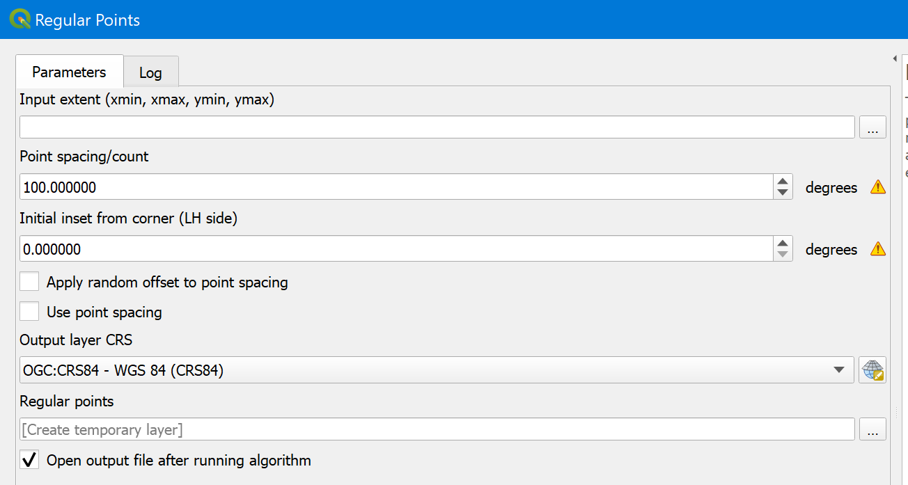

# Sample selection using QGIS

## 1 Background

In sampling design methods for estimation of area and map accuracy, we design a sample by choosing a selection protocol and determining the sample size and allocation. In this tutorial we will physically draw from a study area a sample that was designed based on tutorials here on OpenMRV under process "Sampling design". Drawing a sample involve creating a *sampling frame* which is a list of population units that can be selected for inclusion in a sample. The population units in the list are referred to as sampling units. In other words, a frame is a device that provides observational access to the population by associating the population units with the sampling units (Särndal et al., 1992, p. 9). In our case, the sampling frame is for example a list of all the pixels that make up the study area. We could, therefore, simply export a list of all map pixels with unique identifiers from which we randomly select *n* units. Under stratified random sampling (STR), each pixel would in addition to the identifier also have a stratum code such that a random sample are selected from each stratum. Such an approach can easily become impractical as the number of population units tend to be large. Instead, sample selection is supported by various tools and software -- here, we illustrate how to draw a sample in QGIS. 

## 2 Learning Objectives

Upon completion of the tutorial, the user should be able to sample an arbitrary study area under either systematic sampling (SYS), or simple random sampling (SRS) using QGIS.
* Draw a sample in QGIS under SYS or SRS

### 2.1 Pre-requisites

* Relevant terminology for sampling techniques can be found at the end of this document

## 3 Tutorial: Sample selection using QGIS

QGIS provides support for sampling populations defined by vector data. Hence, if you want to sample in strata that are defined by a raster, you will first need to vectorize the raster data. This is done Raster > Conversions > Polygonize (Raster to Vector). Vectorization for large rasters will take a long time and is not recommended; instead, use the alternatives below. For smaller study areas or for SYS and SRS designs, QGIS  works well -- let's go through the steps required to draw two samples under SRS and SYS from the country of Colombia.

### 3.1 Simple random sampling
1. We first need a shapefile that outlines our study area. Download a shapefile of the Colombia border here: https://drive.google.com/file/d/1tXvczTra_5wrlXBhe00m_oKRpLK0GwwJ/view?usp=sharing
2. Display the file in QGIS: Layer > Add Layer > Add Vector Layer and select the colombiaborder.shp to draw shapefile on the canvas. 
3. Vector > Research Tools > Random Points Inside Polygons
4. Specify the Colombia border as input layer, Points count as sampling strategy and the total sample size under Point count; leave min. distance "Save to a file and click Run to draw the sample.

### 3.2 Systematic sampling 
Drawing a sample under SYS in QGIS has the drawback that the population has to be rectangular which makes it harder to draw an exact number of units for a non-rectangular area. We can simply clip the sample units for the Colombia border but that will result in a smaller sample size than specified. A workaround is to set a distance between based on the size of the study area. For example, if the study area is *x* km^2^, setting a the spacing between units to x/100  would result in a sample of 100 units   
1. After having added the shapefile in section 3.1 steps 1 and 2 above, go to Vector > Research Tools > Regular Points
2. Select as input extent, the Colombia border shapefile
3. Specify a Point spacing or Point count -- if using the former, check the box "Use point spacing" 
4. Save to a file and click Run to draw the sample.

## 4 Frequently Asked Questions (FAQs)

**Must I use QGIS to select a sample?**

No, not at all! This is just one example and there many other ways to sample a study area. Common applications include AREA2, R, ENVI and ArcGIS. Here on OpenMRV under process "Sampling design" and tools "AREA2" and "GEE" you can learn how to select a sample using AREA2.

**Do I have to select pixels? What if I want to select segments or blocks of pixels?**

The spatial unit of the sample does not have to be a pixel but should be of equal size to satisfy the criteria of probability sampling. Pixels are used as units in this tutorial for the sake of simplicity. For an in-depth discussion of spatial units, see Stehman and Wickham (2011).

## 5 Terminology

A list of terms relevant to the sampling and inference techniques are provided in the AREA2 documentation: https://area2.readthedocs.io/en/latest/definitions.html Below are a few additional terms not included in the AREA2 documentation.

### 5.1 Response design
Defined by (Stehman and Czaplewski, 1998): “The reference or ‘true’ classification is obtained for each sampling unit based on interpreting aerial photography or videography, a ground visit, or a combination of these sources. The methods used to determine this reference classification are called the ‘response design.’ The response design includes procedures to collect information pertaining to the reference land-cover determination, and rules for assigning one or more reference [labels] to each sampling unit.” Referred to as “measurement plan” by Särndal et al. (1992).

### 5.2 Sample
A subset of population units selected from the population.

### 5.3 Sample design
Synonymous with sampling design, which is the preferred term in the seminal literature (Cochran, 1977, Särndal et al., 1992). The term occurs in Rice (1995) who uses both “sampling design” and “sample design”.

### 5.4 Sampling design
“The sampling design is the protocol by which the reference sample units are selected.” (Stehman and Czaplewski, 1998). “Sampling design” is also used by Cochran (1977) and Särndal et al. (1992) - the former also uses “sampling plan”.

### 5.5 Survey
Särndal et al. (1992) defines a survey as a “partial investigation of a finite population”, and further that “that the terms ‘survey’ and ‘sample survey’ are used to denote statistical investigations with the following methodological features: [...] probability sampling [...] measurement plan [and] estimation”

### 5.6 Survey design
A “total survey design” defines the procedures for “obtaining the possible precision in the survey estimates while striking a balance between sampling and non-sampling errors [...] The survey design gives rise to survey operations” such as sample selection (Särndal et al., 1992). Lohr (1999) describes a total survey design as “A philosophy of survey design for minimizing nonsampling as well as sampling errors.” Also, in Lohr (1999) “survey design” is synonymous with sampling design.

## 6 References

Cochran, W.G., 1977. Sampling Techniques, John Wiley & Sons, New York, NY.

Lohr, S.L., 1999. Sampling: Design And Analysis, CRC Press.

Rice, J.A., 1995. Mathematical Statistics and Data Analysis (2nd ed.), Duxbury Press, Belmont, CA.

Särndal, C.E., Svensson, B.H., & Wretman, J.H., 1992. Model assisted survey sampling, Springer Science & Business Media, New York, NY.

Stehman, S.V., & Czaplewski, R.L., 1998. Design and analysis for thematic map accuracy assessment: fundamental principles. Remote Sensing of Environment, 64(3), 331-344. https://doi.org/10.1016/S0034-4257(98)00010-8

Stehman, S.V. and Wickham, J.D., 2011. Pixels, blocks of pixels, and polygons: Choosing a spatial unit for thematic accuracy assessment. Remote Sensing of Environment, 115(12), pp.3044-3055. https://doi.org/10.1016/j.rse.2011.06.007

-----

  

This work is licensed under a [Creative Commons Attribution 3.0 IGO](https://creativecommons.org/licenses/by/3.0/igo/)

Copyright 2021, World Bank 

This work was developed by Pontus Olofsson under World Bank contract with GRH Consulting, LLC for the development of new -and collection of existing- Measurement, Reporting, and Verification related resources to support countries’ MRV implementation. 

Material reviewed by:   
Ana Mirian Villalobos, El Salvador, Ministry of Environment and Natural Resources  
Carole Andrianirina, Madagascar, National Coordination Bureau REDD+ (BNCCREDD)  
Foster Mensah, Ghana, Center for Remote Sensing and Geographic Information Services (CERGIS)  
Jennifer Juliana Escamilla Valdez, El Salvador, Ministry of Environment and Natural Resources   
Phoebe Oduor, Kenya, Regional Centre For Mapping Of Resources For Development (RCMRD)  
Rajesh Bahadur Thapa, Nepal, International Centre for Integrated Mountain Development (ICIMOD)  
Tatiana Nana, Cameroon, REDD+ Technical Secretariat  

Attribution  
Olofsson, P. 2021. Sample selection using QGIS. © World Bank. License:  [Creative Commons Attribution license (CC BY 3.0 IGO)](http://creativecommons.org/licenses/by/3.0/igo/) 

