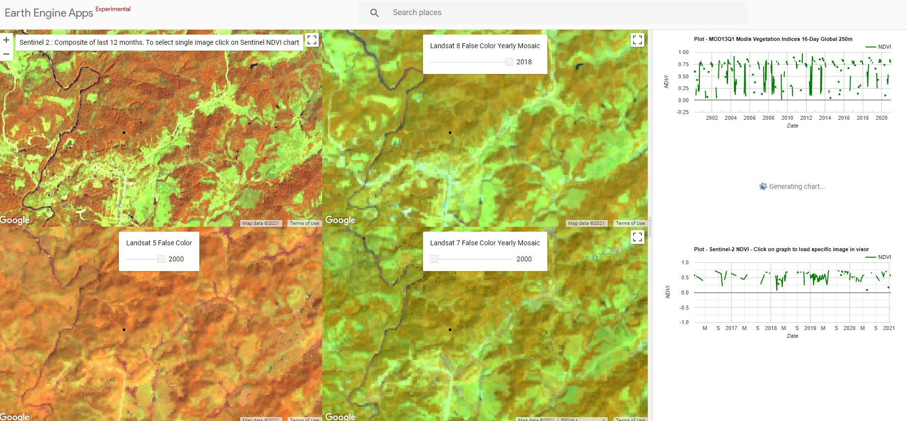
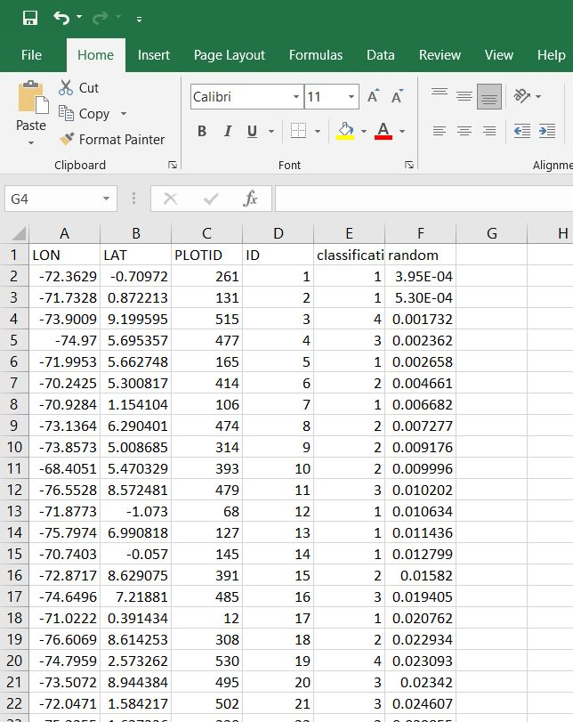
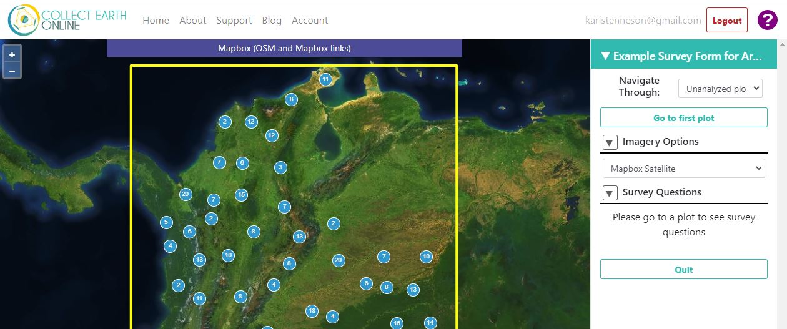
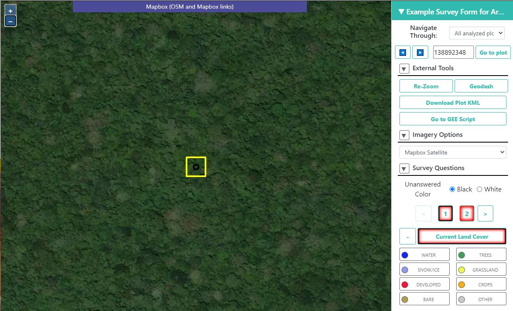
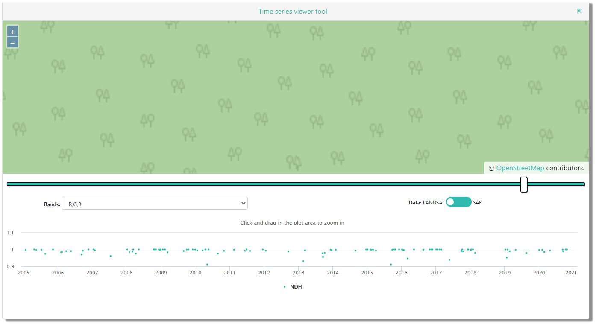
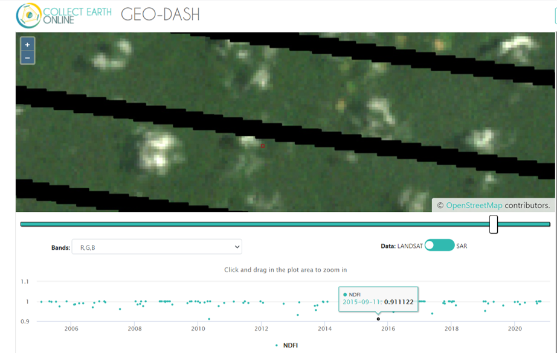

# Plan de réponse dans Collect Earth Online

## 1 Contexte

Les données de référence sont nécessaires pour calculer des estimations non biaisées de la superficie et de l'incertitude d'une carte. Les observations de référence sont généralement un ensemble de données labellisées, dérivées d'une carte d'activité (p. ex. par un échantillon aléatoire stratifié) et labellisées à l'aide d'imagerie ou de données de terrain. Cet ensemble est comparé aux strates cartographiques d'une carte d'activité pour estimer la précision de la carte et obtenir des estimations de surface non biaisées. Ce tutoriel montre comment recueillir des observations de référence avec des labels catégoriels pour générer des estimations de surface et d'incertitude non biaisées à l'aide de Collect Earth Online (CEO). Les utilisateurs doivent ajuster les différentes composantes en fonction des objectifs de leur projet. Le processus est présenté ici pour la Colombie et pour une simple légende de carte indiquant la présence ou l'absence de perte ou de dégradation de la forêt.  

### 1.1 Collect Earth Online

Collect Earth Online est un système de visualisation et d'interprétation d'images satellites personnalisé, à code source ouvert, qui permet de recueillir des données à utiliser dans le cadre de projets nécessitant des informations de référence sur la répartition et/ou l'utilisation des sols. Collect Earth Online favorise la cohérence dans la localisation, l'interprétation et la labellisation des échantillons utilisés pour la classification et le suivi de l'occupation et de l'utilisation des sols. Toutes les fonctionnalités de Collect Earth Online, y compris la compilation collaborative de bases de données de points de référence, sont mises en œuvre en ligne, de sorte qu'il n'est pas nécessaire de procéder à une installation sur ordinateur. 

### 1.2 Ouverture d'un compte Collect Earth Online

1. Dans la fenêtre de votre navigateur, accédez à  [CEO](https://collect.earth/). CEO est compatible avec Google Chrome, Mozilla Firefox et Microsoft Edge.
2. Cliquez sur [Connexion/Inscription] en haut à droite.
3. Pour créer un nouveau compte, cliquez sur [S'inscrire] et suivez les instructions. Vous recevrez un courriel de bienvenue si l'inscription est réussie.
4. Lorsque vous avez créé un compte, connectez-vous avec votre email et votre mot de passe.
5. Si vous oubliez votre mot de passe, cliquez sur [Mot de passe oublié ?] et suivez les instructions.

### 1.3 Ressources en ligne de Collect Earth

Vous pouvez accéder aux pages Accueil, À propos, Soutien et Compte à partir de la barre de menu supérieure.

* La page d'accueil contient des informations sur les institutions, les projets publiés et une carte indiquant l'emplacement des projets existants.
* La page À propos résume les informations sur CEO.
* La page Support présente les manuels et les didacticiels de Collect Earth Online, ainsi qu'une démo de Collect Earth Online. Cette page comprend également des liens pour signaler des bogues et des forums pour demander de l'aide.
* La page Compte contient des informations telles que des statistiques sur les utilisateurs et permet aux utilisateurs de mettre à jour les paramètres de leur compte.

* Il y a un ? violet dans le coin supérieur droit de l'écran. En cliquant dessus, vous ferez apparaître l'interface d'aide, qui fournit des informations sur les fonctionnalités de CEO. Ces interfaces d'aide sont disponibles pour la page d'accueil, pour la collecte de données et pour la création de projets.

## 2 Objectifs d'apprentissage 

À la fin de ce tutoriel, vous serez en mesure de rédiger, réviser et publier un projet dans Collect Earth Online. Cela comprend :

* La conception de relevés dans Collect Earth Online.

* Sélection de données images à visualiser pour l'interprétation des données.

* Collecte et exportation des observations de référence. 

### 2.1 Pré-requis 

*  La terminologie importante se trouve à la fin de ce document.
*  Compréhension générale de l'interprétation des images. L'interprétation d'images est le processus qui consiste à regarder des images à résolution spatiale moyenne, élevée ou très élevée (provenant de satellites ou de photographies aériennes) et à labelliser les objets d'intérêt dans vos lieux d'échantillonnage. L'interprétation d'images est la compétence de base nécessaire à la réalisation efficace de tout projet CEO. 
* Pour plus d'informations, veuillez consulter le manuel de création de projets et d'institutions de Collect Earth Online, disponible à l'adresse suivante [Pages d'assistance en ligne de Collect Earth](https://collect.earth/support). 

## 3 Tutoriel: Collect Earth Online

### 3.1 Configuration des sources des images dans Collect Earth Online

Un certain nombre de sources publiques d'imagerie sont accessibles à tous les utilisateurs de Collect Earth Online. Il s'agit notamment de Mapbox Satellite et des données de Planet mises à disposition en collaboration avec l'Initiative internationale sur le climat et les forêts de Norvège (Planet NICFI). Vous pouvez également ajouter vos propres flux d'imagerie supplémentaires (privés) sur votre page Institution. Nous vous recommandons d'ajouter Sentinel 1, Sentinel 2 et Bing, comme décrit ci-dessous. Toutes ces options sont disponibles gratuitement.

1. Allez sur la page de votre institution dans Collect Earth Online. Cliquez ensuite sur l'onglet Imagery. 

#### 3.1.1 Ajouter les données Sentinel 2 à la page de l'institution

Les données Sentinel 2 sont disponibles de juin 2015 à aujourd'hui. Après avoir configuré les paramètres à l'aide des instructions ci-dessous, les données Sentinel 2 seront acheminées par GEE dans CEO pour que vos utilisateurs puissent travailler avec. 

1. Cliquez sur "Add New Imagery".

2. Dans la première liste déroulante, sélectionnez 'Sentinel 2' comme Type. 

3. Titre : Ce sera le nom affiché de l'image. 

    Tapez 'Sentinel 2'.

4. Default Year (Année par défaut) : L'année par défaut qui sera affichée lors du chargement de la carte. 

    Saisissez 2020.

5. Mois par défaut : Le mois par défaut qui s'affichera au chargement de la carte. 

    Utilisez le format entier 1-12. Saisissez 1 pour charger le mois de janvier par défaut.

6. Combinaison de bandes : Sélectionnez l'une des options disponibles, notamment Vraie couleur, Fausses couleurs infrarouges, Fausses couleurs urbaines, Agriculture, Végétation saine et Infrarouge à ondes courtes. 

    Pour cet exercice, choisissez "Fausses couleurs infrarouges". Cet étirement permet de distinguer la terre/le pavé et végétation. Le rouge foncé correspond à la végétation, les rouges plus profonds correspondant à une végétation plus dense. La terre et le trottoir sont gris ou beige. 

7. Min : Valeur minimale des bandes qui seront mises à 0 pour la visualisation. Il doit s'agir d'un seul chiffre. Les valeurs acceptables pour le minimum de chaque bande sont les mêmes que dans le Geo-Dash et le GEE disponibles dans Sentinel en général ; voir [Lien information sur le le satellite Sentinel](https://developers.google.com/earthengine/datasets/catalog/sentinel).

    Pour cet exercice, choisissez 0.

8. Max : Valeur maximale des bandes qui sera mise en correspondance avec 255 pour la visualisation. Il doit s'agir d'un seul chiffre. Les valeurs acceptables pour le maximum de chaque bande sont les mêmes que celles de GeoDash et GEE disponibles sur Sentinel en général. Voir le lien ci-dessus. Par exemple, les valeurs de 2800-4000 sont fréquemment utilisées.

    Pour cet exercice, choisissez 3500. (Les unités sont des unités de réflectance  fois  10000)

9. Score de nuages : Couverture nuageuse autorisée. Les valeurs peuvent être de 0 à 100.

    Pour cet exercice, choisissez 20.

10. Si vous voulez ajouter cette source d'images à tous les projets de votre institution, cochez la case à côté de Add Imagery to All Projects When Saving. 

    Pour cet exercice, sélectionnez cette option.

11. Lorsque tous les champs sont remplis, cliquez sur [Add New Imagery].

    

#### 3.1.2 Ajouter les données Sentinel 1 à la page de l'institution

Les informations de Sentinel 1 ne sont disponibles que d'avril 2014 à aujourd'hui (lancement de Sentinel 1A). Après avoir configuré les paramètres à l'aide des instructions ci-dessous, les données Sentinel 1 seront acheminées par GEE dans CEO pour que vos utilisateurs puissent travailler avec. 

1. Retournez sur votre page institutionnelle. Sous l'onglet "Imagerie", cliquez sur "Add New Imagery".
2. Dans la première liste déroulante, sélectionnez 'Sentinel 1' comme Type. 
3. Titre : Ce sera le nom affiché de l'image. Tapez 'Sentinel 1'.
4. Default Year (Année par défaut) : L'année par défaut qui sera affichée lors du chargement de la carte. Saisissez "2020".
5. Mois par défaut : Le mois par défaut qui s'affichera au chargement de la carte. Utilisez le format entier 1-12. Saisissez "1" pour charger les images de janvier par défaut.
6. Combinaison de bandes : Combinaisons de bandes prédéfinies pour la plupart des utilisations. VH et VV sont à simple polarisation, VH/VV et HH/HV sont à double polarisation. Vous trouverez plus d'informations ici :[Guide de l'utilisateur de Sentinel 1, Mode d'acquisition](https://sentinel.esa.int/web/sentinel/user-guides/sentinel-1-sar/acquisition-modes).  Pour cet exercice, sélectionnez 'VH,VV, VH/VV'.
7. Min : Valeur minimale des bandes qui seront mises à 0 pour la visualisation. Il doit s'agir d'un seul chiffre. Les valeurs acceptables pour le minimum de chaque bande sont les mêmes que dans le Geo-Dash et le GEE disponibles généralement dans Sentinel ; voir [https://developers.google.com/earthengine/datasets/catalog/sentinel](https://developers.google.com/earthengine/datasets/catalog/sentinel). Min peut être aussi bas que -50, mais 0 est fréquemment utilisé. Pour cet exercice, sélectionnez '0'.
8. Max : Valeur maximale pour les bandes qui seront mappées à 255 pour la visualisation. Il doit s'agir d'un seul chiffre. Les valeurs acceptables pour le maximum de chaque bande sont les mêmes que dans le Geo-Dash et le GEE disponibles généralement dans Sentinel. Voir le lien ci-dessus. Max peut être aussi élevé que 1, mais .3 est fréquemment utilisé. Pour cet exercice, sélectionnez '0,4'. (Les unités sont les coefficients de rétrodiffusion gamma).
9. Si vous voulez ajouter cette source d'imagerie à tous les projets de votre institution, cochez la case à côté de Add Imagery to All Projects When Saving (Ajouter l'imagerie à tous les projets lors de l'enregistrement). Cochez cette case pour ajouter la source à tous les projets existants.
10. Lorsque tous les champs sont remplis, cliquez sur [Add New Imagery].

#### 3.1.3 Ajouter les images de Bing à la page de l'institution

Ceci vous permet d'ajouter Bing Maps avec votre propre clé API. L'imagerie fournie par Bing Maps est une imagerie satellite composite. Cela signifie que chaque tuile de carte est assemblée à partir d'images acquises à plusieurs dates. Il n'y a pas une seule date pour une tuile . Certaines tuiles de carte contiennent des images recueillies sur une fenêtre de plusieurs jours, tandis que d'autres tuiles contiennent des images recueillies sur une fenêtre de plusieurs années. Comme il n'y a pas de date unique pour une tuile d'imagerie, CEO ne peut pas fournir la date exacte de l'imagerie utilisée. Si vous souhaitez en savoir plus, l'API de Bing Maps est disponible ici : [Bing Imagery-metadata](https://docs.microsoft.com/en-us/bingmaps/restservices/imagery/imagery-metadata). 

Le système de tuiles Bing utilise la projection de Mercator et dispose de 23 niveaux de zoom (bien que tous les niveaux ne soient pas disponibles dans tous les endroits). En général, la
résolution au zoom maximum est d'environ 0,3 m par pixel. Pour plus d'informations, voir
[Bing maps tile system](https://docs.microsoft.com/en-us/bingmaps/articles/bing-maps-tile-system).

##### 3.1.3.1 Instructions pour demander une clé Bing maps :

1. Pour utiliser l'imagerie Bing Maps pour vos projets, vous pouvez créer votre propre clé Bing maps GRATUITE pour connecter les projets de votre institution à votre compte Bing Maps. Les instructions complètes pour la création d'une clé sont ici : [Obtenir une clé Bing maps](https://docs.microsoft.com/en-us/bingmaps/getting-started/bing-maps-devcenter-help/getting-a-bing-maps-key).

2.  Consultez [Bing Maps Portal](https://www.bingmapsportal.com/) pour demander une clé Bing ou copier votre clé existante.

a.  Connectez-vous. Vous avez besoin d'un compte Bing maps ou d'un compte Microsoft.
Visitez la page [Page du compte](https://docs.microsoft.com/en-us/bingmaps/getting-started/bing-maps-dev-centerhelp/creating-a-bing-maps-account).

b. Une fois que vous vous êtes connecté, cliquez sur Mon compte, puis sur Mes clés.

c. Si vous avez déjà une clé, cliquez sur Afficher la clé ou Copier la clé.

d. Si vous n'avez pas de clé, cliquez sur Cliquez ici pour créer une nouvelle clé.

e. Remplissez les informations. L'URL de l'application est facultative, mais si vous voulez la remplir, vous pouvez utiliser  https://collect.earth comme URL de votre application.

f. Vous allez créer une clé de base. Si vous avez besoin de plus d'images, vous devrez vous adresser à Microsoft et demander une [clé d'Entreprise](https://www.microsoft.com/en-us/maps/create-a-bingmaps-key#enterprise)

##### 3.1.3.2 Instructions pour connecter votre clé Bing maps dans Collect Earth Online :

1. Retournez à la page de votre institution. Ensuite, sous l'onglet Imagerie, cliquez sur " Add New Imagery ".
2. Dans la première liste déroulante, sélectionnez " Bing Maps " comme type. 
3. Titre : Il s'agit du nom affiché de l'image. Saisissez "Bing Maps".
4. Imagery Id : Seuls Aerial et AerialWithLabels sont actuellement mis en œuvre. Notez que l'imagerie AerialWithLables utilise l'ancien service de tuiles statiques, qui est déprécié, et les données actuelles ne seront pas rafraîchies. Elle peut donc contenir des images plus anciennes que le jeu de données Bing Aerial. Sélectionnez Aerial.
5. Token d'accès : Saisissez votre clé BingMaps. Pour plus d'informations ou pour obtenir votre propre clé, voir 2.3.1 ci-dessus.
6. Si vous souhaitez ajouter cette source d'images à tous les projets de votre institution, cochez la case située à côté de Ajouter l'imagerie à tous les projets lors de l'enregistrement.
7. Lorsque tous les champs sont remplis, cliquez sur [Add New Imagery].

#### 3.1.4 Flux d'images additionnelles

Veuillez consulter le manuel de création d'institutions et de projets de Collect Earth Online pour savoir comment ajouter des sources d'images supplémentaires, telles que des images provenant de Google Earth Engine. Le manuel est accessible ici : [Pages de soutien de Collect Earth Online](https://collect.earth/support).

### 3.2 Plan de réponse

#### 3.2.1 Vue d'ensemble

La conception d'un projet est un processus itératif, et vous aurez probablement besoin d'apporter de multiples modifications aux projets dans CEO au fur et à mesure que vous testez et affinez vos objectifs, vos schémas de classification de l'utilisation ou de l'occupation du sol, vos sources d'imagerie, etc. Ces modifications doivent être examinées et apportées à un projet avant que celui-ci ne soit publié. Cela signifie que vous pouvez idéalement passer un certain temps à piloter un projet, à collecter des données de test avec le questionnaire, et à le modifier pour l'adapter à toute erreur ou inefficacité que vous trouverez avant de publier le projet et de procéder à la collecte officielle des données.

En pratique, nous constatons que la création d'un projet pilote et la collecte de données pilotes sont incroyablement utiles pour recueillir des données de haute qualité. Le processus ressemble souvent à ceci :

1. Rédigez votre plan d'échantillonnage et vos questions en consultation avec les membres clés du projet.

2. Créez un projet pilote dans CEO en utilisant votre plan d'échantillonnage et les questions provisoires. 

3. Demandez aux membres clés de votre équipe de collecter des données à l'aide du projet pilote CEO.

4. Passez en revue les zones de confusion dans la formulation des questions et la configuration du projet CEO.

5. Examinez les points d'accord et de désaccord concernant l'identification de la couverture du sol. Par exemple, l'eau est peut-être facile à identifier pour tous les membres de l'équipe, mais les classes de forêt sont difficiles. 

6. Utilisez la discussion sur les points d'accord et de désaccord pour créer une clé de l'occupation du sol. Il s'agit d'un document qui contient des informations d'interprétation importantes sur les différentes classes de couverture du sol. Il comprend plusieurs images de chaque classe de couverture du sol ainsi que des descriptions de ce à quoi ressemble chaque classe. Le document aide les interprètes à identifier les classes de couverture du sol lors de la collecte des données et augmente l'accord entre les différents interprètes.

7. En utilisant le feedback du projet pilote, créer un ou plusieurs projets pour les interprètes afin de collecter les données " de production " ou " finales ". Toutes les données recueillies à partir d'échantillons interprétés avant la publication seront supprimées.

8. Collecter et analyser les données.

#### 3.2.2 Créer un nouveau projet

Pour commencer, ouvrez un navigateur Web et accédez à [Collect Earth Online](https://collect.earth/). Accédez à la page de votre institution.

1. Dans l'onglet Projets de votre page Institution, cliquez sur  [Create New Project]. Vous accédez alors à l'assistant de création de projet. L'assistant comprend 6 parties, chacune étant couverte par l'une des sections ci-dessous.

##### 3.2.2.1 Aperçu du projet: 

Cette section vous permet d'ajouter des informations générales sur le projet, notamment la sélection d'un template (facultatif), le nom du projet, la description du projet et les options du projet.

1. [Facultatif] Utiliser un template de projet : Cette fonction est utilisée pour copier toutes les informations - y compris les informations sur le projet, la zone et le plan d'échantillonnage - d'un projet publié existant vers un nouveau projet. Cette fonction est utile si vous avez un projet existant que vous souhaitez dupliquer pour une autre année ou un autre lieu, ou si vous êtes en train d'itérer dans la conception du projet. Pour un template, vous pouvez utiliser n'importe quel projet publié ou fermé disponible dans votre institution. Vous ne pouvez pas utiliser de projets supprimés. Vous ne pouvez pas utiliser le projet privé d'une autre institution (seuls les membres ou les administrateurs peuvent y accéder), mais vous pouvez utiliser le projet public d'une autre institution (tout visiteur du site Web ou utilisateur du CEO). Pour en savoir plus sur les paramètres de confidentialité des projets, voir la section Visibilité ci-dessous.

    Pour cet exercice, vous allez vous entraîner à concevoir votre propre projet à partir de zéro, donc sautez cette section, et laissez le champ Sélectionner le Template réglé sur Sélectionner le projet -. 

    Cependant, pour référence, des informations sur le travail avec un template sont incluses ci-dessous.

    i. Filtre de template (Nom ou ID) : Tapez un mot clé dans le nom d'un projet existant ou le numéro d'identification du projet. Vous pouvez trouver le numéro d'identification du projet en naviguant vers le projet que vous voulez copier et en regardant l'URL.

    ii.  Cliquez ensuite sur le menu déroulant sous Select Project et cliquez sur le nom du projet.

    

    iii. Cliquez sur le nom du projet, puis sur Load pour charger les informations du template.

    iv. Cliquez sur Clear pour effacer toutes les informations du templat

    v. Le chargement d'un template crée deux cases à cocher sous Copy Options, Copy Template Plots and Samples et Copy Template Widgets. Elles sont cochées par défaut.

    * Si la case Copy Template Plots and Samples est cochée, les sections Plot Review et Sample Design n'afficheront qu'un aperçu du nombre de parcelles, etc. Décochez cette case pour modifier ces paramètres.
    
    * Copy Template Widgets fait référence aux options de Geo-Dash couvertes dans la partie 3.2.2.8 : Configurer le GeoDash.

2. Saisissez le nom et la description du projet. Le nom doit être court et sera affiché sur la page d'accueil ainsi que sur la page de collecte de données du projet. 

    i. Pour cet exercice, nommez-le 'Example Project for Area Estimation'.

    **Conseils:**
    La description doit être courte mais informative. Les utilisateurs verront cette description s'ils cliquent sur l'épingle du projet sur la carte de la page d'accueil. Vous les verrez également lorsque vous administrerez votre projet. Remarque : si vous utilisez un template, le nom et la description sont automatiquement renseignés. Veillez à les modifier pour refléter votre nouveau projet.

3. Sélectionnez la Visibilité du projet. La case d'option Niveau de confidentialité permet de déterminer qui peut consulter votre projet, contribuer à la collecte de données et si les administrateurs de votre institution ou d'autres personnes créant de nouveaux projets peuvent utiliser votre projet comme modèle.

    * Public : Tous : Tous les utilisateurs peuvent voir et contribuer aux données de votre projet. Les administrateurs peuvent utiliser votre projet comme modèle.
    * Utilisateurs : Utilisateurs connectés : Tout utilisateur connecté à CEO peut voir et contribuer à votre projet. Les administrateurs peuvent utiliser votre projet comme modèle.
    * Institution : Membres du groupe : Les membres de votre institution peuvent voir et contribuer à votre projet. Les administrateurs d'autres institutions ne peuvent pas utiliser votre projet comme modèle.
    * Privé : Administrateurs du groupe : Seuls les administrateurs de votre institution peuvent voir et contribuer à votre projet. Les administrateurs d'autres institutions ne peuvent pas utiliser votre projet comme modèle.

    Pour cet exercice, sélectionnez Institution.

4. Sélectionnez les options du projet.

    i. La première option consiste à " Afficher le lien GEE Script sur la page de collecte ". Ceci permet aux utilisateurs de Data Collection de cliquer sur un bouton intitulé Go to GEE Script pour ouvrir un nouvel onglet avec une série d'images et de graphiques de séries temporelles Landsat et Sentinel (voir image ci-dessous). Pour cet exercice, sélectionnez cette option.

    

    Dans l'exemple d'image du script GEE, il y a trois panneaux. À l'extrême gauche, il y a un composite Sentinel 2 des 12 derniers mois. Elle est colorée à l'aide d'un composite de couleurs infrarouges (proche infrarouge, infrarouge moyen, rouge). Au centre se trouvent les mosaïques annuelles en couleur de Landsat 8 et Landsat 7, avec un curseur permettant de choisir entre les années. À droite, les graphiques NDVI de la parcelle provenant de MODIS, Landsat 7/8 et Sentinel 2. Pour les graphiques Landsat 7/8 et Sentinel, vous pouvez cliquer sur un point des graphiques pour charger des images spécifiques dans les panneaux de gauche et du centre.

    ii. La deuxième option consiste à " Afficher les colonnes supplémentaires du graphique sur la page de collecte ". Cela vous permet de sélectionner les informations présentes dans vos données d'emplacements d'échantillons (par exemple, csv ou fichier de forme). Des exemples courants d'informations supplémentaires que vous pourriez inclure dans votre échantillon sont l'élévation ou la juridiction (par exemple, l'état, la province, le district). Pour cet exercice, ne sélectionnez pas cette option.

    * Cette option n'est utile que si vous utilisez des fichiers .csv ou .shp pour définir votre plan de travail.

    *  Si vous avez des colonnes supplémentaires dans vos fichiers .csv ou .shp, telles que des informations sur l'altitude ou la classe de l'occupation du sol, les collecteurs de données seront en mesure de les voir sur la page de collecte des données sous Informations sur la placette.

    iii. La troisième option est 'Auto-launch Geo-Dash'. Le Geo-Dash est un autre onglet qui peut être conçu pour afficher des images et des graphiques de séries chronologiques supplémentaires. Cette option ouvre automatiquement l'interface Geo-Dash dans une nouvelle fenêtre ou un nouvel onglet lorsque le collecteur de données navigue vers une nouvelle parcelle. En décochant cette option, les collecteurs de données devront cliquer sur l'icône Geo-Dash sous Outils externes dans l'interface de collecte des données.

    Pour cet exercice, sélectionnez l'option de lancement automatique de Geo-Dash (**auto-launch Geo-Dash**)

5. Votre écran devrait ressembler à l'image ci-dessous. Cliquez sur Suivant pour accéder au panneau de sélection des images.

    

##### 3.2.2.2 Sélection des images

Dans le volet Imagery Selection (Sélection d'images), vous pouvez modifier les images de la carte de base par défaut et les cartes de base d'images qui sont disponibles pour les utilisateurs pendant la collecte des données.

1. La première option vous permet de spécifier l'imagerie par défaut que les utilisateurs voient lorsqu'ils commencent la collecte de données sur votre projet. Vos utilisateurs peuvent basculer entre toutes les couches images accessibles pendant la collecte des données. 

    Les options par défaut (publiques) que chacun peut choisir sont MapBox Satellite, Mapbox Satellite w/Labels et Planet NICFI Public. Vous pouvez également ajouter vos propres flux supplémentaires (privés) d'imagerie sur votre page Institution. Consultez le manuel de création d'institutions et de projets de Collect Earth Online pour savoir comment procéder. Vous pouvez y accéder ici : [Pages de soutien de Collect Earth Online] (https://collect.earth/support).

    Vous pouvez choisir n'importe quelle option d'imagerie disponible pour votre institution. Pour cet exercice, sélectionnez Mapbox Satellite. Remarquez, après avoir fait la sélection, que l'aperçu des images affichera la sélection actuelle.

    **Remarque** : si vous disposez d'une licence commerciale pour PlanetMonthly, PlanetDaily et SecureWatch, ils ne permettent pas d'extraire des données sur de grandes surfaces, et ne doivent donc pas être votre carte de base par défaut (les utilisateurs verront simplement une boîte blanche). Si vous souhaitez travailler avec ces flux, nous vous recommandons de définir une autre carte de base par défaut et de demander à vos collecteurs de données de passer à PlanetDaily une fois qu'ils ont zoomé sur un graphique à interpréter.

2. L'imagerie publique est l'imagerie qui est accessible à toutes les institutions. Si vous avez un projet public, tous les utilisateurs (y compris ceux qui ne sont pas connectés) peuvent voir ces images. Cochez la case située à côté de chaque source d'images que vous souhaitez rendre disponible pour votre projet. Pour cet exercice, sélectionnez tout.

3. Les données privées de l'établissement sont des données qui ne sont visibles que par les membres de l'établissement, même si vous avez défini votre projet comme étant “public.” 

    Cliquez sur la case à cocher à côté de chaque source d'images que vous souhaitez rendre disponible pour votre projet. Plus tôt dans l'exercice, vous avez configuré les cartes Sentinel 1, Sentinel 2 et Bing. Sélectionnez les trois. 

4. Cliquez sur " Next " (Suivant) lorsque vous avez terminé.

##### 3.2.2.3  Spécification de l'échantillon : Plan d'échantillonnage

Le système intégré de CEO permet aux utilisateurs de créer des plans d'échantillonnage en utilisant une interface facile à utiliser. Il y a deux parties clés, la sélection de l'AOI (Area of Interest) et la génération du plot.

##### Sélection de votre AOI

Ici, nous allons démontrer le processus en utilisant le même fichier csv fourni ci-dessus. Ceci définira la zone d'intérêt (AOI) pour le projet. CEO délimite la zone d'intérêt autour des emplacements des parcelles que vous téléchargez. Par conséquent, ne suivez pas les instructions suivantes pour dessiner manuellement la zone d'intérêt. 

Ces étapes sont incluses ci-dessous à titre de référence.

i. La façon la plus simple de sélectionner le périmètre d'intérêt de votre projet est de dessiner une boîte dans la fenêtre de la carte dans le panneau de droite (aperçu de la carte de la collection).

* Localisez votre zone d'intérêt en effectuant un zoom avant/arrière à l'aide de la molette de défilement de votre souris ou des cases + et - de la fenêtre de la carte. Vous pouvez faire un panoramique de la carte en cliquant dessus et en faisant glisser la fenêtre de la carte.

* Maintenez la touche CTRL (touche commande sur un Mac) enfoncée et dessinez une boîte tout en maintenant le bouton gauche de la souris enfoncé.

* Maintenez la touche SHIFT enfoncée et dessinez une boîte pour effectuer un zoom avant.

* Les cases de coordonnées se remplissent dès que la case est dessinée et que vous relâchez le bouton de la souris. Les coordonnées sont affichées en lat/long en utilisant WGS84 EPSG:4326.

ii. Vous pouvez également saisir manuellement vos coordonnées de délimitation dans les cases prévues à cet effet.

##### Conception du placette

Dans la section Conception des placettes, vous pouvez spécifier le type et le nombre de placettes. Pour cet exercice, nous utiliserons l'échantillon de sélection créé précédemment et exporté sous forme de csv. Il y a trois autres options pour localiser les placettes : aléatoirement, disposition en grille, et chargement d'un shapefile.

Pour cet exercice, suivez les instructions pour charger le csv fourni ci-dessus. Ensuite, passez les instructions suivantes pour travailler avec les options aléatoire, quadrillée ou shapefile. Ces étapes sont incluses ci-dessous pour votre référence future.

Notes supplémentaires sur le travail avec des fichiers spécifiés par l'utilisateur : En utilisant les fichiers .csv et .shp, le nombre maximum de parcelles est de 50 000 et la limite totale de points d'échantillonnage est de 350 000. Vous devez utiliser le format WGS84 EPSG:4326 pour les coordonnées dans les fichiers .csv et .shp.

Nous devons d'abord ajuster le formatage du fichier .csv. Le fichier que vous téléchargez pour spécifier les centres des parcelles doit avoir ces colonnes, dans cet ordre : LON, LAT, PLOTID. Nous allons démontrer le processus en utilisant un fichier de feuille de calcul existant généré ici sur OpenMRV dans le cadre du processus " Collecte de données d'échantillon ". Alternativement, vous pouvez utiliser votre propre ensemble de données d'échantillon.

i. Dans un logiciel de mise en forme de feuille de calcul comme Excel, ouvrez le fichier d'échantillon aléatoire stratifié

ii. Copiez et collez les colonnes de façon à ce que la première colonne contienne les coordonnées de longitude, suivies des coordonnées de latitude, puis de l'ID de la parcelle.

iii. Changez les noms des colonnes en : LON, LAT, PLOTID. Attention, ceci est sensible à la majuscule, donc assurez-vous d'utiliser des lettres majuscules.

iv. Supprimez la colonne appelée  '.geo'.

v. Sauvegardez les changements dans votre  .csv.

**Remarque** : si vous ne spécifiez pas correctement les noms des colonnes (orthographe ou ordre), vous obtiendrez l'erreur suivante :

La longitude doit être comprise entre -180 et 180, tandis que la latitude doit être comprise entre -90 et 90. Si vous les confondez, vous risquez d'obtenir une erreur si votre longitude est supérieure à 90 ou inférieure à -90 (lorsque cette valeur est confondue avec la latitude, elle se situe "au-dessus" du pôle). Vérifiez bien ces valeurs.

Nous allons maintenant télécharger ce fichier sur CEO.

1. Dans l'onglet Plot Design, sous Spatial Distribution, sélectionnez 'CSV file'.

2. Cliquer sur 'Télécharger le fichier de la parcelle'.

3. La forme du tracé peut être soit un cercle, soit un carré. Définir la forme du tracé comme étant un carré. 

4. Vous devrez spécifier le diamètre en mètres. Ces tailles doivent être déterminées par les besoins de votre projet. Pour cet exercice, saisissez 30 mètres pour correspondre à la résolution d'un pixel Landsat.

    Remarque : lorsque les parcelles sont petites, vos utilisateurs devront effectuer un zoom arrière important pour voir les images d'arrière-plan pertinentes, car CEO centre et zoome automatiquement sur les limites de la parcelle.

5. Cliquez sur "Next (Suivant)" lorsque vous avez terminé.

**Pour référence uniquement, des instructions sur la façon de travailler avec les autres options de conception de placettes**
* Dans CEO, vous pouvez spécifier une approche d'échantillonnage aléatoire ou quadrillée (systématique dans l'espace).
* Si vous sélectionnez Random, vous devrez fournir le nombre de placettes pour l'ensemble du projet.
* Si vous sélectionnez Gridded, vous devrez fournir l'espacement entre les centres des parcelles (en mètres).

**Remarque** : CEO fournira une estimation du nombre de placettes qui seront générées pour votre projet en fonction de votre plan d'échantillonnage. En utilisant l'échantillonnage de CEO, le nombre maximum de placettes pour un projet est de 5 000. Pour l'échantillonnage en grille, vous devrez peut-être augmenter l'espace entre les parcelles pour éviter de dépasser 5 000 parcelles.

##### 3.2.2.4 Spécifications de l'échantillon : Plan d'échantillonnage

C'est ici que vous indiquerez combien de points d'échantillonnage se trouvent dans chaque placette, et s'ils sont échantillonnés selon une approche de distribution aléatoire, en grille ou personnalisée.

1. Sous Distribution spatiale, vous pouvez sélectionner aléatoire, quadrillée, centrale, csv, shp ou aucune. Pour cet exercice, choisissez " Centre ". Avec Centre, un point d'échantillonnage sera placé au centre de la parcelle ; vous n'avez pas besoin de spécifier autre chose.
2. Pour n'importe laquelle de ces distributions spatiales, vous pouvez cliquer sur la case à cocher à côté de Autoriser les utilisateurs à tirer leurs propres échantillons pour activer l'échantillonnage proactif. L'échantillonnage proactif permet aux collecteurs de données de dessiner des points, des lignes et des polygones directement sur la carte afin de créer leurs propres échantillons. Le collecteur de données répond ensuite à des questions sur chaque forme. L'échantillonnage proactif est utile pour collecter des données d'entraînement afin de renseigner les modèles de forêt aléatoire et d'apprentissage automatique. 

    Pour cet exercice, ne cochez pas cette option.

    

3. Cliquez sur Next (Suivant).

**Pour référence uniquement, les instructions sur la façon de travailler avec les autres options de plan d'échantillonnage :**
* Avec l'échantillonnage aléatoire, les points d'échantillonnage seront distribués de façon aléatoire dans les limites de la placette. Vous devrez également spécifier le nombre d'échantillons par placette.
* Avec l'échantillonnage par grille, les points d'échantillonnage seront disposés sur une grille à l'intérieur des limites de la placette. Vous devrez spécifier la distance entre les points à l'intérieur de la placette sous Résolution de l'échantillon (m).
* En utilisant l'échantillonnage de CEO, le nombre maximum de points d'échantillonnage par placette est de 200.
* En utilisant l'échantillonnage de CEO, le nombre total maximum de points d'échantillonnage pour le projet (nombre de parcelles fois le nombre de points par parcelle) est de 50 000.
  Si vous avez besoin de plus de parcelles ou d'échantillons, veuillez créer votre plan d'échantillonnage dans un autre programme et le télécharger dans CEO en utilisant le format de fichier .csv ou .shp et les instructions de la section suivante.
* Avec Aucun, vous ne prédéfinirez aucun échantillon. Les utilisateurs devront donc dessiner leurs propres échantillons pendant la collecte.
* Veuillez consulter le [Manuel de création d'institutions et de projets de Collect Earth Online](https://collect.earth/support) pour savoir comment travailler avec des échantillons spécifiés dans un fichier csv ou shapefile. 

##### 3.2.2.5 Questions sur les cartes de notes

C'est ici que vous concevez les questions auxquelles vos collecteurs de données/interprètes photographiques répondront pour chacune de vos parcelles. Chaque question crée une colonne de données. À partir de ces données brutes, vous pouvez calculer des paramètres de surface, etc.

Les cartes de questions sont l'unité de base de l'organisation. Chaque carte crée une page de questions dans l'interface de collecte de données. Le flux de travail de base est le suivant : 

i. Créez une nouvelle question de haut niveau (new question card) et remplissez les réponses. 

ii. Créer toutes les questions et réponses secondaires. 

iii. Passez à la question de premier niveau suivante (new question card) et répétez l'opération jusqu'à ce que toutes les questions aient été posées.

Dans l'onglet Survey Question , le panneau de gauche vous permet de saisir les questions, tandis que le panneau de droite fournit un aperçu de la façon dont ces questions apparaîtront à vos collecteurs de données. Nous allons maintenant détailler comment ajouter une question et des réponses, les types de questions qui peuvent être posées et quand ces questions peuvent être utiles.

**Comment ajouter des questions et des réponses**

CEO offre un moyen simple de poser des questions à choix multiples. Comme c'est le type de question le plus communément utilisé, nous l'utiliserons pour cet exemple. Dans CEO, ces questions sont appelées questions "bouton-texte" car dans la collecte de données, elles s'affichent comme un bouton avec du texte.

Les questions de ce type sont utiles pour les inventaires de l'utilisation et de la couverture des sols, ou partout où vous voulez que l'utilisateur choisisse entre un ensemble limité d'options mutuellement exclusives.

1. Pour commencer, tapez votre première question dans la case **New Question**. Puisqu'il s'agit de votre première question, vous ne pouvez pas attribuer de question parent ou de réponse parent à cette question. Gardez le texte de la question en dessous de 45 caractères afin que la question entière soit affichée pendant la collecte des données.

    Pour cet exercice, tapez 'Current Land Cover'.

2. Cliquez sur  [Add Survey Question] pour créer votre première fiche de renseignements.

3. Vous pouvez maintenant ajouter des réponses à votre question. Les réponses comportent deux parties, une couleur et une zone de texte.

    i. Cliquez sur le [rectangle bleu] pour faire apparaître le sélecteur de couleur. Vous pouvez déplacer le point du sélecteur de couleur ou saisir des valeurs RVB (0-255). La couleur que vous choisissez sera associée à la réponse. Lorsqu'un collecteur de données sélectionne cette réponse, tous les points d'échantillonnage auxquels cette réponse est attribuée se verront également attribuer cette couleur pour l'affichage sur la carte. Pour la première réponse, choisissez le bleu car il sera associé à l'eau.

    ii. Tapez ensuite votre réponse dans la zone de texte. Essayez de taper des réponses d'environ 15 caractères ou moins afin que le nom complet soit affiché pendant la collecte des données. Tapez "WATER (EAU)".

    iii. Cliquez sur le symbole [+] vert pour ajouter la réponse.

    iv. Répétez ces étapes pour chacune des classes suivantes : SNOW/ICE, DEVELOPED, BARE, TREES, SHRUB, GRASSLAND, CROPS, and OTHER. Continuez à ajouter des réponses jusqu'à ce que toutes les réponses à votre question d'enquête aient été ajoutées.

4. Ensuite, nous allons demander s'il y a eu un changement. Dans le champ Nouvelle question situé en bas de l'écran, tapez "Un changement d'utilisation des terres a-t-il eu lieu ? Cliquez ensuite sur Ajouter une question d'enquête, en conservant comme paramètres par défaut le texte du bouton, l'absence de questions parentales ou de réponses parentales.

5. Ajoutez maintenant des réponses en utilisant l'approche décrite à l'étape 3 ci-dessus pour ajouter une option " No change " et une option " Change ".

6. Maintenant que vous avez des questions de haut niveau, ou questions parents, avec des réponses, vous pouvez ajouter des questions enfants et des questions enfants qui n'apparaissent que lorsque des réponses spécifiques sont choisies (ont des réponses parents). Les questions parent-enfant, en particulier les questions enfant qui ont des réponses parent, sont utiles lorsque vous avez des catégories générales et que vous voulez ensuite affiner la réponse dans cette catégorie. Vous pouvez poser des questions de suivi en fonction de la réponse d'un utilisateur pour affiner les informations sur le terrain. Par exemple, si un utilisateur qualifie une placette de forêt, vous pouvez lui demander s'il s'agit d'une forêt de feuillus ou de conifères.

    Pour cet exercice, nous allons ajouter une question pour enfant sur le changement d'année. 

    i. Tout d'abord, gardez le paramètre par défaut du Type de composant à bouton-texte.

    ii. Ensuite, pour créer une question enfant, à côté de Question parent, sélectionnez 'Did change occur' comme question parent.

    iii. Vous pouvez ensuite attribuer une réponse parent dans le menu déroulant. Lorsque cette réponse est choisie, la question enfant apparaît. Si vous ne souhaitez pas attribuer une réponse parent, définissez le champ Réponse parent sur n'importe laquelle. Sélectionnez  votre réponse " Change ".

    iv. Nous allons maintenant demander en quelle année le changement a lieu. Dans le champ Nouvelle question en bas de l'écran, tapez "Année du changement le plus récent, s'il a eu lieu". Cliquez ensuite sur Ajouter une question d'enquête, en conservant le texte du bouton comme paramètre par défaut.

    v. Ajoutez maintenant des réponses en utilisant l'approche décrite à l'étape 3 ci-dessus pour ajouter une réponse pour chaque année de 2009 à 2020.

7. Nous allons également ajouter une question enfant qui apparaît quelle que soit l'option choisie pour la question de modification.

    i. Nous allons ajouter une question de confiance. Dans le champ Nouvelle question en bas de l'écran, tapez 'Level of confidence (Niveau de confiance)'. Cliquez ensuite sur Add Survey question, en conservant le texte du bouton, en utilisant "Year of most recent change" comme question parentale et "Tout" comme réponse parentale.

    ii. Ajoutez maintenant les réponses " faible ", " moyen " et " élevé " comme options.

8. Nous allons maintenant ajouter une question sur l'occupation du sol précédente.

    i.  Dans l'espace Nouvelle Question en bas de l'écran, tapez 'Previous land cover'. Puis cliquez sur Add Survey question, en gardant le texte du bouton, en utilisant 'was there change' comme question parent, et 'Change' comme réponse parent.

    ii. Ajoutez maintenant des réponses à la nouvelle question enfant en utilisant l'approche décrite à l'étape 3 ci-dessus. Utilisez les mêmes catégories de l'occupation du sol que pour notre première question :  WATER, SNOW/ICE, DEVELOPED, BARE, TREES, SHRUB, GRASSLAND, CROPS, and OTHER. 

    

9. Vous pouvez répéter ce processus pour demander s'il y a eu un changement avant l'événement de changement le plus récent. Ajoutez jusqu'à trois options d'événement de changement.

10. Une fois que vous avez rédigé toutes les questions, vous pouvez les revoir en cliquant sur les numéros du panneau d'aperçu des questions, à droite de l'écran.

11. Lorsque vous êtes satisfait de la liste de questions, cliquez sur Suivant pour passer au Survey Rules panel (panneau Règles de l'enquête).

**Notes, conseils et astuces pour la création de questions dans CEO**

* Vous pouvez supprimer une question en cliquant sur le [X] rouge. La suppression d'une question parent avec des enfants supprimera également les questions enfants. 
* Vous pouvez réduire une carte de sondage en cliquant sur le symbole [-] en haut à gauche.
* Vous pouvez modifier l'ordre des cartes de questionnaire en cliquant sur les flèches bleues haut et bas en haut à droite.
* Essayez de garder votre question en dessous de 45 caractères.
* Autres options de type de composant : Les options de type de composant disponibles comprennent des combinaisons de quatre types de questions et de trois types de données. 

Les quatre types de questions sont :

* Bouton : Cela crée des boutons cliquables, permettant aux utilisateurs de sélectionner une réponse parmi plusieurs pour chaque point d'échantillonnage.
* Entrée : Permet aux utilisateurs de saisir des réponses dans la case prévue à cet effet. Le texte de réponse fourni par le créateur du projet devient la réponse par défaut.
* Radiobutton : Ceci crée des boutons radio, permettant aux utilisateurs de sélectionner une réponse parmi plusieurs pour chaque point d'échantillonnage.
* Liste déroulante : Permet aux utilisateurs de choisir dans une liste de réponses.

Les trois types de données autorisés sont :
* Booléen : Utilisez cette option lorsque vous avez deux options pour une question (oui/non).
* Texte : Utilisez cette option lorsque vous avez plusieurs options qui sont des chaînes de texte. Elles peuvent inclure des lettres, des chiffres ou des symboles.
* Nombre : Utilisez cette option lorsque vous avez plusieurs options qui sont des nombres, qui ne contiennent pas de lettres ou de symboles.

##### 3.2.2.6 Règles d'enquête

Les règles d'enquête permettent de s'assurer que les utilisateurs recueillent des réponses logiques et correctes. Si vous ne souhaitez pas ajouter de règles, vous pouvez simplement cliquer sur Suivant.

Pour cet exercice, nous n'ajouterons pas de règles d'enquête. Toutefois, si vous souhaitez en savoir plus sur ces options, veuillez consulter le [Manuel de création d'institutions et de projets de Collect Earth Online](https://collect.earth/support).

Ceci complète l'ensemble du projet. Cliquez sur [Review] dans le coin inférieur droit.

**Pour référence uniquement, les types de règles d'enquête :**

Les types de règles comprennent :
* Correspondance Regex texte : Cette règle s'applique uniquement aux questions de texte et à leurs réponses. Elle vous permet de vérifier si la valeur saisie correspond, en utilisant des expressions régulières. Cependant, à moins que vous n'ayez une raison spécifique d'utiliser le type de question Input-text, envisagez d'utiliser plutôt Button-text ou Radiobutton-text. Ces options sont plus faciles pour les utilisateurs et fourniront toujours un texte exact.
  Cette règle utilise la fonction JavaScript RegExp. Vous trouverez de la documentation sur l'écriture d'une expression régulière [ici](https://developer.mozilla.org/en-US/docs/Web/JavaScript/Guide/Regular_Expressions).
* Plage numérique : Cette règle s'applique aux questions à entrée numérique et à leurs réponses. Avec cette règle, vous pouvez vérifier que la saisie numérique se situe dans une plage prédéfinie. Par exemple, si vous demandez la proportion de points du graphique qui contiennent des arbres, vous pouvez contraindre les réponses entre 0 et 1.
* Somme des réponses : Cette règle s'applique à tout type de questions et à leurs réponses. Vous sélectionnez plusieurs questions (2 ou plus) et spécifiez la somme des questions. Par exemple, cette règle est utile si vous avez plusieurs questions sur le pourcentage de couverture du sol, où la somme doit être de 100 %.
* Faire correspondre les sommes : Cette règle s'applique à tout type de questions et à leurs réponses. Avec cette règle, vous spécifiez deux ensembles de questions multiples (2 ou plus) qui doivent avoir des sommes égales.
* Réponses incompatibles : Cette règle peut s'appliquer à tout type de question. Elle permet à l'utilisateur de définir des ensembles de réponses incompatibles. Par exemple, si la réponse à une question est couverture du sol = "Eau", la réponse à une autre question ne peut pas être utilisation du sol = "Industriel".

##### 3.2.2.7 Examen et publication du projet

1. Vous verrez maintenant un aperçu des détails de votre projet.

2. Faites défiler l'écran pour vérifier que tout est correct.

    i. Si tout est correct, cliquez sur Créer un projet.

    ii. Si vous notez une erreur, cliquez sur Continuer à éditer pour la corriger.

4. Après avoir cliqué sur Créer le projet, une fenêtre contextuelle vous demandera : "Voulez-vous VRAIMENT créer ce projet ?". 

5. Cliquez sur OK..

6. Après avoir créé le projet, vous serez amené au panneau d'informations sur le projet. Vous pouvez gérer votre projet à l'aide de ce menu.

##### 3.2.2.8  Configurer le GeoDash

Geo-Dash est un tableau de bord qui s'ouvre dans une deuxième fenêtre lorsque les utilisateurs commencent à analyser les placettes d'échantillonnage. GeoDash fournit aux utilisateurs des informations supplémentaires pour les aider à interpréter l'imagerie et à mieux classer les points d'échantillonnage et les parcelles. L'onglet Geo-Dash peut être personnalisé pour afficher des informations telles que les séries chronologiques NDVI, des images supplémentaires et des données d'élévation numériques.

1. Vous pouvez configurer votre tableau de bord géographique en cliquant sur [Configurer le tableau de bord géographique] à partir de la page Informations sur le projet / Révision du projet. L'écran de mise en page du Geo-Dash apparaît alors.

    

2. [Copier la mise en page] vous permet de copier le Geo-Dash d'un autre projet. Cela supprimera tous les autres widgets Geo-Dash que vous avez déjà associés à votre projet.t.

    

3. Vous pouvez ajouter des widgets Geo-Dash individuels en cliquant sur [Add Widget]. Pour savoir ce que font chacun des widgets, cliquez sur [Aide Geo-Dash] pour ouvrir le centre d'aide Geo-Dash

Pour cet exercice, nous n'ajouterons qu'un seul des nombreux widgets Geo-dash disponibles. Toutefois, si vous souhaitez en savoir plus sur ces options, veuillez consulter le [Manuel de création d'institutions et de projets de Collect Earth Online](https://collect.earth/support).

**Ajout d'images de ChronoSéquence au GeoDash, le widget de dégradation des forêts**

Le widget Dégradation fournit des séries chronologiques d'informations sur la dégradation des forêts due à l'exploitation sélective, aux incendies et à d'autres perturbations, grandes ou petites. L'indice de fractionnement de la différence normalisée (NDFI) permet de mieux détecter les dommages causés à la canopée des forêts par des sources multiples, notamment l'exploitation sélective et les incendies de forêt. Il est calculé avec la méthodologie trouvée dans Souza et. al. (2005).

1. Cliquez sur [Add Widget] dans la partie supérieure droite de l'écran de mise en page du Geo-Dash.

2. Sélectionnez Outil de dégradation dans la liste déroulante . 

3. Choisissez la source Basemap dans le menu déroulant. Il s'agira de la carte de base pour le widget et d'autres données seront superposées. Sélectionnez Mapbox Satellite.

4. Donnez un titre au widget. Tapez  'Time series viewer tool'.

5. Choisissez la bande à représenter graphiquement. Les options disponibles sont SWIR1, NIR, Red, Green Blue, SWIR2, and NDFI. NDFI permet d'améliorer la détection des dommages causés à la canopée des forêts par des sources multiples, y compris l'abattage sélectif et les feux de forêt. Sélectionnez NDFI.

6. Sélectionnez la plage de dates que vous souhaitez. Cet outil peut tirer des informations de Landsat 4 (juillet 1982 - décembre 1993), Landsat 5 (mars 1984 - janvier 2013), Landsat 7 (avril 1999 - actuel) et Landsat 8 (février 2013 - actuel) en fonction de la plage de dates que vous sélectionnez. Les informations Sentinel ne sont disponibles qu'à partir d'avril 2014 (lancement de Sentinel 1A). Sélectionnez une plage de dates allant du 01/01/2005 au 01/01/2020.

7. Cliquez sur Créer.

8. Repositionnez et redimensionnez à votre convenance. Cet outil comportera deux panneaux, veillez donc à lui donner suffisamment d'espace dans le sens vertical.

9. Les widgets peuvent être manipulés dans l'éditeur de disposition des widgets de Geo-Dash de plusieurs façons. Pour obtenir un fichier gif illustrant ces mouvements, consultez la [vidéo](https://collect.earth/geo-dash/geo-dash-help) et cliquez sur "Déplacer et redimensionner les widgets".

### 3.3  Collection de données

#### 3.3.1 Aperçu général

Les utilisateurs de votre équipe qui participeront à la collecte des observations de référence devront s'inscrire pour obtenir un compte Collect Earth Online. Les instructions pour ce faire se trouvent ci-dessous. En tant qu'administrateur de l'institution, vous devrez vous assurer que les membres de l'équipe ont été invités dans l'institution CEO de votre agence pour effectuer la collecte des données.

#### 3.3.2 L'écran d'analyse

Une fois que les membres ont été ajoutés à l'institution, vous pouvez partager avec eux le lien vers le projet. Vous pouvez aussi leur demander de naviguer sur la page de votre institution et de sélectionner le projet à partir de la page d'accueil de l'institution.

1. Une fois dans la page de collecte des données du projet, vous pouvez accéder à l'aide pour l'écran d'analyse à tout moment en cliquant sur le **?** violet dans le coin supérieur droit de l'écran. La fonction d'aide vous indiquera les caractéristiques importantes de la page de collecte des données.

    

2. Tout d'abord, assurez-vous de cliquer sur le bouton [Go to first plot] dans le coin supérieur droit.

    * Pour certains projets, une deuxième page ou un deuxième onglet s'ouvre automatiquement lorsque vous accédez à votre première parcelle. Il s'agit de l'interface Geo-Dash. De nombreux éléments différents peuvent être affichés sur cette interface, en fonction de ce que l'institution a configuré. Cliquez sur l'onglet à gauche pour revenir à la page de collecte des données. 

3. Se familiariser avec l'écran d'analyse. La fenêtre de la carte se trouve à gauche :

    *  Votre placette-échantillon apparaîtra sous la forme d'un cercle ou d'un carré jaune dans la fenêtre de la carte. La forme de l'échantillon dépend de la façon dont le projet a été conçu.
    * Chaque point échantillon est identifié par un cercle noir jusqu'à ce qu'une étiquette lui soit attribuée. Vous pouvez changer la couleur des points échantillon non attribués de noir à blanc en sélectionnant le radio-bouton de couleur correspondant à côté de "Unanswered Color" sur le panneau de droite.
    * Vous pouvez effectuer un zoom avant et arrière en utilisant les boutons bleus + et - dans le coin supérieur gauche de la fenêtre de la carte, ou en faisant défiler la molette de votre souris.
    * Des informations sur la source des images sont affichées en haut de l'écran.

4. Sur le côté droit se trouvent toutes les options de navigation, image et questionnaire.

5. Les options de navigation sont incluses dans un menu déroulant. Cela vous permet de choisir entre :

    * Unanalyzed Plots : l'option par défaut. Cette option vous permet de collecter des données sur des parcelles non analysées pour contribuer à votre projet.
    
    * My analyzed plots : revoir vos parcelles précédemment analysées. Cette option vous permettra de corriger les erreurs, etc. pour les parcelles analysées précédemment.

    * All analyzed plots : Cette option n'est disponible que pour les administrateurs de l'institution. Si vous êtes un administrateur, vous pouvez examiner les parcelles analysées par n'importe quel utilisateur.

6. Sous ce menu déroulant se trouve le numéro d'identification de la parcelle. A côté de l'ID de la parcelle se trouvent des boutons bleus pour avancer et reculer. Ceux-ci peuvent être utilisés pour naviguer vers différentes parcelles, ainsi qu'une zone de texte où vous pouvez saisir un numéro d'identification de parcelle et cliquer sur [Go to plot] pour naviguer vers une parcelle spécifique. 

7.  Les options des outils externes comprennent les éléments suivants :

    * Cliquez sur [Re-Zoom] pour revenir au point central du tracé.
    
    * Cliquez sur [Geodash] pour ouvrir le volet Geo-Dash avec des informations supplémentaires sur la parcelle.

    * Vous pouvez cliquer sur [Download Plot KML] pour télécharger un fichier KML contenant les informations du plot. Le téléchargement du fichier KML vous permet de transférer les informations de la placette vers un autre programme, tel que Google Earth, pour accéder à l'imagerie historique qui y est disponible. Il est important de noter que la fonctionnalité KML permet aux utilisateurs de déterminer les coordonnées (latitude et longitude) auxquelles sont situés les points d'intérêt.

    * Le bouton [Go to GEE Script] peut être présent ou non sur votre tableau de bord, cela dépend de la façon dont l'administrateur du projet a configuré les détails du projet. S'il est présent, il vous mènera à un site Web de Earth Engine Apps affichant des données supplémentaires sur la parcelle.

8. Options d'imagerie : En utilisant le menu déroulant sous Options d'imagerie, vous pouvez modifier l'image de fond en choisissant entre différentes images dans la liste déroulante. Les différentes images sont utiles pour comparer différents points dans le temps et/ou lorsqu'une source d'imagerie n'offre pas suffisamment de détails pour répondre aux questions de l'enquête. Certaines options d'imagerie incluent également les noms des villes, des villages, etc. 

9. Questions d'enquête : Cette zone permet de répondre aux questions d'enquête du projet.

    * Chaque projet a un ensemble différent de questions d'enquête numérotées (dans l'exemple ci-dessous, seule la question "1" est dans le projet).

    * Vous pouvez naviguer entre les questions en utilisant les flèches avant et arrière ou les numéros.

    * Le radio-bouton Couleur sans réponse change la couleur des points de l'enquête.

    * Le bouton Enregistrer permet de sauvegarder vos réponses et de passer au point suivant (il ne devient actif que lorsque tous les points ont été interprétés).

    * Flag Plot est utilisé lorsqu'il n'est pas possible de répondre à une question de l'enquête, soit parce que l'imagerie n'est pas d'assez bonne qualité, soit parce qu'il y a un autre problème ; cela permet de passer au point suivant.

    * Effacer tout efface toutes les réponses aux questions de l'enquête pour cette parcelle.

    * Quitter vous ramène à la page d'accueil de CEO.

10. La fenêtre pop-up Geo-Dash s'ouvrira également avec des informations sur la parcelle si elle a été configurée pour le projet. Cette fenêtre contient des informations permettant d'identifier les attributs de couverture et d'utilisation du sol compilés à partir de Google Earth Engine. Selon le projet, Geo-Dash peut inclure des graphes de données de séries chronologiques (comme la façon dont les valeurs NDVI ont varié dans le temps), des images Landsat, et plus encore.

#### 3.3.3 Analyser les graphiques

1. Il est maintenant temps de contribuer au projet.

2. Lisez la première question de l'enquête et les réponses possibles. Elle demande quelle est la couverture actuelle du sol. Pour le déterminer, faites un zoom arrière sur la parcelle jusqu'à ce que l'imagerie devienne plus claire. Le fait de dézoomer vous aidera à recueillir des indices contextuels sur le paysage.

    

3. Utilisez le menu déroulant Options d'imagerie pour charger les sources d'images disponibles et déterminer quelle est la couverture du sol actuelle. 

4. Dans l'exemple ci-dessus, il s'agit d'arbres. Pour répondre à la première question, vous pouvez simplement cliquer sur la réponse - TREES - sans avoir à sélectionner le(s) point(s) dans la placette.

    * Dans cet exemple de projet, nous n'avons qu'un seul point d'échantillonnage par placette, mais il est possible dans CEO d'inclure plusieurs échantillons par placette dans la phase de conception du projet. Si vous travaillez sur un projet avec plusieurs échantillons, vous pouvez attribuer des classes ou des réponses différentes aux points de la parcelle en sélectionnant d'abord vos points échantillons. Lorsque les points d'échantillonnage sont sélectionnés, ils deviennent bleus.

    * Pour sélectionner un seul point de prélèvement, cliquez dessus avec le bouton gauche de la souris. 

    * Pour sélectionner plusieurs points d'échantillonnage, cliquez dessus tout en maintenant la touche Shift enfoncée.

    * Pour sélectionner tous les points de l'échantillon ou tous les points d'un rectangle, maintenez la touche Ctrl enfoncée, puis cliquez, maintenez et faites glisser dans la fenêtre de la carte pour dessiner votre rectangle.

    * Lorsque les points de votre échantillon sont marqués en bleu, vous pouvez leur attribuer une valeur d'échantillon en cliquant sur la valeur appropriée dans la légende à droite de la fenêtre de la carte. Les points d'échantillonnage sont alors marqués dans la couleur de la classe de valeur. 

    * Si vous faites une erreur et attribuez une mauvaise valeur à un ou plusieurs points, vous pouvez re-sélectionner les points et changer la "réponse".

    

5. Sélectionnez ensuite la deuxième question de l'enquête en cliquant sur "2" ou en appuyant sur la flèche de droite. Cette question demande s'il y a eu un changement dans la couverture du sol, en quelle année il s'est produit. S'il y a eu plus d'un changement, cela indique que vous devez enregistrer l'année du changement le plus récent. 

    

6. Pour déterminer le passé du paysage de cette placette, il est utile d'examiner les données dans Google Earth Pro, dans le script GEE et dans l'onglet GeoDash. Tout d'abord, ouvrez l'onglet GeoDash (il s'agit probablement de l'onglet situé immédiatement à droite de l'onglet de collecte des données. Vous devrez peut-être cliquer sur le bouton Geodash si l'onglet n'est pas encore ouvert.

7. Cliquez sur Download Plot KML pour télécharger un fichier .kml à visualiser dans Google Earth. Google Earth dispose de plusieurs sources de données images actuelles et historiques qui peuvent vous aider à identifier une parcelle. Vous devez avoir installé Google Earth Pro sur votre ordinateur. Vous pouvez soit cliquer sur le fichier .kml téléchargé pour l'ouvrir dans Google Earth, soit importer manuellement le fichier dans Google Earth. Ensuite, cliquez sur le curseur de la série chronologique pour basculer entre les images disponibles pour différentes dates.

8. Dans cet exercice, la page GeoDash a été configurée avec un simple outil de visualisation des séries chronologiques. Il s'agit d'un graphique de séries chronologiques des valeurs mensuelles (NDFI) de janvier 2005 à janvier 2020 calculées à partir des collections d'images Landsat. Observez les changements brusques et graduels dans le graphique de la série chronologique de l'indice NDFI, illustré dans le panneau inférieur. N'oubliez pas d'examiner le graphique de la série chronologique à la recherche de tout modèle cyclique (indiquant des changements saisonniers) avant d'évaluer les valeurs inattendues. Ces schémas saisonniers sont présents dans les forêts à feuillus, mais n'indiquent pas un changement de la couverture du sol. Recherchez les changements abrupts (généralement de fortes diminutions) ou les changements graduels (généralement des augmentations graduelles). Ils indiquent des événements potentiels de dégradation et de restauration.

    

9. Si vous identifiez ce qui ressemble à un changement par rapport à la valeur attendue, vous pouvez cliquer sur un point du graphique pour charger cette image Landsat dans la fenêtre de la carte. Cliquez sur une date individuelle (cercle bleu) sur le graphique afin de faire apparaître l'imagerie pour cette période. Il se peut que vous deviez attendre que l'image se charge.

    * Par exemple, dans l'image ci-dessous, il y a quelques points avec une faible valeur NDFI par rapport à la majorité des valeurs sur la période. Par exemple, dans l'image ci-dessous, il y a un creux dans les valeurs NDFI le 9 novembre 2015. Si vous cliquez sur le point de l'image avant le creux, vous voyez que le paysage semble boisé. Si vous cliquez ensuite sur le point avec une faible valeur (le 9-11-2015), l'image se charge et le paysage semble toujours boisé. Cependant, il y a un bord de nuage qui chevauche le tracé. Dans cet exemple, il semble que le changement dans la série chronologique soit dû au bruit atmosphérique plutôt qu'aux changements de la couverture du sol. Après avoir cliqué sur toutes les valeurs basses de l'indice NDFI et examiné l'image Landsat associée, il apparaît que ces baisses sont toutes dues à la couverture nuageuse à cet endroit de la parcelle. Par conséquent, pour cette placette, à la question 2, nous choisissons " No Change ".

    

    

    * Lorsque vous cliquez sur des points dans le graphique, les images mettent parfois un moment à se charger.

    * Note: dans l'outil de visualisation des séries chronologiques, le panneau supérieur est le panneau des images. Les images s'affichent ici sur les données OpenStreetMap lorsque vous sélectionnez une date spécifique dans le panneau inférieur. La barre coulissante vous permet de choisir l'opacité de vos images. Sous Combinaison de bandes, 321 correspond à une combinaison de couleurs vraies (R,G,B) et 543 correspond à une combinaison de fausses couleurs (SWIR, NIR, R). En utilisant le bouton Data, vous pouvez choisir entre les données Landsat ou SAR.

    * Note: dans l'outil d'affichage des séries temporelles, le panneau inférieur présente un graphique de série temporelle du NDFI (le plus courant) ou d'une autre métrique. Les valeurs de NDFI entre -1 et 0 indiquent généralement des zones qui ont été exploitées (et brûlées, très probablement). Les valeurs de l'indice NDFI proches de +1 indiquent une forêt intacte. Chaque point représente une période de temps mensuelle pour laquelle il existe des données pour votre placette échantillon.

    * Une forte diminution de l'indice NDFI (souvent accompagnée d'une restauration progressive) peut indiquer une exploitation forestière sélective. Le panneau de gauche montre le paysage avant, celui de droite après. Nous pouvons voir que sur notre placette d'échantillonnage, une route a été créée. Il s'agirait d'une dégradation même autour de 2009 avec une restauration durant 2-3 ans.

    

10. Cliquez entre les différentes dates sur et autour de votre événement suspect pour confirmer visuellement qu'un événement s'est produit. Si un événement s'est produit, indiquez l'année où il s'est produit. S'il n'y a eu aucun changement, sélectionnez " No Changes ". 

11. Si un événement s'est produit, après avoir indiqué l'année de l'activité, une deuxième question apparaîtra en dessous de la question sur l'année de changement de la couverture du sol. Cette nouvelle question porte sur la couverture du sol précédente. Examinez les images Landsat avant le changement et déterminez quelle était la couverture du sol précédente. Sélectionnez ensuite cette réponse dans le panneau des Survey Question

12. Lorsque vous avez attribué une valeur à toutes les questions de l'enquête, cliquez sur SAVE (SAUVEGARDER).

    * Vous recevrez un message d'erreur si vous n'avez pas répondu à toutes les questions.

13.  Le prochain graphe à analyser s'affiche automatiquement.

14.  A tout moment, vous pouvez sauter un graphe pour une analyse ultérieure en cliquant sur la [Flèche du graphe suivant] dans l'onglet Navigation du graphe. Vous pouvez également cliquer sur la [Previous Plot Arrow] pour revenir au tracé précédent. Vous pouvez cliquer sur [Flag Plot] si les images sont insuffisantes (manquantes, basse résolution, etc.) pour étiqueter avec précision les attributs de la parcelle. Le système rechargera automatiquement le graphe suivant pour votre projet.
    * L'option Flag Plot supprime tous les attributs qui ont été assignés aux points/placettes.
    * En utilisant l'option Naviguer à travers l'ensemble de Mes parcelles analysées, vous pouvez retourner à la parcelle marquée et essayer de répondre aux questions à nouveau. Le bouton de marquage de la parcelle sera désactivé car la parcelle a déjà été marquée et vous ne pouvez pas la marquer à nouveau.
    * Vos réponses seront enregistrées, et la parcelle ne sera plus marquée si vous cliquez sur Enregistrer.
    * Les courbes peuvent être soit marquées, soit sauvegardées par un utilisateur, mais pas les deux.
    * Parfois, les graphiques sont difficiles à interpréter, même avec une bonne qualité d'imagerie ! Ces parcelles ne peuvent être classées de manière fiable et précise qu'en ayant une connaissance des systèmes agricoles locaux, des types de végétation locaux et des modèles de paysage. Essayez d'utiliser les environs de la parcelle pour glaner le plus d'informations possible avant de faire une estimation. Si vous ne vous sentez pas à l'aise pour interpréter le graphique, vous pouvez cliquer sur [Flag Plot].

15. ISi vous cliquez sur le nom du projet, vous verrez apparaître le nombre et le pourcentage de tracés réalisés, le nombre et le pourcentage de tracés marqués comme mauvais, et le nombre total de tracés. Un score de précision basé sur les données de training du projet sera bientôt disponible.

16. Lorsque toutes les placettes sont classées, une fenêtre pop-up apparaît pour vous informer que toutes les placettes échantillons de votre projet sont analysées.

#### Conseils pour l'interprétation des images

* Des problèmes de saisonnalité peuvent survenir lorsque différentes utilisations du sol semblent différentes selon les saisons. Par exemple, une prairie peut être d'un vert vif au printemps, mais paraître brune en été. Si vous ne voyez que l'image brune, vous pourriez penser que le brun est de la terre et classer à tort la prairie comme de la terre stérile.
* Le zoom avant et arrière pour recueillir des indices contextuels du paysage est important pour plusieurs types d'utilisation et de couverture du sol. Par exemple :
  - L'eau des grands plans d'eau apparaît souvent noire ou sombre jusqu'à ce que vous fassiez un zoom arrière.
  - Les plantations d'arbres peuvent ressembler à des forêts naturelles jusqu'à ce que vous fassiez un zoom arrière pour voir le motif régulier des arbres plantés.

### 3.4 Exportation des données

1. Lorsque vous avez collecté toutes les données de votre projet, retournez à la page de votre institution.

2. À côté de votre projet, vous trouverez deux options de téléchargement de données : Télécharger les données des parcelles, qui permet de télécharger vos données brutes , Le téléchargement des données de parcelles est indiqué par un P et le téléchargement des données d'échantillons est indiqué par un S. Les deux sont téléchargés au format .csv, qui peut être ouvert dans des programmes tels que Microsoft Excel ou importé dans un logiciel d'analyse de données. 

3. Les données téléchargées depuis CEO seront au format WGS84 EPSG:4326.

4. Téléchargez et sauvegardez les données de l'échantillon.

Vous pouvez utiliser ces données téléchargées dans d'autres tutoriels ici sur OpenMRV sous le processus " Estimation de la superficie / Évaluation de la précision " pour effectuer des estimations de la superficie et une évaluation de la précision.

## 4 Foire aux questions

**Quand devrais-je utiliser CEO ?**

Utilisez CEO si vous avez plusieurs personnes qui collectent les données (CEO), et si vous voulez une configuration plus facile pour les questions de votre enquête (CEO).

**Où puis-je trouver de l'aide dans CEO ?**

There is a purple ? in the top right corner of the screen. Clicking on this will bring up the help interface, which provides information about CEO's features. These help interfaces are available for theIl y a un symbole ?  violet dans le coin supérieur droit de l'écran. En cliquant dessus, vous ferez apparaître l'interface d'aide, qui fournit des informations sur les fonctionnalités de CEO. Ces interfaces d'aide sont disponibles pour la page d'accueil, pour la collecte de données et pour la création de projets.

**Quand devrais-je utiliser un modèle de projet?**

Cette fonction est utilisée pour copier toutes les informations - y compris les informations sur le projet, la zone et le plan d'échantillonnage - d'un projet publié existant vers un nouveau projet. C'est utile si vous avez un projet existant que vous voulez dupliquer pour une autre année ou un autre lieu, ou si vous itérez dans la conception du projet.

**Que dois-je mettre dans la description du projet ?**

La description doit être brève mais informative. Les utilisateurs la verront lorsqu'ils cliqueront sur l'épingle du projet sur la carte de la page d'accueil. Vous verrez également ceci lorsque vous administrerez votre projet.

**Il y a quelque chose à garder à l'esprit pour les sources payantes de données images?**

Si vous disposez d'une licence commerciale pour PlanetMonthly, PlanetDaily et SecureWatch, ils ne permettent pas d'extraire des données sur de grandes surfaces, et ne doivent donc pas être votre carte de base par défaut (les utilisateurs verront simplement une boîte blanche). Si vous souhaitez travailler avec ces flux, nous vous conseillons de définir une autre carte de base par défaut et de demander à vos collecteurs de données de basculer sur PlanetDaily une fois qu'ils ont zoomé sur un graphique pour l'interpréter.

**Combien de parcelles et d'échantillons sont autorisés avec les fichiers .csv et .shp ?**

Avec les fichiers .csv et .shp, le nombre maximum de parcelles est de 50 000 et la limite totale de points d'échantillonnage est de 350 000. Vous devez utiliser le format WGS84 EPSG:4326 pour les coordonnées dans les fichiers .csv et .shp.

**Combien de parcelles et d'échantillons sont autorisés pour les projets générés par CEO ?**

CEO fournira une estimation du nombre de parcelles qui seront générées pour votre projet en fonction de votre plan d'échantillonnage. En utilisant l'échantillonnage de CEO, le nombre maximum de parcelles pour un projet est de 5 000. Pour l'échantillonnage en grille, vous devrez peut-être augmenter l'espace entre les parcelles pour éviter de dépasser 5 000 parcelles.

**Quels sont les astuces pour créer des questions d'enquête?**

Voici quelques astuces :

- Vous pouvez supprimer une question en cliquant sur le [X] rouge. Si vous supprimez une question parentale avec des enfants, les questions des enfants seront également supprimées.
- Vous pouvez réduire une carte de sondage en cliquant sur le symbole [-] en haut à gauche.
- Vous pouvez modifier l'ordre des cartes de sondage en cliquant sur les flèches bleues haut et bas en haut à droite.
- Essayez de limiter votre question à 45 caractères.

**Où puis-je trouver plus d'informations sur le programme CEO et la création de projets CEO ?**

Veuillez consulter le  [Manuel de création de projets et d'institutions de Collect Earth Online](https://collect.earth/support).

## 5 Terminologie relative aux techniques d'échantillonnage

Une liste de termes relatifs aux techniques d'échantillonnage et d'inférence est fournie dans la documentation d'AREA2 : https://area2.readthedocs.io/en/latest/definitions.html Vous trouverez ci-dessous quelques termes supplémentaires qui ne figurent pas dans la documentation d'AREA2.

### 5.1 Plan de réponse

Défini par (Stehman and Czaplewski, 1998): “La référence ou classe réelle est obtenue pour chaque unité d'échantillonnage sur la base de l'interprétation de photographies aériennes ou de vidéographies, d'une observation au sol ou d'une combinaison de ces sources. Les méthodes utilisées pour déterminer cette référence de classification sont appelées "plan de réponse". Le plan d'intervention comprend les procédures de collecte des informations relatives à la détermination de la occupation du sol de référence, et les règles d'attribution d'une ou plusieurs [labels] de référence à chaque unité d'échantillonnage.” Connu sous le nom de “plan de mesure” par Särndal et al. (1992).

### 5.2 Echantillon

Un sous-ensemble de la population sélectionné parmi les unités de la population.

### 5.3 Plan d'échantillonnage

Synonyme de plan d'échantillonnage (Sampling Design), qui est le terme préféré dans la littérature de référence (Cochran, 1977, Särndal et al., 1992). Le terme apparaît chez Rice (1995) ui utilise à la fois “plan d'echantillonnage” et “plan d'echantillon”.

### 5.4 Plan d'échantillonnage

“Le concept de plan d'échantillonnage (sampling design ) est le protocole par lequel les unités de référence de l'échantillon sont sélectionnées” (Stehman and Czaplewski, 1998). Le terme “Sampling design” est également utilisé par Cochran (1977) and Särndal et al. (1992) -- Le premier utilise également “sampling plan”.

### 5.5 Sondage/Enquêtee

Särndal et al. (1992) définissent une enquête comme une “investigation partielle d'une population finie”, et précisent que “les concepts d ‘enquête’ et ‘enquête par sondage’ sont utilisés pour désigner des enquêtes statistiques présentant les caractéristiques méthodologiques suivantes: [...] échantillonnage aléatoire [...] plan de mesure [et] estimation”. de facon plus precise une enquete par sondage ou un sondage est une enquête effectuee sur une partie de la population. Cette fraction de la population constitue l'échantillon et les méthodes qui permettent de construire cet echantillon s'appellent méthode d'échantillonnage.

### 5.6 Plan d'enquête

UN “plan de sondage total” définit les procédures pour “obtenir la plus grande précision possible dans les estimations de l'enquête tout en trouvant un équilibre entre les erreurs d'échantillonnage et les erreurs non dues à l'échantillonnage [...] Le plan de sondage donne lieu à des opérations d'enquête” sélection de l'échantillon (Särndal et al., 1992). Lohr (1999) décrit un plan de sondage total comme “Une philosophie de conception d'enquête visant à minimiser les erreurs de non-échantillonnage ainsi que les erreurs d'échantillonnage..” De plus, dans Lohr (1999) “plan d'enquête” est synonyme de plan d'échantillonnage.

### 5.7 Données de référence

Données caractérisant l'évaluation la plus précise possible de la condition réelle à l'emplacement de l'échantillon (exemple : imagerie satellite à haute résolution).

### 5.8 Les observations de référence 

L'évaluation la plus exacte possible de l'état réel d'une unité de population.

### 5.9 Références classification 

La classification de référence appliquée à la collection de toutes les unités d'échantillonnage.

## 6 Références

Cochran, W.G., 1977. *Sampling Techniques*, John Wiley & Sons, New York, NY.

Lohr, S.L., 1999. *Sampling: Design And Analysis,* CRC Press.

Olofsson, P., Foody, G.M., Herold, M., Stehman, S.V., Woodcock, C.E. and Wulder, M.A., 2014. Good practices for estimating area and assessing accuracy of land change. Remote Sensing of Environment, 148, pp.42-57. https://doi.org/10.1016/j.rse.2014.02.015

Rice, J.A., 1995. *Mathematical Statistics and Data Analysis* (2nd ed.), Duxbury Press, Belmont, CA.

Särndal, C.E., Svensson, B.H., & Wretman, J.H., 1992. *Model assisted survey sampling*, Springer Science & Business Media, New York, NY.

Souza Jr, C.M., Roberts, D.A. and Cochrane, M.A., 2005. Combining spectral and spatial information to map canopy damage from selective logging and forest fires. *Remote Sensing of Environment*, *98*(2-3), pp.329-343. https://doi.org/10.1016/j.rse.2005.07.013

Stehman, S.V., & Czaplewski, R.L., 1998. Design and analysis for thematic map accuracy assessment: fundamental principles. *Remote Sensing of Environment*, 64(3), 331-344. https://doi.org/10.1016/S0034-4257(98)00010-8

-----

  

Ce travail est sous licence [Creative Commons Attribution 3.0 IGO](https://creativecommons.org/licenses/by/3.0/igo/) 

Copyright 2021, World Bank 

Ce travail a été développé par Karis Tenneson et Karen Dyson dans le cadre d'un contrat de la Banque mondiale avec GRH Consulting, LLC pour le développement de nouvelles ressources - et la collecte de ressources existantes - liées à la mesure, la notification et la vérification pour soutenir la mise en œuvre du MRV dans les pays. 

Matériel revu par :     
Ana Mirian Villalobos, El Salvador, Ministry of Environment and Natural Resources
Carole Andrianirina, Madagascar, National Coordination Bureau REDD+ (BNCCREDD)
Jennifer Juliana Escamilla Valdez, El Salvador, Ministry of Environment and Natural Resources
Tatiana Nana, Cameroon, REDD+ Technical Secretariat

Attribution     
Tenneson, K., Dyson, K. 2021. Response Design in Collect Earth Online. © World Bank. License:  [Creative Commons Attribution license (CC BY 3.0 IGO)](http://creativecommons.org/licenses/by/3.0/igo/)  

