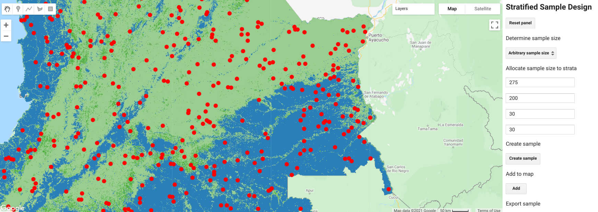

# Selección de muestras usando AREA2

## 1 Contexto

En el tutorial anterior, diseñamos una muestra eligiendo un protocolo de selección y determinando el tamaño y la asignación de la muestra. En los métodos de diseño de muestreo para la estimación del área y la precisión del mapa, diseñamos una muestra eligiendo un protocolo de selección y determinando el tamaño y la asignación de la muestra. En este tutorial sacaremos físicamente de un área de estudio una muestra que fue diseñada en base a tutoriales aquí en OpenMRV bajo el proceso "Diseño de muestreo". La extracción de una muestra implica la creación de un *marco de muestreo* que es una lista de unidades de población que se pueden seleccionar para su inclusión en una muestra. Las unidades de población de la lista se denominan unidades de muestreo. En otras palabras, un marco es un dispositivo que proporciona acceso de observación a la población al asociar las unidades de población con las unidades de muestreo (Särndal et al., 1992, p. 9) [^ fn1]. En nuestro caso, el marco de muestreo es, por ejemplo, una lista de todos los píxeles que componen el área de estudio. Por lo tanto, podríamos simplemente exportar una lista de todos los píxeles del mapa con identificadores únicos de los que seleccionamos aleatoriamente *n* unidades. En un muestreo aleatorio estratificado, cada píxel, además del identificador, también tendría un código de estrato de modo que se seleccione una muestra aleatoria de cada estrato. Este enfoque puede resultar fácilmente impráctico ya que el número de unidades de población tiende a ser grande. En cambio, la selección de muestras es compatible con varias herramientas y software; aquí, ilustramos cómo dibujar una muestra.

## 2 Objetivos de Aprendizaje

Una vez finalizado el tutorial, el usuario debería poder muestrear un área de estudio arbitraria con un muestreo aleatorio estratificado (STR) utilizando AREA2.

- Dibujar una muestra en GEE / AREA2 bajo STR

### 2.1 Prerrequisitos

- La terminología relevante para las técnicas de muestreo se puede encontrar al final de este documento.

## 3 Tutorial: Selección de muestras usando AREA2

Dibujaremos una muestra usando un diseño aleatorio estratificado en Google Earth Engine/AREA2. 

#### 3.1 Muestreo aleatorio estratificado en Google Earth Engine/AREA2

Basándonos en los tutoriales aquí sobre OpenMRV en el proceso "Diseño de muestreo", donde teníamos amortiguadores de bosques, no forestales, disturbios forestales, y disturbios forestales como estratos, supongamos un tamaño de muestra necesario para alcanzar un margen de error del 25% del área de perturbación forestal. estimar. También asignamos la muestra en estratos con el propósito de estimar el área. Luego usaremos el siguiente tamaño de muestra:

|      | A             | B         | C            | D               | E                   | F     |
| ---- | ------------- | --------- | ------------ | --------------- | ------------------- | ----- |
| 1    | Estrato (*h*) | Bosque(1) | No-bosque(2) | Dist. Bosq. (3) | Amortiguamiento (4) | Total |
| 11   | *nh* (final)  | 275       | 200          | 30              | 30                  | 535   |

Para seleccionar una muestra, vamos a usar AREA2 para seleccionar una muestra usando muestreo aleatorio estratificado: [https://code.earthengine.google.com/48294a6892696c57eda3f65d2ea95a0e](https://code.earthengine.google.com/48294a6892696c57eda3f65d2ea95a0e).

Especifiquemos una ruta al mapa de Colombia, usado en un tutorial aqui en OpenMRV bajo la herramienta "CODED": (https://code.earthengine.google.com/?asset=users/olofsson76/Open_MRV/Open_MRV_Col_strat_buffer) con un amortiguamiento bajo "Specify stratification/image to define study area" (especificar estratificación/imagen para definir área de estudio); usemos los otros argumentos automáticos y hagamos clic en "Load image" lo cual visualizará áreas de estratos en la Consola (NOTA: esto tomará tiempo). Seleccione "Arbitrary sample size" (Tamaño de muestra arbitrario) bajo "Determine sample size", y en la opción "Allocate sample size to strata" (Asignar tamaño de muestra a estratos), especifique lo siguiente: 275, 200, 30, 30. Haga clic en "Create sample" (Crear muestra), y note que solo debe hacer clic una vez. Aunque parece que GEE no reacciona, esta dibujando la muestra después de su clic.

Hacerle clic a "Add to map" (Agregar al mapa) visualizará las unidades de muestra como puntos rojos en el mapa. El paso final es exportar la muestra: haga clic en pestaña Tasks (Tareas), y luego exporte la muestra en el Dialog – dos entradas nombradas “sample_asset” y "sample_CSV" pueden aparecer en tareas. Estas son idénticas pero una es para exportar la muestra como un archivo CSV, una para guardar como asset de GEE Asset para uso en Google Earth Engine. Haga clic en el botón "Run" junto a las entradas y guárdelas como un asset de GEE y CSV (el ultimo se guardará en su Google Drive). Use el nombre “STR_sample_Col” para el asset de GEE y el archivo CSV.

## 4 Preguntas Frecuentes

**¿Debo usar AREA2 para seleccionar una muestra?**

¡No, en absoluto! Este es solo un ejemplo y hay muchas otras formas de muestrear un área de estudio. Las aplicaciones comunes incluyen R, ENVI y ArcGIS.

**¿Tengo que seleccionar píxeles? ¿Qué pasa si quiero seleccionar segmentos o bloques de píxeles?**

La unidad espacial de la muestra no tiene que ser un píxel, pero debe tener el mismo tamaño para satisfacer los criterios del muestreo probabilístico. Los píxeles se utilizan como unidades en este tutorial en aras de la simplicidad. Para un análisis en profundidad de las unidades espaciales, consulte Stehman y Wickham (2011).

## 5 Terminología relevante para las técnicas de muestreo

Una lista de términos relevantes para las técnicas de muestreo e inferencia esta provista en la documentación de AREA2: https://area2.readthedocs.io/en/latest/definitions.html. Abajo hay algunos términos adicionales que no están incluidos en la documentación.

### 5.1 Diseño de Respuesta

Definido por Stehman and Czaplewski, 1998[^fn1]: “La referencia o clasificación 'verdadera' se obtiene para cada unidad de muestreo en función de la interpretación de fotografías aéreas o videografías, una visita terrestre o una combinación de estas fuentes. Los métodos utilizados para determinar esta clasificación de referencia se denominan "diseño de respuesta". El diseño de respuesta incluye procedimientos para recopilar información relacionada con la determinación de la cobertura terrestre de referencia y reglas para asignar una o más [etiquetas] de referencia a cada unidad de muestreo ". Conocido como "plan de medición" por Särndal et al. (1992)[^fn2].

### 5.2 Muestra

Un subconjunto de unidades de población seleccionadas de la población.

### 5.3 Diseño de Muestra

Sinónimo de diseño de muestreo, que es el término preferido en la literatura fundamental (Cochran, 1977 [^ fn3], Särndal et al., 1992 [^ fn2]). El término aparece en Rice (1995) [^ fn4] que utiliza tanto "diseño de muestreo" como "diseño de muestra".

### 5.4 Diseño de Muestreo

"El diseño de muestreo es el protocolo mediante el cual se seleccionan las unidades de muestra de referencia". (Stehman y Czaplewski, 1998) [^ fn1]. El “diseño de muestreo” también es utilizado por Cochran (1977) [^ fn3] y Särndal et al. (1992) [^ fn2]- el primero también usa "plan de muestreo".

### 5.5 Encuesta

Särndal y col. (1992) [^ fn2] define una encuesta como una “investigación parcial de una población finita”, y además que “los términos 'encuesta' y 'encuesta por muestreo' se utilizan para denotar investigaciones estadísticas con las siguientes características metodológicas: [. ..] plan de medición [...] de muestreo probabilístico [y] estimación."

### 5.6 Diseño de Encuesta

Un "diseño total de la encuesta" define los procedimientos para "obtener la posible precisión en las estimaciones de la encuesta mientras se logra un equilibrio entre los errores de muestreo y los no muestrales [...] El diseño de la encuesta da lugar a operaciones de encuesta" como la selección de la muestra (Särndal et al., 1992) [^ fn2]. Lohr (1999) [^ fn5] describe un diseño de encuesta total como "Una filosofía de diseño de encuesta para minimizar los errores de muestreo y de no muestreo". Además, en Lohr (1999) “diseño de encuestas” es sinónimo de diseño de muestreo.

## Referencias

Cochran, W.G., 1977. Sampling Techniques, John Wiley & Sons, New York, NY.

Lohr, S.L., 1999. Sampling: Design And Analysis, CRC Press.

Rice, J.A., 1995. Mathematical Statistics and Data Analysis (2nd ed.), Duxbury Press, Belmont, CA.

Särndal, C.E., Svensson, B.H., & Wretman, J.H., 1992. Model assisted survey sampling, Springer Science & Business Media, New York, NY.

Stehman, S.V., & Czaplewski, R.L., 1998. Design and analysis for thematic map accuracy assessment: fundamental principles. Remote Sensing of Environment, 64(3), 331-344. https://doi.org/10.1016/S0034-4257(98)00010-8

Stehman, S.V. and Wickham, J.D., 2011. Pixels, blocks of pixels, and polygons: Choosing a spatial unit for thematic accuracy assessment. Remote Sensing of Environment, 115(12), pp.3044-3055. https://doi.org/10.1016/j.rse.2011.06.007

-----

  

Este trabajo tiene licencia bajo un [Creative Commons Attribution 3.0 IGO](https://creativecommons.org/licenses/by/3.0/igo/)

Copyright 2021, World Bank.

Este trabajo fue desarrollado por Pontus Olofsson bajo contrato del World Bank con GRH Consulting, LLC para el desarrollo de recursos nuevos o existentes relacionadas a la Medida, Reportaje, y Verificación para el apoyo de implementación MRV en varios países.

Material revisado por: 
Ana Mirian Villalobos, El Salvador, Ministry of Environment and Natural Resources  
Carole Andrianirina, Madagascar, National Coordination Bureau REDD+ (BNCCREDD)  
Foster Mensah, Ghana, Center for Remote Sensing and Geographic Information Services (CERGIS)  
Jennifer Juliana Escamilla Valdez, El Salvador, Ministry of Environment and Natural Resources   
Phoebe Oduor, Kenya, Regional Centre For Mapping Of Resources For Development (RCMRD)  
Rajesh Bahadur Thapa, Nepal, International Centre for Integrated Mountain Development (ICIMOD)  
Tatiana Nana, Cameroon, REDD+ Technical Secretariat 

Atribución: Olofsson, P. 2021. Sample selection using AREA2. © World Bank. License: [Creative Commons Attribution license (CC BY 3.0 IGO)](http://creativecommons.org/licenses/by/3.0/igo/)

