# Diseño de Respuesta en Collect Earth Desktop

## 1 Contexto

### 1.1 Collect

Collect es la herramienta usada para manejar datos y crear encuestas. Provee una manera fácil y flexible de configurar una encuesta con un interfaz de usuario amigable. Collect puede manejar múltiples tipos de datos y reglas de validación complejas, todo en un entorno multilingüe. Esta aplicación es completamente gratuita. 

### 1.2 Collect Earth

Collect Earth es una herramienta que permite la recopilación de datos a través de Google Earth. Los usuarios pueden analizar imágenes satelitales de alta y muy alta resolución para una amplia variedad de propósitos. Los datos recopilados a través de Collect Earth se pueden exportar a formatos de uso común y también se pueden exportar a Saiku, una herramienta que facilita el análisis de datos.

Se han configurado varias versiones del software Collect Earth que son específicas a un país, así como versiones coherentes con las principales directrices internacionales (por ejemplo, IPCC, Evaluación de los recursos forestales de la Organización de las Naciones Unidas para la Agricultura y la Alimentación, etc.). 

### 1.3 Collect Earth vs. Collect Earth Online

Collect Earth Desktop (CE) y Collect Earth Online (CEO) son dos herramientas para la recopilación de datos utilizando imágenes satelitales de alta y muy alta resolución. Comparten muchas características comunes, con algunas diferencias importantes. La aplicación que quiera utilizar dependerá de sus preferencias y de su situación específica. Algunas consideraciones (y programas recomendados) incluyen: si tendrá múltiples recolectores de datos (CEO), si desea trabajar sin conexión (CE), si desea una configuración más fácil para las preguntas de la encuesta (CEO) y si necesita más opciones para exportación de datos que .csv (CE).

**CE**

*Colección de Datos*

- Colección de datos completado en Google Earth, con opciones de datos de browser de GEE, Bing, Planet, etc.

*Configuración de Proyecto* 

- Usar la aplicación Collect; tiene una curva de aprendizaje mas pronunciada

*Manejo de Datos*

- Usar aplicación Collect, los datos están almacenados en desktop o en una configuración de server, y un manejador de datos es requerido para recopilar archivos individuales de múltiples usuarios. Datos guardados para tramas, no están disponibles en ubicaciones de muestra. Hay varias opciones para el formato de datos, especialmente para su exportación. 

**CEO**

*Colección de Datos*

- Etiquetados en línea, en un navegador de internet. Puede ver los datos en Google Earth si lo tiene instalado. Tiene las mismas opciones para ver datos, y el usuario puede recopilar opciones adicionales (e.g., wms feeds, etc)

*Configuración de Proyecto* 

- Opciones de diseño de muestras, aunque CEO generará tramas automáticamente para algunos diseños de muestreo
- Funciones de diseño de encuesta son similares (jerarquía, reglas condicionales, etc.)
- Está en el navegador, con un asistente interactivo nuevo y fácil de usar

*Manejo de Datos*

- Todos los datos están almacenados en la nube en una base de datos. Múltiples usuarios pueden colectar información en el mismo proyecto simultáneamente. Usuarios pueden exportar datos recopilados para una trama o una muestra. En este momento, hay pocas opciones para el formato de datos, pero es compatible con la herramienta de análisis en SEPAL.

### 1.4 Resumen

El proceso para crear una encuesta en Recopilar y recopilar datos con Collect Earth Desktop se detalla en los pasos a continuación. El proceso se puede describir generalmente como:
1. Insertar parámetros y crear la estructura de la encuesta en Collect Survey Designer
2. Generar una cuadrícula para el lugar donde desea recopilar los datos e insartarla en Collect Survey Designer
3. Exportar la encuesta (archivo .cep) de Collect Survey Designer y abrirla en Collect Earth Desktop
4. Recopilar los datos en Collect Earth Desktop

## 2 Objetivos de Aprendizaje

En este tutorial aprenderá como:

*   Descargar e instalar Collect y Collect Earth Desktop
*   Construir una encuesta en Collect
*   [opcional] Generar una cuadricula de muestreo a través de Google Earth Engine
*   Importar una cuadricula de muestreo a Collect
*   Exportar una encuesta finalizada de Collect 
*   Importar la encuesta creada en Collect a Collect Earth Desktop
*   Colectar datos usando Collect Earth
*   Exportar tus datos colectados

El diseño de un proyecto es un proceso iterativo y probablemente necesitará realizar varias ediciones en los proyectos en Collect y Collect Earth a medida que refina sus objetivos, los esquemas de clasificación de la cobertura terrestre, las fuentes de imágenes, etc. Estos cambios se le pueden hacer a un proyecto antes de que se publique. Esto significa que puede crear un proyecto y recopilar datos de prueba dentro de él, y editar cualquier error que encuentre antes de publicar el proyecto.

### 2.1 Prerrequisitos

* Un entendimiento general de la interpretación de imágenes. La interpretación de imágenes es el proceso de mirar imágenes de resolución espacial moderada, alta, o muy alta (de satélites o fotografía aérea) y etiquetar los objetos de interés en sus ubicaciones de muestra. Interpretación de imágenes es la habilidad clave para efectivamente ejecutar cualquier proyecto de Collect Earth desktop. 
* La terminologia relevante se puede encontrar al final de este documento.

## 3 Tutorial: Collect Earth Desktop

### 3.1 Descargar e instalar Collect 

El primer paso es descargar “Collect” del sitio de OpenForis ([http://openforis.org/](http://openforis.org/)).

Navegar a [http://www.openforis.org/tools/collect.html](http://www.openforis.org/tools/collect.html). Aquí puede descargar la aplicación “Collect” si hace clic en “Download last version” y seleccionar la versión correcta. Descargue e instale Collect a su computadora. Si necesita, por favor vea la ayuda de instalación disponible en [http://www.openforis.org/tools/collect/tutorials/installation.html](http://www.openforis.org/tools/collect/tutorials/installation.html).

Una vez que la aplicación de “Collect” esta instalada, encuentre la aplicación en su explorador de archivos y haga clic en “Open Foris Collect” para empezar la aplicación. 

La ventana del Panel de Control de OpenForis Collect Control Panel se abrirá y necesitara estar abierta durante todo el tiempo que este usando Collect.  

La ventana del Panel de Control de OpenForis Collect Control Panel se abrirá antes que el navegador con la interfaz de Collect se abre. La ventana del Panel de Control le dirá que Collect esta activo.

Después de algunos minutos, un navegador nuevo se abrirá automáticamente en la interfaz de Collect. 

### 3.2 Crear una encuesta

En esta sección, demostraremos cómo crear una encuesta y modificarla para que se adapte a sus necesidades y se adapte al tipo de datos que está tratando de recopilar.

*NOTA: También hay videos de YouTube disponibles que demuestran cómo crear encuestas para el escritorio Collect Earth que se pueden encontrar aquí:* [https://www.youtube.com/channel/UCxu8NZPvPxGBjBp0g6LCV4w](https://www.youtube.com/channel/UCxu8NZPvPxGBjBp0g6LCV4w).

Navegue al Diseñador de Encuestas (“Survey Designer”) a mano izquierda de la pantalla y haga clic en “New Survey” (Nueva Encuesta).  

Hay cuatro campos que deberá completar para crear una nueva encuesta. Primero, proporcione un título para su encuesta, por ejemplo: "training_survey". Su título debe ser todo en minúsculas sin espacios; la herramienta convertirá automáticamente mayúsculas a minúsculas y espacios a guiones bajos (_). 

El campo "Template" (Plantilla) tiene cuatro opciones: Blank (En blanco), Biophysical (Biofísico), Collect Earth, y Collect Earth + IPCC. Blank creará una nueva encuesta sin que usted complete la información. Las otras tres opciones crearán una nueva encuesta con cierta información ya completa en función de la opción de plantilla que elija. Elija la opción "Collect Earth".

Finalmente, escoja su idioma preferido y para su grupo de usuario (User Group), escoja "Default Public Group" (Grupo Publico Predeterminado). Haga clic en “New”.

A continuación, se le llevará al editor de encuestas (Edit survey). Hay tres pestañas en la parte superior de la página: Información, Code Lists (Listas de códigos), y Schema (Esquema). También hay un menú desplegable para cambiar el idioma de la Encuesta y el menú desplegable del icono de Configuración con funcionalidad de importación y exportación.

En la parte inferior de cada pantalla hay un botón Guardar. Guarde sus cambios con frecuencia para evitar perder el progreso.

Si su sesión se agota o si cierra la ventana accidentalmente, puede volver a la ventana Editar encuesta haciendo clic en Diseñador de encuestas -> Lista de encuestas -> haga clic en el nombre de su encuesta -> Editar encuesta.

#### 3.2.1 Agregar información de encuesta

En la pestaña de Información, puede editar los detalles de la Encuesta. Agregue un nombre de proyecto y descripción si quiere (por ejemplo "Encuesta de entrenamiento ubicada en Colombia"). 

No cambiaremos las versiones de formas, sistemas de referencia Espacial, o agregaremos unidades para este ejercicio. 

Collect Earth - Los controles de Plot Layout controlan el tamaño de la trama y el numero de muestras para cada trama. Dejaremos el área de trama como 1 ha (automático)  y cambiaremos los puntos de muestra dentro de cada trama a 3 x 3. 

Collect Earth - Otras configuraciones le permiten abrir fuentes de imágenes adicionales automáticamente de Collect Earth. Para este ejemplo, dejaremos las configuraciones automáticas. 

Asegúrese de guardar su encuesta usando el botón "Save" en la parte inferior de su pantalla. Si le interesa aprender mas acerca de diseñar una encuesta, mas información esta disponible en [http://www.openforis.org/tools/collect/tutorials/survey-designer.html](http://www.openforis.org/tools/collect/tutorials/survey-designer.html).

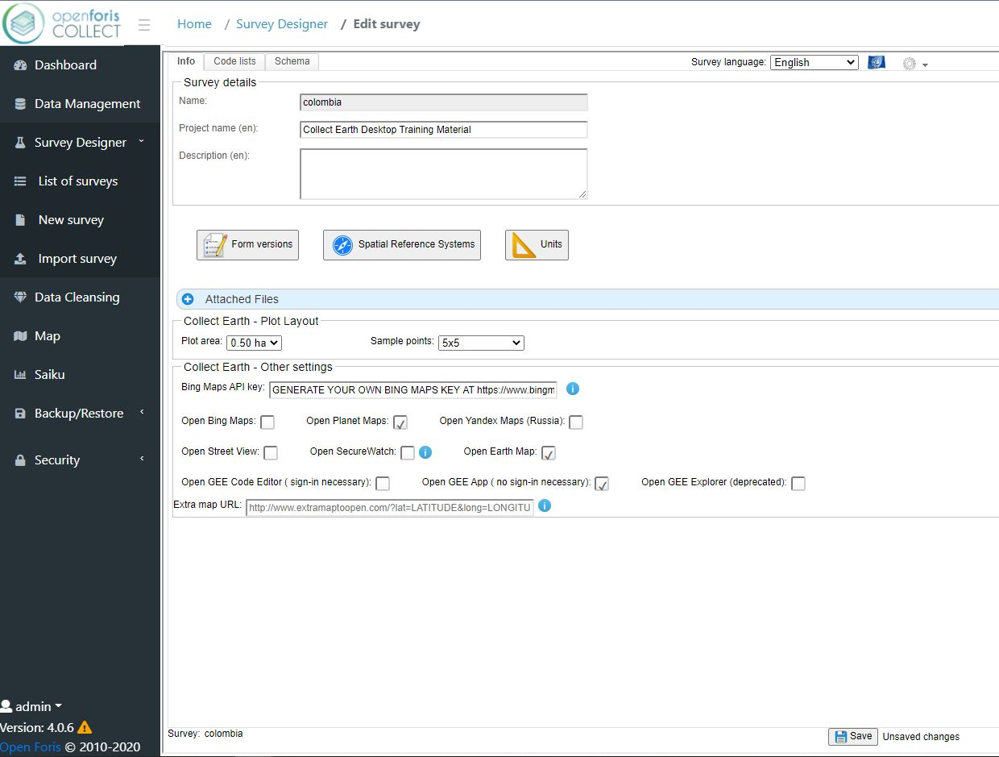

#### 3.2.2 Agregar listas de código 

Ahora navegue a la pestaña de “Code lists”. A mano izquierda puede ver las listas de código predeterminados incluyendo elevación, orientación, y pendiente.          

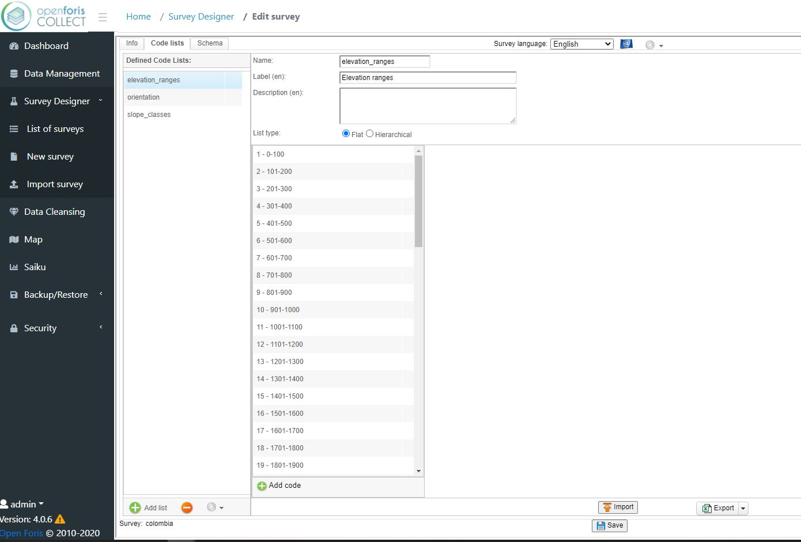       

Para esta encuesta hay listas de código adicionales que queremos incluir, incluyendo cobertura de suelo y cambio de cobertura de suelo por año. Para agregar una lista de código, haga clic en "Add list" (agregar lista) en la parta inferior de la pagina a mano izquierda.

*NOTA: Mientras crea sus listas de códigos, puede aparecer un triángulo amarillo con un signo de exclamación junto a las nuevas listas que cree. No se alarme por esta señal de advertencia. Esto le indica si todavía se usa o no en su encuesta y no afectará la usabilidad de su lista de códigos en el futuro.* 

Ahora agregaremos la lista de código de cobertura de suelo. Nombre la lista ‘land_cover’. **Cualquier nombre para una lista de código que cree DEBE de estar en minúsculas y no tener espacios.**

Haga clic en “Add code” (Agregar código). Aparecerá una nueva ventana donde completará la información del elemento de la lista. El primer código que agregaremos es "agua". Escriba "agua" en los campos de texto Code (Código), Label (Etiqueta), y Tooltip (Información) sobre herramientas. Haga clic en aplicar. Ahora repita esto para todos los demás códigos de cobertura terrestre: nieve_hielo, desarrollado, desnudo, árboles, arbustos, pastizales, cultivos y otros.

Una vez que haya terminado, haga clic en "Agregar lista" y cree la lista de códigos de cambio de uso del suelo por año. Nombra la lista "land_cover_change_yr". Como antes, agregue sus códigos, que serán todos los años entre 2009 y 2020: 2009, 2010, 2011, 2012 ... a 2020. También agregaremos una opción "no_change".

Finalmente agregaremos una lista de código de confianza. Nombre la lista 'confianza'. El primer código que agregaremos es 'alto'; agregue ‘alto’ a los campos de Code y Label y use  ‘alta confianza’ para el Tooltip. Haga clic en aplicar. Repita esto para confianza mediana y confianza baja. 

Si comete un error, puede editar los elementos de la lista existente. También puede hacer clic y arrastrar los elementos de la lista en un orden diferente. Vuelva a la lista de códigos "land_cover_change_yr" e intente arrastrar la opción "no_change" a la parte superior de la lista.

 

*NOTA: Si ya tiene una lista creada en una hoja de Excel, haga clic en "Importar" en la parte inferior de la página. También puede exportar su lista de códigos cuando haya terminado con ella como una hoja de Excel o un archivo CSV.*

Una vez que haya creado sus listas de códigos adicionales, asegúrese de Guardar su trabajo en la parte inferior de la página.

#### 3.2.3 Agregar preguntas de encuesta 

Ahora haga clic en la pestaña "Schema". La pestaña "Schema" es donde definirá la estructura de la encuesta y qué datos se recopilarán. Debido a que usamos la plantilla Collect Earth, la encuesta ya tendrá definida la "parcela" como el Sampling Unit (la Unidad de Muestreo). En el futuro, si desea diseñar una encuesta diferente, hay más información disponible en [http://www.openforis.org/tools/collect/tutorials/survey-designer.html](http://www.openforis.org/tools/collect/tutorials/survey-designer.html) bajo Schema. 

Usaremos esta pestaña para agregar preguntas sobre la cobertura terrestre y el año del cambio.

Para crear una nueva pregunta de encuesta, haga clic con el botón derecho en la unidad de muestreo "Plot" (Trazar) y seleccione "Agregar atributo". En la lista que aparece, elija "Código". Agregar un atributo de Código le permitirá usar cualquiera de sus listas de Código creadas previamente e ingresarlas como opciones para las preguntas de su encuesta.

         

El formulario de atributo de código aparecerá en la columna de la derecha. En el campo "Nombre", escriba "current_land_cover", tenga en cuenta que no puede poner números al comienzo de este campo. Agregue una etiqueta en la sección "Etiqueta" como "Cobertura terrestre actual" y luego agregue una descripción en la sección "Texto de información sobre herramientas", por ejemplo "Clases de cobertura terrestre 2020". A continuación, para la lista de códigos, seleccione su lista de códigos "land_cover". De forma predeterminada, se requerirá la pregunta de la encuesta. Deje esta configuración como predeterminada. Puede agregar texto de información sobre herramientas, como "¿Cuál es la cobertura terrestre de 2020?"

          

Ahora repetiremos esto para la lista de código de cambio de cobertura de suelo. En el campo de Nombre, escriba “land_cover_change”, agregue una descripción, y seleccione la lista de código “land_cover_change_yr”. agregue texto de información, por ejemplo “No cambio o indicar ano de cambio.”

Ahora agregaremos una pregunta de encuesta de confianza. Agregue otro atributo de Código. En el campo Nombre, escriba "confianza_actual", agregue una descripción y seleccione la lista de códigos de "confianza". Agregar texto de información sobre herramientas, por ejemplo, "¿Qué tan seguro acerca de la cobertura terrestre actual / cambio de cobertura terrestre?"

No se le olvide guardar su trabajo.

Para las parcelas donde hay un cambio de cobertura terrestre, necesitamos agregar una pregunta que pregunte cuál fue el cambio de cobertura terrestre anterior. Cree otro atributo de código. En el campo Nombre, escriba "previous_land_cover" y agregue una descripción para indicar que se trata del paso de tiempo anterior. Seleccione la lista de códigos "land_cover".

Solo queremos que esta pregunta aparezca cuando ha ocurrido un cambio en cobertura de suelo. Junto a “Relevant”, haga clic en “Only when expression is verified” (Solo cuando la expresión esta verificada). En la casilla de función, escriba `land_cover_change != 'no_change'`. Si desea obtener más información sobre estas funciones, haga clic en el icono de función a la derecha del cuadro de texto. Queremos ocultar esta pregunta cuando no sea relevante, así que también haga clic en "Hide when not relevant" (Ocultar cuando no sea relevante). Esto significa que la pregunta NO aparecerá si la pregunta del año de cambio de la cobertura terrestre se indica como “Sin cambios” porque si no ha habido cambios, entonces no es necesario identificar la cobertura terrestre anterior.

 

También queremos agregar una regla de validación a esta pregunta. Queremos crear un error si la cobertura terrestre actual y la anterior son las mismas, ya que eso significa que no hay cambios. Desplácese hacia abajo y expanda "Verificaciones (reglas de validación)". Haga clic en el botón verde con el signo más y seleccione "Custom" (Personalizado).

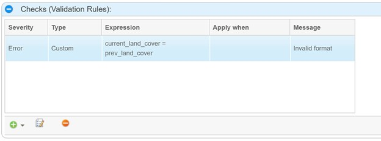 

Para esta encuesta, agregue hasta tres pasos de tiempo. Esto significa agregar listas de código adicionales (“land_cover_change2” and “land_cover_change3”) con años de cambio de cobertura de suelo y crear reglas de validación adicionales para cada una de estas listas.

Se puede ver una vista previa de las preguntas de la encuesta haciendo clic en "Preview" (Vista previa) en la parte inferior derecha de la página. Asegúrese de continuar con Guardar su trabajo en la parte inferior de la página.

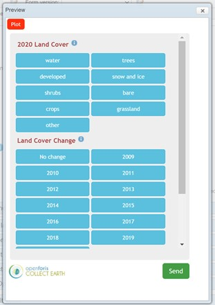

### 3.3 Agregar una cuadricula de muestreo a Collect

Collect necesita una cuadricula de muestreo que define en donde colectamos datos de la encuesta que acabamos de crear. 
Presentamos dos opciones aquí:

1. Importar un diseño de muestreo existente (puede usar uno creado en tutoriales aquí en OpenMRV en el proceso "Recopilación de datos de muestra" y herramientas "QGIS", "AREA2" y "GEE". Uno está disponible [aquí](https://drive.google.com/file/d/1D56RnNziNVROjeGro1uwvJAH1DCQceck/view?usp=sharing) como ejemplo.
2. Creando e importando una cuadricula de muestreo usando el Generador de Cuadriculas en Google Earth Engine

#### 3.3.1 Importar un diseño existente de muestreo

Antes de importar un diseño de muestreo existente, debe revisar que el csv tenga el formato correcto. 

El archivo csv debe contener las siguientes categorías en este orden: 

*  levelX_code columns: 1 columna para cada nivel X (máximo 3 niveles, por ejemplo si tiene 2 niveles, conglomerado y parcela, tendrá una columna "level1_code" con valor de id de conglomerado y una columna "level2_code" para el valor de id de parcela);
*  x: easting, en las mismas configuraciones CoordinateReference Systems de la encuesta;
*  y: northing, en las mismas configuraciones CoordinateReference Systems de la encuesta;
*  srs_id: id del sistema de referencia de coordenadas, el mismo usado en las configuraciones de Coordinate Reference Systems  de la encuesta; y
*  Cualquier columnas adicionales (con un máximo de 10) pueden ser agregadas a un archivo de csv para grabar información adicional relacionada a los puntos de muestreo (por ejemplo, pendiente, unidades administrativas, etc.).

Para revisar que la estructura de su archivo de csv coincide con los requisitos para la encuesta de Collect, puede descargar un archivo de demonstración. Este archivo de formato csv de Collect se puede encontrar en el Open Foris Collect Survey Designer, el diseñador de encuestas de Open Foris Collect. Para encontrar este archivo de demonstración: 

1. Ir a la página de “Edit survey” 
2. Asegurarse de estar en la pestaña de “Info” 
3. Navegar a la sección de “Attached Files” 
4. Hacer clic al botón verde de “Add” con el símbolo de más, y una ventana de “Survey file” aparecerá 
5. Seleccionar “Grid” en el menú desplegable de “Type” y un botón a la izquierda que dice “Download template” (Descargar plantilla) aparecerá 
6. Hacer clic en “Download template” para descargar el archivo csv de demonstración para saber como adaptar su archivo csv generado a la estructura de la encuesta de Collect 

Una vez que esté seguro de que la estructura coincide, su archivo csv de cuadrícula generado estará listo para usar en el Diseñador de recopilación de encuestas.

Para importar un diseño de muestreo existente, navegue hasta la pestaña "Información". En la pestaña "Información" de su editor de encuestas, vaya a la sección "Archivos adjuntos" y haga clic en el botón verde para adjuntar su archivo de cuadrícula csv. Si su archivo es demasiado grande, es posible que deba dividirlo en varios archivos.

#### 3.3.2 Crear una cuadricula de muestreo para Collect Earth usando el Grid Generator en Google Earth Engine

El Grid Generator, o generador de cuadriculas, es una aplicación de Google Earth Engine creada con el Editor de Código de Google Earth Engine. Esta herramienta le permite diseñar y generar una cuadricula para su proyecto de Collect Earth. 

*NOTA: También hay videos de YouTube disponibles que demuestran como generar una cuadricula para Collect Earth desktop, y se pueden encontrar aquí: [https://www.youtube.com/channel/UCxu8NZPvPxGBjBp0g6LCV4w](https://www.youtube.com/channel/UCxu8NZPvPxGBjBp0g6LCV4w)*

Para acceder el generador de cuadriculas de GEE, visite este sitio ([http://www.openforis.org/tools/collect-earth/tutorials/grid-generation-through-google-earth-engine.html](http://www.openforis.org/tools/collect-earth/tutorials/grid-generation-through-google-earth-engine.html)) y haga clic en “Generated Grid through GEE”. Este sitio también tiene mas tutoriales que puedan ser útiles para usar esta aplicación. 

El generador de cuadrícula de Google Earth Engine ofrece diferentes formas de generar una cuadrícula: puede usar una colección de características cargando un archivo de forma a los assets de GEE y usando su ID de asset de GEE, seleccionar manualmente el área usando la herramienta de dibujo de polígonos/rectángulos, o seleccionar un país de la lista. En este caso, seleccionaremos el país de Colombia.

Para seleccionar el país de Colombia, navegue hasta el menú desplegable que dice  “Choose a country or the option to use your own shapefile/asset” (Elija un país o la opción para usar su propio archivo shapefile/asset) en el lado izquierdo de la pantalla en la parte superior de la ventana del generador de cuadrícula. Una vez que abra el menú desplegable, desplácese hacia abajo hasta el país de Colombia y seleccione. Una vez seleccionado, el mapa de fondo de Google cambiará a la ubicación del país. Colombia presenta una representación diversa del tipo de bosque, la topografía y la cobertura de nubes, y una tasa de deforestación muy baja en relación con el área del país.

A continuación, debe configurar el código EPSG para el sistema de coordenadas que mejor se adapte a su área de estudio. Los códigos EPSG son un registro público de datos geodésicos que la mayoría de los sistemas de información geográfica utilizan para identificar los sistemas de referencia de coordenadas. Para los países cercanos al ecuador, puede utilizar el código EPSG que está precargado (EPSG: 4326). EPSG: 4326 es un código EPSG común que se refiere al sistema de coordenadas de latitud / longitud basado en el centro de masa de la Tierra. El uso de un código EPSG en este caso para Collect permite una proyección precisa de la ubicación elegida en las diferentes plataformas utilizadas en este proceso. The Grid Generator recomienda usar el código EPSG: 4326 precargado para países grandes, por lo que podemos mantenerlo ya que Colombia es un país bastante grande. Con este sistema de coordenadas, la distancia longitudinal entre parcelas cambia entre parcelas cuanto más se mueve desde el ecuador. Puede visitar epsg.io para encontrar códigos EPSG.

También puede agregar diferentes datos a los gráficos de la cuadrícula que generará. Por ejemplo, puede agregar los datos de las unidades administrativas GAUL que incluyen el país, la provincia y el distrito, puede agregar los datos del modelo de elevación digital (DEM) que incluye la elevación, la pendiente y el aspecto, o puede agregar datos del IPCC específicos para inventarios de gases de efecto invernadero que incluyen suelo, clima y otros datos. Con estos datos puede mejorar la información contenida en la cuadrícula que se utilizará durante la fase de análisis de la recopilación de datos con Collect Earth. Para este proyecto, agregaremos los datos del IPCC a la cuadrícula que estamos generando. Para hacerlo, asegúrese de marcar la casilla de verificación junto a "Agregar datos del IPCC (suelo, clima)".

A continuación, deberá definir qué tipo de cuadrícula desea generar. Puede generar una cuadrícula sistemática o puede generar una cuadrícula aleatoria. Si genera una cuadrícula sistemática, establece la distancia entre las parcelas en metros; esto dependerá de qué tan grande sea su cuadrícula. El generador de red generalmente recomienda que la distancia para una red sistemática sea de más de 500 metros. En una cuadrícula aleatoria, establece el número de parcelas que deben generarse en la cuadrícula.

En este caso, generaremos una cuadrícula sistemática con una distancia de 6000 m entre parcelas. Para hacerlo, asegúrese de marcar la casilla de verificación junto a "Generar cuadrícula sistemática" y escriba "6000" en el cuadro de texto debajo de “Set the distance in meters of the systematic grid” (Establecer la distancia en metros de la cuadrícula sistemática).

Por último, puede agregar columnas en el archivo .csv de cuadrícula generado desde otros shapefiles. Esto es útil si desea información auxiliar en la cuadrícula para su uso posterior en el análisis. Los shapefiles deben cargarse en Google Earth Engine como activos y esta opción agregará todas las propiedades de los polígonos a la trama de intersección. En este ejercicio no utilizaremos esta función.

Después de definir todo, haga clic en "Generar cuadrícula" en la parte inferior y se generará la cuadrícula. Una vez que haya hecho clic aquí, aparecerá una nueva ventana en la parte superior derecha de la página. Luego haga clic en “CLICK TO DOWNLOAD GRID” para descargar el archivo csv generado. También puede descargar datos solo para el país o las provincias, y si los datos terminan siendo demasiado grandes, puede generar la cuadrícula a través del Editor de código de Google Earth Engine en su lugar.

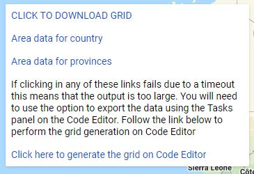

A continuación, la estructura del archivo csv deberá adaptarse a la estructura de la encuesta Collect. Se puede encontrar un archivo de demostración del formato csv de Collect en Open Foris Collect Survey Designer. Para encontrar este archivo de demostración:

1. Ir a la página "Editar encuesta".
2. Asegúrese de estar en la pestaña "Información"
3. Navegar a la sección "Archivos adjuntos".
4. Hacer clic en el botón verde "Agregar" en el símbolo de un signo más, y aparecerá una ventana de "Archivo de encuesta"
5. Seleccionar "Cuadrícula" en el menú desplegable "Tipo" y aparecerá un botón a la izquierda que dice "Descargar plantilla".
6. Hacer clic en "Descargar plantilla" para descargar el archivo csv de demostración y saber cómo adaptar su archivo csv de cuadrícula generado para que coincida con la estructura de la encuesta Collect.

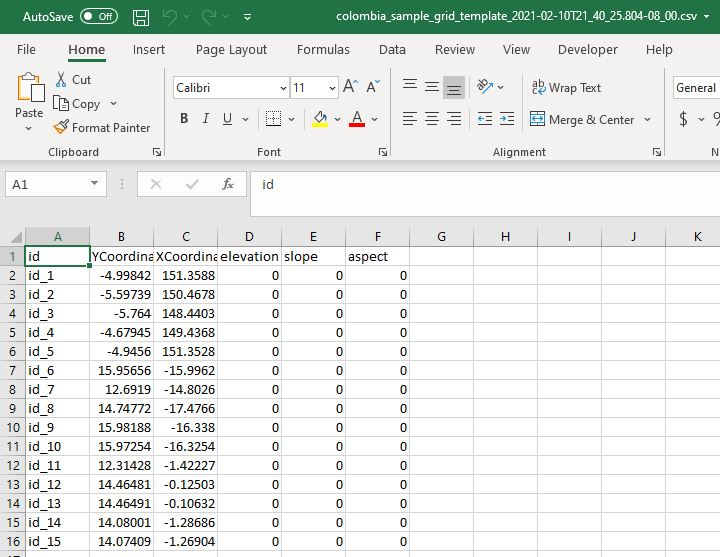

En el archivo csv de demostración, las columnas están nombradas “id”, “YCoordinate”, “XCoordinate”, “elevation”, “slope”, y “aspect”. 

En la cuadrícula generada para Colombia, puede ver que las columnas están etiquetadas de manera diferente. Ahora necesitará editar su cuadrícula generada para que coincida con la estructura de la encuesta Collect. Para hacer esto debes:

1. Mueva la columna "sistema: índice" para que sea la columna A y cambie el nombre de la etiqueta a "id". Esta será su identificación para cada punto.
2. A continuación, mueva la columna "latitud" para convertirla en columna B y cámbiele el nombre a "YCoordinate".
3. Mueva la columna "longitude" (longitud) para convertirla en la columna C y cámbiele el nombre a "XCoordinate".
4. Mueva la columna "elevation" (elevación) para que sea la columna D.
5. Mueva la columna "slope" (pendiente) para que sea la columna E.
6. Por último, mueva la columna "aspect" (aspecto) para que sea la columna F.

Puede reorganizar o eliminar el resto de las columnas según sus preferencias siempre que las columnas de la A a la F tengan el mismo formato que el archivo csv de demostración. Una vez que esté seguro de que la estructura coincide, su archivo csv de cuadrícula generado estará listo para usar en el Diseñador de Encuestas de Collect.

En la pestaña “Info” de su editor de encuestas, vaya a la sección “Attached Files” y haga clic en el botón verde para adjuntar su archivo de csv. 

Si su archivo tiene más de 4000 puntos de parcela, será demasiado grande para cargarlo, por lo que es posible que deba dividirlo en varios archivos csv. Para hacerlo, abra Collect Earth, vaya al menú desplegable "Herramientas" en el Panel de control, haga clic en "Utilidades" y luego en "Dividir archivos de trazado CSV grandes". Desde aquí puede dividir su archivo CSV grande y prepararlo para importarlo a Collect Survey Designer.

Ahora que completó las preguntas de la encuesta y adjuntó los archivos de cuadrícula para indicar la ubicación de su recopilación de datos, ahora puede exportar y compartir su encuesta Collect Earth, que se describe en la siguiente sección.

### 3.4 Exportar y compartir su Encuesta de Collect Earth

Para compartir su encuesta Collect Earth, vaya a la "List of Surveys" (Lista de encuestas) y haga clic en "Export". Hay varias formas de exportar la encuesta. Por ejemplo, si desea utilizar la encuesta en Collect Earth, deberá cambiar el modo de exportación a "Collect Earth". Si desea crear una copia de seguridad de la información, seleccione “Collect Desktop (backup)” (copia de seguridad) como modo de exportación.

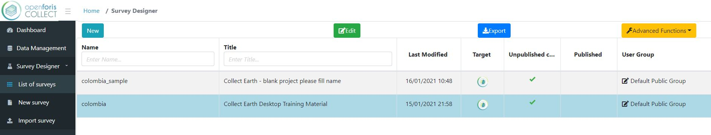

Para este ejercicio, haga clic en "Exportar", elija el tipo "Unpublished Changes" (Cambios no publicados) si aún no ha publicado su encuesta. Utilice el modo de exportación "Collect Earth" y elija el idioma para su encuesta. Las opciones de idioma incluyen inglés, español y francés.

El archivo exportado se descargará como un archivo .cep en la ubicación que haya especificado. Luego se puede compartir y se abrirá directamente en Collect Earth si ya lo tiene descargado.

### 3.5 Descargar y lanzar Collect Earth

Puede descargar Collect Earth del sitio de Open Foris. Visite [http://www.openforis.org/tools/collect-earth.html](http://www.openforis.org/tools/collect-earth.html). Haga clic en "Download latest version", y luego selección la versión de descarga apropiada para su sistema operativo. Instrucciones de instalación se pueden encontrar en [http://www.openforis.org/tools/collect-earth/tutorials/installation.html](http://www.openforis.org/tools/collect-earth/tutorials/installation.html).

Inicie Collect Earth haciendo clic en el acceso directo o navegando a la carpeta Collect Earth y haciendo doble clic en el archivo por lotes titulado CollectEarth-launcher.exe.

En la ventana principal de Collect Earth, configure su nombre de operador. Cuando ejecuta Collect Earth, debe establecer el nombre de su operador, que es una forma de filtrar posteriormente los datos recopilados por la persona (operador) que recopiló los datos. Simplemente ponga su nombre o lo que quiera para identificarse en el campo de texto. Luego haga clic en actualizar. Recuerde utilizar un nombre de operador coherente que tenga entre 6 y 50 caracteres.

Collect Earth iniciará automáticamente Google Earth. Collect Earth junto con Google Earth proporcionan una manera fácil de revisar sistemáticamente imágenes de satélite y evaluar el uso de la tierra.

### 3.6 Colectar Datos

*NOTA: También hay videos de YouTube disponibles que demuestran como recopilar datos en Collect Earth desktop, los cuales se pueden encontrar aquí: [https://www.youtube.com/channel/UCxu8NZPvPxGBjBp0g6LCV4w](https://www.youtube.com/channel/UCxu8NZPvPxGBjBp0g6LCV4w)*

En la ventana principal de Collect Earth, navegue a "File" (Archivo) y haga clic en "Import CEP file" (Importar archivo CEP) para importar una encuesta de recopilación de datos realizada anteriormente. Busque la encuesta que acaba de exportar desde la aplicación Collect.

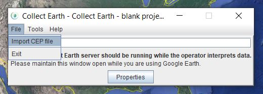

Una vez que su archivo .cep se abra en Google Earth Pro, haga clic en un punto de parcela en la ventana de la derecha y el mapa navegará hasta el punto de parcela. Luego haga clic en el punto de la parcela real en el mapa. Las preguntas de la encuesta aparecerán además de los mapas en su navegador que fueron elegidos previamente durante el diseño de la encuesta.

En este caso, Collect Earth Plot Imagery and Statistics, mapas base de NICFI Planet y Earth Map se abren automáticamente en su navegador. Inicie sesión en estos mapas en consecuencia y utilice estos mapas para responder a las preguntas de su encuesta. Recopile imágenes y estadísticas de Earth Plot y los mapas base de NICFI Planet se abrirán automáticamente. Earth Map te permitirá iniciar sesión o continuar como invitado. No se requieren cuentas para estos sitios. Estos mapas lo ayudarán a comprender mejor los cambios que ocurrieron en el uso de la tierra para ese punto particular de la parcela.

Para analizar un punto en la parcela, use los mapas que aparecen y sus datos correspondientes para determinar el tipo de cobertura de suelo y que cambios han ocurrido ahí.

Por ejemplo, estamos analizando el numero de parcela COLOMBIA_1778 aquí. 

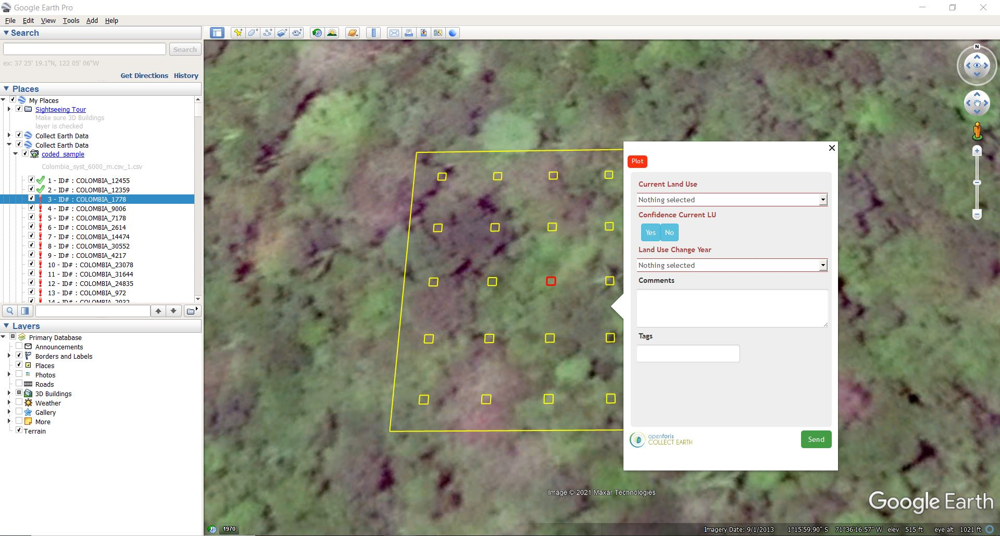

Después de investigar más las imágenes, utilizando los mapas adicionales, puede concluir que esta área tiene una mezcla de especies de árboles. En el menú desplegable de "Current Land Use" (Uso actual de la tierra), puede elegir "TREES: Mixed" (ÁRBOLES: Mixtos). La pregunta de sí o no de “Confidence Current LU" (Confianza actual LU) quiere saber si confía en su elección de uso de la tierra. En este caso, podemos elegir "Yes" porque estamos bastante seguros de que esta imagen muestra una mezcla de especies de árboles.

Si mira la ventana de Earth Map e investiga los datos, puede ver que no han habido cambios en el uso de suelo en los anos, así que dentro del menú desplegable "Land Use Change Year" puede seleccionar “There has been no change in Land Use in the previous years” (No han habido cambios en Uso de Suelo en los anos previos).

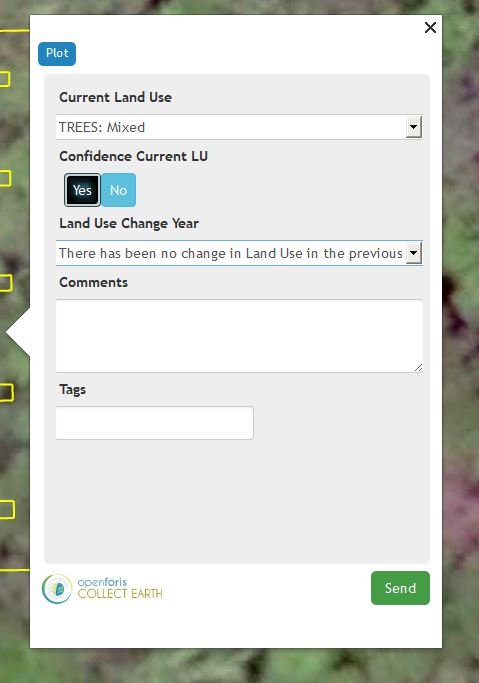

Como puede ver, una vez que se han respondido las preguntas requeridas, el título cambia de rojo a negro. También puede incluir comentarios o etiquetas si hay información adicional que le gustaría incluir durante su recopilación de datos. Una vez que haya terminado con la encuesta, haga clic en "Send" (Enviar) en la esquina inferior derecha de la ventana emergente. A continuación, verá que sus datos se guardaron y el gráfico de la lista de gráficos de la derecha ahora tiene una marca de verificación verde al lado. Cuando presiona "Ok", la aplicación lo llevará al siguiente gráfico.

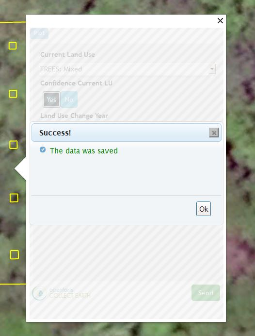

Continúe con el resto de los puntos de la trama de esta manera. Habrá completado su encuesta una vez que toda la lista de parcelas de la derecha tenga una marca de verificación verde al lado de cada parcela.

#### Consejos para Interpretación de Imágenes

* Los problemas de estacionalidad pueden ocurrir cuando los diferentes usos del suelo parecen diferentes entre las estaciones. Por ejemplo, una pradera puede ser de un verde brillante en primavera pero verse marrón en verano. Si solo vio las imágenes marrones, podría pensar que el marrón es tierra y clasificar incorrectamente la pradera como tierra estéril.
* Acercar y alejar el zoom para recopilar pistas contextuales del paisaje es importante para múltiples usos del suelo y tipos de cobertura del suelo. Por ejemplo:
    - El agua en cuerpos de agua más grandes a menudo aparece negra u oscura hasta que se aleja.
    - Las plantaciones de árboles pueden parecer bosques hasta que se aleje y vea el patrón regular de árboles plantados.

### 3.7 Exportar sus datos 

Cuando haya completado su recopilación de datos y desee exportar sus datos de Collect Earth, vaya a la ventana principal de Collect Earth y haga clic en "Importar / Exportar datos" en el menú Herramientas. Aquí puede guardar su archivo como CSV, XML, Collect Backup o Fusion Table. Nombre y guarde su archivo.

El archivo CSV, que se puede abrir en Excel, tabula todos los datos que se han ingresado en Collect Earth, incluidos los datos que no se han guardado y validado activamente. También se proporcionan algunos metadatos, como las coordenadas de la parcela y el nombre del operador. La exportación de datos a Fusion Table también genera un archivo CSV, pero se diferencia de la exportación CSV normal en que contiene una columna adicional con las coordenadas completas de cada gráfico. XML es el único formato que está configurado para guardar los metadatos de Collect Earth además de los datos ingresados manualmente por los usuarios.

## 4 Preguntas Frecuentes

**¿Cuándo debería usar CE?**

Úselo cuando desee trabajar sin conexión (CE) y si necesita más opciones para la exportación de datos que .csv (CE).

**¿Cómo instalo CE?**

Vaya a http://www.openforis.org/tools/collect.html. Aquí puede descargar la aplicación “Collect” haciendo clic en “Descargar última versión” y seleccionando la versión correcta. Descargue e instale Collect en su computadora. Si es necesario, consulte la ayuda de instalación disponible en http://www.openforis.org/tools/collect/tutorials/installation.html.

**¿Qué reglas existen para nombrar mi encuesta?**

Su título debe ser todo en minúsculas sin espacios, la herramienta convertirá automáticamente mayúsculas a minúsculas y espacios a guiones bajos (_).

**¿Con qué frecuencia debo guardar mi proyecto?**

Siempre que realice un cambio que afecte a su encuesta, considere guardar. Alternativamente, considere ahorrar cada pocos minutos mientras trabaja activamente.

**Si mi sesión se agota, ¿cómo regreso a la ventana de mi encuesta?**

Si su sesión se agota o si cierra la ventana accidentalmente, puede volver a la ventana Editar encuesta haciendo clic en Diseñador de encuestas -> Lista de encuestas -> haga clic en el nombre de su encuesta -> Editar encuesta.

**¿Existen reglas para los nombres de las listas de códigos?**

Cualquier nombre para cualquier lista de códigos que cree DEBE estar en minúsculas y sin espacios.

**¿Existe alguna regla para importar un diseño de muestreo existente?**

El archivo csv debe contener las siguientes categorías en el siguiente orden:

- levelX_code columnas: 1 columna para cada nivel X (máximo 3 niveles, e.g. si tiene dos niveles, cluster y plot, tendra una columna "level1_code" con un valor de cluster id y una columna "level2_code" para plot id value);
- x: easting, usando las mismas configuraciones CoordinateReference Systems de la encuesta;
- y: northing,usando las mismas configuraciones CoordinateReference Systems de la encuesta;
- srs_id: id del sistema de referencia de coordenadas, las mismas configuraciones Coordinate Reference Systems usadas en la encuesta; y
- cualquier columnas adicionales (hasta un máximo de 10) pueden ser agregadas a un archivo csv para registrar información adicional relacionada a los puntos de muestreo (por ejemplo pendiente, unidades administrativas, etc.)

**¿Cuáles son algunos consejos para la interpretación de imágenes?**

- Los problemas de estacionalidad pueden ocurrir cuando los diferentes usos de la tierra parecen diferentes entre las estaciones. Por ejemplo, una pradera puede ser de un verde brillante en primavera pero verse marrón en verano. Si solo vio las imágenes marrones, podría pensar que el marrón es tierra y clasificar incorrectamente la pradera como tierra estéril.
- Acercar y alejar el zoom para recopilar pistas contextuales del paisaje es importante para múltiples usos del suelo y tipos de cobertura del suelo. Por ejemplo:
   - El agua en cuerpos de agua más grandes a menudo aparece negra u oscura hasta que se aleja.
   - Las plantaciones de árboles pueden parecer bosques hasta que se aleje y vea el patrón regular de árboles plantados.

**¿Dónde puedo encontrar ayuda adicional?**

Para obtener más ayuda con Collect Earth, vaya a openforis.org y haga clic en "Community Support" en la barra de navegación superior.

Aquí puede crear una cuenta y hacer una pregunta a OpenForis directamente.

## 5 Terminología relevante para las técnicas de muestreo

Una lista de términos relevantes para las técnicas de muestreo e inferencia esta provista en la documentación de AREA2: https://area2.readthedocs.io/en/latest/definitions.html. Abajo hay algunos términos adicionales que no están incluidos en la documentación.

### 5.1 Diseño de Respuesta

Definido por Stehman and Czaplewski, 1998: “La referencia o clasificación 'verdadera' se obtiene para cada unidad de muestreo en función de la interpretación de fotografías aéreas o videografías, una visita terrestre o una combinación de estas fuentes. Los métodos utilizados para determinar esta clasificación de referencia se denominan "diseño de respuesta". El diseño de respuesta incluye procedimientos para recopilar información relacionada con la determinación de la cobertura terrestre de referencia y reglas para asignar una o más [etiquetas] de referencia a cada unidad de muestreo ". Conocido como "plan de medición" por Särndal et al. (1992).

### 5.2 Muestra

Un subconjunto de unidades de población seleccionadas de la población.

### 5.3 Diseño de Muestra

Sinónimo de diseño de muestreo, que es el término preferido en la literatura fundamental (Cochran, 1977, Särndal et al., 1992). El término aparece en Rice (1995) que utiliza tanto "diseño de muestreo" como "diseño de muestra".

### 5.4 Diseño de Muestreo

"El diseño de muestreo es el protocolo mediante el cual se seleccionan las unidades de muestra de referencia". (Stehman y Czaplewski, 1998). El “diseño de muestreo” también es utilizado por Cochran (1977) y Särndal et al. (1992) - el primero también usa "plan de muestreo". 

Los tutoriales que abordan el diseño de muestreo se pueden encontrar aquí en OpenMRV en el proceso "Diseño de muestreo".

### 5.5 Encuesta

Särndal y col. (1992) define una encuesta como una “investigación parcial de una población finita”, y además que “los términos 'encuesta' y 'encuesta por muestreo' se utilizan para denotar investigaciones estadísticas con las siguientes características metodológicas: [...] plan de medición [...] de muestreo probabilístico [y] estimación."

### 5.6 Diseño de Encuesta

Un "diseño total de la encuesta" define los procedimientos para "obtener la posible precisión en las estimaciones de la encuesta mientras se logra un equilibrio entre los errores de muestreo y los no muestrales [...] El diseño de la encuesta da lugar a operaciones de encuesta" como la selección de la muestra (Särndal et al., 1992). Lohr (1999) describe un diseño de encuesta total como "Una filosofía de diseño de encuesta para minimizar los errores de muestreo y de no muestreo". Además, en Lohr (1999) “diseño de encuestas” es sinónimo de diseño de muestreo.

### 5.7 Datos de referencia 

Datos que caracterizan la evaluación disponible más precisa de la condición real en la ubicación de la muestra (ejemplo: imágenes de satélite de resolución fina).

### 5.8 Observaciones de referencia

La evaluación disponible más precisa de la verdadera condición de una unidad de población.

### 5.9 Clasificación de referencia 

La clasificación de referencia aplicada a la colección de todas las unidades de muestra.

## 6 Referencias

Cochran, W.G., 1977. *Sampling Techniques*, John Wiley & Sons, New York, NY.

Lohr, S.L., 1999. *Sampling: Design And Analysis,* CRC Press.

Olofsson, P., Foody, G.M., Herold, M., Stehman, S.V., Woodcock, C.E. and Wulder, M.A., 2014. Good practices for estimating area and assessing accuracy of land change. Remote Sensing of Environment, 148, pp.42-57. https://doi.org/10.1016/j.rse.2014.02.015

Rice, J.A., 1995. *Mathematical Statistics and Data Analysis* (2nd ed.), Duxbury Press, Belmont, CA.

Särndal, C.E., Svensson, B.H., & Wretman, J.H., 1992. *Model assisted survey sampling*, Springer Science & Business Media, New York, NY.

Stehman, S.V., & Czaplewski, R.L., 1998. Design and analysis for thematic map accuracy assessment: fundamental principles. *Remote Sensing of Environment*, 64(3), 331-344. https://doi.org/10.1016/S0034-4257(98)00010-8

-----

  

Este trabajo tiene licencia bajo un [Creative Commons Attribution 3.0 IGO](https://creativecommons.org/licenses/by/3.0/igo/) 

Copyright 2021, World Bank 

Este trabajo fue desarrollado por Justine Bui y Karen Dyson bajo contrato del World Bank con GRH Consulting, LLC para el desarrollo de recursos nuevos o existentes relacionadas a la Medida, Reportaje, y Verificación para el apoyo de implementación MRV en varios países. 

Material revisado por:   
Ana Mirian Villalobos, El Salvador, Ministry of Environment and Natural Resources   
Carole Andrianirina, Madagascar, National Coordination Bureau REDD+ (BNCCREDD)   
Jennifer Juliana Escamilla Valdez, El Salvador, Ministry of Environment and Natural Resources   
Phoebe Oduor, Kenya, Regional Centre For Mapping Of Resources For Development (RCMRD)   
Tatiana Nana, Cameroon, REDD+ Technical Secretariat

Atribución    
Bui, J., Dyson, K. 2021. Response Design in Collect Earth Desktop. © World Bank. License:  [Creative Commons Attribution license (CC BY 3.0 IGO)](http://creativecommons.org/licenses/by/3.0/igo/)  

