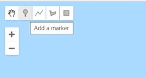
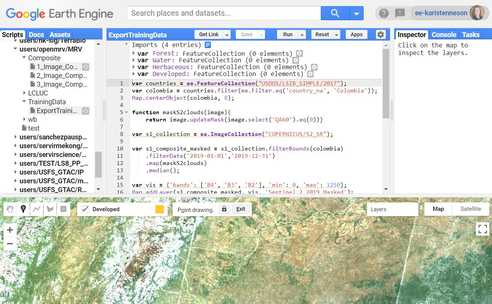
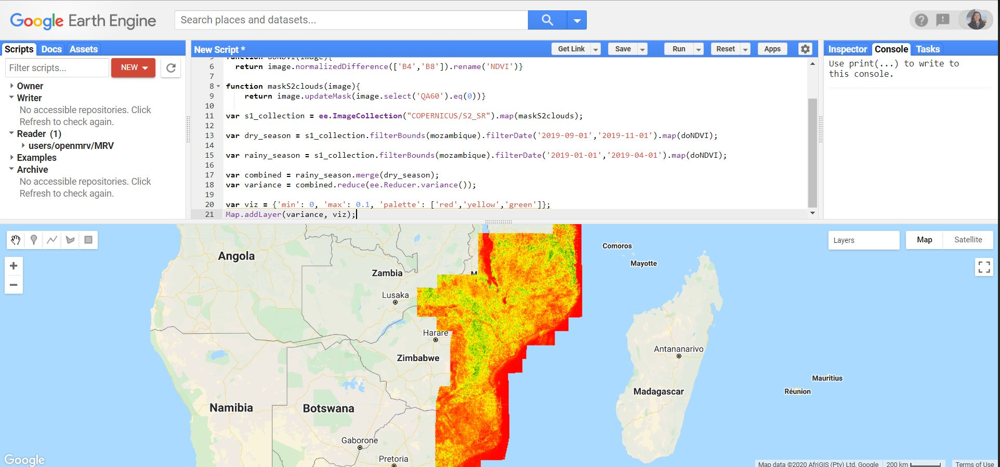
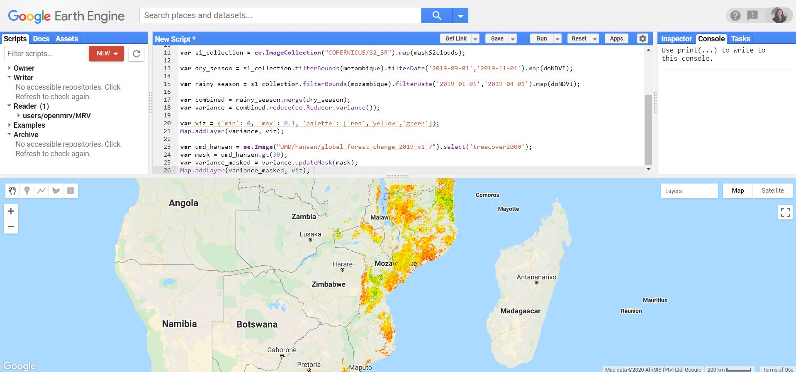
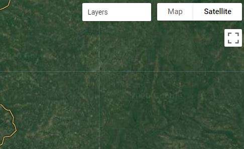
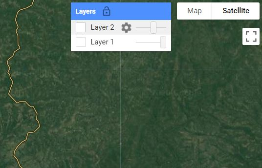

# Module 1.2.2 Training Data Collection Using Google Earth Engine 

## 1 Background

Training data is instrumental to supervised image classification. The training dataset is a labeled set of data that is used to inform or "train" a classifier. The trained classifier can then be applied to new data to create a classification. For example, land cover training data will contain examples of each class in the study's legend. Based on these labels, the classifier can predict the most likely land cover class for each pixel in an image. This is an example of a categorical classification and the training labels are therefore categorical. By contrast, a continuous variable (e.g. percent tree cover) can be predicted using continuous training labels.

This tutorial will demonstrate how to collect categorical training data for land cover classification using Google Earth Engine (GEE). Users should adjust the various components to match their project objectives. Here, the process is demonstrated for the country of Colombia and for a simple legend of four land cover classes: Forest, Water, Herbaceous, and Developed.  


### 1.1 Google Earth Engine

We will be digitizing training data in Google Earth Engine. Refer to Module 1.1 Image mosaic/composite creation for Landsat and Sentinel-2 in Google Earth Engine for more information and resources for working in this environment.

## 2 Learning Objectives 

At the end of this exercise, you will be able to:

- Create new feature collections in GEE representing your land cover classes of interest.
- Load your Landsat or Sentinel composite to use as background imagery to use as reference.
- Collect and export training data for a categorical classification. 

### 2.1 Pre-requisites for this module

* Google Earth Engine
  * Have a GEE account.
  * Completed Module 1.1 Image mosaic/composite creation for Landsat and Sentinel-2

* Remote sensing concepts
  * Basic understanding on theories involved in image classification.
  * Defining a thematic legend

## 3. Training Data Collection

### 3.1 Overview

The process for collecting training data in GEE are detailed in the steps below. The process can be generally described as three primary steps:

1. Creating a new feature class for each land cover to store the training data.
2. Loading a basemap using what you learned in Module 1.1 Image mosaic/composite creation for Landsat and Sentinel-2.
3. Collecting the training data by manually defining training points. 
4. Exporing the training data.


### 3.2 Creating new Feature Collections

As can be seen in Module 1.2.1 Training Data Collection Using QGIS, training data can be created in a variety of platforms. In this tutorial, you will create training data as using Feature Collections of points with unique land cover labels identified with a 'label' attribute. For example, forests can have a 'label' attribute of 1, agriculture as 2, and so on. One simple method to develop training data is to simply create a Feature Collection for each land cover using the data and imagery available in Google Earth Engine. This tutorial will demonstrate how to create training data that are point geometries. A similar process can be used with polygon data. 

To start, open a web browser and navigate to [Google Earth Engine](https://code.earthengine.google.com/). 

Then you will need to define a new Feature Class for each land cover of interest. 

1. While in the Earth Engine, navigate to the drawing tools in the upper left hand corner of the map window. Click the icon to add point markers. 



2. This will add a new *Geometry Imports* panel in your map window, with a label for the new properties you can now draw in the map window. The default name of this new layer is 'geometry'.


3. Hold your cursor over the name 'geometry' in this panel until a gear icon appears on the right hand side of the label. Click on the gear to open the panel to edit the layer configuration.


4. Next give the layer a name related to the land cover of interest, for example 'Forest'. 

For this tutorial, we reccomend using this land cover classification key and numeric class codes:

- 1 Forest
- 2 Water
- 3 Herbaceous
- 4 Developed

5. Then set the type (import as) to FeatureCollection.
6. Add a property by  clicking on the *+ Property* box. 
7. Give it a 'label' property with a unique integer identifier. In this case, 1, will represent forest.
8. Finally change the color if you like. For example, you can select to use green markers for forest labels.
9. Click *OK* to save your changes.

Your panel should look like this:


10. Back in the map window, hover your mouse over the geomerty imports and click on the option to *+ new layer*.


11. Repeat steps 3 to 10 until you have a Feature Collection set up for each land cover type of interest.

### 3.3 Load baselayers
Critical to the collection of training data is reference data, and for most purposes it is sufficient to use high-resolution imagery. Two critical factors in the selection of reference data are:

- The target classes can be distinguished through visible interpretation.
- The time of the reference imagery overlaps the input data used for classification.

There is a basemap of high resolution reference imagery available directly within GEE. The downside is that this is a mosaic of high resolution images, with no information available on the date of aquisition.

To augment the information available in these high resolution image mosaics, it is suggested that you also load the image mosaic that you will use to run the supervised classification. This is the image you created in Module 1.1 Image mosaic/composite creation for Landsat and Sentinel-2 in Google Earth
Engine. Then you can toggle between the available high resolution imagery and the imagery composite for the date of interest to ensure that no land cover changes have occured between the dates of the two image aquisitions. 

Remember, you want the reference data to match the time period and geographic extent of your study region. Here, the process is demonstrated for Colombia and for the year 2019. 

1. You can create a Sentinel-2 composite for 2019 on the fly and add it to the map. Paste the following code into the code editor window and click on *Run* to load the composite into the map window.

```
var countries = ee.FeatureCollection("USDOS/LSIB_SIMPLE/2017");
var colombia = countries.filter(ee.Filter.eq('country_na', 'Colombia'));
Map.centerObject(colombia, 8);

function maskS2clouds(image){
    return image.updateMask(image.select('QA60').eq(0))}

var s1_collection = ee.ImageCollection("COPERNICUS/S2_SR");

var s1_composite_masked = s1_collection.filterBounds(colombia) 
    .filterDate('2019-01-01','2019-12-31') 
    .map(maskS2clouds) 
    .median();

var vis = {'bands': ['B4', 'B3', 'B2'], 'min': 0, 'max': 1250};
Map.addLayer(s1_composite_masked, vis, 'Sentinel 2 2019 Masked');

``` 



2. There is also another way to load imagery into GEE, this second option is to load an image from your Assets tab. If you exported an image composite to your GEE Asset folder, you can import that by navigating to the Assets folder. Then hover your mouse over the name of the composite image and select the arrow to import into the code editor. Make sure that the image that you load from your asset folder is defined as "image" so that the GEE code works. 


3. Then copy the following text into the code editor to load it into the map window and click on *Run*.


```
Map.centerObject(image, 8);

var vis = {'bands': ['B4', 'B3', 'B2'], 'min': 0, 'max': 1250};
Map.addLayer(image, vis, 'image');

``` 

You can also visit the official [Earth Engine resources](https://developers.google.com/earth-engine/tutorials/tutorial_api_04) for information on finding and displaying Image Collections.

### 3.4 Collect training data

Once you have decided on reference imagery then it is time to start collecting training data. Going class by class, navigate your study region collecting point data. Here are a few considerations:

    - Training data should be representative of your entire study region. This means that collecting more data across the study area is better than a few large training areas.
    - Be sure to include examples on the edge of class boundaries, as these areas will be most challenging to distinguish in the classification stage. 
    - There is no magic number for an adequate number of training points. Be prepared for this to be an interative process in which you collect training data, perform your analysis, and then collect more training data to address misclassification errors. 
    - Take your time - this dataset will be invaluable to your research and can be to others as well. 

1. Select the land cover layer in the *Geometry imports* panel in the map window.
2. Select the point marker and click in the map to add points of that land cover (here is a brief [video](https://youtu.be/tJx7plJLqW4) to illustrate how to do so). You can toggle the image composite on and off in the Layers panel. You can also toggle between the map and satellite composite in the upper righthand corner of the map window.


3. If you drop a point accidentally, you can move it or delete it by using the pan hand, selecting the point, and editing it by either dragging it to move or deleting it (here is a brief [video](https://youtu.be/Q6QElHXYOT0) to illustrate how to do so). Click *Exit* to leave editing points.

4. Repeat the process until you have many samples of each of the four land cover classes throughout your study region. It is advised to save the script during the process by selecting the *Save* button at the top of the code editor window. 

### 3.5 Visualizing training data

Once you have collected training data for each class, it helps to style them to see the distribution across the study area. Ideally, you want to have training points that are representative of the variability in the classes. Here, that means that we want to have enough forest, water, herbaceous, and developed points to ensure they fully represent these classes across Colombia. 

1. Zoom out to the extent of the study area, in this case Colombia.
2. Take some time to look at your sample and ensure there are not any major "gaps" in training data. 

### 3.6 Merging and exporting data
The final step is to merge each land cover feature flass into one final feature class with all land covers aggregated. Then export the data. Here is a brief [video](https://youtu.be/r8UBDKztBpY) to illustrate how to do so.

1. The training features can be combined with the 'merge' method. For example, for 'Forest', 'Water', 'Herbaceous', and 'Developed' all represent Feature Collections you can enter the following code. Remember JavaScript is case sensitive so double check the capitalization between your merge statements and your geometry names.


```
var training = Forest.merge(Water)
                     .merge(Herbaceous)
                     .merge(Developed);

```

2. The outputs should then be saved as an Earth Engine asset for classification in GEE, or exported to your Google Drive for classification using a desktop GIS. 

    2a. You can export to Asset with the following code.

```

Export.table.toAsset({
  collection: training,
  description: 'LCsample2019',
  assetId: 'LCsample2019'
});

```

    2b. You can export to Google Drive with the following code.

```

Export.table.toDrive({
  collection: training,
  description: 'LCsample2019',
  fileFormat: 'SHP'
});

```

3. Then click Run to execute. This will allow you to go to the Tasks tab and run the export. If you need a refresher on how to complete the export process, revisit Module 1.1 Image mosaic/composite creation for Landsat and Sentinel-2 in Google Earth
Engine.

## 4. Examples: Mozambique and Cambodia 
Now let's try to replicate the same process as above in new study regions: Mozambique and Cambodia. This section is optional and will allow you to practice collecting data in different study regions. The general process is the same as that demonstrated in Colombia. 
These examples will demonstrate how to collect training data in a manner that is robust to differing forest types and topography. The purpose is to improve the robustness of the training data, which can ultimately improve the quality of your land cover classification. Users should consider the climatic and topographical conditions of their study region to determine whether these additional steps are necessary. 

Clear your previous code by going to the *Reset* button next to the *Run* button, clicking the down arrow, and clicking *Clear Script*. 

### 4.1 Mozambique: Accounting for Seasonality

Mozambique is an ecologically diverse country that consists of a mix of tropical and temperate climatic zones. As a result, there are large swaths of both evergreen and deciduous forest ecosystems. In Colombia, we did not directly account for seasonal effects in forests because they encompass a relatively small proportion of the county. The area of deciduous forest is much higher in Mozambique, which can present a challenge for land cover classification due to intra0annual variability in reflectance between phenological stages. 

To illustrate this point, observe the temporal variability of the Normalized Difference Vegetation Index (NDVI) over the course of a year for a Landsat 30 meter pixel in a seasonal forest in Mozambique. NDVI is a spectral transform that is commonly used to analyze photosynthetically active vegetation. The rainy season in Mozambique lasts from around November to May.

Season variability can present a challenge when performing land cover classification. For example, if we were to classify a dry season image in Mozambique, a deciduous forest could potentially be confused with herbaceous or non-forest land cover classes due to low vegetative greenness during a leaf-off period. To address possible confusion in the classification process, it is critical that the training data is representative of within-class variability (i.e. seasonal variability in forests or other vegetative classes). To put it simply, if there exists substantial areas of both deciduous and evergreen forests, then the training data for a broader 'Forest' class should contain examples of both. 

Here, our goal is ensure that our 'Forest' class contains examples of different forest types, as indicated by their seasonal trajectories. There are many ways of doing this, and here we are going to use Google Earth Engine to look at intra-anual variability in NDVI. 

1. First let's make Mozambique our new study region for the year 2019. To get you set up, paste the following code into the code editor window and click *Run* to load the composite into the map window. This includes the cloud masking function introduced in section 3.3 of this training material.

```
var countries = ee.FeatureCollection("USDOS/LSIB_SIMPLE/2017");
var mozambique = countries.filter(ee.Filter.eq('country_na', 'Mozambique'));
Map.centerObject(mozambique, 8);
```

Now continue with the training from here starting at section 3.4 to collect new training data for Mozambique. 

2. Calculate NDVI using the Red (B4) and NIR (B8) bands of Sentinel-2 imagery. We will also need the cloud masking function introduced in section 3.3. 
```
function doNDVI(image){
  return image.normalizedDifference(['B4','B8']).rename('NDVI')
}

function maskS2clouds(image){
    return image.updateMask(image.select('QA60').eq(0))}
```

3. Now, we can filter the Sentinel-2 collection into two groups: images during the peak of the dry season and images during the peak of the rainy season. We can then map over the collections to apply the cloud masks and calculate NDVI. 
``` 
var s1_collection = ee.ImageCollection("COPERNICUS/S2_SR").map(maskS2clouds);

var dry_season = s1_collection.filterBounds(mozambique).filterDate('2019-09-01','2019-11-01').map(doNDVI);

var rainy_season = s1_collection.filterBounds(mozambique).filterDate('2019-01-01','2019-04-01').map(doNDVI);
```

4. To calculate seasonal variability, we can then combine these two collections and calculate the per-piexl NDVI variance using a [reducer](https:/developers.google.com/earth-engine/guides/reducers_intro). 
```
var combined = rainy_season.merge(dry_season);
var variance = combined.reduce(ee.Reducer.variance()); 

var viz = {'min': 0, 'max': 0.1, 'palette': ['red','yellow','green']};
Map.addLayer(variance, viz);
```


The map that is loaded is the seasonal variance in NDVI, in which red indicates less variability and green indicates more. 

5. One further step we can do to help in the identification of forests is to use an ancilary tree cover dataset to mask non-forest pixels. The UMD-Hansen global tree cover, loss, and gain dataset is perfect for this purpose. While it is not recommended to use this dataset directly as training data, it is a good tool for identifying possible forest change locations. Here we will use the "Tree Cover 2000" layer to mask our NDVI variance layer in pixels that were under 30% tree canopy cover in 2000. 
```
var umd_hansen = ee.Image("UMD/hansen/global_forest_change_2019_v1_7").select('treecover2000');
var mask = umd_hansen.gt(30);
var variance_masked = variance.updateMask(mask);
Map.addLayer(variance_masked, viz);
```


6. Now, as we're collecting training data for the 'Forest' class, it's important to reference this layer to ensure the training data accounts for differences in seasonal spectral variability in forests. First, let's review why it might be beneficial to perform the steps listed above: 
    - Some forests have seasonal patterns in productivity. 
    - We want to ensure our 'Forest' training data includes examples of all forest types in a study domain. 
    - An easy and preliminary way to accomodate seasonality in a classification is by providing representative training data.
    - GEE allows us to easily identify seasonal forests based on the variance in NDVI values over a year.
    - The UMD-Hansen dataset helps in training data collection by masking non-forest pixels.

7. Using the directions described above, go class by class collecting training points. For the Forest class, occassionally overlay the training points on the map of NDVI variance. There's no need to do any detailed assessment, but it is worth visually ensuring that the training samples represent the seasonal and non-seasonal forests. This can be done by simply alternating between red, green, and yellow areas on the NDVI variability layer, and flipping back and forth between that layer and the reference image to make sure the locations are actually forest. 

8. Remember to save frequently. 

### 4.2 Cambodia: 

The final example of training data collection in GEE is for the country of Cambodia. Cambodia has a tropical monsoon climate with a rainy season from around May to October. In recent years, Cambodia has had a relatively high rate of land use change, often in the form of deforestation. 

Many of the remaining forests in Cambodia are located on hilly or mountanious terrain. Topography, however, can introduce a challenge to land cover classification. Because topographic features cast a shadow, the reflectance of the landscape within the shadow can be lower than a similar non-shadowed landscape. To reduce this effect, it is important to collect training data that is representative of the different topographic conditions of a study region. This example will demonstrate how to do just that. 

1. If you would like to practice collecting training data for Cambodia instead, paste the following code into the code editor and then proceed to section 3.4 to continue. 

```
var countries = ee.FeatureCollection("USDOS/LSIB_SIMPLE/2017");
var cambodia = countries.filter(ee.Filter.eq('country_na', 'Cambodia'));
Map.centerObject(cambodia, 8);

function maskS2clouds(image){
    return image.updateMask(image.select('QA60').eq(0))}

var s1_collection = ee.ImageCollection("COPERNICUS/S2_SR");

var s1_composite_masked = s1_collection.filterBounds(cambodia) 
    .filterDate('2019-01-01','2019-12-31') 
    .map(maskS2clouds) 
    .median();

var vis = {'bands': ['B4', 'B3', 'B2'], 'min': 0, 'max': 1250};
Map.addLayer(s1_composite_masked, vis, 'Sentinel 2 2019 Masked');

```

2. Navigate to the 'Map / Satellite' toggle on the right side of the screen and click 'Satellite'. This will allow you to see the terrain map which will make it easier to see topographic features in the reference imagery, so that it can be used as supplemental information when collecting reference data. Make sure to collect training samples for forest that vary by their topographic arrangement. For example, samples should be collected on terrain that differs in slope and aspect. This does not need to be precise, and can optionally by done for any land cover. 



3. You can also change the transparency of the layers you create by navigating to 'Layers' on the right side of the screen and adjusting the layer, like the image below shows. 



4. Remember to save frequently.


## 5. Frequently Asked Questions

**Why are we using point geometries rather than polygons?**

Polygon data can also be used as training data, but keep in mind that spatial autocorrelation will result in redundant information derived from each polygon. We therefore recommend collecting point samples that are representative of the entirety of the data rather than a few polygons.  


**How should I choose what data to use as reference?**

The reference data should overlap in time and space with the data used in your analysis. If there are multiple data sources meeting this criteria, then the user should choose the data they find easiest to interpret based on their classification legend. 


**Does training data need to be derived under a probability-based sampling design?**

No, there is no need to obtain training data using a probability-based design. However, if training data was created this way (e.g. an interpreted simple random sample), there is no reason it cannot be used for classification. 


**How many points do I need for each class?**

There is no magic number for the number of training points for each class. It is generally recommended to use an iterative process, in which additional training data is added after performing a classification, then the classification is created again the process repeats until the results are deemed adequate. 

**Can training data be split to use part for validation?**

If the training data were collected opportunistically, or in other words *not* using a probability sample, then it is generally not recommended to use it for validation since it will introduce bias. 

This work is licensed under a [Creative Commons Attribution 3.0 IGO](https://creativecommons.org/licenses/by/3.0/igo/) 

Copyright 2020, World Bank 

This work was developed by Karis Tenneson under World Bank contract with GRH Consulting, LLC for the development of new -and collection of existing- Measurement, Reporting, and Verification related resources to support countries' MRV implementation. 

Material reviewed by:
Kenset Rosales, Guatemalan Ministry of Environment 
Tatiana Nana, Cameroon, REDD+ Technical Secretariat
Justine Bui, Spatial Informatics Group LLC
Kelsey Herndon, University of Alabama in Huntsville


Attribution
Tenneson, Karis. 2020. Training Data Collecting Using Google Earth Engine. � World Bank. License: Creative Commons Attribution license (CC BY 3.0 IGO)


