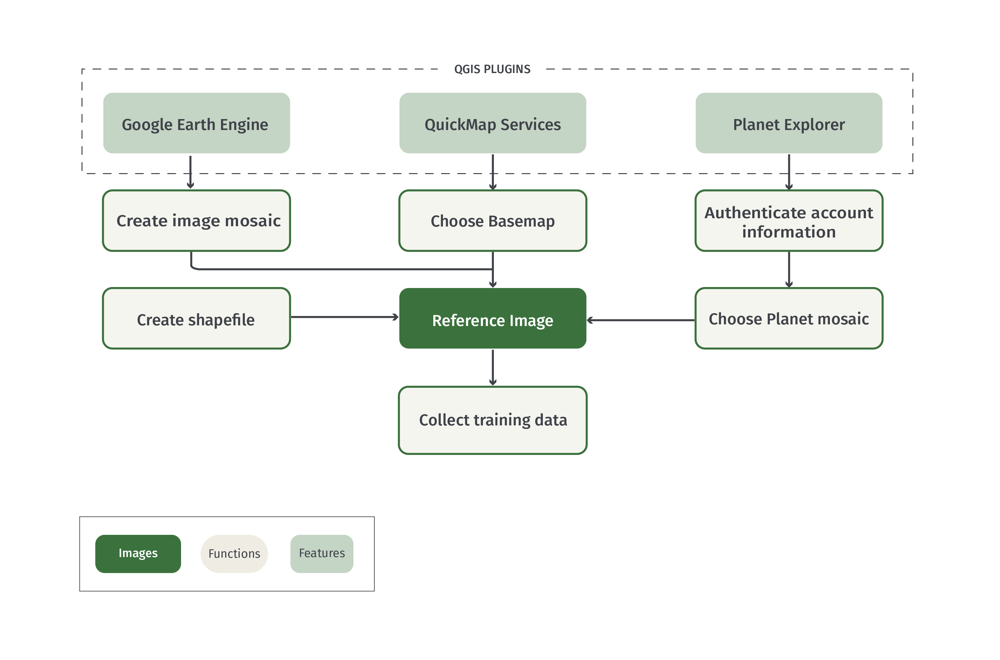
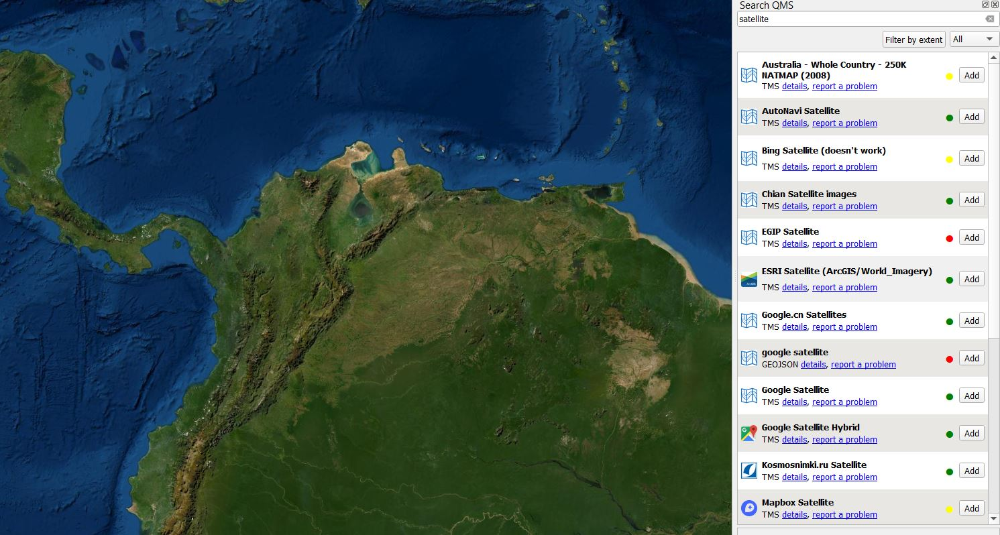
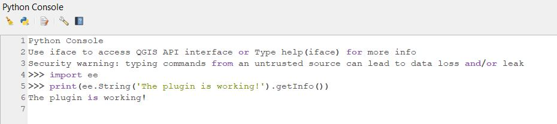
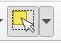
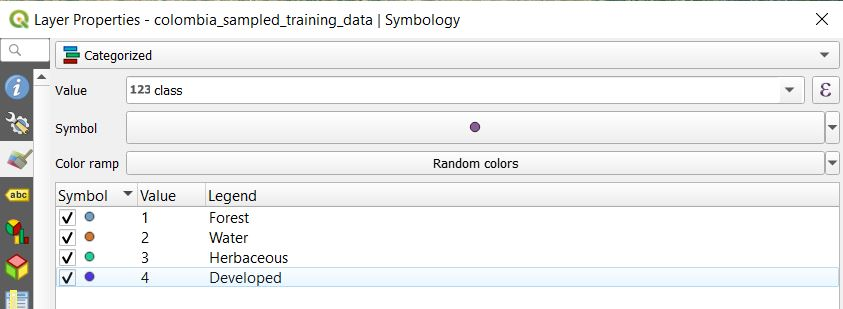
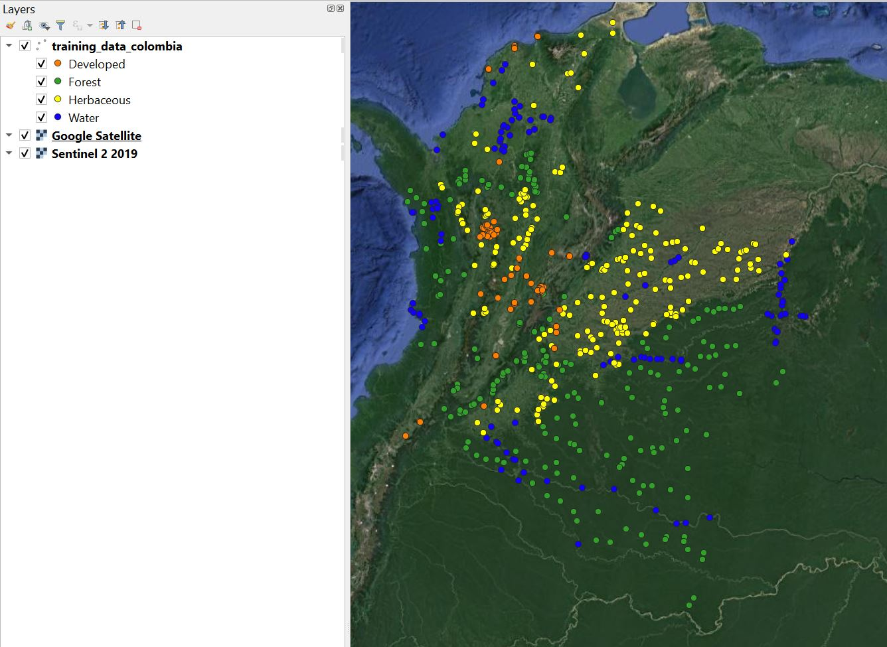
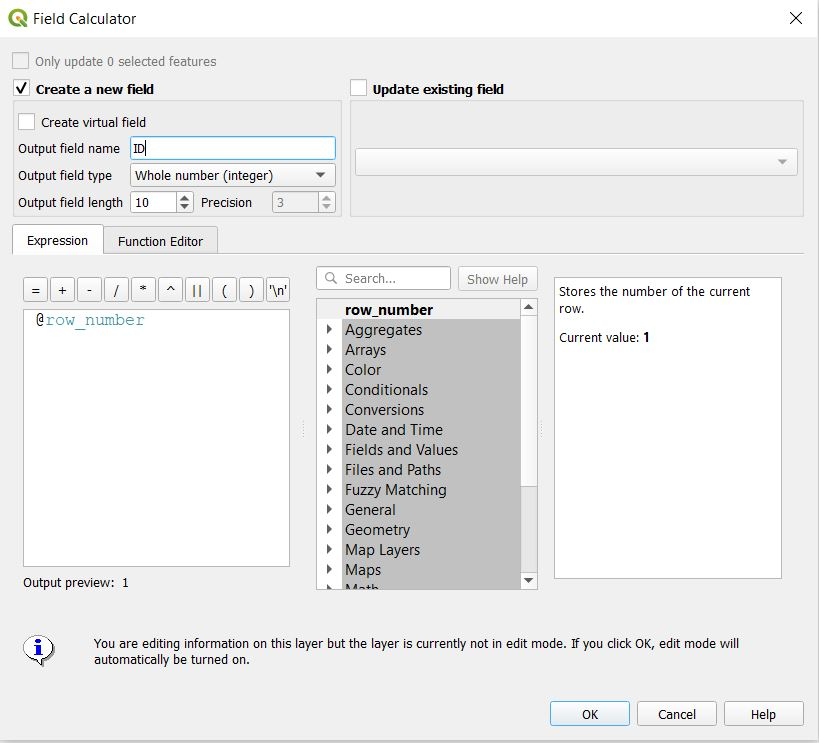
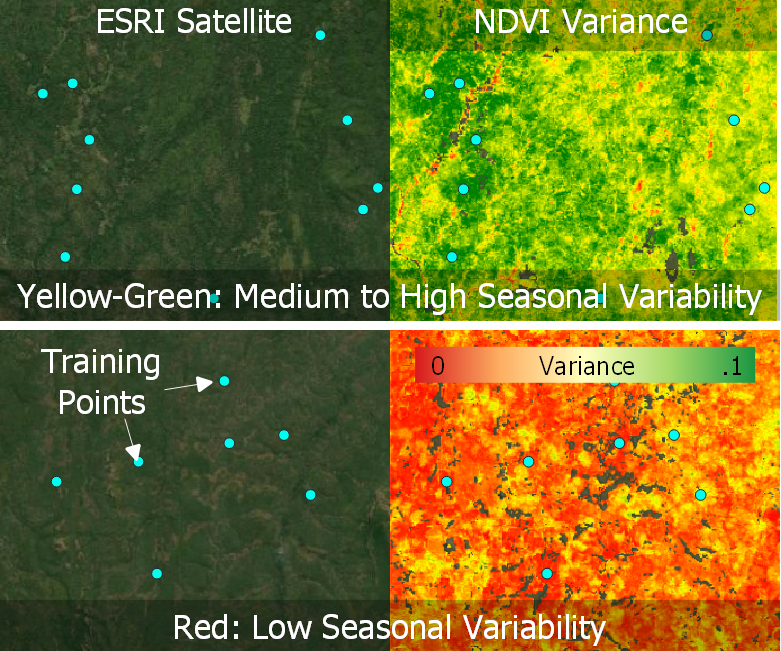

# 1.2.1 Training Data Collection Using QGIS

## 1 Background

Training data is instrumental to supervised image classification. The training dataset is a labeled set of data that is used to inform or "train" a classifier. The trained classifier can then be applied to new data to create a classification. For example, land cover training data will contain examples of each class in the study's legend, and based on these labels the classifier can be used to predict the most likely land cover class for each pixel in an image. This is an example of a categorical classification and the training labels are therefore categorical. By contrast, a continuous variable (e.g. percent tree cover) can be predicted using continuous training labels.

This tutorial will demonstrate how to collect categorical training data for land cover classification using QGIS. Users should adjust the various components to match their project objectives. Here, the process is demonstrated for the countries of Colombia, Mozambique, and Cambodia, and for a simple legend of four land cover classes: Forest, Water, Herbaceous, and Developed.  


### 1.1 QGIS

Quantum GIS (QGIS) is an open source GIS software that runs on Windows, Linux, and Mac OS X. Users should consult the [QGIS webpage](https:/qgis.org/en/site/forusers/alldownloads.html) for background information and installation instructions. Since there are many different ways to install QGIS, depending on your operating system, installation instructions will not be detailed here. If users are not able to install QGIS we recommend switching to [Module 1.2.2 Training Data Collection Using Google Earth Engine](Tenneson_TrainingData_GEE.md). 

This tutorial is based on the longterm release [Version 3.10.10](https:/docs.qgis.org/3.10/en/docs/user_manual/). For the core features of this tutorial, users will only need QGIS installed and an internet connection. For use of all the plugins described in this tutorial, users will need accounts with [Google Earth Engine](https:/signup.earthengine.google.com/#!/) and [Planet](https:/www.planet.com/login/?mode=signup) 

## 2 Learning Objectives 

At the end of this exercise, you will be able to:

- Create a new shapefile layer in QGIS.
- Load multiple sources of high resolution imagery to use as reference.
- Collect training data for a categorical classification. 

### 2.1 Pre-requisites for this module

* QGIS concepts
  * Installation
  * Creating, saving, and loading a project
  * Installing and using plugins
* Remote sensing concepts
  * Basic understanding on theories involved in image classification.
  * Defining a thematic legend

## 3. Training Data Collection

### 3.1 Overview

The process for collecting training data in QGIS are detailed in the steps below. The process can be generally described as three primary steps:

1. Creating a new shapefile layer for storing the training data.
2. Loading a basemap using a QGIS plugin.
3. Collecting the training data by manually defining training points. 


# <a name="creating-a-new-layer"></a>
### 3.2 Creating a new layer

This tutorial will demonstrate how to create training data that are point geometries. A similar process can be used with polygon data, but keep in mind that it is generally recommended to have more diverse training regions to minimize the effect of spatial autocorrelation. 

To start, we will need to define a new shapefile layer. 

1. Select *Layer* -> *Create Layer* -> *New Shapefile Layer...*.
2. Choose a filename to save your training data (in the example below I use the name 'training_data_colombia_v1.shp'. Choose a folder to save it in that you can easily access and remember. 
3. For *Geometry type* choose *Point*. 
4. Choose EPSG:4326 - WGS 84 for the projection. 
5. Delete the 'id' field by selecting it in the *Fields List* and selecting *Remove Field*.
6. Add a new field of type *Whole number* named 'class' by selecting *Add to fields list*. The *Length* of the field corresponds to the number of characters you can input, and the *Precision* is the number of digits. Choose atleast 2 for the field length. Since the type is *Whole number* we do not need to worry about precision. 

Your panel should look like this:


Click *Ok* and you should see that a new layer is added to the 'Layers' panel on the left of the screen. We will add to this layer in creating the training data. 

### 3.3 Load baselayers

Critical to the collection of training data is reference data, and for most purposes it is sufficient to use high-resolution imagery. Two critical factors in the selection of reference data are:

- The target classes can be distinguished through visible interpretation.
- The time of the reference imagery overlaps the input data used for classification.

Luckily, there are numerous sources of high resolution reference imagery available directly within QGIS. The specific imagery to use will depend on your study period and region, but in general it is recommended to use as much data as possible. 

The following plugins offer access to reference imagery. Each plugin works with QGIS Version 3.1.10. However, users of this tutorial should follow the instructions from the plugin creators to ensure proper installation. 

Users should consider the options below and decide a source of reference data that matches the time period and geographic extent of your study region. Here, the process is demonstrated for Colombia and for the year 2018.  


**Important Note:** We suggest users starting first with QuickMap Services, as it does not require an external account and is the most straightforward to install. Use of Planet and Google Earth Engine provides more flexible reference data, however the plugins are experimental and require accounts with both Earth Engine and Planet. If users cannot install any plugins, we suggest they switch to [Module 1.2.2 Training Data Collection Using Google Earth Engine](Tenneson_TrainingData_GEE.md). 

# <a name="quickmap"></a>
#### 3.3.1 QuickMap Services  

**Who**: [NextGIS](https:/nextgis.com/)

**What**: High quality basemaps (Google, ESRI, Mapbox, etc)

**When**: Varies

[Video Instructions](https://www.youtube.com/watch?v=p8G6zMWfi8o)

QuickMap Services is a service for accessing and sharing geospatial data. This plugin allows access to the full collection of data including high-resolution basemaps from Google, ESRI, and Mapbox. Most of this data are compiled from various sources, meaning the acquisition date for a specific location might not be known. However, these are high quality datasets and are recommended to be used for reference to supplement the imagery described below.  

**To use:** 

1. Add the QuickMap Services plugin by going to *Plugins* and *Manage and Install Plugins...* and searching *QuickMapServices* and clicking the *Install Plugin* button.
2. Open the QMS search panel by going to the *Web* toolbar -> *QuickMapServices* ->  *Search QGMS Panel*.
3. In the panel that appears on the right of the screen, search for 'Satellite' and choose a dataset by selecting *Add*. The basemap will be added to the map. In this example, the 'ESRI Satellite' layer was selected. You can navigate the map using your mouse, and zoom in and out with the mouse scroll bar.  



# <a name="planet-explorer"></a>
#### 3.3.2. Planet Explorer  

**Who**: [Planet](https:/www.planet.com/)

**What**: Daily imagery, monthly mosaics, biannual mosaics

**When**: After 2016

[Video Instructions](https://www.youtube.com/watch?v=wfhyk7f9kvo)

The Planet constellation of satellites offer daily high-resolution imagery in 3-4 spectral bands. While the data archive is not fully open access, a username and password allows you to browse daily imagery and view reduced-quality preview imagery. Furthermore, the Norway Ministry of Climate and Environment [reached an agreement](https:/www.planet.com/pulse/planet-ksat-and-airbus-awarded-first-ever-global-contract-to-combat-deforestation/) with Planet, Airbus, and Konsberg Satellite Services to provide access to high-resolution imagery across the tropics. At the time of writing, tools for accessing this data are in early stages of development. However, one way that Planet is supporting access of this data is through the QGIS Plugin *Planet Explorer*.  

**To use**:

1. Detailed instructions for installing the plugin can be found [on the Planet webpage](https:/developers.planet.com/docs/integrations/qgis/quickstart/). 
2. If you have not already done so, sign up for [Level 1 User Access here](https://www.planet.com/nicfi/).
3. Add the plugin panel by going to *Web* -> *Planet Explorer* -> *Planet Explorer*.
4. Select *Mosaic Series* in the plugin panel next to the Planet icon. 
5. Double click on one of the biannual or monthly mosaics to add it to the map. 


# <a name="gee"></a>
#### 3.3.3 Google Earth Engine (Advanced Usage)  

**Who**: [Google Earth Engine](https:/earthengine.google.com/) and Gennadii Donchyts. 

**What**: Most open access earth observation data (e.g. Landsat, Sentinel and MODIS). 

**When**: As early as 1972 for Landsat.

[Video Instructions](https://www.youtube.com/watch?v=-6mEL2VQtYw)

Google Earth Engine (GEE) is a cloud platform for analyzing geospatial data. Access to GEE is provided through a Javascript and Python API. While Google does not currently provide a QGIS plugin, recently Gennadii Donchyts released a beta plugin based on the Python API. This plugin allows for the incredible processing power and data storage of GEE with the user interface of QGIS. However it is also experimental and users should consult the [Github repository](https:/github.com/gee-community/qgis-earthengine-plugin) prior to use. 

**Prerequisites**

- [Google Earth Engine account](https://signup.earthengine.google.com)
- [Python 3](https://www.python.org)
- [Google Earth Engine Python API installed and authenticated](https://developers.google.com/earth-engine/guides/python_install)

**To use**:

1. Install the plugin using the [User Guide](https:/gee-community.github.io/qgis-earthengine-plugin/). 
2. Add the Python console by going to *Plugins* (top of application) -> *Python Console*
3. Browse example code in [the plugin repository](https:/github.com/gee-community/qgis-earthengine-plugin/tree/master/examples). It's also worth getting familiar with [Google Earth Engine](https:/developers.google.com/earth-engine/guides) if you are a new user. This tutorial does not cover GEE basics and users should consult [GEE documentation](https:/developers.google.com/earth-engine/guides) for advanced usage. 
4. In the Python Console, first load the GEE Python API:
    ```python
    import ee
    ```
    Your console should look like this:

     
5. Load the *Map* function from the ee_plugin module and test if it is working properly:

    ```python
    from ee_plugin import Map
    print(ee.String('The plugin is working!').getInfo())
    ```

6. Set the map view to the boundary of Colombia.

    ```python
    countries = ee.FeatureCollection("USDOS/LSIB_SIMPLE/2017")
    colombia = countries.filter(ee.Filter.eq('country_na', 'Colombia'))
    Map.centerObject(colombia, 8)
    ```

7. Create a Sentinel-2 composite for 2019 and add it to the map.

    ```python
    s1_collection = ee.ImageCollection("COPERNICUS/S2_SR")

    s1_composite = s1_collection.filterBounds(colombia) \
        .filterDate('2019-01-01','2019-12-31') \
        .median()

    vis = {'bands': ['B4', 'B3', 'B2'], 'min': 0, 'max': 1250}

    Map.addLayer(s1_composite, vis, 'Sentinel 2 2019')
    ```

    You should see a very cloudy image added to the map

     

8. Now let's try it again when applying the cloud mask prior to making the mosaic:

    ```python
    def maskS2clouds(image):
        return image.updateMask(image.select('QA60').eq(0))

    s1_composite_masked = s1_collection.filterBounds(colombia) \
        .filterDate('2019-01-01','2019-12-31') \
        .map(maskS2clouds) \
        .median()

    Map.addLayer(s1_composite_masked, vis, 'Sentinel 2 2019 Masked')
    ``` 
    

# <a name="collect"></a>
### 3.4 Collect training data

Once you have decided on reference imagery then it is time to start collecting training data. Going class by class, navigate your study region collecting point data. Here are a few considerations:

- Training data should be representative of your entire study region. This means that collecting more data across the study area is better than a few large training areas.
- Be sure to include examples on the edge of class boundaries (for example, the forest immediately adjacent to a non-forest land cover), as these areas will be most challenging to distinguish in the classification stage. 
- There is no magic number for an adequant number of training points. Be prepared for this to be an interative process in which you collect training data, perform your analysis, and then collect more training data to address misclassification errors. 
- Take your time - this dataset will be invaluable to your research and can be to others as well. 

1. Select the training data layer in the *Layers* panel.
2. Enable layer editing by selecting the button that looks like a pencil, *Toggle Editing* .
3. Select the *Add Point Feature* icon .
4. Define a numeric class code. Here, we will use 1 for Forest, 2 for Water, 3 for Herbaceous, and 4 for Developed.  
    
5. Starting with the Forest class, click on the map to add a training point. In the panel that shows on the map you will have the option to fill out the *class* field for the point you just added. Since we are starting with Forest, use the class code 1. Based on the class codes above, you should use 2 for Water, 3 for Herbaceous, and 4 for developed. 
    
6. Select *OK* to save the training point.     
7. Repeat for many Forest samples throughout your study region. It is advised to save the layer during the process by selecting the *Save Layer Edits* button. 
      
8. Sample units can be deleted by first selecting them with the *Select Feature(s)* button  and by clicking on a feature or dragging a box to select multiple features, and then clicking the *Delete* button . 
9. Continue this process for each target map class. 
10. Select the *Toggle Editing* button to stop editing the layer. 

### 3.5 Visualizing training data

Once you have collected training data for each class, it helps to style them to see the distribution across the study area. Ideally, you want to have training points that are representative of the variability in the classes. Here, that means that we want to have enough forest, water, herbaceous, and developed points to ensure they fully represent these classes across Colombia. 

1. Right class on the layer in the *Layer* panel and select *Properties*
2. On the left side of the *Properties* panel, select *Symbology*
     
3. Select *Categorized* for the symbol type. 
4. Under *Value* select the attribute containing the class label, in this case it is *class*
5. Select *Classify* to populate the symbology table. Optionally change the colors to your choosing. 
6. Check the *Legend* values to match our legend. Your panel should look like this:
    
7. Select *OK* to apply the style. 
8. Take some time to look at your sample and ensure there are not any major "gaps" in training data. 
    
 
### 3.6 Adding unique ID
It is useful to have a unique identifier for each training point. This can be added to the layer Attribute Table.

1. Right click on the layer name in the *Layer* panel and selecting *Open Attribute Table*. 
2. Add a new column by selecting the *Open field calculator*.
    
3. Under *Output field name* write 'ID'. 
4. Double click on the selector 'row_number'. Your panel should look like this:
    
5. Click 'Ok' and finish editing using the 'Toggle editing mode' button . 

## 4. Examples: Mozambique and Cambodia

**Advanced Usage**

The methods described above are demonstrated for the countries of Mozambique and Cambodia. The general process is the same as that demonstrated in Colombia. However, there are a few considerations for adopting the approach to the conditions of each country that are outlined below. Note that these additional steps are optional, and it is recommended to perform the training data collection using the steps above first. These examples will demonstrate how to collect training data in a manner that is robust to differing forest types and topography. The purpose is to improve the robustness of the training data, which can ultimately improve the quality of your land cover classification. Users should consider the climatic and topography conditions of their study region to determine whether these additional steps are necessary.   

### 4.1 Mozambique: Accounting for Seasonality

Mozambique is an ecologically diverse country that consists of a mix of tropical and temperate climatic zones. As a result, there are large swaths of both evergreen and deciduous forest ecosystems. In Colombia, we did not directly account for seasonal effects in forests because they encompass a relatively small proportion of the country. The area of deciduous forest is much higher in Mozambique, which can present a challenge for land cover classification due to intra-annual variability in reflectance between phenological stages. 

To illustrate this point, observe the temporal variability of the Normalized Difference Vegetation Index (NDVI) over the course of a year for a Landsat 30 meter pixel in a seasonal forest in Mozambique. NDVI is a spectral transform that is commonly used to analyze photosynthetically active vegetation. The rainy season in Mozambique lasts from around November to May. The figure on the left shows Mozambique with a pixel highlighted in red, and the middle image in the same but zoomed in. The right shows all available Landsat NDVI values for the pixel. Note in the chart below how NDVI is considerable higher during the rainy season than the dry season due to seasonal variability in the forest. 

  

Seasonal variability can present a challenge when performing land cover classification. For example, if we were to classify a dry season image in Mozambique, a deciduous forest could potentially be confused with herbaceous or non-forest land cover classes due to low vegetative greenness during a leaf-off period. To address possible confusion in the classification process, it is critical that the training data is representative of within-class variability (i.e. seasonal variability in forests or other vegetative classes). To put it simply, if there exists substantial areas of both deciduous and evergreen forests, then the training data for a broader 'Forest' class should contain examples of both. 

Here, our goal is to ensure that our 'Forest' class contains examples of different forest types, as indicated by their seasonal trajectories. There are many ways of doing this, and here we are going to use Google Earth Engine to look at intra-annual variability in NDVI.  

1. First, create a new Shapefile layer using the instructions in [3.2 Creating a new layer](#creating-a-new-layer).
2. Load the [Google Earth Engine](#gee) plugin.
3. Open the *Python Console* by navigating to 'Plugins' -> 'Python Console'. 
4. Use the instructions in [3.3.3](#gee) to load the required modules and navigate to Mozambique. If you need a refresher, the code to do so can be found below. 
    ```python
    import ee
    from ee_plugin import Map
    countries = ee.FeatureCollection("USDOS/LSIB_SIMPLE/2017")
    mozambique = countries.filter(ee.Filter.eq('country_na', 'Mozambique'))
    Map.centerObject(mozambique, 8)
    ```
5. Create a function to calculate NDVI using the Red (B4) and NIR (B8) bands of Sentinel-2 imagery. We will also need the cloud masking function introduced in 3.3.3.  
    ```python
    def doNDVI(image):
        return image.normalizedDifference(['B4','B8']).rename('NDVI')

    def maskS2clouds(image):
        return image.updateMask(image.select('QA60').eq(0))
    ```
6. Now, we can filter the Sentinel-2 collection into two groups: images during the peak of the dry season, and images during the peak of the rainy season. We can then [map](https:/developers.google.com/earth-engine/guides/ic_mapping) over the collections to apply the cloud masks and calculate NDVI.
    ```python
    s1_collection = ee.ImageCollection("COPERNICUS/S2_SR").map(maskS2clouds)

    dry_season = s1_collection.filterBounds(mozambique).filterDate('2019-09-01','2019-11-01').map(doNDVI)
    rainy_season = s1_collection.filterBounds(mozambique).filterDate('2019-01-01','2019-04-01').map(doNDVI)
    ```
7. To calculate seasonal variability, we can then combine these two collections and calculate the per-pixel NDVI variance using a [reducer](https:/developers.google.com/earth-engine/guides/reducers_intro). 
    ```python
    combined = rainy_season.merge(dry_season)
    variance = combined.reduce(ee.Reducer.variance())

    viz = {'min': 0, 'max': .1, 'palette': ['red','yellow','green']}
    Map.addLayer(variance, viz)
    ```
    
8. The map that is loaded is the seasonal variance in NDVI, in which red indicates less variability and green indicates more. 
9. One further step we can do to help in the identification of forests is to use an ancillary tree cover dataset to mask non-forest pixels. The UMD-Hansen global tree cover, loss, and gain dataset is perfect for this purpose. While it is not recommened to use this dataset directly as training data, it is a good tool for identifying possible forest or forest change locations. Here we will use the 'Tree Cover 2000' layer to mask our NDVI variance layer in pixels that were under 30% tree canopy cover in 2000. 
    ```python
    umd_hansen = ee.Image("UMD/hansen/global_forest_change_2019_v1_7").select('treecover2000')
    mask = umd_hansen.gt(30)
    variance_masked = variance.updateMask(mask)
    Map.addLayer(variance_masked, viz)
    ```
    
10. Now, as we're collecting training data for the 'Forest' class, it's important to reference this layer to ensure the training data accounts for differences in seasonal spectral variability in forests. First, let's review why it might be beneficial to perform the steps listed above: 
    - Some forests have seasonal patterns in productivity. 
    - We want to ensure our 'Forest' training data includes examples of all forest types in a study domain. 
    - An easy and preliminary way to accomodate seasonality in a classification is by providing representative training data.
    - GEE allows us to easily identify seasonal forests based on the variance in NDVI values over a year.
    - The UMD-Hansen dataset helps in training data collection by masking non-forest pixels.
11. It is necessary to add a standard basemap in addition to the NDVI layer. Any of the examples above can be used, with the simplest being the [QuickMap Services](#quickmap). Make sure that you can identify your classes in the imagery you use. If you cannot, try other sources of reference imagery or consider simplifying your classes. Below are examples of the classes used here in the ESRI Imagery available in QuickMap Services.
    
12. Using the directions described [above](#collection), go class by class collecting training points. For the Forest class, occassionally overlay the training points on the map of NDVI variance. There's no need to do any detailed assessment, but it is worth visually ensuring that the training samples represent the seasonal and non-seasonal forests. This can be done by simply alternating between red, green, and yellow areas on the NDVI variability layer, and flipping back and forth between that layer and the reference image to make sure the locations are actually forest. Note in the following example how there are training points (blue) in forests with differing seasonal variability (or NDVI variance).
    
13. Remember to save frequenty by selecting the *Save Layer Edits* button. 
14. When you are complete, finish editing by selecting the *Toggle Editing* button.
15. Optionally, you can then visualize the training data:
  

## 5. Cambodia: Accounting for Topography

The final example of training data collection in QGIS is for the country of Cambodia. Cambodia has a tropical monsoon climate with a rainy season from around May to October. In recent years, Cambodia has had a relatively high rate of land use change, often in the form of deforestation. 

Many of the remaining forests in Cambodia are located on hilly or mountanious terrain. Topography, however, can introduce a challenge to land cover classification. Because topographic features cast a shadow, the reflectance of the landscape within the shadow can be lower than a similar non-shadowed landscape. To reduce this effect, it is important to collect training data that is representative of the different topographic conditions of a study region. This example will demonstrate how to do just that. 

1. First, create a new Shapefile layer using the instructions in [3.2 Creating a new layer](#creating-a-new-layer).
2. We will use a terrain map in addition to reference imagery when collecting training data in this example. Using [QuickMap Services](#quickmap) search for two basemaps and add them to the map: Esri Imagery and Google Terrain Hybrid. 
3. Next, we will adjust the layer rendering parameters to "blend" these two layers together. Ultimately, the goal is to have a high resolution image that has exaggerated and visually apparent topographic features. 
4. In the *Layers* panel, make sure that the Esri Imagery layer is located above the Google Terrain Hybrid layer. The arrangement of the layers can be adjusted by selecting the layer with your mouse and dragging it to a new location within the panel. 
5. Open the *Layer Properties* panel for the Esri Imagery layer by either double clicking in its name in the *Layers* panel or right clicking and selecting 'Properties...'.
6. Select the *Symbology* panel by selecting it on the left side of the *Layer Properties* panel. 
7. Change *Blending mode* to 'Multiply' and click 'OK'. The two layers will be displayed as a blended composite. 
    Note the difference before and after blending the Esri Imagery layer with the Google Terrain Hybrid layer: 
    
8. The purpose of this is to simply make it easier to see topographic features in the reference imagery, so that it can be used as supplemental information when collecting reference data. Make sure to collect training samples for forest that vary by their topographic arrangement. For example, samples should be collected on terrain that differs in slope and aspect. This does not need to be precise, and can optionally be done for any land cover. An easy way to observe differences in terrain is based on the shadow in the reference image: 
     
9. Use the composite reference image to collect at least 100 training samples per class. Remember to save frequenty. When you are complete, finish editing by selecting the *Toggle Editing* button. 
     

## 6. Frequently Asked Questions

**Why are we using point geometries rather than polygons?**

Polygon data can also be used as training data, but keep in mind that spatial autocorrelation will result in redundant information derived from each polygon. We therefore recommend collecting point samples that are representative of the entirety of the data rather than a few polygons.  


**How should I choose what data to use as reference?**

The reference data should overlap in time and space with the data used in your analysis. If there are multiple data sources meeting this criteria, then the user should choose the data they find easiest to interpret based on their classification legend. 


**Does training data need to be derived under a probability-based sampling design?**

No, there is no need to obtain training data using a probability-based design. However, if training data was created this way (e.g. an interpreted simple random sample), there is no reason it cannot be used for classification. 


**How many points do I need for each class?**

There is no magic number for the number of training points for each class, but a good target is a minimum of 100/class. It is generally recommended to use an iterative process, in which additional training data is added after performing a classification, then the classification is created again the process repeats until the results are deemed adequate. 


**Can training data be split to use part for validation?**

If the training data were collected opportunistically, or in other words *not* using a probability sample, then it is generally not recommended to use it for validation since it will introduce bias. 


**Why can't I see my points on the map?**

Make sure that the layer is loaded in your 'Layers' panel. If it is not, it can be added by navigating to *Layer* -> *Add Layer* -> *Add Vector Layer*. If it is in the 'Layers' panel but not appearing on the map, make sure that it is located above any reference data that is loaded. 


**Why is it worth collecting training data for different forest types if we are just creating one forest class?**

It is not necessary, but can help to improve the classification. We want our training data to represent the spectral variability of our classes. An easy way to identify differences in forest types is through their seasonal variability. 


**My study area is flat, do I still need to worry about topography?**

No, there is no need to worry about topography in a completely flat study area. 


**I cannot get one of the plugins to load, what do I do?**

If you cannot get one of the plugins to load simply use one of the others. There are multiple plugins presented here to give users multiple options. 


**What do I do if I cannot install QGIS or get any of the plugins to load?**

Don't worry! This same tutorial is provided on Google Earth Engine in Module 1.2.2, which does not require any installation. 

  
This work is licensed under a [Creative Commons Attribution 3.0 IGO](https://creativecommons.org/licenses/by/3.0/igo/)

Copyright 2020, World Bank 

This work was developed by Eric Bullock under World Bank contract with GRH Consulting, LLC for the development of new -and collection of existing- Measurement, Reporting, and Verification related resources to support countries’ MRV implementation. 

Material reviewed by:  
Kenset Rosales, Guatemala, Ministry of Environment and Natural Resources  
Tatiana Nana, Cameroon, REDD+ Technical Secretariat  
Rajesh Bahadur Thapai, Nepal, International Centre for Integrated Mountain Development  
Kenset Rosales, Guatemala, Ministry of Environment and Natural Resources  
Sofia Garcia, Guatemala, Ministry of Environment and Natural Resources  
Jennifer Juliana Escamilla Valdez, El Salvador, Ministerio de Medio Ambiente y Recursos Naturales  
Foster Mensah, Ghana, Center for Remote Sensing and Geographic Information Services  
Ana Mirian Villalobos, El Salvador, Ministerio de Medio Ambiente y Recursos Naturales  
Carole Andrianirina, Madagascar, Bureau National de Coordination REDD+  
Phoebe Oduor, Kenya, Regional Center For Mapping of Resources for Development  
KONAN Yao Eric Landry, Cote d'Ivoire, REDD+ Permanent Executive Secretariat  
Paula Andrea Paz, Colombia, International Center for Tropical Agriculture  

Attribution
Bullock, E. 2020. Training Data Collection Using QGIS. © World Bank. License: Creative Commons Attribution license (CC BY 3.0 IGO)  

