# Module 2.3 Continuous Degradation Detection (CODED)

## 1.0 Background


#### 1.1 Forest Degradation

There is no internationally accepted definition of forest degradation, but it can generally be defined as a disturbance in a forest that reduces biomass, ecological productivity, and/or canopy cover but does not result in a land cover conversion. 

In the context of national greenhouse gas inventories, forest degradation represents a source of carbon loss in a similar manner to deforestation. Examples of activities that cause forest degradation include selective logging, non-natural forest fires, and fuelwood collection for household use. 

While deforestation has been the subject of intense debate on a global scale, forest degradation also contributes significantly to greenhouse gas emissions and reduces the ability of forests to provide essential products and services and mitigate climate change. However, monitoring forest degradation at the national to regional scale has proven to be challenging. Consequently, it is frequently omitted from national greenhouse gas inventories and represents a significantly underestimated source of carbon emissions and ecological damage. 

This tutorial will introduce a methodology for monitoring forest degradation called Continuous Degradation Detection (CODED). CODED was created for the specific goal of detecting forest degradation which, as will be described in the following sections, has proven challenging using traditional approaches to change detection. Application of CODED is performed on Google Earth Engine and demonstrated for case studies in Colombia, Mozambique, and Cambodia.  


#### 1.2 Learning Objectives

At the end of this module, you will be able to: 


*   Identify common drivers of forest degradation in moderate-to-high resolution satellite imagery 
*   Perform spectral mixture analysis with optical imagery and calculate the Normalized Difference Fraction Index (NDFI) 
*   Parameterize CODED to target different disturbance dynamics, forest types, and date availability 
*   Use CODED to create maps of degradation and deforestation

Advanced usage will also include:


*   Post-processing of results from CODED to increase change detection accuracy
*   Application of a modified version of CODED to use Sentinel-1 radar imagery 


## 2.0 Continuous Degradation Detection (CODED)


#### 2.1 Motivation

In the absence of robust field inventory, the only feasible way to do so is to use earth observation imagery, but the form degradation occurs on the landscape brings technical considerations that must be addressed. To start, any automated approach to classification of satellite imagery will inevitably contain errors. These errors can come from many factors, including unmasked clouds and cloud shadows, missing data (for example, due to the scan line corrector issue of Landsat 7), and classification errors (for example mis-classification of land cover or change classes). We also know that the humid tropics are especially susceptible to missing or contaminated data due to clouds. 

While this issue is not unique to mapping forest degradation, it is important to consider this context when attempting to automate an approach for large-area monitoring. Below, we can see a few years’ worth of Landsat imagery in a logged forest in the Central African Republic. The goal here is to extract meaningful information about changes in the forest, despite nearly every image being partially or entirely covered by clouds or missing data. Any effective approach to mapping disturbances in this landscape must accommodate noisy observations while also being sensitive to subtle changes in the forest canopy. 

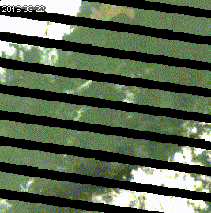


There are numerous approaches to dealing with noisy observations, such as filtering, compositing, and atmospheric correction. However, approaches based on filtering or smoothing of input data are not well suited for detecting degradation, since degradation is often visible for a short amount of time and over small areas. Note the example below of a fire in the Brazilian Amazon. The pixel highlighted in red is in a forest that burned around 2008. Signs of this fire are not visible much after the event due to regeneration. 


Looking again at the example of the Central Africa Republic, we can further see how ephemeral damage from degradation can be. Here, we can see signs of logging in high resolution imagery from Planet. However, just a few months later the forest has regenerated. The ephemeral nature of degradation implies that continuous monitoring is necessary rather than single-date analysis or compositing.


Furthermore, forest degradation often occurs at a spatial scale below the nominal scale of satellite imagery, meaning that spatial smoothing for the sake of noise reduction can further mix stable and disturbed forest signals. For example, below is an example of selective logging in Fiji. While there are obvious logging roads visible in the high resolution imagery, the majority of the landscape remains forest in the moderate resolution imagery. 


#### 

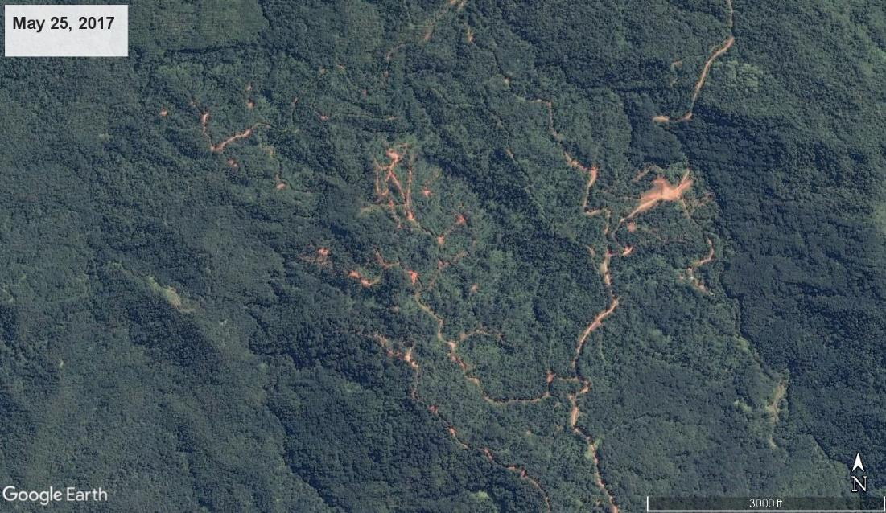


These examples demonstrate how the very nature of forest degradation represents a significant challenge for mapping using traditional approaches to remote sensing analysis. 


#### 2.2 Land Change Monitoring

In recent years, the land change monitoring community has increasingly adopted the notion that time series analysis can alleviate many of the issues that arise in single-date analysis. Time series approaches are able to monitor trends through time, which helps to distinguish subtle land changes from noisy and characterize both abrupt and gradual changes. While change monitoring has a long history in fields such as econometrics, signal processing, pattern recognition, and environmental modeling and forecasting, application in the remote sensing domain is relatively new. 

Time series approaches to change monitoring have greatly benefited from a few developments in the remote sensing communities, including:


*   Free and open data access from agencies such as the USGS, NASA, ESA, and JAXA
*   Consistent and repeated data archives spanning multiple years or decades
*   High performance cloud computing environments such as Google Earth Engine and Amazon Web Services
*   Novel change detection methodologies based on dense time series data
*   Standardized pre-processing in support of data collections 

Notable early applications of time series analysis for land change monitoring include LandTrendr (Kennedy e tal., 2010), BFAST (Verbesselt et al., 2010), Vegetation Change Tracker<sup> </sup>(Huang et al., 2010), and Continuous Change Detection and Classification<sup> </sup>(Zhu and Woodcock, 2014). These approaches have their unique advantages and helped to lay the groundwork for the CODED.


#### 2.3 Algorithm Overview


The CODED methodology has three primary components (see Bullock et al., 2020 for more information):


1. Pre-processing of optical imagery to mask clouds and transform reflectance into spectral endmember fraction images 
2. Change detection using regression-based break detection 
3. Change attribution into deforestation or degradation using training data and machine learning classifier 


#### 2.4 Spectral Mixture Analysis

During pre-processing, input data is transformed into endmember fractional images using spectral mixture analysis (SMA). Spectral unmixing has been shown in a variety of environments to be sensitive to sub-pixel land changes, making it ideal for the detection of small scale degradation events. Application of SMA for mapping degradation was demonstrated in the Brazilian Amazon in the work of Dr. Carlos Souza Jr. (e.g. Souza et al., 2005) which introduced the mixture model used by default in CODED. 

The SMA model used in CODED transforms reflectance into the pixel-scale proportion of green vegetation (GV), soil, non-photosynthetic vegetation (NPV), shade, and cloud. These layers can then be used to calculate the Normalized Difference Fraction Index (NDFI), which is a fractional-image transform first introduced in Souza et al. (2005) and demonstrated to be sensitive to sub-pixel damage from logging or fires. 

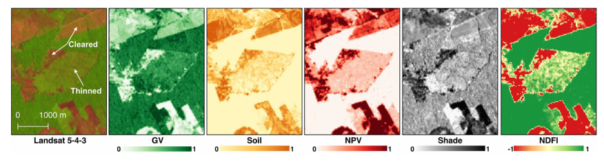


**Try it yourself**

Before diving into the more complex usage of CODED, it is worth looking at the fractional image results from SMA on individual images. The following Javascript code can be used in Google Earth Engine. The full code for SMA can be found in the Open-MRV repo in the file 'CODED/Unmix'. You can also find more information on interpreting the layers created in this step in the complementary [YouTube Video Instruction](https://youtu.be/lOv88wkyEnY). 

First, load a Landsat 8 image for a study region in Colombia and add it to the map. The study area is defined as a feature collection  in the 'studyArea' variable. 

```javascript
var studyArea = ee.FeatureCollection('users/openmrv/MRV/ColombiaRectangle')

Map.addLayer(studyArea)
Map.centerObject(studyArea)
```

Next we can load the Landsat 8 collection and apply the cloud mask using a defined function 'maskL8sr'. 

```javascript
var landsat8 = ee.ImageCollection("LANDSAT/LC08/C01/T1_SR").filterBounds(studyArea)


function maskL8sr(image) {
  var bandList = ['B2', 'B3', 'B4', 'B5', 'B6', 'B7']
  var nameList = ['BLUE', 'GREEN', 'RED', 'NIR', 'SWIR1', 'SWIR2']
 
  var cloudShadowBitMask = 1 << 3;
  var cloudsBitMask = 1 << 5;
  var qa = image.select('pixel_qa');
  var mask = qa.bitwiseAnd(cloudShadowBitMask).eq(0)
	.and(qa.bitwiseAnd(cloudsBitMask).eq(0));
 	 
  return image.updateMask(mask).divide(10000)
	.select(bandList).rename(nameList)
	.copyProperties(image, ["system:time_start",'CLOUD_COVER']);
}

var l8Masked = landsat8.map(maskL8sr)
```

To find a relatively cloud-free image to apply SMA, we can sort the collection by the 'CLOUD_COVER' metadata property and use the first image in the collection (i.e. the image with the lowest value for 'CLOUD_COVER'). 
var l8Image = l8Masked.sort('CLOUD_COVER',true).first()

```javascript
Map.addLayer(l8Image.select(['RED','GREEN','BLUE']), {min: 0, max: .14}, 'RGB Image')
```

Note that the image only partially overlaps our study area. For this exercise that is okay, because the purpose is just to look at any single fraction image. To do so, we can calculate fraction images using the spectral endmembers defined in Souza et al., 2005 and add each fraction image to the map. 

```javascript
// Define the spectral endmembers in units of reflectance
var endmembers = {
  gv: [.0500, .0900, .0400, .6100, .3000, .1000],
  shade: [0, 0, 0, 0, 0, 0],
  npv: [.1400, .1700, .2200, .3000, .5500, .3000],
  soil: [.2000, .3000, .3400, .5800, .6000, .5800],
  cloud: [.9000, .9600, .8000, .7800, .7200, .6500],
}

// Define color palettes for visualization

var palettes = {
  gv: ['#ffffcc','#c2e699','#78c679','#31a354','#006837'],
  shade: ['#f7f7f7','#cccccc','#969696','#636363','#252525'],
  npv: ['#ffffb2','#fecc5c','#fd8d3c','#f03b20','#bd0026'],
  soil: ['#ffffd4','#fed98e','#fe9929','#d95f0e','#993404'],
  cloud: ['#ffffcc','#a1dab4','#41b6c4','#2c7fb8','#253494'],
  ndfi: ['#d73027','#fc8d59','#fee08b','#ffffbf','#d9ef8b','#91cf60','#1a9850']
}

// Perform unmixing on Landsat 8 image. 
var unmixedImage = ee.Image(l8Image).unmix({
  endmembers: [endmembers.gv, endmembers.shade, endmembers.npv, endmembers.soil, endmembers.cloud],
  sumToOne: true,
  nonNegative: true
}).rename(['GV', 'Shade', 'NPV','Soil','Cloud'])

// Add each fractional image to the map
Map.addLayer(unmixedImage.select('GV'), {min: 0, max: .6, palette: palettes.gv}, 'GV')
Map.addLayer(unmixedImage.select('Shade'), {min: 0, max: .6, palette: palettes.shade}, 'Shade')
Map.addLayer(unmixedImage.select('NPV'), {min: 0, max: .6, palette: palettes.npv}, 'NPV')
Map.addLayer(unmixedImage.select('Soil'), {min: 0, max: .6, palette: palettes.soil}, 'Soil')

//Finally, we can calculate NDFI on the endmember fraction images and add the NDFI data to the map. 

var ndfi = unmixedImage.expression(
  '((GV / (1 - SHADE)) - (NPV + SOIL)) / ((GV / (1 - SHADE)) + NPV + SOIL)',
  {'GV': unmixedImage.select('GV'),
  'SHADE': unmixedImage.select('Shade'),
  'NPV': unmixedImage.select('NPV'),
  'SOIL': unmixedImage.select('Soil')}
)

Map.addLayer(ndfi, {min: 0, max: 1, palette: palettes.ndfi}, 'NDFI')

//The example below is a zoom-in the results that can be navigated to by defining the image boundary as a geometry:


var geo = ee.Geometry.Polygon(
    	[[[-73.84809238658222, 2.093131559229626],
      	[-73.84809238658222, 2.047928319636153],
      	[-73.8027737830666, 2.047928319636153],
      	[-73.8027737830666, 2.093131559229626]]])

Map.centerObject(geo)
```

Note the disturbed patch of land in the middle of the geometry. The clearly non-forest pixels have a high NDFI (red), low Shade (white), high NPV (red) and moderate GV (light green), while the damaged forest pixels on the right have a moderate NDFI (yellow), and dense forest has a high NDFI (green), high GV (green), and high shade (black). 


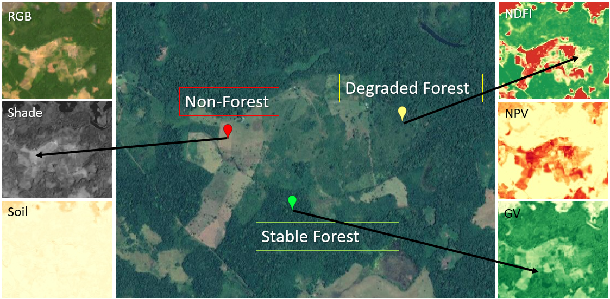


#### 2.5 Temporal trajectories

CODED performs SMA for every available Landsat image in the study region. It then performs change detection using the time series NDFI trajectories. Let’s look at a few examples of what the time series of NDFI looks like for degradation and deforestation. Note that in these figures the y-axis is scaled by 10,000. 

NDFI is high (~1) for dense forests, lower (0-1) for open or degraded forests, and lowest (-1 - 0) for non-vegetative landscapes. The following figure shows an NDFI trajectory for a deforestation event. In each of the following examples, the red and green vertical lines on the plot represent the year of the deforestation or degradation event, respectively. Note that before the deforestation event, NDFI is around 1 because it is a dense and stable forest. After the forest is converted to a pasture, NDFI drops suddenly and the oscillates between -1 and 1 seasonally. 


Now contrast this with an example of degradation due to selective logging. Note that the change in NDFI due to the disturbance is relatively small, and there is a clear recovery signal due to forest regeneration. 


Finally, we see in the following figure an example of a forest affected by fire. Note that here the canopy damage was rather dramatic, as evident in the large reduction in NDFI after the disturbance. However, there is once again a clear regeneration signal and it is clear from the time series that there was no land cover conversion. 


**Try it yourself**

It is relatively straightforward to plot the temporal trajectories of NDFI on Google Earth Engine. This can be a useful exercise to understand the land use history of a location in addition to the spectral response to landscape changes. To do so, it is necessary to first calculate NDFI for an entire image collection, and then define a function for plotting NDFI at location selected on the map. 

**Note**: This code can be found in the Open MRV repo in the script "CODED/Unmix Time Series" (Link???). A complementary video demonstrating this process can be found on [YouTube here](https://youtu.be/chr626cFl78).  

```javascript
// Define a function for SMA and calculate or NDFI
var unmixAndNDFI = function(image) {
  var unmixedImage = ee.Image(image).unmix({
	endmembers: [endmembers.gv, endmembers.shade, endmembers.npv, endmembers.soil, endmembers.cloud],
	sumToOne: true,
	nonNegative: true
  }).rename(['GV', 'Shade', 'NPV','Soil','Cloud'])
 
  var ndfi = unmixedImage.expression(
	'((GV / (1 - SHADE)) - (NPV + SOIL)) / ((GV / (1 - SHADE)) + NPV + SOIL)',
	{'GV': unmixedImage.select('GV'),
	'SHADE': unmixedImage.select('Shade'),
	'NPV': unmixedImage.select('NPV'),
	'SOIL': unmixedImage.select('Soil')}
  ).rename('NDFI')
  return image.addBands([unmixedImage, ndfi])
}

// Map over the Landsat 8 collection and calculate NDFI
var ndfiCollection = l8Masked.map(unmixAndNDFI).select('NDFI')
```

The following code demonstrates how you can create a geometry from the location clicked on the map ("var point"), and plot the NDFI time series ("var chart") for all data intersecting that location. The plots have a callback function that will load the corresponding image to the map when an observation is selected on the plot. 

```
// Function to make an NDFI plot at the clicked location
var makeImagePlot = function(col, region){
  var chart = ui.Chart.image.series(col, region, ee.Reducer.mean(), 30)
	.setOptions({
  	lineWidth: 0,
  	pointSize: 6,
 	});
	 
  // Callback function to add clicked image to map. 
  chart.onClick(function(x, y, sName) {
	if(x) {
  	var im = l8Masked.filterMetadata('system:time_start','equals',x)
  	Map.addLayer(im.select(['RED','GREEN','BLUE']), {min: 0, max: .14}, 'Image ' + x)
	}
    
  });
  print(chart)
}

// Callback function when clicking on the map. 
Map.onClick(function(coords) {
  var point = ee.Geometry.Point([coords.lon, coords.lat])
  makeImagePlot(ndfiCollection, point)
  Map.addLayer(point)
})

```

To help in understanding the response of NDFI to different degradation events, we have been building a library of example points across the globe. These examples will continue to be updated, and demonstrate what the NDFI time series of different degradation events look like in different environments. 


**Try it yourself**

A time series viewer of the degradation examples can be found in the 'OpenMRV' repo in the file 'CODED/Time Series Examples': 

Once you have loaded the script into GEE, click the "Run" button to initialize the graphical user interface.

This is a relatively simple tool that only allows for visualization of pre-defined NDFI time series. We have manually labeled the disturbance type, which can be selected using the first dropdown menu. The second dropdown menu defines the image stretch to use when adding a Landsat image to the map interface. 

The image below describes the functionality of the tool:

Disturbance type can be selected using the first dropdown menu. 
The user can navigate examples using the 'Next' and 'Previous' buttons in the 'Navigator' widget. 
For each time series, the corresponding NDFI and SMA time series are displayed on the right. 
Selecting an observation on the time series will load the corresponding image to the map.
The image stretch can be changed using the second dropdown menu. 

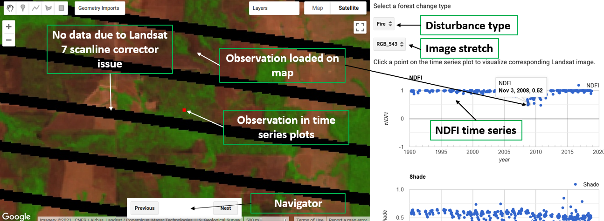

The previous example is the same example used in the introduction. This a typical degradation signal in a temperate forest with many Landsat observations. Before the disturbance, the NDFI is very stable and around 1. There is an obvious decrease in NDFi for around a year, but the forest quickly regenerates and NDFI appears similar to the pre-disturbance forest by around 2012. 
Lets look at a few other examples from this tool in a bit more detail.  The following example shows a selective logging event. Note the brief and minimal change in NDFI due to the disturbance. 


The following example shows an initial clearing for mining exploration. Since the trees in the forest are entirely cleared, the NDFI signal is dramatic. However, the pixel is able to regenerate quickly after the initial clearing and within two years the NDFI returns to a similar pre-disturbance level. 


Compare the previous example of a mine that regenerates as forest to the following example of a permanent mine. Note how in this example there are no signs of recovery. 


#### 2.6 Change Detection

The regression models are used to predict observations within a moving window. If the residuals of the observations in the window exceed a critical value, then a change is detected. Note below the triangles are the observations in the moving window. The blue triangles are the predicted observations, while the yellow and red represent low and high magnitude changes, respectively. The process then repeats with a new regression fit to subsequent observations. 


Change Detection Parameters

The change detection component has two important parameters, both of which are equivalent to the parameters sharing the same name in the GEE implementation of Continuous Change Detection and Classification (CCDC). CCDC is a similar change monitoring algorithm that is more general to all types of land cover and use change. CODED can be thought of as a modified version of CCDC that uses spectral unmixing to target changes due to forest disturbance. 
The first change detection parameter, Consec, defines the number of consecutive observations exceeding a change threshold required to trigger a change. If Consec = 5, then there need to be five consecutive observations exceeding the change threshold to trigger a change.  A lower Consec value is recommended for study areas with low data availability or for finding changes that are visible from above for a short duration. An example of the latter would be a selective logging event that, due to canopy regeneration, can only be seen from above for a few weeks or months. Reducing the Consec parameter may help in finding change, but will also make the results more susceptible to errors of commission due to unmasked clouds or cloud shadows. 
The second change detection parameter defines the change test statistic and change threshold. The change test statistic <i>f<sub>i,mn</sub></i> for model m and observation yi can be defined as:  
 


Where <i>y<sub>p</sub></i> is the predicted NDFI value at time <i>i</i> and <i>RMSE<sub>m</sub></i>  is the root mean squared-error of regression model *m*.  An observation is identified as potential change if: 
 
&space;*&space;-1))

In which *chi2 ppf* is the probability density function of the *chiSquareProbability* with 1 degree of freedom. A change is then flagged if there are *Consec* potential change observations in a row. A change is detected only when f<sub>i,mn</sub> is under the negative chi2 ppf because CODED only flags changes that result in a decrease in NDFI (i.e. containing a large and negative test statistic). 
A lower *chiSquareProbability* has the effect of increasing the sensitivity of CODED to change, thus finding more changes than using a higher *chiSquareProbability*.


#### 2.7 Change Attribution

Disturbances are attributed as deforestation or degradation based on the land cover after the disturbance. If there is a conversion from forest to non-forest (e.g. pasture, settlements, or agriculture), the disturbance is considered deforestation. If regeneration begins after the disturbance and there is no land cover conversion then the disturbance is labeled degradation. This attribution process can generally be described according the following flowchart:


## 3.0 Running CODED with a Graphical User Interface

CODED can be run using a graphic user interface (GUI) named the ‘Forest Disturbance  Mapping GUI’, which can be found in the Open MRV repository. Note that the version in the repo is a “snapshot” in time and the most recent version can be found here: [https://coded.readthedocs.io](https://coded.readthedocs.io). Video instructions on using the Forest Disturbance Mapping GUI can be found [on YouTube](https://youtu.be/crUTTZS1faI). 

**Note:** The tool also depends on external libraries. If you receive an error “Cannot find required repo” that indicates that a link to a repository is broken. If that is the case, please refer to the CODED ReadTheDocs page. 

This section provides an overview of the application and its functionality, and the following section demonstrates examples of using the application. Note that users should use this section as reference, and follow along with the examples in Colombia, Cambodia, and Mozambique. 

After adding the repo, you should see a “coded” folder in your “Scripts” panel under “Reader”:


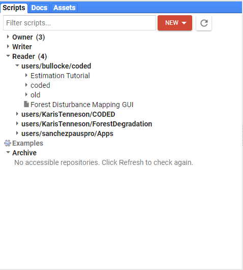


Figure 1 is an image of what your screen should look like. If you do not see this, navigate to the scripts tab in the upper left hand corner of the GEE interface. Expand the Reader tab, then click on the script called **Forest Disturbance Mapping GUI**. 

You may then need to Click on Run to initiate the script to load in the browser. Note, it may take a few moments for the GUI to appear in the browser. 


Then it will prompt you to choose your language. After the language has been set, your browser should look similar to the following Figure, however B, D, and E will not display until after running CODED.

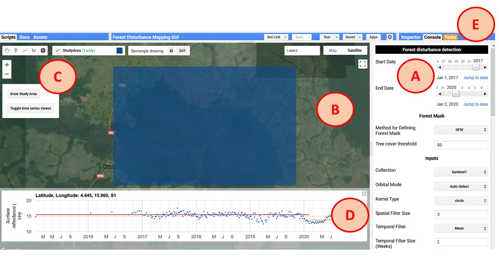

As can be seen in Figure 1, the application contains various components that are labeled according to the letters in parentheses below:

**Parameter panel (A)**


*   On the right of the screen is the parameter panel. This panel contains widgets that control all aspects of the mapping process including the input data, pre-processing, change detection parameters, post-processing, visualization, and exporting.

**Map panel (B)**


*   The map displays the results of the change detection and can be used interactively to define the study area using the map controls and display historical trajectories of clicked locations. 

**Map controls (C)**


*   The map controls contain two buttons: ‘Draw Study Area’ and ‘Toggle time series viewer’. After clicking the first button, a geometry import is created named ‘StudyArea’. Use this box to define the study area of your analysis. The study area can be reset by clicking the button. The second button is used to display or remove the time series panel from the map. 

**Time series panel (D)**


*   The time series panel displays the temporal trajectory of the collection defined in the parameter panel. The band that is visualized can be defined under the visualization parameters. Each point in the scatter plot represents one observation from the location clicked on the map. When clicking on a point on the scatter plot, the corresponding image will be loaded to the map. Band combination and stretch options for the displayed image can be changed in the visualization section of the parameter panel. 

**Task tab (E)**


*   A default feature of the GEE web interface, the task tab is used to submit jobs for processing. Tasks can be used to export images and feature collections as assets or to external storage such as Google Drive.


## 4.0 Parameterization


#### 4.1 Forest Mask

A forest mask can be used that determines the valid pixels for mapping forest disturbances. Areas defined as non-forest will not have any disturbances mapped to them. There are currently two approaches to defining a Forest/Non-Forest (FNF) mask, or you can choose not to use a mask and assume all pixels in the study region can potentially contain a disturbance. 

**Asset**


*   The first option allows you to use an existing image asset as a Forest/Non-Forest mask. Specify the path to the image in the textbox that appears after selecting ‘Asset’ in the ‘Forest Mask’ dropdown widget. 
*   The FNF mask asset must have values of 1 indicating valid (forest) pixels, and zero or null indicating invalid (non-forest) pixels. 
*   By default, this option uses the image geometry as the study region. The study area can be manually overridden using the study area selection widget. 

**Global Forest Watch (GFW)**

*   The second option uses the 2000 tree cover percentage layer of the Hansen et al (2013)/Global Forest Watch dataset. This option requires you to manually define the study area (next section). 
*   The GFW layer is in units of percent tree cover for the year 2000. After selecting ‘GFW’ in the dropdown menu, specify the minimum tree cover to be labeled as forest. All pixels not meeting this threshold are assigned to the non-forest class. 
*   There is an option to ‘Mask Prior to Start Date’. This masking is performed using the GFW tree cover loss and year layers. The purpose is to turn all pixels mapped as “Tree Cover Loss” prior to the “Start Date” to non-forest. In other words, if your start date is 2005, and the GFW dataset maps change between 2000 and 2005, then those pixels will not be included in the forest mask. 


#### 4.2 Defining a Study Area and Time Period


*   The study area is set by pressing the button with the text ‘Draw Study Area’ on the left side of the map (Figure 1). Once pressed, a geometry titled ‘StudyArea’ appears in the Geometry Imports. Use the map to draw a bounding box, which will be the extent of the analysis. 

**Tip:** A large study area might cause the computation to time out. If that happens, try exporting the results by submitting a task (see Exporting section below).


<table>
  <tr>
   <td>


   </td>
   <td>

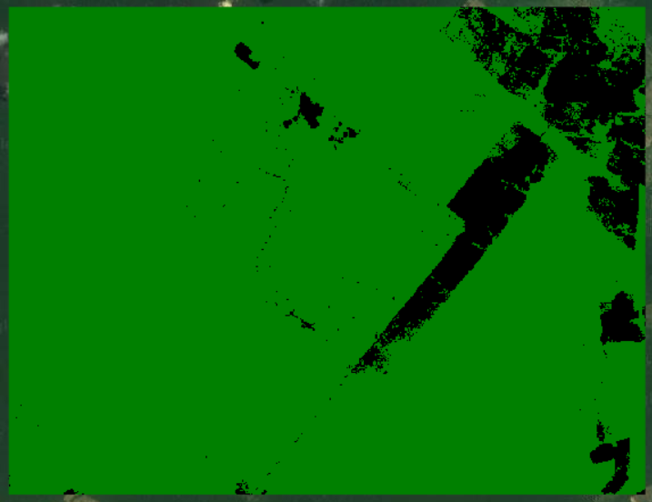

   </td>
  </tr>
  <tr>
   <td colspan="2" ><em>An example study area as defined by the geometry import layer ‘StudyArea’ (left) and the corresponding FNF mask using the GFW option with a tree cover threshold of 80% (right). </em>
   </td>
  </tr>
</table>


*   In the Parameter panel (Figure 1, A), you can specify the start and end dates for the analysis. These dates will filter the data used for change detection. The ‘Jump to date’ link allows for date selection on a calendar. 


#### 4.3 Inputs

*   Currently, the application provides support for using either Landsat, Sentinel 2, or Sentinel-1 data as the basis for change detection and attribution. The appropriate inputs to use for your study depend on the specifics of your study and the data available in your study area. Generally speaking, Landsat will be more sensitive to subtle disturbances in areas with sufficient data but is subject to masked or faulty data due to clouds. 
*   Each input collection can be filtered by day of year (DOY). For example, a ‘Start DOY’ of 152 and ‘End DOY’ of 244 will use all imagery between June 1 and September 1 and within the years of the study time period. 
*   The collections can also be temporally “smoothed” using an ee.Reducer by selecting ‘Temporal Filter’ and ‘Temporal Filter Size’ parameters. For example, a ‘Temporal Filter’ of ‘Mean’ and ‘Temporal Filter Size’ of 2 would create 14-day composites by calculating the mean for each pixel for all data within the 14-day period. 


#### 4.4 Change Detection

CODED can be modified using three parameters: These parameters are displayed after selecting ‘CODED’ for the Change Detection method. 


<table>
  <tr>
   <td><strong>Parameter</strong>
   </td>
   <td><strong>Description</strong>
   </td>
  </tr>
  <tr>
   <td>chiSquareProbability
   </td>
   <td>The chi-square probability of detecting a change [0-1]. 
   </td>
  </tr>
  <tr>
   <td>Consecutive Obs
   </td>
   <td>## of consecutive observations beyond change probability to flag a change
   </td>
  </tr>
  <tr>
   <td>Change Band
   </td>
   <td>Band to use in change detection test. Currently, only NDFI is supported. 
   </td>
  </tr>
</table>


#### 4.4 Change Attribution


**Sampling**


*   With this method, the FNF mask is sampled and used as training data to classify the time segment after the first disturbance. The class labels are defined from the FNF mask, while the predictor data is sampled from the CODED results. 
*   If the time segment after the disturbance is forest, the disturbance is labeled as degradation. If it is non-forest, then that is evidence of a land cover conversion and the disturbance is labeled as deforestation. If the segment cannot be classified due to insufficient data then it is labeled as an unknown disturbance. 
*   There are only two parameters that need to be specified for sampling. The first is the number of training points to allocate to each class (forest and non-forest), and the second is the year to train the classifier on. The year must be within the study period. Pixels that undergo a spectral change will not be used for training. 
*   **Note:** This option should be selected in the absence of manually-defined training data. However, since it is derived from a global dataset, it is likely to be less accurate than manually defining training data. 

**Training data**

*   With this method, the users can manually specify training data to classify the post-disturbance land cover. 
*   This option requires the user to specify a path to the training data as a ee.FeatureCollection of points with land cover labels. There can be an unlimited number of classes, but exactly one must be forest. 
*   The training year represents the year that the training locations correspond to the associated land cover label. 


#### 4.5 Post-Processing


*   Post-processing of the map results is a good way to remove spurious changes due to noise (such as unmasked clouds) or real changes that are not due to disturbance. 
*   Currently, the only post-processing step implemented is the use of a threshold on change magnitude. Change magnitude relates to change in data space. For example, a disturbance that causes a large change in NDFI will have a larger change magnitude than a subtle change that results in a minor change in NDFI. The units of change magnitude are the residuals during the model change window normalized by the model root-mean-squared error. 
*   The units of change magnitude can be hard to wrap your head around, but in general a larger threshold will remove more changes, and a threshold of 0 will remove no changes.  For example, A value of 1 would filter very low-magnitude changes, while a value of 8 would filter everything but high-magnitude change. 


#### 4.6 Visualization

**Add Forest Mask Layer**


*   Add the Forest/Non-Forest mask layer to the map. Forest pixels will show in green, while non-forest will be black. 

**Add Break Date**


*   Add the date of the first detected change as a layer to the map. 

**Add Stratification**


*   Add stratification to the map. 

**Center Zoom**


*   Center the map zoom on the study area. 

**Mask Results**


*   Apply the Forest/Non-Forest mask to the results. All areas labeled as non-forest will be masked in the results. 

**Reset Map**


*   Reset the map layers. 

**Verbose**


*   Print messages to the console. 

**Asset path**


*   Path to an Earth Engine Table or Image that can be loaded to the map for reference. 

**Load asset**


*   Load the asset specified in the ‘Asset path’ widget to the map. 

#### 
    


#### 4.7 Exporting

**Raw (Change) Output**


*   This represents the raw outputs exactly how they appear from the change detection algorithm (e.g. CCDC). No post-processing is performed nor is any sort of land cover classification or change attribution. 

**Forest Change Information**


*   This represents multiple bands related to pixels identified as forest disturbance. The bands contain the disturbance date (band 1) and magnitude of NDFI (CODED), and VH (Sentinel-1) (band 2). 

**Stratification**


*   This layer represents a single-band stratification of the study area according to disturbance and land cover history over the study period. The pixel values correspond to stable forest (1), non-forest (2), deforestation (3), degradation (4), and unknown disturbance (5). 

**Use Grid**


*   For big study areas, it helps to split up the tasks into subsets. This option will split the study area into approximately 5x5 degree grids to enable quicker processing. When working at the national scale, it is recommended to use this option to prevent overloading the GEE system. 


#### 4.8 Interpreting the Results

**Time Series Viewer**


*   The second button on the map control panel ("Toggle time series viewer") will add and remove the time series viewer from the map.


*   The time series with the model fit can be displayed for any location by clicking on the map. In the example above, the change date layer from Landsat/CODED is shown on the map for a location in the Democratic Republic of the Congo. 
*   To view the image for a specific data value on the chart on the map, simply click on it in the time series viewer.
*   **Notes**
    * It may take a while for the chart to generate. The window will note that it is processing with the message "Processing, please wait". 
    * If the chart does not display that message nor update, it may be that your cursor is still in a geometry editing mode - make sure to turn off geometry editing and try clicking on the map again. 

**Interpreting the Map**

*    The layers selected in the Visualization parameters will be added to the map after clicking the ‘Run!’ button. 

<table>
  <tr>
   <td>
<strong>Break Date</strong>
<br>
Green: Forest 
<br>
Black: Non-Forest
<br>
Yellow (Start Date) -> Red (End Date)
   </td>
   <td><strong>Strata</strong>
<br>
Green: Forest 
<br>
Black: Non-Forest
<br>
Red: Deforestation
<br>
Blue: Degradation
<br>
Yellow: Unclassified Disturbance
   </td>
  </tr>
  <tr>
   <td>

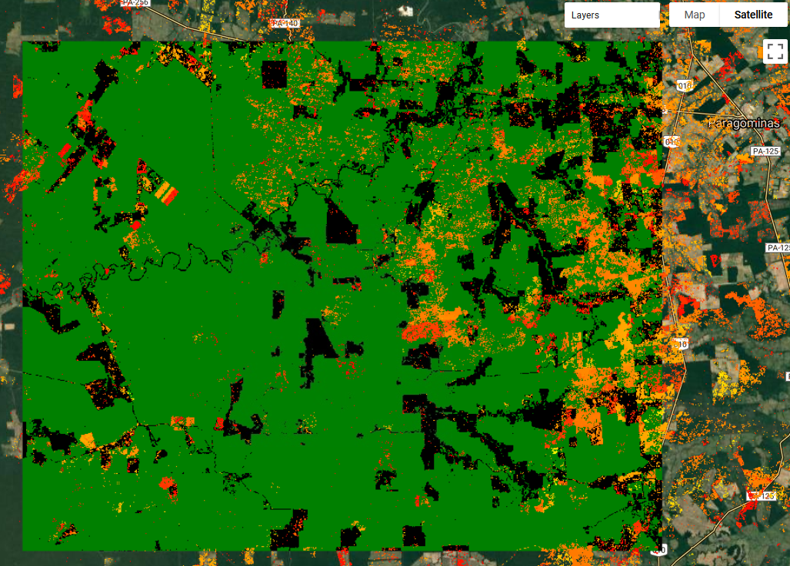

   </td>
   <td>


   </td>
  </tr>
</table>


## 5.0 Tutorial: Colombia

**Running the application**


1. If you have not done so already, add the [Open MRV repository](https://code.earthengine.google.com/?accept_repo=users/openmrv/MR) on Google Earth Engine. 
2. Navigate to the script titled ‘Forest Disturbance Mapping GUI’ in the CODED folder of Open MRV repository.
3. Click ‘Run’. 


4. The panel that appears next to the map allows for the selection of a language. Choose your preferred language. Currently, the only options are English, Spanish, and French. 


**Parameterization**

The following are a recommendation of parameters to use based on previous experience. Everything can and should be tuned for local analysis. 


- **Start and End date:** Change the start and end dates to ‘2000-01-01’ and ‘2020-01-01, respectively. 
- **Forest mask**: Global Forest Watch (GFW): This uses the [Hansen et al. (2013)](https://doi.org/10.1126/science.1244693) global tree canopy cover layer for 2000. Everything in the GFW layer greater than the tree cover threshold layer will be classified as forest. 
- **Tree cover threshold:** _80_. This defines every pixel with over 80% tree cover to be treated as forest.  
- **Inputs:** Use _Landsat_ with all of the default values.
- **Change Detection Method:** Currently, the only supported change detection methodology with Landsat is _CODED_. The default parameters are fine for initial testing. 
- **Change Attribution:** _Sample_ will automatically sample the Forest/Non-Forest map for change attribution. After a change is detected, the subsequent land covers classified as non-forest will be labeled _Deforestation_, while a disturbance in a forest that remains forest will be labeled _Degradation_
- **Post-Processing:** Use the default post-processing parameters, which performs no post-processing. 
- **Visualization:** Enable _Verbose_ to read information in the Console. 
- **Export:** _Stratification_. Since we are operating on a relatively small study area, you can leave the option to export using a grid unchecked. 

**Study Area**


1. You can specify a path to an Earth Engine Table, the boundary of which will be used as the study area. 
2. On the left side of the map, click the button that says “Use Asset for Study Area” (see figure below)
3. Enter the path to the table in the box right below the textbox under the button: users/openmrv/MRV/ColombiaRectangle
4. After entering the path to the Table, it should load on the map after clicking on the map or pressing ‘Enter’.  If you want to confirm the asset has loaded, manually move your map to Colombia and zoom to the area of the black rectangle. 


 

**Run the script**


1. Click on the “Run!” button on control panel on the right to execute the script to display the results. The default options will display the forest change date and stratification. 
2. The change date layer is displayed from the start of the study period to the end, corresponding to yellow to red in the map. 
3. The stratification has the following legend (palette):
    - Green: Stable forest
    - Black: Non-forest
    - Red: Deforestation
    - Blue: Degradation
    - Yellow: Unclassified disturbance
4. Exports can be submitted as a GEE task using the ‘Task’ tab:


5. After clicking ‘Run’ in the ‘Tasks’ tab for the ‘Export_Stratification’ task, give the file an export name and click ‘Run’.


6. After a few minutes, you should see the ‘Change Date’ and ‘Stratification’ layers added to the map. The Forest Mask layer is also available in the map.


7. If you ever run into an issue with the results loading on the map, or loading too slowly, you can export the ‘Stratification’ layer using a task and add it back to the map.
    - Submit a task (‘Export_Stratification’) to create the single-layer stratification (as decsribed above in in step 5).
    - When the task is complete it will turn blue in the ‘Task’ tab.   
      
    - Click on the question mark on the right of the blue task box and click ‘View Asset.  
      
    - Copy the path to the saved asset.  
  
    - Under “Visualization”, paste the path in the box next to “Asset path” and click “Load asset”. Three layers should be added to the map: one for all pixels mapped as degradation, one for all pixels mapped as deforestation, and the stratification as styled with the palette for the legend in step 3 above.   
    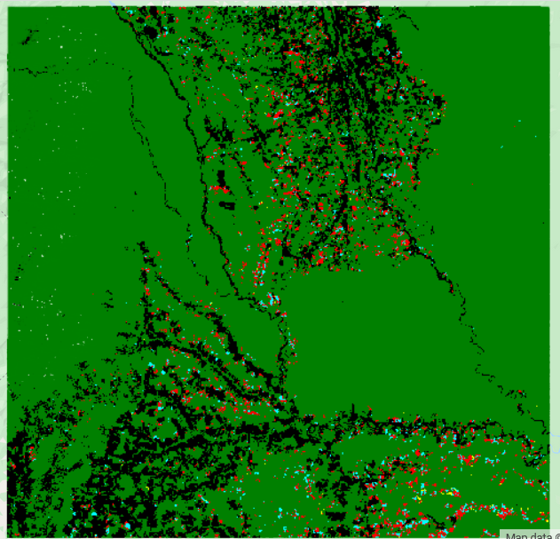  
    - Select the ‘Toggle time series viewer’ to enable clicking on the map to view the NDFI time series.     
    - To start to evaluate the results, try clicking on the map for a pixel mapped as degradation (blue) or deforestation (red). The time series for that pixel should load on the plot at the bottom of the screen. Optionally, use the ‘Y axis min/max’ textboxes to change the y-axis. A few extra layers get added to the map including a box indicating where you clicked, the image collection used to create the plot, and the regression model coefficients.   
    


## 6.0 Tutorial: Creating country-wide results in Cambodia

The previous example demonstrated how to create results in a small study area in Colombia. While this is useful for parameterization as the results can be created quickly, it is often the case that analysis needs to be performed at the national scale. 


#### Study Region

For this tutorial, we will use the boundary of Cambodia for the study region. This can be done rudimentary using the ‘Draw Study Area’ widget in the mapping tool by drawing a box around the country. Better yet, this can be done by creating a feature collection of the study domain. 


1. Open a new Earth Engine code editor window. A copy of this script can be found in the Open-MRV repository titled ‘Create Cambodia boundary feature collection’. 
2. Load country boundary feature collection

```javascript
var countries = ee.FeatureCollection("USDOS/LSIB/2017")
```


3. Filter table by metadata to retrieve the boundary of Cambodia only

```javascript
var cambodia = countries.filterMetadata('COUNTRY_NA','equals','Cambodia')
```

4. Add the layer to the map and save to your assets.

```javascript
Map.addLayer(cambodia)

Export.table.toAsset({ 
      collection: cambodia,
      assetId: 'Cambodia_Extent',
      description: ‘cambodia’
})
```
Now that you have the asset created, you can use the next step to constrain the mapping to that asset’s boundary area. 

#### Parameterization

In the ‘Forest Disturbance Mapping GUI’, define the study area using the asset saved in the previous step. 


1. Select ‘Use Asset for Study Region’ on the left side of the application. 
2. Copy and paste the path to the asset ‘Cambodia_Extent’ in the textbox right underneath the widget to ‘Use Asset for Study Region’. After navigating to Cambodia, your screen should show the study area loaded to the map:


3. To start, define the following parameters. Defining these will allow us to visualize time series and tune the parameters. 
    - Start: _Jan 1, 2001_
    - End: _Jan 1, 2020_
    - Forest Mask: _GFW_
    - Inputs: _Landsat_ (default input parameters)
    - Change Detection: _CODED_
    - Change Attribution: _Sample_ (default parameters)
    - Post-processing: _Use defaults_
    - Visualization: _Add Forest Mask Layer_ (others unchecked)
    - Export: None (all unchecked)
4. To identify possible areas of forest change, we can add the Hansen global tree cover loss dataset (Hansen et al., 2013). 
    - Under _Visualization_, add the path ‘UMD/hansen/global_forest_change_2019_v1_7’ to the box next to _Asset path_ and click _Load asset_. The asset should be added to the map. 
    - The dataset should load on the map with the name _Added Image_ under _Layers_. 
    - Open the _Visualization parameter_ toolbox by selecting the gearbox next to the layer name. 
    - Change the visualization to 1 band (Greyscale), with the band ‘lossyear’, a range of 0-20, and a Palette of a color that will stand out well on the map (in the following example red was chosen). Click _Apply_. 

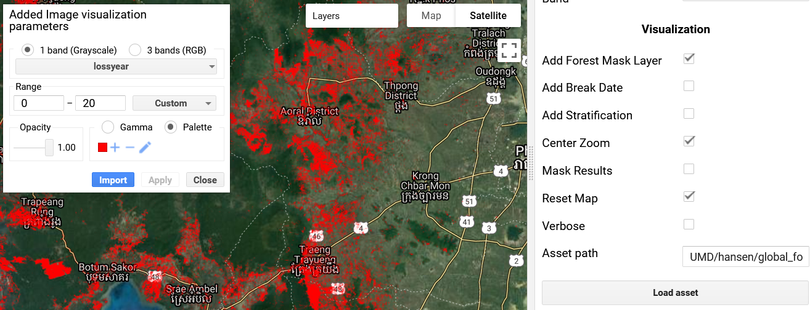  
    - **Note:** This dataset is not perfect, and may omit non-stand replacing tree cover loss events. However, it serves well for exploratory purposes. 

5. Add the time series viewer to the map with _Toggle time series viewer_. Change the min/max of the y-axis to -1 to 1.5. 
6. Spend some time clicking on areas mapped as tree cover loss and visualizing the time series. This is a good opportunity for changing the _Consecutive Obs_ and _chiSquareProbability_ parameters. 
   . The example below can be found at Latitude, Longitude 13.307, 104.587. You can add this point to the map in the same manner as the global forest watch layer using the asset path ‘users/openmrv/MRV/Cambodia_Example_Point’. Note the dramatic decrease in NDFI that is not picked up as a change.

  
The disturbance can be seen by clicking on the observation in the plot next to the error indicating the error of omission. Note that the missing data is due to the scanline corrector issue with Landsat 7.  
  
Experiment with different values for _Consecutive Obs_ and _chiSquareProbability_ to try to detect this change correctly. Typical ranges for _Consecutive Obs_ are from 3 (more change) to 8 (less change), while _chiSquareProbability_ typically should range from .9 (more change) to .999 (less change). After changing a parameter, click _Run_ for them to go into effect. Make sure that _Reset Map_ and _Center Zoom_ are not checked under _Visualization_. This way you can change the parameters without any of the layers of the map being reset or the map view changing. 
    - Notice that changing the _Consecutive Obs_ threshold from 4 to 3 led to the correct detection of the change:  
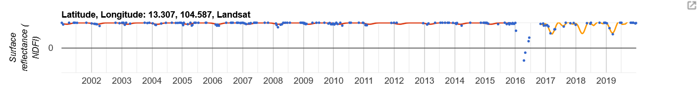  
It’s unrealistic to determine the perfect set of parameters for an entire country. However, this exercise can be used to determine a set of parameters that works well given the data availability of your study domain.   

7. After settling on a set of parameters, export the results by selecting ‘Stratification’ under the ‘Export’ options. Since we are exporting an entire country, the export might fail if attempting to do the analysis in a single task. Therefore, select the ‘Use Grid’ Export option. This option will split the output data into 5x5 degree grids, which will greatly speed up processing time and create output maps that can be joined together in the next step. After clicking ‘Run’ you should see two export tasks for different 5x5 degree grids that make up the study region. 

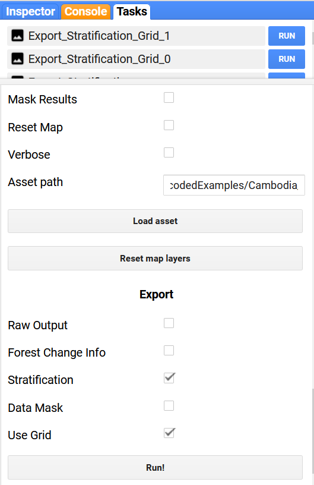


8. Once the two tasks are done processing, the two grid areas can be combined to make one Stratification for the country of Cambodia. The following code can be found in the script ‘Combine Grids’ in the CODED folder. 
    - Open a new GEE Code Editor window. 
    - Define the two stratification ‘grid’ assets as the variables ‘im1’ and ‘im2’ and the country boundary as ‘geo’ Note the paths should be replaced to match your saved asset files. 
```javascript
var im1 = ee.Image('users/openmrv/MRV/Cambodia_WB_Stratification_Grid_1')
var im2 = ee.Image('users/openmrv/MRV/Cambodia_WB_Stratification_Grid_2')
var geo = ee.FeatureCollection('users/openmrv/MRV/Cambodia_Extent')
``` 
    - Combine the two images into one, add it to the map, and save as a new asset. In the example below the grid boundaries are also added to the map in orange. 

```javascript
var combined = ee.ImageCollection([im1, im2]).mosaic().clip(geo)
Map.addLayer(im1.geometry(), {color: 'orange'}, 'Grid 1')
Map.addLayer(im2.geometry(), {color: 'orange'}, 'Grid 2')
Map.addLayer(combined, {min: 1, max: 4, palette: ['green','black','red','cyan']}, 'Results')

Export.image.toAsset({
  image: combined.toByte(),
  scale: 30,
  region: geo,
  maxPixels: 1e13,
  description: 'combined',
  assetId: 'Cambodia_WB_Stratification_Grid_Combined'
})
```


## 7.0 Tutorial: CODED Using Sentinel-2 in Mozambique

CODED was designed to use Landsat data. However, the radiometric differences between Landsat and Sentinel-2 are minimal, and therefore extension of CODED to Sentinel-2 is rather straightforward. Sentinel-2 does not have a thermal band, however the SMA model used here does not require one. The primary advantages of Sentinel-2 are higher data frequency (after 2015), and higher spatial resolution for most bands. While application of CODED with Sentinel-2 has not been widely tested, it is currently supported with the Forest Disturbance Mapping GUI. 

The current (as of 1/2021) collection of Sentinel-2 surface reflectance data in GEE is relatively sparse. In Madagascar this means data is only available for 2019 and 2020, although earlier data may become available in the future. 

Below are a starting set of parameters for using Sentinel-2:


- Start: _Jan 1, 2018_
- End: _Jan 1, 2021_
- Forest Mask: _GFW_
- Inputs: _Sentinel-2_ (default input parameters)
- Change Detection: _CODED_
- Change Attribution: _Sample_. The _Training Year_ parameter should be adjusted to be within the collection time period (2018-2021).
- Post-processing: Use defaults
- Visualization: _Add Forest Mask Layer_ (others unchecked)
- Export: None (all unchecked)

One parameter that should be adjusted for Mozambique is the percent canopy cover threshold used to define the Forest/Non-Forest mask. While the mask can be created externally, it is quicker to use the Global Forest Watch percent tree cover layer. In Colombia, the threshold used to define forest and non-forest can be set relatively high, due to the dense canopy forests throughout the country. However, Mozambique has a higher distribution of open canopy forests, and therefore this threshold should be adjusted accordingly. Three different thresholds can be seen for the study region (asset ‘users/openmrv/MRV/MozambiqueArea’.) below. 


*   To create these maps:
    *   Select _GFW_ as the _Method for Defining Forest Mask_ in the _Forest Mask_ parameters. 
    *   Specify a minimum canopy cover threshold.
    *   Select _Add Forest Mask Layer_ in the _Visualization_ parameters. Make sure no other checkboxes are selected. 
    *   Click _Run_ and the forest mask will be added to the map. 

**Reminder** The Forest/Non Forest is used to seperate forest change (i.e. Deforestation and Degradation) from spectral change. It is also used to define the training data, unless an ancillary dataset is used. Therefore, the Forest/Non-Forest mask is important both for determining where a "forest change" can occur, and in attributing it as Deforestation or Degradation. 

<table>
  <tr>
   <td>
Sentinel-2 RGB Composite
<p>


   </td>
   <td>Threshold: 20%
<p>


   </td>
  </tr>
  <tr>
   <td>Threshold: 40%
<p>

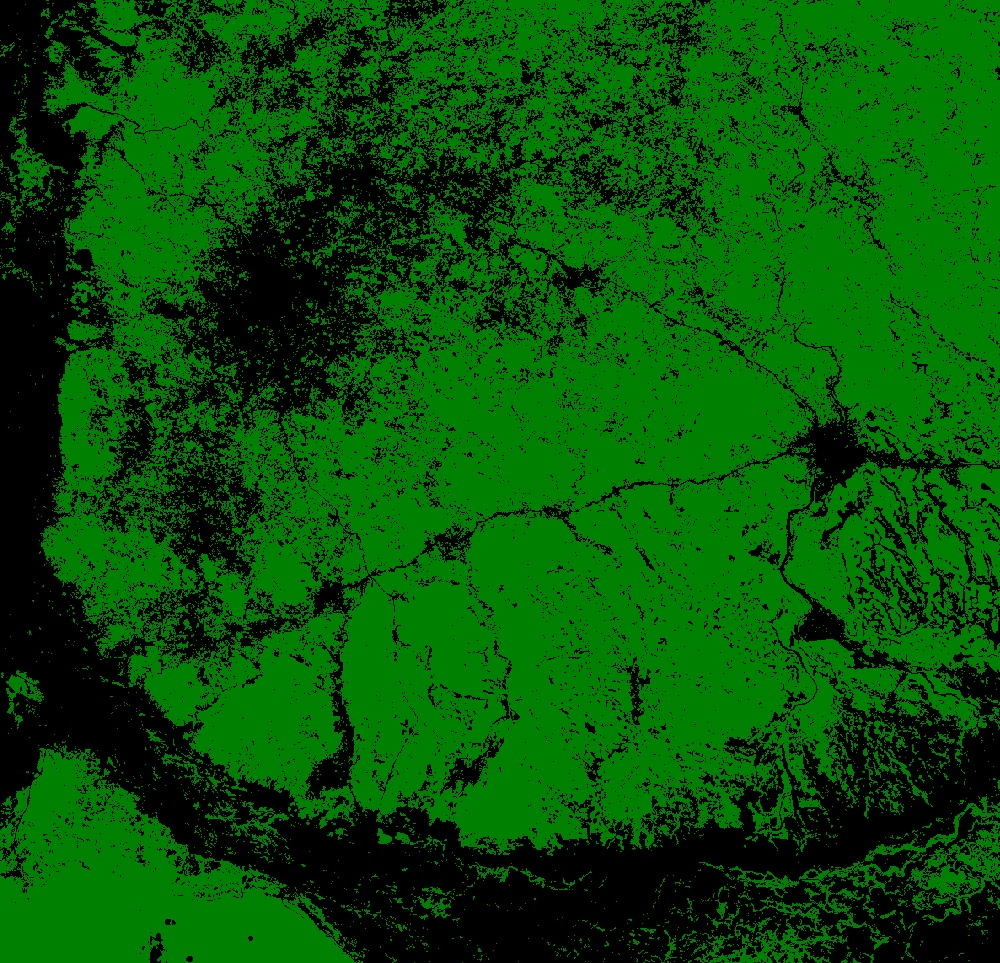

   </td>
   <td>Threshold: 80%
<p>


   </td>
  </tr>
</table>


*   Based on these tests, a _Tree cover threshold_ of 40 is recommended. 
*   Next, we can look at an example Sentinel-2 time series of NDFI for a disturbed forest pixel.  An example of a forest change event can be found in the asset: users/openmrv/MRV/Mozambique_Example_Point
    *   Add the point to the map using the _Asset path_ and _Load asset_ tools. Navigate to the point in Mozambique, and define the study region around the point. 
  
    *   Add the time series viewer with _Toggle time series viewer_. 
    *   Click on the added point to view the NDFI time series and model fit. 
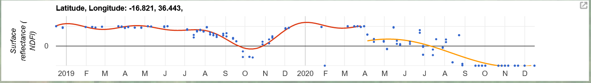  
    *   Note that there is substantial variability in the NDFI time series prior to 2020, although there is no model break. This variability could be due to two factors: 
        *   There is a change in the forest due to disturbance or growth.
        *   Natural and seasonal variability in the forest. 
    *   It is difficult to determine from this chart since the Sentinel-2 data for this location is only available after 2019. Alternatively, we can look at the Landsat observations for this example pixel, which the GEE archive starts years before that of Sentinel-2. Note the landscape variability in greenness prior to 2020 and the dramatic change due to disturbance in the example pixel (black dot in center):
  
    *   From these images, we see that there is seasonality due to plant phenology. The vegetation appears brown due to phenological at the end of the dry season, or around September through December. We can remove these dates from analysis in the “Input” parameters by changing the _Start DOY_ and _End DOY_ to 1 to 244 (January 1 to September 1). Observe the Sentinel-2 time series when excluding the dry season dates:
  
    *   Interestingly, a change was found without performing filtering for the dry season images but not after filtering! This is because the seasonal regression models correctly fit to the seasonal variability, so the low NDFI values at the end of 2019 were determined to be the “normal” yearly trajectory of the data. The observations after the disturbance in April 2020 do not match the “normal seasonal trend”, and therefore a change is flagged. Based on this example, it appears that filtering by day of year does more harm than good. 
    *   After exploring the time series of different locations, export a stratification by selecting the _Export_ option for _Stratification_, and defining the study area with _Use Asset for Study Area_ and inputting the feature collection (‘users/openmrv/MRV/MozambiqueArea’). 
    *   After processing, the stratification can be added to the map by copying and pasting the path to the asset into the _Asset path_ textbox and selecting _Load asset_. The map should be displayed on the map. 


**Tip**: if you are finding too many errors of commission (or false changes detected), try decreasing the _Consecutive Obs_ threshold. Note the difference in the two maps below. These layers show pixels flagged as change and. are added to the map by checking the Visualization checkboxes _Add Break Date_ (to add it to the map) and _Mask Results_ (to apply the Forest/Non-Forest Mask). The Break Date layer can usually be calculated on the fly, so the change detection parameters can be adjusted without needing to export the results each time. If you uncheck the _Reset Map_ parameter, then the previous results will stay loaded on the map.   

<table>
  <tr>
   <td>
<strong><i>Consecutive obs</i> = 3</strong>
<p>

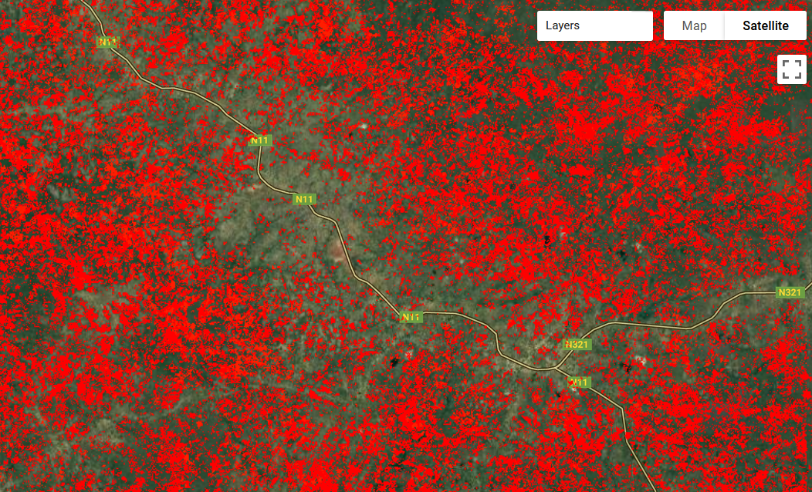

   </td>
   <td><strong><i>Consecutive obs = 5</i></strong>
<p>


   </td>
  </tr>
</table>

- This process is meant to be iterative. After a stratification is exported, it can be loaded on the map and analyzed using the Time Series Viewer. It is recommended to start in a small area so that parameters can be adjusted without substantial processing time required. 


## 8.0 Frequently Asked Questions

**How does CODED accommodate seasonality?**

CODED uses seasonal regression to model seasonal changes due to phenology. Since the test statistic for the change detection is based on model residuals, the harmonic regression acts to “seasonally detrend” the NDFI. 

**In the context of CODED, what is the definition of forest degradation?**

Forest degradation is defined here as a disturbance in a forest that reduces biomass, ecological productivity, and/or canopy cover but does not result in a land cover conversion. Examples include selective logging, small-scale timber harvesting, fire, and conversion from a natural forest to a plantation. 

**How can complete canopy clearings be considered degradation, rather than deforestation?**

Forest land that is cleared but immediately begins regenerating, without a non-forest land use, is considered in this context as a regenerating forest. The definition of deforestation used here requires a conversion of land cover class (e.g. forest to cropland). Therefore, a disturbance in a forest that remains forest is considered degradation regardless of the amount of tree cover affected. 

**Can CODED be applied to high-resolution data?**

CODED can technically be applied to any optical data source. However, it requires a time series of temporally-consistent observations. 

**Why does CODED use NDFI and fraction images rather than original spectral bands?**

Previous research in the Brazilian Amazon (i.e. Souza et al., 2003, 2005, 2013) found NDFI to be more sensitive to sub-pixel degradation from fire and logging than spectral bands or indices. 

**My results have too many or few changes detected, what can I do?**

Changing the ‘Consecutive Obs’ and ‘chiSquareProbability’ will control the sensitivity of the algorithm to change. 

**How can the results be used to create activity data?**

Activity data can be derived from the CODED-based maps directly or in a sampling design. 

**What to do if the accuracy of the results is low?**

The process is meant to be iterative. We suggest starting with a small study area, then running the default parameters, then looking at the map results and time series examples, and trying a new set of parameters. Furthermore, if the results are used in a sampling framework for statistical estimation, it does not matter too much how accurate the map is. In this context, map errors are accommodate using an unbiased statistical estimator. 

#### 8.1 Debugging Guide

**“Error: User memory limit exceeded”.**

This error usually occurs when a computation is too complex or over too large of an area. Try reducing the size of the study region, either manually or by using the ‘Use Grid’ options. 

**“Error: Image.classify: No data was found in classifier training input.”**

This error occurs when the training data is outside of the study region or the ‘Training year’ parameter is outside the start and end dates of the input image collection. 

**“Computation Timed Out”**

This error is common when displaying the results “on the fly”. Try exporting the results in a Task and then loading it back onto the map using the ‘Load asset’ tool. If it is a Stratification, the tool will automatically apply a style to the loaded asset. 

**“Cannot find required repo”**

This indicates that a link to an external library is broken. Please refer to [https://coded.readthedocs.io](https://coded.readthedocs.io) for the most recent version of the GUI. 

## 9.0 References


- Bullock, E.L., Woodcock, C.E., Olofsson, P., 2020. Monitoring tropical forest degradation using spectral unmixing and Landsat time series analysis. Remote Sens. Environ. 238. https://doi.org/10.1016/j.rse.2018.11.011

- Hansen, M.C., Potapov, P. V., Moore, R., Hancher, M., Turubanova, S.A., Tyukavina, A., Thau, D., Stehman, S. V., Goetz, S.J., Loveland, T.R., Kommareddy, A., Egorov, A., Chini, L., Justice, C.O., Townshend, J.R.G., 2013. High-resolution global maps of 21st-century forest cover change. Science (80-. ). 342, 850–853. https://doi.org/10.1126/science.1244693

- Huang, C., Goward, S.N., Masek, J.G., Thomas, N., Zhu, Z., Vogelmann, J.E., 2010. An automated approach for reconstructing recent forest disturbance history using dense Landsat time series stacks. Remote Sens. Environ. 114, 183–198. https://doi.org/10.1016/j.rse.2009.08.017

- Kennedy, R.E., Yang, Z., Cohen, W.B., 2010. Detecting trends in forest disturbance and recovery using yearly Landsat time series: 1. LandTrendr - Temporal segmentation algorithms. Remote Sens. Environ. 114, 2897–2910. https://doi.org/10.1016/j.rse.2010.07.008

- Souza, C., Firestone, L., Silva, L.M., Roberts, D., 2003. Mapping forest degradation in the Eastern Amazon from SPOT 4 through spectral mixture models. Remote Sens. Environ. 87, 494–506. https://doi.org/10.1016/j.rse.2002.08.002

- Souza, C.M., Roberts, D.A., Cochrane, M.A., 2005. Combining spectral and spatial information to map canopy damage from selective logging and forest fires. Remote Sens. Environ. 98, 329–343. https://doi.org/10.1016/j.rse.2005.07.013

- Souza, C.M., Siqueira, J. V., Sales, M.H., Fonseca, A. V., Ribeiro, J.G., Numata, I., Cochrane, M.A., Barber, C.P., Roberts, D.A., Barlow, J., 2013. Ten-year landsat classification of deforestation and forest degradation in the brazilian amazon. Remote Sens. 5, 5493–5513. https://doi.org/10.3390/rs5115493

- Zhu, Z., Woodcock, C.E., 2014. Continuous change detection and classification of land cover using all available Landsat data. Remote Sens. Environ. 144, 152–171. https://doi.org/10.1016/j.rse.2014.01.011


  
This work is licensed under a [Creative Commons Attribution 3.0 IGO](https://creativecommons.org/licenses/by/3.0/igo/)

Copyright 2020, World Bank 

This work was developed by Eric Bullock under World Bank contract with GRH Consulting, LLC for the development of new -and collection of existing- Measurement, Reporting, and Verification related resources to support countries’ MRV implementation. 

Material reviewed by:  
Tatiana Nana, Cameroon, REDD+ Technical Secretariat  
KONAN Yao Eric Landry, Cote d'Ivoire, REDD+ Executive Permanent Secretariat
Adrianirina Carole, Madagascar, BNCCREDD+
Jennifer Juliana Escamilla Valdez, El Salvador, Ministerio de Medio Ambiente y Recursos Naturales

Attribution
Bullock, E. 2020. Continuous Degradation Detection (CODED). © World Bank. License: Creative Commons Attribution license (CC BY 3.0 IGO)  

