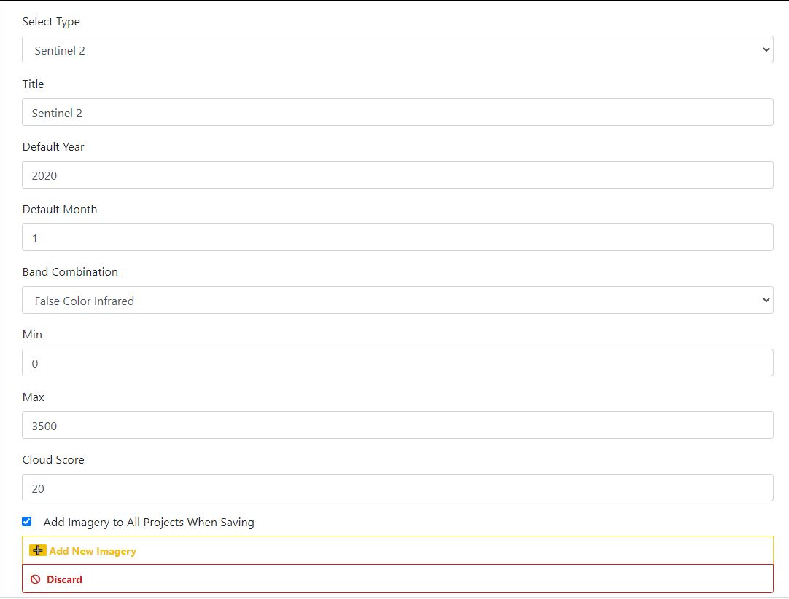
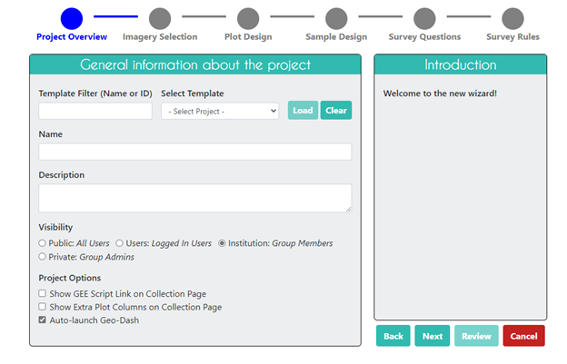
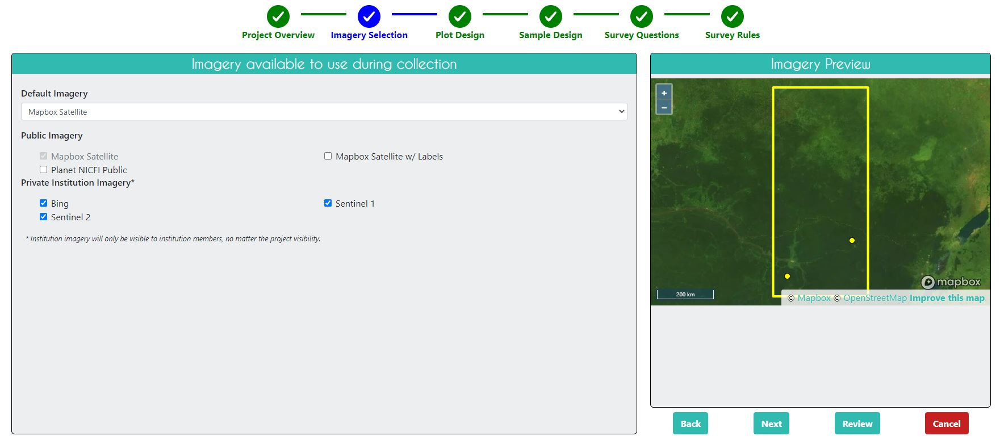
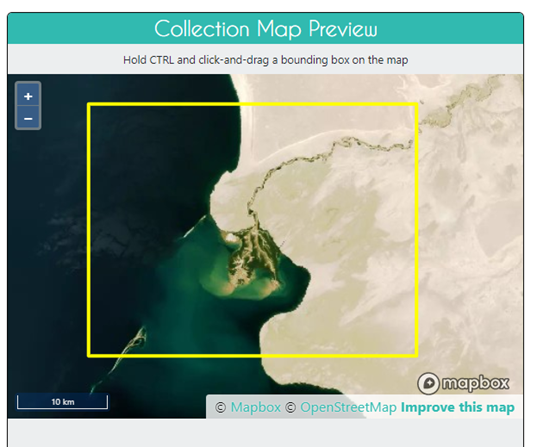
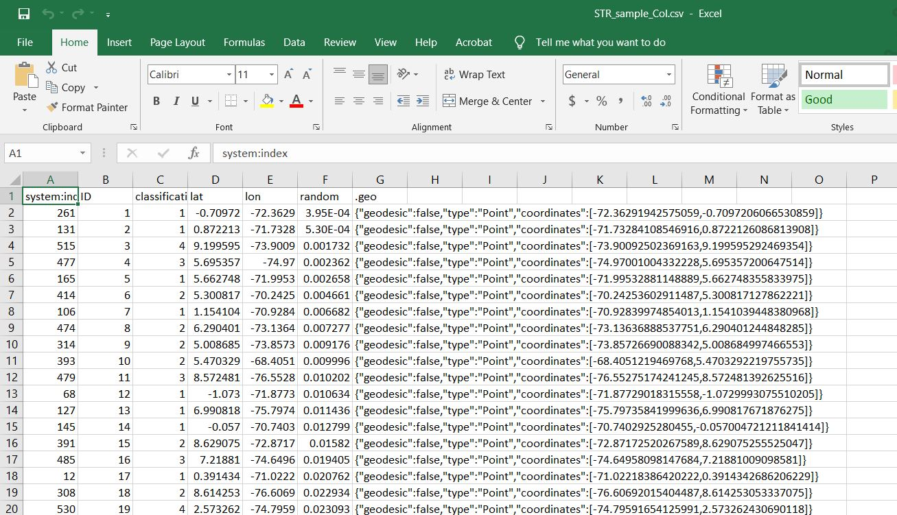
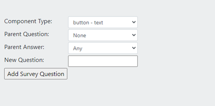
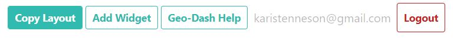
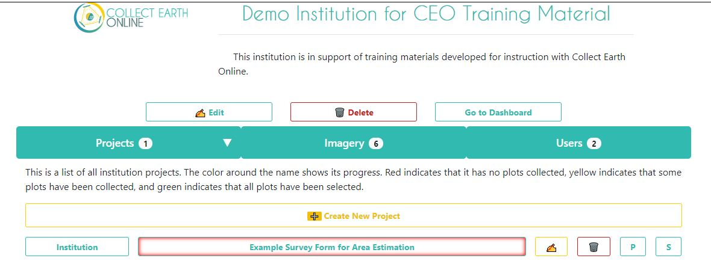
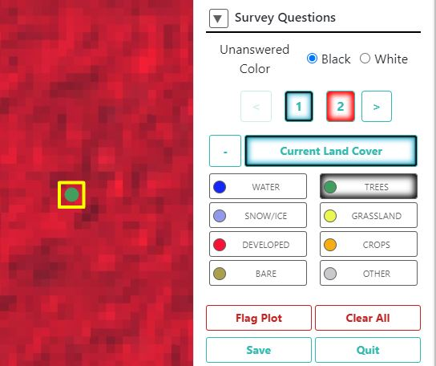
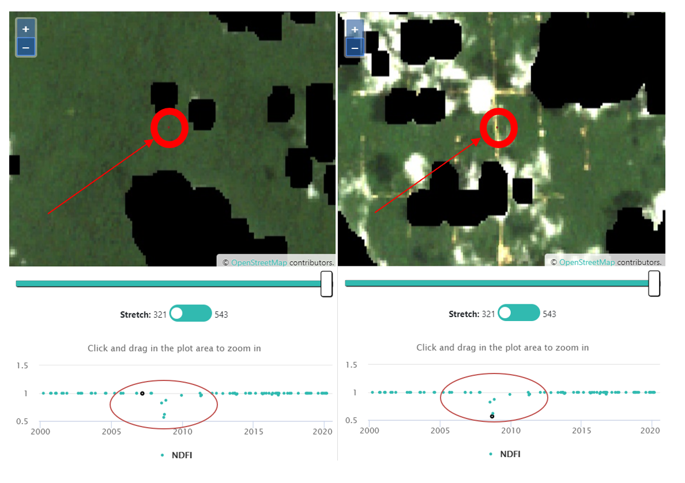

# Module 3.3.3 Survey Form Creation and Reference Observation Collection with Collect Earth Online

## 1 Background

Reference observations are required to calculate unbiased area and uncertainty estimates from a map product. The reference observations are typically a labeled set of data, derived from an activity map (e.g. by stratified random sample) and labeled using imagery or field data. This is compared to the map strata of an activity map to estimate map accuracy and obtain unbiased area estimates. This tutorial will demonstrate how to collect reference observations with categorical labels for generating unbiased area and uncertainty estimates using Collect Earth Online. Users should adjust the various components to match their project objectives. Here, the process is demonstrated for the country of Colombia and for a simple map legend indicating the presence or absence of forest loss or degradation.  

### 1.1 Collect Earth Online

Collect Earth Online is a custom built, open-source, satellite image viewing and interpretation system to collect data for use in projects that require land cover and/or land use reference information. Collect Earth Online promotes consistency in locating, interpreting, and labeling samples for use in classifying and monitoring land cover / land use change. The full functionality of Collect Earth Online, including collaborative compilation of reference point databases, is implemented online so there is no need for desktop installation. 

### 1.2 Learning Objectives 

At the end of this exercise, you will be able to draft, review, and publish a project in Collect Earth Online. This includes:

* Survey design in Collect Earth Online.

* Selecting imagery to view for data interpretation.

* Collect and export reference observations. 

### 1.3 Pre-requisites for this module

* Have established a sample design and sample selection, which are outlined in Modules 3.1 and 3.2

* General understanding of image interpretation. Image interpretation is the process of looking at moderate, high, or very high spatial resolution imagery (from satellites or aerial photography) and labeling the objects of interest in your sample locations. Photo interpretation is the core skill needed to effectively execute any CEO project. 

* For more information, please refer to the Collect Earth Online Institution and Project Creation Manual, found at [Collect Earth Online Support Pages](https://collect.earth/support). 

### 1.4 Signing up for a Collect Earth Online Account

1. In your browser window, navigate to [CEO](https://collect.earth/). CEO supports Google Chrome, Mozilla Firefox, and Microsoft Edge.

2. Click [Login/Register] on the upper right.

3. To set up a new account, click on [Register] and follow the instructions. You will receive a welcome email if registration is successful.

4. When you have created an account, login with your email and password.

5. If you forget your password, click on [Forgot your password?] and follow the instructions.

### 1.5 Collect Earth Online Resources

You can access the Home, About, Support, and Account pages from the top menu bar.

* The Home page includes information about institutions, published projects, and a map showing locations of existing projects.

* The About page summarizes information about CEO.

* The Support features Collect Earth Online Manuals, Tutorials, and a Collect Earth Online Demo. This page also includes links for bug reporting and forums to ask for help.

* The Account page lists information such as user statistics and allows users to update their account settings.

* There is a purple ? in the top right corner of the screen. Clicking on this will bring up the help interface, which provides information about CEO's features. These help interfaces are available for the Home page, for Data Collection and for Project Creation.

## 2. Setting up Imagery Feeds in Collect Earth Online

There are a number of public imagery feeds available to all users in Collect Earth Online. These include Mapbox Satellite and Planet’s data made available in collaboration with Norway’s International Climate and Forests Initiative (Planet NICFI). You can also add your own additional (private) imagery feeds on your Institution page. We recommend adding in Sentinel 1, Sentinel 2, and Bing, as described below. These are all freely available options. 

1. Go to your Institution page in Collect Earth Online. Then click on the Imagery tab. 

### 2.1 Add Sentinel 2 data to Institution Page

Sentinel 2 imagery is available from June 2015-present. After configuring the settings using the instructions below, the Sentinel 2 data will be piped through GEE into CEO for your users to work with. 

1. Click on 'Add New Imagery'.

2. From the first drop down, select 'Sentinel 2' as the Type. 

3. Title: This will be the displayed name of the imagery. 

Type in 'Sentinel 2'.

4. Default Year: The default year that will be displayed when the map loads. 

Type in 2020.

5. Default Month: The default month that will be displayed when the map loads. 

Use integer format 1-12. Type in 1 to load January by default.

6. Band Combination: Select one of the options available, including True Color, False Color Infrared, False Color Urban, Agriculture, Healthy Vegetation, and Short Wave Infrared. 

For this exercise, choose 'False Color Infrared'. This stretch helps distinguish between dirt/pavement and vegetation. Dark red corresponds with vegetation, with deeper reds corresponding with denser vegetation. Dirt and pavement are grey or tan. 

7. Min: Minimum value for bands that will get mapped to 0 for visualization. This should be a single number. Acceptable values for each band's minimum are the same as in the Geo-Dash and GEE available Sentinel generally; see [https://developers.google.com/earthengine/datasets/catalog/sentinel](https://developers.google.com/earthengine/datasets/catalog/sentinel).

For this exercise, choose 0.

8. Max: Maximum value for bands that will get mapped to 255 for visualization. This should be a single number. Acceptable values for each band's maximum are the same as in the GeoDash and GEE available Sentinel generally. See link above. For example, values of 2800-4000 are frequently used.

For this exercise, choose 3500. (Units are units of reflectance * 10000)

9. Cloud Score: Allowable cloud cover. Values can be 0-100.

For this exercise, choose 20.

10. If you want to add this imagery source to all of your institution's projects, check the box next to Add Imagery to All Projects When Saving. 

For this exercise, select this option.

11. When all fields are filled out, click on [Add New Imagery].

### 2.2 Add Sentinel 1 data to Institution Page

Sentinel 1 information is only available from April 2014 to present (Sentinel 1A launch). After configuring the settings using the instructions below, the Sentinel 1 data will be piped through GEE into CEO for your users to work with. 

1. Go back to your Institution Page. Then under the Imagery tab, click on 'Add New Imagery'.

2. From the first drop down, select 'Sentinel 1' as the Type. 

3. Title: This will be the displayed name of the imagery. Type in 'Sentinel 1'.

4. Default Year: The default year that will be displayed when the map loads. Type in '2020'.

5. Default Month: The default month that will be displayed when the map loads. Use integer format 1-12. Type in '1' to load images from January by default.

6. Band Combination: Preset combinations of bands for most uses. VH and VV are single polarization, VH/VV and HH/HV are dual polarization. More info can be found here:
[Sentinel 1 User Guide, Acquisition Mode](https://sentinel.esa.int/web/sentinel/user-guides/sentinel-1-sar/acquisition-modes). 

For this exercise, select 'VH,VV, VH/VV'.

7. Min: Minimum value for bands that will get mapped to 0 for visualization. This should be one number. Acceptable values for each band's minimum are the same as in the Geo-Dash and GEE available Sentinel generally; see[https://developers.google.com/earthengine/datasets/catalog/sentinel](https://developers.google.com/earthengine/datasets/catalog/sentinel). Min can be as low as -50, but 0 is frequently used.

For this exercise, select '0'.

8. Max: Maximum value for bands that will get mapped to 255 for visualization. This should be one number. Acceptable values for each band's maximum are the same as in the Geo-Dash and GEE available Sentinel generally. See link above. Max can be as high as 1, but .3 is frequently used.

For this exercise, select '0.4'. (Units are gamma naught backscatter coefficients).

9. If you want to add this imagery source to all of your institution's projects, check the box next to Add Imagery to All Projects When Saving. Check this box to add the feed to all existing projects.

10. When all fields are filled out, click on [Add New Imagery].

### 2.3 Add Bing imagery to Institution Page

This allows you to add Bing Maps with your own API key. The imagery provided by Bing Maps is composite satellite imagery. This means that each map tile is stitched together from imagery acquired on multiple dates. There is not a single date for an imagery tile. Some map tiles contain imagery collected over a multi-day window while other tiles contain imagery collected over a multi-year window. As there is not a single date for an imagery tile, CEO cannot provide the exact date of the imagery used. If you're interested in learning more, the Bing Maps API can be found here: [Bing Imagery-metadata](https://docs.microsoft.com/en-us/bingmaps/restservices/imagery/imagery-metadata). 

The Bing tile system uses the Mercator projection and has 23 levels of zoom (though not all levels are available in all locations). Commonly, the
resolution at max zoom is about 0.3 m per pixel. For more information, see
[Bing maps tile system](https://docs.microsoft.com/en-us/bingmaps/articles/bing-maps-tile-system).

#### 2.3.1 Directions for requesting a Bing maps key:

1. To use Bing Maps imagery for your projects, you can create your own FREE Bing maps key to connect your institution's projects to your Bing Maps account. The full directions for creating a key are here: [Get a Bing maps key](https://docs.microsoft.com/en-us/bingmaps/getting-started/bing-maps-devcenter-help/getting-a-bing-maps-key).

2. Visit [Bing Maps Portal](https://www.bingmapsportal.com/) to request a Bing key or copy your existing key.

a. Sign in. You will need a Bing maps account or Microsoft account
[Account page](https://docs.microsoft.com/en-us/bingmaps/getting-started/bing-maps-dev-centerhelp/creating-a-bing-maps-account).

b. Once you have logged in, click on My account, then click on My Keys.

c. If you already have a key, click Show key or Copy key.

d. If you do not have a key, click on Click here to create a new key.

e. Fill out the information. Application URL is optional, but if you want to fill it in you can use https://collect.earth as your Application URL.

f. You will create a Basic key. If you need more imagery, you will need to talk to Microsoft
and request an [Enterprise key](https://www.microsoft.com/en-us/maps/create-a-bingmaps-key#enterprise)

#### 2.3.2 Directions for connecting your Bing maps key in Collect Earth Online:

1. Go back to your Institution Page. Then under the Imagery tab, click on 'Add New Imagery'.

2. From the first drop down, select 'Bing Maps' as the Type. 

3. Title: This will be the displayed name of the imagery. Type in 'Bing Maps'.

4. Imagery Id: Only Aerial and AerialWithLabels are currently implemented. Note that the AerialWithLables imagery uses the legacy static tile service, which is deprecated, and current data will not be refreshed. It therefore may have older imagery than the Bing Aerial dataset. Select Aerial.

5. Access Token: Type in your BingMaps key. For more information or to obtain your own key, see 2.3.1 above.

6. If you want to add this imagery source to all of your institution's projects, check the box next to Add Imagery to All Projects When Saving.

7. When all fields are filled out, click on [Add New Imagery].

### 2.4 Additional Imagery Feeds

Please refer to the Collect Earth Online Institution and Project Creation Manual to learn how to add additional image feeds, such as image assets from Google Earth Engine. The manual can be accessed here: [Collect Earth Online Support Pages](https://collect.earth/support).

## 3. Response Design

### 3.1 Overview

Designing a project is an iterative process, and you will probably need to make multiple edits to projects in CEO as you test and refine your goals, land use or land cover classification schemes, imagery sources, etc. These changes should be examined and made to a project before your project is published. This means that you can ideally spend some time piloting a project, collecting test data with the questionnaire, and revise it to adapt to any errors or inefficiencies you find before you publish the project and begin the official data collection efforts.

In practice, we find that creating a pilot project and collecting pilot data is incredibly helpful for collecting high quality data. The process will frequently look like this:

1. Draft your sample design and questions in consultation with key project members.

2. Create a pilot project in CEO using your sample design and draft questions. 

3. Ask key members of your team to collect some data using the pilot CEO project.

4. Review areas of confusion in question wording and CEO project setup.

5. Review areas of agreement and disagreement with identifying land cover. For example, perhaps water is easy for all team members to identify but forest classes are difficult. 

6. Use the discussion about areas of agreement and disagreement to create a land cover key. This is a document that contains important interpretation information about different land cover classes. It includes multiple images of each land cover class as well as descriptions of what each class looks like. The document aids interpreters in identifying land cover classes when collecting data and increases agreement between different interpreters.

7. Using feedback from the pilot project, create project(s) for interpreters to collect the ‘production’ or ‘final’ data. Any data collected from samples interpreted before publication will be deleted.

8. Collect and analyze data.

### 3.2 Create a new project

To start, open a web browser and navigate to [Collect Earth Online](https://collect.earth/). Navigate to your institution page. 

1. In the Projects tab on your Institution page, click on [Create New Project]. This will bring you to the Create Project wizard. The wizard comprises 6 parts, each covered in one of the sections below. 

#### 3.2.1 Project Overview: 

This section allows you to add general information about the project, including selecting a template (optional), project name, project description, and project options.

1. [Optional] Use a project template: This feature is used to copy all the information-including project info, area, and sampling design-from an existing published project to a new project. This is useful if you have an existing project you want to duplicate for another year or location, or if you are iterating through project design. For a template, you may use any available published or closed project from your institution. You cannot use deleted projects. You cannot use another institution's private project (only members or admins can access), but you can use another institution's public project (any website visitor or CEO user). For more on project privacy settings, see Visibility below.

For this exercise, you will practice designing your own project from scratch, so skip this section, and leave the Select Template field set to- Select Project -. 

However, for reference information on working with a template is included below.

  i. Template Filter (Name or ID): Type in a keyword in an existing project's name or the Project ID Number. You can find the Project ID number by navigating to the project you want to copy and looking at the URL.

  ii. Then click on the dropdown menu under Select Project and click on the project's name.

  iii. Click on the project name, then click Load to load the template information.

  iv. Click on Clear to clear all template information.

  v. This Loading a template will create two checkboxes under Copy Options, Copy Template Plots and Samples and Copy Template Widgets. They are checked by default.

    * If Copy Template Plots and Samples is checked, the Plot Review and Sample Design sections will only display an overview of the number of plots, etc. Uncheck this box to change those parameters.

    * Copy Template Widgets refers to Geo-Dash options covered in Part 6: Geo-Dash Implementation.

2. Enter the project's Name and Description. The Name should be short and will be displayed on the Home page as well as the project's Data Collection page. 

  i. For this exercise, name it 'Example Project for Area Estimation'.

**Tips:**
You should keep the Description short but informative. Users will see these if they click on the project's pin on the map on the home page. You will also see this when you are administering your project. Note, if you are using a template, the Name and Description will automatically be populated. Be sure to change this to reflect your new project.

3. Select the project's Visibility. The Privacy Level radio button changes who can view your project, contribute to data collection, and whether admins from your institution or others creating new projects can use your project as a template.

  * Public: All: All users can see and contribute data to your project. Admins can use your project as a template.

  * Users: Logged in Users: Any user logged into CEO can see and contribute to your project. Admins can use your project as a template.

  * Institution: Group Members: Members of your institution can see and contribute to your project. Admins from other institutions cannot use your project as a template.

  * Private: Group Admins: Only your Institution's Admins can see and contribute to your project. Admins from other institutions cannot use your project as a template.

For this exercise, select Institution.

4. Select Project Options.

i. The first option is to 'Show GEE Script Link on the Collection Page'. This allows users in Data Collection to click on a button labeled Go to GEE Script to open a new tab with a series of Landsat and Sentinel time series images and charts (see image below). For this exercise, select this option.

In the image example of the GEE Script there are three panels. On the far left, there is a Sentinel 2 composite of the last 12 months. It is colored using an infrared color composite (near infrared, mid infrared, red). In the center are Landsat 8 and Landsat 7 Color Yearly mosaics, with a slider so you can choose between years. On the right are NDVI graphs of the plot from MODIS, Landsat 7/8, and Sentinel 2. For the Landsat 7/8 and Sentinel graphs, you can click a point on the graphs to load specific images in the left and center panels.

ii. The second option is to 'Show Extra Plot Columns on Collection Page'. This allows you to select information present in your sample locations data (e.g., csv of shapefile). Common examples of supplemental information you might include in your sample are elevation or jurisdiction (e.g., state, province, district). For this exercise, do not have this option selected.

  * This option is only useful if you are using .csv or .shp files to define your Plot Design.

  * If you have additional columns in your .csv or .shp files, such as elevation information or land cover class, data collectors will be able to see them on the Data Collection page under Plot Information.

iii. The third option is to 'Auto-launch Geo-Dash'. The Geo-Dash is another tab that can be designed to display supplemental time series images and charts. This will automatically open the Geo-Dash interface in a new window or new tab when the data collector navigates to a new plot. Unchecking this option means that data collectors will need to click on the Geo-Dash icon under External Tools in the Data Collection interface.

For this exercise, select to auto-launch Geo-Dash.

5. Your screen should look similar to the image below. Click Next to go to the Imagery Selection panel.

#### 3.2.2 Imagery Selection

In the Imagery Selection pane, you can change the default basemap imagery and the imagery basemaps that are available to users during data collection.

1. The first option allows you to specify the Default Imagery that users see when they begin data collection on your project. Your users can switch between all the available imagery layers during data collection. 

The default (public) options everyone can choose from include MapBox Satellite, Mapbox Satellite w/Labels, and Planet NICFI Public. You can also add your own additional (private) imagery feeds on your Institution page. Refer to the Collect Earth Online Institution and Project Creation Manual to learn how. It is accessed here: [Collect Earth Online Support Pages](https://collect.earth/support).

You may choose any of the imagery options available to your institution. For this exercise, select Mapbox Satellite. Notice, after making the selection that the Imagery Preview will display the current selection.

**Note:** if you have a commercial license for PlanetMonthly, PlanetDaily, and SecureWatch, they do not allow for large area data pulls, so it should not be your default basemap (users will just see a white box). If you want to work with these feeds, we recommend that you set a different default basemap and have your data collectors switch to PlanetDaily once they have zoomed in on a plot to interpret.

2. Public Imagery is the imagery that is available for all institutions. If you have a public project, all users (including those not logged in) can see the imagery. Click the checkbox next to each imagery source you would like to have available for your project. For this exercise, select all.

3. Private Institution Imagery is imagery that is only visible to institution members, even if you have your project set to “public.” 

Click the checkbox next to each imagery source you would like to have available for your project. Earlier in the exercise, you set up Sentinel 1, Sentinel 2, and Bing maps. Select all three. 

4. Click "Next" when you are finished.

#### 3.2.3 Sample specification: Plot Design

CEO's built in system enables users to create sampling designs using an easy-to-use interface. There are two key parts, selecting the AOI and Plot Generation. 

##### 3.2.3.1 Select your AOI

For this exercise we will use the sample selection created earlier and exported as a csv. This will set the area of interest (AOI) for the project. CEO bounds the AOI around the plot locations that you upload. Therefore, skip the following instructions to manually draw the AOI. 

These steps are included below for reference.

i. The easiest way to select your project AOI is by drawing a box in the map window in the right hand pane (Collection Map Preview).

  * Locate your area of interest by zooming in/out using the scroll wheel of your mouse, or the + and - boxes in the map window. You can pan the map by clicking on it and dragging the map window.

  * Hold the CTRL-key (command key on a Mac) down and draw a box while keeping the left mouse key pressed down.

  * Hold the SHIFT-key down and draw a box to zoom in.

  * The coordinate boxes will populate once the box is drawn and you let your mouse key go. Coordinates are displayed in lat/long using WGS84 EPSG:4326.

ii. You can also manually enter your Boundary Coordinates into the boxes provided.

##### 3.2.3.1 Plot Design

In the Plot Design section, you can specify the type and number of plots. For this exercise we will use the sample selection created earlier and exported as a csv. There are three other options to locate plots: randomly, gridded layout, and uploading a shapefile. 

For this exercise, follow the instructions to upload the csv. Then, skip the subsequent instructions to work with random, gridded, or shapefile options. These steps are included below for your future reference.

Additional notes on working with user specified plot files: Using .csv and .shp files, the maximum number of plots is 50,000 and the total sample point limit is 350,000. You must use WGS84 EPSG:4326 format for coordinates in both .csv and .shp files.

We must first adjust the formatting of the .csv file. The file you upload to specify plot centers must have these columns, in this order: LON, LAT, PLOTID.

i. In a spreadsheet formatting software like Excel, open the stratified random sample file that you created in the sample selection exercise (Module 3.2). 

ii. Copy and paste the columns around so that the first one has the longitude coordinates, followed by the latitude coordinates, then the plot ID.

iii. Change the column names to: LON, LAT, PLOTID. Note, this is case sensitive, so make sure you use capital letters.

iv. Delete the column called '.geo'.

v. Save the changes to your .csv.

Note: if you do not specify the column names correctly (spelling or order), you will get the following error:

Longitude should be between -180 and 180, while latitude should be between -90 and 90. If you mix them up, you may get an error if your longitude is greater than 90 or less than -90 (when this is mixed up with latitude, it is 'above' the pole). Double check these values.

We will now upload this file to CEO.

1. In the Plot Design tab under Spatial Distribution select ‘CSV file.’

2. Click on 'Upload plot file'.

3. Plot Shape can be either a Circle or a Square. Set the plot shape to square. 

4. You will need to specify the Diameter in meters. These sizes should be driven by the needs of your project. For this exercise, type in 30 meters to match the resolution of a Landsat pixel.

Note: when plots are small, your users will need to zoom out significantly to see the relevant background imagery because CEO automatically centers and zooms in to the plot's boundaries.

5. Click "Next" when you are finished.

##### For reference only, instructions on how to work with the other plot design options

* In CEO, you can specify either a random or a gridded (spatial systematic) sampling approach.

* If you select Random, you will need to provide the number of plots for the whole project.

* If you select Gridded, you will need to provide the spacing between the centers of the plots (in meters).

**Note:** CEO will provide an estimate of how many plots will be generated for your project based on your sampling design. Using CEO's sampling, the maximum number of plots for a project is 5,000. For gridded sampling, you may need to increase the space between plots to avoid exceeding 5,000 plots.

#### 3.2.4 Sample specification: Sample Design

Here is where you will specify how many sample points are within each plot, and whether they are sampled using random, gridded or a customized distribution approach.

1. Under Spatial Distribution you can select random, gridded, center, csv, shp or none. For this exercise, choose ‘Center.’ With Center a sample point will be placed in the center of the plot; you do not need to specify anything else.
2. For any of these Spatial Distributions, you can click the checkbox next to Allow users to draw their own samples to enable proactive sampling. Proactive sampling enables data collectors to draw points, lines, and polygons directly onto the map in order to create their own samples. The data collector then answers questions about each shape. Proactive sampling is useful for collecting training data to inform random forest and machine learning models. 

For this exercise, leave this option unchecked.

3. Click Next.

##### For reference only, instructions on how to work with the other sample design options:

* With Random sampling sample points will be randomly distributed within the plot boundary. You will also need to specify the Number of Samples per plot.

* With Gridded sampling, sample points will be arranged on a grid within the plot boundary. You will need to specify the distance between points within the plot under Sample resolution (m).

* Using CEO's sampling, the maximum number of sample points per plot is 200.

* Using CEO's sampling, the maximum total number of sample points for the project (number of plots times the number of points/plot) is 50,000.
If you need more plots or samples, please create your sampling design in another program and upload it to CEO using the .csv or .shp file format and directions in the next section.

* With None, you will not predefine any samples. This requires users to draw their own samples during collection.

* Please refer to the [Collect Earth Online Institution and Project Creation Manual](https://collect.earth/support) to read about how to work with samples specified with either a csv or shapefile. 

#### 3.2.5 Notecard Questions

This is where you design the questions that your data collectors/photo interpreters will answer for each of your plots. Each question creates a column of data. From this raw data, you can calculate area metrics, etc.

Question Cards are the basic unit of organization. Each card creates a page of questions on the Data Collection interface. The basic workflow is: 

i. Create new top-level question (new question card) and populate answers 

ii. Create any child questions & answers 

iii. Move to the next top-level question (new question card) & repeat until all questions have been asked.

For the Survey Question tab, the left panel allows you to enter questions while the right panel provides a preview of how these questions will appear to your data collectors. We will now go into more detail about how to add a question and answers, the types of questions that can be asked and when these questions might be useful.

##### 3.2.5.1. How to add questions and answers

CEO provides a straightforward way to ask multiple-choice questions. As the most common question type used, we will use it for this example. In CEO, these questions are called "button-text" questions as in data collection they display as a button with text.

 
Questions of this type are useful for land use and land cover inventories, or anywhere where you want the user to choose between a limited set of mutually exclusive options.
 
1. To start, type your first question into the New Question box. Since it is your first question, you cannot assign a Parent Question or Parent Answer for the question. Keep the question text below 45 characters so the whole question will be displayed during data collection.

For this exercise, type 'Current Land Cover'.

2. Click [Add Survey Question] to create your first Survey Card.

3. You can now add Answers to your question. Answers have two parts, a color and a text box.

i. Click on the [blue rectangle] to bring up the Color Selector. You can move the color selector dot or type in RGB values (0-255). The color you choose will be associated with the answer. When a data collector selects that answer, any sample points assigned that answer would also be assigned that color to display on the map. For the first answer, select blue since that will be associated with water.

ii. Next type your answer into the Text Box. Try to type answers with around 15 characters or less so that the full name is displayed during data collection. Type 'WATER'.

iii. Click the green [+] symbol to add the answer.

iv. Repeat these steps for each of the following classes: SNOW/ICE, DEVELOPED, BARE, TREES, SHRUB, GRASSLAND, CROPS, and OTHER. Continue adding answers until all the answers to your survey question have been added.

4. Next we will ask if there was a change. In the New Question blank at the bottom of the screen, type in 'Did land use change occur'. Then click to Add Survey question, keeping button-text, no parent questions, or parent answers as the default settings.

5. Now add answers using the approach outlined in step 3 above to add a ‘No change’ option and a ‘Change’ option.

6. Now that you have some top-level, or parent, questions with answers, you can add child questions and child questions that appear only when specific answers are chosen (have parent answers). Parent & child questions, particularly child questions that have parent answers, are useful when you have broad categories and then want to refine the answer within that category. You can ask follow-up questions based on a user's response to further refine information about the plot. For example, if a user categorizes a plot as forest, you can follow up by asking them if it is deciduous or coniferous forest.

For this exercise, we will add a child question about the change year. 

i. First, keep the Component Type default setting at button-text.

ii. Then, to create a child question, next to Parent Question select ‘Did change occur’ as your parent question.

iii. You can then assign a Parent Answer through the dropdown menu. When this answer is chosen, the child question will appear. If you do not want to assign a Parent Answer, then set the Parent Answer field to Any. Here, select your ‘Change’ answer.

iv. Now we will ask what year the change occurs. In the New Question blank at the bottom of the screen, type in 'Year of most recent change, if it occurred'. Then click to Add Survey question, keeping button-text as the default settings.

v. Now add answers using the approach outlined in step 3 above to add an answer for each year from 2009 to 2020.

7. We will also add a child question that appears no matter which option is chosen for the change question.

i. We will add a confidence question. In the New Question blank at the bottom of the screen, type in 'Level of confidence'. Then click to Add Survey question, keeping button-text, using your ‘Year of most recent change’ as your Parent Question, and Any for the Parent Answer.

ii. Now add answers ‘Low,’ ‘Medium,’ and ‘High’ as options.

8. We will now add a question to ask about the previous land cover.

i. In the New Question blank at the bottom of the screen, type in 'Previous land cover'. Then click to Add Survey question, keeping button-text, using your ‘was there change’ as your Parent Question, and ‘Change’ as your Parent Answer.

ii. Now add answers to the new child question using the approach outlined in step 3 above. Use the same land cover categories as our first question: WATER, SNOW/ICE, DEVELOPED, BARE, TREES, SHRUB, GRASSLAND, CROPS, and OTHER. 

8. You can repeat this process to ask if there was a change prior to the most recent change event. Add up to three change event options.

9. Once you have all the questions drafted, you can review them by clicking on the numbers on the Question Preview panel at the right of the screen.

10. Once you are happy with the question list, click Next to proceed to the Survey Rules panel.

##### Notes, tips and tricks for creating questions in CEO

* You can delete a question by clicking the red [X]. Deleting a parent question with children will delete the children questions as well. 

* You can collapse a survey card by clicking the [-] symbol in the upper left.

* You can change the order of the Survey Cards by clicking the blue up & down arrows in the top right.

* Try to keep your question below 45 characters.

* Other Component Type options: The available Component Type options include combinations of four question types and three data types. 

The four question types are:

* Button: This creates clickable buttons, allowing users to select one out of many answers for each sample point.

* Input: Allows users to enter answers in the box provided. The answer text provided by the project creator becomes the default answer.

* Radiobutton: This creates radio buttons, allowing users to select one out of many answers for each sample point.

* Dropdown: Allows users to select from a list of answers.

The three data types allowed are:

* Boolean: Use this when you have two options for a question (yes/no).

* Text: Use this when you have multiple options which are text strings. They may include letters, numbers, or symbols.

* Number: Use this when you have multiple options that are numbers, which do not contain letters or symbols.

#### 3.2.6 Survey Rules

Survey rules help ensure users collect logical and correct answers. If you do not want to add any rules, you can just click Next.

For this exercise we will not add any survey rules. However, if you would like to learn more about these options, please refer to the [Collect Earth Online Institution and Project Creation Manual](https://collect.earth/support).

This completes the project set. Click on [Review] in the bottom right hand corner.

##### For reference only, types of survey rules:

Rule Types include:

* Text Regex Match: This rule applies only to Input-text questions & their answers. It allows you to verify if the entered value fits, using regular expressions. However, unless you have a specific reason to use the Input-text question type, consider using Button-text or Radiobutton-text instead. These options are easier for users and will always provide exact text.
This rule uses the JavaScript RegExp function, documentation for writing a regular expression can be found [here](https://developer.mozilla.org/en-US/docs/Web/JavaScript/Guide/Regular_Expressions).
 
* Numeric Range: This rule applies to Input-number questions & their answers. With this rule, you can verify that the numeric input falls within a predefined range. For example, if you are asking about the proportion of points in the plot that contain trees, you could constrain the answers between 0 and 1.
 
* Sum of Answers: This rule applies to any number type questions & their answers. You select multiple questions (2 or more) and specify what the questions should sum to. For example, this is helpful if you have multiple questions asking about percent of land cover, where the sum should be 100%.
 
* Matching sums: This rule applies to any number type questions & their answers. With this rule, you specify two sets of multiple questions (2 or more) that should have equal sums.
 
* Incompatible answers: This rule can apply to any type of question. It allows the user to define incompatible sets of answers. For example, if the answer to one question is land cover = "Water", the answer to another question could not be land use = "Industrial".

#### 3.2.7 Project Review and Publication

1. You will now see an overview of your project details.

2. Scroll through to check that everything is correct.

i. If everything is correct, click Create Project.

ii. If you notice a mistake, click Continue Editing to fix it.

4. After you click Create Project, a pop-up window will ask 'Do you REALLY want to create this project?' 

5. Click OK.

6. After you Create the project, you will be taken to the Project Information panel. You can manage your project using this menu.

#### 3.2.8 Setting up the GeoDash

Geo-Dash is a dashboard that opens in a second window when users begin to analyze sample plots. GeoDash provides users with additional information to help them interpret the imagery and better classify sample points and plots. The Geo-Dash tab can be customized to show information such as NDVI time series, additional imagery, and digital elevation data.

1. You can configure your Geo-Dash by clicking on [Configure Geo-Dash] from the Project Information/ Review Project page. This will bring up the Geo-Dash layout screen.

2. [Copy Layout] will allow you to copy the Geo-Dash from another project. This will delete any other Geo-Dash widgets you already have associated with your project.

3. You can add individual Geo-Dash widgets with the [Add Widget]. To find out what each of the widgets do, clicking on [Geo-Dash Help] will open the Geo-Dash Help Center. 

For this exercise we will only add one of the many available Geo-dash widgets. However, if you would like to learn more about these options, please refer to the [Collect Earth Online Institution and Project Creation Manual](https://collect.earth/support).

#### 3.2.8.1 Adding ChronoSequence Images to the GeoDash, the Forest Degradation Widget

The Degradation widget provides time series information on forest degradation from selective logging, fire, and other large and small disturbances. The Normalized Difference Fraction Index (NDFI) allows for enhanced detection of forest canopy damage from multiple sources, including selective logging and forest fires. It is calculated with the methodology found in Souza et. al. (2005). 

1. Click [Add Widget] in the upper right hand of the Geo-Dash layout screen.

2. Select Degradation Tool in the Type drop down. 

3. Choose the Basemap source from dropdown. This will be the basemap for the widget and other data will be layered on top. Select Mapbox Satellite.

4. Give the widget a Title. Type in 'Time series viewer tool'.

5. Choose which Band to graph. Available options include SWIR1, NIR, Red, Green Blue, SWIR2, and NDFI. NDFI allows for enhanced detection of forest canopy damage from multiple sources, including selective logging and forest fires. Select NDFI.

6. Select the Date Range you would like. This tool can draw from Landsat 4 (July 1982 - December 1993), Landsat 5 (March 1984-January 2013), Landsat 7 (April 1999 - current), and Landsat 8 (February 2013 - current) based on the date range you select. Sentinel information is only available from April 2014 onward (Sentinel 1A launch). Select a date range of 01/01/2005 to 01/01/2020.

7. Click Create.

8. Reposition and resize to your liking. This tool will have two panels, so be sure to give it ample vertical space.

9. Widgets can be manipulated on the Geo-Dash Widget Layout Editor in multiple ways. For a gif illustrating these movements, see [video](https://collect.earth/geo-dash/geo-dash-help) and click 'To Move and Resize Widgets'.

## 4 Data Collection

### 4.1 Overview

Users in your team that will be helping to collect the reference observations will need to sign up for a Collect Earth Online account. The instructions to do this are below. As an Institution administrator, you will be responsible for ensuring the team members have been invited into your agency CEO institution to complete data collection.

#### 4.2 The analysis screen

Once members have been added to the institution, you can share the link to the project with them. Or have them navigate to your institution page and select the project from the institution home page.

1. Once in the data collection page for the project, you can access help for the analysis screen at any time by clicking on the purple ? in the top right hand corner of the screen. The help function will point out important features of the data collection page.

2. First, make sure you click the [Go to first plot] button in the upper right hand corner.

* For some projects, a second page or tab will open automatically when you go to your first plot. This is the Geo-Dash interface. Many different elements can be displayed on this interface, depending on what the Institution has set up. Click on the tab to the left to go back to the data collection page. 

3. Familiarize yourself with the analysis screen. On the left hand side is the map window:

* Your sample plot will show up as a yellow circle or square in the map window. The sample shape is dependent on how the project has been designed.

* Each sample point is identified with a black circle until it is assigned a label. You can change the color of the unassigned sample points from black to white by selecting the corresponding color radio button next to "Unanswered Color" on the right-hand panel.

* You can zoom in and out using the blue + and - buttons in the upper left-hand corner of the map window, or by scrolling your mouse wheel.

* Information about the imagery source is shown at the top of the screen.

4. On the right-hand side are all of the navigation, imagery, and survey options.

5. Navigation options are included in a dropdown menu. This allows you to choose between:

* Unanalyzed Plots: the default. This option allows you to collect data on unanalyzed plots to contribute to your project.

* My analyzed plots: review your previously analyzed plots. This option will allow you to correct mistakes etc. for previously analyzed plots.

* All analyzed plots: This option is only available to institution administrators. If you are an administrator you can examine plots analyzed by any user.

6. Under this dropdown menu is the plot ID number. Next to the plot ID are blue forward and backward buttons. These can be used to navigate to different plots, as well as a text box where you can enter a plot ID number and then click [Go to plot] to navigate to a specific plot. 

7. External Tools options include the following:

* Click [Re-Zoom] to return your focus to the focus plot.

* Click [Geodash] to open the Geo-Dash pane with additional information about the plot.

* You can click [Download Plot KML] to download a KML file with the plot information. Downloading the KML allows you to transfer the plot information to another program, such as Google Earth to access historic imagery that is available there. Importantly, the KML functionality allows users to determine the coordinates (latitude and longitude) at which points of interest are located.

* The [Go to GEE Script] button may or may not be present on your dashboard, it depends on how the project administrator set up the project details. If it is present, it will take you to an Earth Engine Apps website displaying additional data about the plot.

8. Imagery Options: Using the dropdown under Imagery Options, you can change the background image by selecting between different imagery on the drop-down list. Different images are helpful for comparing different points in time and/or where one imagery source does not have enough detail to answer the Survey Questions. Some imagery options also include the names of towns, villages, etc. 

9. Survey Questions: This is the area to answer the project's Survey Questions.

* Each project has a different set of numbered survey questions (in the example below only "1" question is in the project).

* You can navigate between questions using the forward and back arrows or the numbers.

* The Unanswered Color radio button changes the color of the survey points.

* The Save button will save your survey answers and move on to the next point (it only becomes active when all points have been interpreted).

* Flag Plot is used when a survey question cannot be answered, either because the imagery is not of high enough quality or there is another problem; this will advance to the next plot.

* Clear All erases all your survey question answers for this plot.

* Quit will return you to CEO's Home page.
 
10. The Geo-Dash pop-up window will also open with information about the plot if it has been configured for the project. This window contains information to help identify land cover and land use attributes compiled from Google Earth Engine. Depending on the project, Geo-Dash can include plots of time series data (such as how NDVI values have varied over time), Landsat image chips, and more. 

#### 4.2 Analyze Plots

1. Now it is time to contribute to the project.

2. Read the first Survey Question and the possible answers. It is asking what the current land cover is. To determine this, zoom out of the plot until the imagery becomes more clear. Zooming out will help you gather context clues from the landscape.

3. Use the Imagery Options dropdown menu to load available image sources and determine what the current land cover is. 

4. In the example above, it is trees. To answer the first question, you can just click on the answer--TREES-- without first needing to select the point(s) within the plot.

* In this example project we only have one sample point per plot, however it is possible in CEO to include multiple samples per plot in the project design phase. If you are working in a project with multiple samples, you can assign different classes or answers to points in the plot by first selecting your sample points. When sample points are selected, they turn blue.

* To select a single sample point, click on it with the left mouse key. 

* To select several sample points, click on them while keeping the Shift key pressed down.

* To select all points in the sample or all points in a rectangle, hold down Ctrl, then click, hold, and drag in the map window to draw your rectangle.

* When your sample points are marked in blue, you can assign them a sample value by clicking on the suitable value in the legend to the right of the map window. The sample points are then marked in the color of the value class. 
 
* If you make a mistake and assign the wrong value to a point or points, you can reselect the points & change the "answer."

5. Next select the second survey question by clicking on "2" or press the Right arrow. This question is asking if there has been a change in land cover, what year did it occur. If there was more than one change, it indicates that you should record the year of the most recent change event. 

6. To determine the history of the landscape at this plot it is helpful to review the data in the Google Earth Pro, the GEE Script and in the GeoDash tab. First, open the GeoDash tab (this is likely the tab immediately to the right of the data collection tab. You may have to click on the Geodash button if the tab is not open yet.

7. Click on Download Plot KML to download a .kml file to view in Google Earth. Google Earth has multiple current and historic imagery sources that can help you identify a plot. You will need to have Google Earth Pro installed on your computer. You can either click on the downloaded .kml file to open in Google Earth or manually import the file in Google Earth.
 Then click on the time series slider to toggle between available images for different dates.

8. In this exercise, the GeoDash page has been configured with just a time series viewer tool. This includes a time series chart of the monthly (NDFI) values from January 2005 to January 2020 calculated from the Landsat image collections. Look for either sharp and gradual changes in the NDFI time series chart, shown in the bottom panel. Remember to examine the time series graph for any cyclical patterns (indicating seasonal changes) before assessing unexpected values. These seasonal patterns are present in deciduous forests, but do not indicate a change in land cover. Look for any abrupt changes (usually sharp degreases) or gradual changes (usually gradual increases). These indicate potential degradation & recovery events.

9. If you identify what looks like a change from the expected value, you can click on a point in the chart to load that Landsat image in the map window. Click on an individual date (blue circle) on the graph in order to bring up imagery for that time period. You may have to wait for the imagery to load.

* For example, in the image below there are a couple points with a low NDFI value compared to the majority of values over the time range. For example, in the image below there is a dip in NDFI values in November 9, 2015. If you click on the point of the image prior to the dip you see that landscape looks forested. If you then click on the point with a low value (on 9-11-2015), the image loads and the landscape still looks forested. However, there is a cloud edge overlapping the plot. In this example, it looks like the change in the time series is due to atmospheric noise instead of land cover changes. After clicking on all the low NDFI values and examining the associated Landsat image, it appears these drops are all due to cloud cover in this plot location. Therefore, for this plot for question 2, we would select 'No Change'.

* When clicking on points in the chart, the images sometimes take a moment to load.

* Note: in the time series view tool, the top panel is the imagery panel. Imagery will display here over the OpenStreetMap data when you select a specific date in the bottom panel. The slider bar allows you to choose the opacity of your imagery. Under Band Combination, 321 stands for true color composite (R,G,B) and 543 stands for false color composite (SWIR, NIR, R). Using the Data toggle, you can choose between Landsat or SAR data.

* Note: in the time series view tool the bottom panel shows a time series graph of NDFI (most common) or another metric. Values of NDFI between -1 and 0 generally indicate areas that have been logged (and burned, most likely). Values of NDFI near +1 indicate intact forest. Each dot represents one monthly time period where there is data for your sample plot.

* A sharp decrease in NDFI (often accompanied by a gradual recovery) may indicate selective logging. The left panel shows the landscape before; right is after. We can see that at our sample plot, a road has been created. This would be a degradation even around 2009 with a recovery lasting 2-3 years.

10. Click between different dates on and around your suspected event to visually confirm that an event happened. If an event occured, indicate the year it occured. If there were no changes, select 'No Changes'. 

11. If an event occured, after indicating the year of activity a second question will appear below the question about the year of land cover change question. This new question is asking about the previous land cover. Examine the Landsat images prior to the change and determine what the previous land cover was. Then select that answer in the Survey Question panel.

12. Once all questions have been assigned a value for all survey questions, click on SAVE. 

* You will receive an error message if you have not answered all of the questions.

13. The next plot for analysis shows up automatically.

14. At any time, you can skip a plot for later analysis by clicking the [Next Plot Arrow] in the Plot Navigation tab. Alternatively, click on [Previous Plot Arrow] to revisit the previous plot. You can click [Flag Plot] if the imagery is insufficient (missing, low resolution, etc.) to accurately label the plot attributes. It will automatically reload the next plot for your project.

* Flag Plot will delete any attributes that have been assigned to the points/plots.

* Using Navigate Through set to My Analyzed Plots you can return to the flagged plot and try to answer the questions again. The flag plot button will be disabled because the plot has already been flagged & you cannot flag it again.

* Your responses will be recorded, and the plot will be unflagged if you click Save.

* Plots can either be flagged or saved by a user, but not both.

* Sometimes plots are hard to interpret, even with good imagery! These plots can only be reliably and accurately classified by having knowledge of local agricultural systems, local vegetation types, and landscape patterns. Try making use of the surroundings of the plot to glean as much information as you can before making a best guess. If you do not feel comfortable interpreting the plot, you should click [Flag Plot].

15. If you click on the project name, it will show the number and percent of plots completed, the number and percent of plots flagged as bad, and the total number of plots. An accuracy score based on the project's training data will also be available soon.

16. When all plots are classified, a pop-up window appears to inform you that all sample plots of your project are analyzed.

#### Image Interpretation Tips

* Seasonality issues can occur when different land uses appear different between seasons. For example, a grassland might be bright green in spring but look brown in the summer. If you saw just the brown imagery, you might think the brown is dirt and incorrectly classify the grassland as barren dirt.

* Zooming in and out to gather contextual clues from the landscape is important for multiple land use and land cover types. For example:

- Water in larger water bodies often appears black or dark until you zoom out.

- Tree plantations may look like natural forests until you zoom out and see the regular pattern of planted trees.

## 6 Data export
1. When you have collected all data from your project, navigate back to your Institution page.

2. Next to your project there are two data download options: Download Plot Data, which downloads your data summarized by plot, and Download Sample Data, which downloads your raw data, with information for each point within each plot as its own row. The plot data download is indicated with a P and the sample data download is indicated by the S. Both are downloaded in .csv, which can be opened in programs like Microsoft Excel or imported into data analysis software. 

3. Data downloaded from CEO will be in WGS84 EPSG:4326 format.

4. Download and save the Sample data.

You will use this downloaded data in future modules to perform the area estimations.

## 7 References
Souza, C. M., Roberts, D. A., & Cochrane, M. A. (2005). Combining spectral and spatial information to map canopy damage from selective logging and forest fires. Remote Sensing of Environment, 98(2), 329-343.

This work is licensed under a [Creative Commons Attribution 3.0 IGO](https://creativecommons.org/licenses/by/3.0/igo/) 

Copyright 2021, World Bank 

This work was developed by Karis Tenneson and Karen Dyson under World Bank contract with GRH Consulting, LLC for the development of new -and collection of existing- Measurement, Reporting, and Verification related resources to support countries' MRV implementation. 

Material reviewed by:

Attribution
Tenneson, Karis and Dyson, Karen. 2021. Module 3.3.3 Survey Form Creation and Reference Observation Collection with Collect Earth Online.  World Bank. 

License: Creative Commons Attribution license (CC BY 3.0 IGO)

